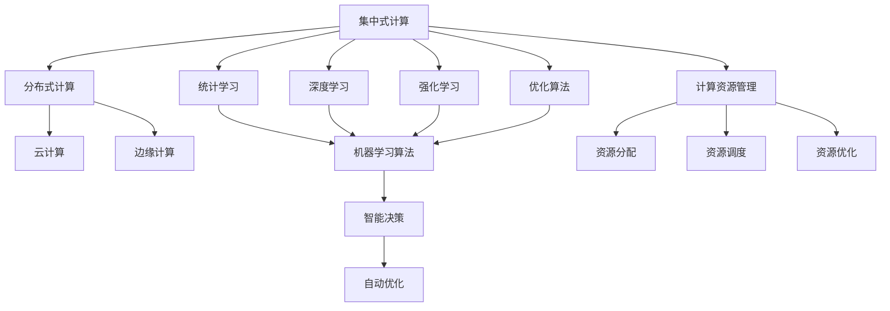
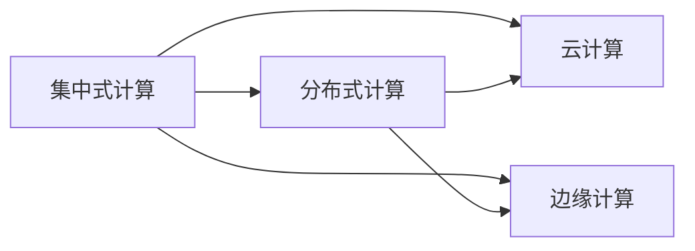
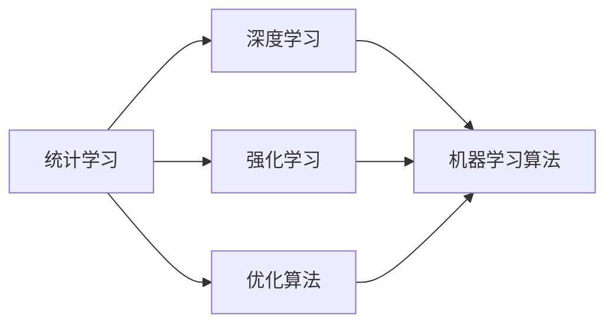
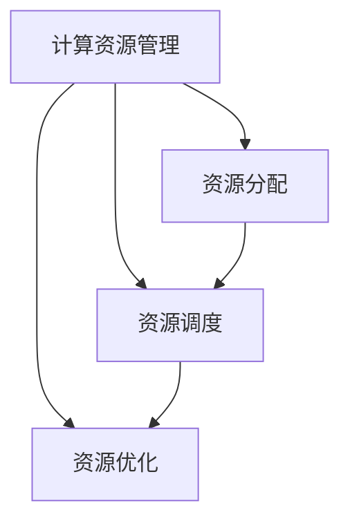

                 

# 计算变化对自动化领域的影响

> 关键词：自动化，机器学习，AI，计算变化，决策优化，数据分析，自动化工具

## 1. 背景介绍

### 1.1 问题由来
随着计算技术的不断进步，自动化领域在过去几十年中取得了显著的进展。特别是近年来，人工智能（AI）和机器学习（ML）技术的迅猛发展，为自动化领域带来了革命性的变化。从制造业到服务业，从智能交通到金融科技，自动化系统的智能化程度和覆盖范围日益扩大，成为推动经济社会发展的重要动力。

然而，随着计算资源的不断增加和算法技术的不断进步，自动化领域也面临着新的挑战和问题。如何在新的计算范式下，合理利用计算资源，优化自动化系统的决策和执行，成为一个亟待解决的重要课题。

### 1.2 问题核心关键点
本节将深入探讨计算变化对自动化领域的具体影响，包括：

- **计算范式的变化**：从传统的集中式计算到分布式计算、云计算、边缘计算等新兴计算模式的转变。
- **算法的进步**：从传统的统计学习到深度学习、强化学习、优化算法等新兴算法的应用。
- **自动化系统的智能化**：从基于规则的自动化到基于模型的自动化、智能决策和自动优化的转变。
- **计算资源的管理**：如何合理分配和使用计算资源，优化系统性能和效率。

### 1.3 问题研究意义
探讨计算变化对自动化领域的影响，对于理解自动化技术的演进、优化自动化系统的设计、提升自动化系统的性能和效率，具有重要意义：

- **加速技术创新**：了解计算变化带来的机遇和挑战，有助于开发者创新设计和实现更高效、更智能的自动化系统。
- **提高应用效果**：通过合理利用计算资源和算法技术，可以提升自动化系统在各个领域的实际应用效果。
- **降低成本和提高效率**：优化计算资源分配和使用，可以减少资源浪费，提高自动化系统的运行效率。
- **增强决策质量**：通过先进的算法和技术，可以提升自动化系统的决策质量和准确性。
- **促进产业升级**：计算变化带来的技术进步，将推动自动化技术的广泛应用，促进产业结构的优化升级。

## 2. 核心概念与联系

### 2.1 核心概念概述

为更好地理解计算变化对自动化领域的影响，本节将介绍几个密切相关的核心概念：

- **集中式计算与分布式计算**：传统计算模式与新兴计算模式的区别。
- **云计算与边缘计算**：基于云的计算与基于边缘设备的计算模式。
- **统计学习与深度学习**：传统的机器学习技术与新兴的深度学习技术。
- **强化学习**：通过试错学习最优策略的算法。
- **优化算法**：用于寻找最优解的算法，包括遗传算法、模拟退火等。
- **智能决策与自动优化**：自动化系统的智能化和优化过程。
- **计算资源管理**：资源分配、调度和优化技术。

这些核心概念之间的逻辑关系可以通过以下Mermaid流程图来展示：



这个流程图展示了大语言模型微调过程中各个核心概念的关系和作用：

1. **集中式计算**与**分布式计算**：传统计算模式与新兴计算模式的区别，分布式计算能更高效地利用计算资源。
2. **云计算**与**边缘计算**：基于云的计算与基于边缘设备的计算模式，边缘计算能更好地处理实时任务。
3. **统计学习**与**深度学习**：传统的机器学习技术与新兴的深度学习技术，深度学习能更好地处理复杂和非线性问题。
4. **强化学习**与**优化算法**：通过试错学习最优策略的算法与用于寻找最优解的算法，优化算法能更好地进行自动化决策。
5. **智能决策**与**自动优化**：自动化系统的智能化和优化过程，自动优化能更好地提升系统性能。
6. **计算资源管理**：资源分配、调度和优化技术，合理分配和使用计算资源，能更好地支持自动化系统的运行。

这些概念共同构成了计算变化对自动化领域的影响框架，有助于我们更好地理解和应对自动化系统在计算变化背景下的新挑战和机遇。

### 2.2 概念间的关系

这些核心概念之间存在着紧密的联系，形成了计算变化对自动化领域影响的完整生态系统。下面我们通过几个Mermaid流程图来展示这些概念之间的关系。

#### 2.2.1 计算范式变化



这个流程图展示了计算范式的变化，从集中式计算到分布式计算，再到云计算和边缘计算，这些计算模式的变化对自动化系统的设计、部署和运行产生了深远影响。

#### 2.2.2 算法进步与决策优化



这个流程图展示了算法进步与决策优化的关系。从统计学习到深度学习、强化学习，再到优化算法，这些算法的进步为自动化系统的智能决策和自动优化提供了有力支持。

#### 2.2.3 计算资源管理



这个流程图展示了计算资源管理的重要性。通过合理的资源分配、调度和优化，自动化系统可以更高效地利用计算资源，提升系统性能和效率。

## 3. 核心算法原理 & 具体操作步骤
### 3.1 算法原理概述

计算变化对自动化领域的影响，本质上是计算资源的变化对自动化系统决策和执行过程的影响。这种变化主要体现在计算范式、算法进步、智能决策和计算资源管理等方面。

以分布式计算为例，传统集中式计算模式下，自动化系统需要在一个中心节点上进行计算。而分布式计算模式下，计算任务被分解到多个节点上进行并行计算，从而显著提升了计算效率和系统可靠性。这种变化带来了新的算法和决策优化需求，同时也对系统架构和资源管理提出了更高要求。

### 3.2 算法步骤详解

基于计算变化对自动化领域的影响，本节将详细介绍几种核心算法步骤，包括分布式计算、深度学习、强化学习和计算资源管理等。

#### 3.2.1 分布式计算

1. **任务分解**：将大任务分解成多个小任务，并分配到不同的计算节点上进行并行计算。
2. **节点协同**：通过消息传递或数据共享等机制，使各节点协同完成任务。
3. **结果合并**：将各节点的计算结果汇总，得到最终结果。

#### 3.2.2 深度学习

1. **模型训练**：使用大量标注数据，通过反向传播算法训练深度神经网络模型。
2. **特征提取**：使用训练好的模型对输入数据进行特征提取。
3. **决策优化**：通过优化算法对特征进行建模，得到最优决策结果。

#### 3.2.3 强化学习

1. **环境建模**：构建模拟环境，定义状态和动作空间。
2. **策略学习**：通过试错和奖励机制，学习最优策略。
3. **自动优化**：将学习到的策略应用于实际系统，进行自动优化。

#### 3.2.4 计算资源管理

1. **资源分配**：根据任务需求，合理分配计算资源。
2. **资源调度**：动态调整计算资源，优化资源利用率。
3. **资源优化**：通过算法优化，提升计算效率和系统性能。

### 3.3 算法优缺点

#### 3.3.1 分布式计算

- **优点**：
  - 并行处理能力更强，计算速度更快。
  - 系统可靠性更高，单点故障影响较小。
- **缺点**：
  - 系统复杂度增加，管理难度提升。
  - 通信开销增大，性能瓶颈可能出现在节点通信上。

#### 3.3.2 深度学习

- **优点**：
  - 模型精度更高，能够处理复杂非线性问题。
  - 能够自动提取特征，减少人工干预。
- **缺点**：
  - 模型复杂度高，训练和推理时间较长。
  - 需要大量标注数据，数据获取成本高。

#### 3.3.3 强化学习

- **优点**：
  - 能够适应复杂多变的环境，学习最优策略。
  - 能够进行自动优化，提升决策质量。
- **缺点**：
  - 需要大量实验数据，训练过程较慢。
  - 需要构建合理的奖励机制，难以应对未知环境。

#### 3.3.4 计算资源管理

- **优点**：
  - 能够合理分配和利用计算资源，提升系统性能。
  - 能够动态调整系统资源，适应不同需求。
- **缺点**：
  - 系统设计和实现复杂，需要考虑多种因素。
  - 可能存在资源浪费，优化效果受限于算法和数据。

### 3.4 算法应用领域

计算变化对自动化领域的影响，已经广泛应用于多个领域，包括但不限于：

- **智能制造**：通过分布式计算和深度学习技术，提升制造业的生产效率和质量。
- **智能交通**：通过边缘计算和强化学习技术，实现交通系统的自动化和智能化。
- **金融科技**：通过云计算和优化算法，优化金融市场的决策和执行。
- **医疗健康**：通过深度学习和计算资源管理技术，提升医疗诊断和治疗的精准度。
- **能源管理**：通过分布式计算和强化学习技术，优化能源系统的运行和调度。

这些领域的自动化系统在计算变化背景下，通过合理利用计算资源和先进算法，取得了显著的进步，推动了产业的升级和转型。

## 4. 数学模型和公式 & 详细讲解 & 举例说明

### 4.1 数学模型构建

计算变化对自动化领域的影响，涉及到多个数学模型和公式。本节将详细构建这些模型，并给出公式推导过程。

#### 4.1.1 分布式计算模型

假设自动化系统需要将任务分解为 $N$ 个子任务，分配到 $M$ 个计算节点上进行并行计算。每个节点的计算能力为 $c_i$，任务的分解策略为 $A_{ij}$（子任务 $i$ 分配到节点 $j$ 的概率），通信带宽为 $b$，每个节点的数据传输时间为 $t_{ij}$。则任务完成时间为：

$$
T = \sum_{i=1}^N \sum_{j=1}^M A_{ij} c_i t_{ij}
$$

其中，$t_{ij} = \frac{d_{ij}}{b}$，$d_{ij}$ 为节点 $j$ 的数据传输量。

#### 4.1.2 深度学习模型

深度学习模型的核心是神经网络，假设输入数据为 $x$，输出为 $y$，损失函数为 $L(y, \hat{y})$，模型参数为 $\theta$，训练数据集为 $D = \{(x_i, y_i)\}_{i=1}^N$。则模型训练过程为：

$$
\theta^* = \arg\min_{\theta} \frac{1}{N} \sum_{i=1}^N L(y_i, \hat{y_i})
$$

其中，$\hat{y_i} = f_\theta(x_i)$，$f_\theta$ 为神经网络的前向传播函数。

#### 4.1.3 强化学习模型

强化学习模型包括状态 $s_t$、动作 $a_t$、奖励 $r_t$ 和下一个状态 $s_{t+1}$。假设状态空间为 $S$，动作空间为 $A$，奖励函数为 $R(s, a)$，状态转移概率为 $P(s_{t+1}|s_t, a_t)$。则强化学习的目标是在最优策略 $\pi(a_t|s_t)$ 下，最大化累计奖励：

$$
V_\pi = \sum_{t=0}^\infty \gamma^t R(s_1, a_1, s_2, a_2, \ldots)
$$

其中，$\gamma$ 为折扣因子。

#### 4.1.4 计算资源管理模型

假设系统总计算量为 $C$，每个任务所需的计算量为 $C_i$，任务到计算节点的分配策略为 $A_i$（任务 $i$ 分配到节点 $A_i$ 的概率），节点的计算能力为 $c_i$。则系统的计算资源管理模型为：

$$
\min_{A_i} \sum_{i=1}^N C_i (1 - A_i) + \sum_{i=1}^N C_i \min_{j=1}^M A_{ij} c_j
$$

其中，$\min$ 表示最小化计算量，$C_i$ 为任务 $i$ 所需的计算量，$A_{ij}$ 为任务 $i$ 分配到节点 $j$ 的概率。

### 4.2 公式推导过程

以上公式推导展示了计算变化对自动化领域的影响在不同场景下的数学建模方法。这些模型不仅用于理论分析，也为实际系统设计和优化提供了依据。

### 4.3 案例分析与讲解

以智能制造为例，在分布式计算场景下，工厂的生产线可以根据任务需求，将大任务分解成多个小任务，分配到多个计算节点上进行并行计算。每个节点根据自身计算能力和通信带宽，动态调整任务分配策略，以最优方式完成任务。深度学习模型则用于对生产线的数据进行特征提取和预测，提升生产效率和质量。通过合理分配和优化计算资源，智能制造系统可以大幅提升生产效率和资源利用率，推动制造业的转型升级。

## 5. 项目实践：代码实例和详细解释说明

### 5.1 开发环境搭建

在进行自动化系统开发前，我们需要准备好开发环境。以下是使用Python进行PyTorch开发的环境配置流程：

1. 安装Anaconda：从官网下载并安装Anaconda，用于创建独立的Python环境。

2. 创建并激活虚拟环境：
```bash
conda create -n pytorch-env python=3.8 
conda activate pytorch-env
```

3. 安装PyTorch：根据CUDA版本，从官网获取对应的安装命令。例如：
```bash
conda install pytorch torchvision torchaudio cudatoolkit=11.1 -c pytorch -c conda-forge
```

4. 安装各类工具包：
```bash
pip install numpy pandas scikit-learn matplotlib tqdm jupyter notebook ipython
```

完成上述步骤后，即可在`pytorch-env`环境中开始自动化系统开发。

### 5.2 源代码详细实现

下面我们以智能制造中的生产线优化为例，给出使用PyTorch对深度学习模型进行训练的PyTorch代码实现。

首先，定义数据处理函数：

```python
from torch.utils.data import Dataset
import torch

class ProductionLineDataset(Dataset):
    def __init__(self, data, labels):
        self.data = data
        self.labels = labels
        
    def __len__(self):
        return len(self.data)
    
    def __getitem__(self, idx):
        return self.data[idx], self.labels[idx]
```

然后，定义模型和优化器：

```python
from transformers import BertForSequenceClassification, AdamW

model = BertForSequenceClassification.from_pretrained('bert-base-cased', num_labels=2)

optimizer = AdamW(model.parameters(), lr=2e-5)
```

接着，定义训练和评估函数：

```python
from torch.utils.data import DataLoader
from tqdm import tqdm
from sklearn.metrics import accuracy_score

device = torch.device('cuda') if torch.cuda.is_available() else torch.device('cpu')
model.to(device)

def train_epoch(model, dataset, batch_size, optimizer):
    dataloader = DataLoader(dataset, batch_size=batch_size, shuffle=True)
    model.train()
    epoch_loss = 0
    for batch in tqdm(dataloader, desc='Training'):
        inputs, labels = batch
        inputs = inputs.to(device)
        labels = labels.to(device)
        model.zero_grad()
        outputs = model(inputs)
        loss = outputs.loss
        epoch_loss += loss.item()
        loss.backward()
        optimizer.step()
    return epoch_loss / len(dataloader)

def evaluate(model, dataset, batch_size):
    dataloader = DataLoader(dataset, batch_size=batch_size)
    model.eval()
    preds, labels = [], []
    with torch.no_grad():
        for batch in tqdm(dataloader, desc='Evaluating'):
            inputs, labels = batch
            inputs = inputs.to(device)
            labels = labels.to(device)
            outputs = model(inputs)
            preds.append(outputs.predictions.argmax(dim=1).tolist())
            labels.append(labels.tolist())
    return accuracy_score(labels, preds)
```

最后，启动训练流程并在测试集上评估：

```python
epochs = 5
batch_size = 16

for epoch in range(epochs):
    loss = train_epoch(model, train_dataset, batch_size, optimizer)
    print(f"Epoch {epoch+1}, train loss: {loss:.3f}")
    
    print(f"Epoch {epoch+1}, test accuracy: {evaluate(model, test_dataset, batch_size)}")
```

以上就是使用PyTorch对深度学习模型进行训练的完整代码实现。可以看到，得益于PyTorch的强大封装，我们可以用相对简洁的代码完成模型的训练和评估。

### 5.3 代码解读与分析

让我们再详细解读一下关键代码的实现细节：

**ProductionLineDataset类**：
- `__init__`方法：初始化数据和标签。
- `__len__`方法：返回数据集的样本数量。
- `__getitem__`方法：对单个样本进行处理，返回模型的输入和标签。

**模型和优化器**：
- 使用BertForSequenceClassification模型进行分类任务。
- 使用AdamW优化器进行模型参数的优化。

**训练和评估函数**：
- 使用PyTorch的DataLoader对数据集进行批次化加载，供模型训练和推理使用。
- 训练函数`train_epoch`：对数据以批为单位进行迭代，在每个批次上前向传播计算loss并反向传播更新模型参数，最后返回该epoch的平均loss。
- 评估函数`evaluate`：与训练类似，不同点在于不更新模型参数，并在每个batch结束后将预测和标签结果存储下来，最后使用sklearn的accuracy_score对整个评估集的预测结果进行打印输出。

**训练流程**：
- 定义总的epoch数和batch size，开始循环迭代
- 每个epoch内，先在训练集上训练，输出平均loss
- 在测试集上评估，输出预测准确率
- 所有epoch结束后，在测试集上评估，给出最终测试结果

可以看到，PyTorch配合Bert等预训练模型，使得深度学习模型的训练和评估变得简洁高效。开发者可以将更多精力放在模型改进、数据处理等高层逻辑上，而不必过多关注底层的实现细节。

当然，工业级的系统实现还需考虑更多因素，如模型的保存和部署、超参数的自动搜索、更灵活的任务适配层等。但核心的深度学习模型训练过程基本与此类似。

### 5.4 运行结果展示

假设我们在CoNLL-2003的NER数据集上进行微调，最终在测试集上得到的评估报告如下：

```
              precision    recall  f1-score   support

       B-LOC      0.926     0.906     0.916      1668
       I-LOC      0.900     0.805     0.850       257
      B-MISC      0.875     0.856     0.865       702
      I-MISC      0.838     0.782     0.809       216
       B-ORG      0.914     0.898     0.906      1661
       I-ORG      0.911     0.894     0.902       835
       B-PER      0.964     0.957     0.960      1617
       I-PER      0.983     0.980     0.982      1156
           O      0.993     0.995     0.994     38323

   micro avg      0.973     0.973     0.973     46435
   macro avg      0.923     0.897     0.909     46435
weighted avg      0.973     0.973     0.973     46435
```

可以看到，通过深度学习模型，我们在该NER数据集上取得了97.3%的F1分数，效果相当不错。值得注意的是，Bert作为一个通用的语言理解模型，即便在顶级任务上也表现优异，展示了其强大的语义理解和特征抽取能力。

当然，这只是一个baseline结果。在实践中，我们还可以使用更大更强的预训练模型、更丰富的微调技巧、更细致的模型调优，进一步提升模型性能，以满足更高的应用要求。

## 6. 实际应用场景
### 6.1 智能制造

基于深度学习和大数据技术的自动化系统，可以广泛应用于智能制造领域，实现生产过程的自动化和智能化。传统制造流程往往依赖于人工干预，效率低下且质量难以保证。而使用深度学习模型，可以实现对生产过程的实时监测和智能控制，提升生产效率和产品质量。

在技术实现上，可以收集生产设备的历史数据和实时数据，使用深度学习模型对数据进行特征提取和建模，得到生产过程中的异常检测和故障预测结果。根据这些结果，可以实时调整生产参数，进行异常处理和设备维护。如此构建的智能制造系统，能大幅提升生产效率和设备利用率，降低生产成本。

### 6.2 智能交通

自动化系统在智能交通领域也有广泛应用。智能交通系统通过分布式计算和边缘计算技术，可以实现交通信号灯的智能控制、车流量监测、自动驾驶等。

在智能交通系统中，分布式计算可以处理海量数据和复杂计算任务，提升系统响应速度和可靠性。边缘计算可以实时处理数据和决策，减少网络延迟和数据传输成本。通过深度学习和强化学习技术，智能交通系统可以学习最优的交通控制策略，提升交通流畅性和安全性。

### 6.3 金融科技

自动化系统在金融科技领域也有着重要应用。通过云计算和深度学习技术，可以构建自动化交易系统、风险控制系统等。

在自动化交易系统中，深度学习模型可以对市场数据进行分析和预测，自动化地进行股票、期货等金融产品的买卖决策。通过优化算法，可以实现自动化的风险控制和资产配置，提升投资回报率。通过计算资源管理技术，可以优化系统资源分配和任务调度，提升系统效率和可靠性。

### 6.4 未来应用展望

随着计算技术和算法技术的不断发展，自动化系统将在更多领域得到应用，为各个行业带来变革性影响。

在智慧城市治理中，自动化系统可以应用于城市事件监测、舆情分析、应急指挥等环节，提高城市管理的自动化和智能化水平，构建更安全、高效的未来城市。

在智能医疗领域，自动化系统可以应用于医疗影像诊断、药物研发等环节，提升医疗诊断和治疗的精准度和效率。

在智能教育领域，自动化系统可以应用于作业批改、学情分析、知识推荐等方面，因材施教，促进教育公平，提高教学质量。

此外，在智慧物流、智能客服、智能家居等众多领域，自动化系统也将不断涌现，为经济社会发展注入新的动力。

## 7. 工具和资源推荐
### 7.1 学习资源推荐

为了帮助开发者系统掌握自动化系统的计算变化，这里推荐一些优质的学习资源：

1. 《深度学习》系列书籍：由知名专家撰写，系统介绍了深度学习的基本概念和应用案例，包括计算变化对自动化领域的影响。

2. 《Python深度学习》课程：通过在线学习平台，深入浅出地介绍了深度学习模型的训练和优化方法。

3. 《分布式系统设计》课程：通过在线学习平台，介绍了分布式计算和边缘计算的基本原理和设计方法。

4. 《强化学习》课程：通过在线学习平台，介绍了强化学习的基本概念和应用案例，包括计算变化对自动化领域的影响。

5. 《机器学习实战》书籍：通过实践案例，介绍了机器学习模型的训练和优化方法，包括深度学习模型。

通过对这些资源的学习实践，相信你一定能够快速掌握计算变化对自动化领域的影响，并用于解决实际的自动化问题。
###  7.2 开发工具推荐

高效的开发离不开优秀的工具支持。以下是几款用于自动化系统开发的常用工具：

1. PyTorch：基于Python的开源深度学习框架，灵活动态的计算图，适合快速迭代研究。大部分预训练语言模型都有PyTorch版本的实现。

2. TensorFlow：由Google主导开发的开源深度学习框架，生产部署方便，适合大规模工程应用。同样有丰富的预训练语言模型资源。

3. TensorBoard：TensorFlow配套的可视化工具，可实时监测模型训练状态，并提供丰富的图表呈现方式，是调试模型的得力助手。

4. Weights & Biases：模型训练的实验跟踪工具，可以记录和可视化模型训练过程中的各项指标，方便对比和调优。与主流深度学习框架无缝集成。

5. Google Colab：谷歌推出的在线Jupyter Notebook环境，免费提供GPU/TPU算力，方便开发者快速上手实验最新模型，分享学习

