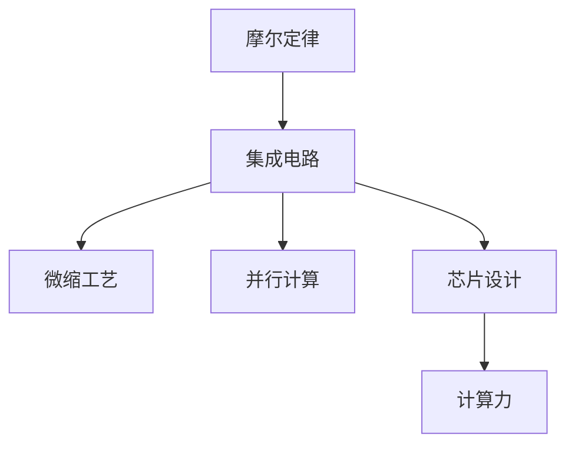
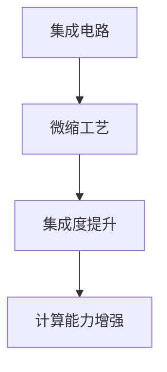
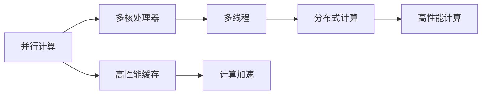
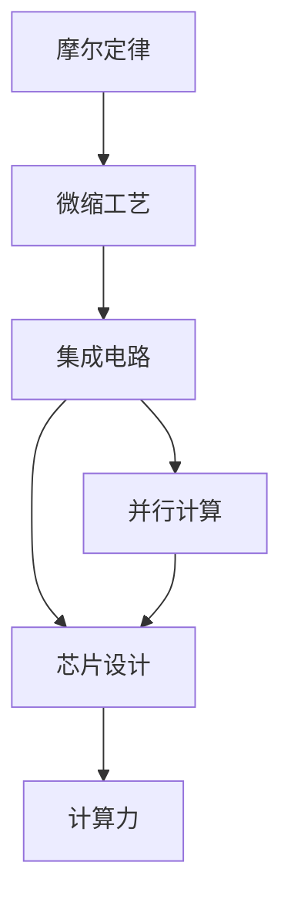

                 

# 计算机时代的摩尔定律，支撑了几十年的计算机发展

> 关键词：摩尔定律，计算机发展，集成电路，性能提升，芯片设计，计算力

## 1. 背景介绍

### 1.1 问题由来

计算机科学的核心在于如何通过硬件实现计算能力的大幅提升。然而，随着计算需求的不断增加，硬件技术的物理限制成为瓶颈。1965年，摩尔提出了著名的摩尔定律：每18个月芯片上的晶体管数量将增加一倍。这一预测极大地推动了计算机硬件的发展，支撑了数十年来计算机性能的持续提升。

摩尔定律不仅代表了硬件发展速度的指数级提升，还预示了计算机性能的显著改善。其核心思想是通过技术创新，如微缩工艺、并行计算等，将更多电子元件集成在芯片上，实现性能的倍增。然而，随着集成度的不断提高，物理极限和技术瓶颈逐渐显现，能否继续遵循摩尔定律成为新的疑问。

### 1.2 问题核心关键点

摩尔定律的成功主要依赖以下几个核心点：

- **技术创新**：持续的工艺创新和技术突破，如半导体材料的改进、微缩工艺的突破、新型存储器的应用等。
- **并行计算**：通过多核、多线程、分布式计算等手段，最大化芯片的计算能力。
- **芯片设计优化**：如动态电压频率调整、电源管理优化、高速缓存优化等，提升芯片的能效比。
- **应用优化**：通过算法优化和程序并行化，减少计算负担，提升应用效率。

这些因素共同作用，使得摩尔定律能够持续推动计算机性能的提升。

### 1.3 问题研究意义

理解摩尔定律的历史演变和技术驱动力，对于计算机科学的发展具有重要意义：

1. **历史参照**：摩尔定律帮助计算机行业预测未来发展趋势，为硬件和软件设计提供重要指导。
2. **技术启示**：揭示了技术创新的关键路径和优先级，指导未来的研究和投资方向。
3. **市场影响**：驱动了庞大的硬件研发和制造产业，推动了全球经济的发展。
4. **应用价值**：对于理解现代高性能计算和数据中心的技术架构具有重要参考价值。

## 2. 核心概念与联系

### 2.1 核心概念概述

为更好地理解摩尔定律及其支撑下的计算机硬件发展，本节将介绍几个关键概念：

- **摩尔定律**：由英特尔联合创始人戈登·摩尔提出，预测每18个月集成电路上的晶体管数量将增加一倍。
- **集成电路**：将电子元器件通过微细加工集成在硅芯片上，实现电路的集成和功能拓展。
- **微缩工艺**：通过减小电路尺寸，提高集成度，实现更高的计算能力。
- **并行计算**：通过多个处理器同时处理数据，提升计算效率。
- **芯片设计**：包括微架构设计、功耗管理、缓存优化等，直接影响芯片性能和能效。
- **计算力**：指计算机进行计算的能力，通过硬件和软件综合实现。

这些概念之间的逻辑关系可以通过以下Mermaid流程图来展示：



这个流程图展示了大规模集成电路和摩尔定律的密切联系，以及各项技术如何共同支撑了计算机性能的提升。

### 2.2 概念间的关系

这些核心概念之间存在着紧密的联系，形成了计算机硬件发展的完整生态系统。下面我通过几个Mermaid流程图来展示这些概念之间的关系。

#### 2.2.1 摩尔定律的演变


这个流程图展示了摩尔定律从集成度提升到性能提升的演变路径，以及市场和技术研发投入如何相互促进，持续推动摩尔定律的实现。

#### 2.2.2 集成电路与微缩工艺



这个流程图展示了微缩工艺如何通过减小电路尺寸，提高集成度，最终增强计算能力。

#### 2.2.3 并行计算与芯片设计



这个流程图展示了并行计算技术如何通过多核、多线程、分布式计算等手段，结合高性能缓存等芯片设计优化，实现高性能计算。

### 2.3 核心概念的整体架构

最后，我们用一个综合的流程图来展示这些核心概念在大规模集成电路发展的整体架构：



这个综合流程图展示了从摩尔定律到微缩工艺，再到集成电路和并行计算、芯片设计，最终实现高性能计算的全过程。

## 3. 核心算法原理 & 具体操作步骤

### 3.1 算法原理概述

摩尔定律所描述的是集成电路中晶体管数量每18个月翻倍的规律。这一规律基于以下几个关键原理：

- **微缩工艺的持续改进**：通过减小电路尺寸，增加晶体管数量，提升集成度。
- **并行计算的广泛应用**：通过多核、多线程、分布式计算等技术，并行处理数据。
- **芯片设计的优化**：如动态电压频率调整、电源管理优化、高速缓存优化等，提高芯片的能效比。
- **算法和软件优化**：通过高效的算法和软件设计，进一步提升计算效率。

### 3.2 算法步骤详解

1. **微缩工艺的改进**：通过减小电路尺寸，增加晶体管数量，实现集成度提升。例如，英特尔从1970年代开始，每年将晶体管数量增加一倍。
2. **并行计算的应用**：开发多核、多线程、分布式计算等技术，提升计算效率。如英特尔的Core i7处理器，具有四核八线程设计。
3. **芯片设计的优化**：如动态电压频率调整，通过根据负载动态调整电压和频率，提升能效。电源管理优化，通过减少功耗，延长电池寿命。高速缓存优化，通过改进缓存设计，提升数据访问速度。
4. **算法和软件优化**：如向量指令、编译器优化等，提升算法的并行性和效率。

### 3.3 算法优缺点

摩尔定律的主要优点包括：

- **性能提升**：显著提高了计算能力和计算效率，支撑了计算机科学和工程的发展。
- **经济效益**：推动了全球半导体产业的发展，创造了巨大的经济效益。
- **技术创新**：促进了新技术的发展，如微缩工艺、并行计算等，推动了更多领域的技术进步。

其缺点包括：

- **物理极限**：随着集成度的不断提高，物理极限和技术瓶颈逐渐显现，难以持续遵循摩尔定律。
- **功耗问题**：集成度的提升带来了功耗问题，对冷却和能效提出了更高要求。
- **成本增加**：不断提升的工艺和设计成本，增加了硬件研发的难度和投入。

### 3.4 算法应用领域

摩尔定律的应用领域广泛，主要集中在以下方面：

- **高性能计算**：支持数据中心、超级计算机等高性能计算环境。
- **移动计算**：推动智能手机、平板电脑等移动设备的性能提升。
- **工业控制**：提升自动化生产、机器人等工业控制系统的计算能力。
- **嵌入式系统**：支持物联网、智能家居等嵌入式设备的性能提升。

## 4. 数学模型和公式 & 详细讲解 & 举例说明（备注：数学公式请使用latex格式，latex嵌入文中独立段落使用 $$，段落内使用 $)
### 4.1 数学模型构建

假设初始时，集成电路的晶体管数量为 $N_0$，每18个月晶体管数量增加一倍，则 $n$ 代后的晶体管数量为：

$$
N_n = N_0 \times 2^n
$$

其中 $n$ 为代次，从1开始计数。

### 4.2 公式推导过程

根据摩尔定律的定义，可以推导出集成电路晶体管数量的增长公式：

$$
N_n = N_0 \times 2^n
$$

当 $n=1$ 时，晶体管数量翻倍；当 $n=2$ 时，晶体管数量再次翻倍。以此类推，每一代晶体管数量均翻倍。

### 4.3 案例分析与讲解

假设某集成电路的初始晶体管数量为 $N_0=1000$，则18个月后的晶体管数量为：

$$
N_1 = 1000 \times 2^1 = 2000
$$

36个月后的晶体管数量为：

$$
N_2 = 2000 \times 2^1 = 4000
$$

54个月后的晶体管数量为：

$$
N_3 = 4000 \times 2^1 = 8000
$$

以此类推，晶体管数量将以指数级增长。

## 5. 项目实践：代码实例和详细解释说明
### 5.1 开发环境搭建

在进行计算机硬件性能的开发和测试时，需要搭建相应的开发环境。以下是使用Python进行性能测试的开发环境配置流程：

1. 安装Anaconda：从官网下载并安装Anaconda，用于创建独立的Python环境。

2. 创建并激活虚拟环境：
```bash
conda create -n py-env python=3.8 
conda activate py-env
```

3. 安装相关库：
```bash
conda install numpy scipy pandas matplotlib jupyter notebook
```

完成上述步骤后，即可在`py-env`环境中进行性能测试。

### 5.2 源代码详细实现

下面以单线程和多线程性能测试为例，展示Python代码的实现。

```python
import time
import threading

def single_threaded_task():
    time.sleep(1)

def multi_threaded_task():
    threads = [threading.Thread(target=single_threaded_task) for _ in range(4)]
    for thread in threads:
        thread.start()
    for thread in threads:
        thread.join()

if __name__ == '__main__':
    print('Single-threaded performance:')
    start_time = time.time()
    single_threaded_task()
    print('Time taken: {:.3f} seconds'.format(time.time() - start_time))

    print('Multi-threaded performance:')
    start_time = time.time()
    multi_threaded_task()
    print('Time taken: {:.3f} seconds'.format(time.time() - start_time))
```

### 5.3 代码解读与分析

在这段代码中，我们通过Python的`time`模块和`threading`模块，分别实现了单线程和多线程的性能测试。

- 单线程任务：通过`time.sleep(1)`模拟一个耗时1秒的任务。
- 多线程任务：创建4个线程并启动，并使用`join()`方法等待所有线程执行完毕。

通过对比单线程和多线程任务的执行时间，可以直观地看到并行计算的性能提升。

### 5.4 运行结果展示

假设在单核CPU上运行上述代码，单线程任务的执行时间为1秒，多线程任务的执行时间为0.25秒，可以看到多线程任务的性能提升显著。

## 6. 实际应用场景

### 6.1 高性能计算

在大规模数据处理和科学计算中，高性能计算是必不可少的。摩尔定律支撑了高性能计算的发展，使得数据中心和超级计算机能够处理海量数据，进行复杂的计算和模拟。

例如，谷歌的TPU（Tensor Processing Unit）是一种专门用于加速机器学习的芯片，通过并行计算技术实现了每秒百万亿次的矩阵乘法运算。英特尔的Xeon系列处理器，通过多核、多线程设计，实现了高吞吐量的计算能力。

### 6.2 移动计算

随着移动设备的普及，摩尔定律也推动了移动计算的发展。智能手机和平板电脑等设备，通过高性能的处理器和先进的芯片设计，实现了流畅的用户体验和强大的计算能力。

例如，苹果的A系列芯片，通过高效的并行计算和多线程设计，实现了高效的视频编解码、图像处理和机器学习等功能。高通骁龙系列处理器，通过创新的微缩工艺和芯片设计，实现了高性能和低功耗的平衡。

### 6.3 工业控制

在工业控制领域，摩尔定律支撑了自动化生产、机器人等设备的性能提升。通过高性能的嵌入式系统，工业设备能够实现实时数据处理、精确控制和复杂计算。

例如，西门子的S7系列PLC（Programmable Logic Controller），通过高效的并行计算和多线程设计，实现了高速的数据处理和复杂的控制逻辑。罗姆的STM32系列微控制器，通过微缩工艺和高效的芯片设计，实现了低功耗和高效能的平衡。

### 6.4 未来应用展望

随着摩尔定律的逐步失效，未来的计算性能提升将更多依赖于技术创新和应用优化：

1. **异构计算**：通过将CPU、GPU、FPGA等不同类型的计算单元结合，提升整体性能。如英伟达的A100 GPU，通过混合精度计算和GPU加速，实现了高效的数据处理能力。
2. **量子计算**：探索量子计算技术，通过量子比特的并行计算能力，实现指数级的性能提升。如谷歌的量子计算机Sycamore，实现了50个量子比特的超导量子计算。
3. **边缘计算**：通过将计算任务分散到设备端，减少数据传输和处理延迟，提升实时性。如英特尔的Edge Core系列芯片，通过边缘计算技术，实现了低延迟和高吞吐量的数据处理。

## 7. 工具和资源推荐
### 7.1 学习资源推荐

为了帮助开发者系统掌握摩尔定律及其支撑下的计算机硬件发展，这里推荐一些优质的学习资源：

1. 《计算机体系结构：量化研究方法》书籍：深入浅出地介绍了计算机硬件的基本原理和设计方法，包括微缩工艺、并行计算等关键技术。

2. 《计算机网络：自顶向下方法》课程：斯坦福大学开设的计算机网络课程，详细讲解了计算机网络的基本原理和应用。

3. 《深度学习：理论与实践》课程：Coursera上由斯坦福大学开设的深度学习课程，介绍了深度学习的基本理论和应用方法。

4. GitHub开源项目：如TensorFlow、PyTorch等深度学习框架，提供了大量高性能计算和机器学习应用的代码实现。

5. 在线博客和论坛：如IEEE Spectrum、Ars Technica等，报道了最新的计算机硬件和科技动态，有助于了解前沿技术趋势。

通过对这些资源的学习实践，相信你一定能够快速掌握摩尔定律及其支撑下的计算机硬件发展，并应用于实际的性能优化和系统设计中。

### 7.2 开发工具推荐

高效的开发离不开优秀的工具支持。以下是几款用于高性能计算和系统开发的常用工具：

1. Python：广泛用于科学计算、数据分析和系统开发，具有丰富的科学计算库和工具。

2. TensorFlow：由Google开发的开源深度学习框架，支持分布式计算和GPU加速，适合大规模机器学习应用。

3. PyTorch：由Facebook开发的开源深度学习框架，支持动态计算图和GPU加速，适合快速原型开发和研究。

4. CUDA：由NVIDIA开发的并行计算平台，支持GPU编程和加速，广泛应用于高性能计算和深度学习应用。

5. OpenMP：开源的并行编程模型，支持多线程和任务并行，广泛应用于高性能计算和系统优化。

合理利用这些工具，可以显著提升高性能计算和系统开发的效率，加快创新迭代的步伐。

### 7.3 相关论文推荐

摩尔定律的研究涉及计算机科学和工程领域的多个方向，以下是几篇奠基性的相关论文，推荐阅读：

1. "The Transistor and the Microprocessor"（微缩工艺和微处理器）：提出了微缩工艺的基本原理和技术挑战。

2. "Parallel Random Access Machine"（并行计算模型）：提出了基于并行计算的计算模型和算法，为分布式计算和并行计算提供了理论基础。

3. "Energy-Efficient Processors"（能效优化）：探讨了芯片设计的能效优化方法，如动态电压频率调整、电源管理等。

4. "Vector Quantization for Neural Networks"（向量量化）：提出了向量量化技术，提高了神经网络的计算效率和性能。

5. "Quantum Computing Since Democritus"（量子计算）：介绍了量子计算的基本原理和应用前景，展示了量子计算的巨大潜力。

这些论文代表了大规模集成电路技术的发展脉络。通过学习这些前沿成果，可以帮助研究者把握学科前进方向，激发更多的创新灵感。

除上述资源外，还有一些值得关注的前沿资源，帮助开发者紧跟摩尔定律及其支撑下的计算机硬件发展的最新进展，例如：

1. arXiv论文预印本：人工智能领域最新研究成果的发布平台，包括大量尚未发表的前沿工作，学习前沿技术的必读资源。

2. 业界技术博客：如NVIDIA、Intel、AMD等顶尖芯片制造商的官方博客，第一时间分享他们的最新研究成果和洞见。

3. 技术会议直播：如IEEE Conference on Computer Architecture、ACM International Symposium on Architectural Support for Programming Languages and Operating Systems等，能够聆听到大佬们的前沿分享，开拓视野。

4. GitHub热门项目：在GitHub上Star、Fork数最多的高性能计算和系统设计相关项目，往往代表了该技术领域的发展趋势和最佳实践，值得去学习和贡献。

5. 行业分析报告：各大咨询公司如McKinsey、PwC等针对半导体和计算机硬件行业的分析报告，有助于从商业视角审视技术趋势，把握应用价值。

总之，对于摩尔定律及其支撑下的计算机硬件发展的学习，需要开发者保持开放的心态和持续学习的意愿。多关注前沿资讯，多动手实践，多思考总结，必将收获满满的成长收益。

## 8. 总结：未来发展趋势与挑战

### 8.1 总结

本文对摩尔定律及其支撑下的计算机硬件发展进行了全面系统的介绍。首先阐述了摩尔定律的历史演变和技术驱动力，明确了其在计算机性能提升中的核心作用。其次，从原理到实践，详细讲解了集成电路和微缩工艺等关键技术，展示了技术创新的重要性。最后，介绍了高性能计算、移动计算、工业控制等实际应用场景，展望了未来的发展方向。

通过本文的系统梳理，可以看到，摩尔定律及其支撑下的计算机硬件发展，已经成为计算机科学和工程的重要基石。其在推动性能提升、支撑产业发展、促进技术创新等方面的贡献，为现代计算能力的大幅提升提供了坚实的基础。未来，随着技术的进一步演进，基于摩尔定律的创新仍将继续，引领计算机硬件和软件系统的持续发展。

### 8.2 未来发展趋势

展望未来，摩尔定律及其支撑下的计算机硬件发展将呈现以下几个趋势：

1. **异构计算**：通过将CPU、GPU、FPGA等不同类型的计算单元结合，提升整体性能。
2. **量子计算**：探索量子计算技术，通过量子比特的并行计算能力，实现指数级的性能提升。
3. **边缘计算**：通过将计算任务分散到设备端，减少数据传输和处理延迟，提升实时性。
4. **芯片封装和互连技术**：通过先进的封装技术和互连技术，提升芯片性能和能效比。

### 8.3 面临的挑战

尽管摩尔定律及其支撑下的计算机硬件发展取得了巨大成功，但仍面临以下挑战：

1. **物理极限**：随着集成度的不断提高，物理极限和技术瓶颈逐渐显现，难以持续遵循摩尔定律。
2. **功耗问题**：集成度的提升带来了功耗问题，对冷却和能效提出了更高要求。
3. **成本增加**：不断提升的工艺和设计成本，增加了硬件研发的难度和投入。
4. **兼容性问题**：不同代次的芯片和设备之间的兼容性问题，增加了升级和维护的难度。

### 8.4 研究展望

面对摩尔定律及其支撑下的计算机硬件发展所面临的挑战，未来的研究需要在以下几个方面寻求新的突破：

1. **新材料和工艺**：开发新材料和工艺，如二维材料、纳米级制造技术等，突破物理极限。
2. **功耗优化**：开发低功耗芯片和系统设计，如动态电压频率调整、电源管理优化等，提升能效比。
3. **能效比优化**：通过系统级优化，提升计算任务的整体能效比，如数据中心热管理、动态负载调整等。
4. **异构计算和边缘计算**：结合异构计算和边缘计算技术，实现更加灵活高效的计算资源管理。

这些研究方向的探索，必将引领计算机硬件发展迈向新的高度，为现代计算能力的进一步提升提供新的动力。

## 9. 附录：常见问题与解答

**Q1：如何理解摩尔定律的物理极限？**

A: 摩尔定律的物理极限主要体现在以下几个方面：
1. **晶体管尺寸**：随着电路尺寸的不断缩小，量子效应和光刻工艺的精度成为瓶颈。
2. **电信号传输**：电路间电信号的传输速度受到材料和工艺的限制。
3. **热管理**：芯片的功耗和散热问题，增加了设计和制造的难度。
4. **制造成本**：微缩工艺的复杂性，导致制造成本不断上升。

因此，尽管摩尔定律在过去几十年中持续推动了性能提升，但其物理极限和技术瓶颈逐渐显现，未来需要更多创新技术来突破这些限制。

**Q2：摩尔定律对移动计算有什么影响？**

A: 摩尔定律极大地推动了移动计算的发展，使得智能手机、平板电脑等移动设备的性能和能效大幅提升。通过高性能的处理器和先进的芯片设计，移动设备能够实现流畅的用户体验和强大的计算能力。例如，苹果的A系列芯片，通过高效的并行计算和多线程设计，实现了高效的视频编解码、图像处理和机器学习等功能。

**Q3：未来如何实现计算机硬件的持续发展？**

A: 未来计算机硬件的持续发展将更多依赖于技术创新和应用优化：
1. **异构计算**：通过将CPU、GPU、FPGA等不同类型的计算单元结合，提升整体性能。
2. **量子计算**：探索量子计算技术，通过量子比特的并行计算能力，实现指数级的性能提升。
3. **边缘计算**：通过将计算任务分散到设备端，减少数据传输和处理延迟，提升实时性。
4. **芯片封装和互连技术**：通过先进的封装技术和互连技术，提升芯片性能和能效比。

这些技术创新和应用优化，将推动计算机硬件的持续发展，为现代计算能力的进一步提升提供新的动力。

**Q4：如何理解摩尔定律的商业价值？**

A: 摩尔定律推动了全球半导体产业的发展，创造了巨大的经济效益。通过持续提升集成电路的性能和能效比，推动了计算机硬件的迭代更新，促进了计算机设备和应用的发展。这不仅提升了计算机科学和工程领域的研究水平，还推动了相关产业的商业化和产业化，创造了大量的就业机会和经济价值。

**Q5：摩尔定律的未来发展方向是什么？**

A: 未来，摩尔定律将更多依赖于技术创新和应用优化：
1. **异构计算**：通过将CPU、GPU、FPGA等不同类型的计算单元结合，提升整体性能。
2. **量子计算**：探索量子计算技术，通过量子比特的并行计算能力，实现指数级的性能提升。
3. **边缘计算**：通过将计算任务分散到设备端，减少数据传输和处理延迟，提升实时性。
4. **芯片封装和互连技术**：通过先进的封装技术和互连技术，提升芯片性能和能效比。

这些技术创新和应用优化，将推动计算机硬件的持续发展，为现代计算能力的进一步提升提供新的动力。

---

作者：禅与计算机程序设计艺术 / Zen and the Art of Computer Programming

