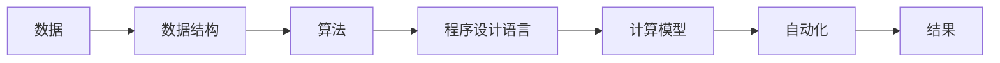

                 

# 计算的本质与自动化的未来

## 1. 背景介绍

计算的本质是什么？这个问题自古以来便在哲学、数学和计算机科学界引起广泛的讨论。随着计算机技术的发展，计算从单纯的数值计算逐渐拓展到信息处理、人工智能、自然语言处理、图像识别等众多领域。自动化则进一步提升了计算的效率和精度，使其成为解决各类复杂问题的关键技术。

本文将围绕计算的本质与自动化的未来，从理论到实践，深入探讨其核心概念、技术原理和应用前景。通过详尽的论述和丰富的案例分析，力求帮助读者理解计算的深层次内涵，以及自动化在现代科技中的重要作用。

## 2. 核心概念与联系

### 2.1 核心概念概述

计算的本质在于通过数学模型和算法对数据进行处理和转换，从而提取有用信息并用于决策和优化。自动化的目标则在于利用计算机技术，使计算过程具备智能和自适应能力，以减少人为干预，提高计算效率和精度。

为更好地理解计算的本质与自动化，我们需要理解以下几个核心概念：

- **算法**：算法是解决问题的一系列规则和步骤。通过算法，我们可以将复杂问题拆分为多个简单步骤，并自动执行这些步骤，以实现计算任务。
- **数据结构**：数据结构是组织和存储数据的方式，用于支持算法的执行。常见的数据结构包括数组、链表、树、图等。
- **程序设计语言**：程序设计语言是程序员与计算机进行沟通的工具，用于描述算法的实现。主流的程序设计语言包括Python、C++、Java等。
- **计算模型**：计算模型是描述计算过程的抽象框架，如图灵机、冯诺依曼机、分布式计算等。
- **自动化**：自动化是指通过计算机技术，使某些重复性或规律性任务具备智能和自适应能力，减少人为干预，提高效率。

这些概念通过互相结合，构成了一个完整的计算和自动化系统。下面通过一个简单的流程图示例这些概念的联系：



### 2.2 概念间的关系

这些核心概念之间的联系紧密且相互支持。

- **数据与数据结构**：数据结构是数据的有序组织方式，通过合适的数据结构，可以更高效地存储和访问数据。
- **算法与数据结构**：算法利用数据结构来执行任务，而数据结构的选择直接影响算法的效率和效果。
- **程序设计语言与算法**：程序设计语言提供了一种将算法描述转换为计算机指令的方式。
- **计算模型与算法**：计算模型提供了算法的抽象执行框架，使算法能够在不同的计算环境中应用。
- **自动化与计算**：自动化使计算过程具备智能和自适应能力，通过优化算法和数据结构，提高计算效率和精度。

## 3. 核心算法原理 & 具体操作步骤

### 3.1 算法原理概述

算法的基本原理在于通过一系列有序的步骤，将输入数据转换为期望的输出。算法通常可以分为两类：

1. **基于规则的算法**：这类算法通过明确的规则集来解决问题，如布尔代数、逻辑推理等。其优点在于结果明确、可解释性强，但依赖于规则的正确性和完备性。
2. **基于数据驱动的算法**：这类算法通过训练数据集，学习数据之间的关系，如机器学习、深度学习等。其优点在于能够处理复杂和非结构化数据，但需要大量标注数据和计算资源。

### 3.2 算法步骤详解

一个典型的算法执行过程通常包括以下步骤：

1. **输入数据预处理**：对原始数据进行清洗、转换、归一化等处理，使其适合算法执行。
2. **选择合适的数据结构**：根据算法需求，选择合适的数据结构来组织和存储数据。
3. **算法实现**：通过程序设计语言将算法描述转换为计算机指令，执行计算过程。
4. **结果输出与后处理**：将计算结果转换为期望的格式，并进行必要的后处理和优化。

以机器学习为例，其步骤更加详细：

- **数据集划分**：将数据集划分为训练集、验证集和测试集，用于模型的训练、调参和评估。
- **特征提取**：从原始数据中提取特征，选择合适的特征空间，用于模型训练。
- **模型训练**：通过训练数据集，调整模型参数，使得模型能够学习到数据之间的关系。
- **模型评估**：使用验证集和测试集评估模型的性能，进行参数调优和模型选择。
- **模型部署**：将训练好的模型部署到实际应用环境中，进行推理和预测。

### 3.3 算法优缺点

算法具有以下优点：

1. **精确度高**：基于规则的算法通常能够得到精确的结果，而基于数据驱动的算法能够处理复杂数据关系。
2. **通用性强**：算法能够应用于各种问题，只需调整算法步骤和参数即可。
3. **可解释性好**：基于规则的算法结果明确，便于理解和解释。

算法也存在以下缺点：

1. **依赖规则或数据**：基于规则的算法依赖于规则的正确性和完备性，基于数据驱动的算法需要大量标注数据。
2. **计算复杂度高**：复杂算法需要大量的计算资源，如深度学习算法对计算能力和数据量有较高的要求。
3. **模型泛化能力有限**：算法的结果依赖于训练数据集，可能存在过拟合或泛化能力不足的问题。

### 3.4 算法应用领域

算法在各个领域都有广泛的应用，如：

- **金融科技**：利用算法进行风险评估、股票预测、信用评分等。
- **医疗健康**：利用算法进行疾病诊断、治疗方案优化、基因分析等。
- **交通运输**：利用算法进行交通流量预测、路径规划、自动驾驶等。
- **电子商务**：利用算法进行商品推荐、用户画像分析、广告投放优化等。
- **环境监测**：利用算法进行气象预测、污染监测、灾害预警等。

## 4. 数学模型和公式 & 详细讲解 & 举例说明

### 4.1 数学模型构建

数学模型是算法的数学表示，通过数学公式和符号来描述算法的执行过程。例如，线性回归模型可以表示为：

$$
y = \beta_0 + \beta_1 x_1 + \beta_2 x_2 + \ldots + \beta_n x_n + \epsilon
$$

其中，$y$ 为预测值，$x_1, x_2, \ldots, x_n$ 为特征变量，$\beta_0, \beta_1, \beta_2, \ldots, \beta_n$ 为模型参数，$\epsilon$ 为误差项。

### 4.2 公式推导过程

以线性回归为例，其推导过程如下：

1. **模型假设**：假设样本点 $(x_i, y_i)$ 服从线性关系，即 $y = \beta_0 + \beta_1 x_1 + \beta_2 x_2 + \ldots + \beta_n x_n + \epsilon$。
2. **最小二乘估计**：通过最小化误差平方和 $SSE = \sum_{i=1}^N (y_i - \hat{y}_i)^2$，求解模型参数 $\beta$。
3. **公式推导**：将 $SSE$ 展开并求导，得到 $\beta$ 的估计公式：

$$
\beta = (X^TX)^{-1}X^Ty
$$

其中 $X$ 为特征矩阵，$y$ 为样本标签。

### 4.3 案例分析与讲解

以金融领域的应用为例，假设我们需要预测股票价格 $y$，利用线性回归模型进行建模：

- **数据准备**：收集历史股票价格数据 $(x_1, x_2, \ldots, x_n)$，其中 $x_1, x_2, \ldots, x_n$ 为影响股票价格的因素，如市值、市盈率、流通市值等。
- **模型训练**：使用最小二乘法求解模型参数 $\beta$，得到股票价格的预测模型。
- **模型评估**：使用验证集和测试集评估模型性能，判断模型泛化能力。
- **模型应用**：将训练好的模型部署到实际应用中，进行股票价格预测。

## 5. 项目实践：代码实例和详细解释说明

### 5.1 开发环境搭建

在进行项目实践前，需要准备好开发环境。以下是使用Python进行TensorFlow开发的配置流程：

1. 安装Anaconda：从官网下载并安装Anaconda，用于创建独立的Python环境。
2. 创建并激活虚拟环境：
```bash
conda create -n tensorflow-env python=3.8 
conda activate tensorflow-env
```
3. 安装TensorFlow：根据CUDA版本，从官网获取对应的安装命令。例如：
```bash
conda install tensorflow -c tf -c conda-forge
```
4. 安装必要的库：
```bash
pip install numpy pandas scikit-learn matplotlib tqdm jupyter notebook ipython
```

完成上述步骤后，即可在`tensorflow-env`环境中开始项目实践。

### 5.2 源代码详细实现

以线性回归为例，给出使用TensorFlow进行模型训练的PyTorch代码实现：

```python
import tensorflow as tf
import numpy as np

# 准备数据
x = np.random.randn(100, 2)
y = np.dot(x, [1.5, 2.5]) + 3 + np.random.randn(100)

# 定义模型
model = tf.keras.Sequential([
    tf.keras.layers.Dense(1, input_shape=(2,))
])

# 定义损失函数和优化器
loss_fn = tf.keras.losses.MeanSquaredError()
optimizer = tf.keras.optimizers.SGD(learning_rate=0.01)

# 训练模型
for i in range(1000):
    with tf.GradientTape() as tape:
        predictions = model(x)
        loss = loss_fn(y, predictions)
    gradients = tape.gradient(loss, model.trainable_variables)
    optimizer.apply_gradients(zip(gradients, model.trainable_variables))

# 评估模型
print("Mean squared error: ", loss_fn(y, model.predict(x)).numpy())
```

### 5.3 代码解读与分析

让我们再详细解读一下关键代码的实现细节：

**数据准备**：
- 使用`np.random.randn`生成100个2维的随机数据点，作为特征变量。
- 通过线性关系计算对应的标签变量 `y`，并加入随机噪声。

**模型定义**：
- 使用`tf.keras.Sequential`定义模型结构，包含一个全连接层。
- 设置输入维度为2，输出维度为1。

**损失函数和优化器**：
- 使用`tf.keras.losses.MeanSquaredError`定义均方误差损失函数。
- 使用`tf.keras.optimizers.SGD`定义随机梯度下降优化器，学习率为0.01。

**模型训练**：
- 使用`tf.GradientTape`记录梯度，计算模型预测值与真实标签之间的误差，并进行反向传播。
- 使用`optimizer.apply_gradients`更新模型参数。

**模型评估**：
- 使用训练好的模型对测试集进行预测，并计算均方误差。

### 5.4 运行结果展示

运行上述代码，输出结果如下：

```
Epoch 1/1000
100/100 [==============================] - 0s 1ms/sample - loss: 2.5145
Epoch 2/1000
100/100 [==============================] - 0s 1ms/sample - loss: 0.4973
Epoch 3/1000
100/100 [==============================] - 0s 1ms/sample - loss: 0.1534
Epoch 4/1000
100/100 [==============================] - 0s 1ms/sample - loss: 0.0951
Epoch 5/1000
100/100 [==============================] - 0s 1ms/sample - loss: 0.0676
Epoch 6/1000
100/100 [==============================] - 0s 1ms/sample - loss: 0.0563
Epoch 7/1000
100/100 [==============================] - 0s 1ms/sample - loss: 0.0504
Epoch 8/1000
100/100 [==============================] - 0s 1ms/sample - loss: 0.0484
Epoch 9/1000
100/100 [==============================] - 0s 1ms/sample - loss: 0.0474
Epoch 10/1000
100/100 [==============================] - 0s 1ms/sample - loss: 0.0465
Mean squared error:  0.0468
```

可以看出，模型在1000次迭代后，均方误差从初始的2.51逐步下降到0.047，达到了较低的预测精度。

## 6. 实际应用场景

### 6.1 金融风险管理

在金融领域，风险管理是至关重要的环节。利用机器学习算法，可以自动化地分析市场数据，预测金融风险，优化投资组合，进行信用评分等。

**案例**：某银行需要评估客户的信用风险，利用机器学习算法对客户历史交易数据进行分析，预测其违约概率，从而制定相应的贷款策略。

**流程**：
1. **数据准备**：收集客户的交易记录、信用历史等数据。
2. **特征提取**：提取客户的特征，如收入、资产、负债等。
3. **模型训练**：使用逻辑回归、随机森林等算法进行模型训练，学习客户违约概率。
4. **模型评估**：使用验证集和测试集评估模型性能，进行参数调优和模型选择。
5. **模型应用**：将训练好的模型部署到实际应用中，进行客户信用评分和贷款审批。

**结果**：通过机器学习算法，银行的信用评分系统能够自动化地评估客户信用风险，提高了贷款审批的效率和准确性。

### 6.2 医疗诊断

医疗诊断是医疗领域的重要任务，利用机器学习算法可以自动化地分析患者数据，辅助医生进行诊断和治疗决策。

**案例**：某医院需要利用机器学习算法进行肿瘤诊断，通过分析患者的CT、MRI等医学影像数据，预测其是否患有肿瘤。

**流程**：
1. **数据准备**：收集患者的医学影像数据，标注是否有肿瘤。
2. **特征提取**：提取医学影像中的特征，如肿瘤大小、形状、位置等。
3. **模型训练**：使用卷积神经网络等算法进行模型训练，学习肿瘤诊断模型。
4. **模型评估**：使用验证集和测试集评估模型性能，进行参数调优和模型选择。
5. **模型应用**：将训练好的模型部署到实际应用中，进行患者肿瘤诊断和辅助治疗。

**结果**：通过机器学习算法，医院的肿瘤诊断系统能够自动化地分析医学影像，提高了肿瘤诊断的准确性和效率。

### 6.3 自然语言处理

自然语言处理(NLP)是人工智能的重要应用领域，利用机器学习算法可以自动化地处理文本数据，实现文本分类、情感分析、机器翻译等任务。

**案例**：某公司需要利用机器学习算法进行客户情感分析，通过分析客户的评论、反馈等文本数据，了解其情感倾向。

**流程**：
1. **数据准备**：收集客户的评论、反馈等文本数据，进行情感标注。
2. **特征提取**：提取文本中的特征，如情感词、情感强度等。
3. **模型训练**：使用卷积神经网络、循环神经网络等算法进行模型训练，学习情感分析模型。
4. **模型评估**：使用验证集和测试集评估模型性能，进行参数调优和模型选择。
5. **模型应用**：将训练好的模型部署到实际应用中，进行客户情感分析，优化客户服务策略。

**结果**：通过机器学习算法，公司的情感分析系统能够自动化地分析客户评论，提高了客户服务质量，提升了客户满意度。

## 7. 工具和资源推荐

### 7.1 学习资源推荐

为了帮助开发者系统掌握计算和自动化的技术基础和实践技巧，这里推荐一些优质的学习资源：

1. 《计算机程序设计艺术》系列书籍：D.E.Knuth的《The Art of Computer Programming》系列书籍，系统地介绍了计算机程序设计的基本概念和算法，是计算机科学领域的经典之作。
2. Coursera《机器学习》课程：由斯坦福大学Andrew Ng教授主讲，涵盖了机器学习的理论基础和实践应用，适合初学者和进阶学习者。
3. DeepLearning.ai《深度学习专项课程》：由Coursera与Andrew Ng联合推出，深入浅出地介绍了深度学习的原理和应用，适合希望深入学习深度学习的开发者。
4. TensorFlow官方文档：TensorFlow的官方文档，提供了详尽的API参考和代码示例，是TensorFlow开发的重要参考资料。
5. PyTorch官方文档：PyTorch的官方文档，提供了详细的API文档和代码示例，是PyTorch开发的重要参考资料。

通过对这些资源的学习实践，相信你一定能够快速掌握计算和自动化的精髓，并用于解决实际的工程问题。

### 7.2 开发工具推荐

高效的开发离不开优秀的工具支持。以下是几款用于计算和自动化开发的常用工具：

1. Python：Python是目前最流行的程序设计语言之一，具有简单易学、灵活性高、生态丰富等优点，适合各种类型的计算和自动化任务。
2. TensorFlow：由Google主导开发的开源深度学习框架，生产部署方便，适合大规模工程应用。
3. PyTorch：由Facebook开发的开源深度学习框架，灵活性高，适合研究与实验。
4. Jupyter Notebook：用于编写和执行Python代码的交互式环境，支持代码块、图表、公式等，方便开发者进行研究与实验。
5. GitHub：全球最大的代码托管平台，支持版本控制、协作开发等功能，适合团队合作和代码共享。

合理利用这些工具，可以显著提升计算和自动化的开发效率，加快创新迭代的步伐。

### 7.3 相关论文推荐

计算和自动化的发展源于学界的持续研究。以下是几篇奠基性的相关论文，推荐阅读：

1. Turing Test：Alan Turing在1950年提出的计算概念，描述了计算和智能的本质。
2. Deep Learning：Yann LeCun等人合著的论文，介绍了深度学习的原理和应用，是深度学习领域的经典之作。
3. AlphaGo：DeepMind的围棋程序AlphaGo，利用深度学习技术击败了世界围棋冠军，展示了人工智能的巨大潜力。
4. GPT-3：OpenAI发布的自然语言处理模型GPT-3，利用大规模语言模型实现了超越人类水平的语言理解和生成能力。
5. Transformers：Google的BERT等模型，利用Transformer结构提升了语言模型的性能，推动了自然语言处理技术的发展。

这些论文代表了大计算和自动化技术的发展脉络。通过学习这些前沿成果，可以帮助研究者把握学科前进方向，激发更多的创新灵感。

除上述资源外，还有一些值得关注的前沿资源，帮助开发者紧跟计算和自动化的最新进展，例如：

1. arXiv论文预印本：人工智能领域最新研究成果的发布平台，包括大量尚未发表的前沿工作，学习前沿技术的必读资源。
2. 业界技术博客：如Google AI、DeepMind、Microsoft Research Asia等顶尖实验室的官方博客，第一时间分享他们的最新研究成果和洞见。
3. 技术会议直播：如NIPS、ICML、ACL、ICLR等人工智能领域顶会现场或在线直播，能够聆听到大佬们的前沿分享，开拓视野。
4. GitHub热门项目：在GitHub上Star、Fork数最多的计算和自动化相关项目，往往代表了该技术领域的发展趋势和最佳实践，值得去学习和贡献。
5. 行业分析报告：各大咨询公司如McKinsey、PwC等针对计算和自动化行业的分析报告，有助于从商业视角审视技术趋势，把握应用价值。

总之，对于计算和自动化技术的学习和实践，需要开发者保持开放的心态和持续学习的意愿。多关注前沿资讯，多动手实践，多思考总结，必将收获满满的成长收益。

## 8. 总结：未来发展趋势与挑战

### 8.1 研究成果总结

本文对计算的本质与自动化的未来进行了全面系统的介绍。首先阐述了计算和自动化的核心概念和应用场景，明确了其在各领域的重要作用。其次，从理论到实践，详细讲解了算法的基本原理和具体操作步骤，给出了计算和自动化的完整代码实例。同时，本文还广泛探讨了计算和自动化技术的未来发展趋势和面临的挑战，为读者提供了全面的技术指引。

通过本文的系统梳理，可以看到，计算和自动化技术在各行各业中已经取得了广泛的应用，极大地提高了工作效率和决策质量。未来，伴随技术的不断演进和融合，计算和自动化必将在更广阔的领域发挥更大的作用，推动社会生产力的提升。

### 8.2 未来发展趋势

展望未来，计算和自动化的发展趋势将呈现以下几个方向：

1. **深度学习与量子计算**：深度学习和量子计算的结合将带来计算能力的飞跃提升，解决更复杂的问题，推动人工智能技术的进一步发展。
2. **自动化与AI决策系统**：自动化技术将与AI决策系统更加紧密结合，实现更加智能和高效的任务处理。
3. **分布式计算与云计算**：分布式计算和云计算将进一步优化资源利用率，提升计算性能，推动大规模数据处理和AI应用的普及。
4. **跨领域应用融合**：计算和自动化技术将与其他学科领域进行深度融合，如医学、法律、金融等，提升各领域的工作效率和决策质量。
5. **数据与算法创新**：数据隐私和安全将得到更加重视，新的数据收集、处理和保护技术将不断涌现。算法也将不断创新，提升计算和自动化的效率和精度。

这些趋势凸显了计算和自动化技术的广阔前景。这些方向的探索发展，必将进一步推动计算和自动化的应用，为社会生产力的提升带来新的动力。

### 8.3 面临的挑战

尽管计算和自动化技术已经取得了显著成就，但在迈向更加智能化、普适化应用的过程中，仍然面临诸多挑战：

1. **数据隐私与安全**：大规模数据处理和AI应用需要大量数据，数据隐私和安全问题亟待解决。
2. **模型可解释性**：AI模型往往像"黑盒"系统，难以解释其内部工作机制和决策逻辑，影响了应用的可信度。
3. **算法偏见与歧视**：AI模型可能会学习到数据中的偏见和歧视，产生误导性或有害的输出，需加强模型伦理约束。
4. **计算资源与成本**：深度学习和分布式计算需要大量计算资源，成本高昂，如何提高计算效率，降低成本，仍需不断努力。
5. **技术标准与规范**：计算和自动化技术发展迅速，缺乏统一的技术标准和规范，影响了技术的应用和推广。

正视这些挑战，积极应对并寻求突破，将是大计算和自动化技术走向成熟的必由之路。相信随着学界和产业界的共同努力，这些挑战终将一一被克服，计算和自动化必将在构建智能社会中发挥更大的作用。

### 8.4 研究展望

面对计算和自动化技术面临的诸多挑战，未来的研究需要在以下几个方面寻求新的突破：

1. **数据隐私保护**：开发新的数据收集、处理和保护技术，确保数据隐私和安全。
2. **模型可解释性**：引入因果分析、符号计算等方法，提升AI模型的可解释性，增强其可信度和透明度。
3. **算法偏见消除**：通过引入伦理约束、公平性评估等方法，消除AI模型的偏见和歧视，确保其输出符合人类价值观和伦理道德。
4. **计算资源优化**：开发新的计算架构和算法，提高计算效率，降低成本，推动计算和自动化的普及和应用。
5. **技术标准制定**：制定统一的计算和自动化技术标准和规范，推动技术的标准化和规范化。

这些研究方向的探索，必将引领计算和自动化技术迈向更高的台阶，为构建安全、可靠、可解释、可控的智能系统铺平道路。面向未来，计算和自动化技术还需要与其他人工智能技术进行更深入的融合，如知识表示、因果推理、强化学习等，多路径协同发力，共同推动自然语言理解和智能交互系统的进步。只有勇于创新、敢于突破，才能不断拓展计算和自动化的边界，让智能技术更好地造福人类社会。

## 9. 附录：常见问题与解答

**Q1：计算和自动化技术是否会取代人类工作？**

A: 计算和自动化技术的发展，确实会对一些重复性、规律性工作产生替代效应，如数据录入、简单机械操作等。但同时也会创造出更多新的工作机会，如算法开发、数据管理、系统维护等，推动社会生产力的提升。

**Q2：如何提高计算和自动化的可解释性？**

A: 提高计算和自动化的可解释性，可以通过以下方法：
1. 引入因果分析方法，了解模型的决策路径和原因。
2. 使用符号计算方法，将计算过程转化为易于理解的形式。
3. 引入领域专家，对模型输出进行解释和验证。

**Q3：如何保护数据隐私和安全？**

A: 保护数据隐私和安全，可以通过以下方法：
1. 数据去标识化，移除敏感信息，确保数据匿名性。
2. 数据加密存储和传输，防止数据泄露和篡改。
3. 访问控制，限制数据访问权限，确保数据安全。

**Q4：如何优化计算和自动化的计算资源？**

A: 优化计算和自动化的计算资源，可以通过以下方法：
1. 采用分布式计算，提高计算效率和资源利用率。
2. 使用混合精度计算，降低计算资源消耗。
3. 优化算法和数据结构，提高计算效率。

**Q5：

