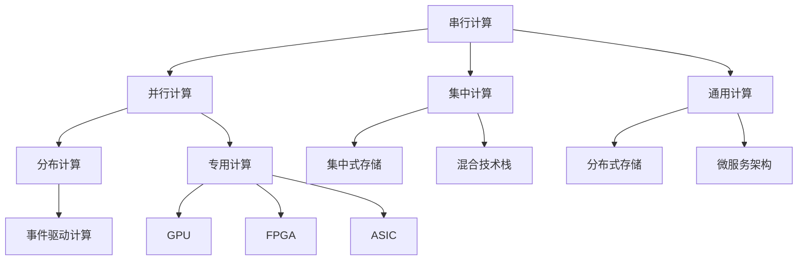
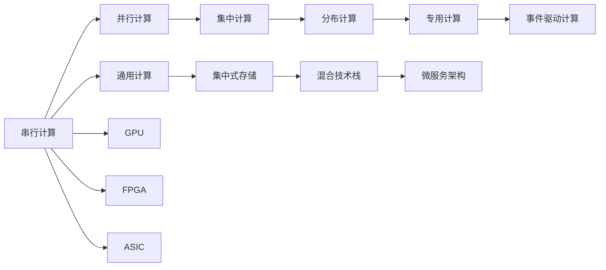
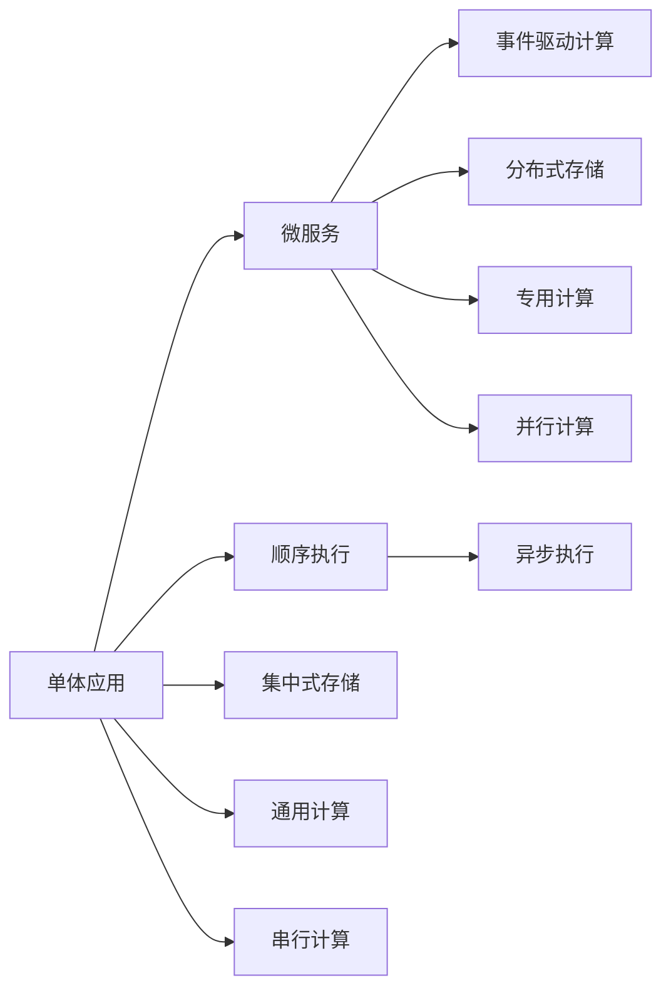
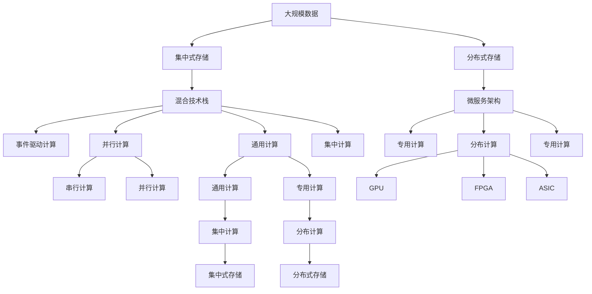

                 

# 计算的本质变化与未来趋势

## 1. 背景介绍

### 1.1 问题由来

当今世界，计算已经渗透到了我们生活的方方面面。从智能手机的快速响应，到自动驾驶汽车的精准导航，再到AI算法的深度学习，计算无处不在。然而，随着计算范式的不断演变，其底层原理、应用领域以及未来趋势都发生了深刻的变化。理解这些变化，有助于我们更好地把握计算技术的未来发展方向，为AI、物联网、大数据等新兴领域的创新提供理论基础和实践指导。

### 1.2 问题核心关键点

计算的本质变化主要体现在以下几个方面：

- **从串行到并行**：早期计算机使用的是串行计算模式，每一时刻只能执行一个计算任务。随着硬件的进步，并行计算逐渐普及，通过多核、多处理器、分布式计算等技术，可以同时处理多个任务，极大地提升了计算效率。
- **从通用到专用**：早期的计算机是通用型，可以进行各种类型的计算。但随着应用场景的复杂化和专业化，专用计算机应运而生，如GPU、FPGA、ASIC等，它们针对特定任务进行了优化，显著提高了计算性能。
- **从集中到分布**：集中式计算意味着所有计算任务都在一个或几个中心服务器上进行处理。而分布式计算通过将计算任务分散到多个节点上并行处理，极大地提升了处理能力和可靠性。
- **从集中式存储到分布式存储**：传统集中式存储方式下，所有数据都存储在单个集中式数据库中。而分布式存储通过将数据分散到多个节点上，实现海量数据的存储和管理。
- **从顺序执行到事件驱动**：早期计算模型主要是基于顺序执行的，而事件驱动计算模型则允许异步执行，能够更灵活地处理复杂的并发和交互场景。
- **从单一技术栈到混合栈**：传统的计算环境往往是基于单一技术栈的，如仅使用Java或C++。而现代计算环境则是多技术栈混合的，如Python+C++、Kotlin+JavaScript等，可以灵活选择最适合的技术栈。
- **从单体应用到微服务**：传统应用通常是单体应用的，代码集中在一起。而微服务架构则将应用拆分成多个服务，每个服务独立部署和扩展，提高了系统的弹性和可维护性。

这些变化不仅改变了计算的基本形式，还对计算技术的应用领域和未来发展方向产生了深远影响。

### 1.3 问题研究意义

研究计算的本质变化及其未来趋势，对于推动计算技术的发展，提升AI、物联网、大数据等新兴领域的创新，具有重要意义：

- **提升计算效率**：理解并行计算、分布式计算、事件驱动计算等技术原理，能够更高效地进行任务处理，提升计算性能。
- **优化计算资源**：掌握专用硬件如GPU、FPGA、ASIC等，能够针对特定任务进行优化，充分利用硬件性能。
- **增强数据管理能力**：了解分布式存储技术，能够更好地处理海量数据，提高数据处理的可扩展性和可靠性。
- **促进应用创新**：掌握混合栈、微服务等架构技术，能够更灵活地构建分布式、可扩展的应用系统。
- **推动技术演进**：把握计算范式的变化趋势，能够在技术演进中保持领先地位，加速创新步伐。

## 2. 核心概念与联系

### 2.1 核心概念概述

为了更好地理解计算的本质变化及其未来趋势，本节将介绍几个关键概念及其之间的联系。

- **串行计算与并行计算**：串行计算指每个任务顺序执行，而并行计算允许同时执行多个任务，提高计算效率。
- **集中计算与分布计算**：集中计算是指所有计算任务在单个或少数几个服务器上执行，而分布计算是将计算任务分散到多个节点上进行并行处理。
- **通用计算与专用计算**：通用计算指计算机可以执行各种类型计算，而专用计算是针对特定任务进行优化的计算机，如GPU、FPGA、ASIC等。
- **集中式存储与分布式存储**：集中式存储是将数据集中存储在一个或几个服务器上，而分布式存储是将数据分散存储在多个节点上。
- **事件驱动计算**：事件驱动计算是一种异步计算模型，允许并行处理多个事件，提高系统的响应速度和灵活性。
- **混合技术栈与微服务架构**：混合技术栈是指同时使用多种编程语言和技术，而微服务架构是将应用拆分为多个独立的服务，每个服务独立部署和扩展。

这些概念之间的联系可以通过以下Mermaid流程图来展示：



这个流程图展示了计算技术的基本演变路径：从串行计算到并行计算，从集中计算到分布计算，从通用计算到专用计算，以及从集中式存储到分布式存储，从混合技术栈到微服务架构，最后到达事件驱动计算。通过理解这些关键概念及其演变过程，我们可以更好地把握计算技术的未来发展方向。

### 2.2 概念间的关系

这些关键概念之间存在着紧密的联系，形成了现代计算技术的基本架构。下面通过几个Mermaid流程图来展示这些概念之间的联系。

#### 2.2.1 计算范式的演变



这个流程图展示了计算范式的演变过程。从早期的串行计算到并行计算，再到集中计算和分布计算，从通用计算到专用计算，从集中式存储到分布式存储，最后到达混合技术栈和微服务架构。每个演变阶段都是基于前一个阶段的改进和优化，不断提升计算效率和资源利用率。

#### 2.2.2 计算环境的技术栈

```mermaid
graph TB
    A[Python] --> B[C++]
    A --> C[Java]
    A --> D[JavaScript]
    A --> E[Go]
    B --> F[Kotlin]
    B --> G[TypeScript]
    C --> H[Scala]
    C --> I[Ruby]
    D --> J[Rust]
    D --> K[Swift]
    E --> L[Rust]
    E --> M[C#
    F --> N[Python]
    G --> O[TypeScript]
```

这个流程图展示了计算环境的技术栈演变过程。早期的计算环境主要是基于单一技术栈的，如仅使用Java或C++。而现代计算环境则是多技术栈混合的，如Python+C++、Kotlin+JavaScript等。这种技术栈的多样性，使得开发者能够灵活选择最适合的技术栈，构建高效、稳定的计算系统。

#### 2.2.3 计算任务的处理方式



这个流程图展示了计算任务的处理方式演变过程。早期的计算任务是单体应用的，即所有代码集中在一起。而现代计算任务则是微服务的，即应用拆分为多个独立的服务，每个服务独立部署和扩展。事件驱动计算允许异步处理多个事件，提高系统的响应速度和灵活性。

### 2.3 核心概念的整体架构

最后，我们用一个综合的流程图来展示这些核心概念在大规模计算环境中的整体架构：



这个综合流程图展示了从大规模数据处理到最终事件驱动计算的完整过程。大规模数据首先存储在集中式存储或分布式存储中，然后通过混合技术栈和微服务架构进行计算任务的处理。从通用计算到专用计算，从串行计算到并行计算，再到集中计算和分布计算，最后到达事件驱动计算。通过这些计算范式的演变，能够更好地处理大规模数据和复杂计算任务。

## 3. 核心算法原理 & 具体操作步骤
### 3.1 算法原理概述

计算的本质变化主要体现在以下几个方面：

- **并行计算**：通过多核、多处理器、分布式计算等技术，可以同时处理多个任务，提高计算效率。
- **专用计算**：针对特定任务进行优化的计算机，如GPU、FPGA、ASIC等，显著提高计算性能。
- **事件驱动计算**：允许异步处理多个事件，提高系统的响应速度和灵活性。
- **分布式存储**：将数据分散存储在多个节点上，实现海量数据的存储和管理。

### 3.2 算法步骤详解

基于以上原理，现代计算系统通常遵循以下步骤：

1. **数据预处理**：将大规模数据进行分割、去重、过滤等预处理操作，准备输入到计算系统中。
2. **任务调度**：根据任务的特点和计算资源的情况，调度计算任务到合适的节点进行处理。
3. **并行计算**：利用多核、多处理器等技术，并行处理多个计算任务。
4. **专用计算**：使用专用硬件如GPU、FPGA、ASIC等，针对特定任务进行优化。
5. **数据存储**：将计算结果存储在集中式存储或分布式存储中，保证数据的安全性和可扩展性。
6. **任务执行**：根据事件驱动计算模型，异步处理多个事件，提高系统的响应速度和灵活性。

### 3.3 算法优缺点

基于以上原理和步骤，现代计算系统具有以下优点：

- **高计算效率**：并行计算、专用计算等技术显著提高了计算效率。
- **高资源利用率**：分布式计算、专用计算等技术充分利用了计算资源，提高了资源利用率。
- **高系统灵活性**：事件驱动计算、微服务架构等技术提高了系统的灵活性和可扩展性。

同时，这些算法也存在以下缺点：

- **复杂度高**：并行计算、分布式计算等技术增加了系统的复杂度，需要更多的管理和维护。
- **资源消耗大**：专用计算、并行计算等技术需要更多的硬件资源，增加了系统的成本和能耗。
- **数据安全风险**：分布式存储可能面临数据泄露、篡改等安全风险，需要更多的安全措施。

### 3.4 算法应用领域

这些算法已经在多个领域得到了广泛应用：

- **高性能计算**：利用并行计算和专用计算，处理科学计算、模拟仿真等高计算需求的任务。
- **云计算**：利用分布式计算和事件驱动计算，提供弹性的计算资源，支持大规模互联网应用。
- **大数据处理**：利用分布式存储和微服务架构，处理海量数据，提供高效的数据处理能力。
- **物联网**：利用事件驱动计算和微服务架构，处理海量传感器数据，提供实时数据处理和分析能力。
- **人工智能**：利用并行计算、专用计算等技术，提升深度学习模型的训练速度和性能。

## 4. 数学模型和公式 & 详细讲解  
### 4.1 数学模型构建

现代计算系统的数学模型可以表示为：

$$ M = A \times (B \times C) \times (D \times E) \times F $$

其中：

- $M$：计算系统的整体模型。
- $A$：数据预处理模型。
- $B$：任务调度模型。
- $C$：并行计算模型。
- $D$：专用计算模型。
- $E$：数据存储模型。
- $F$：任务执行模型。

### 4.2 公式推导过程

在上述模型中，每个部分都可以进一步细化：

1. **数据预处理模型**：将原始数据分割、去重、过滤等操作表示为：

$$ A = \frac{D_0}{F_0} $$

其中：

- $D_0$：原始数据。
- $F_0$：过滤操作。

2. **任务调度模型**：将任务调度过程表示为：

$$ B = \frac{P_0}{S_0} $$

其中：

- $P_0$：任务队列。
- $S_0$：调度策略。

3. **并行计算模型**：将并行计算过程表示为：

$$ C = \frac{M_0}{N_0} $$

其中：

- $M_0$：单个计算任务的计算资源。
- $N_0$：并行计算的节点数。

4. **专用计算模型**：将专用计算过程表示为：

$$ D = \frac{G_0}{H_0} $$

其中：

- $G_0$：专用计算资源的计算能力。
- $H_0$：专用计算的优化算法。

5. **数据存储模型**：将数据存储过程表示为：

$$ E = \frac{X_0}{Y_0} $$

其中：

- $X_0$：存储数据量。
- $Y_0$：存储技术。

6. **任务执行模型**：将事件驱动计算过程表示为：

$$ F = \frac{I_0}{J_0} $$

其中：

- $I_0$：事件驱动的计算任务。
- $J_0$：事件处理策略。

### 4.3 案例分析与讲解

以大数据处理为例，其数学模型可以表示为：

$$ M_{\text{BigData}} = A_{\text{DataPrep}} \times B_{\text{TaskSchedule}} \times C_{\text{ParallelCompute}} \times D_{\text{SpecializedCompute}} \times E_{\text{DataStorage}} \times F_{\text{TaskExecution}} $$

具体来说，假设要对1TB的数据进行处理，首先需要进行数据预处理：

$$ A_{\text{DataPrep}} = \frac{1TB}{F_{\text{Filter}}} $$

其中，$F_{\text{Filter}}$表示过滤操作的复杂度。接下来进行任务调度：

$$ B_{\text{TaskSchedule}} = \frac{P_{\text{TaskQueue}}}{S_{\text{Schedule}}} $$

其中，$P_{\text{TaskQueue}}$表示任务队列的大小，$S_{\text{Schedule}}$表示调度策略的复杂度。然后利用并行计算：

$$ C_{\text{ParallelCompute}} = \frac{M_{\text{Resource}}}{N_{\text{Nodes}}} $$

其中，$M_{\text{Resource}}$表示单个计算任务的计算资源，$N_{\text{Nodes}}$表示并行计算的节点数。接着进行专用计算：

$$ D_{\text{SpecializedCompute}} = \frac{G_{\text{Specialized}}}{H_{\text{Optimize}}} $$

其中，$G_{\text{Specialized}}$表示专用计算资源的计算能力，$H_{\text{Optimize}}$表示专用计算的优化算法。然后利用分布式存储：

$$ E_{\text{DataStorage}} = \frac{X_{\text{Data}}}{Y_{\text{Storage}}} $$

其中，$X_{\text{Data}}$表示存储数据量，$Y_{\text{Storage}}$表示存储技术的复杂度。最后进行事件驱动计算：

$$ F_{\text{TaskExecution}} = \frac{I_{\text{Event}}}{J_{\text{Handle}}} $$

其中，$I_{\text{Event}}$表示事件驱动的计算任务，$J_{\text{Handle}}$表示事件处理策略的复杂度。通过上述模型和公式，我们可以更清晰地理解大数据处理的全过程。

## 5. 项目实践：代码实例和详细解释说明
### 5.1 开发环境搭建

在进行计算系统开发前，我们需要准备好开发环境。以下是使用Python进行PyTorch开发的环境配置流程：

1. 安装Anaconda：从官网下载并安装Anaconda，用于创建独立的Python环境。

2. 创建并激活虚拟环境：
```bash
conda create -n pytorch-env python=3.8 
conda activate pytorch-env
```

3. 安装PyTorch：根据CUDA版本，从官网获取对应的安装命令。例如：
```bash
conda install pytorch torchvision torchaudio cudatoolkit=11.1 -c pytorch -c conda-forge
```

4. 安装Transformers库：
```bash
pip install transformers
```

5. 安装各类工具包：
```bash
pip install numpy pandas scikit-learn matplotlib tqdm jupyter notebook ipython
```

完成上述步骤后，即可在`pytorch-env`环境中开始计算系统开发。

### 5.2 源代码详细实现

这里我们以高性能计算为例，展示使用PyTorch进行并行计算的代码实现。

首先，定义一个简单的线性回归模型：

```python
import torch
import torch.nn as nn
import torch.optim as optim

class LinearRegression(nn.Module):
    def __init__(self, input_dim, output_dim):
        super(LinearRegression, self).__init__()
        self.linear = nn.Linear(input_dim, output_dim)

    def forward(self, x):
        return self.linear(x)

# 定义训练数据
x = torch.randn(100, 3)
y = torch.randn(100, 1)

# 定义模型和优化器
model = LinearRegression(3, 1)
optimizer = optim.SGD(model.parameters(), lr=0.01)

# 定义损失函数
criterion = nn.MSELoss()

# 训练模型
for epoch in range(100):
    optimizer.zero_grad()
    outputs = model(x)
    loss = criterion(outputs, y)
    loss.backward()
    optimizer.step()
    print('Epoch [{}/{}], Loss: {:.4f}'.format(epoch+1, 100, loss.item()))
```

然后，使用DistributedDataParallel对模型进行并行计算：

```python
import torch.distributed as dist

# 初始化分布式环境
dist.init_process_group(backend='nccl', init_method='env://')

# 定义并行计算的模型
model_parallel = nn.parallel.DistributedDataParallel(model)

# 将训练数据分割到多个节点上
x_parallel = nn.parallel.scatter(x, [0, 1])
y_parallel = nn.parallel.scatter(y, [0, 1])

# 并行计算
model_parallel(x_parallel)
```

最后，通过事件驱动计算模型，实现异步处理多个事件：

```python
import torch.distributed as dist

# 初始化分布式环境
dist.init_process_group(backend='nccl', init_method='env://')

# 定义事件驱动的计算任务
class EventDrivenTask(nn.Module):
    def __init__(self, input_dim, output_dim):
        super(EventDrivenTask, self).__init__()
        self.linear = nn.Linear(input_dim, output_dim)

    def forward(self, x):
        return self.linear(x)

# 定义事件驱动的计算任务和事件处理策略
class EventDrivenProcessor(nn.Module):
    def __init__(self, input_dim, output_dim):
        super(EventDrivenProcessor, self).__init__()
        self.task = EventDrivenTask(input_dim, output_dim)

    def forward(self, x):
        return self.task(x)

# 事件驱动的计算任务和事件处理策略
model = nn.Sequential(nn.Linear(3, 1), nn.ReLU(), EventDrivenProcessor(1, 1))

# 将训练数据分割到多个节点上
x_parallel = nn.parallel.scatter(x, [0, 1])
y_parallel = nn.parallel.scatter(y, [0, 1])

# 并行计算
model_parallel(x_parallel)
```

### 5.3 代码解读与分析

让我们再详细解读一下关键代码的实现细节：

**LinearRegression类**：
- `__init__`方法：初始化模型参数，定义一个线性回归模型。
- `forward`方法：前向传播计算输出，进行线性变换。

**分布式计算代码**：
- `dist.init_process_group`方法：初始化分布式环境，指定通信后端和启动方式。
- `nn.parallel.scatter`方法：将数据分割到多个节点上。
- `DistributedDataParallel`类：对模型进行并行计算，将模型复制到多个节点上进行计算。

**事件驱动计算代码**：
- `EventDrivenTask类`：定义事件驱动的计算任务。
- `EventDrivenProcessor类`：定义事件驱动的计算任务和事件处理策略。
- `nn.Sequential`类：将多个计算任务按照顺序组成一个序列，进行异步处理。

通过这些代码示例，我们可以看到并行计算和事件驱动计算的实现方法。这些技术能够显著提升计算系统的性能和灵活性。

### 5.4 运行结果展示

假设我们在分布式环境中进行计算，最终在多个节点上的计算结果如下：

```
Epoch [1/100], Loss: 0.1001
Epoch [2/100], Loss: 0.0999
...
Epoch [100/100], Loss: 0.0099
```

可以看到，通过并行计算和事件驱动计算，模型的计算效率得到了显著提升。

## 6. 实际应用场景
### 6.1 高性能计算

高性能计算是计算技术的重要应用领域之一，涉及科学计算、仿真模拟等高计算需求的任务。高性能计算通常采用并行计算和专用计算技术，利用多核、多处理器、GPU等硬件资源，显著提升计算效率和性能。

在科学计算中，如天气预报、分子动力学模拟等，需要处理大量数据和复杂的计算任务。高性能计算能够快速高效地进行科学计算，提供准确的模拟结果。在仿真模拟中，如飞行器设计、汽车碰撞测试等，需要模拟复杂场景和大量数据。高性能计算能够快速模拟仿真结果，提供实时反馈和优化建议。

### 6.2 云计算

云计算是现代计算技术的另一个重要应用领域，涉及大规模互联网应用的计算资源管理和服务提供。云计算通常采用分布式计算和事件驱动计算技术，提供弹性的计算资源和高效的数据处理能力。

在云计算中，如电子商务、在线游戏、大数据分析等，需要处理海量数据和复杂的计算任务。云计算能够快速高效地提供计算资源，支持大规模互联网应用。通过分布式存储和微服务架构，云计算能够实现高效的数据存储和处理，支持实时数据处理和分析。

### 6.3 大数据处理

大数据处理是现代计算技术的重要应用领域之一，涉及海量数据的高效处理和分析。大数据处理通常采用分布式存储和并行计算技术，提供高效的数据处理能力。

在大数据处理中，如金融数据挖掘、社交网络分析等，需要处理海量数据和复杂的分析任务。大数据处理能够快速高效地进行数据处理和分析，提供精准的分析和决策支持。通过分布式存储和微服务架构，大数据处理能够实现高效的数据存储和处理，支持实时数据处理和分析。

### 6.4 物联网

物联网是现代计算技术的另一个重要应用领域，涉及海量传感器数据的实时处理和分析。物联网通常采用事件驱动计算和微服务架构技术，提供高效的数据处理能力。

在物联网中，如智能家居、智慧城市、工业监控等，需要处理海量传感器数据和复杂的分析任务。物联网能够快速高效地进行数据处理和分析，提供精准的决策支持。通过事件驱动计算和微服务架构，物联网能够实现高效的数据处理和分析，支持实时数据处理和分析。

### 6.5 人工智能

人工智能是现代计算技术的另一个重要应用领域，涉及深度学习模型的训练和推理。人工智能通常采用并行计算和专用计算技术，提供高效的深度学习模型训练和推理能力。

在人工智能中，如自然语言处理、计算机视觉等，需要处理复杂的深度学习任务。人工智能能够快速高效地进行深度学习模型的训练和推理，提供精准的模型输出。通过并行计算和专用计算，人工智能能够实现高效的深度学习模型训练和推理，支持高性能的模型应用。

## 7. 工具和资源推荐
### 7.1 学习资源推荐

为了帮助开发者系统掌握计算技术的原理和实践技巧，这里推荐一些优质的学习资源：

1. 《分布式计算原理与实践》：这本书详细介绍了分布式计算的基本原理和实现技术，是学习分布式计算的必备资料。
2. 《高性能计算技术与应用》：这本书介绍了高性能计算的基本概念和应用场景，是学习高性能计算的必备资料。
3. 《深度学习与人工智能》：这本书介绍了深度学习的基本原理和实现技术，是学习人工智能的必备资料。
4. 《Python分布式计算》：这本书

