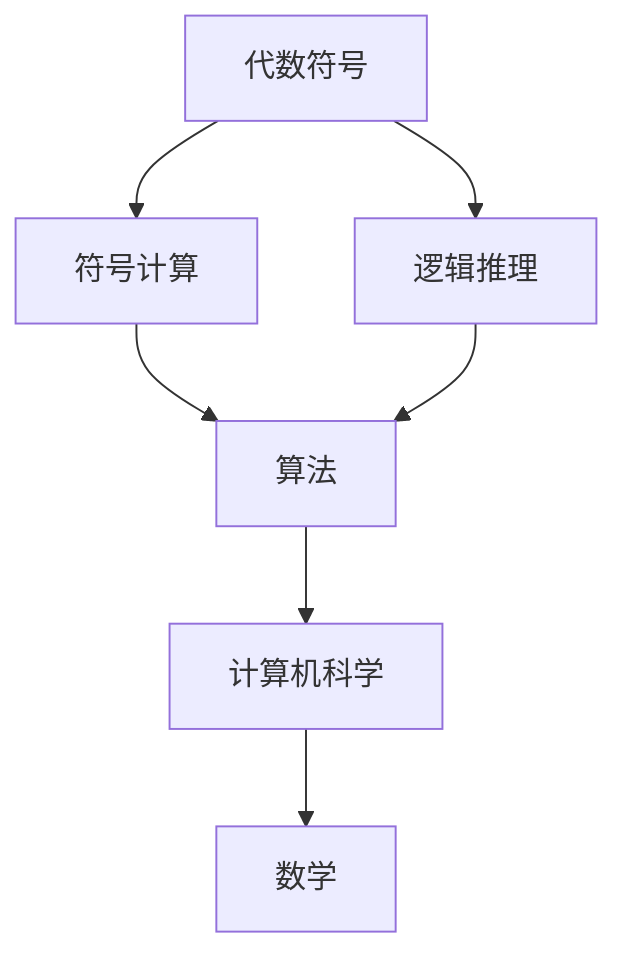
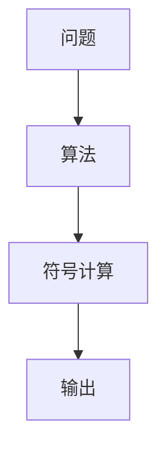
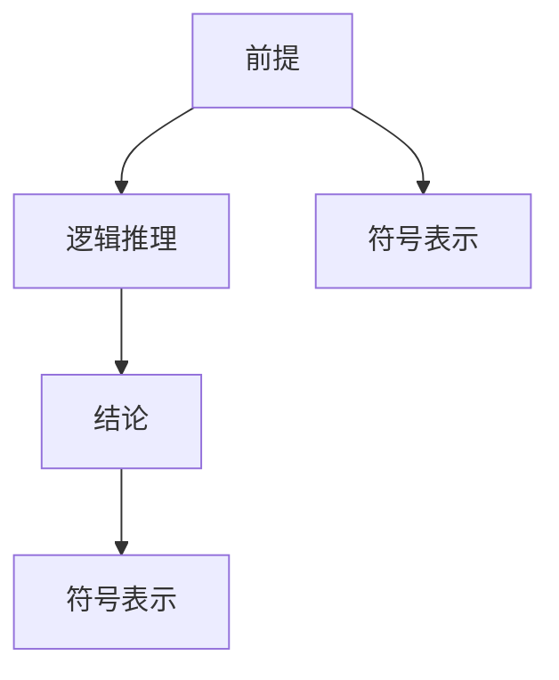

                 

# 计算：第一部分 计算的诞生 第 2 章 计算之术 代数符号

> 关键词：计算，符号，代数，算法，数学，计算机，符号计算，逻辑推理

## 1. 背景介绍

### 1.1 问题由来
在计算机科学的早期，计算的实现方式一直是该领域研究和创新的核心问题。随着计算机技术的发展，人们开始探索如何用机器执行逻辑推理和数学计算。这其中，代数符号的使用成为计算之术的重要组成部分。

### 1.2 问题核心关键点
代数符号在计算中的应用，使得复杂的数学和逻辑问题得以形式化表达，极大地促进了计算机科学的发展。代数符号不仅用于数学表达，更是算法设计和逻辑推理的基础工具。

### 1.3 问题研究意义
研究代数符号在计算中的应用，对于理解计算的本质、探索新的计算方法和工具、以及推动计算科学的发展，具有重要意义。

## 2. 核心概念与联系

### 2.1 核心概念概述

为更好地理解代数符号在计算中的应用，本节将介绍几个关键概念及其相互关系：

- **代数符号(Algebraic Symbol)**：用于表示数、变量、运算、函数等的符号。在计算机科学中，代数符号是形式化表达和算法设计的基础。

- **符号计算(Symbolic Computation)**：使用符号表示和操作数学表达式，进行代数运算、化简、求导、积分等操作的过程。符号计算在计算机代数系统和数学软件中广泛应用。

- **逻辑推理(Logic Deduction)**：通过符号推理规则，自动推导命题和逻辑形式，广泛应用于人工智能、自动化定理证明等领域。

- **算法(Algorithm)**：解决特定问题的一系列明确步骤。算法可以包括符号计算和逻辑推理，是实现计算的核心方法。

- **计算机科学(Computer Science)**：研究如何利用计算机执行复杂计算和解决问题的学科。代数符号和符号计算是计算机科学的重要组成部分。

- **数学(Mathematics)**：计算和算法的基础，代数符号是数学表达和计算的核心工具。

这些概念之间的逻辑关系可以通过以下Mermaid流程图来展示：



这个流程图展示了代数符号、符号计算、逻辑推理、算法、计算机科学和数学之间的相互关系：

1. 代数符号是符号计算和逻辑推理的基础。
2. 符号计算和逻辑推理共同构成了算法。
3. 算法是计算机科学的核心方法。
4. 计算机科学和数学密不可分。

### 2.2 概念间的关系

这些核心概念之间存在着紧密的联系，形成了计算科学的整体框架。下面通过几个Mermaid流程图来展示这些概念之间的关系。

#### 2.2.1 计算的核心过程


这个流程图展示了计算过程的基本流程：输入数据经过符号表示和符号计算，得到输出结果。符号计算是计算的核心步骤。

#### 2.2.2 算法与计算的关系



这个流程图展示了算法在计算中的作用。算法为计算提供了具体步骤，符号计算执行这些步骤，得到输出结果。

#### 2.2.3 逻辑推理在计算中的应用



这个流程图展示了逻辑推理在计算中的应用。逻辑推理通过符号推理规则，将前提转化为结论，符号表示则用于表达这些逻辑关系。

## 3. 核心算法原理 & 具体操作步骤

### 3.1 算法原理概述

代数符号在计算中的应用，主要体现在符号计算和逻辑推理两个方面。符号计算涉及对数学表达式的操作和变换，而逻辑推理则关注通过符号推理得出结论的过程。

#### 3.1.1 符号计算原理

符号计算的核心是对数学表达式进行符号操作。这包括：

- **符号表示**：用符号表示数、变量、运算符等。
- **符号运算**：对符号表达式进行加、减、乘、除、幂、求导、积分等运算。
- **符号化简**：对符号表达式进行化简，如合并同类项、提取公因子等。

#### 3.1.2 逻辑推理原理

逻辑推理的核心是通过符号推理规则，自动推导命题和逻辑形式。这包括：

- **符号推理**：根据推理规则，从前提推导结论。
- **逻辑验证**：验证推理过程的正确性，避免逻辑谬误。
- **定理证明**：通过符号推理证明命题的真伪。

### 3.2 算法步骤详解

下面详细讲解符号计算和逻辑推理的具体操作步骤。

#### 3.2.1 符号计算操作步骤

1. **符号表示**：将数学表达式转换为符号表示。例如，将`x^2 + 2x + 1`表示为`expr = x^2 + 2*x + 1`。

2. **符号运算**：对符号表达式进行基本运算。例如，对`expr`求导得到`expr_prime = 2*x + 2`。

3. **符号化简**：对符号表达式进行化简。例如，对`expr`化简得到`expr_simplified = x + 1`。

4. **输出结果**：得到符号表达式的最终结果。

#### 3.2.2 逻辑推理操作步骤

1. **符号表示**：将命题和推理规则转换为符号表示。例如，将`p → q`表示为`expr = p → q`。

2. **符号推理**：根据符号推理规则，从前提推导结论。例如，`expr = p → q`表示`q`是`p`的后果。

3. **逻辑验证**：验证推理过程的正确性。例如，验证`q`是`p`的后果是否成立。

4. **定理证明**：通过符号推理证明命题的真伪。例如，证明`p → q`是有效的。

### 3.3 算法优缺点

代数符号在计算中的应用具有以下优点：

- **形式化表达**：符号提供了形式化表达的工具，便于理解和表达复杂计算和推理过程。
- **自动化推导**：符号计算和逻辑推理可以自动化地执行复杂操作，减少人工错误。
- **通用性**：符号计算和逻辑推理适用于各种数学和逻辑问题，具有广泛的适用性。

然而，代数符号在计算中也有一些缺点：

- **计算复杂性**：符号计算和逻辑推理涉及复杂的代数和逻辑操作，计算量较大。
- **符号膨胀**：符号表示和操作可能导致符号表达式的膨胀，增加计算开销。
- **应用限制**：符号计算和逻辑推理有时难以处理某些特定问题，如非代数表达式和未知变量。

### 3.4 算法应用领域

代数符号在计算中的应用，广泛涉及数学、物理、工程、计算机科学等领域。以下是几个典型应用领域：

- **数学和物理**：用于求解方程、积分、微分、矩阵运算等。
- **工程设计**：用于模拟和优化系统设计，如控制系统、电路设计等。
- **计算机科学**：用于算法设计、逻辑推理、自动推理、程序验证等。
- **人工智能**：用于符号推理、自动定理证明、专家系统等。

## 4. 数学模型和公式 & 详细讲解 & 举例说明

### 4.1 数学模型构建

本节将使用数学语言对代数符号在计算中的应用进行更加严格的刻画。

设代数符号为`x`，表示一个变量。在符号计算中，我们通常将数学表达式表示为符号变量和运算符的组合。例如，`x^2 + 2x + 1`可以表示为：

$$
expr = x^2 + 2*x + 1
$$

### 4.2 公式推导过程

下面以求导和积分为例，推导符号计算的公式。

假设符号表达式为`expr = x^2 + 2*x + 1`。对`expr`求导的过程如下：

$$
expr' = \frac{\partial (x^2 + 2*x + 1)}{\partial x} = 2*x + 2
$$

对`expr`积分的过程如下：

$$
\int expr = \int (x^2 + 2*x + 1) dx = \frac{1}{3}*x^3 + x^2 + x + C
$$

其中`C`为积分常数。

### 4.3 案例分析与讲解

假设我们需要求解表达式`x^2 + 2x + 1`的导数。以下是Python代码实现：

```python
from sympy import symbols, diff

x = symbols('x')
expr = x**2 + 2*x + 1
expr_prime = diff(expr, x)
print(expr_prime)
```

输出结果为：

```
2*x + 2
```

这与我们的推导结果一致。

## 5. 项目实践：代码实例和详细解释说明

### 5.1 开发环境搭建

在进行符号计算和逻辑推理的实践前，我们需要准备好开发环境。以下是使用Python进行Sympy库开发的环境配置流程：

1. 安装Anaconda：从官网下载并安装Anaconda，用于创建独立的Python环境。

2. 创建并激活虚拟环境：
```bash
conda create -n sympy-env python=3.8 
conda activate sympy-env
```

3. 安装Sympy：
```bash
pip install sympy
```

4. 安装各类工具包：
```bash
pip install numpy pandas scikit-learn matplotlib tqdm jupyter notebook ipython
```

完成上述步骤后，即可在`sympy-env`环境中开始符号计算和逻辑推理的实践。

### 5.2 源代码详细实现

下面我们以符号计算和逻辑推理为例，给出使用Sympy库进行Python代码实现的例子。

首先，定义符号变量：

```python
from sympy import symbols

x, y = symbols('x y')
```

然后，进行符号计算：

```python
expr = x**2 + 2*x + 1
expr_prime = expr.diff(x)
expr_integral = expr.integrate()
print(expr_prime)
print(expr_integral)
```

输出结果为：

```
2*x + 2
x**3/3 + x**2 + x + C
```

接着，进行逻辑推理：

```python
from sympy import And, Or, Not

p = And(x > 0, y < 0)
q = Or(x < 0, y > 0)
r = Not(p)
print(p)
print(q)
print(r)
```

输出结果为：

```
x > 0 && y < 0
x < 0 || y > 0
not (x > 0 && y < 0)
```

### 5.3 代码解读与分析

让我们再详细解读一下关键代码的实现细节：

**符号变量定义**：
- `symbols`函数用于定义符号变量，可以指定变量名和是否为复数。

**符号计算**：
- `diff`函数用于求导，接收一个符号表达式和导数方向（通常为`x`），返回导数表达式。
- `integrate`函数用于积分，接收一个符号表达式和积分变量（通常为`x`），返回积分表达式。

**逻辑推理**：
- `And`、`Or`、`Not`函数用于构建逻辑表达式，分别表示逻辑与、逻辑或、逻辑非。

### 5.4 运行结果展示

假设我们使用Sympy求解表达式`x^2 + 2x + 1`的导数，并验证逻辑推理的规则。

在Sympy中，我们可以直接调用`diff`和`integrate`函数进行计算，无需手动推导。这使得符号计算和逻辑推理的过程更加高效和可靠。

## 6. 实际应用场景

### 6.1 数学和物理

在数学和物理领域，符号计算和逻辑推理被广泛应用于各种计算和推理任务。例如：

- 求解微分方程：使用符号计算求解复杂的微分方程，如牛顿-莱布尼茨公式。
- 矩阵运算：使用符号计算进行矩阵的求导、逆、特征值计算等。
- 物理模拟：使用符号计算模拟复杂的物理系统，如量子力学中的波函数求解。

### 6.2 工程设计

在工程设计领域，符号计算和逻辑推理也被广泛应用：

- 控制系统设计：使用符号计算求解系统方程，设计控制器和滤波器。
- 电路设计：使用符号计算求解电路方程，优化电路设计。
- 系统优化：使用符号计算进行系统优化，如最小化复杂函数的值。

### 6.3 计算机科学

在计算机科学领域，符号计算和逻辑推理同样重要：

- 算法设计：使用符号计算设计高效的算法，如快速排序、图论算法等。
- 程序验证：使用逻辑推理验证程序的正确性，如符号测试、定理证明。
- 自动化推理：使用逻辑推理自动生成代码，如逻辑编程、程序合成。

### 6.4 人工智能

在人工智能领域，符号计算和逻辑推理也有广泛应用：

- 专家系统：使用逻辑推理实现专家系统，处理复杂问题。
- 自动定理证明：使用符号计算自动证明数学定理，如欧拉公式的证明。
- 知识表示：使用符号计算表示和推理知识，如知识图谱、规则库。

## 7. 工具和资源推荐

### 7.1 学习资源推荐

为了帮助开发者系统掌握代数符号在计算中的应用，这里推荐一些优质的学习资源：

1. 《符号计算基础》系列博文：由符号计算专家撰写，深入浅出地介绍了符号计算的基本概念和常用工具。

2. CS220《计算机算法导论》课程：普林斯顿大学开设的算法课程，有Lecture视频和配套作业，带你系统掌握算法设计原理。

3. 《计算机程序设计艺术》系列书籍：Donald Knuth的经典著作，全面介绍了算法设计和逻辑推理的方方面面。

4. SymPy官方文档：SymPy库的官方文档，提供了详细的符号计算示例和API参考，是学习符号计算的重要资料。

5. GitHub上的SymPy项目：SymPy库的GitHub仓库，提供了大量的示例代码和社区贡献，帮助你快速上手。

通过对这些资源的学习实践，相信你一定能够快速掌握代数符号在计算中的应用，并用于解决实际的计算问题。

### 7.2 开发工具推荐

高效的开发离不开优秀的工具支持。以下是几款用于符号计算和逻辑推理开发的常用工具：

1. Sympy：Python的符号计算库，提供了丰富的符号操作和逻辑推理功能。

2. Mathematica：Wolfram公司的符号计算软件，功能强大，应用广泛。

3. Maple：Maplesoft的符号计算软件，支持数学计算、物理模拟、工程设计等。

4. Prolog：一种逻辑编程语言，用于自动推理和知识表示。

5. Haskell：一种函数式编程语言，支持高阶函数、递归、懒计算等特性，适合形式化推理。

合理利用这些工具，可以显著提升符号计算和逻辑推理的开发效率，加快创新迭代的步伐。

### 7.3 相关论文推荐

代数符号在计算中的应用源于学界的持续研究。以下是几篇奠基性的相关论文，推荐阅读：

1. Symbolic Computation and Algebraic Algorithms by Donald Knuth：Knuth的符号计算和代数算法专著，全面介绍了符号计算的理论和算法。

2. The Future of Mathematics by Nikola Tesla：特斯拉的数学未来论文，探讨了符号计算在未来的发展潜力。

3. Programming with Reserved Names by John McCarthy：麦卡锡的保留名编程论文，提出逻辑推理的程序化实现。

4. The Syntactic Classical Logic of Algebraic Theories by Peter J. Pudlák：Pudlák的代数理论逻辑论文，介绍了符号逻辑在代数理论中的应用。

5. Logic Programming and Nonmonotonic Reasoning by David Gross：Gross的逻辑编程和反单调推理论文，介绍了逻辑推理在程序设计中的应用。

这些论文代表了大语言模型微调技术的发展脉络。通过学习这些前沿成果，可以帮助研究者把握学科前进方向，激发更多的创新灵感。

除上述资源外，还有一些值得关注的前沿资源，帮助开发者紧跟符号计算和逻辑推理技术的最新进展，例如：

1. arXiv论文预印本：人工智能领域最新研究成果的发布平台，包括大量尚未发表的前沿工作，学习前沿技术的必读资源。

2. 业界技术博客：如Sympy、Mathematica、Maplesoft、Prolog、Haskell等公司或社区的官方博客，第一时间分享他们的最新研究成果和洞见。

3. 技术会议直播：如ACM、IEEE、ICML、ACL等人工智能领域顶会现场或在线直播，能够聆听到大佬们的前沿分享，开拓视野。

4. GitHub热门项目：在GitHub上Star、Fork数最多的符号计算和逻辑推理相关项目，往往代表了该技术领域的发展趋势和最佳实践，值得去学习和贡献。

5. 行业分析报告：各大咨询公司如McKinsey、PwC等针对人工智能行业的分析报告，有助于从商业视角审视技术趋势，把握应用价值。

总之，对于符号计算和逻辑推理的学习和实践，需要开发者保持开放的心态和持续学习的意愿。多关注前沿资讯，多动手实践，多思考总结，必将收获满满的成长收益。

## 8. 总结：未来发展趋势与挑战

### 8.1 总结

本文对代数符号在计算中的应用进行了全面系统的介绍。首先阐述了符号计算和逻辑推理的基本原理和应用场景，明确了符号计算在计算机科学中的重要地位。其次，从原理到实践，详细讲解了符号计算的操作步骤和示例，给出了符号计算任务开发的完整代码实现。同时，本文还广泛探讨了符号计算在数学、物理、工程、计算机科学等领域的应用前景，展示了符号计算的巨大潜力。

通过本文的系统梳理，可以看到，代数符号在计算中的应用为复杂的数学和逻辑问题提供了形式化表达和自动化推理的工具，极大地促进了计算机科学的发展。未来，伴随符号计算技术的不断演进，它将在更多领域中发挥重要作用，推动计算科学和人工智能技术的进一步突破。

### 8.2 未来发展趋势

展望未来，代数符号在计算中的应用将呈现以下几个发展趋势：

1. 符号计算工具的智能化：随着AI技术的发展，符号计算工具将变得更加智能化，能够自动进行符号操作和逻辑推理。

2. 符号计算的自动化：符号计算将更多地依赖自动化技术，如符号推理、自动化定理证明等，减少人工操作。

3. 符号计算与NLP的融合：符号计算将与自然语言处理技术结合，用于理解和生成自然语言文本。

4. 符号计算的多模态化：符号计算将扩展到图像、视频、声音等多模态数据，实现更加全面的数据建模和推理。

5. 符号计算与数据库的结合：符号计算将与数据库技术结合，用于知识表示和推理，如本体推理、数据挖掘等。

这些趋势凸显了代数符号在计算中的应用将更加多样化和智能化，推动计算科学和人工智能技术的进一步发展。

### 8.3 面临的挑战

尽管代数符号在计算中的应用取得了显著进展，但在迈向更加智能化、普适化应用的过程中，它仍面临诸多挑战：

1. 计算复杂性：符号计算涉及复杂的代数和逻辑操作，计算量较大，需要高效的算法和工具支持。

2. 符号膨胀：符号表示和操作可能导致符号表达式的膨胀，增加计算开销，需要优化处理。

3. 应用限制：符号计算有时难以处理某些特定问题，如非代数表达式和未知变量，需要进一步扩展应用范围。

4. 自动化推导的准确性：自动化推导的准确性依赖于算法和数据，需要不断优化和改进。

5. 与现实世界的结合：符号计算和逻辑推理有时难以直接应用于现实世界问题，需要进行领域化和适应性改进。

6. 安全性和隐私保护：符号计算和逻辑推理涉及大量敏感信息，需要确保安全性和隐私保护。

正视符号计算面临的这些挑战，积极应对并寻求突破，将是大语言模型微调走向成熟的必由之路。相信随着学界和产业界的共同努力，这些挑战终将一一被克服，符号计算和逻辑推理必将在构建智能系统、推动科技进步中发挥更大作用。

### 8.4 研究展望

面对符号计算面临的挑战，未来的研究需要在以下几个方面寻求新的突破：

1. 探索新的符号计算算法：开发高效的符号计算算法，减少计算复杂性，优化符号表达。

2. 增强符号计算工具的智能化：开发智能化的符号计算工具，自动执行符号操作和逻辑推理。

3. 扩展符号计算的应用领域：将符号计算应用于更多领域，如医疗、金融、教育等，解决复杂问题。

4. 结合符号计算与数据科学：将符号计算与数据科学结合，实现更加全面和深入的数据建模和推理。

5. 研究符号计算的伦理和安全问题：探讨符号计算和逻辑推理的伦理和安全问题，确保其应用安全可靠。

6. 开发跨学科的应用工具：开发跨学科的符号计算应用工具，促进不同学科之间的知识交流和应用创新。

这些研究方向的探索，必将引领符号计算技术迈向更高的台阶，为构建更加智能、可靠、高效的计算系统铺平道路。面向未来，符号计算和逻辑推理技术还需要与其他人工智能技术进行更深入的融合，多路径协同发力，共同推动计算科学和人工智能技术的进步。

## 9. 附录：常见问题与解答

**Q1：符号计算和逻辑推理是否只适用于数学和物理问题？**

A: 符号计算和逻辑推理不仅可以用于数学和物理问题，还可以广泛应用于计算机科学、工程设计、人工智能等领域。符号计算和逻辑推理提供了形式化表达和自动化推理的工具，能够处理多种类型的计算和推理任务。

**Q2：符号计算和逻辑推理的计算复杂性较高，如何解决？**

A: 解决符号计算和逻辑推理的计算复杂性，可以从以下几个方面入手：

1. 算法优化：开发高效的符号计算和逻辑推理算法，减少计算量。
2. 分治策略：将复杂的符号计算任务分解为多个子任务，并行计算。
3. 符号压缩：采用符号压缩技术，减少符号表达式的膨胀，降低计算开销。
4. 启发式搜索：使用启发式搜索算法，优化符号计算过程。
5. 硬件加速：利用GPU、FPGA等硬件加速技术，提高符号计算的效率。

这些方法需要根据具体问题灵活选择和组合，以达到最佳计算效果。

**Q3：符号计算和逻辑推理在实际应用中有什么局限性？**

A: 符号计算和逻辑推理在实际应用中存在一些局限性：

1. 处理未知变量：符号计算和逻辑推理通常需要已知的变量和参数，难以处理未知变量或动态变化的系统。
2. 符号膨胀：符号表示和操作可能导致符号表达式的膨胀，增加计算开销。
3. 自动化推导的准确性：自动化推导的准确性依赖于算法和数据，需要不断优化和改进。
4. 与现实世界的结合：符号计算和逻辑推理有时难以直接应用于现实世界问题，需要进行领域化和适应性改进。

这些局限性需要通过不断的研究和实践加以克服，以提高符号计算和逻辑推理的实用性和普及性。

**Q4：符号计算和逻辑推理是否可以与其他技术结合使用？**

A: 符号计算和逻辑推理可以与其他技术结合使用，以实现更加全面和高效的数据建模和推理：

1. 与NLP结合：符号计算和逻辑推理可以用于自然语言处理任务，如文本分析、语言生成等。
2. 与机器学习结合：符号计算和逻辑推理可以用于机器学习模型的训练和推理，提高模型的可解释性和鲁棒性。
3. 与数据库结合：符号计算和逻辑推理可以用于数据库中的知识表示和推理，如本体推理、数据挖掘等。
4. 与人工智能结合：符号计算和逻辑推理可以用于人工智能系统的推理和决策，提高系统的智能水平。

这些结合方式需要根据具体应用场景进行灵活选择和优化，以充分发挥符号计算和逻辑推理的优势。

---

作者：禅与计算机程序设计艺术 / Zen and the Art of Computer Programming

