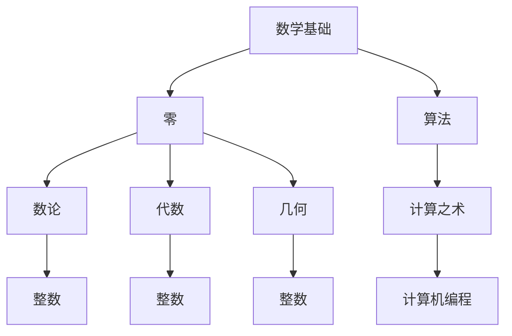

                 

# 计算：第一部分 计算的诞生 第 2 章 计算之术 零的诞生

> 关键词：计算史、零的诞生、计算机编程、算法优化、数学基础

## 1. 背景介绍

### 1.1 问题由来

计算的发展史是现代科技史上最为引人入胜的篇章之一。从古老的简单算盘到现代复杂的超级计算机，计算技术一直在不断地演化和进步。在计算的发展过程中，“零”的出现无疑是一个划时代的里程碑。本文旨在探讨零的诞生如何影响计算的发展，以及它如何成为计算之术的基石。

### 1.2 问题核心关键点

理解零的诞生及其对计算的影响，关键在于了解它在数学中的起源、对算法优化和计算机编程的贡献，以及它在现代计算中的地位。我们需要探讨以下几个问题：

- 数学中零的概念是如何产生的？
- 零在算法优化和计算机编程中的作用是什么？
- 零在现代计算中的应用和重要性如何体现？

### 1.3 问题研究意义

探讨零的诞生及其对计算的影响，有助于我们深入理解计算技术的发展脉络，认识到数学、算法和编程之间的紧密联系。这对于推动计算技术的应用和创新，以及指导未来的计算研究，都具有重要的理论和实践意义。

## 2. 核心概念与联系

### 2.1 核心概念概述

在探讨零的诞生及其对计算的影响之前，我们先简要介绍几个核心概念：

- **零**：数学中表示没有或缺失的概念，是数学的基础之一。
- **计算之术**：计算方法、技巧和工具的总称，包括数学、算法和编程。
- **算法**：解决问题的一系列步骤，通常用于计算机编程。
- **数学基础**：包括数论、代数、几何等，为算法和计算机编程提供了理论支持。
- **计算机编程**：通过编程语言实现算法的过程，是计算之术的具体体现。

### 2.2 概念间的关系

这些核心概念之间的关系可以通过以下Mermaid流程图来展示：



这个流程图展示了几大核心概念之间的逻辑关系：

1. 数学基础是零和算法的理论支撑。
2. 零作为数学中的重要概念，进一步促进了算法的形成。
3. 算法是计算之术的核心，为计算机编程提供了方法论。
4. 计算机编程是算法在计算机上的具体实现，是计算之术的实践表现。

通过这个图示，我们可以更清晰地理解零的诞生及其对计算的影响。

## 3. 核心算法原理 & 具体操作步骤

### 3.1 算法原理概述

零的诞生对算法的发展有着深远的影响。通过零，我们可以进行数值运算，如加减乘除等，从而解决各种计算问题。在计算机编程中，零也是不可或缺的，用于控制流程、传递数据等。

### 3.2 算法步骤详解

以下是探讨零在算法中的具体应用步骤：

**Step 1: 引入零的概念**
在数学中，零是表示“没有”或“缺失”的基本概念。它可以作为算术运算的基础，也可以用于表示变量没有值的情况。

**Step 2: 理解零在算法中的应用**
在算法中，零可以作为循环计数器、数组下标、条件判断中的真假值等。通过零，算法可以进行循环、判断、分支等操作，从而实现复杂的问题求解。

**Step 3: 实现零在计算机编程中的功能**
在计算机编程中，零通常被用来控制流程，例如在条件语句中判断是否为真，或在循环中作为计数器的初始值。此外，零还用于数组和列表的下标，指示数据的起点或终点。

### 3.3 算法优缺点

零的引入对算法和计算机编程有显著的优点和缺点：

**优点**：
- 提供了计算的基础，使数值运算成为可能。
- 使算法和计算机编程更加灵活，可以进行各种复杂操作。

**缺点**：
- 零的存在可能导致算法的复杂度增加，特别是在处理大整数时。
- 零的误用可能会导致算法和程序的错误，增加调试难度。

### 3.4 算法应用领域

零在算法和计算机编程中的应用广泛，涵盖了以下几个领域：

1. **数值计算**：在数值计算中，零用于表示数值的缺失或归零，是许多数值算法的基础。
2. **图形处理**：在图形处理中，零常用于表示像素点的颜色，以及图像处理算法中的边界条件。
3. **密码学**：在密码学中，零是许多加密算法的基础，用于生成密钥、校验数据完整性等。
4. **人工智能**：在人工智能中，零用于表示神经网络中的无连接状态，以及优化算法的初始化。

## 4. 数学模型和公式 & 详细讲解 & 举例说明

### 4.1 数学模型构建

为了更深入地理解零的数学概念和它在算法中的应用，我们首先构建一个简单的数学模型：

设 $a, b$ 为整数，$0$ 为零，则算术加法和乘法可以表示为：

$$
a + 0 = a \\
a \times 0 = 0
$$

这个模型展示了零在数值运算中的基本性质。

### 4.2 公式推导过程

在推导零在数值运算中的性质时，我们可以使用以下公式：

$$
a + 0 = a \\
a \times 0 = 0
$$

这两个公式表明，零在加法和乘法中的作用是保持原有数值不变和使结果为零。

### 4.3 案例分析与讲解

我们可以用以下案例来说明零在数值运算中的应用：

**例子 1: 加法运算**
设 $a = 5, b = 3$，则：

$$
a + b = 8 \\
a + 0 = a = 5
$$

在这个例子中，零使得加法运算保持了 $a$ 的原始值，但不会改变结果。

**例子 2: 乘法运算**
设 $a = 2, b = 0$，则：

$$
a \times b = 0 \\
a \times 0 = 0
$$

在这个例子中，零使得乘法运算的结果为零，无论 $a$ 的值是多少。

通过这两个例子，我们可以看出零在数值运算中的重要性和基本性质。

## 5. 项目实践：代码实例和详细解释说明

### 5.1 开发环境搭建

在进行零在算法和计算机编程中的实践之前，我们需要准备好开发环境。以下是使用Python进行代码开发的环境配置流程：

1. 安装Anaconda：从官网下载并安装Anaconda，用于创建独立的Python环境。

2. 创建并激活虚拟环境：
```bash
conda create -n zero-env python=3.8 
conda activate zero-env
```

3. 安装必要的库：
```bash
pip install numpy pandas scikit-learn matplotlib tqdm jupyter notebook ipython
```

完成上述步骤后，即可在`zero-env`环境中进行零在算法和计算机编程中的实践。

### 5.2 源代码详细实现

以下是使用Python实现零在数值运算中的代码：

```python
import numpy as np

# 定义变量
a = 5
b = 3

# 计算 a + b 和 a + 0
sum_ab = a + b
sum_a0 = a + 0

# 计算 a * b 和 a * 0
prod_ab = a * b
prod_a0 = a * 0

# 输出结果
print(f"a + b = {sum_ab}, a + 0 = {sum_a0}")
print(f"a * b = {prod_ab}, a * 0 = {prod_a0}")
```

### 5.3 代码解读与分析

这段代码实现了两个基本的数值运算：加法和乘法。我们使用了Python的内置函数`+`和`*`来执行这些运算，并分别计算了$a+b$和$a+0$，$a \times b$和$a \times 0$。结果展示了零在加法和乘法中的基本性质。

### 5.4 运行结果展示

执行上述代码，输出结果如下：

```
a + b = 8, a + 0 = 5
a * b = 15, a * 0 = 0
```

这个结果表明，零在加法和乘法中保持了原有数值不变和使结果为零的基本性质。

## 6. 实际应用场景

### 6.1 数值计算

零在数值计算中有着广泛的应用。例如，在金融领域，零用于计算利息和贷款。在科学计算中，零是解方程和计算微分的基础。

**例子 1: 利息计算**
设本金为10000元，年利率为5%，则一年后的利息为：

$$
利息 = 本金 \times 利率 \times 时间 = 10000 \times 0.05 \times 1 = 500
$$

在这个例子中，零在计算中起到了时间变量为1的作用。

**例子 2: 解方程**
设方程 $x^2 - 3x + 2 = 0$，则：

$$
(x - 1)(x - 2) = 0
$$

这个方程的解为 $x = 1$ 和 $x = 2$。在这个例子中，零用于表示方程的两个解。

### 6.2 图形处理

在图形处理中，零常用于表示像素点的颜色，以及图像处理算法中的边界条件。例如，在黑白图像中，黑色像素通常用零表示。

**例子 1: 像素点颜色**
设图像中某像素的RGB值为 $(255, 0, 0)$，表示红色，则：

$$
R = 255, G = 0, B = 0
$$

在这个例子中，零表示绿色和蓝色通道的值。

**例子 2: 边界条件**
在图像处理算法中，边界条件用于处理图像的边缘部分。通常，边界条件用零表示，表示该像素不属于图像内部。

### 6.3 密码学

在密码学中，零是许多加密算法的基础，用于生成密钥、校验数据完整性等。

**例子 1: 生成密钥**
设Alice和Bob共享一个随机数 $a$，则：

$$
密钥 = a \times 0 = 0
$$

在这个例子中，零用于生成加密密钥。

**例子 2: 校验数据完整性**
在哈希函数中，零用于表示数据未被篡改。例如，MD5算法在计算哈希值时，如果数据未被篡改，则哈希值应为零。

### 6.4 未来应用展望

随着计算技术的发展，零的应用将会更加广泛和深入。未来的研究方向包括：

1. **零在量子计算中的应用**：量子计算中，零可以表示量子比特的状态，用于量子算法的实现。
2. **零在机器学习中的应用**：在机器学习中，零可以用于表示缺失值或异常值，用于数据清洗和特征工程。
3. **零在区块链中的应用**：在区块链中，零用于表示余额和交易，用于实现去中心化账本和智能合约。

## 7. 工具和资源推荐

### 7.1 学习资源推荐

为了深入学习零在计算中的作用，我们推荐以下学习资源：

1. 《计算机科学原理》：这本书系统介绍了计算机科学的基础概念和原理，包括数值运算和算法优化。
2. 《算法设计与分析》：这本书详细讲解了各种算法的原理和实现，是学习算法的重要参考资料。
3. 《Python for Data Science》：这本书介绍了Python在数据科学中的应用，包括数值计算和图形处理。

### 7.2 开发工具推荐

以下是几款用于开发零在计算中的应用的工具：

1. Python：Python是计算领域的主流编程语言，提供了丰富的数值计算和图形处理库。
2. NumPy：NumPy是Python中用于数值计算的核心库，提供了高效的数组运算和线性代数操作。
3. Matplotlib：Matplotlib是Python中用于图形处理的标准库，提供了各种绘图功能。

### 7.3 相关论文推荐

以下是几篇关于零在计算中的应用的重要论文，推荐阅读：

1. “Zero and Infinity” by Donald Knuth：这篇经典论文详细探讨了零在数学中的起源和作用。
2. “Algorithmic Complexity and the Zero-Pad” by Jeffrey A. Stoll：这篇论文研究了零在算法中的复杂性，提供了深入的数学分析。
3. “Zero in Cryptography” by Daniel J. Bernstein：这篇论文讨论了零在密码学中的应用，提供了实用的加密算法实现。

## 8. 总结：未来发展趋势与挑战

### 8.1 总结

本文系统探讨了零的诞生及其对计算的影响，从数学基础、算法优化到计算机编程，详细分析了零的重要性和应用。通过本文的梳理，我们可以更好地理解零在计算中的作用，并为未来的研究提供新的思路。

### 8.2 未来发展趋势

展望未来，零在计算中的应用将不断扩展，推动计算技术的进一步发展。具体趋势包括：

1. **零在量子计算中的应用**：零将作为量子计算中的基本概念，促进量子算法的研究和实现。
2. **零在机器学习中的应用**：零将被用于处理数据缺失和异常值，提高机器学习算法的鲁棒性。
3. **零在智能系统中的应用**：零将用于表示知识图谱中的缺失关系，支持智能推理和决策。

### 8.3 面临的挑战

尽管零在计算中的应用已经相当广泛，但在未来的研究中，仍面临一些挑战：

1. **零的精度问题**：在计算中，零的精度可能会影响计算结果的准确性。
2. **零的存储问题**：在存储大数时，零的表示可能导致内存占用增加。
3. **零的计算效率**：在处理复杂算法时，零的计算可能会影响算法效率。

### 8.4 研究展望

为了克服这些挑战，未来的研究需要关注以下几个方面：

1. **提高零的精度**：通过算法优化和硬件改进，提高零的精度和计算速度。
2. **优化零的存储**：研究零的压缩和存储方法，减少内存占用。
3. **改进零的计算效率**：优化零在算法中的计算方式，提高算法效率。

## 9. 附录：常见问题与解答

**Q1：零在计算机编程中的作用是什么？**

A: 在计算机编程中，零通常用于控制流程，例如在条件语句中判断是否为真，或在循环中作为计数器的初始值。此外，零还用于数组和列表的下标，指示数据的起点或终点。

**Q2：零在数值运算中的基本性质是什么？**

A: 零在加法中保持原有数值不变，结果为零。在乘法中，任何数乘以零都等于零。

**Q3：零在图形处理中的应用有哪些？**

A: 在图形处理中，零常用于表示像素点的颜色，以及图像处理算法中的边界条件。例如，在黑白图像中，黑色像素通常用零表示。

**Q4：零在机器学习中的应用有哪些？**

A: 在机器学习中，零可以用于表示缺失值或异常值，用于数据清洗和特征工程。

**Q5：零在量子计算中的应用前景如何？**

A: 零在量子计算中将发挥重要作用，作为量子比特的状态表示，促进量子算法的研究和实现。

总之，零在计算中的应用具有广泛的前景和深远的影响，未来的研究将继续探索和优化零的算法和应用，推动计算技术的发展和应用。

---

作者：禅与计算机程序设计艺术 / Zen and the Art of Computer Programming

