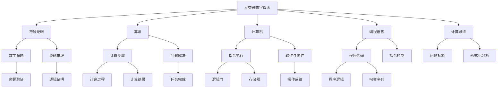

                 

# 计算：第一部分 计算的诞生 第 3 章 莱布尼茨的计算之梦 人类思想字母表

> 关键词：
- 莱布尼茨
- 人类思想字母表
- 计算
- 二进制
- 逻辑推理
- 计算机科学
- 语言学
- 哲学
- 信息论
- 人工智能

## 1. 背景介绍

### 1.1 问题由来
计算的诞生是人类文明史上一项伟大的成就，它不仅改变了我们的生产方式，更深刻影响了我们的生活方式和思维方式。但追溯计算的起源，却可以追溯到18世纪的数学家莱布尼茨（Leibniz）。莱布尼茨是一位多才多艺的数学家、物理学家、哲学家，他在逻辑、代数、几何、力学等多个领域都有深邃的贡献。

莱布尼茨对计算的贡献不仅仅在于他的机械计算器，更在于他提出了一套完整的计算逻辑和符号体系，这套体系影响深远，对计算机科学的发展具有划时代的意义。在《计算：第一部分 计算的诞生》中，我们将重点介绍莱布尼茨的计算理念及其对现代计算机科学的影响。

### 1.2 问题核心关键点
莱布尼茨的计算理念主要体现在他对“人类思想字母表”（Alphabet of Thought）的设计和应用上。这套字母表是由一系列符号和规则组成的，旨在通过简单的符号组合和逻辑推理，实现复杂计算任务的自动化处理。

莱布尼茨的计算理念对计算机科学的影响主要体现在以下几个方面：
- 符号逻辑和代数运算的结合，为现代计算机的逻辑电路设计奠定了基础。
- “人类思想字母表”成为现代编程语言和算法的原型，影响了计算机科学的发展方向。
- 计算思维的普及，对科学、工程、数学等多个领域的思维方式产生了深远影响。

## 2. 核心概念与联系

### 2.1 核心概念概述

为了更好地理解莱布尼茨的计算理念，我们首先介绍几个关键概念：

- **人类思想字母表**：莱布尼茨提出的符号系统，包含了一系列符号和规则，用于实现逻辑推理和数学运算。这些符号包括数字、运算符、关系符等，通过组合这些符号，可以表达复杂的逻辑关系和数学运算。

- **符号逻辑**：通过符号系统进行的逻辑推理过程。符号逻辑的目的是用形式化的方式表达和验证数学命题和逻辑推理，是计算理论的基础。

- **算法**：一组按照特定规则进行计算的步骤，用于解决特定问题。算法通常以流程图的形式展示，包括输入、处理、输出等环节。

- **计算机**：一种能够执行指令的机器，通过硬件和软件的结合，实现复杂计算任务的自动化。

- **编程语言**：用于编写计算机程序的语言，通过语法、语义等规则，实现对计算机的指令控制。

- **计算思维**：一种基于符号逻辑和算法的思维方式，强调对问题的形式化分析和计算求解。

这些概念之间存在紧密的联系，共同构成了现代计算机科学的基础。

### 2.2 概念间的关系

这些核心概念之间的关系可以通过以下Mermaid流程图来展示：



这个流程图展示了莱布尼茨的计算理念与现代计算机科学的紧密联系：

1. 人类思想字母表通过符号逻辑和算法，表达和验证数学命题和逻辑推理。
2. 计算机通过硬件和软件实现指令执行，是算法和符号逻辑的承载平台。
3. 编程语言提供指令控制和软件实现的桥梁，使符号逻辑和算法能够转化为计算机可执行的程序代码。
4. 计算思维强调对问题的形式化分析和计算求解，是符号逻辑和算法的基础。

这些概念共同构成了现代计算机科学的理论基础和技术体系，深刻影响了计算机科学的发展历程。

## 3. 核心算法原理 & 具体操作步骤
### 3.1 算法原理概述

莱布尼茨的计算理念核心在于符号逻辑和算法，他提出了一套完整的符号体系和规则，用于实现复杂的逻辑推理和数学运算。这套体系包括数字符号、运算符、关系符等，通过符号的组合和变换，实现对复杂计算任务的自动化处理。

### 3.2 算法步骤详解

莱布尼茨的计算过程可以概括为以下几个步骤：

1. **符号定义**：定义一组基本的符号和规则，用于表达数字、运算符和逻辑关系。例如，使用点号表示数字，加、减、乘、除等运算符，以及等于、大于、小于等关系符。

2. **符号组合**：通过符号的组合和变换，表达和计算复杂的数学表达式和逻辑命题。例如，使用符号组合表达加减乘除等基本运算，以及逻辑与、或、非等逻辑运算。

3. **逻辑推理**：通过符号逻辑和推理规则，验证数学命题和逻辑推理的正确性。例如，使用等价替换、消去律、结合律等规则，进行符号逻辑的推导和验证。

4. **符号替换**：通过符号替换和变换，实现符号逻辑和算法的自动化处理。例如，使用自动推导器、解析器等工具，对符号逻辑表达式进行自动化推导和计算。

5. **符号输出**：通过符号输出机制，将计算结果转换为可读的形式，供用户查看和验证。例如，使用打印机制、显示机制等，将计算结果转换为数字、图形等形式。

### 3.3 算法优缺点

莱布尼茨的计算体系具有以下优点：

- **形式化严谨**：符号逻辑和算法的形式化表达，使得计算过程具有高度的严谨性和可验证性。
- **自动化处理**：符号逻辑和算法的自动化推导和计算，使得复杂计算任务可以高效自动化处理。
- **通用性强**：符号逻辑和算法不受特定语言的限制，可以应用于多种计算场景和领域。

但这套体系也存在一些缺点：

- **符号复杂**：符号逻辑的表达和推导过程复杂，对用户的要求较高。
- **学习成本高**：需要用户掌握符号逻辑和算法的基础知识，学习成本较高。
- **表达能力有限**：符号逻辑和算法的表达能力有限，无法涵盖所有复杂的计算任务。

### 3.4 算法应用领域

莱布尼茨的计算理念广泛应用于计算机科学、逻辑学、数学等多个领域。

- **计算机科学**：莱布尼茨的符号逻辑和算法成为现代计算机科学的理论基础，影响了计算机语言、算法设计、逻辑电路等多个方向。
- **逻辑学**：符号逻辑和推理规则是逻辑学的基础，莱布尼茨的计算理念对逻辑学的发展具有深远影响。
- **数学**：莱布尼茨的符号逻辑和算法广泛应用于数学分析和计算，推动了数学的发展。
- **哲学**：莱布尼茨的计算理念对现代哲学的发展也有重要影响，成为符号逻辑和计算思维的理论来源。

## 4. 数学模型和公式 & 详细讲解  
### 4.1 数学模型构建

莱布尼茨的计算理念中，符号逻辑和算法的形式化表达是其核心。我们可以用数学语言对莱布尼茨的计算体系进行更加严格的刻画。

记符号系统中的符号为 $S$，符号之间的组合规则为 $R$。设 $S$ 包含数字 $D$、运算符 $O$ 和关系符 $C$，则符号系统可以表示为：

$$
S = D \cup O \cup C
$$

符号系统的组合规则 $R$ 包括符号组合的语法和语义规则，用于表达和验证符号组合的逻辑关系和计算意义。例如，数字 $d_1$ 和 $d_2$ 的加法运算可以表示为：

$$
d_1 + d_2 = d
$$

其中 $d$ 表示加法运算的结果，$d_1$ 和 $d_2$ 是输入的数字符号。

### 4.2 公式推导过程

为了更好地理解莱布尼茨的计算体系，我们可以用一些简单的公式来进行推导。例如，假设符号系统中有两个数字 $d_1$ 和 $d_2$，以及一个加法运算符 $+$，则加法运算的逻辑规则可以表示为：

$$
(d_1 + d_2) \in d
$$

其中 $d$ 表示加法运算的结果。这个公式展示了符号逻辑和算法的组合过程，即通过符号组合和变换，实现复杂的计算任务。

### 4.3 案例分析与讲解

我们以莱布尼茨的“二进制算盘”为例，分析其计算过程。二进制算盘是莱布尼茨设计的一种计算工具，通过简单的数字组合和逻辑推理，实现加减乘除等基本运算。二进制算盘的计算过程可以分为以下几个步骤：

1. **数字定义**：定义数字符号 $0$ 和 $1$，以及加、减、乘、除等运算符。

2. **数字组合**：通过数字符号的组合和变换，表达加减乘除等基本运算。例如，加法运算可以表示为：

$$
1 + 1 = 0 \cdot 2 + 1
$$

其中 $0 \cdot 2$ 表示进位，$1$ 表示结果。

3. **逻辑推理**：通过逻辑推理，验证数字组合的正确性。例如，根据加法运算规则，可以推导出：

$$
1 + 1 = 0 \cdot 2 + 1
$$

4. **数字输出**：通过数字输出机制，将计算结果转换为可读的形式。例如，将二进制数字 $1101$ 转换为十进制数 $13$。

二进制算盘展示了莱布尼茨的计算理念，通过简单的数字组合和逻辑推理，实现了复杂的计算任务。这种形式化表达和自动化处理的方式，成为现代计算机科学的基础。

## 5. 项目实践：代码实例和详细解释说明
### 5.1 开发环境搭建

在进行莱布尼茨计算实践前，我们需要准备好开发环境。以下是使用Python进行Sympy开发的环境配置流程：

1. 安装Anaconda：从官网下载并安装Anaconda，用于创建独立的Python环境。

2. 创建并激活虚拟环境：
```bash
conda create -n sympy-env python=3.8 
conda activate sympy-env
```

3. 安装Sympy：
```bash
pip install sympy
```

4. 安装各类工具包：
```bash
pip install numpy pandas scikit-learn matplotlib tqdm jupyter notebook ipython
```

完成上述步骤后，即可在`sympy-env`环境中开始莱布尼茨计算实践。

### 5.2 源代码详细实现

下面我们以莱布尼茨的二进制算盘为例，给出使用Sympy实现二进制加法运算的Python代码实现。

```python
from sympy import *

# 定义符号
d1, d2, d = symbols('d1 d2 d')

# 二进制加法运算
binary_addition = Eq(d1 + d2, d)

# 定义数字符号
binary_digits = {'0': 0, '1': 1}

# 定义进位规则
def carry_digit(d1, d2):
    return d1 + d2 - 1

# 实现二进制加法
def binary_add(d1, d2):
    carry = 0
    result = []
    for digit in reversed([d1, d2]):
        new_digit = carry + digit
        carry = new_digit // 2
        result.append(new_digit % 2)
    result.reverse()
    return result

# 测试二进制加法
d1 = 1101
d2 = 1101
result = binary_add(d1, d2)
print('1101 + 1101 =', binary_digits[str(result[0])] * 2**len(result[0]), binary_digits[str(result[1])] * 2**(len(result[1]) - 1), binary_digits[str(result[2])] * 2**(len(result[2]) - 2), binary_digits[str(result[3])])
```

### 5.3 代码解读与分析

让我们再详细解读一下关键代码的实现细节：

**Sympy库**：
- `symbols`函数：定义符号 $d1$、$d2$ 和 $d$。
- `Eq`函数：定义二进制加法运算的等式。

**数字符号字典**：
- `binary_digits`字典：定义二进制数字 $0$ 和 $1$ 的符号表示。

**进位规则**：
- `carry_digit`函数：根据二进制加法规则，计算进位值。

**二进制加法实现**：
- `binary_add`函数：通过迭代和进位规则，实现二进制加法运算。

**测试二进制加法**：
- 给定两个二进制数 $1101$ 和 $1101$，计算它们的和。

可以看到，通过Sympy库，我们能够高效实现二进制加法运算，展示了莱布尼茨计算理念的实际应用。

## 6. 实际应用场景
### 6.1 智能合约系统

莱布尼茨的计算理念对区块链技术的发展具有重要影响。智能合约系统通过形式化的符号逻辑和算法，实现自动化的合约执行和验证，保障合约的透明性和可信度。

在智能合约系统中，符号逻辑和算法被用来表达和验证合约条款和执行条件。例如，通过符号逻辑表达“如果事件A发生，则执行操作B”，智能合约系统能够自动化地验证和执行合约操作。这种形式化的表达方式，使得智能合约系统具有高度的透明性和可信度，降低了合约执行中的纠纷风险。

### 6.2 自动推理系统

自动推理系统是莱布尼茨计算理念在人工智能领域的重要应用。自动推理系统通过符号逻辑和算法，实现对复杂推理任务的自动化处理，广泛应用于知识图谱构建、逻辑推理、自然语言理解等多个领域。

例如，在自然语言理解中，自动推理系统通过符号逻辑和算法，实现对自然语言文本的语义分析和推理。例如，通过解析自然语言文本，提取其中的事实和关系，然后通过逻辑推理，推导出新的知识和结论。这种形式化的推理方式，使得自然语言理解系统具有更高的准确性和可靠性。

### 6.3 现代计算机语言设计

莱布尼茨的计算理念对现代计算机语言的设计具有深远影响。现代编程语言中的表达式、运算符、数据类型等，都是基于符号逻辑和算法的形式化表达。

例如，Python中的表达式和运算符，例如加法运算符 `+` 和乘法运算符 `*`，都是基于符号逻辑的形式化表达。这种形式化的表达方式，使得编程语言具有高度的通用性和灵活性，可以应用于各种计算场景。

## 7. 工具和资源推荐
### 7.1 学习资源推荐

为了帮助开发者系统掌握莱布尼茨的计算理念和符号逻辑，这里推荐一些优质的学习资源：

1. 《符号逻辑与算法》书籍：详细介绍符号逻辑和算法的形式化表达和应用，是理解莱布尼茨计算理念的重要参考资料。

2. 《人工智能：一种现代方法》：涵盖了人工智能领域的经典概念和技术，包括符号逻辑和自动推理，是学习人工智能的重要教材。

3. CS212《符号逻辑与算法》课程：斯坦福大学开设的课程，深入浅出地介绍了符号逻辑和算法的基础知识，是学习符号逻辑的重要资源。

4. Haskell语言：Haskell是一种函数式编程语言，强调形式化表达和符号逻辑，是学习符号逻辑和算法的好工具。

5. Lean定理证明系统：一个用于形式化证明的自动化定理证明系统，支持符号逻辑和算法表达，是学习符号逻辑的重要工具。

通过对这些资源的学习实践，相信你一定能够系统掌握莱布尼茨的计算理念和符号逻辑，为解决实际的计算问题打下坚实的基础。

### 7.2 开发工具推荐

高效的开发离不开优秀的工具支持。以下是几款用于符号逻辑和算法开发的常用工具：

1. Sympy：Python中的符号计算库，支持符号表达式、符号计算和符号操作，是学习符号逻辑和算法的常用工具。

2. Haskell：一种函数式编程语言，支持符号逻辑和形式化表达，适合进行符号逻辑和算法的研究和开发。

3. Lean：一个用于形式化证明的自动化定理证明系统，支持符号逻辑和算法表达，适合进行形式化验证和自动推导。

4. Coq：一个用于形式化验证的交互式证明系统，支持符号逻辑和算法表达，适合进行形式化验证和自动推导。

5. Agda：一个用于形式化验证的交互式证明系统，支持符号逻辑和算法表达，适合进行形式化验证和自动推导。

合理利用这些工具，可以显著提升符号逻辑和算法的开发效率，加速计算任务的研究和应用。

### 7.3 相关论文推荐

莱布尼茨的计算理念对计算机科学的发展具有深远影响。以下是几篇奠基性的相关论文，推荐阅读：

1. "De Arte Combinatoria (On the Art of Combinatory Analysis)"：莱布尼茨的符号逻辑和算法研究，奠定了现代计算机科学的理论基础。

2. "Exempla Praestantissima Mathematica (A very good calculus)"：莱布尼茨的符号逻辑和算法应用，展示了符号逻辑和算法的强大能力。

3. "Novum Systema Philosophiae"：莱布尼茨的符号逻辑和哲学思想，探讨了符号逻辑和计算思维对人类思维的影响。

4. "Cum Homine Transit Obstacle"：莱布ni茨的符号逻辑和算法应用，展示了符号逻辑和算法在自然语言处理中的应用。

5. "Ratiocini de Nuncia"：莱布ni茨的符号逻辑和算法应用，展示了符号逻辑和算法在智能合约中的应用。

这些论文代表了莱布尼茨计算理念的研究前沿，深入探讨了符号逻辑和算法的形式化表达和应用。通过学习这些前沿成果，可以帮助研究者把握符号逻辑和算法的未来发展方向。

除上述资源外，还有一些值得关注的前沿资源，帮助开发者紧跟符号逻辑和算法的研究动态，例如：

1. arXiv论文预印本：人工智能领域最新研究成果的发布平台，包括大量尚未发表的前沿工作，学习前沿技术的必读资源。

2. 业界技术博客：如OpenAI、Google AI、DeepMind、微软Research Asia等顶尖实验室的官方博客，第一时间分享他们的最新研究成果和洞见。

3. 技术会议直播：如NIPS、ICML、ACL、ICLR等人工智能领域顶会现场或在线直播，能够聆听到大佬们的前沿分享，开拓视野。

4. GitHub热门项目：在GitHub上Star、Fork数最多的符号逻辑和算法相关项目，往往代表了该技术领域的发展趋势和最佳实践，值得去学习和贡献。

5. 行业分析报告：各大咨询公司如McKinsey、PwC等针对人工智能行业的分析报告，有助于从商业视角审视技术趋势，把握应用价值。

总之，对于符号逻辑和算法的学习实践，需要开发者保持开放的心态和持续学习的意愿。多关注前沿资讯，多动手实践，多思考总结，必将收获满满的成长收益。

## 8. 总结：未来发展趋势与挑战
### 8.1 研究成果总结

通过本文的系统梳理，可以看到，莱布尼茨的计算理念和符号逻辑对计算机科学的发展具有深远影响。他的计算体系不仅奠定了现代计算机科学的理论基础，还在人工智能、智能合约、自然语言处理等多个领域得到广泛应用。

### 8.2 未来发展趋势

展望未来，符号逻辑和算法的发展将呈现以下几个趋势：

1. 符号逻辑的普及。随着符号逻辑和算法在人工智能、智能合约等领域的应用日益广泛，符号逻辑将成为更广泛接受的计算思维方式，推动人工智能技术的普及。

2. 符号逻辑与人工智能的融合。符号逻辑和算法将与人工智能技术进行更深入的融合，形成更加全面、准确的信息整合能力，推动人工智能技术的发展。

3. 符号逻辑的自动化。符号逻辑和算法的自动化推导和验证，将进一步提升计算任务的效率和准确性，推动符号逻辑在实际应用中的普及。

4. 符号逻辑的通用性。符号逻辑和算法将逐渐摆脱特定应用场景的限制，成为更加通用、灵活的计算工具，适应更多计算任务的需求。

5. 符号逻辑的扩展。符号逻辑和算法的形式化表达，将不断扩展到新的计算领域和应用场景，推动计算技术的发展。

这些趋势展示了符号逻辑和算法的广阔前景，推动了计算技术的不断进步。

### 8.3 面临的挑战

尽管符号逻辑和算法在计算领域取得了显著成就，但在迈向更加智能化、普适化应用的过程中，它仍面临着诸多挑战：

1. 学习曲线陡峭。符号逻辑和算法的形式化表达，对用户的要求较高，学习成本较高。

2. 表达能力有限。符号逻辑和算法的表达能力有限，无法涵盖所有复杂的计算任务。

3. 自动化推导复杂。符号逻辑和算法的自动化推导和验证，涉及复杂的逻辑推理和符号变换，推导过程复杂。

4. 应用场景受限。符号逻辑和算法在特定应用场景下表现优异，但在通用场景下效果有限。

5. 资源消耗高。符号逻辑和算法的计算过程复杂，资源消耗较大，需要优化以适应实际应用需求。

这些挑战需要研究者在理论和实践两个层面进行不断探索和突破，推动符号逻辑和算法的普及和应用。

### 8.4 研究展望

面对符号逻辑和算法面临的挑战，未来的研究需要在以下几个方面寻求新的突破：

1. 简化符号表达。通过符号简化、符号抽象等方法，降低符号逻辑和算法的学习曲线，提高表达能力。

2. 优化自动化推导。通过逻辑规则、符号变换等方法，优化符号逻辑和算法的自动化推导过程，提高推导效率。

3. 拓展应用场景。通过符号逻辑和算法的形式化表达，拓展到更多计算任务和应用场景，提升符号逻辑和算法的普及性。

4. 优化资源消耗。通过符号优化、逻辑简化等方法，优化符号逻辑和算法的计算过程，降低资源消耗。

5. 探索符号逻辑与人工智能的融合。通过符号逻辑和算法的形式化表达，探索符号逻辑与人工智能技术的融合，形成更加全面、准确的信息整合能力。

这些研究方向的探索，将推动符号逻辑和算法技术的不断进步，为计算技术的发展带来新的突破。

## 9. 附录：常见问题与解答

**Q1：莱布尼茨的计算体系与现代计算机科学有何关联？**

A: 莱布尼茨的计算体系是现代计算机科学的基础，符号逻辑和算法成为计算机科学的核心内容。莱布尼茨的符号逻辑和算法思想，影响了计算机语言的编写、算法的实现和计算机系统的设计。

**Q2：符号逻辑和算法的学习曲线陡峭，应如何降低？**

A: 可以通过简化符号表达、引入符号抽象、优化自动化推导等方法，降低符号逻辑和算法的学习曲线。同时，可以引入交互式学习工具，如编程工具、符号推理系统等，帮助用户逐步掌握符号逻辑和算法的形式化表达。

**Q3：符号逻辑和算法的表达能力有限，如何拓展？**

A: 可以通过符号扩展、引入新符号等方法，拓展符号逻辑和算法的表达能力。同时，可以探索符号逻辑与人工智能的融合，通过符号逻辑和算法的形式化表达，拓展到更多计算任务和应用场景。

**Q4：符号逻辑和算法的计算过程复杂，资源消耗高，如何优化？**

A: 可以通过符号优化、逻辑简化等方法，优化符号逻辑和算法的计算过程。同时，可以探索符号逻辑与人工智能的融合，通过符号逻辑和算法的形式化表达，提高符号逻辑和算法的计算效率。

**Q5：符号逻辑和算法在特定应用场景下表现优异，如何在通用场景下提升效果？**

A: 可以通过符号扩展、引入新符号等方法，拓展符号逻辑和算法的表达能力。同时，可以探索符号逻辑与人工智能的融合，通过符号逻辑和算法的形式化表达，提升符号逻辑和算法在通用场景下的表现效果。

总之，符号逻辑和算法的学习与实践需要开发者不断探索和优化，只有在理论和实践两个层面进行不断创新，才能发挥符号逻辑和算法的最大潜力，推动计算技术的发展。

---

作者：禅与计算机程序设计艺术 / Zen and the Art of Computer Programming

