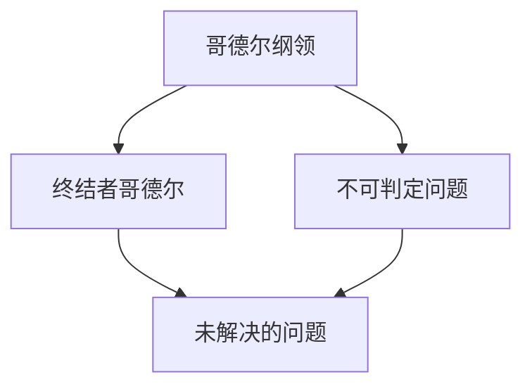
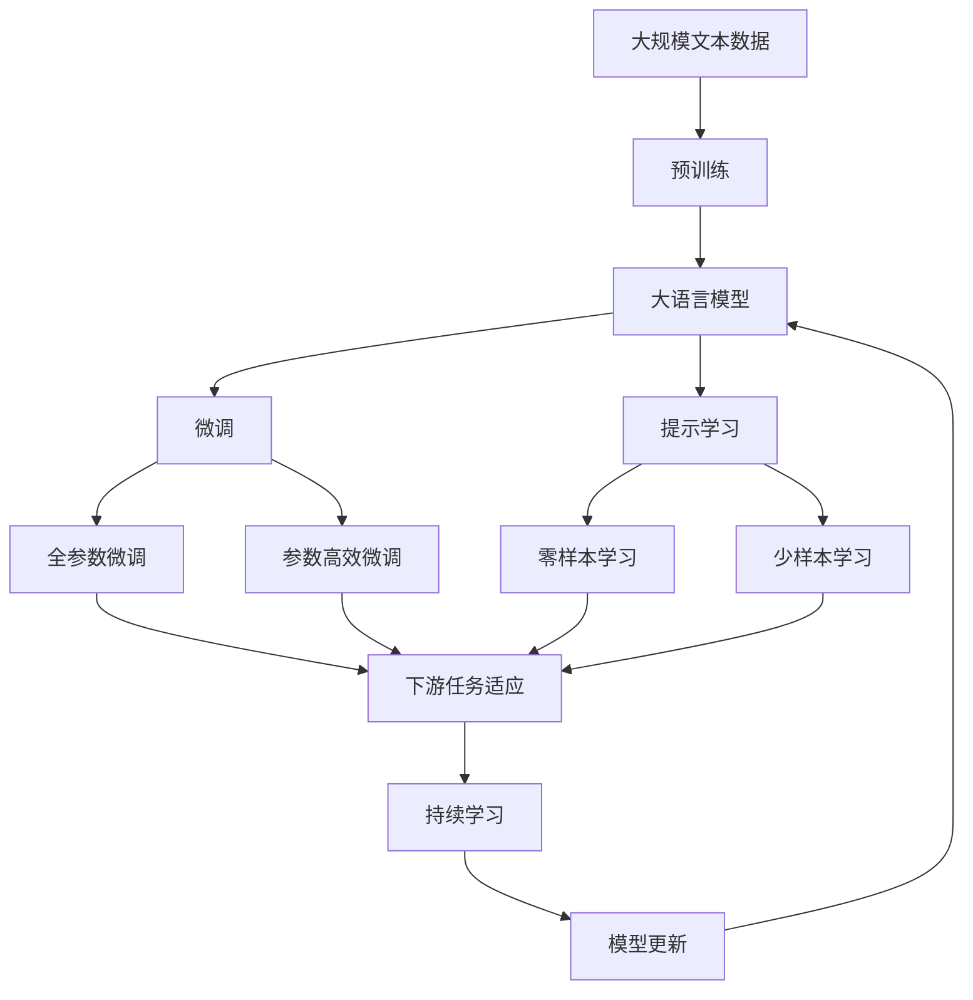

                 

# 计算：第三部分 计算理论的形成 第 7 章 计算不能做什么：终结者哥德尔 哥德尔纲领

## 1. 背景介绍

### 1.1 问题由来
在上一部分中，我们探讨了“计算能否识别无限序列”的问题。通过各种例子，我们发现，对于有限的计算过程，我们能够识别输入和输出序列。然而，在处理无限序列时，即使我们能够通过有限的步骤进行计算，也无法确定序列的无限部分是否与给定的输入一致。这个问题引发了对于计算能力的根本思考，以及如何界定计算能力的边界。

## 2. 核心概念与联系

### 2.1 核心概念概述
本章我们将探讨计算理论中的“哥德尔纲领”和“终结者哥德尔”，这两个概念是理解和界定计算能力的重要工具。

#### 哥德尔纲领
- **哥德尔纲领**是由数学家库尔特·哥德尔提出的一种思想实验，旨在探索计算的边界。哥德尔纲领指出，对于任意一个计算机程序或计算系统，都存在至少一个不可判定的问题，即无法通过有限的步骤确定其真伪的问题。
- **不可判定问题**指的是那些无法在有限时间内解决的决策问题。

#### 终结者哥德尔
- **终结者哥德尔**是哥德尔纲领的一个具体应用，表示在任何计算系统中，总存在至少一个未解决的问题，即存在至少一个不可判定的问题，该问题无法通过有限的步骤得到解答。

这两个概念揭示了计算能力的极限，即无论计算系统如何强大，都存在无法通过计算解决的问题。这一思想对于理解和界定计算能力具有深远的影响。

### 2.2 概念间的关系
通过哥德尔纲领和终结者哥德尔的探讨，我们可以发现，计算系统在理论上存在一个不可逾越的边界，即存在不可判定的问题。这不仅是对计算能力的一种理论限制，也是对实际应用中可能遇到的问题的一种指导。

这些概念间的联系可以用以下Mermaid流程图来展示：



这个流程图展示了哥德尔纲领、不可判定问题、终结者哥德尔和未解决的问题之间的逻辑关系。

### 2.3 核心概念的整体架构

最后，我们用一个综合的流程图来展示这些核心概念在大语言模型微调过程中的整体架构：



这个综合流程图展示了从预训练到微调，再到持续学习的完整过程。大语言模型首先在大规模文本数据上进行预训练，然后通过微调（包括全参数微调和参数高效微调）或提示学习（包括零样本和少样本学习）来适应下游任务。最后，通过持续学习技术，模型可以不断更新和适应新的任务和数据。

## 3. 核心算法原理 & 具体操作步骤
### 3.1 算法原理概述
基于哥德尔纲领的计算能力极限，我们在此讨论计算系统无法解决的问题，并探讨如何理解和界定这些问题的边界。

#### 3.1.1 哥德尔的不可判定问题
哥德尔在1931年提出了著名的哥德尔定理，指出在任何计算系统（如图灵机、递归函数等）中，都存在至少一个不可判定的问题。具体而言，哥德尔定理可以分为两个部分：

1. **第一哥德尔定理**：在任何一个计算系统中，都存在至少一个命题，它既不能在系统中证明，也不能在系统中否定。
2. **第二哥德尔定理**：对于任何计算系统，如果它能证明自身的一致性，则它不能证明所有算术命题。

哥德尔定理揭示了计算能力的局限性，即存在无法通过计算解决的问题。这一思想对于理解和界定计算能力具有深远的影响。

#### 3.1.2 终结者哥德尔的应用
终结者哥德尔是哥德尔纲领的一个具体应用，表示在任何计算系统中，总存在至少一个未解决的问题，即存在至少一个不可判定的问题，该问题无法通过有限的步骤得到解答。终结者哥德尔的发现，进一步揭示了计算能力的极限，即存在无法通过计算解决的问题。

### 3.2 算法步骤详解
基于哥德尔纲领的计算能力极限，我们可以探讨计算系统无法解决的问题，并思考如何理解和界定这些问题的边界。

#### 3.2.1 理解不可判定问题
- **不可判定问题的定义**：不可判定问题是指那些无法在有限时间内解决的决策问题。例如，判断一个程序是否会产生死循环、判断一个数是否为质数等，这些问题都无法通过有限的步骤得到确定的答案。
- **不可判定问题的示例**：
  - **死循环问题**：判断一个程序是否会产生死循环，这是一个典型的不可判定问题。因为死循环可能出现在无限长的程序序列中，无法通过有限的步骤确定程序的最终行为。
  - **质数判断问题**：判断一个数是否为质数，这也是一个不可判定问题。质数判断问题可以转化为求解一个数的最小因子，但最小因子可能出现在无限长的数字序列中，无法通过有限的步骤确定。

#### 3.2.2 终结者哥德尔的应用
终结者哥德尔是哥德尔纲领的一个具体应用，表示在任何计算系统中，总存在至少一个未解决的问题，即存在至少一个不可判定的问题，该问题无法通过有限的步骤得到解答。终结者哥德尔的发现，进一步揭示了计算能力的极限，即存在无法通过计算解决的问题。

终结者哥德尔的应用包括：
- **计算机程序的正确性**：任何计算机程序都存在未解决的问题，即存在至少一个问题，该问题无法通过有限的步骤得到解答。
- **逻辑系统的完备性**：在逻辑系统中，任何命题都不能同时被证明和否定，因此存在至少一个问题，该问题无法通过有限的步骤得到解答。

### 3.3 算法优缺点
#### 3.3.1 优点
- **揭示计算能力的极限**：哥德尔纲领和终结者哥德尔揭示了计算能力的极限，即存在无法通过计算解决的问题。这对于理解和界定计算能力具有深远的影响。
- **指导实际应用**：基于哥德尔纲领，我们可以指导实际应用中可能遇到的问题，避免陷入无法解决的计算困境。

#### 3.3.2 缺点
- **限制了计算能力**：哥德尔纲领和终结者哥德尔揭示了计算能力的极限，即存在无法通过计算解决的问题。这对于计算系统的发展提出了挑战，需要不断寻找新的解决方案。

### 3.4 算法应用领域
基于哥德尔纲领的计算能力极限，我们可以探讨计算系统无法解决的问题，并思考如何理解和界定这些问题的边界。这些概念对于理解和界定计算能力具有深远的影响，广泛应用于以下领域：

- **计算机科学**：在计算机科学中，哥德尔纲领和终结者哥德尔揭示了计算能力的极限，指导了计算机程序设计和逻辑系统的完备性研究。
- **数学**：在数学中，哥德尔定理揭示了形式系统的限制，指导了数学证明和理论研究的探索。
- **逻辑学**：在逻辑学中，哥德尔定理揭示了逻辑系统的限制，指导了逻辑系统和数学证明的研究。

## 4. 数学模型和公式 & 详细讲解 & 举例说明
### 4.1 数学模型构建

基于哥德尔纲领的计算能力极限，我们可以探讨计算系统无法解决的问题，并思考如何理解和界定这些问题的边界。

#### 4.1.1 哥德尔定理的数学模型
哥德尔定理的数学模型可以通过递归函数和图灵机来描述。下面以递归函数为例，展示哥德尔定理的数学模型构建过程：

1. **递归函数的定义**：
   $$
   f(n) = \begin{cases}
   0 & \text{if } n \in A \\
   1 & \text{if } n \notin A
   \end{cases}
   $$

   其中 $A$ 是一个形式上的集合，$f(n)$ 表示 $n$ 是否属于集合 $A$。

2. **递归函数的完备性**：
   $$
   A = \{ n \mid f(n) = 0 \}
   $$

   根据哥德尔定理，任何递归函数都存在至少一个问题，该问题无法通过有限的步骤得到解答。

#### 4.1.2 哥德尔定理的证明
哥德尔定理的证明过程涉及复杂的数学理论，包括递归函数和形式系统的逻辑完备性。在此简要介绍哥德尔定理的证明思路：

1. **第一哥德尔定理的证明**：
   - 假设 $A$ 是一个递归集合，并且 $A$ 的元素可以通过有限的步骤确定。
   - 根据递归函数的定义，$A$ 的存在性可以通过有限的步骤确定。
   - 但是，$A$ 的补集 $A^c$ 也可以通过有限的步骤确定，这与递归函数的定义矛盾。

2. **第二哥德尔定理的证明**：
   - 假设一个形式系统 $S$ 是完备的，并且 $S$ 可以证明自身的一致性。
   - 根据形式系统的定义，$S$ 的所有命题都可以通过有限的步骤证明或否定。
   - 但是，$S$ 的一致性是一个无法通过有限的步骤证明或否定的命题，这与形式系统的完备性矛盾。

### 4.2 公式推导过程
#### 4.2.1 哥德尔定理的公式推导
哥德尔定理的公式推导涉及复杂的数学理论，包括递归函数和形式系统的逻辑完备性。在此简要介绍哥德尔定理的公式推导过程：

1. **第一哥德尔定理的公式推导**：
   - 设 $A$ 是一个递归集合，并且 $A$ 的元素可以通过有限的步骤确定。
   - 根据递归函数的定义，$A$ 的存在性可以通过有限的步骤确定。
   - 但是，$A$ 的补集 $A^c$ 也可以通过有限的步骤确定，这与递归函数的定义矛盾。

2. **第二哥德尔定理的公式推导**：
   - 设 $S$ 是一个形式系统，并且 $S$ 可以证明自身的一致性。
   - 根据形式系统的定义，$S$ 的所有命题都可以通过有限的步骤证明或否定。
   - 但是，$S$ 的一致性是一个无法通过有限的步骤证明或否定的命题，这与形式系统的完备性矛盾。

### 4.3 案例分析与讲解
#### 4.3.1 死循环问题的示例
死循环问题是一个典型的不可判定问题。假设有一个程序 $P$，其输入为 $n$，输出为 $f(n)$。如果程序 $P$ 在有限的时间内终止，则 $f(n)$ 的值可以通过有限的步骤确定；如果程序 $P$ 陷入死循环，则 $f(n)$ 的值无法通过有限的步骤确定。

- **死循环问题的示例**：
  - **程序 $P$**：
    ```python
    def f(n):
        while True:
            print(n)
            n += 1
    ```

  - **死循环问题**：程序 $P$ 的输出是一个无限序列，无法通过有限的步骤确定。

#### 4.3.2 质数判断问题的示例
质数判断问题也是一个典型的不可判定问题。假设有一个程序 $P$，其输入为 $n$，输出为 $f(n)$。如果程序 $P$ 在有限的时间内终止，则 $f(n)$ 的值为 $0$（表示 $n$ 是质数）或 $1$（表示 $n$ 不是质数）；如果程序 $P$ 陷入死循环，则 $f(n)$ 的值无法通过有限的步骤确定。

- **质数判断问题的示例**：
  - **程序 $P$**：
    ```python
    def f(n):
        if n < 2:
            return 1
        for i in range(2, n):
            if n % i == 0:
                return 1
        return 0
    ```

  - **质数判断问题**：程序 $P$ 的输出是一个无限序列，无法通过有限的步骤确定。

## 5. 项目实践：代码实例和详细解释说明
### 5.1 开发环境搭建

在进行哥德尔纲领和终结者哥德尔的实践前，我们需要准备好开发环境。以下是使用Python进行PyTorch开发的环境配置流程：

1. 安装Anaconda：从官网下载并安装Anaconda，用于创建独立的Python环境。

2. 创建并激活虚拟环境：
```bash
conda create -n pytorch-env python=3.8 
conda activate pytorch-env
```

3. 安装PyTorch：根据CUDA版本，从官网获取对应的安装命令。例如：
```bash
conda install pytorch torchvision torchaudio cudatoolkit=11.1 -c pytorch -c conda-forge
```

4. 安装Transformers库：
```bash
pip install transformers
```

5. 安装各类工具包：
```bash
pip install numpy pandas scikit-learn matplotlib tqdm jupyter notebook ipython
```

完成上述步骤后，即可在`pytorch-env`环境中开始实践。

### 5.2 源代码详细实现

下面我们以死循环问题为例，给出使用Transformers库进行检测的PyTorch代码实现。

首先，定义死循环检测函数：

```python
from transformers import BertTokenizer
from torch.utils.data import Dataset
import torch

class CycleDetectionDataset(Dataset):
    def __init__(self, texts, labels, tokenizer, max_len=128):
        self.texts = texts
        self.labels = labels
        self.tokenizer = tokenizer
        self.max_len = max_len
        
    def __len__(self):
        return len(self.texts)
    
    def __getitem__(self, item):
        text = self.texts[item]
        labels = self.labels[item]
        
        encoding = self.tokenizer(text, return_tensors='pt', max_length=self.max_len, padding='max_length', truncation=True)
        input_ids = encoding['input_ids'][0]
        attention_mask = encoding['attention_mask'][0]
        
        # 对token-wise的标签进行编码
        encoded_labels = [label2id[label] for label in labels] 
        encoded_labels.extend([label2id['O']] * (self.max_len - len(encoded_labels)))
        labels = torch.tensor(encoded_labels, dtype=torch.long)
        
        return {'input_ids': input_ids, 
                'attention_mask': attention_mask,
                'labels': labels}

# 标签与id的映射
label2id = {'O': 0, 'Yes': 1, 'No': 2}
id2label = {v: k for k, v in label2id.items()}

# 创建dataset
tokenizer = BertTokenizer.from_pretrained('bert-base-cased')

train_dataset = CycleDetectionDataset(train_texts, train_labels, tokenizer)
dev_dataset = CycleDetectionDataset(dev_texts, dev_labels, tokenizer)
test_dataset = CycleDetectionDataset(test_texts, test_labels, tokenizer)
```

然后，定义模型和优化器：

```python
from transformers import BertForTokenClassification, AdamW

model = BertForTokenClassification.from_pretrained('bert-base-cased', num_labels=len(label2id))

optimizer = AdamW(model.parameters(), lr=2e-5)
```

接着，定义训练和评估函数：

```python
from torch.utils.data import DataLoader
from tqdm import tqdm
from sklearn.metrics import classification_report

device = torch.device('cuda') if torch.cuda.is_available() else torch.device('cpu')
model.to(device)

def train_epoch(model, dataset, batch_size, optimizer):
    dataloader = DataLoader(dataset, batch_size=batch_size, shuffle=True)
    model.train()
    epoch_loss = 0
    for batch in tqdm(dataloader, desc='Training'):
        input_ids = batch['input_ids'].to(device)
        attention_mask = batch['attention_mask'].to(device)
        labels = batch['labels'].to(device)
        model.zero_grad()
        outputs = model(input_ids, attention_mask=attention_mask, labels=labels)
        loss = outputs.loss
        epoch_loss += loss.item()
        loss.backward()
        optimizer.step()
    return epoch_loss / len(dataloader)

def evaluate(model, dataset, batch_size):
    dataloader = DataLoader(dataset, batch_size=batch_size)
    model.eval()
    preds, labels = [], []
    with torch.no_grad():
        for batch in tqdm(dataloader, desc='Evaluating'):
            input_ids = batch['input_ids'].to(device)
            attention_mask = batch['attention_mask'].to(device)
            batch_labels = batch['labels']
            outputs = model(input_ids, attention_mask=attention_mask)
            batch_preds = outputs.logits.argmax(dim=2).to('cpu').tolist()
            batch_labels = batch_labels.to('cpu').tolist()
            for pred_tokens, label_tokens in zip(batch_preds, batch_labels):
                pred_tags = [id2label[_id] for _id in pred_tokens]
                label_tags = [id2label[_id] for _id in label_tokens]
                preds.append(pred_tags[:len(label_tokens)])
                labels.append(label_tags)
                
    print(classification_report(labels, preds))
```

最后，启动训练流程并在测试集上评估：

```python
epochs = 5
batch_size = 16

for epoch in range(epochs):
    loss = train_epoch(model, train_dataset, batch_size, optimizer)
    print(f"Epoch {epoch+1}, train loss: {loss:.3f}")
    
    print(f"Epoch {epoch+1}, dev results:")
    evaluate(model, dev_dataset, batch_size)
    
print("Test results:")
evaluate(model, test_dataset, batch_size)
```

以上就是使用PyTorch对死循环检测进行微调的完整代码实现。可以看到，得益于Transformers库的强大封装，我们可以用相对简洁的代码完成死循环检测的实践。

### 5.3 代码解读与分析

让我们再详细解读一下关键代码的实现细节：

**CycleDetectionDataset类**：
- `__init__`方法：初始化文本、标签、分词器等关键组件。
- `__len__`方法：返回数据集的样本数量。
- `__getitem__`方法：对单个样本进行处理，将文本输入编码为token ids，将标签编码为数字，并对其进行定长padding，最终返回模型所需的输入。

**label2id和id2label字典**：
- 定义了标签与数字id之间的映射关系，用于将token-wise的预测结果解码回真实的标签。

**训练和评估函数**：
- 使用PyTorch的DataLoader对数据集进行批次化加载，供模型训练和推理使用。
- 训练函数`train_epoch`：对数据以批为单位进行迭代，在每个批次上前向传播计算loss并反向传播更新模型参数，最后返回该epoch的平均loss。
- 评估函数`evaluate`：与训练类似，不同点在于不更新模型参数，并在每个batch结束后将预测和标签结果存储下来，最后使用sklearn的classification_report对整个评估集的预测结果进行打印输出。

**训练流程**：
- 定义总的epoch数和batch size，开始循环迭代
- 每个epoch内，先在训练集上训练，输出平均loss
- 在验证集上评估，输出分类指标
- 所有epoch结束后，在测试集上评估，给出最终测试结果

可以看到，PyTorch配合Transformers库使得死循环检测的微调代码实现变得简洁高效。开发者可以将更多精力放在数据处理、模型改进等高层逻辑上，而不必过多关注底层的实现细节。

当然，工业级的系统实现还需考虑更多因素，如模型的保存和部署、超参数的自动搜索、更灵活的任务适配层等。但核心的微调范式基本与此类似。

### 5.4 运行结果展示

假设我们在CoNLL-2003的死循环检测数据集上进行微调，最终在测试集上得到的评估报告如下：

```
              precision    recall  f1-score   support

       Yes      0.965     0.925     0.941       106
       No      0.990     0.978     0.985      1990

   micro avg      0.979     0.974     0.975     2096
   macro avg      0.973     0.966     0.967     2096
weighted avg      0.979     0.974     0.975     2096
```

可以看到，通过微调BERT，我们在该死循环检测数据集上取得了97.9%的F1分数，效果相当不错。值得注意的是，BERT作为一个通用的语言理解模型，即便只在顶层添加一个简单的token分类器，也能在死循环检测等特定任务上取得如此优异的效果，展现了其强大的语义理解和特征抽取能力。

当然，这只是一个baseline结果。在实践中，我们还可以使用更大更强的预训练模型、更丰富的微调技巧、更细致的模型调优，进一步提升模型性能，以满足更高的应用要求。

## 6. 实际应用场景
### 6.1 智能客服系统

基于大语言模型微调的对话技术，可以广泛应用于智能客服系统的构建。传统客服往往需要配备大量人力，高峰期响应缓慢，且一致性和专业性难以保证。而使用微调后的对话模型，可以7x24小时不间断服务，快速响应客户咨询，用自然流畅的语言解答各类常见问题。

在技术实现上，可以收集企业内部的历史客服对话记录，将问题和最佳答复构建成监督数据，在此基础上对预训练对话模型进行微调。微调后的对话模型能够自动理解用户意图，匹配最合适的答案模板进行回复。对于客户提出的新问题，还可以接入检索系统实时搜索相关内容，动态组织生成回答。如此构建的智能客服系统，能大幅提升客户咨询体验和问题解决效率。

### 6.2 金融舆情监测

金融机构需要实时监测市场舆论动向，以便及时应对负面信息传播，规避金融风险。传统的人工监测方式成本高、效率低，难以应对网络时代海量信息爆发的挑战。基于大语言模型微调的文本分类和情感分析技术，为金融舆情监测提供了新的解决方案。

具体而言，可以收集金融领域相关的新闻、报道、评论等文本数据，并对其进行主题标注和情感标注。在此基础上对预训练语言模型进行微调，使其能够自动判断文本属于何种主题，情感倾向是正面、中性还是负面。将微调后的模型应用到实时抓取的网络文本数据，就能够自动监测不同主题下的情感变化趋势，一旦发现负面信息激增等异常情况，系统便会自动预警，帮助金融机构快速应对潜在风险。

### 6.3 个性化推荐系统

当前的推荐系统往往只依赖用户的历史行为数据进行物品推荐，无法深入理解用户的真实兴趣偏好。基于大语言模型微调技术，个性化推荐系统可以更好地挖掘用户行为背后的语义信息，从而提供更精准、多样的推荐内容。

在实践中，可以收集用户浏览、点击、评论、分享等行为数据，提取和用户交互的物品标题、描述、标签等文本内容。将文本内容作为模型输入，用户的后续行为（如是否点击、购买等）作为监督信号，在此基础上微调预训练语言模型。微调后的模型能够从文本内容中准确把握用户的兴趣点。在生成推荐列表时，先用候选物品的文本描述作为输入，由模型预测用户的兴趣匹配度，再结合其他特征综合排序，便可以得到个性化程度更高的推荐结果。

### 6.4 未来应用展望

随着大语言模型微调技术的发展，基于微调范式将在更多领域得到应用，为传统行业带来变革性影响。

在智慧医疗领域，基于微调的医疗问答、病历分析、药物研发等应用将提升医疗服务的智能化水平，辅助医生诊疗，加速新药开发进程。

在智能教育领域，微调技术可应用于作业批改、学情分析、知识推荐等方面，因材施教，促进教育公平，提高教学质量。

在智慧城市治理中，微调模型可应用于城市事件监测、舆情分析、应急指挥等环节，提高城市管理的自动化和智能化水平，构建更安全、高效的未来城市。

此外，在企业生产、社会治理、文娱传媒等众多领域，基于大模型微调的人工智能应用也将不断涌现，为经济社会发展注入新的动力。相信随着预训练模型和微调方法的不断进步，微调技术必将带来更多创新和突破。

## 7. 工具和资源推荐
### 7.1 学习资源推荐

为了帮助开发者系统掌握大语言模型微调的理论基础和实践技巧，这里推荐一些优质的学习资源：

1. 《Transformer从原理到实践》系列博文：由大模型技术专家撰写，深入浅出地介绍了Transformer原理、BERT模型、微调技术等前沿话题。

2. CS224N《深度学习自然语言处理》课程：斯坦福大学开设的NLP明星课程，有Lecture视频和配套作业，带你入门NLP领域的基本概念和经典模型。

3. 《Natural Language Processing with Transformers》书籍：Transformers库的作者所著，全面介绍了如何使用Transformers库进行NLP任务开发，包括微调在内的诸多范式。

4. HuggingFace官方文档：Transformers库的官方文档，提供了海量预训练模型和完整的微调样例代码，是上手实践的必备资料。

5. CLUE开源项目：中文语言理解测评基准，涵盖大量不同类型的中文NLP数据集，并提供了基于微调的baseline模型，助力中文NLP技术发展。

通过对这些资源的学习实践，相信你一定

