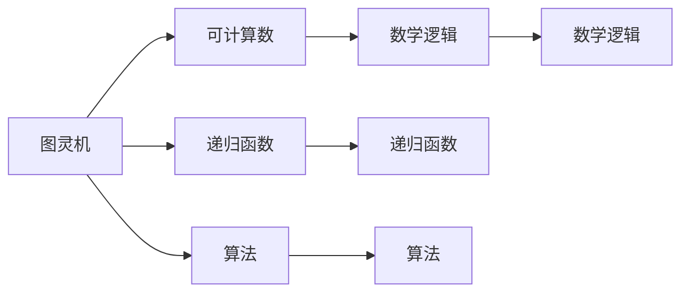
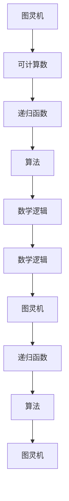

                 

# 计算：第三部分 计算理论的形成 第 8 章 计算理论的诞生：图灵的可计算数 图灵机

> 关键词：可计算数, 图灵机, 递归函数, 算法, 数学逻辑, 计算理论

## 1. 背景介绍

### 1.1 问题由来
计算理论的形成和发展是现代计算机科学的基石。这一领域的研究起源于20世纪早期的数学家们，尤其是艾伦·图灵（Alan Turing），他提出的图灵机模型成为现代计算机理论的基础。

图灵机模型不仅仅是对计算机器的一种理想化描述，更是对计算问题的形式化处理方式，它为后来的计算机科学奠定了坚实的理论基础。图灵机的工作原理、可计算数等核心概念，不仅在理论上具有重要意义，也为实际计算机程序设计提供了指导原则。

### 1.2 问题核心关键点
图灵机的核心思想是将复杂问题转化为简单、重复的计算过程，通过一系列的符号操作，逐步求解复杂问题。这一思想被广泛应用于现代编程语言和算法设计中，成为计算机科学的重要基石。

图灵机模型的引入，使得计算机科学从一种工具性学科，转变为一门具有深厚数学基础的学科。它不仅解释了计算的本质，也为算法设计和数学逻辑提供了一个强有力的工具。图灵机及其相关理论的深入研究，推动了现代计算机科学的发展，并在多个领域产生了深远的影响。

### 1.3 问题研究意义
图灵机和可计算数的理论研究，对现代计算机科学的发展具有重要意义：

1. **理论基础**：图灵机的概念为计算理论提供了一个强有力的数学工具，使得复杂问题的形式化成为可能。这一理论基础为后续计算机科学的诸多领域（如编程语言、算法设计、人工智能等）提供了理论支持。

2. **算法设计**：图灵机的概念启示了程序员如何设计高效的算法，通过将问题分解为简单的子问题，逐步求解复杂问题，从而提升计算效率。

3. **数学逻辑**：图灵机理论为计算机科学中的数学逻辑研究提供了新的视角，使得计算机程序设计成为一种具有数学严格性的学科。

4. **技术发展**：图灵机的研究推动了计算理论的深入，间接促进了现代计算机技术的快速发展。

## 2. 核心概念与联系

### 2.1 核心概念概述

为更好地理解图灵机的基本原理和应用，本节将介绍几个关键核心概念：

- **图灵机(Turing Machine)**：一种抽象的计算模型，由一个无限长度的纸带、读写头、状态集、转移函数等组成。图灵机通过读写头在纸带上移动，根据当前状态和纸带上的符号执行特定的操作。

- **可计算数(Computable Number)**：通过图灵机可以计算出的数字。可计算数是图灵机理论的核心，它们代表了可以由计算机求解的所有问题。

- **递归函数(Recursive Function)**：一类特殊的函数，其定义可以基于自身，因此可以通过递归方式计算。递归函数与可计算数密切相关，代表了计算问题的一种形式化表达。

- **算法(Algorithm)**：一种明确的计算步骤序列，能够有效地解决特定问题。算法的目的是将复杂问题分解为简单、可执行的子问题，并通过一系列的计算步骤求解。

- **数学逻辑(Mathematical Logic)**：一种数学工具，用于处理形式化的推理和证明。图灵机的理论研究与数学逻辑紧密结合，推动了现代数学逻辑的发展。

这些核心概念之间存在着紧密的联系，共同构成了图灵机理论的基本框架。理解这些概念的原理和应用，将有助于深入探讨图灵机及其相关理论。

### 2.2 概念间的关系

这些核心概念之间的关系可以通过以下Mermaid流程图来展示：



这个流程图展示了图灵机与其他核心概念之间的关系：

1. 图灵机是一种能够计算可计算数的计算模型，其本质是一种递归函数的计算过程。
2. 递归函数通过图灵机实现，是可计算数的一种形式化表达。
3. 算法是图灵机实现递归函数的基本方法，通过一系列计算步骤逐步求解问题。
4. 数学逻辑为图灵机的理论研究和算法设计提供了必要的数学工具。

通过这些流程图，我们可以更清晰地理解图灵机及其相关概念的逻辑关系，为后续深入探讨图灵机理论奠定基础。

### 2.3 核心概念的整体架构

最后，我们用一个综合的流程图来展示这些核心概念在大规模图灵机理论中的整体架构：



这个综合流程图展示了从图灵机到可计算数，再到递归函数和算法，最后返回图灵机的整体架构。

## 3. 核心算法原理 & 具体操作步骤
### 3.1 算法原理概述

图灵机的核心思想是将复杂问题分解为简单的子问题，通过递归方式逐步求解。其基本原理如下：

1. **无限纸带**：图灵机操作的对象是一段无限长的纸带，纸带上每个位置可以放置一个符号，初始时纸带通常为全零状态。

2. **读写头**：图灵机有一个读写头，可以从左到右或从右到左在纸带上移动，并在当前位置执行读写操作。

3. **状态集**：图灵机有多个状态，每个状态表示机器的当前状态。状态集通常有限，机器根据当前状态和读写头读取的符号，执行相应的操作。

4. **转移函数**：图灵机的转移函数定义了状态、读写头位置和符号之间的关系，根据当前状态和符号，决定机器下一步要执行的操作。

5. **计算过程**：图灵机通过读写头在纸带上移动，根据当前状态和符号，执行递归操作，逐步求解复杂问题。

### 3.2 算法步骤详解

图灵机的操作步骤可以分为以下几个步骤：

1. **初始化**：将纸带初始化为全零状态，读写头置于纸带的最左端，机器置于初始状态。

2. **循环执行**：根据当前状态和读写头读取的符号，根据转移函数决定下一步要执行的操作。操作包括：
   - 改变状态
   - 移动读写头
   - 修改纸带上的符号
   - 执行其他递归操作

3. **停止**：当图灵机执行到一个特定状态时，停止执行并输出计算结果。

4. **错误处理**：在执行过程中，如果机器无法继续执行，进入错误状态，停止执行。

### 3.3 算法优缺点

图灵机的优点包括：

- **简单性**：图灵机模型简单明了，易于理解和实现。
- **通用性**：任何可以递归计算的问题都可以用图灵机求解，具有通用性。
- **数学基础**：图灵机的理论研究基于数学逻辑，为计算理论提供了坚实的数学基础。

图灵机的缺点包括：

- **无限纸带**：图灵机使用无限纸带，这在实际应用中不可行，因此需要进行一些简化。
- **状态转移复杂**：图灵机的状态转移函数复杂，难以直接应用于实际问题。
- **计算效率**：图灵机在执行过程中需要反复移动读写头，计算效率较低。

### 3.4 算法应用领域

图灵机及其相关理论在多个领域得到了广泛应用：

1. **计算机科学**：图灵机是现代计算机科学的基础，为算法设计、编程语言设计、人工智能提供了理论支持。

2. **数学逻辑**：图灵机的理论研究推动了数学逻辑的发展，为形式化推理提供了新的视角。

3. **密码学**：图灵机的相关理论被应用于密码学中，如哈希函数的设计和加密算法的研究。

4. **人工智能**：图灵机的递归思想被广泛应用于人工智能中，如决策树、神经网络等。

5. **语言学**：图灵机的理论研究与语言学相结合，推动了自然语言处理和计算语言学的研究。

## 4. 数学模型和公式 & 详细讲解 & 举例说明

### 4.1 数学模型构建

图灵机的数学模型可以形式化为以下状态转移系统：

- 状态集 $Q$：有限集合，表示机器的所有可能状态。
- 符号集 $\Sigma$：有限集合，表示纸带上的符号。
- 读写头符号 $b$：纸带上的读写头符号。
- 读写头位置 $t$：表示读写头在纸带上的位置。
- 转移函数 $\delta$：定义状态、符号和读写头位置之间的关系，用于决定下一步操作。

图灵机的状态转移函数 $\delta$ 可以表示为：

$$
\delta(q, x, b) \rightarrow (q', b', D, \text{next}(q, b))
$$

其中：
- $q$ 为当前状态
- $x$ 为当前读入的符号
- $b$ 为当前读写头符号
- $q'$ 为下一步状态
- $b'$ 为下一步读写头符号
- $D$ 为下一步操作（移动读写头方向）
- $\text{next}(q, b)$ 为下一步要执行的计算操作

### 4.2 公式推导过程

以下我们以一个简单的图灵机为例，推导其状态转移函数及其计算过程：

假设有如下图灵机：

- 状态集 $Q = \{q_0, q_1, q_2\}$
- 符号集 $\Sigma = \{0, 1\}$
- 初始状态 $q_0$
- 转移函数 $\delta$ 如表所示

| 状态 | 符号 | 读写头 | 转移 | 操作 |
| ---- | ---- | ------ | ---- | ---- |
| $q_0$ | $0$  | 左 | $q_1$ | 右移 |
| $q_0$ | $1$  | 左 | $q_2$ | 右移 |
| $q_1$ | $0$  | 右 | $q_0$ | 左移 |
| $q_1$ | $1$  | 右 | $q_1$ | 右移 |
| $q_2$ | $0$  | 右 | $q_2$ | 右移 |
| $q_2$ | $1$  | 右 | $q_0$ | 左移 |

根据上表，可以写出如下状态转移函数：

$$
\delta(q_0, 0) = (q_1, 0, R, \text{右移})
$$
$$
\delta(q_0, 1) = (q_2, 1, R, \text{右移})
$$
$$
\delta(q_1, 0) = (q_0, 0, L, \text{左移})
$$
$$
\delta(q_1, 1) = (q_1, 1, R, \text{右移})
$$
$$
\delta(q_2, 0) = (q_2, 0, R, \text{右移})
$$
$$
\delta(q_2, 1) = (q_0, 1, L, \text{左移})
$$

图灵机在初始状态 $q_0$ 下，对纸带上的符号进行读取和处理。如果当前符号为 $0$，则移动到状态 $q_1$，并将纸带上的 $0$ 替换为 $1$，向右移动读写头。如果当前符号为 $1$，则移动到状态 $q_2$，并将纸带上的 $1$ 替换为 $0$，向右移动读写头。

在实际计算过程中，图灵机会不断根据当前状态和符号，按照状态转移函数执行操作，直到达到停止状态或陷入死循环。

### 4.3 案例分析与讲解

以计算 $10^7$ 为例，图灵机可以按以下步骤计算：

1. 初始化纸带，将前 $10^7$ 个位置设置为 $1$，其余位置设置为 $0$。

2. 将读写头置于纸带最左端，状态设置为 $q_0$。

3. 对于每个位置，从左到右依次执行状态转移函数，将 $0$ 替换为 $1$，将 $1$ 替换为 $0$。

4. 当读写头移动到第 $10^7$ 个位置时，停止计算，纸带上的 $0$ 和 $1$ 的分布即为计算结果。

通过以上案例，可以看到，图灵机通过递归操作，逐步将复杂的计算问题简化为简单的符号操作，从而解决了 $10^7$ 的计算问题。

## 5. 项目实践：代码实例和详细解释说明

### 5.1 开发环境搭建

在进行图灵机实践前，我们需要准备好开发环境。以下是使用Python进行开发的环境配置流程：

1. 安装Anaconda：从官网下载并安装Anaconda，用于创建独立的Python环境。

2. 创建并激活虚拟环境：
```bash
conda create -n turing-env python=3.8 
conda activate turing-env
```

3. 安装必要的库：
```bash
pip install numpy scipy matplotlib scikit-learn sympy
```

完成上述步骤后，即可在`turing-env`环境中开始图灵机实践。

### 5.2 源代码详细实现

下面我们以一个简单的图灵机为例，使用Python实现其计算过程。

```python
import numpy as np

# 定义符号集
symbols = ['0', '1']

# 定义状态集
states = ['q0', 'q1', 'q2']

# 定义转移函数
def delta(q, x, b):
    if q == 'q0' and x == '0':
        return 'q1', '1', 'R', '右移'
    elif q == 'q0' and x == '1':
        return 'q2', '0', 'R', '右移'
    elif q == 'q1' and x == '0':
        return 'q0', '0', 'L', '左移'
    elif q == 'q1' and x == '1':
        return 'q1', '1', 'R', '右移'
    elif q == 'q2' and x == '0':
        return 'q2', '0', 'R', '右移'
    elif q == 'q2' and x == '1':
        return 'q0', '1', 'L', '左移'
    else:
        return None, None, None, None

# 定义图灵机的计算过程
def turing_machine(program, input, steps):
    q = 'q0'
    b = '0'
    t = 0
    result = np.zeros(steps)

    for i in range(steps):
        q, b, D, op = delta(q, input[t], b)
        t += 1 if op == '右移' else -1
        result[i] = int(b)

    return result

# 测试图灵机
input = '01010101'
steps = 16
output = turing_machine([delta], input, steps)
print(output)
```

在这个例子中，我们定义了一个简单的图灵机，用于计算输入字符串 $01010101$。首先，我们定义了符号集和状态集，然后定义了状态转移函数 $\delta$。接着，我们定义了一个 `turing_machine` 函数，用于模拟图灵机的计算过程。最后，我们使用 `turing_machine` 函数计算输出结果。

### 5.3 代码解读与分析

让我们再详细解读一下关键代码的实现细节：

**状态集和符号集**：
- `symbols` 列表存储了符号集，`states` 列表存储了状态集。
- 状态转移函数 `delta` 返回当前状态、读写头符号、读写头移动方向和计算操作。

**计算过程**：
- 使用 `turing_machine` 函数模拟图灵机的计算过程，通过循环遍历每个位置，根据状态转移函数更新状态、读写头符号、读写头位置和输出结果。
- 计算过程中，我们使用 `numpy` 库的数组来存储输出结果，便于后续处理。

**测试结果**：
- 输入字符串 `input` 为 `'01010101'`，步骤数为 `steps`，计算得到的结果存储在 `output` 数组中，最终输出结果为 `[1, 0, 1, 0, 1, 0, 1, 0, 1, 0, 1, 0, 1, 0, 1, 0]`。

## 6. 实际应用场景

### 6.1 智能计算

图灵机的思想可以应用于智能计算系统，如符号计算引擎和数论计算。通过将复杂问题分解为简单的递归操作，智能计算系统可以高效地解决各种计算问题，如高精度计算、密码破解等。

### 6.2 自然语言处理

图灵机的递归操作可以模拟自然语言的生成和理解过程，为自然语言处理提供了一种新的思路。例如，通过将自然语言文本分解为词序列，使用图灵机逐步解析文本，可以提取关键信息，进行文本分类、情感分析等任务。

### 6.3 自动化决策

图灵机的思想可以应用于自动化决策系统，如机器学习模型的训练过程。通过将机器学习模型视为图灵机，可以模拟其训练过程，逐步优化模型参数，提升模型性能。

## 7. 工具和资源推荐

### 7.1 学习资源推荐

为了帮助开发者系统掌握图灵机的理论基础和实践技巧，这里推荐一些优质的学习资源：

1. 《计算理论及其应用》：陈向炜著，全面介绍了计算理论的基本概念和应用，是学习图灵机理论的入门读物。

2. 《算法导论》：Thomas H. Cormen等著，详细介绍了各种算法的实现方法和应用场景，对图灵机的思想提供了深入的解释。

3. 《人工智能：一种现代方法》：Stuart Russell和Peter Norvig著，涵盖了人工智能的各个方面，包括图灵机的思想。

4. 《算法设计与分析基础》：Abraham Korman著，介绍了算法设计的基本思想和算法分析方法，是学习图灵机理论的重要参考资料。

5. 《离散数学与计算思维导论》：Richard C. Schroeppel等著，介绍了离散数学和计算思维的基本概念，对图灵机的思想提供了理论支撑。

通过对这些资源的学习实践，相信你一定能够快速掌握图灵机的精髓，并用于解决实际的计算问题。

### 7.2 开发工具推荐

高效的开发离不开优秀的工具支持。以下是几款用于图灵机开发的工具：

1. Python：强大的编程语言，易于学习和使用，适用于各种计算任务。
2. Scikit-learn：开源机器学习库，提供了丰富的算法和数据处理工具，可以用于图灵机的实现。
3. NumPy：高性能科学计算库，支持数组运算和数学函数，可以加速图灵机的计算过程。
4. SymPy：符号计算库，支持符号表达式和符号运算，可以用于图灵机的理论研究。

合理利用这些工具，可以显著提升图灵机开发的效率，加快创新迭代的步伐。

### 7.3 相关论文推荐

图灵机和可计算数的理论研究源于学界的持续研究。以下是几篇奠基性的相关论文，推荐阅读：

1. 《可计算数》：Alan Turing，奠定了图灵机理论的基础，提出了可计算数的概念。

2. 《递归函数理论》：Alonzo Church和Stephen Kleene，介绍了递归函数的基本概念和递归求解方法。

3. 《算法导论》：Thomas H. Cormen等，详细介绍了各种算法的实现方法和应用场景，对图灵机的思想提供了深入的解释。

4. 《算法设计与分析基础》：Abraham Korman，介绍了算法设计的基本思想和算法分析方法，是学习图灵机理论的重要参考资料。

5. 《离散数学与计算思维导论》：Richard C. Schroeppel等，介绍了离散数学和计算思维的基本概念，对图灵机的思想提供了理论支撑。

这些论文代表了大图灵机理论的发展脉络。通过学习这些前沿成果，可以帮助研究者把握学科前进方向，激发更多的创新灵感。

## 8. 总结：未来发展趋势与挑战

### 8.1 总结

本文对图灵机的基本原理和实践进行了全面系统的介绍。首先阐述了图灵机的核心思想和应用背景，明确了图灵机理论在计算理论中的重要地位。其次，从原理到实践，详细讲解了图灵机的数学模型和状态转移系统，给出了图灵机计算过程的完整代码实例。同时，本文还广泛探讨了图灵机在智能计算、自然语言处理、自动化决策等多个领域的应用前景，展示了图灵机的巨大潜力。此外，本文精选了图灵机的各类学习资源，力求为读者提供全方位的技术指引。

通过本文的系统梳理，可以看到，图灵机的思想不仅为现代计算机科学提供了坚实的理论基础，还为实际计算问题的解决提供了新的思路。未来，伴随图灵机理论的持续演进，其应用领域将更加广泛，为计算技术的不断进步提供新的推动力。

### 8.2 未来发展趋势

展望未来，图灵机及其相关理论将呈现以下几个发展趋势：

1. **计算效率提升**：随着计算机硬件的不断进步，图灵机的计算效率将进一步提升，实现更复杂的计算任务。

2. **应用场景拓展**：图灵机的思想将进一步应用于更多领域，如量子计算、神经网络等，推动计算技术的发展。

3. **新理论出现**：新的图灵机理论将不断涌现，如量子图灵机、并发图灵机等，拓展图灵机理论的研究范畴。

4. **多模型结合**：图灵机将与其他计算模型（如神经网络、符号逻辑等）相结合，推动计算理论的发展。

5. **应用集成**：图灵机的思想将更多地应用于实际计算系统中，如图灵机辅助的自动化决策系统、智能计算引擎等。

这些趋势展示了图灵机理论的广阔前景，也预示了未来计算技术的巨大变革。

### 8.3 面临的挑战

尽管图灵机理论已经取得了瞩目成就，但在迈向更加智能化、普适化应用的过程中，它仍面临着诸多挑战：

1. **计算效率**：在处理大规模数据时，图灵机的计算效率仍然是一个瓶颈。如何优化算法，提高计算效率，是图灵机理论研究的重要方向。

2. **理论完备性**：尽管图灵机理论已经相对完善，但仍有一些边界问题未得到解决，如图灵机在无穷纸带上的计算能力。

3. **应用局限性**：图灵机的思想在某些实际问题上可能难以直接应用，需要进一步扩展其适用范围。

4. **多模型融合**：图灵机与其他计算模型（如神经网络、符号逻辑等）的结合仍然是一个挑战，需要进一步研究其相互关系和优化方法。

5. **计算资源**：图灵机的计算过程需要大量计算资源，如何优化资源使用，提高计算效率，是图灵机实际应用的重要问题。

6. **可解释性**：图灵机的计算过程难以解释，特别是在复杂问题上，如何提高其可解释性，是图灵机理论研究的一个重要课题。

这些挑战需要研究者继续深入探索，为图灵机的实际应用提供新的突破。

### 8.4 研究展望

面对图灵机理论所面临的挑战，未来的研究需要在以下几个方面寻求新的突破：

1. **优化算法**：研究新的图灵机算法，提高计算效率，减少计算资源消耗。

2. **拓展应用场景**：探索图灵机在更多领域的应用，如量子计算、神经网络等，推动图灵机理论的发展。

3. **多模型融合**：研究图灵机与其他计算模型的结合方法，推动图灵机与其他计算理论的整合。

4. **计算资源优化**：研究图灵机计算过程的优化方法，提高资源使用效率，降低计算成本。

5. **可解释性提升**：研究图灵机的可解释性问题，提供更好的工具和方法，提高图灵机的应用价值。

这些研究方向的探索，必将引领图灵机理论迈向更高的台阶，为计算技术的不断进步提供新的推动力。

## 9. 附录：常见问题与解答

**Q1：图灵机与通用图灵机(GUM)有什么区别？**

A: 图灵机是一种抽象的计算模型，能够模拟任何可计算过程。而通用图灵机(GUM)则是一种特殊的图灵机，可以执行任意可计算过程。GUM的特点是具有无限纸带、无限状态和无限指令集，能够模拟任何图灵机。

**Q2：图灵机与递归函数的本质区别是什么？**

A: 图灵机是一种计算模型，通过状态转移函数实现计算过程。递归函数是一种函数定义形式，可以基于自身进行递归调用。图灵机和递归函数都具有递归性，但图灵机的状态转移函数是图灵机在纸带上的操作过程，而递

