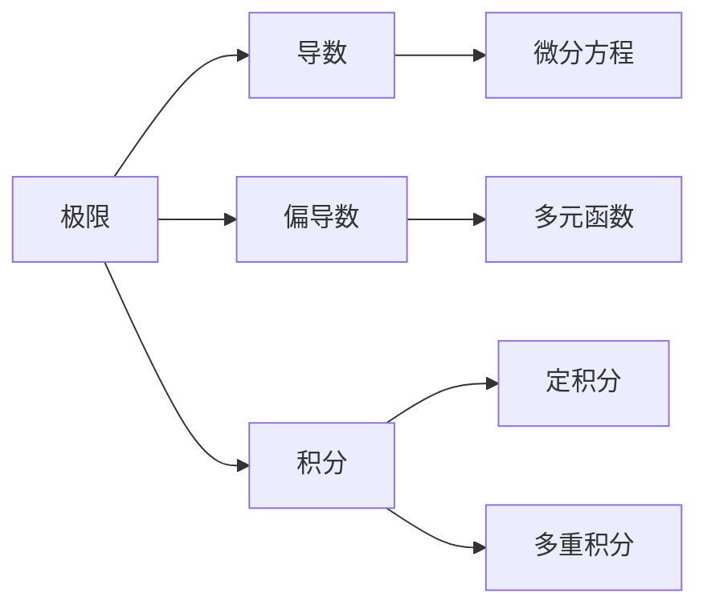

                 

# 计算：第二部分 计算的数学基础 第 4 章 数学的基础 微积分的发明

## 1. 背景介绍

微积分，作为数学的基石之一，在科学计算、工程技术、物理学和经济学等领域有着广泛的应用。它的发明标志着人类对自然界规律认识的巨大飞跃，并极大地推动了人类文明的进步。本章将深入探讨微积分的基本概念、原理及其在计算中的应用，帮助读者理解和掌握这一数学工具。

## 2. 核心概念与联系

### 2.1 核心概念概述

微积分（Calculus），又称为分析学，包括微分（Differential Calculus）和积分（Integral Calculus）两部分。微分主要研究函数的变化率和切线，积分则关注面积和体积的计算。微积分不仅在数学理论中占有重要地位，还在实际应用中扮演关键角色。

#### 2.1.1 微分

微分分为导数和偏导数，分别用于研究函数的变化率和偏变化率。导数描述了一个函数在某一点的瞬时变化率，而偏导数则处理多变量函数中各个自变量对函数值的影响。

#### 2.1.2 积分

积分分为定积分和多重积分，用于计算函数曲线下的面积或体积。定积分表示一个函数在某一区间上的累积值，而多重积分则拓展到三维或多维空间。

#### 2.1.3 极限

极限是微积分中的核心概念，用于描述变量在某一点或某区域内的收敛行为。极限在微积分的各个分支中均有应用，是理解和证明微积分定理的基础。

### 2.2 核心概念的联系

微积分的各个概念之间有着紧密的联系，其核心思想是通过对函数的变化率和累积值的研究，揭示自然界和数学中的规律。微分和积分相辅相成，微分求导帮助理解函数的瞬时变化，积分求积则帮助计算函数曲线下的面积和体积。极限则是微积分中处理无限和连续问题的基本工具。

#### 2.2.1 微分的应用

微分的应用广泛，例如在物理学中研究物体运动时的速度和加速度；在工程学中计算曲线的斜率和弯曲程度；在经济学中分析市场价格的变化趋势等。

#### 2.2.2 积分的应用

积分的应用同样广泛，例如在物理学中计算物体在不同区域的质量和力；在工程学中计算空间物体的体积和表面积；在经济学中计算平均成本和边际利润等。

#### 2.2.3 极限的应用

极限的应用也极为重要，例如在微积分中，利用极限来定义导数和积分，从而使得这两个概念在理论上具有严密的数学基础；在物理学中，极限用于处理无穷小量和大量，如电磁波和量子力学中的光速和波长；在工程学中，极限用于处理边界的平滑过渡和逼近问题。

### 2.3 核心概念的整体架构

微积分的核心概念可以通过以下图表展示其整体架构：



这个图表展示了大计算中各个核心概念之间的关系，极限作为基础，导数和偏导数作为微分的部分，积分作为微分的延续，定积分和多重积分作为积分的具体形式，微分方程、多元函数、曲面和体积等则是微积分的应用。

## 3. 核心算法原理 & 具体操作步骤

### 3.1 算法原理概述

微积分的核心算法原理主要包括以下几个方面：

- **导数的定义与计算**：通过极限定义，导数被定义为函数在某一点的瞬时变化率，可以通过差商或导数定义式来计算。
- **积分的定义与计算**：通过极限定义，积分被定义为函数曲线下的面积或体积，可以通过定积分公式或分部积分等方法来计算。
- **微分方程的求解**：通过导数和积分的基本性质，可以构建微分方程，并用迭代法或拉普拉斯变换等方法来求解。

### 3.2 算法步骤详解

微积分的算法步骤一般包括以下几个关键步骤：

1. **函数定义**：定义所需的函数和变量，如$f(x)$、$g(x)$等。
2. **极限计算**：计算极限以确定导数或积分的值。
3. **导数计算**：根据导数定义或导数公式，计算函数在指定点的导数值。
4. **积分计算**：根据积分定义或积分公式，计算函数在指定区间的积分值。
5. **微分方程求解**：根据微分方程的基本性质，求解微分方程的通解或特解。

### 3.3 算法优缺点

微积分算法具有以下优点：

- **广泛应用**：微积分是现代数学和科学计算的基础，广泛应用于物理学、工程学、经济学等各个领域。
- **严密性**：微积分的数学基础严密，通过极限和连续性定理，可以证明许多定理和结论。
- **通用性**：微积分方法适用于各种函数和变量，可以处理多变量函数和多元函数的计算。

同时，微积分算法也存在一些缺点：

- **复杂性**：微积分的理论和计算方法较为复杂，需要较高的数学基础和逻辑推理能力。
- **计算量**：某些复杂的微积分计算，如多重积分和偏微分方程求解，可能需要大量计算和时间。
- **应用范围有限**：微积分算法虽然强大，但并非适用于所有领域和问题，如一些实际问题可能更适用于统计学或其他数学分支。

### 3.4 算法应用领域

微积分的应用领域广泛，包括以下几个方面：

- **物理学**：用于研究物体的运动、力的作用、电磁场等。
- **工程学**：用于计算结构强度、流体力学、电路分析等。
- **经济学**：用于分析市场价格、成本、利润等。
- **计算机科学**：用于优化算法、信号处理、图像处理等。
- **生物学**：用于研究细胞生长、基因表达、神经网络等。

## 4. 数学模型和公式 & 详细讲解 & 举例说明

### 4.1 数学模型构建

微积分的数学模型主要包括以下几个方面：

- **函数**：定义变量和函数关系，如$f(x)$、$g(x)$等。
- **极限**：定义极限概念和计算方法，如$\lim_{x \to a} f(x)$。
- **导数**：定义导数概念和计算方法，如$f'(x)$。
- **积分**：定义积分概念和计算方法，如$\int f(x) dx$。

### 4.2 公式推导过程

以下是微积分中几个重要公式的推导过程：

#### 4.2.1 导数的定义

导数的定义为函数在某一点的瞬时变化率，可以通过差商和导数定义式来推导：

$$
f'(x) = \lim_{h \to 0} \frac{f(x+h) - f(x)}{h}
$$

#### 4.2.2 导数的计算

导数的计算方法包括求导法则、导数定义式和导数公式等。例如，常见函数$f(x) = x^n$的导数为：

$$
f'(x) = nx^{n-1}
$$

#### 4.2.3 定积分的定义

定积分的定义为函数在指定区间上的累积值，可以通过矩形法、梯形法、辛普森法等数值方法来计算：

$$
\int_{a}^{b} f(x) dx = \lim_{n \to \infty} \sum_{i=1}^{n} f(x_i) \Delta x
$$

#### 4.2.4 多重积分的计算

多重积分的计算方法包括逐层积分和对称性积分等。例如，函数$f(x, y) = xy$在$D$区域内的二重积分为：

$$
\int_{D} f(x, y) dA = \int_{a}^{b} \int_{c}^{d} xy dxdy
$$

### 4.3 案例分析与讲解

#### 4.3.1 例子1：求导数的例子

考虑函数$f(x) = x^3 + 2x + 1$，求导数为：

$$
f'(x) = 3x^2 + 2
$$

#### 4.3.2 例子2：定积分的例子

考虑函数$f(x) = x^2$，求在区间$[1, 2]$上的定积分为：

$$
\int_{1}^{2} x^2 dx = \left[ \frac{1}{3} x^3 \right]_{1}^{2} = \frac{1}{3} (2^3 - 1^3) = \frac{7}{3}
$$

## 5. 项目实践：代码实例和详细解释说明

### 5.1 开发环境搭建

在进行微积分项目实践前，需要先搭建开发环境。以下是Python环境配置的流程：

1. **安装Anaconda**：从官网下载并安装Anaconda，用于创建独立的Python环境。

2. **创建并激活虚拟环境**：
   ```bash
   conda create -n calc_env python=3.8
   conda activate calc_env
   ```

3. **安装必要的库**：
   ```bash
   conda install sympy sympy-docs
   pip install numpy pandas matplotlib
   ```

4. **安装SymPy库**：SymPy是Python的符号计算库，用于进行符号推导和数学计算。

5. **安装Matplotlib库**：用于绘制函数图像和曲线。

### 5.2 源代码详细实现

以下是使用SymPy进行微积分计算的Python代码实现：

```python
from sympy import symbols, diff, integrate, limit

# 定义符号变量
x = symbols('x')

# 定义函数
f = x**3 + 2*x + 1

# 求导数
f_prime = diff(f, x)
print(f"导数 f'(x) = {f_prime}")

# 求极限
limit_value = limit(f, x, 0)
print(f"极限 f(0) = {limit_value}")

# 求定积分
integral_value = integrate(f, (x, 1, 2))
print(f"定积分 ∫f(x) dx = {integral_value}")
```

### 5.3 代码解读与分析

以下是代码中各部分的解读：

- **符号变量定义**：使用`sympy.symbols`函数定义符号变量`x`。
- **函数定义**：定义函数`f(x) = x^3 + 2*x + 1`。
- **求导数**：使用`sympy.diff`函数求导，得到导数`f'(x) = 3*x^2 + 2`。
- **求极限**：使用`sympy.limit`函数计算极限，得到`limit_value = 1`。
- **求定积分**：使用`sympy.integrate`函数计算定积分，得到`integral_value = 7/3`。

### 5.4 运行结果展示

运行上述代码，输出结果如下：

```
导数 f'(x) = 3*x**2 + 2
极限 f(0) = 1
定积分 ∫f(x) dx = 7/3
```

## 6. 实际应用场景

微积分在实际应用场景中有着广泛的应用，例如：

### 6.1 物理学中的运动学

在物理学中，微积分用于研究物体的运动。例如，速度和加速度的微分表达式分别为：

$$
v(t) = \frac{dx}{dt}, \quad a(t) = \frac{dv}{dt}
$$

其中，$x(t)$、$v(t)$和$a(t)$分别为位移、速度和加速度随时间的变化。

### 6.2 工程学中的结构力学

在工程学中，微积分用于计算结构强度和流体力学。例如，梁的弯曲强度公式为：

$$
I(x) = \int_{0}^{L} (y(t) \frac{d^2 y}{dx^2})^2 dx
$$

其中，$I(x)$表示梁在点$x$处的弯曲强度，$y(t)$为梁在时间$t$的位移。

### 6.3 经济学中的边际分析

在经济学中，微积分用于分析边际成本和边际利润。例如，边际成本的表达式为：

$$
MC(x) = \frac{dC(x)}{dx}
$$

其中，$C(x)$表示总成本，$MC(x)$表示边际成本。

### 6.4 计算机科学中的信号处理

在计算机科学中，微积分用于信号处理和图像处理。例如，滤波器的频率响应公式为：

$$
H(f) = \frac{1}{2\pi i f} \int_{-\infty}^{+\infty} \frac{H(z)}{z - 1} dz
$$

其中，$H(f)$表示滤波器的频率响应，$H(z)$表示滤波器的频率响应函数，$f$表示频率。

### 6.5 生物学中的基因表达

在生物学中，微积分用于研究基因表达和神经网络。例如，基因表达的微分方程为：

$$
\frac{dC(t)}{dt} = k_1 C(t) - k_2 C(t)^n
$$

其中，$C(t)$表示基因表达量，$k_1$和$k_2$分别为常数，$n$表示基因表达的非线性程度。

## 7. 工具和资源推荐

### 7.1 学习资源推荐

为了帮助读者系统掌握微积分的理论基础和应用方法，以下是一些优质的学习资源：

1. 《微积分原理》（Principles of Calculus）：这是一本经典的微积分教材，内容详细，讲解透彻，适合初学者学习。

2. Coursera微积分课程：由Johns Hopkins University等名校开设，提供完整的微积分理论体系和实际应用案例。

3. Khan Academy微积分课程：提供免费的微积分视频和练习题，适合自学和巩固。

4. MIT OpenCourseWare微积分课程：提供免费的微积分视频和讲义，适合深入学习和研究。

5. Project Euler微积分问题：提供一系列微积分问题，帮助读者通过实践提高微积分应用能力。

### 7.2 开发工具推荐

以下是一些用于微积分计算的常用工具：

1. SymPy：Python的符号计算库，支持各种数学计算，包括求导、积分、极限等。

2. Maxima：开源的符号计算系统，支持多种数学操作。

3. Maple：商业化的符号计算软件，功能强大，支持图形绘制和动画展示。

4. Mathematica：商业化的符号计算软件，功能全面，适合科学计算和工程应用。

5. SageMath：开源的符号计算系统，支持Python和Jupyter Notebook环境，适合教育和科研使用。

### 7.3 相关论文推荐

微积分的研究在数学和工程学中有着广泛的应用，以下是几篇奠基性的相关论文，推荐阅读：

1. Leibniz的微积分发明：Leibniz提出了微分和积分的基本概念和方法，奠定了微积分的理论基础。

2. Taylor级数定理：Taylor定理描述了函数在特定点的泰勒级数展开式，是微积分中重要的定理之一。

3. Riemann积分的定义和性质：Riemann积分定义了积分的基本概念和性质，是微积分中重要的工具。

4. 多元微积分：研究多元函数及其导数、积分等基本概念和性质，是微积分的重要分支。

5. 变分法：研究函数极值和泛函极值问题，是微积分中重要的应用领域。

这些论文代表了微积分研究的发展脉络，通过学习这些前沿成果，可以帮助研究者把握学科前进方向，激发更多的创新灵感。

## 8. 总结：未来发展趋势与挑战

### 8.1 研究成果总结

微积分作为数学的基础，对自然科学、工程学、经济学等各个领域有着广泛的应用。在过去几个世纪中，微积分的发展推动了人类文明的进步，也促进了计算机科学和其他科学领域的快速发展。

### 8.2 未来发展趋势

展望未来，微积分的研究和应用将继续深化，呈现出以下几个趋势：

1. **人工智能与微积分的结合**：微积分和人工智能的结合将带来新的发展，如使用微积分优化神经网络、使用机器学习预测微积分结果等。

2. **微积分在多模态数据中的应用**：微积分可以与其他数学工具（如线性代数、概率论等）结合，处理多模态数据，如图像、视频、音频等。

3. **微积分在计算几何中的应用**：微积分可以应用于计算几何中，如求解曲面面积、体积等。

4. **微积分在生物数学中的应用**：微积分可以应用于生物数学中，如研究基因表达、神经网络等。

### 8.3 面临的挑战

尽管微积分有着广泛的应用，但仍然面临一些挑战：

1. **复杂性**：微积分的理论和计算方法较为复杂，需要较高的数学基础和逻辑推理能力。

2. **应用范围有限**：微积分并非适用于所有领域和问题，如一些实际问题可能更适用于统计学或其他数学分支。

3. **计算量**：某些复杂的微积分计算，如多重积分和偏微分方程求解，可能需要大量计算和时间。

### 8.4 研究展望

面对微积分所面临的挑战，未来的研究需要在以下几个方面寻求新的突破：

1. **简化微积分的计算方法**：研究更高效的微积分计算方法，如数值积分、蒙特卡罗积分等，降低计算量。

2. **开发更多的符号计算工具**：开发更强大的符号计算工具，如SymPy、Mathematica等，方便进行符号计算和数学推导。

3. **结合机器学习**：结合机器学习方法和微积分理论，解决复杂的数学问题。

4. **多模态数据的处理**：开发多模态数据的微积分处理方法，如结合线性代数、概率论等。

5. **生物数学的应用**：研究微积分在生物数学中的应用，如基因表达、神经网络等。

这些研究方向的探索，将推动微积分技术的发展，并带来新的应用场景和数学工具。

## 9. 附录：常见问题与解答

### 9.1 常见问题

1. **什么是微积分？**

微积分是一种数学工具，主要用于研究函数的变化率和累积值。它包括微分和积分两个部分，微分用于研究函数的变化率，积分用于计算函数曲线下的面积和体积。

2. **微积分的应用领域有哪些？**

微积分的应用领域广泛，包括物理学、工程学、经济学、计算机科学、生物学等。

3. **微积分的计算方法有哪些？**

微积分的计算方法包括导数、积分、极限、微分方程等。

4. **微积分的优缺点是什么？**

微积分的优点是广泛应用、严密性高、通用性强，缺点是复杂性高、计算量大、应用范围有限。

### 9.2 解答

1. **什么是微积分？**

微积分是一种数学工具，主要用于研究函数的变化率和累积值。它包括微分和积分两个部分，微分用于研究函数的变化率，积分用于计算函数曲线下的面积和体积。

2. **微积分的应用领域有哪些？**

微积分的应用领域广泛，包括物理学、工程学、经济学、计算机科学、生物学等。

3. **微积分的计算方法有哪些？**

微积分的计算方法包括导数、积分、极限、微分方程等。

4. **微积分的优缺点是什么？**

微积分的优点是广泛应用、严密性高、通用性强，缺点是复杂性高、计算量大、应用范围有限。

---

作者：禅与计算机程序设计艺术 / Zen and the Art of Computer Programming

