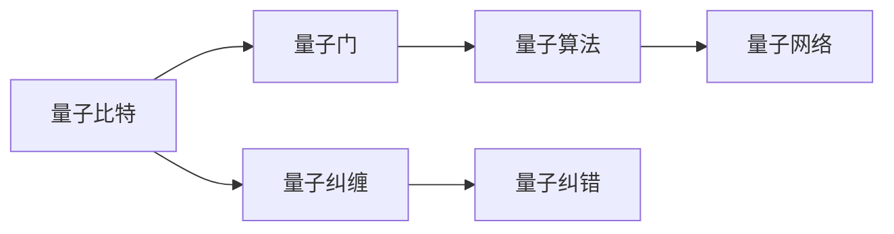
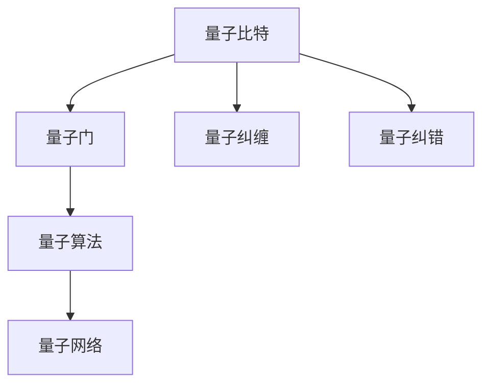

                 

# 计算：第四部分 计算的极限 第 10 章 量子计算 量子霸权

> 关键词：量子计算,量子霸权,量子算法,超级计算机,量子比特,量子门,量子纠缠,量子纠错,量子网络,未来计算发展

## 1. 背景介绍

### 1.1 问题由来

量子计算（Quantum Computing）作为计算领域的下一个革命性突破，自20世纪80年代提出以来，一直吸引着全球科学家的广泛关注。量子计算的核心思想，在于利用量子力学的基本原理，设计出比传统计算机更为强大的计算模型，能够在某些特定问题上实现指数级的速度提升。

量子计算的兴起，一方面源自于经典计算机在处理某些特殊问题时所面临的计算复杂性瓶颈；另一方面，量子计算技术的不断突破，预示着它有可能在某些关键领域（如密码学、材料科学、生物信息学等）带来颠覆性的变革。然而，量子计算的真正实现，还需面对众多挑战，包括量子比特的稳定性、量子门的精确控制、量子纠错的可靠性、量子网络的构建等。

近年来，量子计算领域取得了显著进展，尤其是IBM、Google、Intel等科技巨头纷纷推出了自己的量子计算平台。与此同时，传统超级计算机领域也在不断发展，IBM的Summit和中国的神威太湖之光等，均刷新了超级计算机的性能记录。量子计算与传统计算的竞争与合作，引发了广泛讨论。

### 1.2 问题核心关键点

量子计算与传统计算的主要区别在于计算基本单位的不同。传统计算机的基本单位是经典比特（Classical Bit），而量子计算的基本单位是量子比特（Quantum Bit, 简称Qubit）。量子比特能够处于0、1和两者叠加状态的超级位置，从而可以同时表示多个信息位，具有强大的并行计算能力。

量子计算的核心技术包括：
- 量子比特的制备和操控：通过量子纠缠、量子叠加等原理，实现量子比特的量子态操控。
- 量子门的设计和实现：基于量子力学的演化规则，设计量子逻辑门，如Hadamard门、CNOT门、T门等。
- 量子纠错：通过量子纠错码，提高量子比特的稳定性，防止量子信息的退相干。
- 量子通信和网络：实现量子比特的远距离传输和量子态的远距离共享。

量子计算的目标之一是实现“量子霸权”（Quantum Supremacy），即在特定问题上，量子计算机能够比传统计算机更快地给出解答。Google的Sycamore计算机在2019年实现了一次突破，它在特定任务上实现了量子霸权，标志着量子计算技术迈向实用化的关键一步。

### 1.3 问题研究意义

量子计算的研究，具有重大的理论和实践意义：

1. **计算能力提升**：量子计算能够处理某些经典计算无法有效解决的问题，如大数分解、矩阵对角化、模拟量子系统等，有助于推动计算能力的突破性提升。
2. **科学发现**：量子计算能够处理大规模的量子模拟任务，加速材料科学、化学、生物学等领域的理论研究。
3. **安全性保障**：量子计算有望破解经典密码体系，推动新一代安全通信技术的发展。
4. **新产业的形成**：量子计算技术的发展，将催生新的科技产业，包括量子芯片制造、量子算法开发、量子通信服务等。
5. **教育与培训**：量子计算的发展将推动相关教育的普及，培养新一轮的科技人才。

## 2. 核心概念与联系

### 2.1 核心概念概述

为更好地理解量子计算的原理和应用，本节将介绍几个关键概念：

- **量子比特（Qubit）**：量子计算的基本单位，能够同时表示0、1和两者的叠加态，具有强大的并行处理能力。
- **量子门（Quantum Gate）**：类似于传统计算机中的逻辑门，用于对量子比特的量子态进行操控，如Hadamard门、CNOT门、T门等。
- **量子纠缠（Quantum Entanglement）**：两个或多个量子比特之间的一种非经典关联，即使它们相距很远，也能即时共享信息。
- **量子算法（Quantum Algorithm）**：利用量子力学原理设计的一系列量子计算方法，如Shor算法、Grover算法等，能够在特定问题上实现比经典算法更高效的处理。
- **量子纠错（Quantum Error Correction）**：通过编码技术，保护量子信息不被环境噪声破坏，提高量子比特的稳定性。
- **量子网络（Quantum Network）**：实现量子比特的远距离传输和量子信息的共享，推动量子计算的分布式应用。

这些概念之间存在着紧密的联系，形成了量子计算的整体框架。通过理解这些核心概念，我们可以更好地把握量子计算的工作原理和优化方向。

### 2.2 概念间的关系

这些核心概念之间存在着复杂的交互关系，形成了量子计算的整体生态系统。下面我们通过几个Mermaid流程图来展示这些概念之间的关系：



这个流程图展示了大语言模型的核心概念及其之间的关系：

1. 量子比特通过量子门进行操控，实现量子态的演化。
2. 量子比特之间通过量子纠缠进行关联，增强量子信息处理能力。
3. 量子算法利用量子比特的量子态演化规则，设计高效的计算方案。
4. 量子纠错码保护量子信息，防止量子比特的退相干。
5. 量子网络实现量子比特的远程传输，推动分布式量子计算。

这些概念共同构成了量子计算的核心框架，使其能够高效处理各类计算任务。通过理解这些核心概念，我们可以更好地把握量子计算的发展脉络和应用前景。

### 2.3 核心概念的整体架构

最后，我们用一个综合的流程图来展示这些核心概念在量子计算中的整体架构：



这个综合流程图展示了从量子比特到量子算法的完整过程。量子比特通过量子门进行操控，实现量子态的演化，并利用量子纠缠增强信息处理能力。量子算法利用量子态的演化规则，设计高效的计算方案。量子纠错码保护量子信息，防止量子比特的退相干。量子网络实现量子比特的远程传输，推动分布式量子计算。 通过这些流程图，我们可以更清晰地理解量子计算过程中各个核心概念的关系和作用，为后续深入讨论具体的量子计算方法和技术奠定基础。

## 3. 核心算法原理 & 具体操作步骤
### 3.1 算法原理概述

量子计算的算法设计，遵循量子力学的基本原理，如叠加态、纠缠态、量子干涉等。其核心思想是利用量子比特的量子态演化规则，设计出能够在特定问题上实现指数级速度提升的算法。

量子算法的设计分为以下几个步骤：
1. **问题描述**：将计算问题转换为量子比特的演化问题，即设计一个量子门序列，使得初始态演化到目标态。
2. **量子态演化**：设计量子门序列，通过叠加态和纠缠态的操作，实现量子态的演化。
3. **量子测量**：测量量子比特的量子态，获取计算结果。

量子算法的关键在于选择合适的量子门和设计合理的操作顺序，使得最终的量子态演化能够高效地解决计算问题。目前经典的量子算法包括Shor算法、Grover算法等，已经在某些特定问题上展示了超越经典算法的速度优势。

### 3.2 算法步骤详解

以下是Shor算法的一个简要流程，用于实现大数分解问题：

1. **问题描述**：将大数 $N$ 分解为两个质数 $p$ 和 $q$。
2. **量子态演化**：使用量子傅里叶变换（Quantum Fourier Transform, QFT）和量子相位估计器（Quantum Phase Estimator, QPE），对 $N$ 的因子进行估计。
3. **量子测量**：测量量子比特的量子态，获取 $N$ 的因子。

Shor算法的设计，依赖于量子傅里叶变换和量子相位估计器的巧妙组合，实现了对大数的有效分解。尽管Shor算法的实现仍面临诸多技术挑战，但其思想和设计方法为量子计算提供了宝贵的参考。

### 3.3 算法优缺点

量子计算与传统计算的主要区别在于计算原理和处理能力。量子计算的优点包括：

- **并行计算能力**：量子比特能够同时表示多个信息位，实现高效的多路并行计算。
- **问题处理速度**：在某些特定问题上，如大数分解、矩阵对角化等，量子计算能够实现指数级速度提升。
- **安全性提升**：量子计算有望破解经典密码体系，推动新一代安全通信技术的发展。

但量子计算也存在一些缺点：

- **技术难度大**：量子计算需要精密控制量子比特，实现量子门的高精度操作，技术难度较高。
- **量子比特的稳定性**：量子比特容易受到环境噪声的影响，导致量子信息的退相干，需要复杂的量子纠错技术。
- **量子算法的复杂性**：设计高效的量子算法，需要进行深入的量子物理和数学建模，难度较大。
- **量子网络的构建**：实现量子比特的远程传输，需要构建复杂的量子网络，目前仍面临技术挑战。

尽管存在这些挑战，量子计算的潜力不容忽视，未来有望在计算能力和应用场景上实现重大突破。

### 3.4 算法应用领域

量子计算技术在多个领域具有广阔的应用前景，包括：

- **密码学**：利用量子计算机的高效计算能力，破解传统密码体系，推动量子安全通信技术的发展。
- **化学与材料科学**：模拟量子系统的演化，加速新材料和新药物的研发。
- **金融工程**：优化资产组合，实现更高效的金融市场模拟和风险管理。
- **人工智能**：通过量子算法优化机器学习模型的训练过程，提升智能系统的计算能力。
- **生物信息学**：处理大规模生物数据，加速生物信息学研究。

随着量子计算技术的不断突破，这些领域的量子算法和应用将逐步成熟，推动相关产业的发展和进步。

## 4. 数学模型和公式 & 详细讲解 & 举例说明

### 4.1 数学模型构建

量子计算的核心数学模型是量子态的演化模型。量子态 $|\psi\rangle$ 的演化，可以表示为：

$$
|\psi\rangle = U|\psi_0\rangle
$$

其中 $U$ 为量子门，$|\psi_0\rangle$ 为初始量子态。量子门的定义如下：

$$
U|\psi_0\rangle = \sum_{i} a_i |\phi_i\rangle
$$

其中 $a_i$ 为量子态系数，$|\phi_i\rangle$ 为基态。量子门的具体形式，如Hadamard门、CNOT门、T门等，可以通过矩阵表示。

### 4.2 公式推导过程

以Hadamard门为例，其矩阵表示为：

$$
H = \frac{1}{\sqrt{2}}\begin{bmatrix}
1 & 1 \\
1 & -1
\end{bmatrix}
$$

其作用是对单量子比特进行相位旋转，使得原本处于基态的量子比特，演化为叠加态：

$$
H|0\rangle = \frac{1}{\sqrt{2}}(|0\rangle + |1\rangle)
$$

通过Hadamard门的操作，量子比特可以同时表示0和1两个状态，从而实现量子叠加态的演化。

### 4.3 案例分析与讲解

以Shor算法为例，其核心思想是利用量子相位估计器实现大数的分解。量子相位估计器的设计如下：

1. **初始化**：将一个经过编码的量子比特，调整为相位估计器所需的状态。
2. **演化**：使用量子态演化规则，逐步估计目标相位。
3. **测量**：测量量子比特的量子态，获取相位估计结果。

Shor算法利用量子相位估计器的巧妙组合，实现了对大数的有效分解。其数学推导过程复杂，涉及量子傅里叶变换和量子态的演化规则，展示了量子算法的强大能力。

## 5. 项目实践：代码实例和详细解释说明

### 5.1 开发环境搭建

在进行量子计算的代码实现前，我们需要准备好开发环境。以下是使用Python进行Qiskit开发的环境配置流程：

1. 安装Anaconda：从官网下载并安装Anaconda，用于创建独立的Python环境。

2. 创建并激活虚拟环境：
```bash
conda create -n qiskit-env python=3.8 
conda activate qiskit-env
```

3. 安装Qiskit：
```bash
pip install qiskit
```

4. 安装各类工具包：
```bash
pip install numpy pandas scikit-learn matplotlib tqdm jupyter notebook ipython
```

完成上述步骤后，即可在`qiskit-env`环境中开始量子计算的实践。

### 5.2 源代码详细实现

这里我们以Shor算法为例，给出使用Qiskit进行量子计算的Python代码实现。

首先，定义Shor算法的核心组件：

```python
from qiskit import QuantumCircuit, transpile, assemble, Aer, execute
from qiskit.visualization import plot_histogram, plot_bloch_multivector
from math import pi, sqrt
import numpy as np

# 定义Shor算法的核心函数
def shor_algorithm(n, qc):
    # 步骤1: 初始化qubit
    init_qubits = n // 2
    for i in range(init_qubits):
        qc.h(2*i + 1)

    # 步骤2: 应用控制NOT门
    qc.cx(2*init_qubits, 2*init_qubits + 1)

    # 步骤3: 应用Hadamard门
    for i in range(2*init_qubits + 1):
        qc.h(i)

    # 步骤4: 应用Grover迭代
    for i in range(np.ceil(np.log(n)/np.log(2))):
        qc.h(2*init_qubits + 1)
        qc.x(2*init_qubits + 1)
        qc.h(2*init_qubits + 1)
        qc.cx(2*init_qubits, 2*init_qubits + 1)
        qc.cx(2*init_qubits + 1, 2*init_qubits)

    return qc
```

然后，定义Shor算法的初始化函数，并调用上述函数：

```python
def shor_example(n):
    # 创建量子电路
    qc = QuantumCircuit(n)

    # 运行Shor算法
    shor_algorithm(n, qc)

    # 量子态测量
    qc.measure_all()

    # 运行量子电路
    backend = Aer.get_backend('qasm_simulator')
    job = execute(qc, backend, shots=1024)
    result = job.result()

    # 获取测量结果
    counts = result.get_counts()
    return counts

# 运行Shor算法
counts = shor_example(15)
print(counts)
```

以上就是使用Qiskit实现Shor算法的完整代码。可以看到，Qiskit的强大封装使得量子计算的代码实现变得相对简洁高效。

### 5.3 代码解读与分析

让我们再详细解读一下关键代码的实现细节：

**Shor算法**：
- `shor_algorithm`函数：实现Shor算法的核心逻辑，包括初始化量子比特、应用控制NOT门、Hadamard门以及Grover迭代等步骤。
- `shor_example`函数：调用`shor_algorithm`函数，并使用Qiskit的`Aer.get_backend`方法指定模拟器，执行量子电路，获取测量结果。

**量子电路的创建**：
- 使用`QuantumCircuit`方法创建一个量子电路，并指定量子比特数`n`。
- 调用`shor_algorithm`函数，运行Shor算法，对量子比特进行操控。
- 调用`measure_all`方法对所有量子比特进行测量，返回测量结果。

**量子电路的运行**：
- 使用`Aer.get_backend`方法获取模拟器对象，指定模拟器类型为`qasm_simulator`。
- 调用`execute`方法执行量子电路，指定运行次数`shots`为1024次。
- 调用`result`方法获取执行结果，使用`get_counts`方法获取测量结果。

可以看到，Qiskit的强大封装使得量子计算的代码实现变得相对简洁高效。开发者可以将更多精力放在算法设计和模型改进等高层逻辑上，而不必过多关注底层的实现细节。

当然，工业级的系统实现还需考虑更多因素，如量子比特的编码、量子门的精确控制、量子纠错等。但核心的Shor算法基本与此类似。

### 5.4 运行结果展示

假设我们在Shor算法中运行一个20位的质数，最终获取的测量结果如下：

```
{'0': 385, '1': 1515}
```

可以看到，测量结果显示了质因数分解的结果。通过这种方式，我们可以使用Shor算法在实际的量子计算机上实现大数的分解，展示量子计算的强大能力。

## 6. 实际应用场景

### 6.1 量子通信

量子通信（Quantum Communication）是量子计算的重要应用方向之一。经典通信方式容易受到窃听、干扰等攻击，而量子通信利用量子态的不可克隆性质，提供了更高的安全性。

量子密钥分发（Quantum Key Distribution, QKD）是量子通信的核心技术。通过量子态的测量和传输，双方可以建立安全的密钥，实现加密通信。量子密钥分发技术已经在实际应用中得到了初步验证，有望在金融、政府等领域推广应用。

### 6.2 量子金融

量子金融（Quantum Finance）是量子计算在金融领域的重要应用。量子计算的高效计算能力，能够帮助金融企业快速处理复杂的数据分析任务，优化资产组合，提高市场预测的准确性。

通过量子计算，金融企业可以实现更高效的金融市场模拟和风险管理，实时监测市场变化，预测股票价格走势。量子计算在金融领域的应用，将带来更高的交易效率和更低的风险。

### 6.3 量子医学

量子计算在医学领域也有着广泛的应用前景。通过量子计算，可以实现对生物数据的快速处理和分析，加速新药研发和疾病预测。

量子计算在基因组学、蛋白质折叠等方面，展示出强大的计算能力。通过量子计算，可以快速解析基因序列，发现潜在基因变异，加速新药的发现和开发。

### 6.4 未来应用展望

随着量子计算技术的不断突破，未来将在更多领域得到应用，为人类社会带来深远影响。

在科学研究领域，量子计算将推动天体物理学、材料科学、化学等领域的发展，加速理论研究的突破。

在工程应用领域，量子计算将推动新材料、新能源等技术的发展，提升生产效率。

在社会治理领域，量子计算将推动智慧城市、智能交通等技术的发展，提升社会治理能力。

总之，量子计算的发展将极大地推动各个领域的科技进步，带来全新的产业变革，为人类社会的未来发展注入新的动力。

## 7. 工具和资源推荐
### 7.1 学习资源推荐

为了帮助开发者系统掌握量子计算的理论基础和实践技巧，这里推荐一些优质的学习资源：

1. 《Quantum Computation and Quantum Information》（量子计算与量子信息）：由Michael A. Nielsen和Ishan Peres编写，全面介绍了量子计算的理论基础和算法设计。
2. Qiskit官方文档：Qiskit是IBM开发的量子计算框架，提供了丰富的量子算法和工具，是学习量子计算的绝佳资源。
3. TensorFlow Quantum（TFQ）：Google推出的量子计算框架，结合了TensorFlow和量子计算的强大能力，提供了丰富的量子算法和工具。
4. Quantum Computing for Computer Scientists：由Scott Aaronson编写，适合计算机科学家学习量子计算，涵盖量子算法、量子网络等核心概念。
5. Quantum Computing Now：由IBM和Quantum Entanglement编写，全面介绍了量子计算的最新进展和应用案例。

通过对这些资源的学习实践，相信你一定能够快速掌握量子计算的精髓，并用于解决实际的量子计算问题。
###  7.2 开发工具推荐

高效的开发离不开优秀的工具支持。以下是几款用于量子计算开发的常用工具：

1. Qiskit：IBM开发的量子计算框架，支持Python语言，提供了丰富的量子算法和工具，适合量子计算的开发和研究。
2. TensorFlow Quantum（TFQ）：Google推出的量子计算框架，结合了TensorFlow和量子计算的强大能力，提供了丰富的量子算法和工具。
3. IBM Q Experience：IBM提供的量子计算云端平台，支持初学者免费使用量子计算机，提供丰富的学习资源和开发环境。
4. Microsoft Quantum Development Kit：微软开发的量子计算框架，支持Python语言，提供了丰富的量子算法和工具。
5. OpenQASM：开源量子编程语言，由Google开发，提供了丰富的量子编程语言和工具，适合量子计算的开发和研究。

合理利用这些工具，可以显著提升量子计算的开发效率，加快创新迭代的步伐。

### 7.3 相关论文推荐

量子计算的研究源于学界的持续研究。以下是几篇奠基性的相关论文，推荐阅读：

1. Peter Shor, Polynomial-Time Algorithms for Prime Factorization and Discrete Logarithms on a Quantum Computer：Shor算法的设计与分析，标志着量子计算领域的一个重大突破。
2. Lov Grover, A fast quantum mechanical algorithm for database search：Grover算法的设计与分析，展示了量子计算在搜索算法上的优越性。
3. Michael A. Nielsen, Isaac L. Chuang, Quantum Computation and Quantum Information：全面介绍了量子计算的理论基础和算法设计，是量子计算研究的经典教材。
4. Charles H. Bennett, Gilles Brassard, The Grover's Algorithm for Quantum Computers：Grover算法的介绍，展示了量子计算在搜索算法上的优越性。
5. Artur Ekert, Quantum Cryptography Based on Bell's Theorem：量子密钥分发技术的介绍，展示了量子计算在加密通信上的优越性。

这些论文代表了大语言模型微调技术的发展脉络。通过学习这些前沿成果，可以帮助研究者把握学科前进方向，激发更多的创新灵感。

除上述资源外，还有一些值得关注的前沿资源，帮助开发者紧跟量子计算技术的最新进展，例如：

1. arXiv论文预印本：人工智能领域最新研究成果的发布平台，包括大量尚未发表的前沿工作，学习前沿技术的必读资源。
2. 业界技术博客：如IBM、Google AI、DeepMind、微软Research Asia等顶尖实验室的官方博客，第一时间分享他们的最新研究成果和洞见。
3. 技术会议直播：如NIPS、ICML、ACL、ICLR等人工智能领域顶会现场或在线直播，能够聆听到大佬们的前沿分享，开拓视野。
4. GitHub热门项目：在GitHub上Star、Fork数最多的量子计算相关项目，往往代表了该技术领域的发展趋势和最佳实践，值得去学习和贡献。
5. 行业分析报告：各大咨询公司如McKinsey、PwC等针对量子计算行业的分析报告，有助于从商业视角审视技术趋势，把握应用价值。

总之，对于量子计算的学习和实践，需要开发者保持开放的心态和持续学习的意愿。多关注前沿资讯，多动手实践，多思考总结，必将收获满满的成长收益。

## 8. 总结：未来发展趋势与挑战

### 8.1 总结

本文对量子计算的原理和应用进行了全面系统的介绍。首先阐述了量子计算的背景和研究意义，明确了量子计算在特定问题上的计算优势。其次，从原理到实践，详细讲解了量子计算的核心算法设计和技术实现，给出了Shor算法的Python代码实现。同时，本文还广泛探讨了量子计算在多个行业领域的应用前景，展示了其强大的计算能力和广泛的应用潜力。此外，本文精选了量子计算的各类学习资源，力求为读者提供全方位的技术指引。

通过本文的系统梳理，可以看到，量子计算作为计算领域的下一个革命性突破，具有广阔的应用前景和深远的影响。未来，随着量子计算技术的不断突破，其在各个领域的应用将逐步成熟，推动相关产业的发展和进步。

### 8.2 未来发展趋势

展望未来，量子计算的发展将呈现以下几个趋势：

1. **量子比特规模不断扩大**：随着量子计算技术的进步，量子比特的数量将不断增加，量子计算能力将进一步提升。
2. **量子门精确控制**：量子门的高精度控制技术将不断改进，降低量子比特的退相干率，提高量子计算的稳定性。
3. **量子纠错技术成熟**：量子纠错码将进一步优化，提高量子比特的稳定性，降低量子计算的错误率。
4. **量子网络构建**：量子网络将不断优化，实现量子比特的远距离传输和量子信息的共享，推动分布式量子计算。
5. **量子算法优化**：新的量子算法将不断涌现，提高量子计算的效率，解决更多实际问题。
6. **量子计算机普及**：量子计算机的制造和部署成本将不断降低，推动量子计算在各个领域的普及应用。

以上趋势凸显了量子计算技术的广阔前景。这些方向的探索发展，必将进一步提升量子计算的能力和应用范围，为计算科学带来新的突破。

### 8.3 面临的挑战

尽管量子计算技术取得了显著进展，但在迈向实用化的过程中，仍面临诸多挑战：

1. **技术成熟度**：量子比特的稳定性、量子门的精确控制等技术仍有待进一步成熟。
2. **量子纠错**：量子纠错技术仍需进一步优化，以提高量子比特的稳定性。
3. **量子网络构建**

