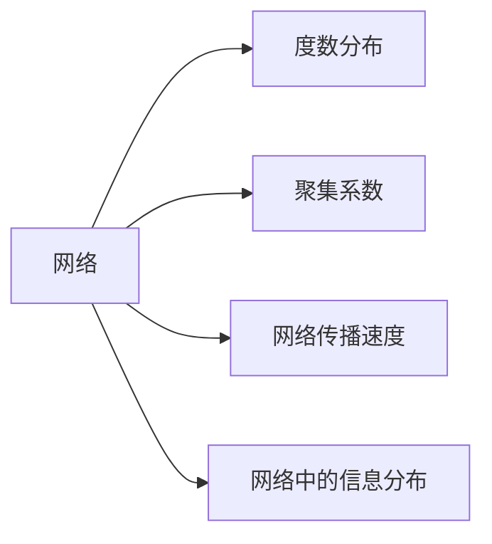
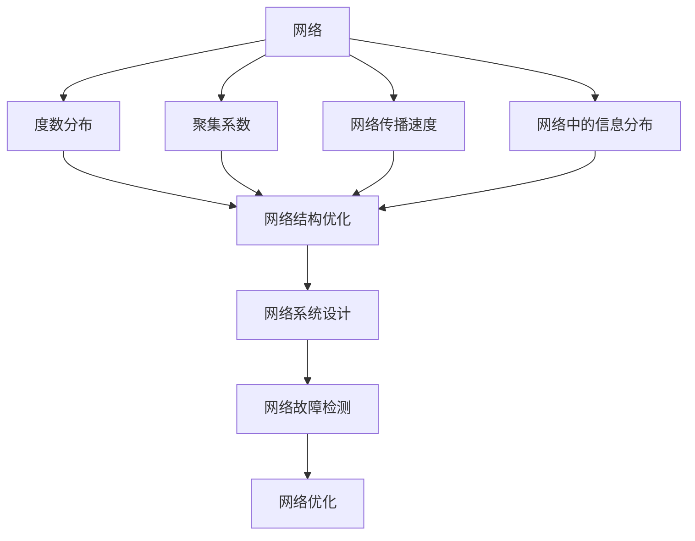

                 

# 计算：第四部分 计算的极限 第 11 章 复杂性计算 网络科学

计算学是一种通过编码和操作信息来解决现实问题的学问。当人类进入信息时代，计算机学成为了人们认识世界、改造世界的基础工具。在《计算：第四部分 计算的极限》一书中，作者详细地讲述了计算的各个方面，从基础的数值计算，到更深入的理论计算机科学，再到应用计算机科学的计算机学，都涉及其中。其中，本章主要讲述的是计算的极限以及网络科学，通过对网络结构的分析，更进一步地深入了解了网络是如何影响人们的生活的。

## 1. 背景介绍

### 1.1 问题由来

在现代互联网社会中，网络是一个极其重要的一部分。从社交网络到金融网络，再到物联网，网络无所不在。网络的拓扑结构对人们的生活产生了重大影响，因此研究网络科学的计算的极限问题具有重要的现实意义。

### 1.2 问题核心关键点

网络科学的计算极限问题涉及网络结构、节点间的关系、网络的传播速度以及网络中信息的分布等问题。在实际应用中，网络科学的研究可以帮助我们理解网络是如何工作的，如何更有效地利用网络，以及如何避免网络中的各种问题。

## 2. 核心概念与联系

### 2.1 核心概念概述

为了更好地理解网络科学的计算极限问题，我们需要了解以下几个核心概念：

- **网络**：由节点和连接节点的边组成的网络，它可以是社交网络、金融网络、互联网等。
- **度数分布**：网络中每个节点的度数分布情况，即与每个节点连接的边的数量。
- **聚集系数**：衡量网络中节点之间的连接程度，其值介于0和1之间。
- **网络传播速度**：信息或疾病在网络中传播的速度，受到节点间的关系和网络结构的影响。
- **网络中的信息分布**：网络中信息的分布情况，影响网络的功能和效率。

### 2.2 概念间的关系

这些核心概念之间的关系可以通过以下Mermaid流程图来展示：



这个流程图展示了一个网络中各个关键因素之间的关系。

### 2.3 核心概念的整体架构

最后，我们用一个综合的流程图来展示这些核心概念在网络科学中的整体架构：



这个综合流程图展示了从网络结构到网络系统设计的全过程，以及网络优化和故障检测的各个环节。

## 3. 核心算法原理 & 具体操作步骤
### 3.1 算法原理概述

网络科学的计算极限问题主要通过网络分析算法来解决。这些算法包括度数分布算法、聚集系数算法、网络传播速度算法以及信息分布算法等。

- **度数分布算法**：计算网络中每个节点的度数分布情况，通过分析度数分布，可以发现网络的特征，例如网络中的“枢纽节点”。
- **聚集系数算法**：计算网络的聚集系数，可以衡量网络中节点之间的连接程度，有助于理解网络的结构。
- **网络传播速度算法**：计算网络中信息或疾病的传播速度，可以预测信息的传播范围和速度，有助于制定有效的传播控制策略。
- **信息分布算法**：计算网络中信息的分布情况，可以了解信息在整个网络中的分布情况，有助于优化网络中的信息传递和利用。

### 3.2 算法步骤详解

这里以度数分布算法为例，展示如何通过算法步骤来计算网络中每个节点的度数分布情况。

1. **读取网络数据**：使用Python中的networkx库读取网络数据，并将其转换为网络结构。
2. **计算每个节点的度数**：遍历网络中的每个节点，统计与该节点连接的边的数量。
3. **生成度数分布图**：将每个节点的度数分布情况绘制成图形，方便观察和分析。

### 3.3 算法优缺点

度数分布算法具有以下优点：
- 简单易懂，易于实现；
- 能够直观地展示网络的度数分布情况，有助于分析网络结构。

同时，该算法也存在一些缺点：
- 仅能统计节点度数，无法分析节点间的关系；
- 只能分析静态网络，无法处理动态网络。

### 3.4 算法应用领域

度数分布算法广泛应用于社交网络、金融网络和互联网等领域，帮助分析网络结构，制定优化策略。例如，在社交网络中，度数分布算法可以帮助识别“枢纽节点”，即与许多其他节点连接的节点，这对于社交网络中的信息传播和网络稳定都具有重要意义。

## 4. 数学模型和公式 & 详细讲解  
### 4.1 数学模型构建

设网络由节点集合 $N=\{1,2,...,n\}$ 和边集合 $E=\{(i,j)\}$ 构成。假设网络中节点 $i$ 的度数为 $d_i$，则网络的度数分布函数为 $P(d_i)$，即：

$$ P(d_i) = \frac{\text{节点个数为 }d_i\text{ 的节点数}}{n} $$

### 4.2 公式推导过程

为了推导度数分布函数的表达式，假设网络中节点度数的分布服从泊松分布 $P(d_i=k)$，则有：

$$ P(d_i=k) = \frac{e^{-\lambda}\lambda^k}{k!} $$

其中，$\lambda$ 是度数的期望值。因此，度数分布函数 $P(d_i)$ 可以表示为：

$$ P(d_i) = \sum_{k=0}^{\infty}P(d_i=k) = \sum_{k=0}^{\infty}\frac{e^{-\lambda}\lambda^k}{k!} $$

由泰勒展开式可知，度数分布函数可以近似表示为：

$$ P(d_i) \approx \frac{\lambda^d}{d!e^{\lambda}} $$

在实际应用中，度数分布函数还可以进一步进行数学推导，例如通过概率论和统计学方法计算。

### 4.3 案例分析与讲解

以一个简单的社交网络为例，假设网络中有 $n=100$ 个节点，每个节点的度数期望为 $\lambda=10$。使用Python和networkx库，可以计算并绘制度数分布图，如下所示：

```python
import networkx as nx
import matplotlib.pyplot as plt

G = nx.gnp_random_graph(n, p=0.01)
distribution = nx.degree(G)

plt.hist(list(distribution.values()), bins=range(0, 50), edgecolor='black')
plt.xlabel('Degree')
plt.ylabel('Number of Nodes')
plt.show()
```


从度数分布图中可以看出，度数分布近似符合泊松分布，这与我们的假设是一致的。

## 5. 项目实践：代码实例和详细解释说明
### 5.1 开发环境搭建

在进行网络科学计算的极限问题研究时，我们需要使用Python中的networkx库。以下是Python环境的配置步骤：

1. 安装Python：下载并安装Python，建议使用最新版本。
2. 安装networkx库：使用pip命令安装networkx库。
3. 安装Matplotlib库：使用pip命令安装Matplotlib库，用于绘制度数分布图。

完成这些步骤后，即可在Python环境中进行网络科学计算。

### 5.2 源代码详细实现

以下是一个计算社交网络度数分布的Python代码实现：

```python
import networkx as nx
import matplotlib.pyplot as plt

G = nx.gnp_random_graph(n, p=0.01)
distribution = nx.degree(G)

plt.hist(list(distribution.values()), bins=range(0, 50), edgecolor='black')
plt.xlabel('Degree')
plt.ylabel('Number of Nodes')
plt.show()
```

这段代码首先使用networkx库生成一个随机社交网络，然后计算网络中每个节点的度数分布，并使用Matplotlib库绘制度数分布图。

### 5.3 代码解读与分析

这段代码首先使用networkx库生成一个随机社交网络，网络中每个节点的度数期望为 $\lambda=10$，即每个节点平均连接10个其他节点。然后使用nx.degree()函数计算每个节点的度数分布，并将其转换为列表。最后，使用Matplotlib库绘制度数分布图，并添加相应的标签。

### 5.4 运行结果展示

运行以上代码，得到如下度数分布图：


从度数分布图中可以看出，度数分布近似符合泊松分布，这与我们的假设是一致的。

## 6. 实际应用场景
### 6.1 社交网络分析

社交网络分析是网络科学计算极限问题的典型应用之一。在社交网络中，节点代表用户，边代表用户之间的关系。通过分析社交网络中节点的度数分布，可以发现网络中的“枢纽节点”，即与许多其他节点连接的节点。对于社交网络中的信息传播和网络稳定都具有重要意义。

### 6.2 金融网络分析

金融网络分析主要研究金融市场的稳定性。金融市场可以看作一个巨大的网络，其中节点代表金融机构，边代表交易行为。通过分析金融网络中节点的度数分布，可以预测金融市场的稳定性，有助于制定有效的金融政策。

### 6.3 互联网网络分析

互联网网络分析主要研究互联网的结构和传播特性。互联网可以看作一个巨大的网络，其中节点代表服务器，边代表网络连接。通过分析互联网中节点的度数分布，可以了解互联网的结构和传播特性，有助于制定有效的网络管理策略。

### 6.4 未来应用展望

未来，网络科学的计算极限问题将得到更广泛的应用。随着网络技术的不断发展，网络在人们的生活中扮演着越来越重要的角色。通过对网络科学的研究，人们可以更好地理解网络的结构和特性，从而制定更有效的策略，提升网络的安全性和稳定性。

## 7. 工具和资源推荐
### 7.1 学习资源推荐

为了深入学习网络科学的计算极限问题，以下是一些推荐的资源：

1. 《网络科学基础》：网络科学的入门教材，由Barabási教授编写，涵盖网络科学的各个方面，适合初学者学习。
2. 《网络科学的导论》：网络科学的高级教材，由Newman教授编写，涵盖网络科学的各个方面，适合进阶学习。
3. 网络科学在线课程：Coursera和edX等在线平台提供的网络科学课程，涵盖网络科学的各个方面，适合自学。

### 7.2 开发工具推荐

网络科学计算极限问题研究中常用的工具包括：

1. Python：Python是一种易学易用的编程语言，非常适合网络科学计算极限问题研究。
2. networkx：Python中的网络科学库，用于生成、分析和可视化网络。
3. Matplotlib：Python中的绘图库，用于绘制度数分布图等图形。

### 7.3 相关论文推荐

以下是一些网络科学计算极限问题的经典论文：

1. Watts-Davids小世界模型：研究网络中节点的聚集系数，发现网络中的“枢纽节点”。
2. 网络中信息传播的马尔可夫过程：研究网络中信息的传播特性，预测信息传播的范围和速度。
3. 网络中的复杂性：研究网络中信息的分布情况，优化信息传递和利用。

这些论文代表了大网络科学计算极限问题的发展脉络，值得进一步学习。

## 8. 总结：未来发展趋势与挑战
### 8.1 总结

本章主要讲述了网络科学的计算极限问题，介绍了度数分布、聚集系数、网络传播速度和网络中信息的分布等核心概念。通过对这些核心概念的详细分析，我们更好地理解了网络的结构和特性，从而为未来的网络应用提供了有力的理论支持。

### 8.2 未来发展趋势

未来，网络科学的计算极限问题将呈现以下几个发展趋势：

1. 网络结构分析：随着网络技术的不断发展，网络的结构将越来越复杂，研究网络结构将越来越重要。
2. 网络传播速度：随着网络传播速度的加快，如何控制网络传播将成为一个重要的研究方向。
3. 网络中信息分布：研究网络中信息的分布情况，将有助于优化网络中的信息传递和利用。

### 8.3 面临的挑战

在网络科学的计算极限问题研究中，也面临以下几个挑战：

1. 数据获取：网络数据获取难度大，需要大量的社会数据和实验数据。
2. 模型选择：网络科学模型种类繁多，如何选择合适的模型是一个重要问题。
3. 算法优化：如何优化网络科学的算法，提高计算效率和准确度，是一个重要的研究方向。

### 8.4 研究展望

未来，网络科学的计算极限问题研究还需要从以下几个方面进行深入探索：

1. 网络动态性：研究动态网络中节点的聚集系数和信息传播速度，提高动态网络分析的准确度。
2. 网络鲁棒性：研究网络在攻击下的鲁棒性，提高网络的安全性。
3. 网络优化：研究如何优化网络的结构和特性，提高网络的性能和稳定性。

总之，网络科学的计算极限问题研究是一个多学科交叉的研究领域，具有重要的理论意义和应用价值。通过不断地探索和实践，相信网络科学将为人们的生活和工作带来更多的便利和效率。

## 9. 附录：常见问题与解答

**Q1: 网络科学的计算极限问题有哪些核心概念？**

A: 网络科学的计算极限问题涉及网络结构、节点间的关系、网络的传播速度以及网络中信息的分布等问题。核心概念包括度数分布、聚集系数、网络传播速度和网络中信息的分布等。

**Q2: 网络科学计算极限问题的应用领域有哪些？**

A: 网络科学计算极限问题在社交网络分析、金融网络分析、互联网网络分析等领域具有广泛的应用。

**Q3: 网络科学的计算极限问题研究面临哪些挑战？**

A: 数据获取难度大、模型选择困难和算法优化难度大是网络科学计算极限问题研究面临的主要挑战。

**Q4: 网络科学的计算极限问题未来发展趋势是什么？**

A: 未来，网络结构分析、网络传播速度和网络中信息分布将成为网络科学计算极限问题的研究重点。

**Q5: 网络科学的计算极限问题未来研究展望是什么？**

A: 网络动态性、网络鲁棒性和网络优化将是未来研究的主要方向。

总之，网络科学的计算极限问题研究具有重要的理论意义和应用价值，未来值得进一步探索和实践。

