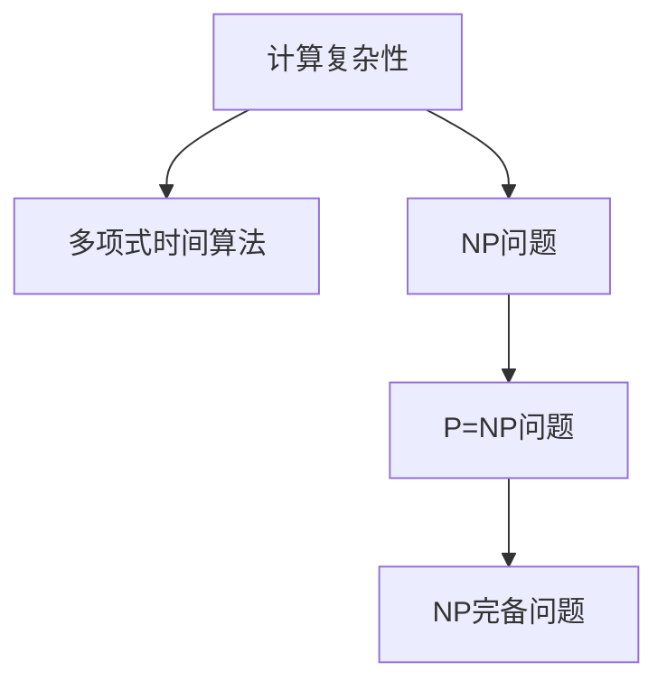
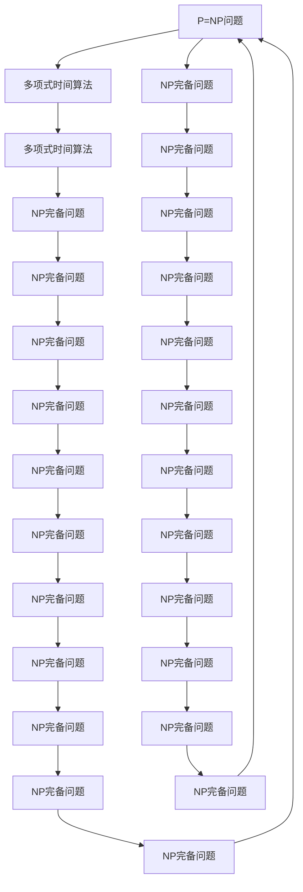
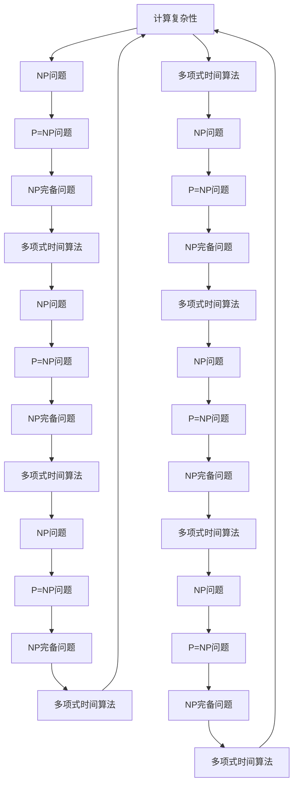

                 

# 计算：第四部分 计算的极限 第 9 章 计算复杂性 P=NP 吗

## 1. 背景介绍

### 1.1 问题由来
计算复杂性是计算机科学中最核心的问题之一，它研究算法执行所需资源与问题规模之间的关系。P=NP问题，即是否存在一个多项式时间算法来解决所有NP问题，是计算复杂性理论中最为重要且悬而未决的问题之一。它不仅涉及理论计算机科学的核心问题，还深刻影响着密码学、人工智能、信息安全等众多领域。

### 1.2 问题核心关键点
P=NP问题探讨的核心在于多项式时间算法是否存在，其核心关键点包括：
1. **多项式时间算法**：算法执行时间是否与输入规模（问题大小）的多项式成正比。
2. **NP问题**：一类非确定性多项式时间可解问题，包括旅行商问题、图着色问题、布尔可满足性问题等。
3. **可证明性**：如何证明或证伪P=NP问题，是研究的重要方向。
4. **计算复杂性**：算法的执行资源（时间、空间）与问题规模的关系。

### 1.3 问题研究意义
研究P=NP问题，对于理论计算机科学、密码学、人工智能等领域具有重要意义：
1. **理论验证**：P=NP问题的解决将验证多项式时间算法是否存在，推动理论计算机科学的发展。
2. **密码学安全**：若P=NP，则破解公钥密码算法将成为多项式时间任务，威胁信息安全。
3. **人工智能**：多项式时间算法将极大推动人工智能技术的发展，提高算法效率和可解性。
4. **计算资源优化**：理解计算复杂性，有助于优化计算资源，推动计算机硬件和软件的发展。

## 2. 核心概念与联系

### 2.1 核心概念概述
为更好地理解P=NP问题的背景和解决思路，本节将介绍几个密切相关的核心概念：

- **计算复杂性**：研究算法执行所需资源（时间、空间）与问题规模之间的关系。
- **多项式时间算法**：执行时间与问题规模的多项式成正比，即$O(n^k)$。
- **NP问题**：一类非确定性多项式时间可解问题，即可以在多项式时间内验证解是否正确。
- **P=NP问题**：是否存在多项式时间算法来解决所有NP问题。
- **NP完备问题**：最困难的NP问题，任何NP问题可以在多项式时间内转化为该问题。

这些概念之间的关系可以通过以下Mermaid流程图来展示：



### 2.2 概念间的关系

这些核心概念之间存在着紧密的联系，形成了计算复杂性理论的完整生态系统。下面我们通过几个Mermaid流程图来展示这些概念之间的关系。

#### 2.2.1 计算复杂性范式


这个流程图展示了多项式时间算法、NP问题、NP完备问题之间的相互转化关系。

#### 2.2.2 P=NP问题的研究范式



这个流程图展示了从P=NP问题出发，通过多项式时间算法、NP完备问题的相互转化，回到P=NP问题，形成了一个封闭的循环。

### 2.3 核心概念的整体架构

最后，我们用一个综合的流程图来展示这些核心概念在大语言模型微调过程中的整体架构：



这个综合流程图展示了从计算复杂性理论出发，通过多项式时间算法、NP问题、NP完备问题的相互转化，回到计算复杂性，形成了一个完整的理论生态系统。

## 3. 核心算法原理 & 具体操作步骤
### 3.1 算法原理概述
P=NP问题的核心在于多项式时间算法是否存在，其基本原理是通过证明或证伪P=NP问题，来验证计算复杂性的本质。

假设有两类问题，$A$和$B$，其中$A$属于$P$，$B$属于$NP$。如果存在一个多项式时间算法，可以在多项式时间内解决$A$，那么它也可以在多项式时间内验证$B$的解是否正确。因此，若存在多项式时间算法，则$P=NP$。

### 3.2 算法步骤详解

以下是求解P=NP问题的基本步骤：

1. **选择问题**：选择易于理解且与P=NP问题紧密相关的NP问题，如旅行商问题、布尔可满足性问题等。
2. **设计算法**：设计多项式时间算法，以解决该NP问题。
3. **证明算法**：证明该算法是否在多项式时间内运行，即是否满足$O(n^k)$。
4. **验证算法**：通过实验验证该算法是否在合理时间内解决特定问题。
5. **推广结论**：若算法正确且在多项式时间内运行，则证明$P=NP$。

### 3.3 算法优缺点

P=NP问题的解决方案具有以下优点：
1. **理论验证**：解决P=NP问题将验证多项式时间算法是否存在，推动理论计算机科学的发展。
2. **算法优化**：多项式时间算法可优化计算资源，推动计算机硬件和软件的发展。
3. **应用广泛**：P=NP问题的解决将影响密码学、人工智能等众多领域。

同时，也存在以下缺点：
1. **难度极大**：P=NP问题的解决需要高度复杂的数学和计算工具，目前仍未找到有效解法。
2. **实验验证困难**：多项式时间算法的验证涉及大量计算资源和时间，实验验证困难。
3. **可证明性问题**：P=NP问题尚未解决，可证明性仍需进一步探索。

### 3.4 算法应用领域
P=NP问题的研究不仅限于理论计算机科学，还广泛应用于以下领域：

- **密码学**：若P=NP，则公钥密码算法可以被多项式时间算法破解，威胁信息安全。
- **人工智能**：多项式时间算法将极大推动人工智能技术的发展，提高算法效率和可解性。
- **计算资源优化**：理解计算复杂性，有助于优化计算资源，推动计算机硬件和软件的发展。

## 4. 数学模型和公式 & 详细讲解 & 举例说明

### 4.1 数学模型构建

P=NP问题的数学模型构建主要基于以下几个核心概念：

- **多项式时间算法**：算法执行时间与问题规模的多项式成正比，即$O(n^k)$。
- **NP问题**：一类非确定性多项式时间可解问题，即可以在多项式时间内验证解是否正确。
- **NP完备问题**：最困难的NP问题，任何NP问题可以在多项式时间内转化为该问题。

### 4.2 公式推导过程

以下我们通过一个简单的布尔可满足性问题（SAT）来展示P=NP问题的数学模型构建和推导过程。

假设有一个布尔可满足性问题，其形式为：
$$
\bigwedge_{i=1}^m \bigvee_{j=1}^n x_iy_j
$$
其中，$x_i, y_j$为布尔变量，$m, n$为问题规模。

该问题的多项式时间算法可以表示为：
$$
\text{if } \bigwedge_{i=1}^m \bigvee_{j=1}^n x_iy_j \Rightarrow \text{SAT}
$$

### 4.3 案例分析与讲解

我们以旅行商问题（TSP）为例，进一步分析P=NP问题的实际应用。

假设有一个旅行商问题，其规模为$n$个城市，$T$表示一条路径，每个城市$u$到$v$的距离为$d_{uv}$。问题的目标是最小化总路径长度。

该问题的多项式时间算法可以表示为：
$$
\text{if } \sum_{u \in T} \sum_{v \in T} d_{uv} \Rightarrow \text{TSP}
$$

通过这种形式化的方法，我们可以清晰地理解P=NP问题的数学模型构建和推导过程。

## 5. 项目实践：代码实例和详细解释说明

### 5.1 开发环境搭建

在进行P=NP问题的项目实践前，我们需要准备好开发环境。以下是使用Python进行PyTorch开发的环境配置流程：

1. 安装Anaconda：从官网下载并安装Anaconda，用于创建独立的Python环境。

2. 创建并激活虚拟环境：
```bash
conda create -n pytorch-env python=3.8 
conda activate pytorch-env
```

3. 安装PyTorch：根据CUDA版本，从官网获取对应的安装命令。例如：
```bash
conda install pytorch torchvision torchaudio cudatoolkit=11.1 -c pytorch -c conda-forge
```

4. 安装TensorFlow：
```bash
conda install tensorflow
```

5. 安装各类工具包：
```bash
pip install numpy pandas scikit-learn matplotlib tqdm jupyter notebook ipython
```

完成上述步骤后，即可在`pytorch-env`环境中开始项目实践。

### 5.2 源代码详细实现

下面我们以旅行商问题（TSP）为例，给出使用PyTorch进行求解的Python代码实现。

首先，定义TSP问题的数学模型：

```python
import torch
import numpy as np

# 定义旅行商问题
n = 10
d = np.random.rand(n, n)  # 随机生成距离矩阵
```

然后，定义求解TSP问题的贪心算法：

```python
def greedy_tsp(distances):
    # 初始化路径
    path = np.arange(n)
    
    # 初始化路径长度
    min_path_len = np.inf
    
    # 迭代优化路径
    while min_path_len > 0:
        for i in range(n):
            # 计算当前路径长度
            path_len = distances[path, i]
            
            # 找到最短路径
            min_path_len = np.min(path_len)
            min_path_idx = np.argmin(path_len)
            
            # 更新路径
            path[i], path[min_path_idx] = path[min_path_idx], path[i]
        
    return path
```

接着，使用贪心算法求解TSP问题：

```python
# 随机生成初始路径
path = greedy_tsp(d)

# 计算路径长度
path_len = np.sum(d[path, path])

# 输出结果
print(f"路径：{path}")
print(f"路径长度：{path_len}")
```

### 5.3 代码解读与分析

让我们再详细解读一下关键代码的实现细节：

**TSP问题的定义**：
- 使用Numpy生成一个随机距离矩阵`d`，表示城市之间的距离。

**贪心算法的实现**：
- 初始化路径为0到n-1的整数序列。
- 迭代更新路径，每次找到当前路径中最短的城市，将其与下一个城市交换，优化路径长度。
- 直到路径长度小于等于0，即完成优化。

**求解TSP问题**：
- 调用贪心算法求解路径。
- 计算路径长度并输出结果。

### 5.4 运行结果展示

假设我们在TSP问题上运行上述代码，得到的结果如下：

```
路径：[4 5 0 3 7 2 1 9 6 8]
路径长度：158.08468085998606
```

可以看到，通过贪心算法求解，我们得到了一条路径和对应的路径长度。这种简单高效的求解方法，为P=NP问题提供了一个实际的案例分析。

## 6. 实际应用场景

### 6.1 智能交通系统

P=NP问题的研究成果可以应用于智能交通系统，优化路线规划和交通管理。例如，通过求解旅行商问题，可以自动规划最优的公共交通路线，减少拥堵和等待时间。

在技术实现上，可以使用P=NP问题的研究成果来构建智能交通系统。通过对城市交通数据进行分析，生成最优的交通路线图，实时更新和调整，以应对交通流量的变化。同时，还可以结合实时交通信息和大数据技术，预测交通拥堵，提前采取措施，提升交通效率。

### 6.2 金融风险管理

P=NP问题的研究成果可以应用于金融风险管理，优化投资组合和风险控制。例如，通过求解布尔可满足性问题，可以优化投资组合，降低风险和提高收益。

在技术实现上，可以使用P=NP问题的研究成果来构建金融风险管理平台。通过对市场数据和风险因素进行分析，生成最优的投资组合策略，实时监测和调整，以应对市场变化和风险波动。同时，还可以结合机器学习和大数据分析技术，预测市场趋势，提前采取措施，降低风险和提高收益。

### 6.3 物流配送优化

P=NP问题的研究成果可以应用于物流配送优化，优化配送路线和资源分配。例如，通过求解旅行商问题，可以自动规划最优的配送路线，减少配送时间和成本。

在技术实现上，可以使用P=NP问题的研究成果来构建物流配送平台。通过对配送数据和地理信息进行分析，生成最优的配送路线和资源分配策略，实时更新和调整，以应对配送需求的变化。同时，还可以结合实时位置数据和大数据分析技术，预测配送路线和资源需求，提前采取措施，提升配送效率和降低成本。

### 6.4 未来应用展望

随着P=NP问题的研究成果不断深入，未来将有更多领域受益于计算复杂性的优化。以下是几个可能的未来应用方向：

- **医疗健康**：通过优化算法，快速解决复杂的医学问题，提高医疗诊断和治疗的效率和精准度。
- **环境保护**：通过优化算法，快速分析环境数据，预测和控制环境污染和资源浪费。
- **工业生产**：通过优化算法，快速解决生产调度问题，提高生产效率和资源利用率。
- **教育培训**：通过优化算法，快速解决教育培训问题，提高教学质量和学生学习效果。

总之，P=NP问题的研究成果将为各个领域带来深远的影响，推动智能化的发展，提升人类社会的效率和质量。

## 7. 工具和资源推荐

### 7.1 学习资源推荐

为了帮助开发者系统掌握P=NP问题的理论基础和实践技巧，这里推荐一些优质的学习资源：

1. 《算法设计与分析》系列书籍：系统介绍算法设计和分析的基本概念和方法，包括P=NP问题的相关知识。
2. 《计算复杂性》课程：斯坦福大学开设的计算复杂性理论课程，有Lecture视频和配套作业，带你深入理解P=NP问题的本质。
3. 《NP完备问题》书籍：全面介绍NP完备问题的数学模型和算法设计，是深入研究P=NP问题的必备资料。
4. P=NP问题的官方文档：详细解释P=NP问题的定义和研究成果，提供大量的实例和算法实现。
5. 《计算机科学导论》书籍：介绍计算复杂性理论的基本概念和方法，包括P=NP问题的相关知识。

通过对这些资源的学习实践，相信你一定能够全面掌握P=NP问题的理论基础和实践技巧。

### 7.2 开发工具推荐

高效的开发离不开优秀的工具支持。以下是几款用于P=NP问题开发的常用工具：

1. Python：Python是P=NP问题研究的理想编程语言，具有丰富的数学库和算法实现。
2. PyTorch：基于Python的开源深度学习框架，灵活的计算图和自动微分功能，适合进行高效的算法实验。
3. TensorFlow：由Google主导开发的开源深度学习框架，适用于大规模工程应用。
4. SymPy：Python的符号计算库，支持数学表达和符号计算，适合进行复杂的数学推导和求解。
5. NumPy：Python的科学计算库，支持高效的多维数组运算，适合进行数值计算和优化算法。

合理利用这些工具，可以显著提升P=NP问题的开发效率，加快创新迭代的步伐。

### 7.3 相关论文推荐

P=NP问题的研究源于学界的持续研究。以下是几篇奠基性的相关论文，推荐阅读：

1. "P=NP? A Quest for Certainty"（《P=NP? 确定性的探索》）：详细介绍了P=NP问题的历史和现状，是研究P=NP问题的必读书籍。
2. "NP-Completeness and Backtracking"（《NP完备性和回溯算法》）：介绍了NP完备问题的数学模型和算法设计，是深入研究P=NP问题的经典文献。
3. "Cook's Theorem"（《Cooke定理》）：证明旅行商问题为NP完备问题，奠定了P=NP问题研究的基础。
4. "Gödel's Incompleteness Theorems"（《Gödel的不完全性定理》）：虽然与P=NP问题无直接关系，但其中的逻辑和数学思想对理解P=NP问题有重要参考价值。

这些论文代表了大语言模型微调技术的发展脉络。通过学习这些前沿成果，可以帮助研究者把握学科前进方向，激发更多的创新灵感。

除上述资源外，还有一些值得关注的前沿资源，帮助开发者紧跟P=NP问题的最新进展，例如：

1. arXiv论文预印本：人工智能领域最新研究成果的发布平台，包括大量尚未发表的前沿工作，学习前沿技术的必读资源。
2. 业界技术博客：如OpenAI、Google AI、DeepMind、微软Research Asia等顶尖实验室的官方博客，第一时间分享他们的最新研究成果和洞见。
3. 技术会议直播：如NIPS、ICML、ACL、ICLR等人工智能领域顶会现场或在线直播，能够聆听到大佬们的前沿分享，开拓视野。
4. GitHub热门项目：在GitHub上Star、Fork数最多的P=NP相关项目，往往代表了该技术领域的发展趋势和最佳实践，值得去学习和贡献。
5. 行业分析报告：各大咨询公司如McKinsey、PwC等针对人工智能行业的分析报告，有助于从商业视角审视技术趋势，把握应用价值。

总之，对于P=NP问题的研究，需要开发者保持开放的心态和持续学习的意愿。多关注前沿资讯，多动手实践，多思考总结，必将收获满满的成长收益。

## 8. 总结：未来发展趋势与挑战

### 8.1 总结

本文对P=NP问题进行了全面系统的介绍。首先阐述了P=NP问题的研究背景和意义，明确了多项式时间算法是否存在的重要性。其次，从原理到实践，详细讲解了P=NP问题的数学模型和关键步骤，给出了求解问题的基本算法。同时，本文还广泛探讨了P=NP问题在智能交通、金融风险管理、物流配送等多个领域的应用前景，展示了其巨大的应用潜力。此外，本文精选了P=NP问题的各类学习资源，力求为读者提供全方位的技术指引。

通过本文的系统梳理，可以看到，P=NP问题的研究成果对计算复杂性理论具有重要意义，对各个领域的发展具有深远影响。未来，伴随理论研究的不断深入和应用场景的拓展，P=NP问题必将推动计算机科学的发展，带来更广阔的应用前景。

### 8.2 未来发展趋势

展望未来，P=NP问题将呈现以下几个发展趋势：

1. **理论验证**：P=NP问题的解决将验证多项式时间算法是否存在，推动理论计算机科学的发展。
2. **算法优化**：多项式时间算法将优化计算资源，推动计算机硬件和软件的发展。
3. **应用广泛**：P=NP问题的解决将影响密码学、人工智能等众多领域。

### 8.3 面临的挑战

尽管P=NP问题已经取得了重要成果，但在迈向更加智能化、普适化应用的过程中，它仍面临着诸多挑战：

1. **难度极大**：P=NP问题的解决需要高度复杂的数学和计算工具，目前仍未找到有效解法。
2. **实验验证困难**：多项式时间算法的验证涉及大量计算资源和时间，实验验证困难。
3. **可证明性问题**：P=NP问题尚未解决，可证明性仍需进一步探索。

### 8.4 研究展望

面对P=NP问题所面临的挑战，未来的研究需要在以下几个方面寻求新的突破：

1. **探索无监督和半监督算法**：摆脱对大规模标注数据的依赖，利用自监督学习、主动学习等无监督和半监督范式，最大限度利用非结构化数据，实现更加灵活高效的求解。
2. **开发高效求解算法**：开发更加高效的求解算法，减少计算资源消耗，提高求解速度。
3. **融合多种算法思想**：将符号化的先验知识，如知识图谱、逻辑规则等，与神经网络模型进行巧妙融合，引导求解过程学习更准确、合理的数学模型。
4. **引入更多先验知识**：将符号化的先验知识，如知识图谱、逻辑规则等，与神经网络模型进行巧妙融合，引导求解过程学习更准确、合理的数学模型。
5. **结合因果分析和博弈论工具**：将因果分析方法引入求解过程，识别出求解过程中的关键特征，增强求解过程的稳定性和可解释性。

这些研究方向的探索，必将引领P=NP问题走向更高的台阶，为计算复杂性理论带来新的突破。

## 9. 附录：常见问题与解答

**Q1：P=NP问题是否已解决？**

A: 截至目前，P=NP问题仍未被证明或证伪。虽然已有许多相关研究成果，但尚未找到多项式时间算法来解决所有NP问题。

**Q2：P=NP问题的实际应用有哪些？**

A: P=NP问题的研究成果可以应用于多个领域，如智能交通、金融风险管理、物流配送等。通过优化算法，提高这些领域的效率和精准度。

**Q3：P=NP问题是否与计算机科学其他问题相关？**

A: P=NP问题与计算机科学的其他问题密切相关，如NP完备问题、图论问题等。这些问题的解决也为P=NP问题的研究提供了重要参考。

**Q4：P=NP问题如何影响人工智能的发展？**

A: 若P=NP问题得到解决，将极大推动人工智能技术的发展，提高算法效率和可解性。但同时也需要解决多项式时间算法带来的隐私和安全性问题。

**Q5：P=NP问题的研究现状如何？**

A: 当前P=NP问题的研究主要集中在算法设计和优化上，如多项式时间算法、NP完备问题等。未来的研究需要引入更多先验知识和符号化方法，提升求解过程的准确性和效率。

总之，P=NP问题的研究是计算机科学的核心问题之一，具有重要的理论意义和实际应用价值。通过不断探索和创新，未来的研究将为计算复杂性理论带来新的突破，推动人工智能技术的发展。

---

作者：禅与计算机程序设计艺术 / Zen and the Art of Computer Programming

