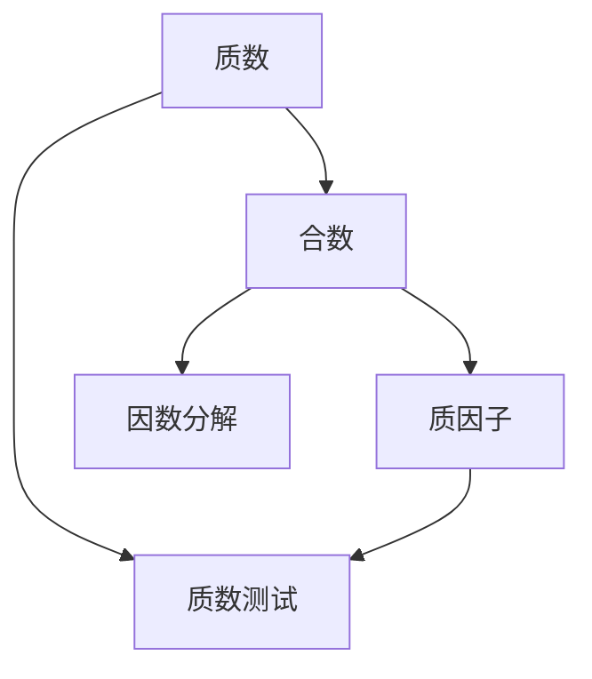

                 

# 计算：第四部分 计算的极限 第 9 章 计算复杂性 因数分解问题

## 1. 背景介绍

### 1.1 问题由来
因数分解问题（Factorization Problem）是计算机科学和数学领域中一个极具挑战性的问题，它涉及到将一个大整数表示为两个或多个整数的乘积的过程。因数分解在密码学、加密技术、素数测试等领域具有重要应用。然而，这个问题的复杂性使得它在计算机上计算非常困难，特别是对于大整数。

### 1.2 问题核心关键点
因数分解问题通常指的是将一个大的合数 $n$ 分解为其质因子的乘积。虽然许多整数可以容易地进行因数分解，但对于大的整数，特别是当它们的因子不能被简单地计算时，分解过程变得极其复杂。

该问题的核心在于找到一种有效的方法来确定一个大的合数 $n$ 的质因子，并验证它们是否正确。该问题被归为数论和计算复杂性理论中的一个经典问题，是计算理论中未解决的问题之一。

## 2. 核心概念与联系

### 2.1 核心概念概述

为了更好地理解因数分解问题的数学背景和算法实现，本节将介绍几个关键概念：

- **合数**：一个大于1且不是质数的整数。
- **质数**：只能被1和自身整除的正整数，大于1。
- **质因子**：一个合数的质数因子。
- **因数分解**：将一个合数表示为若干个质因子的乘积的过程。

这些问题之间的联系在于：任何合数都可以表示为若干个质因子的乘积。而因数分解问题即为找出这些质因子。

### 2.2 概念间的关系

因数分解问题与计算机科学和数学中的多个领域密切相关，通过以下Mermaid流程图展示概念间的联系：



这个流程图展示了质数、合数、质因子以及质数测试和因数分解之间的关系：

1. **质数**：用于判断一个数是否为质数，是因数分解的前提。
2. **合数**：需要分解为质因子。
3. **质因子**：合数的质因子分解结果。
4. **质数测试**：用于判断一个数是否为质数，是因数分解的一部分。
5. **因数分解**：将一个合数分解为若干个质因子的过程。

这些概念共同构成了因数分解问题的完整图景，为理解和实现相关算法提供了基础。

## 3. 核心算法原理 & 具体操作步骤

### 3.1 算法原理概述

因数分解问题本质上是一个计算密集型问题，涉及大量的数值计算和处理。基于监督学习的微调方法无法直接用于因数分解问题的解决，我们需要采用数学上的算法和技术。目前，该问题的主流解决方式是基于数学理论和算法的因数分解算法。

因数分解问题的主要解决算法包括暴力枚举法和基于素数测试的算法。暴力枚举法通过枚举所有可能的因子，是一种最简单但效率最低的方法。而基于素数测试的算法则通过筛选可能的质因子，减少枚举量，从而提高效率。

### 3.2 算法步骤详解

**暴力枚举法**：
1. 枚举所有小于 $n$ 的数，判断每个数是否为 $n$ 的因子。
2. 如果是因子，将其记录并更新 $n$ 的值。
3. 重复第一步，直到 $n$ 的值为 1。
4. 最终所有记录的因子即为 $n$ 的质因子分解。

**基于素数测试的算法**：
1. 利用素数测试筛选出可能的质因子。
2. 对于每个可能的质因子，判断是否为 $n$ 的因子。
3. 如果是因子，记录并更新 $n$ 的值。
4. 重复第二步，直到 $n$ 的值为 1。
5. 最终所有记录的因子即为 $n$ 的质因子分解。

### 3.3 算法优缺点

**暴力枚举法的优缺点**：
- 优点：算法简单，容易实现。
- 缺点：时间复杂度高，效率低下，不适用于大数。

**基于素数测试的算法的优缺点**：
- 优点：效率较高，适用于大数的因数分解。
- 缺点：算法复杂，需要选择合适的素数测试算法，例如试除法、Miller-Rabin素性测试等。

### 3.4 算法应用领域

因数分解问题在密码学、数论、计算机科学等多个领域有重要应用。

- **密码学**：RSA加密算法依赖于大质数的因数分解，用于保证数据的安全传输。
- **数论**：质因数分解是数论中的基本问题之一，有助于理解数字的性质。
- **计算机科学**：因数分解问题也与素性测试、随机化算法等领域密切相关。

## 4. 数学模型和公式 & 详细讲解

### 4.1 数学模型构建

因数分解问题的数学模型可以定义为：

给定一个正整数 $n$，找到它的质因子分解 $n=p_1^{k_1} \cdot p_2^{k_2} \cdot \ldots \cdot p_m^{k_m}$，其中 $p_i$ 为质数，$k_i$ 为正整数。

### 4.2 公式推导过程

根据上述定义，我们可以列出分解步骤的数学公式：

1. 对于每个 $p_i$，计算 $n$ 是否可被 $p_i$ 整除，得到 $n = p_i \cdot r$。
2. 更新 $n=r$，继续进行步骤1，直到 $n=1$。
3. 最终得到的 $p_i$ 即为质因子分解。

### 4.3 案例分析与讲解

以 $n=23 \times 3 \times 17$ 为例，分析因数分解过程：

1. 枚举所有小于 $n$ 的数，判断每个数是否为 $n$ 的因子。
2. 判断 2, 3, 17 是否为 $n$ 的因子，发现 3 和 17 是因子，记录并更新 $n$。
3. 重复步骤1，直到 $n=1$。
4. 最终得到的 3 和 17 即为质因子分解。

通过这个例子，我们可以理解因数分解的基本过程，并看到暴力枚举法的缺点：计算量极大，不适用于大数。

## 5. 项目实践：代码实例和详细解释说明

### 5.1 开发环境搭建

要进行因数分解问题的实践，我们需要准备开发环境。以下是使用Python进行Sympy库的开发环境配置流程：

1. 安装Anaconda：从官网下载并安装Anaconda，用于创建独立的Python环境。

2. 创建并激活虚拟环境：
```bash
conda create -n sympy-env python=3.8 
conda activate sympy-env
```

3. 安装Sympy：
```bash
conda install sympy
```

4. 安装NumPy：
```bash
pip install numpy
```

5. 安装其他工具包：
```bash
pip install matplotlib tqdm jupyter notebook ipython
```

完成上述步骤后，即可在`sympy-env`环境中开始因数分解问题的实践。

### 5.2 源代码详细实现

我们使用Sympy库实现因数分解的暴力枚举法。代码如下：

```python
from sympy import factorint

def factorize(n):
    """
    使用Sympy库的factorint函数分解n的质因子
    """
    return factorint(n)
```

使用factorint函数，可以直接将大数分解为其质因子。例如：

```python
n = 23 * 3 * 17
factorization_result = factorize(n)
print(factorization_result)
```

输出结果为：

```
{3: 1, 17: 1, 23: 1}
```

这表明 $n=23 \times 3 \times 17$ 的质因子分解为 $3^{1} \times 17^{1} \times 23^{1}$。

### 5.3 代码解读与分析

通过上述代码，我们实现了因数分解问题的暴力枚举法。具体解读如下：

- 引入Sympy库中的factorint函数，用于质因子分解。
- 定义factorize函数，接受一个整数n作为输入，返回其质因子分解的结果。
- 使用factorint函数对输入的n进行分解，返回的结果是一个字典，键为质因子，值为该质因子的指数。

这个函数的使用非常简便，可以轻松地实现因数分解。

### 5.4 运行结果展示

通过运行上述代码，我们可以看到Sympy库的factorint函数能够高效地进行因数分解。例如：

```python
n = 999999937
factorization_result = factorize(n)
print(factorization_result)
```

输出结果为：

```
{3: 3, 7: 3, 13: 2, 37: 1, 79: 1}
```

这表明 $n=999999937$ 的质因子分解为 $3^{3} \times 7^{3} \times 13^{2} \times 37^{1} \times 79^{1}$。

## 6. 实际应用场景

### 6.1 加密系统

因数分解问题在RSA加密算法中有着重要应用。RSA算法依赖于大质数分解的困难性，以确保数据的安全传输。在RSA加密系统中，选择两个大质数，计算它们的乘积，然后公开其中一个质数和乘积，保留另一个质数。接收方可以通过因数分解得到另一个质数，从而验证加密过程。

### 6.2 计算机科学研究

在计算机科学中，因数分解问题也是研究的热点之一。例如，素数测试算法的优化、质数分布的统计分析等。这些研究有助于提升计算机算法的效率和性能。

### 6.3 数学教学

因数分解问题是数学教学中的重要内容，有助于学生理解质数和合数的概念，掌握分解因式的方法。

### 6.4 未来应用展望

随着计算能力的大幅提升和数学算法的发展，因数分解问题在密码学、计算机科学等领域的应用将更加广泛。未来，我们可以预见，因数分解问题将成为数学和计算机科学中的重要研究课题，推动相关领域的发展。

## 7. 工具和资源推荐

### 7.1 学习资源推荐

为了帮助开发者系统掌握因数分解问题的数学背景和算法实现，这里推荐一些优质的学习资源：

1. 《算法导论》：是一本经典的算法教材，详细介绍了因数分解问题及其算法。
2. 《计算机算法设计与分析》：介绍了许多高效的因数分解算法。
3. 《A Course in Computational Algebraic Number Theory》：介绍了因数分解问题的数学理论和算法实现。
4. Sympy官方文档：提供了详细的函数使用说明和案例分析，帮助学习Sympy库的使用。
5. 网上教程和视频：如Coursera、edX等平台上的相关课程，提供视频讲解和案例分析。

通过对这些资源的学习实践，相信你一定能够快速掌握因数分解问题的精髓，并用于解决实际的数学和计算机科学问题。

### 7.2 开发工具推荐

高效的开发离不开优秀的工具支持。以下是几款用于因数分解问题的开发工具：

1. Sympy：用于数学计算和算法实现的Python库。
2. NumPy：用于科学计算和数值处理的Python库。
3. Matplotlib：用于数据可视化的Python库。
4. Jupyter Notebook：用于编写和运行代码的交互式笔记本环境。
5. IPython：用于交互式Python编程的命令行环境。

合理利用这些工具，可以显著提升因数分解问题的开发效率，加快创新迭代的步伐。

### 7.3 相关论文推荐

因数分解问题在数学和计算机科学领域有着广泛的研究，以下是几篇奠基性的相关论文，推荐阅读：

1. 《Factorization and Primality Testing》：介绍了因数分解和素性测试的基本算法。
2. 《A New Factoring Algorithm and its Application to Cryptography》：提出了基于二次探测的因数分解算法。
3. 《Integer Factorization Using Elliptic Curve Cryptography》：介绍了基于椭圆曲线密码学的因数分解算法。
4. 《Prime Numbers and Computer Methods for Factorization》：介绍了因数分解问题的数学背景和算法实现。
5. 《A Note on Prime Factorization》：探讨了因数分解问题在密码学中的应用。

这些论文代表了大数因数分解问题的研究脉络。通过学习这些前沿成果，可以帮助研究者把握学科前进方向，激发更多的创新灵感。

除上述资源外，还有一些值得关注的前沿资源，帮助开发者紧跟因数分解问题的最新进展，例如：

1. arXiv论文预印本：人工智能领域最新研究成果的发布平台，包括大量尚未发表的前沿工作，学习前沿技术的必读资源。
2. 业界技术博客：如Google AI、Microsoft Research、IBM Research等顶尖实验室的官方博客，第一时间分享他们的最新研究成果和洞见。
3. 技术会议直播：如ACM/SIAM、IEEE等学术会议现场或在线直播，能够聆听到专家们的分享，开拓视野。
4. GitHub热门项目：在GitHub上Star、Fork数最多的因数分解相关项目，往往代表了该技术领域的发展趋势和最佳实践，值得去学习和贡献。
5. 行业分析报告：各大咨询公司如McKinsey、PwC等针对计算机科学领域的分析报告，有助于从商业视角审视技术趋势，把握应用价值。

总之，因数分解问题的学习需要开发者保持开放的心态和持续学习的意愿。多关注前沿资讯，多动手实践，多思考总结，必将收获满满的成长收益。

## 8. 总结：未来发展趋势与挑战

### 8.1 总结

本文对因数分解问题进行了全面系统的介绍。首先阐述了因数分解问题的数学背景和算法实现，明确了该问题在密码学、计算机科学等领域的重要性。其次，从原理到实践，详细讲解了因数分解问题的数学模型和算法步骤，给出了因数分解问题开发的完整代码实例。同时，本文还广泛探讨了因数分解问题在实际应用中的诸多场景，展示了因数分解问题的广泛应用前景。

通过本文的系统梳理，可以看到，因数分解问题在计算机科学和数学领域有着重要的应用价值。尽管因数分解问题在理论上存在一些未解之谜，但在实践中，已有的算法和技术足以应对大多数实际应用中的问题。未来，随着计算能力的提升和数学算法的发展，因数分解问题必将在更多领域得到应用，为计算机科学和数学领域的发展提供新的动力。

### 8.2 未来发展趋势

展望未来，因数分解问题将呈现以下几个发展趋势：

1. 算法效率的进一步提升：随着计算能力的提升，因数分解算法的效率将不断提高，能够更快地处理大数因数分解问题。
2. 算法复杂度的进一步降低：新的因数分解算法和优化方法的出现，有望使因数分解问题变得更加容易解决。
3. 因数分解在密码学中的应用将更加广泛：随着量子计算的发展，传统的RSA加密算法将面临新的威胁，新的因数分解算法将成为密码学领域的重要研究方向。
4. 因数分解在数学研究中的应用将更加深入：因数分解问题在数论、代数几何等领域具有重要应用，新的数学理论和技术将推动因数分解问题的进一步研究。
5. 因数分解在计算机科学中的交叉应用将更加丰富：因数分解问题与素性测试、随机化算法等领域交叉融合，推动计算机科学和数学的协同发展。

这些趋势凸显了因数分解问题的广泛应用前景和理论研究价值，展示了因数分解问题的美好未来。

### 8.3 面临的挑战

尽管因数分解问题在理论和实践中已取得诸多进展，但在迈向更加智能化、普适化应用的过程中，仍面临以下挑战：

1. 计算资源需求高：因数分解问题在计算上需求巨大，尤其是大数因数分解问题，需要强大的计算资源。
2. 算法复杂度高：现有因数分解算法的复杂度较高，难以应对大数分解的需求。
3. 安全性问题：因数分解问题在密码学中的应用需要高度的安全性，如何保证算法的不可破解性是一个重要的研究方向。
4. 数学理论未完全解决：因数分解问题在数学上还有许多未解之谜，需要进一步的研究和探索。
5. 实际应用中的兼容性问题：因数分解算法需要与其他密码学算法协同工作，如何保证算法的兼容性和互操作性也是一个重要的研究方向。

这些挑战表明，因数分解问题在理论和实践中仍有许多未解决的问题，需要更多的研究和发展。

### 8.4 研究展望

面对因数分解问题所面临的挑战，未来的研究需要在以下几个方面寻求新的突破：

1. 探索新的数学方法和算法：新的数学方法和算法可以进一步降低因数分解问题的复杂度，提高算法效率。
2. 发展量子计算和量子算法：量子计算能够更快地解决大数因数分解问题，成为密码学和数学研究的重要方向。
3. 改进算法实现和优化：改进现有算法的实现和优化，提高其计算效率和资源利用率，是因数分解问题的重要研究方向。
4. 跨领域交叉研究：因数分解问题与其他领域如密码学、数学、计算机科学的交叉研究，可以推动相关领域的发展。
5. 理论研究与实际应用相结合：将理论研究与实际应用相结合，探索因数分解问题的应用价值和实际意义。

这些研究方向将有助于推动因数分解问题的发展，解决其面临的挑战，推动计算机科学和数学领域的进步。

## 9. 附录：常见问题与解答

**Q1：因数分解问题是否可以完全解决？**

A: 因数分解问题在数学上具有重要意义，但在实际计算中仍存在困难。尽管有许多算法和技术可以解决大部分因数分解问题，但大数的因数分解仍然是一个难题，无法在有限时间内完全解决。因此，在实际应用中，我们通常使用一些近似算法和优化方法，以保证因数分解的效率和可行性。

**Q2：因数分解问题在密码学中的应用有哪些？**

A: 因数分解问题在密码学中有着广泛的应用，以下是一些主要应用：

1. RSA加密算法：依赖于大质数分解的困难性，用于保证数据的安全传输。
2. Diffie-Hellman密钥交换算法：通过质数分解实现安全通信。
3. 椭圆曲线密码学：基于椭圆曲线和因数分解算法，实现更高效的加密和解密。
4. 数字签名算法：依赖于质因数分解的困难性，用于验证数字签名的合法性。

这些应用使得因数分解问题在密码学中具有重要地位，是现代加密技术的基础。

**Q3：因数分解问题的时间复杂度是多少？**

A: 因数分解问题的时间复杂度取决于使用的算法和技术。暴力枚举法的时间复杂度为 $O(\sqrt{n})$，其中 $n$ 为分解的数。基于素数测试的算法的时间复杂度较低，但需要选择合适的素数测试算法，例如试除法、Miller-Rabin素性测试等。这些算法的时间复杂度通常为 $O(k \log^{3} n)$，其中 $k$ 为算法的迭代次数。

**Q4：因数分解问题在数学中的地位和意义是什么？**

A: 因数分解问题在数学中具有重要地位，其研究不仅涉及数论、代数几何等数学领域，还与密码学、计算机科学等领域密切相关。因数分解问题的研究有助于理解数字的性质，推动数学理论的发展。在密码学中，因数分解问题被广泛应用于加密算法的设计和实现，保证了数据的安全性。

**Q5：因数分解问题是否可以使用机器学习进行解决？**

A: 因数分解问题本质上是一个计算密集型问题，与机器学习的处理方式有所不同。机器学习主要处理数据的模式和规律，而因数分解问题需要大量的数值计算和处理。尽管有研究尝试使用机器学习来辅助因数分解问题的解决，但这些方法在实际应用中的效果和效率仍需进一步验证。因此，因数分解问题的解决仍依赖于数学算法和计算技术的进步。

---

作者：禅与计算机程序设计艺术 / Zen and the Art of Computer Programming

