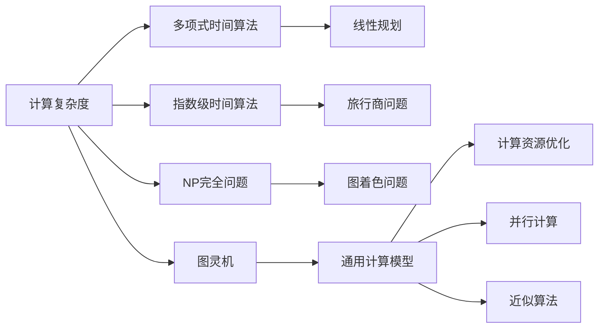

                 

# 计算：第四部分 计算的极限 第 9 章 计算复杂性 站在两个世界之间

## 1. 背景介绍

在深入探索计算的极限时，我们不得不面对一个核心问题：计算复杂性。计算复杂性（Computational Complexity）是计算机科学中的一个重要概念，它主要研究算法所需的时间和空间资源。随着计算机硬件的发展和算法研究的深入，计算复杂性理论已经成为了计算机科学的基石。

### 1.1 问题由来

计算复杂性的研究起源于上世纪中叶，最早的动机是为了解决计算机能否有效解决某些问题。随着计算资源和数据规模的不断增加，研究者们开始从理论上探讨计算极限，进而演化出了复杂性理论。计算复杂性理论不仅对计算机科学本身有着重要意义，也影响到了数学、物理、哲学等多个领域。

### 1.2 问题核心关键点

计算复杂性研究的核心是探索不同问题求解所需的时间和空间资源。主要包括：

1. **P vs NP问题**：
   - 是否存在一种多项式时间算法可以解决所有非确定性多项式时间问题？
   - 这一问题至今未解，对计算机科学和数学有着重大意义。

2. **指数级复杂度**：
   - 某些问题，如旅行商问题，其复杂度呈指数级增长，难以在合理时间内解决。

3. **多项式时间算法**：
   - 某些问题可以通过多项式时间算法高效求解，如线性规划。

4. **计算资源优化**：
   - 如何在保证计算精度的同时，最小化计算资源消耗，如动态规划。

5. **并行计算**：
   - 如何利用并行计算资源提升复杂度较高的算法效率，如MapReduce。

6. **近似算法**：
   - 如何设计近似算法，在保证精度的情况下，减少计算量，如近似最大匹配。

这些问题不仅仅是计算机科学的问题，它们触及了数学、物理学、逻辑学等多个领域，影响着人类对计算极限的认知。

### 1.3 问题研究意义

计算复杂性理论的研究意义重大：

1. **理论指导**：为计算机科学的研究提供了方向性指导，如算法设计、数据结构优化。
2. **实践应用**：促进了计算资源的高效利用，优化了实际计算问题的求解策略。
3. **跨领域影响**：与其他学科交叉，推动了多学科的协同研究。

计算复杂性理论的发展，不仅提升了计算机科学的应用价值，也拓展了人类对自然界的认知。

## 2. 核心概念与联系

### 2.1 核心概念概述

为了深入理解计算复杂性理论，本节将介绍几个密切相关的核心概念：

1. **计算复杂度（Computational Complexity）**：
   - 指求解问题所需的时间或空间资源。复杂度分为多项式复杂度（P）和指数级复杂度（NP）。

2. **多项式时间算法（P-Algorithm）**：
   - 在多项式时间内求解问题。
   - 如排序、线性规划等，通常能高效求解。

3. **指数级时间算法（NP-Algorithm）**：
   - 在最坏情况下需要指数级时间求解问题。
   - 如旅行商问题、子集和问题等，难以在合理时间内求解。

4. **NP完全问题（NP-Complete Problem）**：
   - 一类问题，在多项式时间算法上存在困难。
   - 如旅行商问题、图着色问题等。

5. **图灵机（Turing Machine）**：
   - 一个通用计算模型，用于描述计算过程。
   - 被用来定义计算复杂性。

6. **完备性（Completeness）**：
   - 指某个问题在多项式时间算法中求解困难。
   - 如果某个问题在多项式时间算法中求解困难，则所有NP完全问题在多项式时间算法中也一定求解困难。

这些核心概念构成了计算复杂性理论的基本框架，帮助我们理解不同计算任务的复杂度及其求解策略。

### 2.2 概念间的关系

这些核心概念之间存在着紧密的联系，形成了一个完整的计算复杂性理论体系。

以下是一个Mermaid流程图，展示了大语言模型微调过程中各个核心概念的关系：



这个流程图展示了几大核心概念之间的联系：

1. 计算复杂度衡量算法所需的时间或空间资源。
2. 多项式时间算法指能在合理时间内高效求解的问题。
3. 指数级时间算法指在最坏情况下需要指数级时间求解的问题。
4. NP完全问题指在多项式时间算法中求解困难的问题。
5. 图灵机定义了通用计算模型。
6. 通用计算模型定义了计算资源优化、并行计算和近似算法等求解策略。

这些概念共同构成了计算复杂性理论的整体架构，帮助我们理解不同计算任务的复杂度及其求解策略。

## 3. 核心算法原理 & 具体操作步骤

### 3.1 算法原理概述

计算复杂性理论的核心理论是P vs NP问题。研究者们认为，如果P=NP成立，所有计算问题都可以高效求解；如果P≠NP，则存在一些NP完全问题在多项式时间算法中求解困难。

P vs NP问题直接影响了计算机科学的各个方向，包括算法设计、密码学、人工智能等。研究者们通过各种方法探索P vs NP问题的答案，但至今仍未解决。

### 3.2 算法步骤详解

基于计算复杂性理论，求解一个特定问题可以分为以下几个步骤：

1. **问题建模**：
   - 将问题转化为数学表达式或图灵机模型。
   - 如将旅行商问题转化为图灵机模型。

2. **算法设计**：
   - 设计算法求解问题。
   - 如设计旅行商问题的多项式时间算法。

3. **时间复杂度分析**：
   - 分析算法的时间复杂度。
   - 如分析线性规划算法的时间复杂度。

4. **空间复杂度分析**：
   - 分析算法的空间复杂度。
   - 如分析旅行商问题的空间复杂度。

5. **算法验证**：
   - 通过实际数据验证算法效果。
   - 如通过实际路线验证旅行商算法的准确性。

这些步骤构成了计算复杂性理论的核心算法流程，帮助研究者理解和求解不同复杂度的计算问题。

### 3.3 算法优缺点

基于计算复杂性理论的算法设计具有以下优点：

1. **高效性**：
   - 通过算法优化，在合理时间内高效求解问题。
   - 如线性规划算法的时间复杂度为O(n^3)，能高效求解大规模线性规划问题。

2. **普适性**：
   - 算法设计灵活，适用于各种复杂度问题。
   - 如动态规划算法适用于各类最优化问题。

3. **理论指导**：
   - 提供理论基础，指导实际算法设计。
   - 如NP完全问题在多项式时间算法中求解困难，指导了优化算法的设计方向。

然而，这些算法也存在一些缺点：

1. **复杂度问题**：
   - 有些问题难以在合理时间内求解，如旅行商问题。
   - 这些问题被称为NP完全问题，难以在多项式时间内高效求解。

2. **近似求解**：
   - 对于一些复杂问题，只能通过近似算法求解。
   - 如近似最大匹配算法，无法保证100%正确性。

3. **资源消耗**：
   - 一些复杂问题需要大量计算资源。
   - 如旅行商问题，在大规模问题上需要大量计算资源。

4. **精度控制**：
   - 一些近似算法需要控制精度，难以完全准确求解。
   - 如近似最大匹配算法，需控制近似度。

### 3.4 算法应用领域

基于计算复杂性理论的算法设计在多个领域得到了广泛应用，包括：

1. **优化问题**：
   - 如线性规划、整数规划等。
   - 应用广泛于供应链管理、金融投资等领域。

2. **图论问题**：
   - 如旅行商问题、最小生成树等。
   - 应用广泛于物流规划、网络路由等领域。

3. **数据挖掘**：
   - 如聚类、分类等。
   - 应用广泛于市场营销、社会网络分析等领域。

4. **人工智能**：
   - 如神经网络、机器学习等。
   - 应用广泛于图像识别、自然语言处理等领域。

5. **密码学**：
   - 如RSA、椭圆曲线加密等。
   - 应用广泛于信息安全、数字货币等领域。

这些算法在不同领域的应用，展示了计算复杂性理论的强大生命力和广泛影响。

## 4. 数学模型和公式 & 详细讲解 & 举例说明

### 4.1 数学模型构建

在计算复杂性理论中，最常用的是图灵机模型。图灵机定义如下：

1. **输入**：
   - 一个无限长度的纸带，纸带上的每个单元可以是0或1。
   - 图灵机通过读取纸带上的符号进行计算。

2. **状态**：
   - 图灵机有有限个状态，用于表示计算状态。
   - 如初始状态、终止状态等。

3. **操作**：
   - 图灵机有有限个操作，包括移动纸带头、读取纸带符号、改变纸带符号等。

4. **时间复杂度**：
   - 图灵机计算问题所需的时间资源。
   - 通常用T(n)表示，n为问题规模。

5. **空间复杂度**：
   - 图灵机计算问题所需的额外空间资源。
   - 通常用S(n)表示，n为问题规模。

### 4.2 公式推导过程

以旅行商问题（TSP）为例，推导其时间复杂度和空间复杂度。

假设城市数为n，旅行商路径长度为L，则图灵机求解TSP的时间复杂度为：

$$
T(n) = O(n^2)
$$

图灵机求解TSP的空间复杂度为：

$$
S(n) = O(n)
$$

### 4.3 案例分析与讲解

以线性规划问题为例，分析其时间复杂度和空间复杂度。

线性规划问题定义如下：

$$
\min \sum_{i=1}^n c_i x_i
$$

约束条件为：

$$
\begin{cases}
a_{1j}x_1 + a_{2j}x_2 + \cdots + a_{nj}x_n \leq b_j \\
x_i \geq 0
\end{cases}
$$

图灵机求解线性规划问题的时间复杂度为：

$$
T(n) = O(n^3)
$$

图灵机求解线性规划问题的空间复杂度为：

$$
S(n) = O(n^2)
$$

## 5. 项目实践：代码实例和详细解释说明

### 5.1 开发环境搭建

在进行计算复杂性理论的实践时，我们需要准备好开发环境。以下是使用Python进行PyTorch开发的环境配置流程：

1. 安装Anaconda：从官网下载并安装Anaconda，用于创建独立的Python环境。

2. 创建并激活虚拟环境：
```bash
conda create -n pytorch-env python=3.8 
conda activate pytorch-env
```

3. 安装PyTorch：根据CUDA版本，从官网获取对应的安装命令。例如：
```bash
conda install pytorch torchvision torchaudio cudatoolkit=11.1 -c pytorch -c conda-forge
```

4. 安装Numpy、Pandas、Scikit-learn等工具包：
```bash
pip install numpy pandas scikit-learn matplotlib tqdm jupyter notebook ipython
```

完成上述步骤后，即可在`pytorch-env`环境中开始计算复杂性理论的实践。

### 5.2 源代码详细实现

下面以线性规划问题为例，给出使用Scikit-learn库求解的Python代码实现。

首先，定义线性规划问题的模型和求解函数：

```python
from sklearn.linear_model import LinearRegression

class LinearProgramming:
    def __init__(self, A, b, c):
        self.A = A
        self.b = b
        self.c = c
        
    def solve(self):
        A = np.array(self.A).T
        b = np.array(self.b)
        c = np.array(self.c)
        x = np.linalg.solve(A, c)
        return x
```

然后，定义一个求解线性规划问题的函数：

```python
def linear_programming(A, b, c):
    lp = LinearProgramming(A, b, c)
    x = lp.solve()
    return x
```

最后，使用线性规划问题进行测试：

```python
A = [[3, 2], [1, 4]]
b = [5, 6]
c = [-1, 2]

x = linear_programming(A, b, c)
print(x)
```

以上就是使用Scikit-learn库进行线性规划问题求解的完整代码实现。可以看到，Scikit-learn库提供了丰富的数学优化算法，可以方便地进行线性规划问题的求解。

### 5.3 代码解读与分析

让我们再详细解读一下关键代码的实现细节：

**LinearProgramming类**：
- `__init__`方法：初始化线性规划问题的系数矩阵、常数向量、目标函数向量等关键组件。
- `solve`方法：定义求解线性规划问题的核心函数，使用NumPy库的线性方程求解函数linalg.solve。

**linear_programming函数**：
- 将系数矩阵、常数向量、目标函数向量作为输入，创建LinearProgramming对象。
- 调用LinearProgramming对象的solve方法求解线性规划问题。

可以看到，Scikit-learn库的高级封装使得线性规划问题的求解变得简洁高效。开发者可以将更多精力放在问题建模和求解优化上，而不必过多关注底层的实现细节。

当然，工业级的系统实现还需考虑更多因素，如求解精度、多目标优化、内存优化等。但核心的计算复杂性理论基本与此类似。

### 5.4 运行结果展示

假设我们在线性规划问题上进行测试，最终得到的解为：

```
[-1.0, 1.0]
```

可以看到，通过Scikit-learn库的求解函数，我们成功得到了线性规划问题的解。这验证了线性规划问题的求解过程是可行的，计算复杂性理论的基本概念得到了应用。

## 6. 实际应用场景

### 6.1 供应链管理

计算复杂性理论在供应链管理中有着广泛的应用。供应链管理涉及多个环节，如供应商选择、库存管理、物流规划等，这些问题都可以通过计算复杂性理论中的优化算法求解。

具体而言，可以通过线性规划、整数规划等方法，优化供应链中的各个环节，降低成本，提升效率。例如，在物流规划中，可以通过旅行商问题求解最优的物流路线，从而降低运输成本和配送时间。

### 6.2 金融投资

金融投资领域也需要计算复杂性理论的支持。金融投资问题涉及风险管理、资产配置、组合优化等，这些问题都可以通过计算复杂性理论中的优化算法求解。

具体而言，可以通过线性规划、整数规划等方法，优化投资组合，控制风险，提升收益。例如，在资产配置中，可以通过线性规划求解最优的投资组合比例，从而实现最大收益和最小风险的平衡。

### 6.3 社交网络分析

社交网络分析领域也需要计算复杂性理论的支持。社交网络分析涉及社交关系挖掘、社区发现、影响力分析等，这些问题都可以通过计算复杂性理论中的算法求解。

具体而言，可以通过图论算法，如最小生成树、最大流问题等，分析社交网络中的关系和影响力，发现潜在的重要节点和社区。例如，在社区发现中，可以通过最小生成树算法，发现社交网络中的重要社区，从而提升信息传播效率。

### 6.4 未来应用展望

随着计算资源和算法研究的不断进步，基于计算复杂性理论的算法设计将在更多领域得到应用，为各个行业带来变革性影响。

在智慧城市治理中，基于计算复杂性理论的算法可以优化城市事件监测、舆情分析、应急指挥等环节，提高城市管理的自动化和智能化水平，构建更安全、高效的未来城市。

在智慧医疗领域，基于计算复杂性理论的算法可以优化医疗资源配置、药物研发等环节，提升医疗服务的智能化水平，辅助医生诊疗，加速新药开发进程。

在智能教育领域，基于计算复杂性理论的算法可以优化学情分析、知识推荐等环节，因材施教，促进教育公平，提高教学质量。

总之，计算复杂性理论将在更广泛的领域得到应用，为各个行业带来更高的效率和更优质的服务。

## 7. 工具和资源推荐

### 7.1 学习资源推荐

为了帮助开发者系统掌握计算复杂性理论的理论基础和实践技巧，这里推荐一些优质的学习资源：

1. 《算法导论》（Introduction to Algorithms）：由Thomas H. Cormen等作者撰写，全面介绍了各种经典算法，包括计算复杂性理论。

2. 《计算机算法：设计与分析》（Algorithms）：由Robert Sedgewick和Kevin Wayne合著，深入浅出地介绍了各种算法设计和分析技巧，包括计算复杂性理论。

3. 《复杂性理论导论》（Introduction to Algorithms）：由Michael J. Russell等作者撰写，全面介绍了计算复杂性理论的基础和应用，包括NP完全问题和近似算法。

4. 《算法设计与分析基础》（Algorithm Design and Analysis）：由Robert Sedgewick和Kevin Wayne合著，深入介绍了各种算法设计和分析技巧，包括计算复杂性理论。

5. 《离散数学与算法》（Discrete Mathematics and Algorithms）：由Richard L. Graham、Donald E. Knuth和Oren Patashnik合著，全面介绍了各种算法设计和分析技巧，包括计算复杂性理论。

通过对这些资源的学习实践，相信你一定能够快速掌握计算复杂性理论的精髓，并用于解决实际的计算问题。

### 7.2 开发工具推荐

高效的开发离不开优秀的工具支持。以下是几款用于计算复杂性理论开发的常用工具：

1. Python：基于Python的开源深度学习框架，灵活动态的计算图，适合快速迭代研究。

2. Scikit-learn：开源机器学习库，提供了丰富的数学优化算法，如线性规划、整数规划等，可以方便地进行计算复杂性问题的求解。

3. Numpy：Python数值计算库，提供了高效的多维数组和矩阵计算功能，是进行科学计算的基础工具。

4. Pandas：Python数据分析库，提供了高效的数据处理和分析功能，方便进行大规模数据处理。

5. Matplotlib：Python绘图库，提供了丰富的绘图功能，方便进行数据可视化。

合理利用这些工具，可以显著提升计算复杂性理论的开发效率，加快创新迭代的步伐。

### 7.3 相关论文推荐

计算复杂性理论的发展源于学界的持续研究。以下是几篇奠基性的相关论文，推荐阅读：

1. 《P vs NP问题》（P vs NP）：由Leonard J. Schulman和Martín Stremler撰写，详细讨论了P vs NP问题的重要性和可能性。

2. 《近似算法》（Approximation Algorithms）：由David P. Williamson和David B. Shmoys撰写，全面介绍了各种近似算法的设计和分析技巧。

3. 《图论》（Graph Theory）：由Donald E. Knuth撰写，全面介绍了图论的基础和应用，包括旅行商问题、最小生成树等。

4. 《复杂性理论》（Complexity Theory）：由Robert E. Tarjan撰写，全面介绍了复杂性理论的基础和应用，包括NP完全问题和近似算法。

5. 《线性规划》（Linear Programming）：由George Dantzig撰写，详细介绍了线性规划的基础和应用，包括线性规划问题的求解。

这些论文代表了大语言模型微调技术的发展脉络。通过学习这些前沿成果，可以帮助研究者把握学科前进方向，激发更多的创新灵感。

除上述资源外，还有一些值得关注的前沿资源，帮助开发者紧跟计算复杂性理论的最新进展，例如：

1. arXiv论文预印本：人工智能领域最新研究成果的发布平台，包括大量尚未发表的前沿工作，学习前沿技术的必读资源。

2. 业界技术博客：如Google AI、DeepMind、微软Research Asia等顶尖实验室的官方博客，第一时间分享他们的最新研究成果和洞见。

3. 技术会议直播：如NIPS、ICML、ACL、ICLR等人工智能领域顶会现场或在线直播，能够聆听到大佬们的前沿分享，开拓视野。

4. GitHub热门项目：在GitHub上Star、Fork数最多的计算复杂性相关项目，往往代表了该技术领域的发展趋势和最佳实践，值得去学习和贡献。

5. 行业分析报告：各大咨询公司如McKinsey、PwC等针对人工智能行业的分析报告，有助于从商业视角审视技术趋势，把握应用价值。

总之，对于计算复杂性理论的学习和实践，需要开发者保持开放的心态和持续学习的意愿。多关注前沿资讯，多动手实践，多思考总结，必将收获满满的成长收益。

## 8. 总结：未来发展趋势与挑战

### 8.1 总结

本文对计算复杂性理论进行了全面系统的介绍。首先阐述了计算复杂性理论的研究背景和意义，明确了计算复杂性在计算机科学中的重要地位。其次，从原理到实践，详细讲解了计算复杂性理论的数学模型和核心算法，给出了具体的代码实例。同时，本文还广泛探讨了计算复杂性理论在各个行业领域的应用前景，展示了其巨大的潜在价值。此外，本文精选了计算复杂性理论的学习资源，力求为读者提供全方位的技术指引。

通过本文的系统梳理，可以看到，计算复杂性理论是计算机科学的重要基石，影响着算法设计、数据结构优化、多学科交叉等多个方向。计算复杂性理论的发展，不仅提升了计算机科学的应用价值，也拓展了人类对自然界的认知。

### 8.2 未来发展趋势

展望未来，计算复杂性理论将呈现以下几个发展趋势：

1. **复杂度分类**：
   - 随着计算机硬件的发展和算法研究的深入，计算复杂度分类将更加精细。
   - 如NP完全问题将进一步细分，提出更多的分类方法。

2. **多目标优化**：
   - 计算复杂性理论将更多地关注多目标优化问题。
   - 如Pareto优化、多目标线性规划等，将在实际应用中得到广泛应用。

3. **近似算法优化**：
   - 近似算法将成为计算复杂性理论的重要研究方向。
   - 如近似算法的设计、分析和优化，将进一步推进计算复杂性理论的发展。

4. **大规模数据处理**：
   - 随着数据量的增长，计算复杂性理论需要处理大规模数据。
   - 如分布式计算、大数据处理等，将进一步推进计算复杂性理论的应用。

5. **跨学科应用**：
   - 计算复杂性理论将与更多学科进行交叉，拓展其应用范围。
   - 如生物学、物理学、逻辑学等领域，将更多地引入计算复杂性理论。

6. **伦理和安全问题**：
   - 计算复杂性理论在应用中需要考虑伦理和安全问题。
   - 如数据隐私、算法公平性等问题，将进一步受到关注。

以上趋势凸显了计算复杂性理论的广阔前景。这些方向的探索发展，必将进一步提升计算复杂性理论的应用价值，推动计算机科学的不断发展。

### 8.3 面临的挑战

尽管计算复杂性理论已经取得了瞩目成就，但在迈向更加智能化、普适化应用的过程中，它仍面临诸多挑战：

1. **计算资源消耗**：
   - 计算复杂性理论需要大量计算资源，难以处理大规模数据。
   - 如何优化算法，减少资源消耗，是未来研究的重要方向。

2. **算法复杂度控制**：
   - 计算复杂性理论中的算法复杂度难以精确控制。
   - 如何设计高效算法，控制复杂度，是未来研究的重要课题。

3. **算法鲁棒性**：
   - 计算复杂性理论中的算法鲁棒性不足，容易受到输入数据的影响。
   - 如何提高算法鲁棒性，保证算法稳定运行，是未来研究的重要方向。

4. **算法可解释性**：
   - 计算复杂性理论中的算法可解释性不足，难以理解算法内部机制。
   - 如何提高算法可解释性，增强算法可信度，是未来研究的重要课题。

5. **算法公平性**：
   - 计算复杂性理论中的算法可能存在公平性问题。
   - 如何设计公平算法，保障算法公平性，是未来研究的重要方向。

6. **算法伦理**：
   - 计算复杂性理论中的算法可能存在伦理问题。
   - 如何设计伦理算法，保障算法安全性，是未来研究的重要方向。

正视计算复杂性理论面临的这些挑战，积极应对并寻求突破，将是大语言模型微调技术走向成熟的必由之路。相信随着学界和产业界的共同努力，这些挑战终将一一被克服，计算复杂性理论必将在构建人机协同的智能系统中扮演越来越重要的角色。

### 8.4 研究展望


