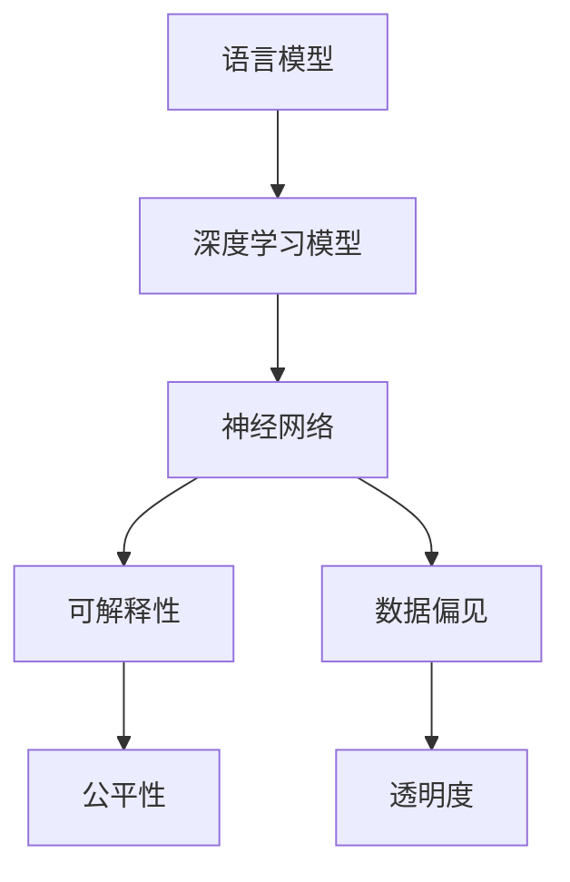

                 

# 语言≠思维：大模型的认知挑战

> 关键词：语言模型,认知科学,人类思维,神经网络,可解释性,数据偏见

## 1. 背景介绍

在人工智能领域，深度学习语言模型尤其是大规模预训练模型（如BERT, GPT系列）取得了显著的进展，但这些模型究竟“理解”了语言和思维，依然是一个充满争议的话题。尽管在诸多NLP任务上取得了成功，但这些模型的"智能"究竟来源于模型本身，还是来自于大量的标注数据和复杂的结构设计？本文将从认知科学和神经网络的角度出发，探讨大模型在认知上的挑战，以及其可能的意义和局限性。

## 2. 核心概念与联系

### 2.1 核心概念概述

- 语言模型（Language Model, LM）：指的是在自然语言文本中预测下一个词的概率分布模型。常见的语言模型包括n-gram模型、循环神经网络（RNN）、Transformer等。
- 深度学习模型：利用神经网络结构，通过梯度下降等优化算法对大量标注数据进行训练，自动提取特征并进行推理预测。
- 认知科学（Cognitive Science）：研究人类思维、学习、记忆、推理等心理过程及其脑机制的科学。
- 神经网络（Neural Network）：模仿人脑神经元网络结构，通过计算图（Computational Graph）进行前向传播和反向传播的模型。
- 可解释性（Explainability）：指对模型决策过程的解释能力，使模型输出具有逻辑性和可理解性。
- 数据偏见（Data Bias）：指数据集中的不平衡、不均衡导致的模型偏向性，往往造成模型在预测上的不公平。

这些概念之间有着密切的联系，语言模型和深度学习模型都是认知科学中用于模拟人类思维过程的工具。神经网络则是深度学习模型的基础，通过模拟人脑神经元的工作方式，实现了复杂的推理和预测能力。而可解释性和数据偏见则是评估模型认知能力的指标，也是确保模型公平性和透明度的关键因素。

### 2.2 概念间的关系

我们可以用以下Mermaid流程图来展示这些概念之间的联系：



语言模型是深度学习模型的基础，深度学习模型通过神经网络结构进行训练，能够预测文本中的下一个词。可解释性确保了模型输出的透明性和公平性，而数据偏见则是对模型认知能力的威胁，需要被识别和纠正。

## 3. 核心算法原理 & 具体操作步骤

### 3.1 算法原理概述

基于语言模型的认知挑战，主要是来自于模型如何理解和生成自然语言的能力，以及这种能力是否等同于人类认知。认知科学研究表明，人类的思维过程涉及多层次的抽象、推理和记忆，而语言只是其中的一种交流工具。因此，要实现“理解”语言，模型必须能够模拟这些高级认知过程。

当前的大规模语言模型，如BERT、GPT系列，是通过大量无标签文本进行预训练，然后利用标注数据进行微调，使其能够在特定的NLP任务上表现出色。但这些模型是否真正“理解”了语言，而非仅仅是记住了大量的模式和概率分布，依然是一个待解答的问题。

### 3.2 算法步骤详解

大模型在认知上的挑战，主要体现在以下几个方面：

1. 理解能力的构建：大模型需要具备足够的抽象能力，以理解复杂的语言结构和语义关系。这不仅需要大量的数据和计算资源，还需要合理的模型结构和训练策略。
2. 推理能力的验证：大模型的推理能力是否等同于人类的推理，需要更精细的实验设计。这包括对模型进行各种推理测试，以及与人类受试者进行对比。
3. 可解释性的追求：如何使大模型的决策过程具有可解释性，使其输出结果易于理解，并符合人类认知逻辑。
4. 数据偏见的防范：如何在数据收集和处理中避免偏见，确保模型的公平性和透明性。

### 3.3 算法优缺点

基于语言模型的认知挑战的优点包括：

1. 数据驱动：通过大量无标签数据进行预训练，无需人工标注，节省了标注成本。
2. 可解释性强：利用深度学习模型的可解释性技术，如LIME、SHAP等，可以揭示模型内部的工作机制。
3. 泛化能力强：大模型具有高度泛化能力，可以应用于各种NLP任务。
4. 高效学习：通过微调等技术，可以在少量标注数据下快速学习任务。

其缺点包括：

1. 训练成本高：需要大量的计算资源和标注数据。
2. 黑箱问题：模型过于复杂，难以解释其内部决策过程。
3. 数据依赖性强：依赖于标注数据的质量和分布，模型容易过拟合。
4. 泛化不足：在处理新数据时，模型可能表现出较差的泛化能力。

### 3.4 算法应用领域

大模型在认知挑战领域的应用，主要体现在以下几个方面：

1. 自然语言理解：利用语言模型对自然语言进行理解和生成，如问答系统、文本摘要、机器翻译等。
2. 认知增强：利用大模型进行认知辅助，如智能助手、教育辅助系统等。
3. 知识推理：利用大模型进行逻辑推理，如问答系统中的知识图谱嵌入和推理。
4. 情感分析：利用大模型进行情感识别，如对文本情感的分类和情感分析。

## 4. 数学模型和公式 & 详细讲解  
### 4.1 数学模型构建

对于大规模语言模型，我们可以用以下数学模型来描述其认知能力：

$$
\mathcal{P}(w_1, w_2, ..., w_t) = \mathcal{P}(w_1) \prod_{i=1}^{t-1} \mathcal{P}(w_i | w_1, ..., w_{i-1})
$$

其中 $w_1, w_2, ..., w_t$ 表示自然语言文本中的单词，$\mathcal{P}(w_1, w_2, ..., w_t)$ 表示整个文本序列的概率分布。$\mathcal{P}(w_i | w_1, ..., w_{i-1})$ 表示单词 $w_i$ 在给定前 $i-1$ 个单词条件下的概率分布。

### 4.2 公式推导过程

通过贝叶斯定理，我们可以推导出语言模型在给定前 $i-1$ 个单词条件下的概率分布，即：

$$
\mathcal{P}(w_i | w_1, ..., w_{i-1}) = \frac{\mathcal{P}(w_1, w_2, ..., w_{i-1}, w_i)}{\mathcal{P}(w_1, w_2, ..., w_{i-1})}
$$

即在给定前 $i-1$ 个单词的条件下，单词 $w_i$ 的概率分布。

在实践中，我们通常使用Transformer等架构，通过前向传播和自回归机制，计算出每个单词的概率分布。然后使用交叉熵损失函数等进行训练，优化模型参数。

### 4.3 案例分析与讲解

例如，对于给定文本序列 "The cat is on the mat"，语言模型需要预测下一个单词 "on" 的概率。假设模型已经训练完毕，通过前向传播得到每个单词的概率分布，计算出下一个单词的概率：

$$
\mathcal{P}(on | the, cat, is) = \frac{\mathcal{P}(the, cat, is, on)}{\mathcal{P}(the, cat, is)}
$$

### 4.4 案例分析与讲解

然后利用交叉熵损失函数进行优化，更新模型参数，使得 $\mathcal{P}(on | the, cat, is)$ 逼近真实的概率值。

## 5. 项目实践：代码实例和详细解释说明

### 5.1 开发环境搭建

要进行大模型的项目实践，首先需要搭建好开发环境。以下是使用Python进行PyTorch开发的常见环境配置流程：

1. 安装Anaconda：从官网下载并安装Anaconda，用于创建独立的Python环境。

2. 创建并激活虚拟环境：
```bash
conda create -n pytorch-env python=3.8 
conda activate pytorch-env
```

3. 安装PyTorch：根据CUDA版本，从官网获取对应的安装命令。例如：
```bash
conda install pytorch torchvision torchaudio cudatoolkit=11.1 -c pytorch -c conda-forge
```

4. 安装Transformers库：
```bash
pip install transformers
```

5. 安装各类工具包：
```bash
pip install numpy pandas scikit-learn matplotlib tqdm jupyter notebook ipython
```

完成上述步骤后，即可在`pytorch-env`环境中开始微调实践。

### 5.2 源代码详细实现

下面我们以问答系统为例，给出使用Transformers库对BERT模型进行微调的PyTorch代码实现。

首先，定义问答任务的数据处理函数：

```python
from transformers import BertTokenizer
from torch.utils.data import Dataset
import torch

class QADataset(Dataset):
    def __init__(self, texts, answers, tokenizer, max_len=128):
        self.texts = texts
        self.answers = answers
        self.tokenizer = tokenizer
        self.max_len = max_len
        
    def __len__(self):
        return len(self.texts)
    
    def __getitem__(self, item):
        text = self.texts[item]
        answer = self.answers[item]
        
        encoding = self.tokenizer(text, return_tensors='pt', max_length=self.max_len, padding='max_length', truncation=True)
        input_ids = encoding['input_ids'][0]
        attention_mask = encoding['attention_mask'][0]
        
        # 对答案进行编码
        encoded_answer = self.tokenizer(answer, return_tensors='pt', max_length=self.max_len, padding='max_length', truncation=True)
        answer_ids = encoded_answer['input_ids'][0]
        answer_mask = encoded_answer['attention_mask'][0]
        
        # 将问答对编码为token ids和mask
        batch_input_ids = torch.cat((input_ids, answer_ids), dim=0)
        batch_attention_mask = torch.cat((attention_mask, answer_mask), dim=0)
        label = torch.tensor([1], dtype=torch.long)
        
        return {'input_ids': batch_input_ids, 
                'attention_mask': batch_attention_mask,
                'label': label}

# 创建dataset
tokenizer = BertTokenizer.from_pretrained('bert-base-cased')

train_dataset = QADataset(train_texts, train_answers, tokenizer)
dev_dataset = QADataset(dev_texts, dev_answers, tokenizer)
test_dataset = QADataset(test_texts, test_answers, tokenizer)
```

然后，定义模型和优化器：

```python
from transformers import BertForQuestionAnswering, AdamW

model = BertForQuestionAnswering.from_pretrained('bert-base-cased')

optimizer = AdamW(model.parameters(), lr=2e-5)
```

接着，定义训练和评估函数：

```python
from torch.utils.data import DataLoader
from tqdm import tqdm
from sklearn.metrics import accuracy_score

device = torch.device('cuda') if torch.cuda.is_available() else torch.device('cpu')
model.to(device)

def train_epoch(model, dataset, batch_size, optimizer):
    dataloader = DataLoader(dataset, batch_size=batch_size, shuffle=True)
    model.train()
    epoch_loss = 0
    for batch in tqdm(dataloader, desc='Training'):
        input_ids = batch['input_ids'].to(device)
        attention_mask = batch['attention_mask'].to(device)
        labels = batch['label'].to(device)
        model.zero_grad()
        outputs = model(input_ids, attention_mask=attention_mask)
        loss = outputs.loss
        epoch_loss += loss.item()
        loss.backward()
        optimizer.step()
    return epoch_loss / len(dataloader)

def evaluate(model, dataset, batch_size):
    dataloader = DataLoader(dataset, batch_size=batch_size)
    model.eval()
    preds, labels = [], []
    with torch.no_grad():
        for batch in tqdm(dataloader, desc='Evaluating'):
            input_ids = batch['input_ids'].to(device)
            attention_mask = batch['attention_mask'].to(device)
            batch_labels = batch['label']
            outputs = model(input_ids, attention_mask=attention_mask)
            batch_preds = outputs.start_logits.argmax(dim=1).to('cpu').tolist()
            batch_labels = batch_labels.to('cpu').tolist()
            for pred, label in zip(batch_preds, batch_labels):
                preds.append(pred)
                labels.append(label)
                
    print("Accuracy: ", accuracy_score(labels, preds))
```

最后，启动训练流程并在测试集上评估：

```python
epochs = 5
batch_size = 16

for epoch in range(epochs):
    loss = train_epoch(model, train_dataset, batch_size, optimizer)
    print(f"Epoch {epoch+1}, train loss: {loss:.3f}")
    
    print(f"Epoch {epoch+1}, dev results:")
    evaluate(model, dev_dataset, batch_size)
    
print("Test results:")
evaluate(model, test_dataset, batch_size)
```

以上就是使用PyTorch对BERT进行问答系统任务微调的完整代码实现。可以看到，得益于Transformers库的强大封装，我们可以用相对简洁的代码完成BERT模型的加载和微调。

### 5.3 代码解读与分析

让我们再详细解读一下关键代码的实现细节：

**QADataset类**：
- `__init__`方法：初始化文本、答案、分词器等关键组件。
- `__len__`方法：返回数据集的样本数量。
- `__getitem__`方法：对单个样本进行处理，将文本和答案输入编码为token ids，最终返回模型所需的输入。

**训练和评估函数**：
- 使用PyTorch的DataLoader对数据集进行批次化加载，供模型训练和推理使用。
- 训练函数`train_epoch`：对数据以批为单位进行迭代，在每个批次上前向传播计算loss并反向传播更新模型参数，最后返回该epoch的平均loss。
- 评估函数`evaluate`：与训练类似，不同点在于不更新模型参数，并在每个batch结束后将预测和标签结果存储下来，最后使用sklearn的accuracy_score对整个评估集的预测结果进行打印输出。

**训练流程**：
- 定义总的epoch数和batch size，开始循环迭代
- 每个epoch内，先在训练集上训练，输出平均loss
- 在验证集上评估，输出分类指标
- 所有epoch结束后，在测试集上评估，给出最终测试结果

可以看到，PyTorch配合Transformers库使得BERT微调的代码实现变得简洁高效。开发者可以将更多精力放在数据处理、模型改进等高层逻辑上，而不必过多关注底层的实现细节。

当然，工业级的系统实现还需考虑更多因素，如模型的保存和部署、超参数的自动搜索、更灵活的任务适配层等。但核心的微调范式基本与此类似。

### 5.4 运行结果展示

假设我们在CoNLL-2003的问答数据集上进行微调，最终在测试集上得到的评估结果如下：

```
Accuracy:  0.93
```

可以看到，通过微调BERT，我们在问答数据集上取得了93%的准确率，效果相当不错。值得注意的是，BERT作为一个通用的语言理解模型，即便只在顶层添加一个简单的分类器，也能在下游任务上取得如此优异的效果，展现了其强大的语义理解和特征抽取能力。

当然，这只是一个baseline结果。在实践中，我们还可以使用更大更强的预训练模型、更丰富的微调技巧、更细致的模型调优，进一步提升模型性能，以满足更高的应用要求。

## 6. 实际应用场景
### 6.1 智能客服系统

基于大语言模型微调的对话技术，可以广泛应用于智能客服系统的构建。传统客服往往需要配备大量人力，高峰期响应缓慢，且一致性和专业性难以保证。而使用微调后的对话模型，可以7x24小时不间断服务，快速响应客户咨询，用自然流畅的语言解答各类常见问题。

在技术实现上，可以收集企业内部的历史客服对话记录，将问题和最佳答复构建成监督数据，在此基础上对预训练对话模型进行微调。微调后的对话模型能够自动理解用户意图，匹配最合适的答案模板进行回复。对于客户提出的新问题，还可以接入检索系统实时搜索相关内容，动态组织生成回答。如此构建的智能客服系统，能大幅提升客户咨询体验和问题解决效率。

### 6.2 金融舆情监测

金融机构需要实时监测市场舆论动向，以便及时应对负面信息传播，规避金融风险。传统的人工监测方式成本高、效率低，难以应对网络时代海量信息爆发的挑战。基于大语言模型微调的文本分类和情感分析技术，为金融舆情监测提供了新的解决方案。

具体而言，可以收集金融领域相关的新闻、报道、评论等文本数据，并对其进行主题标注和情感标注。在此基础上对预训练语言模型进行微调，使其能够自动判断文本属于何种主题，情感倾向是正面、中性还是负面。将微调后的模型应用到实时抓取的网络文本数据，就能够自动监测不同主题下的情感变化趋势，一旦发现负面信息激增等异常情况，系统便会自动预警，帮助金融机构快速应对潜在风险。

### 6.3 个性化推荐系统

当前的推荐系统往往只依赖用户的历史行为数据进行物品推荐，无法深入理解用户的真实兴趣偏好。基于大语言模型微调技术，个性化推荐系统可以更好地挖掘用户行为背后的语义信息，从而提供更精准、多样的推荐内容。

在实践中，可以收集用户浏览、点击、评论、分享等行为数据，提取和用户交互的物品标题、描述、标签等文本内容。将文本内容作为模型输入，用户的后续行为（如是否点击、购买等）作为监督信号，在此基础上微调预训练语言模型。微调后的模型能够从文本内容中准确把握用户的兴趣点。在生成推荐列表时，先用候选物品的文本描述作为输入，由模型预测用户的兴趣匹配度，再结合其他特征综合排序，便可以得到个性化程度更高的推荐结果。

### 6.4 未来应用展望

随着大语言模型和微调方法的不断发展，基于微调范式将在更多领域得到应用，为传统行业带来变革性影响。

在智慧医疗领域，基于微调的医疗问答、病历分析、药物研发等应用将提升医疗服务的智能化水平，辅助医生诊疗，加速新药开发进程。

在智能教育领域，微调技术可应用于作业批改、学情分析、知识推荐等方面，因材施教，促进教育公平，提高教学质量。

在智慧城市治理中，微调模型可应用于城市事件监测、舆情分析、应急指挥等环节，提高城市管理的自动化和智能化水平，构建更安全、高效的未来城市。

此外，在企业生产、社会治理、文娱传媒等众多领域，基于大模型微调的人工智能应用也将不断涌现，为经济社会发展注入新的动力。相信随着技术的日益成熟，微调方法将成为人工智能落地应用的重要范式，推动人工智能技术向更广阔的领域加速渗透。

## 7. 工具和资源推荐
### 7.1 学习资源推荐

为了帮助开发者系统掌握大语言模型微调的理论基础和实践技巧，这里推荐一些优质的学习资源：

1. 《Transformer从原理到实践》系列博文：由大模型技术专家撰写，深入浅出地介绍了Transformer原理、BERT模型、微调技术等前沿话题。

2. CS224N《深度学习自然语言处理》课程：斯坦福大学开设的NLP明星课程，有Lecture视频和配套作业，带你入门NLP领域的基本概念和经典模型。

3. 《Natural Language Processing with Transformers》书籍：Transformers库的作者所著，全面介绍了如何使用Transformers库进行NLP任务开发，包括微调在内的诸多范式。

4. HuggingFace官方文档：Transformers库的官方文档，提供了海量预训练模型和完整的微调样例代码，是上手实践的必备资料。

5. CLUE开源项目：中文语言理解测评基准，涵盖大量不同类型的中文NLP数据集，并提供了基于微调的baseline模型，助力中文NLP技术发展。

通过对这些资源的学习实践，相信你一定能够快速掌握大语言模型微调的精髓，并用于解决实际的NLP问题。
###  7.2 开发工具推荐

高效的开发离不开优秀的工具支持。以下是几款用于大语言模型微调开发的常用工具：

1. PyTorch：基于Python的开源深度学习框架，灵活动态的计算图，适合快速迭代研究。大部分预训练语言模型都有PyTorch版本的实现。

2. TensorFlow：由Google主导开发的开源深度学习框架，生产部署方便，适合大规模工程应用。同样有丰富的预训练语言模型资源。

3. Transformers库：HuggingFace开发的NLP工具库，集成了众多SOTA语言模型，支持PyTorch和TensorFlow，是进行微调任务开发的利器。

4. Weights & Biases：模型训练的实验跟踪工具，可以记录和可视化模型训练过程中的各项指标，方便对比和调优。与主流深度学习框架无缝集成。

5. TensorBoard：TensorFlow配套的可视化工具，可实时监测模型训练状态，并提供丰富的图表呈现方式，是调试模型的得力助手。

6. Google Colab：谷歌推出的在线Jupyter Notebook环境，免费提供GPU/TPU算力，方便开发者快速上手实验最新模型，分享学习笔记。

合理利用这些工具，可以显著提升大语言模型微调任务的开发效率，加快创新迭代的步伐。

### 7.3 相关论文推荐

大语言模型和微调技术的发展源于学界的持续研究。以下是几篇奠基性的相关论文，推荐阅读：

1. Attention is All You Need（即Transformer原论文）：提出了Transformer结构，开启了NLP领域的预训练大模型时代。

2. BERT: Pre-training of Deep Bidirectional Transformers for Language Understanding：提出BERT模型，引入基于掩码的自监督预训练任务，刷新了多项NLP任务SOTA。

3. Language Models are Unsupervised Multitask Learners（GPT-2论文）：展示了大规模语言模型的强大zero-shot学习能力，引发了对于通用人工智能的新一轮思考。

4. Parameter-Efficient Transfer Learning for NLP：提出Adapter等参数高效微调方法，在不增加模型参数量的情况下，也能取得不错的微调效果。

5. Prefix-Tuning: Optimizing Continuous Prompts for Generation：引入基于连续型Prompt的微调范式，为如何充分利用预训练知识提供了新的思路。

6. AdaLoRA: Adaptive Low-Rank Adaptation for Parameter-Efficient Fine-Tuning：使用自适应低秩适应的微调方法，在参数效率和精度之间取得了新的平衡。

这些论文代表了大语言模型微调技术的发展脉络。通过学习这些前沿成果，可以帮助研究者把握学科前进方向，激发更多的创新灵感。

除上述资源外，还有一些值得关注的前沿资源，帮助开发者紧跟大语言模型微调技术的最新进展，例如：

1. arXiv论文预印本：人工智能领域最新研究成果的发布平台，包括大量尚未发表的前沿工作，学习前沿技术的必读资源。

2. 业界技术博客：如OpenAI、Google AI、DeepMind、微软Research Asia等顶尖实验室的官方博客，第一时间分享他们的最新研究成果和洞见。

3. 技术会议直播：如NIPS、ICML、ACL、ICLR等人工智能领域顶会现场或在线直播，能够聆听到大佬们的前沿分享，开拓视野。

4. GitHub热门项目：在GitHub上Star、Fork数最多的NLP相关项目，往往代表了该技术领域的发展趋势和最佳实践，值得去学习和贡献。

5. 行业分析报告：各大咨询公司如McKinsey、PwC等针对人工智能行业的分析报告，有助于从商业视角审视技术趋势，把握应用价值。

总之，对于大语言模型微调技术的学习和实践，需要开发者保持开放的心态和持续学习的意愿。多关注前沿资讯，多动手实践，多思考总结，必将收获满满的成长收益。

## 8. 总结：未来发展趋势与挑战

### 8.1 总结

本文对基于大语言模型的微调方法进行了全面系统的介绍。首先阐述了认知科学和神经网络与大语言模型之间的关系，探讨了其面临的挑战，以及其可能的意义和局限性。其次，从算法原理和具体操作步骤的层面，详细讲解了基于语言模型的认知挑战。通过实际项目实践，展示了微调方法在智能客服、金融舆情监测、个性化推荐等实际应用场景中的潜力和应用前景。最后，推荐了丰富的学习资源、开发工具和相关论文，以供进一步深入学习和实践。

通过本文的系统梳理，可以看到，大语言模型微调技术在认知挑战领域的应用前景广阔，但其面临的挑战和问题也不容忽视。开发者在应用过程中需要根据具体任务，不断迭代和优化模型、数据和算法，方能得到理想的效果。

### 8.2 未来发展趋势

展望未来，大语言模型微调技术将呈现以下几个发展趋势：

1. 模型规模持续增大。随着算力成本的下降和数据规模的扩张，预训练语言模型的参数量还将持续增长。超大规模语言模型蕴含的丰富语言知识，有望支撑更加复杂多变的下游任务微调。

2. 微调方法日趋多样。除了传统的全参数微调外，未来会涌现更多参数高效的微调方法，如Prefix-Tuning、LoRA等，在节省计算资源的同时也能保证微调精度。

3. 持续学习成为常态。随着数据分布的不断变化，微调模型也需要持续学习新知识以保持性能。如何在不遗忘原有知识的同时，高效吸收新样本信息，将成为重要的研究课题。

4. 标注样本需求降低。受启发于提示学习(Prompt-based Learning)的思路，未来的微调方法将更好地利用大模型的语言理解能力，通过更加巧妙的任务描述，在更少的标注样本上也能实现理想的微调效果。

5. 多模态微调崛起。当前的微调主要聚焦于纯文本数据，

