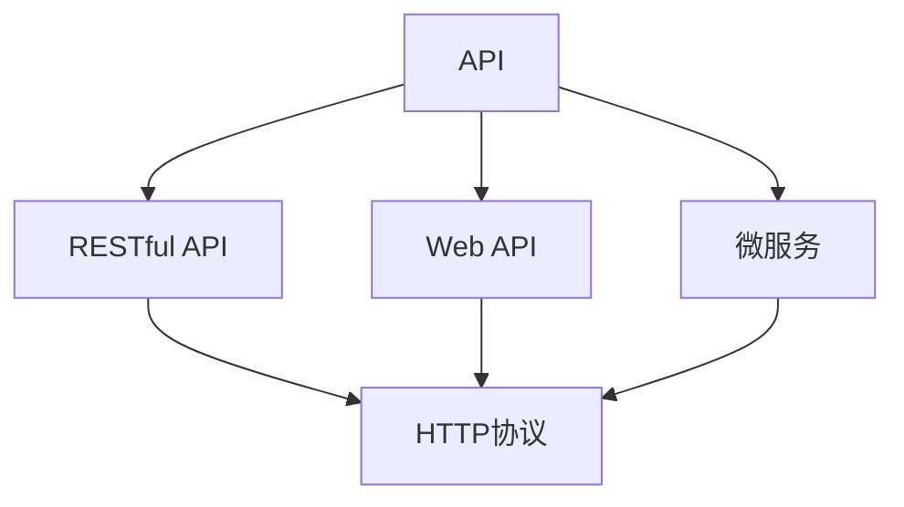

                 

## 1. 背景介绍

在当今数字化的时代，调用外部 API（Application Programming Interface）成为了连接不同系统和服务的桥梁。无论是 Web 开发、移动应用开发还是企业内部的系统集成，API 的调用无处不在。随着云计算和微服务的普及，API 作为服务之间交互的接口，其重要性日益凸显。本文将深入探讨调用外部 API 的重要性，包括其基本概念、应用场景、优缺点以及未来趋势。

## 2. 核心概念与联系

### 2.1 核心概念概述

调用外部 API 指的是在程序中通过网络请求访问其他系统的接口，获取数据或执行特定操作的过程。API 通常由服务提供者发布，使用者可以通过网络调用 API 来获取所需的服务和数据。以下是几个核心概念及其相互联系：

- **API (Application Programming Interface)**：API 是一组定义了服务端和客户端之间通信协议的规则和接口。它规定了客户端如何通过网络请求访问服务端资源，以及服务端如何响应这些请求。
- **RESTful API**：REST（Representational State Transfer）是一种架构风格，通过 HTTP 请求获取或提交资源。RESTful API 通常使用 HTTP 协议，支持 CRUD（Create, Read, Update, Delete）操作。
- **Web API**：Web API 指的是在 Web 应用中使用的 API，通常通过浏览器或 Web 应用程序发送 HTTP 请求，获取服务端提供的资源。
- **微服务**：微服务是一种将应用程序拆分成多个小型服务的方法，每个服务独立运行，并通过 API 进行通信。

这些概念构成了 API 调用的基础框架，使得不同系统和服务能够高效、可靠地交互。

### 2.2 概念间的关系

我们可以通过一个简单的 Mermaid 流程图来展示这些核心概念之间的关系：



这个流程图展示了 API 调用的几个主要组成部分及其相互关系：

- **API** 是所有 API 调用的基础，包括 RESTful API、Web API 和微服务等。
- **RESTful API** 和 **Web API** 是 API 的具体实现方式，使用 HTTP 协议进行通信。
- **微服务** 是一种基于 API 的应用架构模式，通过 API 实现服务的独立部署和通信。

这些概念共同构成了 API 调用的生态系统，使得服务端和客户端能够通过网络进行高效的数据交换和功能调用。

## 3. 核心算法原理 & 具体操作步骤

### 3.1 算法原理概述

调用外部 API 的核心算法原理基于 HTTP 协议，通过网络请求和响应机制实现数据的传输和处理。通常，API 调用的过程包括以下几个步骤：

1. **客户端发送请求**：客户端通过 HTTP 协议发送请求，包括请求方法、请求 URL、请求头、请求体等信息。
2. **服务器接收请求**：服务器接收到客户端的请求后，根据请求的 URL 和 HTTP 方法执行相应的操作，如查询数据库、处理业务逻辑等。
3. **服务器发送响应**：服务器将处理结果转换为 HTTP 响应，包含响应状态码、响应头、响应体等信息。
4. **客户端接收响应**：客户端接收到服务器的响应后，解析响应内容，根据需要进行进一步处理或展示给用户。

### 3.2 算法步骤详解

以下是一个详细的调用外部 API 的算法步骤详解：

**Step 1: 确定 API 接口**

首先需要确定需要调用的 API 接口，包括接口的 URL、请求方法、请求参数等信息。这些信息通常可以在 API 文档或开发者文档中找到。

**Step 2: 发送 HTTP 请求**

客户端根据确定的 API 接口信息，使用 HTTP 协议发送请求。常用的请求方法包括 GET、POST、PUT、DELETE 等。请求体中通常包含需要传递的数据。

**Step 3: 处理服务器响应**

服务器接收到请求后，根据请求执行相应的操作，生成响应。响应通常包含 HTTP 状态码、响应头和响应体。客户端需要根据响应状态码判断请求是否成功，并解析响应体中的数据。

**Step 4: 处理结果**

根据响应内容，客户端进行进一步的处理，如显示给用户、保存到数据库等。如果请求成功，可以根据响应体中的数据进行后续操作；如果请求失败，则需要根据错误信息进行处理。

### 3.3 算法优缺点

调用外部 API 具有以下优点：

1. **灵活性高**：API 调用可以轻松实现不同系统和服务之间的通信，使得开发更加灵活和高效。
2. **扩展性强**：API 调用的方式使得系统可以方便地扩展新功能，只需添加新的 API 接口即可。
3. **降低开发成本**：通过 API 调用，可以减少重复开发，提高开发效率。

然而，调用外部 API 也存在一些缺点：

1. **依赖性强**：API 调用需要依赖第三方服务，服务中断或错误会影响应用。
2. **性能问题**：API 调用通常需要通过网络传输数据，可能导致延迟和带宽问题。
3. **安全性风险**：API 调用涉及数据传输，可能存在数据泄露和攻击风险。

### 3.4 算法应用领域

调用外部 API 的应用领域非常广泛，包括但不限于以下几种：

- **Web 开发**：通过 API 调用获取天气信息、股票数据、地图数据等，实现网站功能。
- **移动应用开发**：通过 API 调用实现地图导航、支付功能、社交网络等。
- **企业内部系统集成**：通过 API 调用实现不同部门之间的数据共享和业务协同。
- **第三方服务集成**：通过 API 调用实现多种第三方服务的集成，如支付、邮件、云存储等。

## 4. 数学模型和公式 & 详细讲解

### 4.1 数学模型构建

调用外部 API 的数学模型构建基于 HTTP 协议的请求和响应机制。假设客户端需要调用一个 RESTful API，获取某个资源的数据，其请求 URL 为 `https://api.example.com/resource`，请求方法为 GET。

**请求模型**：

$$
R = (method, url, headers, body)
$$

其中，$method$ 表示请求方法，如 GET、POST 等；$url$ 表示请求 URL；$headers$ 表示请求头，包含认证信息、Content-Type 等信息；$body$ 表示请求体，包含需要传递的数据。

**响应模型**：

$$
S = (status_code, headers, body)
$$

其中，$status_code$ 表示 HTTP 状态码，如 200（成功）、404（未找到）、500（服务器错误）等；$headers$ 表示响应头，包含 Content-Type、Content-Length 等信息；$body$ 表示响应体，包含 API 返回的数据。

### 4.2 公式推导过程

以下是一个简单的 API 调用示例，使用 Python 的 `requests` 库：

```python
import requests

url = 'https://api.example.com/resource'
headers = {'Content-Type': 'application/json'}
params = {'param1': 'value1', 'param2': 'value2'}
response = requests.get(url, headers=headers, params=params)

if response.status_code == 200:
    data = response.json()
    # 处理返回数据
else:
    # 处理请求失败的情况
```

在这个示例中，我们首先定义了 API 的 URL、请求头和请求参数，然后使用 `requests` 库发送 GET 请求。最后，根据响应状态码判断请求是否成功，并解析响应体中的数据。

### 4.3 案例分析与讲解

假设我们正在开发一个天气查询应用，需要调用某个气象服务的 API 获取实时天气数据。这个 API 的请求 URL 为 `https://api.weather.com/data`，请求方法为 GET，请求参数包括城市名和日期。

```python
import requests

url = 'https://api.weather.com/data'
headers = {'Content-Type': 'application/json'}
params = {'city': 'Beijing', 'date': 'today'}
response = requests.get(url, headers=headers, params=params)

if response.status_code == 200:
    data = response.json()
    # 处理返回数据，展示天气信息
else:
    # 处理请求失败的情况，提示用户重新输入
```

在这个案例中，我们通过调用外部 API 获取了北京的实时天气数据，并将其展示给用户。API 调用的过程简单高效，极大地降低了开发成本和复杂度。

## 5. 项目实践：代码实例和详细解释说明

### 5.1 开发环境搭建

要进行 API 调用，首先需要搭建开发环境。以下是搭建 Python 开发环境的步骤：

1. **安装 Python**：从官网下载并安装最新版本的 Python。
2. **安装虚拟环境**：使用 `virtualenv` 或 `conda` 创建虚拟环境。
3. **安装依赖库**：安装必要的依赖库，如 `requests`、`urllib` 等。

### 5.2 源代码详细实现

以下是一个调用外部 API 的完整示例代码：

```python
import requests
import json

def get_weather_data(city):
    url = 'https://api.weather.com/data'
    headers = {'Content-Type': 'application/json'}
    params = {'city': city, 'date': 'today'}
    response = requests.get(url, headers=headers, params=params)

    if response.status_code == 200:
        data = response.json()
        return data
    else:
        print('Failed to get weather data.')
        return None

# 调用函数获取北京天气数据
weather_data = get_weather_data('Beijing')

if weather_data:
    # 解析返回数据，展示天气信息
    temperature = weather_data['temperature']
    humidity = weather_data['humidity']
    print(f'Temperature: {temperature}, Humidity: {humidity}')
else:
    print('Weather data not available.')
```

在这个示例中，我们定义了一个 `get_weather_data` 函数，用于调用天气查询 API，获取指定城市的实时天气数据。函数首先构建请求，发送 GET 请求，并根据响应状态码判断请求是否成功。如果成功，解析响应体中的数据，并返回温度和湿度等信息。如果失败，则输出错误信息。

### 5.3 代码解读与分析

在代码中，我们使用了 Python 的 `requests` 库来发送 HTTP 请求。`requests` 库提供了一个简单易用的接口，使得 API 调用变得更加高效和易于实现。

函数中的 `headers` 参数用于设置请求头，包含 Content-Type 等信息，确保请求被服务器正确解析。`params` 参数用于传递请求参数，包含城市名和日期等信息。

在处理响应时，我们首先检查响应状态码，判断请求是否成功。如果成功，使用 `response.json()` 方法将响应体解析为 JSON 格式的数据，并返回温度和湿度等信息。如果失败，输出错误信息。

### 5.4 运行结果展示

假设 API 返回的数据为：

```json
{
    "temperature": 25,
    "humidity": 60
}
```

运行代码后，输出结果为：

```
Temperature: 25, Humidity: 60
```

这表示北京的实时温度为 25°C，湿度为 60%。

## 6. 实际应用场景

### 6.1 智能推荐系统

智能推荐系统通过调用外部 API 获取用户行为数据、商品信息等，进行数据分析和处理，最终推荐符合用户兴趣的商品或内容。API 调用使得系统能够快速获取实时数据，实现精准推荐。

### 6.2 金融数据服务

金融数据服务通过调用外部 API，获取市场行情、交易数据、汇率等信息，实现数据展示、分析和交易决策。API 调用使得系统能够实时获取最新的金融数据，提高决策效率和准确性。

### 6.3 物联网应用

物联网应用通过调用外部 API，实现设备之间的数据传输和控制。API 调用使得系统能够快速获取设备状态和数据，进行远程控制和监控，提升设备的智能化水平。

## 7. 工具和资源推荐

### 7.1 学习资源推荐

- **《RESTful Web 服务架构》**：这是一本关于 RESTful 架构风格的经典书籍，详细介绍了 RESTful API 的设计和实现。
- **《API 设计指南》**：这是一本关于 API 设计和开发的最佳实践指南，涵盖 API 设计、文档编写、安全等方面。
- **《HTTP/2 基础》**：这是一本关于 HTTP/2 协议的入门书籍，帮助开发者了解 HTTP/2 的基本原理和应用场景。

### 7.2 开发工具推荐

- **Postman**：这是一个流行的 API 调试工具，提供了丰富的功能，如请求发送、响应解析、断点调试等。
- **Swagger**：这是一个 API 文档自动生成工具，帮助开发者生成 API 文档，方便其他开发者调用。
- **Fiddler**：这是一个网络调试代理工具，可以捕获和分析网络流量，帮助开发者调试 API 调用。

### 7.3 相关论文推荐

- **《RESTful 设计指南》**：这是一篇关于 RESTful 架构风格的设计指南，介绍了 RESTful API 的设计原则和最佳实践。
- **《API 设计和开发》**：这是一篇关于 API 设计和开发的综述论文，涵盖了 API 设计的各个方面，如 API 安全性、性能优化等。
- **《API 调用安全性》**：这是一篇关于 API 调用安全性的研究论文，介绍了常见 API 攻击手段和防护措施。

## 8. 总结：未来发展趋势与挑战

### 8.1 研究成果总结

本文对调用外部 API 的重要性进行了全面探讨，从基本概念到应用场景，详细讲解了 API 调用的原理和实现步骤。通过代码实例和案例分析，展示了 API 调用的高效性和灵活性。通过学习资源和工具推荐，为开发者提供了丰富的学习材料和实践工具。

### 8.2 未来发展趋势

未来，API 调用将继续在数字化应用中发挥重要作用。以下是几个可能的趋势：

1. **API 安全性的提升**：随着 API 调用场景的增多，API 安全性将变得更加重要。未来的 API 设计将更加注重安全性，包括认证、授权、加密等方面。
2. **API 性能的优化**：API 调用需要经过网络传输，性能问题将是一个重要的研究方向。未来的 API 设计将更加注重性能优化，如使用缓存、压缩、CDN 等技术。
3. **API 的自动化管理**：随着 API 数量的增加，API 的管理和维护将变得更加复杂。未来的 API 管理将更加自动化，通过 API 网关、API 编排等技术，实现统一管理和维护。
4. **API 的微服务化**：微服务架构的普及，将使得 API 调用更加灵活和高效。未来的 API 设计将更加注重微服务化，实现服务的独立部署和通信。

### 8.3 面临的挑战

尽管 API 调用在数字化应用中具有重要地位，但仍面临一些挑战：

1. **API 的安全性问题**：API 调用涉及数据传输，存在数据泄露和攻击的风险。如何提升 API 的安全性，保障数据安全，是未来的一个重大挑战。
2. **API 的性能问题**：API 调用需要通过网络传输数据，可能导致延迟和带宽问题。如何提升 API 的性能，优化数据传输过程，是未来的一个重要研究方向。
3. **API 的复杂性问题**：随着 API 数量的增加，API 的复杂性将变得更加突出。如何简化 API 的设计和调用过程，降低复杂性，是未来的一个挑战。
4. **API 的互操作性问题**：不同的 API 服务商提供的 API 接口可能存在兼容性问题，如何实现 API 的互操作性，确保 API 调用的一致性和可靠性，是未来的一个重要研究方向。

### 8.4 研究展望

未来的 API 调用技术将继续在数字化应用中发挥重要作用。为了应对挑战，提升 API 调用技术，需要从以下几个方面进行研究：

1. **API 安全性研究**：提升 API 的安全性，保障数据安全和隐私保护。通过加密、认证、授权等技术，增强 API 调用的安全性。
2. **API 性能优化研究**：优化 API 的性能，提升 API 调用的响应速度和效率。通过缓存、压缩、CDN 等技术，减少数据传输的延迟和带宽消耗。
3. **API 微服务化研究**：推动 API 的微服务化，实现服务的独立部署和通信。通过 API 网关、API 编排等技术，实现 API 的统一管理和维护。
4. **API 标准化研究**：推动 API 的标准化，确保 API 调用的互操作性和一致性。通过 API 规范、API 协议等技术，实现 API 调用的标准化。

## 9. 附录：常见问题与解答

**Q1: API 调用的基本流程是什么？**

A: API 调用的基本流程包括确定 API 接口、发送 HTTP 请求、处理服务器响应和处理结果。具体流程如下：

1. 确定 API 接口：确定需要调用的 API 接口，包括请求 URL、请求方法、请求头、请求体等信息。
2. 发送 HTTP 请求：客户端使用 HTTP 协议发送请求，包含请求方法、请求 URL、请求头、请求体等信息。
3. 处理服务器响应：服务器接收到请求后，根据请求执行相应的操作，生成响应。客户端需要根据响应状态码判断请求是否成功，并解析响应体中的数据。
4. 处理结果：根据响应内容，客户端进行进一步的处理，如显示给用户、保存到数据库等。

**Q2: 如何提高 API 调用的安全性？**

A: 提高 API 调用的安全性，需要从以下几个方面进行改进：

1. 使用 HTTPS：使用 HTTPS 协议进行 API 调用，确保数据传输的安全性。
2. 使用认证和授权：通过认证和授权机制，确保只有授权用户才能调用 API。常见的认证方式包括 OAuth、API Key、JWT 等。
3. 使用数据加密：对敏感数据进行加密，防止数据泄露。常见的加密方式包括 SSL、AES 等。
4. 使用 API 网关：通过 API 网关进行统一管理和调用，增强 API 的安全性和可控性。常见的 API 网关包括 Kong、Swagger 等。

**Q3: 如何优化 API 调用的性能？**

A: 优化 API 调用的性能，需要从以下几个方面进行改进：

1. 使用缓存：对常用的数据进行缓存，减少 API 调用的延迟和带宽消耗。常见的缓存技术包括 Redis、Memcached 等。
2. 使用压缩：对数据进行压缩，减少数据传输的带宽消耗。常见的压缩技术包括 GZIP、Deflate 等。
3. 使用 CDN：通过 CDN 进行数据缓存和加速，减少数据传输的延迟和带宽消耗。常见的 CDN 包括 Akamai、Cloudflare 等。
4. 使用负载均衡：通过负载均衡技术，将请求分配到多个服务器进行处理，提升 API 调用的吞吐量和性能。

通过这些技术手段，可以显著提升 API 调用的性能，确保系统的高效和稳定运行。

