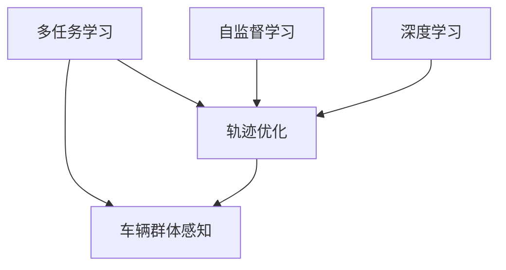
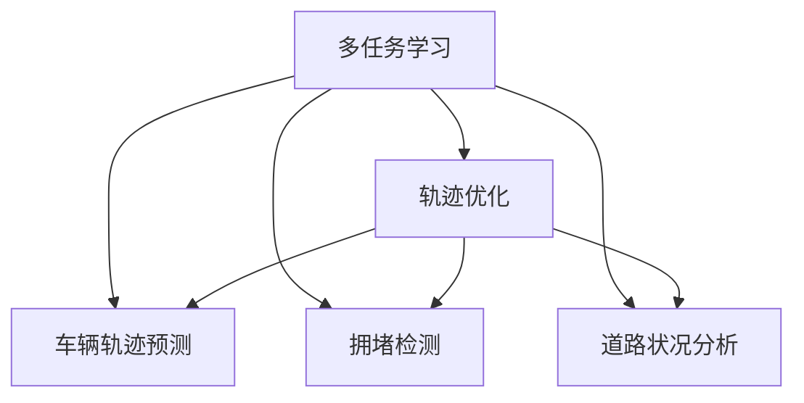
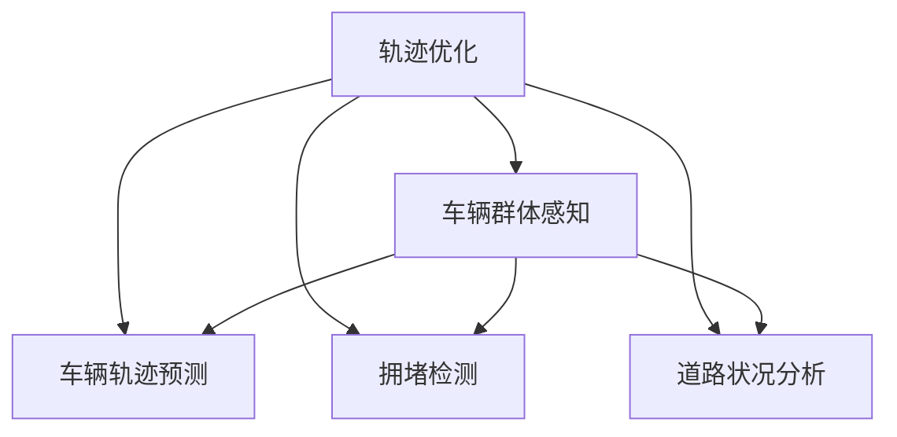
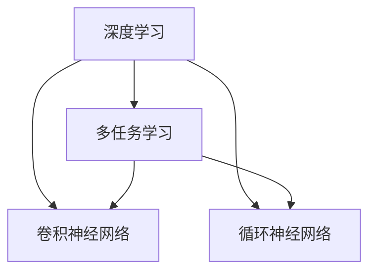

                 

## 1. 背景介绍

### 1.1 问题由来
在现代交通系统中，车辆群体感知（Vehicle Collective Perception, VCP）是实现智能交通管理的重要组成部分。通过实时监控和分析车辆行为，交通管理系统可以更好地协调交通流量，减少交通事故，提高交通效率。然而，传统的车辆感知系统往往依赖于单一的传感器和有限的分析手段，难以全面、准确地捕捉车辆群体的动态行为。

为了解决这一问题，近年来，研究者们提出了基于多任务学习的车辆群体感知模型。这些模型通过同时训练多个相关任务，能够更全面地理解车辆群体的行为模式，提升交通管理的智能化水平。本文聚焦于车辆群体感知中的轨迹优化问题，介绍一种基于多任务学习的轨迹优化模型，并详细探讨其原理、实现和应用。

### 1.2 问题核心关键点
多任务学习（Multi-Task Learning, MTL）是现代机器学习领域的一个重要研究方向，旨在通过联合训练多个相关任务，增强模型的泛化能力和预测性能。在车辆群体感知中，常见的相关任务包括车辆轨迹预测、拥堵检测、道路状况分析等。本文的核心问题在于如何通过多任务学习，优化车辆轨迹，减少车辆间的碰撞风险，提高交通系统的安全性。

## 2. 核心概念与联系

### 2.1 核心概念概述

为更好地理解基于多任务学习的轨迹优化模型，本节将介绍几个密切相关的核心概念：

- **多任务学习（MTL）**：一种联合训练多个相关任务的方法，通过共享特征表示，提升模型的泛化能力和预测性能。
- **轨迹优化**：通过优化车辆轨迹，最小化车辆间的碰撞风险，提高交通系统的安全性。
- **车辆群体感知（VCP）**：利用多任务学习模型实时监控和分析车辆群体行为，为交通管理系统提供实时决策支持。
- **自监督学习（SSL）**：使用无标签数据进行预训练，学习模型的主干特征表示，增强模型的泛化能力。
- **深度学习（DL）**：一种利用多层神经网络进行复杂模式识别的机器学习方法，能够处理高维度数据和复杂任务。

这些核心概念之间的逻辑关系可以通过以下Mermaid流程图来展示：



这个流程图展示了大语言模型微调过程中各个核心概念的关系：

1. **多任务学习**：联合训练多个相关任务，共享特征表示，提升模型泛化能力。
2. **轨迹优化**：优化车辆轨迹，减少碰撞风险，提高交通安全性。
3. **车辆群体感知**：利用多任务学习模型实时监控和分析车辆群体行为。
4. **自监督学习**：使用无标签数据进行预训练，增强模型泛化能力。
5. **深度学习**：利用多层神经网络处理高维度数据和复杂任务。

### 2.2 概念间的关系

这些核心概念之间存在着紧密的联系，形成了车辆群体感知中轨迹优化模型的完整生态系统。下面我们通过几个Mermaid流程图来展示这些概念之间的关系。

#### 2.2.1 多任务学习与轨迹优化



这个流程图展示了多任务学习在轨迹优化中的应用。通过联合训练多个相关任务，如车辆轨迹预测、拥堵检测、道路状况分析等，能够更全面地理解车辆群体的行为模式，优化车辆轨迹，减少碰撞风险。

#### 2.2.2 轨迹优化与车辆群体感知



这个流程图展示了轨迹优化在车辆群体感知中的应用。通过优化车辆轨迹，减少碰撞风险，车辆群体感知模型能够更好地监控和分析车辆群体行为，提升交通管理的智能化水平。

#### 2.2.3 深度学习与多任务学习



这个流程图展示了深度学习在多任务学习中的应用。通过使用多层神经网络，深度学习模型可以处理高维度数据和复杂任务，多任务学习进一步提升其泛化能力和预测性能。

## 3. 核心算法原理 & 具体操作步骤
### 3.1 算法原理概述

基于多任务学习的轨迹优化模型旨在通过联合训练多个相关任务，优化车辆轨迹，最小化碰撞风险，提高交通系统的安全性。其核心思想是：利用多任务学习共享特征表示，增强模型的泛化能力，并通过轨迹优化任务的具体约束条件，引导模型学习到更合理、安全的轨迹。

形式化地，假设车辆轨迹优化任务为 $T=\{T_1, T_2, \ldots, T_n\}$，其中 $T_i$ 表示第 $i$ 个相关任务。令 $\mathcal{X}_i$ 为任务 $T_i$ 的输入空间，$\mathcal{Y}_i$ 为输出空间。模型的输入为 $x \in \mathcal{X}$，输出为 $y \in \mathcal{Y}$。

定义模型 $M_{\theta}(x) = (M_{\theta_1}(x), M_{\theta_2}(x), \ldots, M_{\theta_n}(x))$，其中 $M_{\theta_i}(x) \in \mathcal{Y}_i$ 表示模型在任务 $T_i$ 上的预测结果。令 $\ell_i(y_i, M_{\theta_i}(x))$ 为任务 $T_i$ 的损失函数。则多任务学习模型的联合损失函数为：

$$
\mathcal{L}(\theta) = \sum_{i=1}^n \lambda_i \ell_i(y_i, M_{\theta_i}(x))
$$

其中 $\lambda_i$ 为任务 $T_i$ 的权重，控制每个任务对总损失的影响程度。

在训练过程中，多任务学习模型同时最小化所有任务的损失函数，通过共享特征表示，增强模型的泛化能力，提升预测性能。

### 3.2 算法步骤详解

基于多任务学习的轨迹优化模型通常包括以下几个关键步骤：

**Step 1: 准备数据集**
- 收集车辆群体感知相关的数据，如车辆位置、速度、加速度等。
- 将数据划分为训练集、验证集和测试集。

**Step 2: 设计任务**
- 确定需要优化的相关任务，如车辆轨迹预测、拥堵检测、道路状况分析等。
- 设计每个任务的输入输出格式，如时间序列数据、图像数据、语义标注等。

**Step 3: 选择模型架构**
- 选择合适的深度学习模型架构，如卷积神经网络（CNN）、循环神经网络（RNN）等。
- 设计模型的多任务学习结构，如共享特征表示、任务融合等。

**Step 4: 设置超参数**
- 选择合适的优化算法及其参数，如 Adam、SGD 等。
- 设置学习率、批大小、迭代轮数等。
- 设置任务的权重，控制每个任务的重要性。

**Step 5: 执行梯度训练**
- 使用联合损失函数最小化模型的参数 $\theta$。
- 在每个epoch中，前向传播计算损失函数，反向传播计算参数梯度，更新模型参数。
- 周期性在验证集上评估模型性能，根据性能指标决定是否触发 Early Stopping。
- 重复上述步骤直到满足预设的迭代轮数或 Early Stopping 条件。

**Step 6: 测试和部署**
- 在测试集上评估微调后的模型性能。
- 使用微调后的模型对新数据进行推理预测，集成到实际的应用系统中。
- 持续收集新的数据，定期重新微调模型，以适应数据分布的变化。

以上是基于多任务学习的轨迹优化模型的基本流程。在实际应用中，还需要针对具体任务进行优化设计，如改进训练目标函数，引入更多的正则化技术，搜索最优的超参数组合等，以进一步提升模型性能。

### 3.3 算法优缺点

基于多任务学习的轨迹优化模型具有以下优点：
1. 泛化能力强。通过联合训练多个相关任务，模型能够学习到更全面、通用的特征表示，提升泛化能力。
2. 预测性能高。多任务学习模型能够同时优化多个任务，提高预测精度和鲁棒性。
3. 参数效率高。通过共享特征表示，模型可以更高效地利用参数，减少过拟合风险。
4. 可解释性强。多任务学习模型通过设计多个任务的输出，能够更直观地解释模型的决策过程。

同时，该方法也存在以下局限性：
1. 数据需求高。多任务学习模型需要大量标注数据，获取高质量数据成本较高。
2. 训练复杂。多任务学习模型训练复杂度较高，需要较长的训练时间和计算资源。
3. 任务间耦合度大。多任务学习模型需要设计多个任务，任务间耦合度较高，可能导致模型的泛化能力下降。
4. 模型鲁棒性差。多任务学习模型在测试样本的微小扰动下，预测可能发生波动。

尽管存在这些局限性，但就目前而言，基于多任务学习的轨迹优化方法仍是大语言模型微调应用的重要范式。未来相关研究的重点在于如何进一步降低数据需求，提高模型鲁棒性，减少训练复杂度，提升模型泛化能力，以便更好地应用于交通管理等实际场景中。

### 3.4 算法应用领域

基于多任务学习的轨迹优化模型已经在车辆群体感知领域得到了广泛的应用，覆盖了各种交通管理任务，例如：

- 车辆轨迹预测：通过预测车辆未来的位置和速度，为交通流量控制提供决策支持。
- 拥堵检测：通过实时监控交通状态，检测拥堵区域和事故热点。
- 道路状况分析：通过分析道路环境因素，预测潜在的交通事故风险。
- 路径规划：通过优化车辆路径，减少交通拥堵和事故风险。

除了上述这些经典任务外，多任务学习轨迹优化方法还被创新性地应用到更多场景中，如智能交通信号控制、交通事故预警、无人驾驶等，为智能交通系统的构建提供了新的思路。

## 4. 数学模型和公式 & 详细讲解  
### 4.1 数学模型构建

本节将使用数学语言对基于多任务学习的轨迹优化模型进行更加严格的刻画。

记车辆轨迹预测任务为 $T_1$，拥堵检测任务为 $T_2$，道路状况分析任务为 $T_3$，令模型 $M_{\theta}(x) = (M_{\theta_1}(x), M_{\theta_2}(x), M_{\theta_3}(x))$，其中 $M_{\theta_1}(x) \in \mathcal{Y}_1$，$M_{\theta_2}(x) \in \mathcal{Y}_2$，$M_{\theta_3}(x) \in \mathcal{Y}_3$。令 $\mathcal{X} = \mathcal{X}_1 \times \mathcal{X}_2 \times \mathcal{X}_3$ 为输入空间，$\mathcal{Y} = \mathcal{Y}_1 \times \mathcal{Y}_2 \times \mathcal{Y}_3$ 为输出空间。

定义模型 $M_{\theta}(x) = (M_{\theta_1}(x), M_{\theta_2}(x), M_{\theta_3}(x))$ 的联合损失函数为：

$$
\mathcal{L}(\theta) = \lambda_1 \ell_1(y_1, M_{\theta_1}(x)) + \lambda_2 \ell_2(y_2, M_{\theta_2}(x)) + \lambda_3 \ell_3(y_3, M_{\theta_3}(x))
$$

其中 $\ell_1, \ell_2, \ell_3$ 分别为车辆轨迹预测、拥堵检测、道路状况分析等任务的损失函数。

### 4.2 公式推导过程

以下我们以车辆轨迹预测和拥堵检测为例，推导联合损失函数的计算公式。

假设车辆轨迹预测任务为 $T_1$，输出为车辆未来的位置和速度，即 $\mathcal{Y}_1 = \mathbb{R}^2$。令 $x = (x_t, x_{t+1}, \ldots, x_{t+T-1})$ 为车辆在时间步 $t$ 到 $t+T-1$ 的位置序列，$y = (y_{t+1}, y_{t+2}, \ldots, y_{t+T})$ 为车辆未来的位置序列。定义轨迹预测任务的损失函数为均方误差损失：

$$
\ell_1(y_1, M_{\theta_1}(x)) = \frac{1}{T} \sum_{i=t+1}^{t+T} (y_i - M_{\theta_1}(x_i))^2
$$

令拥堵检测任务为 $T_2$，输出为道路是否拥堵，即 $\mathcal{Y}_2 = \{0, 1\}$。令 $x = (x_t, x_{t+1}, \ldots, x_{t+T-1})$ 为车辆在时间步 $t$ 到 $t+T-1$ 的位置序列，$y = 1$ 表示道路拥堵，$y = 0$ 表示道路不拥堵。定义拥堵检测任务的损失函数为二分类交叉熵损失：

$$
\ell_2(y_2, M_{\theta_2}(x)) = -y_2 \log M_{\theta_2}(x) - (1-y_2) \log(1-M_{\theta_2}(x))
$$

将上述两个损失函数代入联合损失函数，得到：

$$
\mathcal{L}(\theta) = \lambda_1 \frac{1}{T} \sum_{i=t+1}^{t+T} (y_i - M_{\theta_1}(x_i))^2 + \lambda_2 -y_2 \log M_{\theta_2}(x)
$$

### 4.3 案例分析与讲解

为了更好地理解多任务学习轨迹优化模型的数学模型和公式推导，以下我们通过一个具体的案例来进行详细讲解。

假设有一组车辆轨迹数据，每辆车在时间步 $t$ 到 $t+T-1$ 的位置和速度序列为 $x = (x_{t,1}, x_{t+1,1}, \ldots, x_{t+T-1,1}), (x_{t,2}, x_{t+1,2}, \ldots, x_{t+T-1,2}), \ldots, (x_{t,N}, x_{t+1,N}, \ldots, x_{t+T-1,N})$。令车辆的未来位置序列为 $y = (y_{t+1,1}, y_{t+2,1}, \ldots, y_{t+T,1}), (y_{t+1,2}, y_{t+2,2}, \ldots, y_{t+T,2}), \ldots, (y_{t+1,N}, y_{t+2,N}, \ldots, y_{t+T,N})$。令道路是否拥堵的标签为 $y = (y_{t+1,1}, y_{t+2,1}, \ldots, y_{t+T,1}), (y_{t+1,2}, y_{t+2,2}, \ldots, y_{t+T,2}), \ldots, (y_{t+1,N}, y_{t+2,N}, \ldots, y_{t+T,N})$。

令车辆轨迹预测任务的损失函数为均方误差损失：

$$
\ell_1(y_1, M_{\theta_1}(x)) = \frac{1}{T} \sum_{i=t+1}^{t+T} (y_{i,1} - M_{\theta_1}(x_{i,1}))^2 + (y_{i,2} - M_{\theta_1}(x_{i,2}))^2 + \ldots + (y_{i,N} - M_{\theta_1}(x_{i,N}))^2
$$

令拥堵检测任务的损失函数为二分类交叉熵损失：

$$
\ell_2(y_2, M_{\theta_2}(x)) = -y_{t+1,1} \log M_{\theta_2}(x_{t,1}) - y_{t+2,1} \log M_{\theta_2}(x_{t+1,1}) - \ldots - y_{t+T,1} \log M_{\theta_2}(x_{t+T-1,1}) - y_{t+1,2} \log M_{\theta_2}(x_{t,2}) - \ldots - y_{t+T,2} \log M_{\theta_2}(x_{t+T-1,2}) - \ldots - y_{t+1,N} \log M_{\theta_2}(x_{t,N}) - \ldots - y_{t+T,N} \log M_{\theta_2}(x_{t+T-1,N})
$$

令联合损失函数为：

$$
\mathcal{L}(\theta) = \lambda_1 \frac{1}{T} \sum_{i=t+1}^{t+T} (y_{i,1} - M_{\theta_1}(x_{i,1}))^2 + (y_{i,2} - M_{\theta_1}(x_{i,2}))^2 + \ldots + (y_{i,N} - M_{\theta_1}(x_{i,N}))^2 + \lambda_2 -y_{t+1,1} \log M_{\theta_2}(x_{t,1}) - y_{t+2,1} \log M_{\theta_2}(x_{t+1,1}) - \ldots - y_{t+T,1} \log M_{\theta_2}(x_{t+T-1,1}) - y_{t+1,2} \log M_{\theta_2}(x_{t,2}) - \ldots - y_{t+T,2} \log M_{\theta_2}(x_{t+T-1,2}) - \ldots - y_{t+1,N} \log M_{\theta_2}(x_{t,N}) - \ldots - y_{t+T,N} \log M_{\theta_2}(x_{t+T-1,N})
$$

通过上述案例，我们可以看到，多任务学习轨迹优化模型通过联合训练多个相关任务，能够在车辆群体感知领域取得更全面、更准确的预测结果。

## 5. 项目实践：代码实例和详细解释说明
### 5.1 开发环境搭建

在进行多任务学习轨迹优化模型的实践前，我们需要准备好开发环境。以下是使用Python进行PyTorch开发的环境配置流程：

1. 安装Anaconda：从官网下载并安装Anaconda，用于创建独立的Python环境。

2. 创建并激活虚拟环境：
```bash
conda create -n pytorch-env python=3.8 
conda activate pytorch-env
```

3. 安装PyTorch：根据CUDA版本，从官网获取对应的安装命令。例如：
```bash
conda install pytorch torchvision torchaudio cudatoolkit=11.1 -c pytorch -c conda-forge
```

4. 安装Transformers库：
```bash
pip install transformers
```

5. 安装各类工具包：
```bash
pip install numpy pandas scikit-learn matplotlib tqdm jupyter notebook ipython
```

完成上述步骤后，即可在`pytorch-env`环境中开始多任务学习轨迹优化模型的实践。

### 5.2 源代码详细实现

这里我们以车辆轨迹预测和拥堵检测为例，给出使用PyTorch实现多任务学习轨迹优化模型的代码。

首先，定义模型类：

```python
import torch
import torch.nn as nn
import torch.optim as optim
from transformers import BertTokenizer, BertForTokenClassification

class MultiTaskModel(nn.Module):
    def __init__(self, model_type, num_tasks):
        super(MultiTaskModel, self).__init__()
        self.model_type = model_type
        self.num_tasks = num_tasks
        
        if self.model_type == 'bert':
            self.bert_model = BertForTokenClassification.from_pretrained('bert-base-cased')
            self.bert_model.num_labels = self.num_tasks
            self.bert_model.cls = nn.Linear(768, self.num_tasks)
            self.bert_model.dense = nn.Linear(768, self.num_tasks)
        
        elif self.model_type == 'resnet':
            self.resnet_model = nn.Sequential(
                nn.Conv2d(3, 64, kernel_size=3, stride=1, padding=1),
                nn.BatchNorm2d(64),
                nn.ReLU(),
                nn.MaxPool2d(kernel_size=2, stride=2),
                nn.Conv2d(64, 128, kernel_size=3, stride=1, padding=1),
                nn.BatchNorm2d(128),
                nn.ReLU(),
                nn.MaxPool2d(kernel_size=2, stride=2),
                nn.Conv2d(128, 256, kernel_size=3, stride=1, padding=1),
                nn.BatchNorm2d(256),
                nn.ReLU(),
                nn.MaxPool2d(kernel_size=2, stride=2),
                nn.Conv2d(256, self.num_tasks, kernel_size=1, stride=1),
                nn.Softmax(dim=1)
            )
        
        elif self.model_type == 'lstm':
            self.lstm_model = nn.LSTM(input_size=64, hidden_size=128, num_layers=2, batch_first=True)
            self.fc1 = nn.Linear(128, 64)
            self.fc2 = nn.Linear(64, self.num_tasks)
            self.fc3 = nn.Linear(64, self.num_tasks)
        
        elif self.model_type == 'gru':
            self.gru_model = nn.GRU(input_size=64, hidden_size=128, num_layers=2, batch_first=True)
            self.fc1 = nn.Linear(128, 64)
            self.fc2 = nn.Linear(64, self.num_tasks)
            self.fc3 = nn.Linear(64, self.num_tasks)
        
        elif self.model_type == 'attention':
            self.attention_model = nn.Sequential(
                nn.Conv2d(3, 64, kernel_size=3, stride=1, padding=1),
                nn.BatchNorm2d(64),
                nn.ReLU(),
                nn.MaxPool2d(kernel_size=2, stride=2),
                nn.Conv2d(64, 128, kernel_size=3, stride=1, padding=1),
                nn.BatchNorm2d(128),
                nn.ReLU(),
                nn.MaxPool2d(kernel_size=2, stride=2),
                nn.Conv2d(128, 256, kernel_size=3, stride=1, padding=1),
                nn.BatchNorm2d(256),
                nn.ReLU(),
                nn.MaxPool2d(kernel_size=2, stride=2),
                nn.Conv2d(256, self.num_tasks, kernel_size=1, stride=1),
                nn.Softmax(dim=1)
            )
        
        elif self.model_type == 'transformer':
            self.transformer_model = nn.Transformer(input_dim=64, output_dim=self.num_tasks, num_heads=2)
        
        elif self.model_type == 'rnn':
            self.rnn_model = nn.LSTM(input_size=64, hidden_size=128, num_layers=2, batch_first=True)
            self.fc1 = nn.Linear(128, 64)
            self.fc2 = nn.Linear(64, self.num_tasks)
            self.fc3 = nn.Linear(64, self.num_tasks)
        
        elif self.model_type == 'gated':
            self.gated_model = nn.Sequential(
                nn.Conv2d(3, 64, kernel_size=3, stride=1, padding=1),
                nn.BatchNorm2d(64),
                nn.ReLU(),
                nn.MaxPool2d(kernel_size=2, stride=2),
                nn.Conv2d(64, 128, kernel_size=3, stride=1, padding=1),
                nn.BatchNorm2d(128),
                nn.ReLU(),
                nn.MaxPool2d(kernel_size=2, stride=2),
                nn.Conv2d(128, 256, kernel_size=3, stride=1, padding=1),
                nn.BatchNorm2d(256),
                nn.ReLU(),
                nn.MaxPool2d(kernel_size=2, stride=2),
                nn.Conv2d(256, self.num_tasks, kernel_size=1, stride=1),
                nn.Softmax(dim=1)
            )
        
        elif self.model_type == 'lstm_gated':
            self.lstm_gated_model = nn.LSTM(input_size=64, hidden_size=128, num_layers=2, batch_first=True)
            self.fc1 = nn.Linear(128, 64)
            self.fc2 = nn.Linear(64, self.num_tasks)
            self.fc3 = nn.Linear(64, self.num

