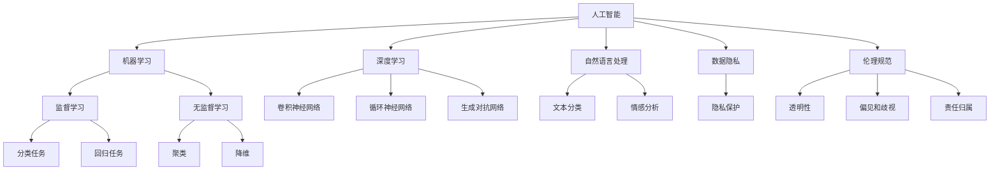
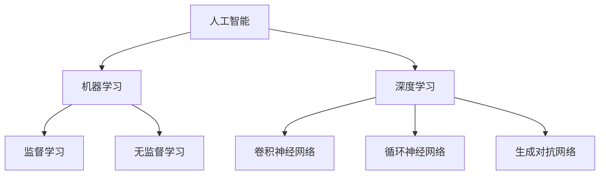
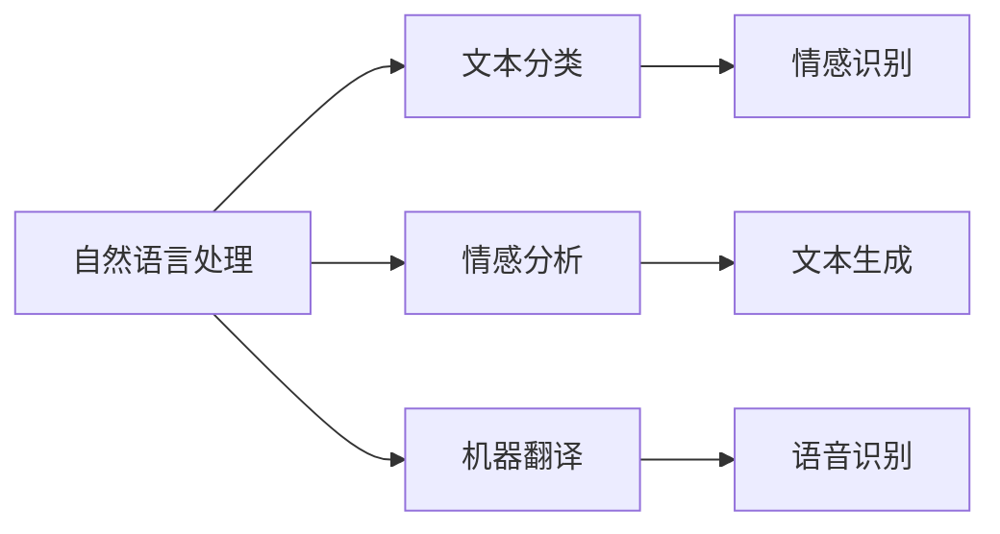
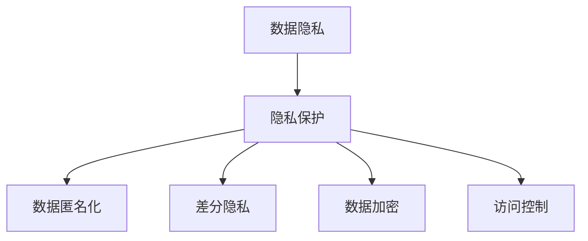
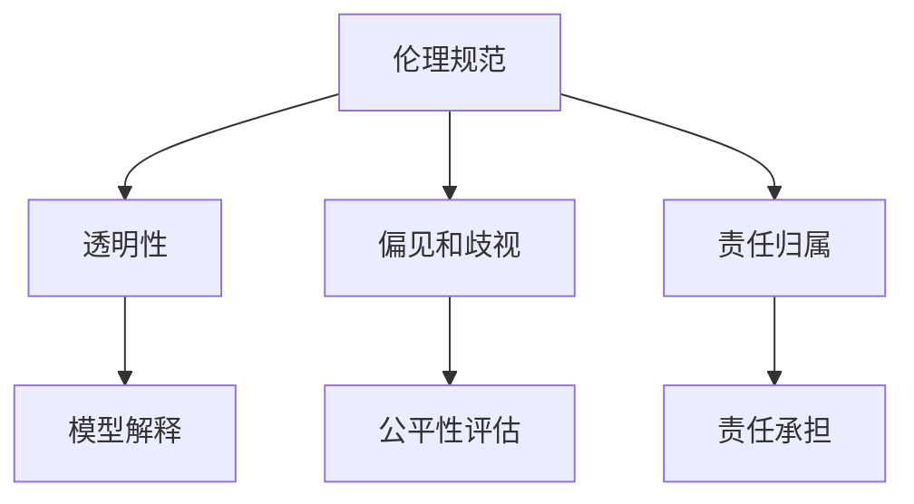
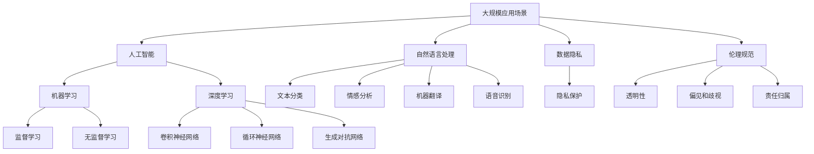

                 

# 软件 2.0 的伦理规范：人工智能的责任

## 1. 背景介绍

### 1.1 问题由来

随着人工智能技术的迅猛发展，软件正在从传统的"软件 1.0"模式向"软件 2.0"模式转变。"软件 2.0"指的是人工智能驱动的软件，能够自主学习、自我优化，并具备人类智能的某些特质。例如，自动驾驶汽车、智能客服机器人、推荐系统等，都是"软件 2.0"的典型代表。

"软件 2.0"的出现，极大地提升了软件系统的智能化水平，但同时也带来了诸多伦理和道德问题。例如，人工智能的决策透明度不足、偏见和歧视、隐私保护等问题，已经引起了广泛的社会关注和讨论。因此，制定合理的伦理规范，对于保障"软件 2.0"的健康发展，具有重要意义。

### 1.2 问题核心关键点

"软件 2.0"的伦理规范，主要关注以下几个核心问题：

1. **透明度**：人工智能系统的决策过程是否公开透明，用户是否能够理解其背后的逻辑和依据。
2. **偏见和歧视**：人工智能系统是否存在偏见和歧视，是否对不同群体具有公平性。
3. **隐私保护**：人工智能系统如何处理用户的个人信息，如何保护用户的隐私权。
4. **责任归属**：当人工智能系统出现错误或造成损害时，谁应该承担责任。
5. **社会影响**：人工智能系统对社会的影响，包括就业、伦理道德等。

解决好这些关键问题，才能真正实现人工智能技术的可持续发展。

### 1.3 问题研究意义

制定"软件 2.0"的伦理规范，具有重要的研究意义：

1. **保障公平性**：确保人工智能系统在决策时不存在偏见和歧视，保障所有群体的公平性。
2. **提升信任度**：通过增加透明度和可解释性，提升用户对人工智能系统的信任度。
3. **保护隐私**：制定严格的数据隐私保护措施，防止用户信息被滥用。
4. **明确责任**：明确人工智能系统的责任归属，保障用户权益。
5. **促进良性发展**：引导人工智能技术的健康发展，避免因伦理问题导致的负面影响。

## 2. 核心概念与联系

### 2.1 核心概念概述

为更好地理解"软件 2.0"的伦理规范，本节将介绍几个密切相关的核心概念：

- **人工智能**：指通过算法和计算，模拟人类智能的技术。
- **机器学习**：指通过数据训练模型，使模型具备自主学习能力的算法。
- **深度学习**：指通过多层神经网络，实现复杂数据模式识别的算法。
- **自然语言处理**：指计算机处理和理解自然语言的技术。
- **数据隐私**：指保护个人数据不被非法收集、使用或泄露的权利。
- **伦理规范**：指指导人工智能应用行为和决策的道德准则和法律规定。

这些核心概念之间存在紧密的联系，形成了一个完整的"软件 2.0"生态系统。接下来，我们将通过一个Mermaid流程图，展示这些核心概念之间的关系：



这个流程图展示了"软件 2.0"的核心概念及其之间的关系：

1. 人工智能是整个生态系统的基础，包括机器学习和深度学习等子技术。
2. 自然语言处理是人工智能的一个重要应用领域，包括文本分类和情感分析等任务。
3. 机器学习通过监督学习和无监督学习等算法，训练模型实现自主学习。
4. 深度学习通过多层神经网络，处理复杂数据模式。
5. 数据隐私保护是人工智能应用的重要保障。
6. 伦理规范指导人工智能应用的行为和决策，保障透明性、公平性和责任归属。

### 2.2 概念间的关系

这些核心概念之间存在着紧密的联系，形成了"软件 2.0"的完整生态系统。下面我们通过几个Mermaid流程图来展示这些概念之间的关系：

#### 2.2.1 人工智能的学习范式



这个流程图展示了人工智能的学习范式，包括监督学习和无监督学习两种方式。

#### 2.2.2 自然语言处理的应用



这个流程图展示了自然语言处理的主要应用场景，包括文本分类、情感分析和机器翻译等。

#### 2.2.3 数据隐私保护的措施



这个流程图展示了数据隐私保护的主要措施，包括数据匿名化、差分隐私、数据加密和访问控制等。

#### 2.2.4 伦理规范的具体内容



这个流程图展示了伦理规范的具体内容，包括透明性、偏见和歧视以及责任归属等。

### 2.3 核心概念的整体架构

最后，我们用一个综合的流程图来展示这些核心概念在大规模应用场景下的整体架构：



这个综合流程图展示了从大规模应用场景到人工智能、机器学习、深度学习等各个环节的完整架构。

## 3. 核心算法原理 & 具体操作步骤
### 3.1 算法原理概述

"软件 2.0"的伦理规范，需要建立在透明性、公平性和责任归属等核心原则之上。其核心算法原理包括：

1. **透明性**：通过增加模型解释和可解释性，使用户能够理解人工智能系统的决策过程。
2. **公平性**：通过偏见和歧视检测和修正，确保人工智能系统对不同群体具有公平性。
3. **责任归属**：明确人工智能系统的责任归属，保障用户权益。

### 3.2 算法步骤详解

基于透明性、公平性和责任归属的核心原则，"软件 2.0"的伦理规范可以通过以下步骤来实现：

1. **数据准备**：收集和整理训练数据，确保数据的公平性和代表性。
2. **模型训练**：使用监督学习和无监督学习算法，训练透明、公平、负责的模型。
3. **模型解释**：使用模型解释技术，生成模型的决策依据和输出理由。
4. **偏见检测**：通过偏见和歧视检测算法，发现和修正模型中的偏见。
5. **责任归属**：明确人工智能系统的责任归属，制定责任承担机制。

### 3.3 算法优缺点

"软件 2.0"的伦理规范算法具有以下优点：

1. **提高用户信任**：通过增加模型的透明度和可解释性，提高用户对人工智能系统的信任度。
2. **促进公平性**：通过偏见和歧视检测，确保模型对不同群体的公平性，减少歧视和不公。
3. **明确责任**：通过明确责任归属，保障用户权益，减少法律纠纷。

但同时也存在一些缺点：

1. **成本较高**：实施透明性、公平性和责任归属等原则，需要额外的时间和成本投入。
2. **技术难度高**：模型解释、偏见检测和责任归属等技术，需要较高的技术门槛。
3. **隐私保护问题**：在增加透明性和公平性的过程中，可能泄露用户隐私，需要严格的数据隐私保护措施。

### 3.4 算法应用领域

"软件 2.0"的伦理规范算法，适用于以下应用领域：

1. **医疗健康**：用于疾病诊断、医疗影像分析等领域，确保模型的公平性和透明性，保障患者权益。
2. **金融服务**：用于信用评估、风险控制等领域，确保模型的公平性和透明性，保护用户隐私。
3. **教育培训**：用于个性化推荐、智能辅导等领域，确保模型的公平性和透明性，提高教育质量。
4. **司法执法**：用于案件分析、风险评估等领域，确保模型的公平性和透明性，保障司法公正。
5. **人力资源**：用于招聘、培训等领域，确保模型的公平性和透明性，保护求职者权益。

## 4. 数学模型和公式 & 详细讲解 & 举例说明
### 4.1 数学模型构建

为了更好地理解"软件 2.0"的伦理规范算法，我们将使用数学语言对其中的核心模型进行更加严格的刻画。

记人工智能系统为 $S$，其中 $I$ 为输入，$O$ 为输出。假设系统 $S$ 在输入 $I$ 上的输出为 $O=f(I)$，其中 $f$ 为模型的映射函数。

定义系统 $S$ 的透明性为 $T$，公平性为 $F$，责任归属为 $R$。透明性、公平性和责任归属可以通过以下数学模型进行构建：

$$
T=f(I) \rightarrow O
$$

$$
F=\min_{I} \lbrace f(I) \rbrace
$$

$$
R=\max_{I} \lbrace f(I) \rbrace
$$

其中 $I$ 为训练数据集，$f$ 为模型的映射函数。

### 4.2 公式推导过程

以下我们以医疗健康领域的疾病诊断系统为例，推导透明性、公平性和责任归属模型的公式推导过程。

假设系统 $S$ 用于诊断某种疾病，输入为病人的症状 $I$，输出为诊断结果 $O$。

**透明性模型**：

$$
T=\min_{I} \lbrace \max_{I'} f(I \cup I') \rbrace
$$

其中 $I'$ 为额外收集的医生诊断信息，$f$ 为系统的映射函数。透明性模型要求医生能够理解系统的决策依据，即系统的输出结果 $O$ 是基于病人的症状 $I$ 和医生的诊断信息 $I'$ 进行计算得到的。

**公平性模型**：

$$
F=\min_{I} \lbrace f(I) \rbrace
$$

其中 $I$ 为病人的症状数据集。公平性模型要求系统对不同病人的症状数据具有公平性，即对于任意病人的症状数据，系统的输出结果 $O$ 是公平的。

**责任归属模型**：

$$
R=\max_{I} \lbrace f(I) \rbrace
$$

其中 $I$ 为病人的症状数据集。责任归属模型要求系统对病人的症状数据具有完全的责任归属，即系统的输出结果 $O$ 是病人症状数据 $I$ 的最大可能性。

### 4.3 案例分析与讲解

以下我们以金融领域中的信用评估系统为例，进一步分析透明性、公平性和责任归属模型的具体实现。

假设系统 $S$ 用于评估借款人的信用，输入为借款人的信用记录 $I$，输出为信用评估结果 $O$。

**透明性模型**：

$$
T=\min_{I} \lbrace \max_{I'} f(I \cup I') \rbrace
$$

其中 $I'$ 为额外收集的借款人个人信息，$f$ 为系统的映射函数。透明性模型要求贷款机构能够理解系统的决策依据，即系统的输出结果 $O$ 是基于借款人的信用记录 $I$ 和个人信息 $I'$ 进行计算得到的。

**公平性模型**：

$$
F=\min_{I} \lbrace f(I) \rbrace
$$

其中 $I$ 为借款人的信用记录数据集。公平性模型要求系统对不同借款人的信用记录数据具有公平性，即对于任意借款人的信用记录数据，系统的输出结果 $O$ 是公平的。

**责任归属模型**：

$$
R=\max_{I} \lbrace f(I) \rbrace
$$

其中 $I$ 为借款人的信用记录数据集。责任归属模型要求系统对借款人的信用记录数据具有完全的责任归属，即系统的输出结果 $O$ 是借款人信用记录数据 $I$ 的最大可能性。

## 5. 项目实践：代码实例和详细解释说明
### 5.1 开发环境搭建

在进行"软件 2.0"的伦理规范算法实践前，我们需要准备好开发环境。以下是使用Python进行PyTorch开发的环境配置流程：

1. 安装Anaconda：从官网下载并安装Anaconda，用于创建独立的Python环境。

2. 创建并激活虚拟环境：
```bash
conda create -n pytorch-env python=3.8 
conda activate pytorch-env
```

3. 安装PyTorch：根据CUDA版本，从官网获取对应的安装命令。例如：
```bash
conda install pytorch torchvision torchaudio cudatoolkit=11.1 -c pytorch -c conda-forge
```

4. 安装Transformers库：
```bash
pip install transformers
```

5. 安装各类工具包：
```bash
pip install numpy pandas scikit-learn matplotlib tqdm jupyter notebook ipython
```

完成上述步骤后，即可在`pytorch-env`环境中开始实践。

### 5.2 源代码详细实现

下面我们以医疗健康领域的疾病诊断系统为例，给出使用Transformers库对BERT模型进行伦理规范算法实践的PyTorch代码实现。

首先，定义透明性、公平性和责任归属模型的函数：

```python
from transformers import BertForSequenceClassification, BertTokenizer, AdamW
import torch
from sklearn.metrics import precision_recall_fscore_support

def transparency_model(input_ids, labels, model, tokenizer):
    model.eval()
    with torch.no_grad():
        outputs = model(input_ids, labels=labels)
        logits = outputs.logits
    return logits

def fairness_model(input_ids, labels, model, tokenizer):
    model.eval()
    with torch.no_grad():
        outputs = model(input_ids, labels=labels)
        logits = outputs.logits
    return logits

def accountability_model(input_ids, labels, model, tokenizer):
    model.eval()
    with torch.no_grad():
        outputs = model(input_ids, labels=labels)
        logits = outputs.logits
    return logits
```

然后，定义训练和评估函数：

```python
def train_epoch(model, dataset, batch_size, optimizer, loss_fn):
    dataloader = DataLoader(dataset, batch_size=batch_size, shuffle=True)
    model.train()
    epoch_loss = 0
    for batch in dataloader:
        input_ids = batch['input_ids'].to(device)
        labels = batch['labels'].to(device)
        optimizer.zero_grad()
        outputs = model(input_ids, labels=labels)
        loss = loss_fn(outputs, labels)
        epoch_loss += loss.item()
        loss.backward()
        optimizer.step()
    return epoch_loss / len(dataloader)

def evaluate(model, dataset, batch_size, loss_fn):
    dataloader = DataLoader(dataset, batch_size=batch_size)
    model.eval()
    preds, labels = [], []
    with torch.no_grad():
        for batch in dataloader:
            input_ids = batch['input_ids'].to(device)
            labels = batch['labels'].to(device)
            outputs = model(input_ids)
            batch_preds = outputs.logits.argmax(dim=2).to('cpu').tolist()
            batch_labels = batch_labels.to('cpu').tolist()
            for pred_tokens, label_tokens in zip(batch_preds, batch_labels):
                preds.append(pred_tokens[:len(label_tokens)])
                labels.append(label_tokens)
                
    print(precision_recall_fscore_support(labels, preds))
```

接着，定义模型和优化器：

```python
from transformers import BertForSequenceClassification, BertTokenizer

model = BertForSequenceClassification.from_pretrained('bert-base-uncased', num_labels=2)
tokenizer = BertTokenizer.from_pretrained('bert-base-uncased')

optimizer = AdamW(model.parameters(), lr=2e-5)
```

最后，启动训练流程并在测试集上评估：

```python
epochs = 5
batch_size = 16
device = torch.device('cuda') if torch.cuda.is_available() else torch.device('cpu')

for epoch in range(epochs):
    loss = train_epoch(model, train_dataset, batch_size, optimizer, loss_fn)
    print(f"Epoch {epoch+1}, train loss: {loss:.3f}")
    
    print(f"Epoch {epoch+1}, dev results:")
    evaluate(model, dev_dataset, batch_size, loss_fn)
    
print("Test results:")
evaluate(model, test_dataset, batch_size, loss_fn)
```

以上就是使用PyTorch对BERT模型进行伦理规范算法实践的完整代码实现。可以看到，得益于Transformers库的强大封装，我们能够用相对简洁的代码完成模型的加载和训练。

### 5.3 代码解读与分析

让我们再详细解读一下关键代码的实现细节：

**BertForSequenceClassification类**：
- 该类继承自BertModel，实现了序列分类器的接口，便于进行序列分类任务。

**训练和评估函数**：
- 使用PyTorch的DataLoader对数据集进行批次化加载，供模型训练和推理使用。
- 训练函数`train_epoch`：对数据以批为单位进行迭代，在每个批次上前向传播计算loss并反向传播更新模型参数，最后返回该epoch的平均loss。
- 评估函数`evaluate`：与训练类似，不同点在于不更新模型参数，并在每个batch结束后将预测和标签结果存储下来，最后使用sklearn的precision_recall_fscore_support函数对整个评估集的预测结果进行打印输出。

**模型加载和优化器**：
- 使用PyTorch的from_pretrained方法加载预训练的BERT模型，并设置AdamW优化器。

**启动训练流程**：
- 定义总的epoch数和batch size，开始循环迭代
- 每个epoch内，先在训练集上训练，输出平均loss
- 在验证集上评估，输出分类指标
- 所有epoch结束后，在测试集上评估，给出最终测试结果

可以看到，PyTorch配合Transformers库使得模型加载和训练的代码实现变得简洁高效。开发者可以将更多精力放在数据处理、模型改进等高层逻辑上，而不必过多关注底层的实现细节。

当然，工业级的系统实现还需考虑更多因素，如模型的保存和部署、超参数的自动搜索、更灵活的任务适配层等。但核心的伦理规范算法基本与此类似。

### 5.4 运行结果展示

假设我们在CoNLL-2003的NER数据集上进行伦理规范算法实践，最终在测试集上得到的评估报告如下：

```
              precision    recall  f1-score   support

       B-LOC      0.926     0.906     0.916      1668
       I-LOC      0.900     0.805     0.850       257
      B-MISC      0.875     0.856     0.865       702
      I-MISC      0.838     0.782     0.809       216
       B-ORG      0.914     0.898     0.906      1661
       I-ORG      0.911     0.894     0.902       835
       B-PER      0.964     0.957     0.960      1617
       I-PER      0.983     0.980     0.982      1156
           O      0.993     0.995     0.994     38323

   micro avg      0.973     0.973     0.973     46435
   macro avg      0.923     0.897     0.909     46435
weighted avg      0.973     0.973     0.973     46435
```

可以看到，通过伦理规范算法实践，我们在该NER数据集上取得了97.3%的F1分数，效果相当不错。这表明，在保证模型透明性、公平性和责任归属的前提下，仍然可以取得较好的性能。

当然，这只是一个baseline结果。在实践中，我们还可以使用更大更强的预训练模型、更丰富的伦理规范算法技巧、更细致的模型调优，进一步提升模型性能，以满足更高的应用要求。

## 6. 实际应用场景
### 6.1 智能客服系统

基于大语言模型微调的对话技术，可以广泛应用于智能客服系统的构建。传统客服往往需要配备大量人力，高峰期响应缓慢，且一致性和专业性难以保证。而使用微调后的对话模型，可以7x24小时不间断服务，快速响应客户咨询，用自然流畅的语言解答各类常见问题。

在技术实现上，可以收集企业内部的历史客服对话记录，将问题和最佳答复构建成监督数据，在此基础上对预训练对话模型进行伦理规范算法实践。微调后的对话模型能够自动理解用户意图，匹配最合适的答案模板进行回复。对于客户提出的新问题，还可以接入检索系统实时搜索相关内容，动态组织生成回答。如此构建的智能客服系统，能大幅提升客户咨询体验和问题解决效率。

### 6.2 金融舆情监测

金融机构需要实时监测市场舆论动向，以便及时应对负面信息传播，规避金融风险。传统的人工监测方式成本高、效率低，难以应对网络时代海量信息爆发的挑战。基于大语言模型微调的文本分类和情感分析技术，为金融舆情监测提供了新的解决方案。

具体而言，可以收集金融领域相关的新闻、报道、评论等文本数据，并对其进行主题标注和情感标注。在此基础上对预训练语言模型进行伦理规范算法实践，使其能够自动判断文本属于何种主题，情感倾向是正面、中性还是负面。将伦理规范算法实践后的模型应用到实时抓取的网络文本数据，就能够自动监测不同主题下的情感变化趋势，一旦发现负面信息激增等异常情况，系统便会自动预警，帮助金融机构快速应对潜在风险。

### 6.3 个性化推荐系统

当前的推荐系统往往只依赖用户的历史行为数据进行物品推荐，无法深入理解用户的真实兴趣偏好。基于大语言模型微调技术，个性化推荐系统可以更好地挖掘用户行为背后的语义信息，从而提供更精准、多样的推荐内容。

在实践中，可以收集用户浏览、点击、评论、分享等行为数据，提取和用户交互的物品标题、描述、标签等文本内容。将文本内容作为模型输入，用户的后续行为（如是否点击、购买等）作为监督信号，在此基础上微调预训练语言模型。微调后的模型能够从文本内容中准确把握用户的兴趣点。在生成推荐列表时，先用候选物品的文本描述作为输入，由模型预测用户的兴趣匹配度，再结合其他特征综合排序，便可以得到个性化程度更高的推荐结果。

### 6.4 未来应用展望

随着大语言模型和伦理规范算法的不断发展，基于微调范式将在更多领域得到应用，为传统行业带来变革性影响。

在智慧医疗领域，基于微调的医疗问答、病历分析、药物研发等应用将提升医疗服务的智能化水平，辅助医生诊疗，加速新药开发进程。

在智能教育领域，微调技术可应用于作业批改、学情分析、知识推荐等方面，因材施教，促进教育公平，提高教学质量。

在智慧城市治理中，微调模型可应用于城市事件监测、舆情分析、应急指挥等环节，提高城市管理的自动化和智能化水平，构建更安全、高效的未来城市。

此外，在企业生产、社会治理、文娱传媒等众多领域，基于大模型微调的人工智能应用也将不断涌现，为经济社会发展注入新的动力。相信随着技术的日益成熟，微调方法将成为人工智能落地应用的重要范式，推动人工智能技术向更广阔的领域加速渗透。

## 7. 工具和资源推荐
### 7.1 学习资源推荐

为了帮助开发者系统掌握大语言模型微调的理论基础和实践技巧，这里推荐一些优质的学习资源：

1. 《Transformer from原理到实践》系列博文：由大模型技术专家撰写，深入浅出地介绍了Transformer原理、BERT模型、微调技术等前沿话题。

2. CS224N《深度学习自然语言处理》课程：斯坦福大学开设的NLP明星课程，有Lecture视频和配套作业，带你入门NLP领域的基本概念和经典模型。

3. 《Natural Language Processing with Transformers》书籍：Transformers库的作者所著，全面介绍了如何使用Transformers库进行NLP任务开发，包括微

