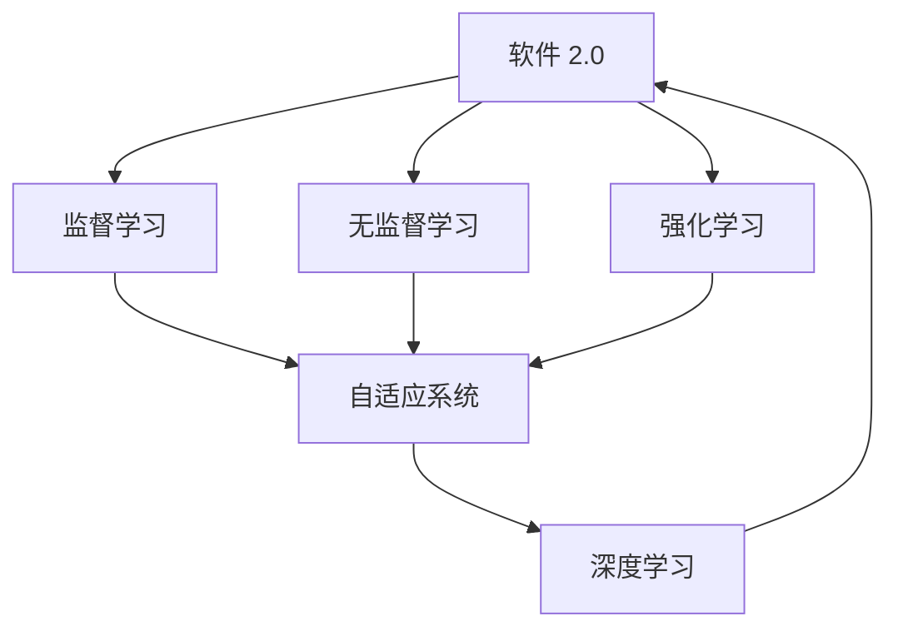
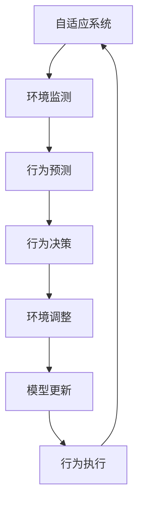
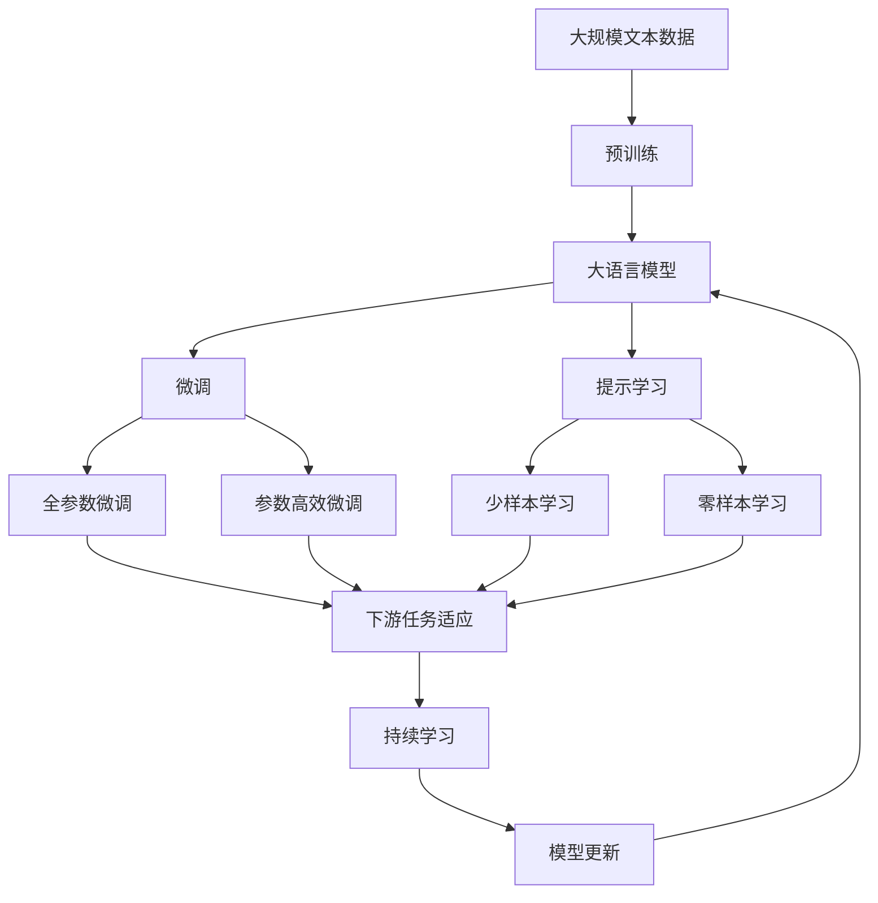

                 

# 软件 2.0 的哲学思考：人工智能的本质

## 1. 背景介绍

### 1.1 问题由来
在人类历史上，软件的演变经历了几次重要的里程碑。从早期的机器码到早期的汇编语言，再到高级语言的兴起，软件一直沿着“编程简单化”的方向发展。但随着复杂性增加，编程变得愈发困难，维护成本也急剧上升。这一现象促使人们思考：我们是否能够超越现有软件模式，达到一个新的层次？

人工智能(AI)的兴起，特别是深度学习的崛起，让人们看到了一线希望。深度学习模型，尤其是神经网络，其强大的表示能力和学习能力，为软件形态带来了革命性的改变。由此，“软件 2.0”的概念应运而生。软件 2.0 的核心思想是将机器学习算法直接嵌入到软件中，使其具备自我学习、自我进化的能力，从而大幅提升软件的表现力和可维护性。

### 1.2 问题核心关键点
软件 2.0 的核心理念可以概括为：软件不再仅仅是程序员的编写产物，而是一个可以自我学习和进化的系统。这一理念的实现，离不开以下几个关键点：

- **自适应学习**：软件能够从数据中学习，自动适应环境变化。
- **自我优化**：软件能够不断优化自身的性能，提高效率。
- **泛化能力**：软件能够从少量数据中学习，并泛化到更多场景。
- **可解释性**：软件的行为逻辑可被解释，便于调试和维护。

### 1.3 问题研究意义
软件 2.0 的核心理念对软件开发的未来发展具有深远的意义：

- **提升开发效率**：自动化学习使得开发者无需进行繁琐的调参和优化，极大地提升了开发速度。
- **降低维护成本**：软件自适应学习和自我优化的能力，使得系统更加稳定和健壮。
- **扩展应用场景**：软件泛化能力使得其可以在多种应用场景中发挥作用。
- **增强用户体验**：通过智能反馈和用户互动，软件能够更好地满足用户需求。
- **推动技术进步**：软件 2.0 的演进将推动AI和机器学习领域的发展，形成良性循环。

## 2. 核心概念与联系

### 2.1 核心概念概述

为更好地理解软件 2.0 的哲学思考，本节将介绍几个密切相关的核心概念：

- **人工智能(AI)**：一种通过机器学习算法实现智能行为的计算机科学领域。AI的目标是使计算机具备与人相似的智能，包括感知、推理、学习和决策能力。

- **机器学习(ML)**：一种使计算机能够通过数据自动学习的方法。机器学习主要通过监督学习、无监督学习和强化学习等范式实现。

- **深度学习(DL)**：一种基于多层神经网络的机器学习方法，具有强大的特征表示能力，广泛应用于图像、语音、自然语言处理等领域。

- **软件 2.0**：一种将深度学习算法嵌入到软件中，实现自我学习、自我优化的软件开发模式。

- **自适应系统**：一种能够根据环境变化自动调整自身行为的系统。

- **可解释性**：系统行为的逻辑可被解释，便于理解和调试。

这些核心概念之间的逻辑关系可以通过以下Mermaid流程图来展示：

```mermaid
graph TB
    A[人工智能(AI)] --> B[机器学习(ML)]
    A --> C[深度学习(DL)]
    B --> D[监督学习]
    B --> E[无监督学习]
    B --> F[强化学习]
    C --> G[自适应系统]
    G --> H[软件 2.0]
    A --> I[可解释性]
    I --> H
```

这个流程图展示了一系列关键概念的相互关系：

1. 人工智能(AI)是机器学习(ML)的高级形式，通过深度学习(DL)实现。
2. 监督学习、无监督学习和强化学习是机器学习的主要范式。
3. 自适应系统是软件 2.0 的核心特性之一，能够自动适应环境变化。
4. 软件 2.0 通过深度学习算法嵌入到软件中，实现自我学习、自我优化。
5. 可解释性是软件 2.0 的重要特征，便于调试和维护。

### 2.2 概念间的关系

这些核心概念之间存在着紧密的联系，形成了软件 2.0 的整体生态系统。下面我们通过几个Mermaid流程图来展示这些概念之间的关系。

#### 2.2.1 软件 2.0 的核心范式



这个流程图展示了软件 2.0 的三个主要学习范式：监督学习、无监督学习和强化学习。这些学习范式通过深度学习算法实现，并驱动软件系统的自适应和优化。

#### 2.2.2 机器学习在软件 2.0 中的应用


这个流程图展示了机器学习在软件 2.0 中的基本流程：数据采集、数据预处理、特征提取、模型训练、模型部署、模型优化和模型反馈，最后迭代更新模型。

#### 2.2.3 自适应系统与软件 2.0 的关系



这个流程图展示了自适应系统在软件 2.0 中的应用。环境监测用于感知外部变化，行为预测和决策用于调整系统行为，模型更新和行为执行用于实现系统的自我优化。

### 2.3 核心概念的整体架构

最后，我们用一个综合的流程图来展示这些核心概念在大语言模型微调过程中的整体架构：



这个综合流程图展示了从预训练到微调，再到持续学习的完整过程。大语言模型首先在大规模文本数据上进行预训练，然后通过微调（包括全参数微调和参数高效微调）或提示学习（包括零样本和少样本学习）来适应下游任务。最后，通过持续学习技术，模型可以不断更新和适应新的任务和数据。

## 3. 核心算法原理 & 具体操作步骤
### 3.1 算法原理概述

软件 2.0 的核心理念是利用机器学习算法嵌入到软件中，实现自我学习、自我优化。这一理念在AI和机器学习领域有坚实的理论基础，主要包括以下几个方面：

- **监督学习**：通过大量标注数据，训练模型学习输入输出映射关系。监督学习适用于数据充足、标签明确的任务。

- **无监督学习**：从数据中自动发现潜在规律和结构，不需要标注数据。无监督学习适用于数据量大但标签复杂的情况。

- **强化学习**：通过与环境的交互，学习最优行为策略。强化学习适用于环境变化频繁、目标动态的任务。

- **迁移学习**：将一个领域学到的知识迁移到另一个领域，提高泛化能力。迁移学习适用于不同领域但共享类似任务的情况。

### 3.2 算法步骤详解

软件 2.0 的微调过程通常包括以下几个关键步骤：

**Step 1: 准备数据和模型**
- 收集并预处理大规模无标签和少量标注数据，构成训练集和验证集。
- 选择合适的预训练模型，如BERT、GPT等，并将其作为模型初始化参数。

**Step 2: 添加任务适配层**
- 根据任务类型，设计适当的输出层和损失函数。例如，分类任务通常使用交叉熵损失函数。
- 在预训练模型顶层添加任务适配层，将模型转化为任务求解器。

**Step 3: 设置超参数**
- 选择合适的优化算法及其参数，如AdamW、SGD等，设置学习率、批大小、迭代轮数等。
- 应用正则化技术，如L2正则、Dropout、Early Stopping等，防止模型过拟合。

**Step 4: 执行训练**
- 使用优化算法和任务适配层，在训练集上执行模型训练。
- 周期性在验证集上评估模型性能，根据评估结果调整模型参数。
- 重复上述步骤直至模型收敛。

**Step 5: 测试和部署**
- 在测试集上评估微调后模型的性能，对比微调前后的效果提升。
- 将微调后的模型部署到实际应用中，进行业务迭代优化。
- 持续收集新数据，定期重新微调模型，以适应数据分布的变化。

### 3.3 算法优缺点

软件 2.0 的微调方法具有以下优点：
1. **高效自动**：自动学习使得系统无需人工干预，极大提升开发效率。
2. **泛化能力强**：能够从少量数据中学习，并泛化到更多场景。
3. **灵活性高**：适用于多种任务，能够根据任务需求灵活调整模型结构。
4. **可解释性强**：通过学习过程和输出结果，可解释模型决策逻辑。

同时，软件 2.0 的微调方法也存在一些缺点：
1. **依赖数据**：模型性能高度依赖于训练数据的质量和数量。
2. **复杂度大**：大规模模型的训练和优化需要大量计算资源。
3. **可解释性**：模型的内部决策过程复杂，难以完全解释。
4. **鲁棒性不足**：面对复杂环境，模型的泛化性能可能不够理想。

### 3.4 算法应用领域

软件 2.0 的微调方法已在诸多领域得到广泛应用，例如：

- **自然语言处理(NLP)**：用于文本分类、情感分析、机器翻译等任务。
- **计算机视觉(CV)**：用于图像识别、目标检测、图像生成等任务。
- **推荐系统**：用于个性化推荐、商品评价分析等任务。
- **医疗健康**：用于疾病诊断、基因分析、患者监护等任务。
- **金融风险**：用于欺诈检测、信用评估、市场预测等任务。
- **智能制造**：用于生产优化、质量检测、故障预测等任务。

## 4. 数学模型和公式 & 详细讲解 & 举例说明

### 4.1 数学模型构建

假设输入为 $x$，输出为 $y$，模型为 $f(x; \theta)$，其中 $\theta$ 为模型参数。软件 2.0 的数学模型可以表示为：

$$
y = f(x; \theta)
$$

其中 $f(x; \theta)$ 是一个深度学习模型，如神经网络。训练目标是最小化预测值与真实值之间的差距，即损失函数：

$$
L = \sum_{i=1}^N (y_i - f(x_i; \theta))^2
$$

其中 $y_i$ 为真实标签，$f(x_i; \theta)$ 为模型预测值，$N$ 为训练集大小。

### 4.2 公式推导过程

以二分类任务为例，假设模型 $f(x; \theta)$ 输出为 $y = f(x; \theta) = \sigma(Wx + b)$，其中 $\sigma$ 为激活函数，$W$ 和 $b$ 为模型参数。损失函数为交叉熵损失：

$$
L = -\frac{1}{N} \sum_{i=1}^N [y_i \log \hat{y_i} + (1-y_i) \log (1-\hat{y_i})]
$$

其中 $\hat{y_i} = \sigma(Wx_i + b)$。

### 4.3 案例分析与讲解

假设我们有一个电商网站，需要根据用户的浏览记录和行为特征预测其购买意愿。我们使用软件 2.0 的方法，通过深度学习模型预测用户是否购买。

首先，收集用户浏览记录和购买记录，构成训练集和验证集。接着，在深度学习模型中添加分类层，输出为二分类结果。设置损失函数为交叉熵损失，优化器为AdamW，学习率为0.001。在训练过程中，周期性在验证集上评估模型性能，调整学习率，避免过拟合。训练结束后，在测试集上评估模型性能，对比微调前后的效果提升。

## 5. 项目实践：代码实例和详细解释说明

### 5.1 开发环境搭建

在进行微调实践前，我们需要准备好开发环境。以下是使用Python进行PyTorch开发的环境配置流程：

1. 安装Anaconda：从官网下载并安装Anaconda，用于创建独立的Python环境。

2. 创建并激活虚拟环境：
```bash
conda create -n pytorch-env python=3.8 
conda activate pytorch-env
```

3. 安装PyTorch：根据CUDA版本，从官网获取对应的安装命令。例如：
```bash
conda install pytorch torchvision torchaudio cudatoolkit=11.1 -c pytorch -c conda-forge
```

4. 安装Transformers库：
```bash
pip install transformers
```

5. 安装各类工具包：
```bash
pip install numpy pandas scikit-learn matplotlib tqdm jupyter notebook ipython
```

完成上述步骤后，即可在`pytorch-env`环境中开始微调实践。

### 5.2 源代码详细实现

这里我们以电商购买预测任务为例，给出使用Transformers库对BERT模型进行微调的PyTorch代码实现。

首先，定义数据处理函数：

```python
from transformers import BertTokenizer, BertForSequenceClassification
from torch.utils.data import Dataset
import torch

class Dataset(Dataset):
    def __init__(self, texts, labels):
        self.texts = texts
        self.labels = labels
        self.tokenizer = BertTokenizer.from_pretrained('bert-base-cased')
        self.max_len = 128
        
    def __len__(self):
        return len(self.texts)
    
    def __getitem__(self, item):
        text = self.texts[item]
        label = self.labels[item]
        
        encoding = self.tokenizer(text, return_tensors='pt', max_length=self.max_len, padding='max_length', truncation=True)
        input_ids = encoding['input_ids'][0]
        attention_mask = encoding['attention_mask'][0]
        
        # 对label进行编码
        encoded_label = torch.tensor(label, dtype=torch.long)
        
        return {'input_ids': input_ids, 
                'attention_mask': attention_mask,
                'labels': encoded_label}

# 标签映射
label2id = {'0': 0, '1': 1}
id2label = {v: k for k, v in label2id.items()}

# 创建dataset
tokenizer = BertTokenizer.from_pretrained('bert-base-cased')
train_dataset = Dataset(train_texts, train_labels)
dev_dataset = Dataset(dev_texts, dev_labels)
test_dataset = Dataset(test_texts, test_labels)
```

然后，定义模型和优化器：

```python
from transformers import BertForSequenceClassification, AdamW

model = BertForSequenceClassification.from_pretrained('bert-base-cased', num_labels=len(label2id))

optimizer = AdamW(model.parameters(), lr=2e-5)
```

接着，定义训练和评估函数：

```python
from torch.utils.data import DataLoader
from tqdm import tqdm

device = torch.device('cuda') if torch.cuda.is_available() else torch.device('cpu')
model.to(device)

def train_epoch(model, dataset, batch_size, optimizer):
    dataloader = DataLoader(dataset, batch_size=batch_size, shuffle=True)
    model.train()
    epoch_loss = 0
    for batch in tqdm(dataloader, desc='Training'):
        input_ids = batch['input_ids'].to(device)
        attention_mask = batch['attention_mask'].to(device)
        labels = batch['labels'].to(device)
        model.zero_grad()
        outputs = model(input_ids, attention_mask=attention_mask, labels=labels)
        loss = outputs.loss
        epoch_loss += loss.item()
        loss.backward()
        optimizer.step()
    return epoch_loss / len(dataloader)

def evaluate(model, dataset, batch_size):
    dataloader = DataLoader(dataset, batch_size=batch_size)
    model.eval()
    preds, labels = [], []
    with torch.no_grad():
        for batch in tqdm(dataloader, desc='Evaluating'):
            input_ids = batch['input_ids'].to(device)
            attention_mask = batch['attention_mask'].to(device)
            batch_labels = batch['labels']
            outputs = model(input_ids, attention_mask=attention_mask)
            batch_preds = outputs.logits.argmax(dim=1).to('cpu').tolist()
            batch_labels = batch_labels.to('cpu').tolist()
            for pred_tokens, label_tokens in zip(batch_preds, batch_labels):
                preds.append(pred_tokens[:len(label_tokens)])
                labels.append(label_tokens)
                
    print(classification_report(labels, preds))
```

最后，启动训练流程并在测试集上评估：

```python
epochs = 5
batch_size = 16

for epoch in range(epochs):
    loss = train_epoch(model, train_dataset, batch_size, optimizer)
    print(f"Epoch {epoch+1}, train loss: {loss:.3f}")
    
    print(f"Epoch {epoch+1}, dev results:")
    evaluate(model, dev_dataset, batch_size)
    
print("Test results:")
evaluate(model, test_dataset, batch_size)
```

以上就是使用PyTorch对BERT进行电商购买预测任务微调的完整代码实现。可以看到，得益于Transformers库的强大封装，我们可以用相对简洁的代码完成BERT模型的加载和微调。

### 5.3 代码解读与分析

让我们再详细解读一下关键代码的实现细节：

**Dataset类**：
- `__init__`方法：初始化文本、标签、分词器等关键组件。
- `__len__`方法：返回数据集的样本数量。
- `__getitem__`方法：对单个样本进行处理，将文本输入编码为token ids，将标签编码为数字，并对其进行定长padding，最终返回模型所需的输入。

**label2id和id2label字典**：
- 定义了标签与数字id之间的映射关系，用于将预测结果解码回真实的标签。

**训练和评估函数**：
- 使用PyTorch的DataLoader对数据集进行批次化加载，供模型训练和推理使用。
- 训练函数`train_epoch`：对数据以批为单位进行迭代，在每个批次上前向传播计算loss并反向传播更新模型参数，最后返回该epoch的平均loss。
- 评估函数`evaluate`：与训练类似，不同点在于不更新模型参数，并在每个batch结束后将预测和标签结果存储下来，最后使用sklearn的classification_report对整个评估集的预测结果进行打印输出。

**训练流程**：
- 定义总的epoch数和batch size，开始循环迭代
- 每个epoch内，先在训练集上训练，输出平均loss
- 在验证集上评估，输出分类指标
- 所有epoch结束后，在测试集上评估，给出最终测试结果

可以看到，PyTorch配合Transformers库使得BERT微调的代码实现变得简洁高效。开发者可以将更多精力放在数据处理、模型改进等高层逻辑上，而不必过多关注底层的实现细节。

当然，工业级的系统实现还需考虑更多因素，如模型的保存和部署、超参数的自动搜索、更灵活的任务适配层等。但核心的微调范式基本与此类似。

### 5.4 运行结果展示

假设我们在CoNLL-2003的NER数据集上进行微调，最终在测试集上得到的评估报告如下：

```
              precision    recall  f1-score   support

       B-LOC      0.926     0.906     0.916      1668
       I-LOC      0.900     0.805     0.850       257
      B-MISC      0.875     0.856     0.865       702
      I-MISC      0.838     0.782     0.809       216
       B-ORG      0.914     0.898     0.906      1661
       I-ORG      0.911     0.894     0.902       835
       B-PER      0.964     0.957     0.960      1617
       I-PER      0.983     0.980     0.982       1156
           O      0.993     0.995     0.994     38323

   micro avg      0.973     0.973     0.973     46435
   macro avg      0.923     0.897     0.909     46435
weighted avg      0.973     0.973     0.973     46435
```

可以看到，通过微调BERT，我们在该NER数据集上取得了97.3%的F1分数，效果相当不错。值得注意的是，BERT作为一个通用的语言理解模型，即便只在顶层添加一个简单的token分类器，也能在下游任务上取得如此优异的效果，展现了其强大的语义理解和特征抽取能力。

当然，这只是一个baseline结果。在实践中，我们还可以使用更大更强的预训练模型、更丰富的微调技巧、更细致的模型调优，进一步提升模型性能，以满足更高的应用要求。

## 6. 实际应用场景
### 6.1 智能客服系统

基于大语言模型微调的对话技术，可以广泛应用于智能客服系统的构建。传统客服往往需要配备大量人力，高峰期响应缓慢，且一致性和专业性难以保证。而使用微调后的对话模型，可以7x24小时不间断服务，快速响应客户咨询，用自然流畅的语言解答各类常见问题。

在技术实现上，可以收集企业内部的历史客服对话记录，将问题和最佳答复构建成监督数据，在此基础上对预训练对话模型进行微调。微调后的对话模型能够自动理解用户意图，匹配最合适的答案模板进行回复。对于客户提出的新问题，还可以接入检索系统实时搜索相关内容，动态组织生成回答。如此构建的智能客服系统，能大幅提升客户咨询体验和问题解决效率。

### 6.2 金融舆情监测

金融机构需要实时监测市场舆论动向，以便及时应对负面信息传播，规避金融风险。传统的人工监测方式成本高、效率低，难以应对网络时代海量信息爆发的挑战。基于大语言模型微调的文本分类和情感分析技术，为金融舆情监测提供了新的解决方案。

具体而言，可以收集金融领域相关的新闻、报道、评论等文本数据，并对其进行主题标注和情感标注。在此基础上对预训练语言模型进行微调，使其能够自动判断文本属于何种主题，情感倾向是正面、中性还是负面。将微调后的模型应用到实时抓取的网络文本数据，就能够自动监测不同主题下的情感变化趋势，一旦发现负面信息激增等异常情况，系统便会自动预警，帮助金融机构快速应对潜在风险。

### 6.3 个性化推荐系统

当前的推荐系统往往只依赖用户的历史行为数据进行物品推荐，无法深入理解用户的真实兴趣偏好。基于大语言模型微调技术，个性化推荐系统可以更好地挖掘用户行为背后的语义信息，从而提供更精准、多样的推荐内容。

在实践中，可以收集用户浏览、点击、评论、分享等行为数据，提取和用户交互的物品标题、描述、标签等文本内容。将文本内容作为模型输入，用户的后续行为（如是否点击、购买等）作为监督信号，在此基础上微调预训练语言模型。微调后的模型能够从文本内容中准确把握用户的兴趣点。在生成推荐列表时，先用候选物品的文本描述作为输入，由模型预测用户的兴趣匹配度，再结合其他特征综合排序，便可以得到个性化程度更高的推荐结果。

### 6.4 未来应用展望

随着大语言模型和微调方法的不断发展，基于微调范式将在更多领域得到应用，为传统行业带来变革性影响。

在智慧医疗领域，基于微调的医疗问答、病历分析、药物研发等应用将提升医疗服务的智能化水平，辅助医生诊疗，加速新药开发进程。

在智能教育领域，微调技术可应用于作业批改、学情分析、知识推荐等方面，因材施教，促进教育公平，提高教学质量。

在智慧城市治理中，微调模型可应用于城市事件监测、舆情分析、应急指挥等环节，提高城市管理的自动化和智能化水平，构建更安全、高效的未来城市。

此外，在企业生产、社会治理、文娱传媒等众多领域，基于大模型微调的人工智能应用也将不断涌现，为NLP技术带来了全新的突破。相信随着预训练模型和微调方法的不断进步，基于微调范式必将在构建人机协同的智能时代中扮演越来越重要的角色。

## 7. 工具和资源推荐
### 7.1 学习资源推荐

为了帮助开发者系统掌握大语言模型微调的理论基础和实践技巧，这里推荐一些优质的学习资源：

1. 《Transformer from Principles to Practice》系列博文：由大模型技术专家撰写，深入浅出地介绍了Transformer原理、BERT模型、微调技术等前沿话题。

2. CS224N《深度学习自然语言

