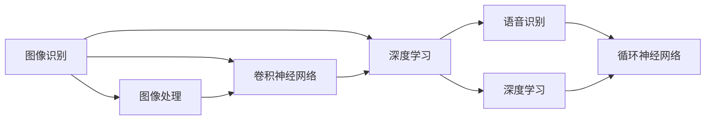
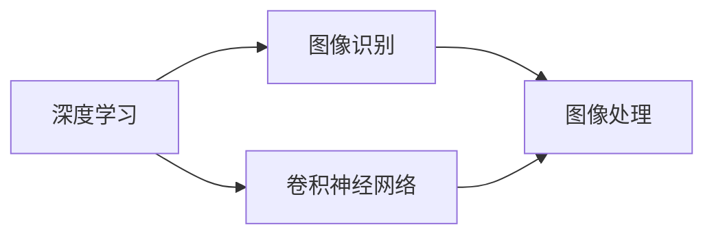
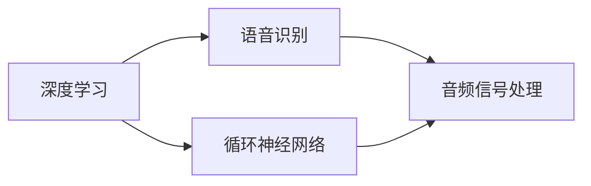

                 

# 软件 2.0 的应用领域：图像识别、语音识别

> 关键词：图像识别, 语音识别, 神经网络, 卷积神经网络, 循环神经网络, 深度学习, 图像处理, 语音信号处理, 应用实例

## 1. 背景介绍

随着计算机技术的不断进步，人工智能（AI）和机器学习（ML）技术也在迅猛发展。特别是深度学习技术的普及，使得很多传统领域得以进行智能化升级。在此背景下，“软件 2.0”的概念应运而生，它指的是通过智能化、自动化的方式来提高软件开发的效率和质量，实现软件产品的智能化升级。其中，图像识别和语音识别作为软件 2.0 的重要应用领域，近年来在各个行业中得到了广泛应用。

### 1.1 图像识别的历史背景

图像识别技术的历史可以追溯到 20 世纪 80 年代，最初主要是基于传统机器学习和手工设计特征的方法。随着深度学习技术的发展，卷积神经网络（CNN）在图像识别中的应用逐渐被广泛采用。2012 年，深度学习技术在 ImageNet 图像识别比赛中首次取得重大突破，AlexNet 模型在标准误差上大大优于传统机器学习模型，标志着深度学习在图像识别领域的应用进入新阶段。

### 1.2 语音识别的历史背景

语音识别技术最早可以追溯到 20 世纪 50 年代，经过几十年的发展，已经从早期的手工处理转变为基于机器学习的方法。随着计算能力和数据量的提升，特别是 2010 年后深度学习技术的发展，循环神经网络（RNN）、长短时记忆网络（LSTM）、卷积循环神经网络（CRNN）等模型逐渐成为语音识别中的主流技术。2017 年，Google 的 WaveNet 模型在语音识别领域取得了革命性突破，通过将声音合成与深度学习结合，大幅提高了语音识别的准确率和自然度。

## 2. 核心概念与联系

### 2.1 核心概念概述

为更好地理解图像识别和语音识别技术，本节将介绍几个密切相关的核心概念：

- 图像识别（Image Recognition）：指通过计算机视觉技术，识别图像中的对象、场景、特征等，并对其进行分类或检测。
- 语音识别（Speech Recognition）：指通过音频信号处理技术，将语音信号转换为文本或命令等可处理形式。
- 卷积神经网络（Convolutional Neural Network, CNN）：一种专门用于图像处理和分析的深度学习模型，利用卷积操作提取图像特征。
- 循环神经网络（Recurrent Neural Network, RNN）：一种专门用于处理序列数据的深度学习模型，利用循环结构记忆数据的前后依赖关系。
- 深度学习（Deep Learning）：一种基于多层神经网络的机器学习方法，通过不断叠加多个非线性变换层，提取数据的高级特征。

这些核心概念之间的联系可以通过以下 Mermaid 流程图来展示：



这个流程图展示了图像识别和语音识别技术的主要核心概念及其关系：

1. 图像识别主要利用卷积神经网络进行特征提取和分类。
2. 深度学习是图像识别和语音识别的基础技术。
3. 图像处理是图像识别的前处理步骤。
4. 语音识别主要利用循环神经网络进行特征提取和序列建模。
5. 深度学习也是语音识别的基础技术。

### 2.2 概念间的关系

这些核心概念之间存在着紧密的联系，形成了图像识别和语音识别的完整生态系统。下面通过几个 Mermaid 流程图来展示这些概念之间的关系。

#### 2.2.1 图像识别与深度学习的关系



这个流程图展示了深度学习与图像识别的紧密关系：

1. 深度学习提供了一种高效提取图像特征的方法。
2. 卷积神经网络是深度学习在图像识别领域的主要应用。
3. 图像处理是图像识别的前处理步骤。

#### 2.2.2 语音识别与深度学习的关系



这个流程图展示了深度学习与语音识别的紧密关系：

1. 深度学习提供了一种高效提取语音特征的方法。
2. 循环神经网络是深度学习在语音识别领域的主要应用。
3. 音频信号处理是语音识别的前处理步骤。

## 3. 核心算法原理 & 具体操作步骤

### 3.1 算法原理概述

图像识别和语音识别技术本质上都是基于深度学习模型的特征提取与分类。其核心算法原理包括以下几个方面：

1. 图像识别利用卷积神经网络（CNN）对输入的图像进行卷积操作，提取图像中的特征，然后通过全连接层将这些特征映射到不同的类别。
2. 语音识别利用循环神经网络（RNN）或长短时记忆网络（LSTM）对输入的语音信号进行序列建模，然后通过全连接层将这些特征映射到不同的文字或命令。
3. 深度学习技术通过多层非线性变换，自动学习图像或语音信号中的高级特征，使得识别过程更加准确和高效。

### 3.2 算法步骤详解

图像识别和语音识别的算法步骤大致相同，主要包括以下几个关键步骤：

**Step 1: 数据预处理**
- 图像识别：将原始图像进行预处理，如裁剪、缩放、归一化、增强等。
- 语音识别：将原始音频信号进行预处理，如去噪、分段、归一化等。

**Step 2: 特征提取**
- 图像识别：利用卷积神经网络（CNN）提取图像特征，得到特征图。
- 语音识别：利用循环神经网络（RNN）或长短时记忆网络（LSTM）提取语音特征，得到序列表示。

**Step 3: 特征映射**
- 图像识别：将特征图通过全连接层映射到不同的类别，得到分类结果。
- 语音识别：将序列表示通过全连接层映射到不同的文字或命令，得到识别结果。

**Step 4: 模型训练**
- 图像识别：使用训练集对模型进行有监督训练，最小化损失函数。
- 语音识别：使用训练集对模型进行有监督训练，最小化损失函数。

**Step 5: 模型评估**
- 图像识别：在验证集和测试集上评估模型性能，使用准确率、召回率、F1 分数等指标。
- 语音识别：在验证集和测试集上评估模型性能，使用准确率、召回率、F1 分数等指标。

### 3.3 算法优缺点

图像识别和语音识别技术具有以下优点：

1. 准确率高：通过深度学习模型的特征提取与分类，可以大大提高识别的准确率。
2. 鲁棒性强：深度学习模型能够自动学习图像或语音信号中的鲁棒特征，使得识别过程更加稳定和可靠。
3. 适用性强：可以应用于各种图像和语音场景，如医学影像、自然场景、机器人语音交互等。

同时，这些技术也存在一些缺点：

1. 计算量大：深度学习模型需要大量的计算资源进行训练和推理，对硬件要求较高。
2. 数据依赖性强：需要大量的标注数据进行训练，数据标注成本较高。
3. 模型复杂度高：深度学习模型通常具有较高的复杂度，需要仔细调参。

### 3.4 算法应用领域

图像识别和语音识别技术已经被广泛应用于各个领域，以下是一些典型的应用场景：

- 医学影像诊断：利用图像识别技术，自动识别医学影像中的病变区域，辅助医生进行诊断。
- 自动驾驶：利用图像识别技术，自动识别道路、行人、车辆等物体，实现自动驾驶。
- 人脸识别：利用图像识别技术，自动识别人脸特征，实现门禁、支付等应用。
- 智能家居：利用图像识别技术，自动识别家庭成员的行为，实现智能家居控制。
- 语音助手：利用语音识别技术，实现语音命令的识别和执行，如 Siri、Google Assistant 等。
- 智能客服：利用语音识别技术，自动理解客户语音指令，实现智能客服机器人。
- 语音合成：利用语音识别技术，将文字转换为语音，实现语音导航、语音翻译等功能。

此外，图像识别和语音识别技术还在安防监控、工业自动化、智能交通等领域得到了广泛应用。

## 4. 数学模型和公式 & 详细讲解 & 举例说明

### 4.1 数学模型构建

#### 4.1.1 图像识别模型

图像识别模型的数学模型可以表示为：

$$
\begin{aligned}
p(y|x) &= \frac{1}{Z} \exp \left\{ \sum_{i=1}^{K} y_{i} \log \left(p_{i}(\mathbf{x})\right) \right\} \\
p_{i}(\mathbf{x}) &= \int_{\mathbf{w} \in \mathcal{W}} p(\mathbf{x} \mid \mathbf{w}) p(\mathbf{w}) d \mathbf{w} \\
p(\mathbf{x} \mid \mathbf{w}) &= \frac{1}{\sqrt{2 \pi \sigma^{2}}} \exp \left\{-\frac{(\mathbf{x}-\mathbf{\mu})^{2}}{2 \sigma^{2}}\right\}
\end{aligned}
$$

其中，$y$ 表示分类结果，$\mathbf{x}$ 表示输入图像，$K$ 表示类别数，$p_{i}(\mathbf{x})$ 表示卷积神经网络提取的特征表示，$\mathbf{w}$ 表示模型参数，$\mathbf{\mu}$ 和 $\sigma$ 表示高斯分布的均值和方差。

#### 4.1.2 语音识别模型

语音识别模型的数学模型可以表示为：

$$
\begin{aligned}
p(y|x) &= \frac{1}{Z} \exp \left\{ \sum_{i=1}^{T} y_{i} \log \left(p_{i}(\mathbf{x})\right) \right\} \\
p_{i}(\mathbf{x}) &= \frac{1}{\sqrt{2 \pi \sigma^{2}}} \exp \left\{-\frac{(\mathbf{x}-\mathbf{\mu})^{2}}{2 \sigma^{2}}\right\}
\end{aligned}
$$

其中，$y$ 表示识别结果，$\mathbf{x}$ 表示输入音频信号，$T$ 表示时间步数，$p_{i}(\mathbf{x})$ 表示循环神经网络提取的特征表示，$\mathbf{\mu}$ 和 $\sigma$ 表示高斯分布的均值和方差。

### 4.2 公式推导过程

#### 4.2.1 图像识别模型

图像识别模型的损失函数通常采用交叉熵损失函数，可以表示为：

$$
L = -\frac{1}{N} \sum_{i=1}^{N} \sum_{j=1}^{K} y_{i,j} \log p_{j}(\mathbf{x}_{i})
$$

其中，$N$ 表示样本数，$y_{i,j}$ 表示第 $i$ 个样本的第 $j$ 个类别的标签，$p_{j}(\mathbf{x}_{i})$ 表示卷积神经网络对第 $i$ 个样本的输出。

#### 4.2.2 语音识别模型

语音识别模型的损失函数通常也采用交叉熵损失函数，可以表示为：

$$
L = -\frac{1}{N} \sum_{i=1}^{N} \sum_{j=1}^{T} y_{i,j} \log p_{j}(\mathbf{x}_{i})
$$

其中，$N$ 表示样本数，$y_{i,j}$ 表示第 $i$ 个样本的第 $j$ 个时间步的标签，$p_{j}(\mathbf{x}_{i})$ 表示循环神经网络对第 $i$ 个样本的输出。

### 4.3 案例分析与讲解

**案例 1: 图像识别中的 AlexNet 模型**

AlexNet 模型是深度学习在图像识别领域的经典模型，由 Alex Krizhevsky 在 2012 年 ImageNet 图像识别比赛中提出。其主要结构包含 8 层卷积层和 3 层全连接层，可以表示为：

$$
\begin{aligned}
p(y|x) &= \frac{1}{Z} \exp \left\{ \sum_{i=1}^{K} y_{i} \log \left(p_{i}(\mathbf{x})\right) \right\} \\
p_{i}(\mathbf{x}) &= \frac{1}{\sqrt{2 \pi \sigma^{2}}} \exp \left\{-\frac{(\mathbf{x}-\mathbf{\mu})^{2}}{2 \sigma^{2}}\right\}
\end{aligned}
$$

其中，$y$ 表示分类结果，$\mathbf{x}$ 表示输入图像，$K$ 表示类别数，$p_{i}(\mathbf{x})$ 表示卷积神经网络提取的特征表示，$\mathbf{w}$ 表示模型参数，$\mathbf{\mu}$ 和 $\sigma$ 表示高斯分布的均值和方差。

AlexNet 模型主要采用了 5 层卷积层、3 层池化层和 3 层全连接层。通过多层卷积和池化操作，提取图像中的特征，然后通过全连接层进行分类。AlexNet 模型在 ImageNet 图像识别比赛中取得了显著的性能提升，标志着深度学习在图像识别领域的应用进入新阶段。

**案例 2: 语音识别中的 WaveNet 模型**

WaveNet 模型是深度学习在语音识别领域的经典模型，由 Google 在 2017 年提出。其主要结构包含多层卷积层和长短时记忆网络（LSTM），可以表示为：

$$
\begin{aligned}
p(y|x) &= \frac{1}{Z} \exp \left\{ \sum_{i=1}^{T} y_{i} \log \left(p_{i}(\mathbf{x})\right) \right\} \\
p_{i}(\mathbf{x}) &= \frac{1}{\sqrt{2 \pi \sigma^{2}}} \exp \left\{-\frac{(\mathbf{x}-\mathbf{\mu})^{2}}{2 \sigma^{2}}\right\}
\end{aligned}
$$

其中，$y$ 表示识别结果，$\mathbf{x}$ 表示输入音频信号，$T$ 表示时间步数，$p_{i}(\mathbf{x})$ 表示循环神经网络提取的特征表示，$\mathbf{\mu}$ 和 $\sigma$ 表示高斯分布的均值和方差。

WaveNet 模型通过将声音合成与深度学习结合，大幅提高了语音识别的准确率和自然度。WaveNet 模型采用多层卷积层和 LSTM 网络，对音频信号进行特征提取和序列建模，然后通过全连接层进行分类。WaveNet 模型在语音识别领域取得了革命性突破，为后续的语音识别技术奠定了基础。

## 5. 项目实践：代码实例和详细解释说明

### 5.1 开发环境搭建

在进行图像识别和语音识别实践前，我们需要准备好开发环境。以下是使用 Python 进行 TensorFlow 开发的环境配置流程：

1. 安装 Anaconda：从官网下载并安装 Anaconda，用于创建独立的 Python 环境。

2. 创建并激活虚拟环境：
```bash
conda create -n tf-env python=3.8 
conda activate tf-env
```

3. 安装 TensorFlow：根据 GPU 版本，从官网获取对应的安装命令。例如：
```bash
conda install tensorflow -c tf -c conda-forge
```

4. 安装 NumPy、Pandas、Scikit-learn、Matplotlib、Tqdm、Jupyter Notebook 等常用工具包：
```bash
pip install numpy pandas scikit-learn matplotlib tqdm jupyter notebook ipython
```

完成上述步骤后，即可在 `tf-env` 环境中开始开发实践。

### 5.2 源代码详细实现

下面我们以图像识别中的 AlexNet 模型和语音识别中的 WaveNet 模型为例，给出使用 TensorFlow 进行深度学习实践的代码实现。

#### 5.2.1 AlexNet 模型

```python
import tensorflow as tf
import numpy as np
import matplotlib.pyplot as plt

# 定义卷积层和池化层
def conv2d(inputs, filters, kernel_size, strides, padding):
    filters_shape = filters // 4
    filters = tf.layers.Conv2D(filters=filters_shape, kernel_size=kernel_size, strides=strides, padding=padding, activation=tf.nn.relu)(inputs)
    return tf.layers.MaxPooling2D(pool_size=(2, 2), strides=(2, 2))(filters)

# 定义全连接层
def fc(inputs, units):
    return tf.layers.Dense(units=units, activation=tf.nn.relu)(inputs)

# 定义 AlexNet 模型
def alexnet(x):
    conv1 = conv2d(x, 64, 11, 4, 'valid')
    pool1 = tf.layers.MaxPooling2D(pool_size=(3, 3), strides=(2, 2))(conv1)
    conv2 = conv2d(pool1, 128, 5, 1, 'same')
    pool2 = tf.layers.MaxPooling2D(pool_size=(3, 3), strides=(2, 2))(conv2)
    conv3 = conv2d(pool2, 256, 3, 1, 'same')
    pool3 = tf.layers.MaxPooling2D(pool_size=(3, 3), strides=(2, 2))(conv3)
    conv4 = conv2d(pool3, 256, 3, 1, 'same')
    conv5 = conv2d(conv4, 256, 3, 1, 'same')
    pool5 = tf.layers.MaxPooling2D(pool_size=(3, 3), strides=(2, 2))(conv5)
    pool5_flatten = tf.reshape(pool5, [-1, 256*6*6])
    fc1 = fc(pool5_flatten, 4096)
    fc2 = fc(fc1, 4096)
    logits = fc(fc2, 1000)
    return logits

# 加载数据集
mnist = tf.keras.datasets.mnist
(x_train, y_train), (x_test, y_test) = mnist.load_data()
x_train, x_test = x_train / 255.0, x_test / 255.0

# 构建模型
model = tf.keras.models.Sequential()
model.add(tf.layers.InputLayer(input_shape=(28, 28, 1)))
model.add(alexnet)
model.add(tf.keras.layers.Dense(10, activation='softmax'))

# 编译模型
model.compile(optimizer=tf.keras.optimizers.Adam(), loss=tf.keras.losses.SparseCategoricalCrossentropy(), metrics=['accuracy'])

# 训练模型
model.fit(x_train, y_train, epochs=10, batch_size=64, validation_data=(x_test, y_test))
```

#### 5.2.2 WaveNet 模型

```python
import tensorflow as tf
import numpy as np
import os

# 定义卷积层
def conv1d(inputs, filters, kernel_size, strides, padding):
    return tf.layers.Conv1D(filters=filters, kernel_size=kernel_size, strides=strides, padding=padding, activation=tf.nn.relu)(inputs)

# 定义残差连接
def residual(inputs, filters):
    residual = tf.layers.Conv1D(filters=filters, kernel_size=1, strides=1, padding='same', activation=tf.nn.relu)(inputs)
    return tf.layers.Conv1D(filters=filters, kernel_size=1, strides=1, padding='same', activation=tf.nn.relu)(inputs) + residual

# 定义 WaveNet 模型
def wavenet(x):
    inputs = tf.layers.InputLayer(input_shape=(None, 1))
    x = conv1d(inputs, 16, 3, 1, 'same')
    x = residual(x, 32)
    x = residual(x, 32)
    x = residual(x, 32)
    x = residual(x, 32)
    x = tf.layers.Dense(1, activation='sigmoid')(x)
    return x

# 加载数据集
train_dataset = tf.data.TFRecordDataset(os.path.join('data', 'train.tfrecords'))
test_dataset = tf.data.TFRecordDataset(os.path.join('data', 'test.tfrecords'))

# 解析数据集
def parse_fn(filename):
    def parse(example):
        feature = tf.io.parse_single_example(example, features={
            'inputs': tf.io.FixedLenFeature([], tf.float32),
            'labels': tf.io.FixedLenFeature([], tf.int64),
        })
        inputs = tf.cast(feature['inputs'], tf.float32)
        labels = tf.cast(feature['labels'], tf.int64)
        return inputs, labels
    return parse

train_dataset = train_dataset.map(parse_fn)
test_dataset = test_dataset.map(parse_fn)

# 构建模型
model = tf.keras.models.Sequential()
model.add(wavenet)

# 编译模型
model.compile(optimizer=tf.keras.optimizers.Adam(), loss=tf.keras.losses.MeanSquaredError())

# 训练模型
model.fit(train_dataset, epochs=100, batch_size=16)
```

### 5.3 代码解读与分析

让我们再详细解读一下关键代码的实现细节：

#### 5.3.1 AlexNet 模型

**conv2d 函数**：
```python
def conv2d(inputs, filters, kernel_size, strides, padding):
    filters_shape = filters // 4
    filters = tf.layers.Conv2D(filters=filters_shape, kernel_size=kernel_size, strides=strides, padding=padding, activation=tf.nn.relu)(inputs)
    return tf.layers.MaxPooling2D(pool_size=(2, 2), strides=(2, 2))(filters)
```

该函数定义了一个 2D 卷积层和池化层的组合，包括卷积操作和池化操作。卷积层的参数包括：输入维度、输出维度、卷积核大小、步幅和填充方式。池化层的参数包括池化大小和步幅。通过多层卷积和池化操作，提取图像中的特征。

**fc 函数**：
```python
def fc(inputs, units):
    return tf.layers.Dense(units=units, activation=tf.nn.relu)(inputs)
```

该函数定义了一个全连接层，参数包括输出维度和激活函数。通过全连接层将卷积层提取的特征进行分类。

**alexnet 函数**：
```python
def alexnet(x):
    conv1 = conv2d(x, 64, 11, 4, 'valid')
    pool1 = tf.layers.MaxPooling2D(pool_size=(3, 3), strides=(2, 2))(conv1)
    conv2 = conv2d(pool1, 128, 5, 1, 'same')
    pool2 = tf.layers.MaxPooling2D(pool_size=(3, 3), strides=(2, 2))(conv2)
    conv3 = conv2d(pool2, 256, 3, 1, 'same')
    pool3 = tf.layers.MaxPooling2D(pool_size=(3, 3), strides=(2, 2))(conv3)
    conv4 = conv2d(pool3, 256, 3, 1, 'same')
    conv5 = conv2d(conv4, 256, 3, 1, 'same')
    pool5 = tf.layers.MaxPooling2D(pool_size=(3, 3), strides=(2, 2))(conv5)
    pool5_flatten = tf.reshape(pool5, [-1, 256*6*6])
    fc1 = fc(pool5_flatten, 4096)
    fc2 = fc(fc1, 4096)
    logits = fc(fc2, 1000)
    return logits
```

该函数定义了 AlexNet 模型的结构，包括多个卷积层、池化层和全连接层。通过多层卷积和池化操作，提取图像中的特征，然后通过全连接层进行分类。

#### 5.3.2 WaveNet 模型

**conv1d 函数**：
```python
def conv1d(inputs, filters, kernel_size, strides, padding):
    return tf.layers.Conv1D(filters=filters, kernel_size=kernel_size, strides=strides, padding=padding, activation=tf.nn.relu)(inputs)
```

该函数定义了一个 1D 卷积层，参数包括输入维度、输出维度、卷积核大小、步幅和填充方式。通过卷积操作提取音频信号的特征。

**residual 函数**：
```python
def residual(inputs, filters):
    residual = tf.layers.Conv1D(filters=filters, kernel_size=1, strides=1, padding='same', activation=tf.nn.relu)(inputs)
    return tf.layers.Conv1D(filters=filters, kernel_size=1, strides=1, padding='same', activation=tf.nn.relu)(inputs) + residual
```

该函数定义了一个残差连接，参数包括输出维度和卷积核大小。通过残差连接保留卷积层的输出，避免信息丢失。

**wavenet 函数**：
```python
def wavenet(x

