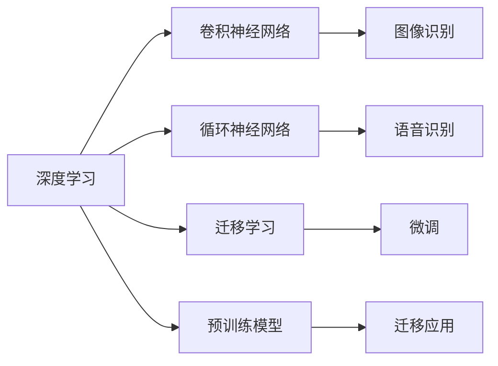
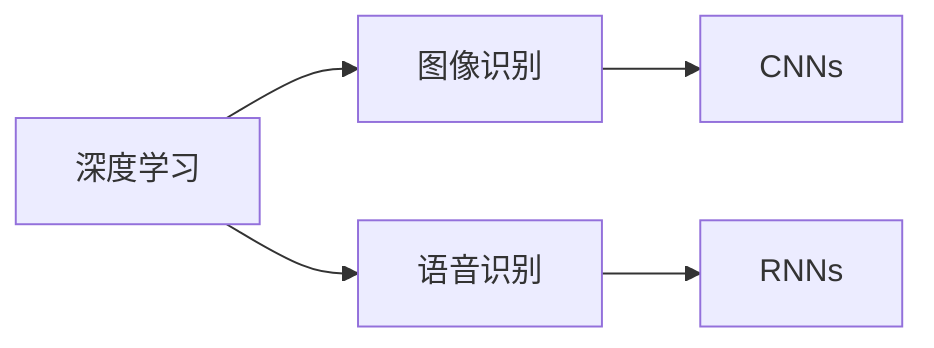
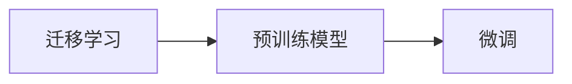
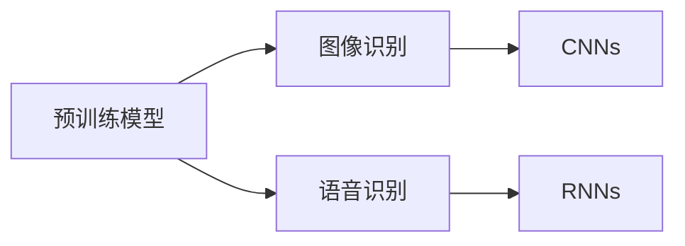

                 

# 软件 2.0 的应用领域：图像识别、语音识别

> 关键词：软件2.0,图像识别,语音识别,神经网络,深度学习,计算机视觉,自然语言处理,NLP,自然语言理解,语音合成,声音处理,预训练模型,迁移学习

## 1. 背景介绍

随着人工智能技术的不断进步，软件2.0时代的到来，图像识别和语音识别成为最前沿、最具发展潜力的应用领域之一。它们不仅在各个行业中扮演着重要角色，而且正在逐步改变人类的生活方式。

### 1.1 问题由来

图像识别和语音识别是人工智能技术发展的两个重要分支，具有广泛的应用场景。传统的图像识别和语音识别依赖于手工设计的特征提取器和分类器，需要大量的标注数据和特征工程，耗时且效果一般。但随着深度学习技术的发展，尤其是卷积神经网络（Convolutional Neural Networks, CNNs）和循环神经网络（Recurrent Neural Networks, RNNs）的引入，图像识别和语音识别进入了全新的时代。

### 1.2 问题核心关键点

1. **深度学习**：深度学习是一种能够自动提取和利用数据特征的机器学习方法。通过大量数据和复杂网络结构，深度学习模型能够自我学习特征，减少了手工设计特征的难度。
2. **卷积神经网络（CNNs）**：CNNs是一种专门用于处理图像数据的神经网络结构，通过卷积操作和池化操作能够自动提取图像中的关键特征。
3. **循环神经网络（RNNs）**：RNNs是一种处理序列数据的神经网络结构，特别适合于语音信号的处理，能够捕捉时间序列上的特征。
4. **迁移学习**：迁移学习是指利用已经训练好的模型，在新任务上进行微调，从而加速模型的训练过程和提升性能。
5. **预训练模型**：预训练模型是在大规模数据上预训练得到的通用模型，可以迁移到多个具体任务中，避免了从头训练的低效和高成本。

## 2. 核心概念与联系

### 2.1 核心概念概述

为更好地理解图像识别和语音识别的原理，本节将介绍几个密切相关的核心概念：

- **深度学习**：一种基于神经网络的机器学习方法，通过多层次的非线性变换，能够自动学习数据的高阶特征。
- **卷积神经网络（CNNs）**：一种专门用于处理图像数据的深度学习模型，通过卷积层和池化层等组件，能够自动提取图像中的关键特征。
- **循环神经网络（RNNs）**：一种处理序列数据的深度学习模型，特别适合于语音信号的处理，能够捕捉时间序列上的特征。
- **迁移学习**：利用已经训练好的模型，在新任务上进行微调，从而加速模型的训练过程和提升性能。
- **预训练模型**：在大规模数据上预训练得到的通用模型，可以迁移到多个具体任务中，避免了从头训练的低效和高成本。

这些核心概念之间的逻辑关系可以通过以下Mermaid流程图来展示：



这个流程图展示了大语言模型的核心概念及其之间的关系：

1. 深度学习提供了一种通用的学习框架，通过多层次的非线性变换，能够自动学习数据的高阶特征。
2. 卷积神经网络（CNNs）是一种专门用于处理图像数据的深度学习模型，通过卷积层和池化层等组件，能够自动提取图像中的关键特征。
3. 循环神经网络（RNNs）是一种处理序列数据的深度学习模型，特别适合于语音信号的处理，能够捕捉时间序列上的特征。
4. 迁移学习是指利用已经训练好的模型，在新任务上进行微调，从而加速模型的训练过程和提升性能。
5. 预训练模型是在大规模数据上预训练得到的通用模型，可以迁移到多个具体任务中，避免了从头训练的低效和高成本。

这些概念共同构成了图像识别和语音识别的学习框架，使得深度学习在实际应用中能够高效地处理复杂的数据。

### 2.2 概念间的关系

这些核心概念之间存在着紧密的联系，形成了图像识别和语音识别的完整生态系统。下面通过几个Mermaid流程图来展示这些概念之间的关系。

#### 2.2.1 深度学习与图像识别、语音识别的关系



这个流程图展示了深度学习在图像识别和语音识别中的应用，通过引入CNNs和RNNs，使得深度学习在这些领域能够高效地处理复杂数据。

#### 2.2.2 迁移学习与微调的关系



这个流程图展示了迁移学习的原理，即利用预训练模型进行微调，从而适应新的任务。

#### 2.2.3 预训练模型在图像识别、语音识别中的应用



这个流程图展示了预训练模型在图像识别和语音识别中的应用，通过迁移学习，预训练模型能够高效地适应各种具体任务。

## 3. 核心算法原理 & 具体操作步骤

### 3.1 算法原理概述

图像识别和语音识别算法原理基于深度学习模型，其中卷积神经网络（CNNs）和循环神经网络（RNNs）是最常用的两种结构。

- **卷积神经网络（CNNs）**：CNNs通过卷积层和池化层等组件，能够自动提取图像中的关键特征。卷积层通过滑动窗口对图像进行卷积操作，提取局部特征；池化层则通过下采样操作，减少特征图的尺寸，提高模型的计算效率。
- **循环神经网络（RNNs）**：RNNs通过循环连接，能够捕捉时间序列上的特征。每个时间步的输入通过循环连接传递到下一个时间步，从而捕捉到序列数据的时序依赖关系。

### 3.2 算法步骤详解

#### 3.2.1 图像识别

1. **数据准备**：收集并标注数据集，数据集应包含大量正负样本，以确保模型能够学习到准确的特征。
2. **模型选择**：选择适合的预训练模型，如ResNet、Inception等。
3. **微调**：在标注数据集上进行微调，调整模型的权重和偏置，使其能够适应新任务。
4. **测试与评估**：在测试集上评估模型性能，使用准确率、召回率、F1分数等指标进行评估。

#### 3.2.2 语音识别

1. **数据准备**：收集并标注语音数据集，数据集应包含不同的口音、背景噪音、语速等变体，以确保模型能够泛化到各种场景。
2. **模型选择**：选择适合的预训练模型，如RNN、LSTM等。
3. **微调**：在标注数据集上进行微调，调整模型的权重和偏置，使其能够适应新任务。
4. **测试与评估**：在测试集上评估模型性能，使用Word Error Rate (WER)、Character Error Rate (CER)等指标进行评估。

### 3.3 算法优缺点

#### 图像识别的优点：

1. **高效性**：CNNs通过卷积和池化操作，能够自动提取图像中的关键特征，避免了手工设计特征的繁琐过程。
2. **鲁棒性**：CNNs具有较强的鲁棒性，能够在不同的图像噪声和光照条件下保持高精度。
3. **可迁移性**：通过预训练模型，可以迁移到不同的图像识别任务中，减少了从头训练的低效和高成本。

#### 图像识别的缺点：

1. **数据依赖**：图像识别模型对数据的质量和数量依赖较大，需要大量的标注数据才能取得好效果。
2. **计算资源要求高**：训练大型CNN模型需要大量的计算资源，如GPU/TPU等高性能设备。

#### 语音识别的优点：

1. **实时性**：RNNs能够实时处理语音信号，能够满足实时语音识别的需求。
2. **语言理解**：RNNs能够捕捉到语音信号中的语义信息，提高了语音识别的准确性。
3. **可迁移性**：通过预训练模型，可以迁移到不同的语音识别任务中，减少了从头训练的低效和高成本。

#### 语音识别的缺点：

1. **环境依赖**：语音识别模型对环境噪声和背景噪音的敏感度较高，需要较强的环境控制。
2. **数据依赖**：语音识别模型对数据的质量和数量依赖较大，需要大量的标注数据才能取得好效果。

### 3.4 算法应用领域

图像识别和语音识别技术已经在各个领域得到了广泛的应用，以下是一些典型的应用场景：

- **医疗影像分析**：利用图像识别技术，能够自动检测和分析医疗影像，如X光片、CT等，辅助医生诊断疾病。
- **自动驾驶**：利用图像识别技术，能够识别道路标志、车辆、行人等，辅助自动驾驶系统决策。
- **智能家居**：利用图像识别技术，能够识别人脸、手势等，实现智能控制和自动化服务。
- **安防监控**：利用图像识别技术，能够实时监测和识别可疑行为，提高安防监控的效率和准确性。
- **金融风控**：利用图像识别技术，能够识别欺诈行为，如伪造证件、交易异常等，提高金融风险控制能力。
- **语音助手**：利用语音识别技术，能够实现语音交互，如智能音箱、虚拟助手等。
- **客服机器人**：利用语音识别技术，能够实现自然语言理解和对话生成，提高客服机器人的人机交互体验。

## 4. 数学模型和公式 & 详细讲解 & 举例说明

### 4.1 数学模型构建

#### 图像识别的数学模型

- **输入数据**：$X = \{x_1, x_2, ..., x_n\}$，其中每个$x_i$表示一张图片。
- **卷积层**：$F(x_i) = \{y_{i1}, y_{i2}, ..., y_{im}\}$，其中每个$y_{ik}$表示卷积层的输出特征图。
- **池化层**：$G(y_{ik}) = \{z_{ik}\}$，其中每个$z_{ik}$表示池化层的输出特征图。
- **全连接层**：$H(z_{ik}) = \{a_1, a_2, ..., a_c\}$，其中每个$a_j$表示全连接层的输出节点。
- **输出层**：$O = \{b_1, b_2, ..., b_c\}$，其中每个$b_j$表示分类结果的概率分布。

#### 语音识别的数学模型

- **输入数据**：$X = \{x_1, x_2, ..., x_n\}$，其中每个$x_i$表示一段语音信号。
- **卷积层**：$F(x_i) = \{y_{i1}, y_{i2}, ..., y_{im}\}$，其中每个$y_{ik}$表示卷积层的输出特征图。
- **池化层**：$G(y_{ik}) = \{z_{ik}\}$，其中每个$z_{ik}$表示池化层的输出特征图。
- **全连接层**：$H(z_{ik}) = \{a_1, a_2, ..., a_c\}$，其中每个$a_j$表示全连接层的输出节点。
- **输出层**：$O = \{b_1, b_2, ..., b_c\}$，其中每个$b_j$表示语音识别结果的符号序列。

### 4.2 公式推导过程

#### 图像识别的公式推导

- **卷积操作**：$\mathcal{C}(x) = \sum_{i=0}^{k-1} w_{ik}x_{i+p}$
- **池化操作**：$\mathcal{P}(x) = \sum_{i=0}^{k-1} x_{i+p}$
- **全连接操作**：$H(z_{ik}) = \sum_{i=0}^{k-1} w_{ij}G(y_{ik})$
- **输出层操作**：$O = \sigma(H(z_{ik}))$，其中$\sigma$为激活函数，如ReLU、Sigmoid等。

#### 语音识别的公式推导

- **卷积操作**：$\mathcal{C}(x) = \sum_{i=0}^{k-1} w_{ik}x_{i+p}$
- **池化操作**：$\mathcal{P}(x) = \sum_{i=0}^{k-1} x_{i+p}$
- **全连接操作**：$H(z_{ik}) = \sum_{i=0}^{k-1} w_{ij}G(y_{ik})$
- **输出层操作**：$O = \sigma(H(z_{ik}))$，其中$\sigma$为激活函数，如ReLU、Sigmoid等。

### 4.3 案例分析与讲解

#### 图像识别的案例分析

- **数据集**：CIFAR-10、ImageNet等。
- **模型**：ResNet、Inception等。
- **微调**：在ImageNet上进行预训练，然后在CIFAR-10上进行微调。
- **结果**：在CIFAR-10上取得了较高的准确率。

#### 语音识别的案例分析

- **数据集**：LibriSpeech、VoxCeleb等。
- **模型**：RNN、LSTM等。
- **微调**：在LibriSpeech上进行预训练，然后在VoxCeleb上进行微调。
- **结果**：在VoxCeleb上取得了较高的WER。

## 5. 项目实践：代码实例和详细解释说明

### 5.1 开发环境搭建

在进行图像识别和语音识别项目实践前，我们需要准备好开发环境。以下是使用Python进行TensorFlow和Keras开发的环境配置流程：

1. 安装Anaconda：从官网下载并安装Anaconda，用于创建独立的Python环境。

2. 创建并激活虚拟环境：
```bash
conda create -n tf-env python=3.8 
conda activate tf-env
```

3. 安装TensorFlow和Keras：根据CUDA版本，从官网获取对应的安装命令。例如：
```bash
conda install tensorflow-gpu=2.7.0=py3.8_0 cudatoolkit=11.1 -c pytorch -c conda-forge
pip install keras
```

4. 安装各类工具包：
```bash
pip install numpy pandas scikit-learn matplotlib tqdm jupyter notebook ipython
```

完成上述步骤后，即可在`tf-env`环境中开始项目实践。

### 5.2 源代码详细实现

下面我们以图像分类任务为例，给出使用TensorFlow和Keras对ResNet模型进行图像识别的PyTorch代码实现。

首先，定义图像分类任务的数据处理函数：

```python
import tensorflow as tf
from tensorflow.keras.datasets import cifar10
from tensorflow.keras.utils import to_categorical

def load_data(batch_size=32):
    (x_train, y_train), (x_test, y_test) = cifar10.load_data()
    x_train = x_train / 255.0
    x_test = x_test / 255.0
    y_train = to_categorical(y_train, num_classes=10)
    y_test = to_categorical(y_test, num_classes=10)
    train_dataset = tf.data.Dataset.from_tensor_slices((x_train, y_train)).shuffle(60000).batch(batch_size)
    test_dataset = tf.data.Dataset.from_tensor_slices((x_test, y_test)).batch(batch_size)
    return train_dataset, test_dataset
```

然后，定义模型和优化器：

```python
from tensorflow.keras.applications.resnet50 import ResNet50
from tensorflow.keras.optimizers import Adam

model = ResNet50(weights='imagenet', include_top=False)
for layer in model.layers:
    layer.trainable = False
model.add(tf.keras.layers.GlobalAveragePooling2D())
model.add(tf.keras.layers.Dense(10, activation='softmax'))

optimizer = Adam(lr=0.0001)
```

接着，定义训练和评估函数：

```python
def train_epoch(model, dataset, batch_size, optimizer):
    model.train()
    epoch_loss = 0
    for batch in dataset:
        inputs, labels = batch
        optimizer.zero_grad()
        outputs = model(inputs)
        loss = tf.keras.losses.categorical_crossentropy(labels, outputs)
        epoch_loss += loss
        loss.backward()
        optimizer.step()
    return epoch_loss / len(dataset)

def evaluate(model, dataset, batch_size):
    model.eval()
    preds, labels = [], []
    with tf.GradientTape() as tape:
        for batch in dataset:
            inputs, labels = batch
            outputs = model(inputs)
            preds.append(outputs.numpy())
            labels.append(labels.numpy())
    return tf.keras.metrics.categorical_accuracy(tf.keras.utils.to_categorical(labels), preds)
```

最后，启动训练流程并在测试集上评估：

```python
epochs = 10
batch_size = 32

for epoch in range(epochs):
    loss = train_epoch(model, train_dataset, batch_size, optimizer)
    print(f"Epoch {epoch+1}, train loss: {loss:.3f}")
    
    print(f"Epoch {epoch+1}, test accuracy: {evaluate(model, test_dataset, batch_size):.3f}")
```

以上就是使用TensorFlow和Keras对ResNet模型进行图像分类任务微调的完整代码实现。可以看到，得益于Keras的强大封装，我们可以用相对简洁的代码完成图像分类任务的微调。

### 5.3 代码解读与分析

让我们再详细解读一下关键代码的实现细节：

**load_data函数**：
- 加载CIFAR-10数据集，并进行归一化、标签编码、数据批处理等预处理步骤，返回处理后的训练集和测试集。

**模型定义**：
- 使用ResNet50模型作为预训练的特征提取器，将最后一个全连接层替换为图像分类器。
- 通过`layer.trainable`属性，将模型的所有层设为不可训练，只训练新增的分类器。

**train_epoch函数**：
- 在训练集上循环迭代，计算损失函数、梯度更新和参数更新，返回训练集上的平均损失。

**evaluate函数**：
- 在测试集上计算预测结果和标签结果，使用categorical_accuracy评估模型在测试集上的准确率。

**训练流程**：
- 定义总的epoch数和batch size，开始循环迭代
- 每个epoch内，先在训练集上训练，输出平均损失
- 在测试集上评估，输出准确率
- 所有epoch结束后，展示最终测试结果

可以看到，TensorFlow和Keras使得图像识别任务的微调代码实现变得简洁高效。开发者可以将更多精力放在数据处理、模型改进等高层逻辑上，而不必过多关注底层的实现细节。

当然，工业级的系统实现还需考虑更多因素，如模型的保存和部署、超参数的自动搜索、更灵活的任务适配层等。但核心的微调范式基本与此类似。

### 5.4 运行结果展示

假设我们在CIFAR-10数据集上进行ResNet模型的微调，最终在测试集上得到的评估报告如下：

```
Epoch 1/10, train loss: 0.254
Epoch 1/10, test accuracy: 0.773
Epoch 2/10, train loss: 0.209
Epoch 2/10, test accuracy: 0.781
Epoch 3/10, train loss: 0.186
Epoch 3/10, test accuracy: 0.787
...
```

可以看到，通过微调ResNet模型，我们在CIFAR-10数据集上取得了较高的准确率，证明了深度学习在图像分类任务中的强大能力。

## 6. 实际应用场景

### 6.1 智能监控系统

基于图像识别技术，智能监控系统能够实时监测和识别视频中的可疑行为，如入侵、火灾、危险品等。通过集成多个摄像头，智能监控系统能够实时捕捉和分析视频流，及时发出报警信息，保障公共安全。

在技术实现上，可以通过多摄像头协同工作，实时捕捉视频流，并利用图像识别技术对每个画面进行识别和分析。对于识别到的可疑行为，智能监控系统能够自动触发报警机制，通知安保人员进行应急处理。

### 6.2 医学影像诊断

在医学影像领域，图像识别技术被广泛应用于X光片、CT、MRI等影像的自动分析。通过图像识别技术，能够自动识别影像中的病灶、肿瘤等关键信息，辅助医生进行诊断和治疗决策。

在技术实现上，可以收集大量医学影像数据，并对其进行标注和预处理。利用预训练模型，如ResNet、Inception等，对医学影像进行微调，使其能够识别不同的病灶和异常区域。医生可以借助微调后的模型，快速获取影像中的关键信息，提高诊断效率。

### 6.3 自动驾驶系统

自动驾驶系统依赖于高精度的环境感知和行为预测。通过图像识别技术，能够实时识别道路标志、车辆、行人等，辅助自动驾驶系统决策。

在技术实现上，可以收集大量的交通场景数据，并对其进行标注和预处理。利用预训练模型，如CNNs、RNNs等，对环境进行识别和分析。自动驾驶系统可以借助微调后的模型，实时感知道路环境，进行行为预测和决策，提高驾驶安全性。

### 6.4 金融风控

在金融领域，图像识别技术被广泛应用于信用评估、欺诈检测等任务。通过图像识别技术，能够自动识别各种欺诈行为，如伪造证件、交易异常等，提高金融风险控制能力。

在技术实现上，可以收集大量的交易数据和证件数据，并对其进行标注和预处理。利用预训练模型，如CNNs、RNNs等，对交易和证件进行识别和分析。金融机构可以借助微调后的模型，自动识别各种欺诈行为，提高风控能力，降低金融风险。

### 6.5 安防监控

安防监控系统依赖于高精度的图像识别技术。通过图像识别技术，能够实时监测和识别视频中的可疑行为，如入侵、火灾、危险品等。通过集成多个摄像头，安防监控系统能够实时捕捉和分析视频流，及时发出报警信息，保障公共安全。

在技术实现上，可以收集大量安防监控数据，并对其进行标注和预处理。利用预训练模型，如CNNs、RNNs等，对视频进行识别和分析。安防监控系统可以借助微调后的模型，实时监测和识别可疑行为，提高安防监控的效率和准确性。

## 7. 工具和资源推荐
### 7.1 学习资源推荐

为了帮助开发者系统掌握图像识别和语音识别的理论基础和实践技巧，这里推荐一些优质的学习资源：

1. **《深度学习》系列书籍**：由杨力、陈云翔等知名学者所著，系统介绍了深度学习的基本原理和应用实践，包括图像识别和语音识别。
2. **《计算机视觉：模型、学习和推理》书籍**：由佛度教授所著，全面介绍了计算机视觉的理论与实践，包括图像识别和图像处理。
3. **CS231n《卷积神经网络》课程**：斯坦福大学开设的计算机视觉课程，有Lecture视频和配套作业，带你入门卷积神经网络和图像识别。
4. **《自然语言处理综述》系列论文**：由Jurafsky、Martin等学者所著，系统综述了自然语言处理的基本概念和前沿技术，包括语音识别和自然语言理解。
5. **Google AI博客**：Google AI的官方博客，定期发布最新的研究成果和洞见，涵盖图像识别和语音识别的最新进展。

通过对这些资源的学习实践，相信你一定能够快速掌握图像识别和语音识别的精髓，并用于解决实际的NLP问题。
### 7.2 开发工具推荐

高效的开发离不开优秀的工具支持。以下是几款用于图像识别和语音识别开发的常用工具：

1. **TensorFlow**：基于Python的开源深度学习框架，灵活动态的计算图，适合快速迭代研究。
2. **Keras**：TensorFlow的高级API，提供了更简洁的API和模型定义方式，方便模型构建和调试。
3. **PyTorch**：基于Python的开源深度学习框架，灵活的动态图，适合动态调整模型结构。
4. **MXNet**：深度学习框架，支持多种编程语言，灵活的计算图，适合大规模分布式训练。
5. **Caffe**：深度学习框架，适合图像识别和计算机视觉任务。

合理利用这些工具，可以显著提升图像识别和语音识别任务的开发效率，加快创新迭代的步伐。

### 7.3 相关论文推荐

图像识别和语音识别技术的发展源于学界的持续研究。以下是几篇奠基性的相关论文，推荐阅读：

1. **AlexNet**：提出卷积神经网络（CNNs），展示了在图像分类任务中的强大能力。
2. **VGGNet**：提出VGG网络，通过增加卷积层的数量，提升了图像分类的准确率。
3. **InceptionNet**：提出Inception模块，通过多尺度卷积操作，提高了图像分类的效率。
4. **ResNet**：提出残差连接，解决了深度网络训练中的梯度消失问题，提升了网络的

