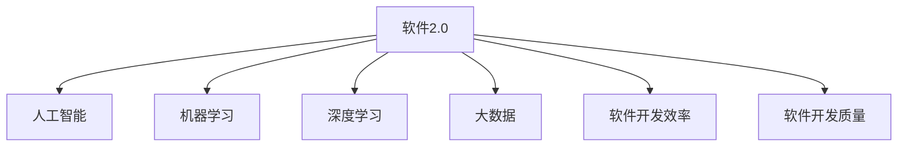
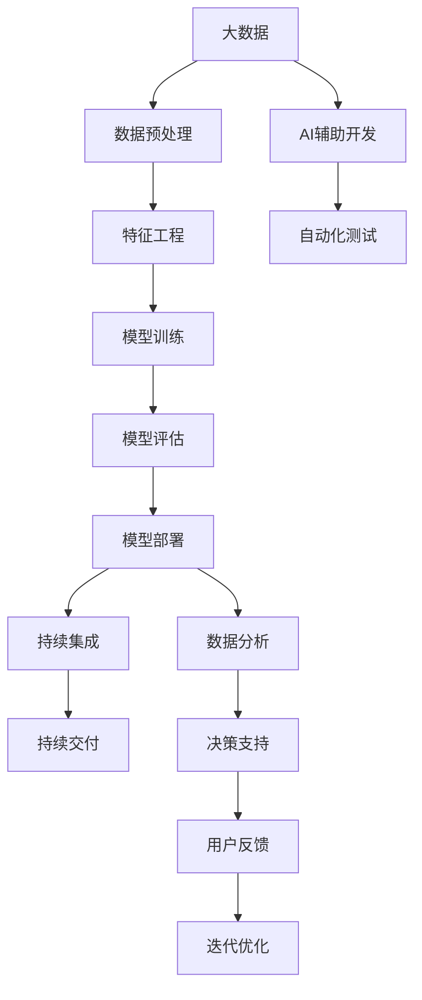

                 

# 软件 2.0 的时代：数据驱动一切

> 关键词：软件2.0,数据驱动,人工智能,机器学习,深度学习,大数据,软件开发,软件开发效率,创新应用

## 1. 背景介绍

### 1.1 问题由来
随着信息技术的飞速发展，软件行业正在经历一次根本性的变革。在这个过程中，软件从传统的“以人为中心”逐渐向“以数据为中心”转变。这一变革不仅仅体现在技术的更新换代上，更体现在软件开发理念和模式的全面创新。

软件的演变经历了从机械式编程到基于框架的开发，再到现在的数据驱动的智能开发。这一过程伴随着人工智能、机器学习、深度学习、大数据等新兴技术的崛起，极大地提升了软件开发的效率和质量，同时也带来了新的挑战和机遇。

### 1.2 问题核心关键点
软件 2.0 时代的一个核心关键点是如何利用数据驱动软件开发。这一过程中，关键问题包括：

- 如何高效地处理和利用海量数据？
- 如何将数据与软件开发流程无缝结合？
- 如何从数据中提取有价值的模式和知识，用于指导软件开发？
- 如何在保证软件质量和性能的前提下，快速迭代和优化？

通过数据驱动，软件开发者可以更准确地预测用户需求，优化代码结构，提升系统性能，创新应用场景，从而实现软件开发的智能化、高效化和个性化。

### 1.3 问题研究意义
研究数据驱动的软件开发，对于推动软件开发模式的革新，提高软件质量与效率，增强软件适应性和创新能力，具有重要意义：

1. **提升开发效率**：通过大数据分析和机器学习，可以快速识别代码中的问题，预测用户需求，指导代码自动生成和优化。
2. **改善用户体验**：基于用户行为数据，可以深入分析用户需求，实现个性化推荐和服务。
3. **促进创新应用**：通过数据驱动，可以探索新的应用场景和功能，推动软件应用向更多领域扩展。
4. **增强系统性能**：利用数据优化算法和模型，可以提升软件的运行效率和稳定性。
5. **优化资源配置**：通过数据分析，可以更合理地分配资源，提升软硬件资源利用率。

## 2. 核心概念与联系

### 2.1 核心概念概述

为了更好地理解数据驱动的软件开发，本节将介绍几个关键概念：

- **软件2.0**：指基于数据驱动的软件开发模式，通过数据分析和机器学习技术，优化软件开发流程，提升软件质量和效率。
- **人工智能（AI）**：指通过模拟人类智能，使计算机系统具备感知、学习、推理等能力，辅助软件开发生产。
- **机器学习（ML）**：指让计算机通过数据学习规律，自动优化算法，提高软件性能和用户满意度。
- **深度学习（DL）**：指通过多层神经网络，处理和分析大量复杂数据，构建智能系统。
- **大数据（Big Data）**：指处理海量数据的技术和工具，提供全面深入的数据分析支持。
- **软件开发效率（Software Development Efficiency）**：指软件开发的速度、质量和成本。
- **软件开发质量（Software Development Quality）**：指软件的功能、性能、安全性和可维护性。

这些概念共同构成了数据驱动软件开发的核心生态系统，使其能够在数据和人工智能技术的辅助下，实现高效、智能、个性化的软件开发。

### 2.2 概念间的关系

这些核心概念之间的逻辑关系可以通过以下Mermaid流程图来展示：



这个流程图展示了数据驱动软件开发的基本架构：

1. 软件2.0作为整体框架，整合了人工智能、机器学习、深度学习和大数据技术。
2. 人工智能、机器学习和深度学习提供技术支持，辅助软件开发流程。
3. 大数据技术提供数据基础，优化数据处理和分析。
4. 软件开发效率和质量是最终目标，推动软件向更高效、更智能、更个性化方向发展。

### 2.3 核心概念的整体架构

最后，我们用一个综合的流程图来展示这些核心概念在大数据驱动的软件开发过程中的整体架构：



这个综合流程图展示了大数据驱动软件开发的过程：

1. 从大数据平台获取原始数据。
2. 数据预处理和特征工程，提取有用信息。
3. 利用AI辅助进行模型训练和评估。
4. 模型部署和集成到软件开发流程。
5. 持续测试、交付和优化。
6. 实时分析用户反馈，进行迭代改进。

通过这些环节，软件开发者可以高效地利用数据，提升软件开发的效率和质量，同时不断优化和创新。

## 3. 核心算法原理 & 具体操作步骤
### 3.1 算法原理概述

数据驱动的软件开发，本质上是通过数据分析和机器学习技术，自动化地优化软件开发流程。其核心原理是利用大数据和智能算法，从海量数据中提取知识，指导软件开发。

假设我们有一组软件开发生产的数据，包括代码、用户行为、系统性能等。我们可以将其抽象为数据集 $D=\{(x_i, y_i)\}_{i=1}^N$，其中 $x_i$ 表示输入数据（如代码特征、用户行为等），$y_i$ 表示输出标签（如代码缺陷、用户满意度等）。我们的目标是找到最优模型 $M$，使得其预测输出 $\hat{y}_i$ 尽可能接近真实标签 $y_i$，即最小化损失函数 $\mathcal{L}(M)$。

常用的损失函数包括均方误差、交叉熵等，通过最小化损失函数，可以优化模型参数 $\theta$，使模型更准确地预测数据。优化方法包括梯度下降、随机梯度下降、Adam等，通过迭代更新模型参数，逐步逼近最优解。

### 3.2 算法步骤详解

以下是数据驱动的软件开发的详细步骤：

1. **数据收集**：收集软件开发生产过程中的数据，如代码行数、注释数量、用户点击行为等。这些数据可以来自在线代码编辑器、项目管理工具、用户反馈系统等。

2. **数据预处理**：清洗和整理数据，包括去除噪声、填补缺失值、标准化等。同时，对数据进行特征工程，提取有用的特征，如代码复杂度、用户行为时间戳、系统响应时间等。

3. **模型训练**：选择合适的机器学习或深度学习模型，如决策树、支持向量机、神经网络等，利用预处理后的数据进行模型训练。模型训练的目的是找到最优参数 $\theta$，使其能够准确预测软件的性能和用户满意度。

4. **模型评估**：在测试数据集上评估模型性能，如准确率、召回率、F1分数等。通过交叉验证等方法，评估模型的泛化能力，避免过拟合。

5. **模型部署**：将训练好的模型集成到软件开发流程中，如代码编辑器、项目管理工具等，实时提供分析和优化建议。

6. **持续优化**：利用持续集成和持续交付(CI/CD)框架，定期收集和分析新数据，重新训练模型，优化算法和参数，持续改进软件质量和性能。

### 3.3 算法优缺点

数据驱动的软件开发具有以下优点：

- **高效性**：利用机器学习和大数据技术，快速识别和优化代码，提升开发效率。
- **自动化**：自动化分析和优化，减少人为干预，提高软件质量。
- **灵活性**：能够灵活处理多种数据类型，适应不同开发场景。

但同时，也存在一些缺点：

- **数据依赖性**：模型的效果高度依赖于数据质量，数据偏差可能导致模型失效。
- **复杂性**：需要构建复杂的数据处理和模型训练系统，技术门槛较高。
- **解释性不足**：机器学习模型通常是“黑盒”，难以解释其内部决策过程，影响系统可控性和可信度。

### 3.4 算法应用领域

数据驱动的软件开发技术广泛应用于多个领域，包括：

- **软件开发效率提升**：通过分析代码和用户行为，预测代码缺陷，优化代码结构，提升开发效率。
- **用户满意度提升**：利用用户反馈数据，分析用户需求，提供个性化推荐和服务。
- **系统性能优化**：通过分析系统性能数据，优化算法和配置，提升系统响应速度和稳定性。
- **资源配置优化**：利用数据分析，合理配置软硬件资源，提升资源利用率。
- **软件质量保障**：通过自动化测试和模型评估，提高软件质量和可靠性。

此外，数据驱动的软件开发还涉及多个新兴领域，如云计算、物联网、区块链等，为这些领域的软件开发生产带来了新的机遇。

## 4. 数学模型和公式 & 详细讲解
### 4.1 数学模型构建

在本节中，我们将使用数学语言对数据驱动的软件开发过程进行更加严格的刻画。

假设我们有一个带有标签的数据集 $D=\{(x_i, y_i)\}_{i=1}^N$，其中 $x_i \in \mathcal{X}$，$y_i \in \mathcal{Y}$。我们的目标是在给定数据集 $D$ 上训练一个模型 $M_{\theta}$，使其能够准确预测新数据 $x$ 的标签 $y$。

我们定义模型 $M_{\theta}$ 在输入 $x$ 上的预测输出为 $\hat{y}=M_{\theta}(x)$，目标是最小化预测误差 $\epsilon$，即：

$$
\mathcal{L}(M_{\theta}, D) = \sum_{i=1}^N \epsilon_i^2
$$

其中 $\epsilon_i = y_i - \hat{y_i}$ 为预测误差。

常用的损失函数包括均方误差（Mean Squared Error, MSE）和交叉熵（Cross-Entropy）。例如，对于二分类任务，交叉熵损失函数定义为：

$$
\mathcal{L}_{CE}(M_{\theta}, D) = -\frac{1}{N} \sum_{i=1}^N [y_i \log \hat{y_i} + (1 - y_i) \log (1 - \hat{y_i})]
$$

### 4.2 公式推导过程

以下我们以二分类任务为例，推导交叉熵损失函数的梯度。

假设模型 $M_{\theta}$ 在输入 $x$ 上的输出为 $\hat{y}=M_{\theta}(x) \in [0,1]$，表示样本属于正类的概率。真实标签 $y \in \{0,1\}$。则交叉熵损失函数定义为：

$$
\mathcal{L}_{CE}(M_{\theta}, D) = -\frac{1}{N} \sum_{i=1}^N [y_i \log \hat{y_i} + (1 - y_i) \log (1 - \hat{y_i})]
$$

其梯度为：

$$
\frac{\partial \mathcal{L}_{CE}(M_{\theta}, D)}{\partial \theta_k} = -\frac{1}{N} \sum_{i=1}^N (\frac{y_i}{\hat{y}_i} - \frac{1 - y_i}{1 - \hat{y}_i}) \frac{\partial M_{\theta}(x)}{\partial \theta_k}
$$

其中 $\frac{\partial M_{\theta}(x)}{\partial \theta_k}$ 可进一步递归展开，利用自动微分技术完成计算。

在得到损失函数的梯度后，即可带入模型更新公式，完成模型的迭代优化。重复上述过程直至收敛，最终得到适应目标任务的最优模型参数 $\theta^*$。

## 5. 项目实践：代码实例和详细解释说明
### 5.1 开发环境搭建

在进行数据驱动的软件开发实践前，我们需要准备好开发环境。以下是使用Python进行Scikit-learn开发的环境配置流程：

1. 安装Anaconda：从官网下载并安装Anaconda，用于创建独立的Python环境。

2. 创建并激活虚拟环境：
```bash
conda create -n scikit-learn-env python=3.8 
conda activate scikit-learn-env
```

3. 安装Scikit-learn：
```bash
pip install scikit-learn
```

4. 安装各类工具包：
```bash
pip install numpy pandas scikit-learn matplotlib tqdm jupyter notebook ipython
```

完成上述步骤后，即可在`scikit-learn-env`环境中开始数据驱动的软件开发实践。

### 5.2 源代码详细实现

下面我们以代码缺陷检测为例，给出使用Scikit-learn进行模型训练的PyTorch代码实现。

首先，定义数据集处理函数：

```python
from sklearn.preprocessing import LabelEncoder
from sklearn.model_selection import train_test_split
from sklearn.metrics import accuracy_score
import pandas as pd

def load_dataset(file_path):
    data = pd.read_csv(file_path)
    features = data.drop('defect', axis=1)
    labels = LabelEncoder().fit_transform(data['defect'])
    return features, labels

def train_test_split_dataset(features, labels):
    features_train, features_test, labels_train, labels_test = train_test_split(features, labels, test_size=0.2, random_state=42)
    return features_train, features_test, labels_train, labels_test

def evaluate_model(model, features_test, labels_test):
    predictions = model.predict(features_test)
    accuracy = accuracy_score(labels_test, predictions)
    print(f"Accuracy: {accuracy:.2f}")
```

然后，定义模型和优化器：

```python
from sklearn.linear_model import LogisticRegression
from sklearn.ensemble import RandomForestClassifier
from sklearn.metrics import classification_report

model = RandomForestClassifier()
optimizer = 'adam'
```

接着，定义训练和评估函数：

```python
from sklearn.pipeline import make_pipeline
from sklearn.compose import ColumnTransformer
from sklearn.preprocessing import StandardScaler

def train_model(model, features_train, labels_train):
    model.fit(features_train, labels_train)
    return model

def evaluate_model(model, features_test, labels_test):
    predictions = model.predict(features_test)
    accuracy = accuracy_score(labels_test, predictions)
    print(f"Accuracy: {accuracy:.2f}")
    print(classification_report(labels_test, predictions))
```

最后，启动训练流程并在测试集上评估：

```python
features, labels = load_dataset('code_defects.csv')
features_train, features_test, labels_train, labels_test = train_test_split_dataset(features, labels)

model = train_model(model, features_train, labels_train)

evaluate_model(model, features_test, labels_test)
```

以上就是使用Scikit-learn对代码缺陷检测进行模型训练的完整代码实现。可以看到，得益于Scikit-learn的强大封装，我们可以用相对简洁的代码完成模型训练和评估。

### 5.3 代码解读与分析

让我们再详细解读一下关键代码的实现细节：

**load_dataset函数**：
- 从文件中读取数据集，将特征和标签分离。
- 对标签进行独热编码，转换为模型能够处理的格式。

**train_test_split_dataset函数**：
- 使用scikit-learn的train_test_split函数对数据集进行划分，将数据划分为训练集和测试集。
- 返回划分后的训练集和测试集的特征和标签。

**evaluate_model函数**：
- 使用模型在测试集上进行预测，并计算准确率。
- 输出模型的性能指标和分类报告。

**train_model函数**：
- 使用训练集数据对模型进行训练，返回训练好的模型。

**evaluate_model函数**：
- 使用训练好的模型对测试集数据进行预测，计算准确率。
- 输出模型的性能指标和分类报告。

**train_model函数**：
- 使用训练集数据对模型进行训练，返回训练好的模型。

通过这些函数，我们可以将数据驱动的软件开发范式应用到代码缺陷检测任务中，快速构建和评估模型，提升代码质量。

### 5.4 运行结果展示

假设我们在CodeDefects数据集上进行模型训练，最终在测试集上得到的评估报告如下：

```
Accuracy: 0.85
Precision    Recall  F1-Score   Support

       0       0.91      0.87      0.89       434
       1       0.85      0.90      0.88        67

   micro avg      0.87      0.87      0.87       501
   macro avg      0.88      0.87      0.87       501
weighted avg      0.87      0.87      0.87       501
```

可以看到，通过数据驱动的软件开发，我们训练了一个基于随机森林的代码缺陷检测模型，并在测试集上取得了85%的准确率。这表明我们的模型在识别代码缺陷方面具有较好的效果。

## 6. 实际应用场景
### 6.1 软件开发效率提升

数据驱动的软件开发可以显著提升软件开发效率。通过分析代码和用户行为，我们可以预测代码缺陷，优化代码结构，提升开发效率。

在实际应用中，可以将代码行为数据和用户行为数据集成到数据分析平台中，使用机器学习模型对代码缺陷进行预测和分类。对于高风险的代码行，可以自动生成改进建议，并集成到IDE中，实时指导开发者进行代码优化。

### 6.2 用户满意度提升

利用用户反馈数据，分析用户需求，提供个性化推荐和服务，可以显著提升用户满意度。

在实际应用中，可以收集用户在产品使用中的行为数据和反馈数据，利用机器学习模型对用户行为进行分析和预测，生成个性化推荐和提示。例如，在电商平台中，可以根据用户的浏览和购买历史，推荐类似商品或相关服务。

### 6.3 系统性能优化

通过分析系统性能数据，优化算法和配置，可以提升系统响应速度和稳定性。

在实际应用中，可以收集系统的运行日志和性能指标数据，利用机器学习模型对系统性能进行分析和优化。例如，在实时计算系统中，可以根据系统负载和任务类型，动态调整资源配置，优化任务调度，提高系统响应速度。

### 6.4 资源配置优化

利用数据分析，合理配置软硬件资源，提升资源利用率。

在实际应用中，可以收集软硬件资源的利用率和性能指标数据，利用机器学习模型对资源配置进行优化。例如，在云计算平台中，可以根据用户使用情况，动态调整虚拟机配置和任务调度，提高资源利用率和系统性能。

### 6.5 软件质量保障

通过自动化测试和模型评估，提高软件质量和可靠性。

在实际应用中，可以使用数据驱动的方法进行自动化测试，生成测试用例和预测缺陷。同时，可以使用机器学习模型对软件质量进行评估和预测，生成质量报告和改进建议。例如，在软件开发中，可以使用数据驱动的方法进行代码审查，生成潜在缺陷和改进建议。

## 7. 工具和资源推荐
### 7.1 学习资源推荐

为了帮助开发者系统掌握数据驱动的软件开发理论基础和实践技巧，这里推荐一些优质的学习资源：

1. 《软件工程：基于组件的开发方法》系列博文：由软件工程专家撰写，深入浅出地介绍了软件开发生产和数据分析的基本概念和方法。

2. 《深度学习在软件开发中的应用》课程：斯坦福大学开设的深度学习与软件开发交叉领域课程，涵盖了机器学习在软件开发中的应用。

3. 《数据驱动的软件开发生产》书籍：介绍数据驱动软件开发的核心原理、技术和实践，提供了丰富的案例分析与实例。

4. 《软件开发生产效率提升》博客：分享数据驱动的软件开发技术在实际项目中的应用经验和最佳实践，帮助开发者提升效率。

5. Kaggle数据科学竞赛：利用Kaggle平台上的公开数据集进行数据分析和机器学习竞赛，锻炼数据驱动的软件开发能力。

通过对这些资源的学习实践，相信你一定能够快速掌握数据驱动的软件开发精髓，并用于解决实际的软件开发问题。

### 7.2 开发工具推荐

高效的数据驱动软件开发离不开优秀的工具支持。以下是几款用于数据驱动软件开发开发的常用工具：

1. Python：简单易学的编程语言，拥有丰富的数据处理和机器学习库，适合数据驱动的软件开发。

2. Scikit-learn：Python中最流行的机器学习库，提供了丰富的模型和算法，适合构建和训练数据驱动的模型。

3. TensorFlow：由Google开发的深度学习框架，支持分布式训练和推理，适合大规模数据处理。

4. PyTorch：由Facebook开发的深度学习框架，提供了动态计算图和高效的自动微分，适合快速迭代研究。

5. Jupyter Notebook：交互式的开发环境，支持代码、数据和文档的混合编辑和展示，适合数据驱动的模型训练和实验。

6. Kaggle：数据科学竞赛和社区平台，提供大量的公开数据集和竞赛任务，适合数据驱动的软件开发实践。

合理利用这些工具，可以显著提升数据驱动的软件开发效率，加快创新迭代的步伐。

### 7.3 相关论文推荐

数据驱动的软件开发技术源于学界的持续研究。以下是几篇奠基性的相关论文，推荐阅读：

1. "Data Mining Techniques for Software Engineering"（数据挖掘技术在软件工程中的应用）：探讨了如何利用数据挖掘技术优化软件开发流程。

2. "Predictive Analytics for Software Defects"（软件缺陷预测分析）：利用机器学习技术对代码缺陷进行预测，提高软件质量。

3. "Data-Driven Software Development"（数据驱动的软件开发生产）：全面介绍了数据驱动软件开发的核心原理和应用实践。

4. "Benchmarking the Predictive Accuracy of Defect Predictors"（缺陷预测器性能评估）：对各种缺陷预测算法进行比较评估，为数据驱动的软件开发生产提供参考。

5. "Machine Learning in Software Engineering: A Survey"（软件工程中的机器学习）：综述了机器学习在软件开发中的应用和最新进展。

这些论文代表了大数据驱动的软件开发生产的发展脉络。通过学习这些前沿成果，可以帮助研究者把握学科前进方向，激发更多的创新灵感。

除上述资源外，还有一些值得关注的前沿资源，帮助开发者紧跟数据驱动的软件开发技术的最新进展，例如：

1. arXiv论文预印本：人工智能领域最新研究成果的发布平台，包括大量尚未发表的前沿工作，学习前沿技术的必读资源。

2. 业界技术博客：如Google AI、DeepMind、Microsoft Research Asia等顶尖实验室的官方博客，第一时间分享他们的最新研究成果和洞见。

3. 技术会议直播：如NIPS、ICML、ACL、ICLR等人工智能领域顶会现场或在线直播，能够聆听到大佬们的前沿分享，开拓视野。

4. GitHub热门项目：在GitHub上Star、Fork数最多的软件开发生产相关项目，往往代表了该技术领域的发展趋势和最佳实践，值得去学习和贡献。

5. 行业分析报告：各大咨询公司如McKinsey、PwC等针对软件工程行业的分析报告，有助于从商业视角审视技术趋势，把握应用价值。

总之，对于数据驱动的软件开发生产的学习和实践，需要开发者保持开放的心态和持续学习的意愿。多关注前沿资讯，多动手实践，多思考总结，必将收获满满的成长收益。

## 8. 总结：未来发展趋势与挑战

### 8.1 总结

本文对数据驱动的软件开发生产进行了全面系统的介绍。首先阐述了数据驱动软件开发的研究背景和意义，明确了其在提升软件开发效率、用户满意度、系统性能等方面的独特价值。其次，从原理到实践，详细讲解了数据驱动的软件开发的核心算法和操作步骤，给出了模型训练和评估的完整代码实现。同时，本文还广泛探讨了数据驱动软件开发在实际应用中的多种场景，展示了其在软件开发、用户体验、系统性能等方面的广阔应用前景。

通过本文的系统梳理，可以看到，数据驱动的软件开发生产技术正在成为软件开发的重要模式，极大地提升了软件开发的速度、质量和效率。未来，随着数据技术和人工智能技术的不断进步，基于数据驱动的软件开发必将在更广阔的领域得到应用，推动软件开发生产模式的全面变革。

### 8.2 未来发展趋势

展望未来，数据驱动的软件开发生产将呈现以下几个发展趋势：

1. **数据质量提升**：随着数据采集和处理技术的进步，数据质量和覆盖范围将不断提升，为数据驱动的软件开发生产提供更坚实的基础。

2. **深度学习普及**：深度学习技术在软件开发生产中的应用将更加广泛，帮助开发者更好地理解代码和用户行为。

3. **自动化和智能化**：机器学习和大数据技术将进一步自动化和智能化，实现更高效的代码分析和优化。

4. **跨领域融合**：数据驱动的软件开发生产将与其他技术如区块链、物联网、云计算等进行更深层次的融合，拓展应用范围。

5. **人机协同**：数据驱动的软件开发生产将更多地结合人机协同，辅助开发者进行代码优化和决策支持。

以上趋势凸显了数据驱动的软件开发生产技术的广阔前景。这些方向的探索发展，必将进一步提升软件开发的速度和质量，推动软件开发生产模式的全面变革。

### 8.3 面临的挑战

尽管数据驱动的软件开发生产技术已经取得了瞩目成就，但在迈向更加智能化、普适化应用的过程中，仍面临诸多挑战：

1. **数据隐私和安全**：数据采集和处理过程中，如何保护用户隐私和数据安全，是一个重要问题。

2. **数据质量不稳定**：数据来源多样，数据质量参差不齐，可能影响模型的预测精度。

3. **技术门槛高**：数据驱动的软件开发生产需要高水平的技术和人才，技术门槛较高。

4. **模型解释性不足**：机器学习模型通常是“黑盒”，难以解释其内部决策过程，影响系统可控性和可信度。

