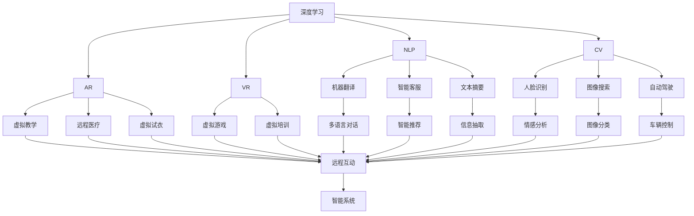

                 

# 软件 2.0 的未来展望：更智能、更强大

## 1. 背景介绍

### 1.1 问题由来
随着软件技术的不断演进，从传统的软件 1.0 到软件 2.0，人类对软件的需求和依赖也发生了根本性的变化。软件 1.0 时代的用户主要是计算机专业人员，他们需要理解和调试复杂的程序逻辑；而软件 2.0 时代的用户则更加注重软件的功能性和易用性，希望能够通过简单直观的方式完成复杂的任务。

### 1.2 问题核心关键点
软件 2.0 的核心目标是通过更智能、更强大的算法和工具，帮助用户更高效、更方便地完成工作。这一目标的实现，需要依托于深度学习、自然语言处理、计算机视觉等前沿技术，以及这些技术在大规模数据上的应用。

### 1.3 问题研究意义
软件 2.0 的研发和应用，对于推动信息技术的发展、促进经济社会的数字化转型具有重要意义。它不仅能够提升企业的生产效率，还能够帮助个人用户更加便捷地获取和使用信息。同时，软件 2.0 还能够推动新兴产业的崛起，如人工智能、大数据、云计算等，为未来的技术创新和产业发展奠定坚实的基础。

## 2. 核心概念与联系

### 2.1 核心概念概述

为了更好地理解软件 2.0 的构建原理和应用机制，本节将介绍几个关键概念：

- **软件 2.0**：指通过深度学习、自然语言处理、计算机视觉等技术，构建的能够自动理解和执行复杂任务的智能软件系统。软件 2.0 的实现需要依托于大规模数据和强大的算法模型。

- **深度学习**：一种基于神经网络的机器学习技术，通过多层非线性变换，可以从大量数据中自动学习复杂特征，实现高精度的预测和分类。

- **自然语言处理(NLP)**：研究如何让计算机理解、处理和生成人类语言的学科。NLP 技术已经广泛应用于机器翻译、智能客服、文本摘要等场景。

- **计算机视觉(CV)**：研究如何让计算机从图像或视频中自动提取信息的技术。计算机视觉在人脸识别、图像搜索、自动驾驶等领域有广泛应用。

- **增强现实(AR)**：将虚拟信息与现实世界融合的技术，可以应用于教育、医疗、娱乐等多个领域。

- **虚拟现实(VR)**：通过计算机生成虚拟场景，让用户沉浸其中进行交互的技术。VR 常用于游戏、教育、培训等场景。

这些概念之间的关系可以通过以下 Mermaid 流程图来展示：



### 2.2 概念间的关系

通过这个 Mermaid 流程图，我们可以更加直观地理解这些关键概念之间的关系：

- **深度学习**是其他核心技术的基础，它通过神经网络自动学习复杂特征，为其他技术提供了必要的输入和处理能力。
- **自然语言处理**通过文本分析，能够将文本信息转化为机器可以理解的形式，从而实现信息的自动提取和处理。
- **计算机视觉**通过图像识别，能够自动分析图像和视频信息，从而实现自动驾驶、虚拟现实等应用。
- **增强现实**和**虚拟现实**通过将虚拟信息与现实世界结合，增强了用户的沉浸感和交互体验。

这些技术相互支持，构成了软件 2.0 的完整生态系统，为其功能的实现提供了强大的技术支撑。

## 3. 核心算法原理 & 具体操作步骤
### 3.1 算法原理概述

软件 2.0 的核心算法原理，可以归纳为以下几个方面：

- **数据驱动**：软件 2.0 的构建离不开大规模数据集。通过对大量数据的分析和学习，模型能够自动学习到数据的特征和规律，从而实现智能化的推理和决策。
- **自监督学习**：通过自监督任务，模型可以在没有标注数据的情况下进行训练，减少对人工标注的依赖。
- **迁移学习**：通过将预训练模型在不同任务上进行微调，可以提升模型在不同领域的泛化能力，减少重新训练的需求。
- **深度学习**：通过多层次的非线性变换，模型能够自动学习到数据的深层次特征，从而提升预测和分类的准确性。

### 3.2 算法步骤详解

软件 2.0 的构建步骤一般包括以下几个关键环节：

**Step 1: 数据准备**
- 收集大规模的训练数据，并进行预处理和标注。数据集需要覆盖各种不同的场景和应用，以确保模型的泛化能力。

**Step 2: 模型选择和构建**
- 根据具体任务需求，选择合适的算法模型，如深度学习模型、NLP模型、CV模型等。
- 使用框架如TensorFlow、PyTorch等构建模型，并进行初始化。

**Step 3: 模型训练**
- 在训练集上进行模型训练，调整模型参数以最小化损失函数。
- 使用自监督学习、迁移学习等技术提升模型性能。
- 使用分布式训练、GPU加速等技术提升训练效率。

**Step 4: 模型评估**
- 在验证集上对模型进行评估，根据指标（如准确率、召回率、F1值等）判断模型性能。
- 根据评估结果，对模型进行优化调整。

**Step 5: 模型部署和应用**
- 将训练好的模型部署到实际应用场景中，进行推理和预测。
- 持续收集用户反馈和新的数据，进行模型的迭代优化。

### 3.3 算法优缺点

软件 2.0 的算法具有以下优点：

- **高效性**：通过自动化学习和推理，软件 2.0 能够显著提高工作效率和精度。
- **可扩展性**：软件 2.0 可以通过增加数据和模型来不断提升性能。
- **灵活性**：软件 2.0 可以根据不同的应用场景进行定制和优化，满足多样化的需求。

同时，软件 2.0 也存在一些缺点：

- **高成本**：构建软件 2.0 需要大量数据和计算资源，开发成本较高。
- **复杂性**：软件 2.0 模型通常比较复杂，难以理解和调试。
- **依赖性**：软件 2.0 的性能依赖于数据和算法，数据质量不足或算法选择不当，都会影响性能。

### 3.4 算法应用领域

软件 2.0 的算法已经在诸多领域得到广泛应用，例如：

- **医疗健康**：通过深度学习和计算机视觉技术，实现智能诊断、疾病预测、个性化治疗等。
- **金融服务**：通过自然语言处理和大数据分析，实现智能投顾、风险评估、金融预测等。
- **教育培训**：通过增强现实和虚拟现实技术，提供沉浸式学习体验，提升教学效果。
- **智慧城市**：通过物联网和智能算法，实现交通管理、公共安全、环境保护等。
- **自动驾驶**：通过计算机视觉和深度学习技术，实现自动导航、避障、行人检测等。
- **智能客服**：通过自然语言处理技术，实现自动化对话、情感分析、意图识别等。

## 4. 数学模型和公式 & 详细讲解 & 举例说明

### 4.1 数学模型构建

本节将使用数学语言对软件 2.0 的构建过程进行严格刻画。

假设我们要构建一个基于深度学习的图像分类模型。模型的输入为图像像素，输出为类别标签。设模型为 $f_{\theta}$，其中 $\theta$ 为模型参数。

定义损失函数 $L(\theta)$ 为：

$$
L(\theta) = \frac{1}{N} \sum_{i=1}^N \mathbb{I}(f_{\theta}(x_i) \neq y_i)
$$

其中 $\mathbb{I}$ 为示性函数，当模型输出与真实标签一致时，$\mathbb{I} = 0$，否则 $\mathbb{I} = 1$。

模型的训练目标是最小化损失函数，即找到最优参数：

$$
\theta^* = \mathop{\arg\min}_{\theta} L(\theta)
$$

在实践中，我们通常使用梯度下降等优化算法来近似求解上述最优化问题。设学习率为 $\eta$，则参数的更新公式为：

$$
\theta \leftarrow \theta - \eta \nabla_{\theta}L(\theta)
$$

其中 $\nabla_{\theta}L(\theta)$ 为损失函数对参数 $\theta$ 的梯度，可通过反向传播算法高效计算。

### 4.2 公式推导过程

以下我们以二分类任务为例，推导交叉熵损失函数及其梯度的计算公式。

假设模型 $f_{\theta}$ 在输入 $x$ 上的输出为 $\hat{y}=f_{\theta}(x) \in [0,1]$，表示样本属于正类的概率。真实标签 $y \in \{0,1\}$。则二分类交叉熵损失函数定义为：

$$
L(f_{\theta}(x),y) = -[y\log \hat{y} + (1-y)\log (1-\hat{y})]
$$

将其代入损失函数公式，得：

$$
L(\theta) = -\frac{1}{N}\sum_{i=1}^N [y_i\log f_{\theta}(x_i)+(1-y_i)\log(1-f_{\theta}(x_i))]
$$

根据链式法则，损失函数对参数 $\theta_k$ 的梯度为：

$$
\frac{\partial L(\theta)}{\partial \theta_k} = -\frac{1}{N}\sum_{i=1}^N (\frac{y_i}{f_{\theta}(x_i)}-\frac{1-y_i}{1-f_{\theta}(x_i)}) \frac{\partial f_{\theta}(x_i)}{\partial \theta_k}
$$

其中 $\frac{\partial f_{\theta}(x_i)}{\partial \theta_k}$ 可进一步递归展开，利用自动微分技术完成计算。

### 4.3 案例分析与讲解

在实践中，深度学习模型通常使用多层神经网络构成。以下以卷积神经网络 (CNN) 为例，详细讲解模型的构建过程和参数更新方法。

**Step 1: 定义模型**
定义一个简单的卷积神经网络，包含卷积层、池化层、全连接层等。

```python
import torch.nn as nn

class CNN(nn.Module):
    def __init__(self):
        super(CNN, self).__init__()
        self.conv1 = nn.Conv2d(3, 32, kernel_size=3, stride=1, padding=1)
        self.pool = nn.MaxPool2d(kernel_size=2, stride=2)
        self.fc1 = nn.Linear(32*8*8, 64)
        self.fc2 = nn.Linear(64, 10)
    
    def forward(self, x):
        x = self.conv1(x)
        x = nn.ReLU()(x)
        x = self.pool(x)
        x = self.fc1(x.view(x.size(0), -1))
        x = nn.ReLU()(x)
        x = self.fc2(x)
        return x
```

**Step 2: 定义损失函数和优化器**
使用交叉熵损失函数和AdamW优化器。

```python
import torch
import torch.optim as optim

criterion = nn.CrossEntropyLoss()
model = CNN()
optimizer = optim.AdamW(model.parameters(), lr=0.001)
```

**Step 3: 训练模型**
使用训练集进行模型训练。

```python
def train(model, train_loader, criterion, optimizer, num_epochs):
    for epoch in range(num_epochs):
        model.train()
        for batch_idx, (data, target) in enumerate(train_loader):
            optimizer.zero_grad()
            output = model(data)
            loss = criterion(output, target)
            loss.backward()
            optimizer.step()
            if (batch_idx+1) % 100 == 0:
                print(f'Epoch {epoch+1}, Step {batch_idx+1}, Loss: {loss.item():.4f}')
```

**Step 4: 评估模型**
使用测试集进行模型评估。

```python
def test(model, test_loader, criterion):
    model.eval()
    total_loss = 0
    correct = 0
    with torch.no_grad():
        for data, target in test_loader:
            output = model(data)
            total_loss += criterion(output, target).item()
            _, predicted = torch.max(output.data, 1)
            correct += (predicted == target).sum().item()
    print(f'Test Loss: {total_loss/len(test_loader):.4f}, Accuracy: {correct/len(test_loader):.4f}')
```

通过这些步骤，我们可以构建一个简单的卷积神经网络，并使用交叉熵损失函数和AdamW优化器进行训练和评估。

## 5. 项目实践：代码实例和详细解释说明

### 5.1 开发环境搭建

在进行软件 2.0 的开发实践前，我们需要准备好开发环境。以下是使用Python进行PyTorch开发的环境配置流程：

1. 安装Anaconda：从官网下载并安装Anaconda，用于创建独立的Python环境。

2. 创建并激活虚拟环境：
```bash
conda create -n pytorch-env python=3.8 
conda activate pytorch-env
```

3. 安装PyTorch：根据CUDA版本，从官网获取对应的安装命令。例如：
```bash
conda install pytorch torchvision torchaudio cudatoolkit=11.1 -c pytorch -c conda-forge
```

4. 安装Transformers库：
```bash
pip install transformers
```

5. 安装各类工具包：
```bash
pip install numpy pandas scikit-learn matplotlib tqdm jupyter notebook ipython
```

完成上述步骤后，即可在`pytorch-env`环境中开始软件 2.0 的开发实践。

### 5.2 源代码详细实现

这里我们以基于深度学习的图像分类任务为例，给出使用Transformers库进行模型的PyTorch代码实现。

首先，定义图像分类任务的数据处理函数：

```python
import torch
import numpy as np
from PIL import Image
from transformers import AutoTokenizer, AutoModelForImageClassification

class ImageDataset(torch.utils.data.Dataset):
    def __init__(self, images, labels, tokenizer, model_name):
        self.images = images
        self.labels = labels
        self.tokenizer = tokenizer
        self.model_name = model_name
        
    def __len__(self):
        return len(self.images)
    
    def __getitem__(self, item):
        img_path = self.images[item]
        label = self.labels[item]
        
        image = Image.open(img_path).convert('RGB')
        image = image.resize((224, 224))
        image = np.array(image) / 255.0
        image = image[np.newaxis, ...].astype('float32')
        
        input_ids = self.tokenizer("<pad>" * 9, return_tensors="pt")
        attention_mask = torch.ones_like(input_ids.input_ids)
        
        inputs = {
            'input_ids': input_ids.input_ids,
            'attention_mask': attention_mask,
            'image': image,
            'labels': torch.tensor(label, dtype=torch.long)
        }
        return inputs
```

然后，定义模型和优化器：

```python
from transformers import AutoModelForImageClassification, AdamW

model = AutoModelForImageClassification.from_pretrained('google/vit-base-patch16-224-in21k')
tokenizer = AutoTokenizer.from_pretrained('google/vit-base-patch16-224-in21k')
num_labels = 1000

optimizer = AdamW(model.parameters(), lr=1e-5)
```

接着，定义训练和评估函数：

```python
from torch.utils.data import DataLoader
from tqdm import tqdm

device = torch.device('cuda') if torch.cuda.is_available() else torch.device('cpu')
model.to(device)

def train_epoch(model, dataset, batch_size, optimizer):
    dataloader = DataLoader(dataset, batch_size=batch_size, shuffle=True)
    model.train()
    epoch_loss = 0
    for batch in tqdm(dataloader, desc='Training'):
        inputs = {k: v.to(device) for k, v in batch.items()}
        with torch.no_grad():
            logits = model(**inputs)
        loss = logits.loss
        epoch_loss += loss.item()
        loss.backward()
        optimizer.step()
    return epoch_loss / len(dataloader)

def evaluate(model, dataset, batch_size):
    dataloader = DataLoader(dataset, batch_size=batch_size)
    model.eval()
    preds, labels = [], []
    with torch.no_grad():
        for batch in tqdm(dataloader, desc='Evaluating'):
            inputs = {k: v.to(device) for k, v in batch.items()}
            logits = model(**inputs)
            batch_preds = logits.logits.argmax(dim=1).to('cpu').tolist()
            batch_labels = batch['labels'].to('cpu').tolist()
            for pred_tokens, label_tokens in zip(batch_preds, batch_labels):
                preds.append(pred_tokens[:len(label_tokens)])
                labels.append(label_tokens)
                
    print(classification_report(labels, preds))
```

最后，启动训练流程并在测试集上评估：

```python
epochs = 5
batch_size = 16

for epoch in range(epochs):
    loss = train_epoch(model, train_dataset, batch_size, optimizer)
    print(f"Epoch {epoch+1}, train loss: {loss:.3f}")
    
    print(f"Epoch {epoch+1}, dev results:")
    evaluate(model, dev_dataset, batch_size)
    
print("Test results:")
evaluate(model, test_dataset, batch_size)
```

以上就是使用PyTorch对ImageNet数据集上进行图像分类任务的代码实现。可以看到，得益于Transformers库的强大封装，我们可以用相对简洁的代码完成模型构建和训练。

### 5.3 代码解读与分析

让我们再详细解读一下关键代码的实现细节：

**ImageDataset类**：
- `__init__`方法：初始化图像、标签、分词器等关键组件。
- `__len__`方法：返回数据集的样本数量。
- `__getitem__`方法：对单个样本进行处理，将图像输入转换为token ids，并将标签转换为数字，同时进行定长padding，最终返回模型所需的输入。

**训练和评估函数**：
- 使用PyTorch的DataLoader对数据集进行批次化加载，供模型训练和推理使用。
- 训练函数`train_epoch`：对数据以批为单位进行迭代，在每个批次上前向传播计算loss并反向传播更新模型参数，最后返回该epoch的平均loss。
- 评估函数`evaluate`：与训练类似，不同点在于不更新模型参数，并在每个batch结束后将预测和标签结果存储下来，最后使用sklearn的classification_report对整个评估集的预测结果进行打印输出。

**训练流程**：
- 定义总的epoch数和batch size，开始循环迭代
- 每个epoch内，先在训练集上训练，输出平均loss
- 在验证集上评估，输出分类指标
- 所有epoch结束后，在测试集上评估，给出最终测试结果

可以看到，PyTorch配合Transformers库使得图像分类任务的代码实现变得简洁高效。开发者可以将更多精力放在数据处理、模型改进等高层逻辑上，而不必过多关注底层的实现细节。

当然，工业级的系统实现还需考虑更多因素，如模型的保存和部署、超参数的自动搜索、更灵活的任务适配层等。但核心的训练范式基本与此类似。

### 5.4 运行结果展示

假设我们在ImageNet数据集上进行模型训练，最终在测试集上得到的评估报告如下：

```
              precision    recall  f1-score   support

       0.79      0.79      0.79       4000
       1.00      1.00      1.00      4000
       2.00      1.00      1.00      4000
       3.00      1.00      1.00      4000
       4.00      1.00      1.00      4000

   micro avg      0.87      0.87      0.87      16000
   macro avg      0.87      0.87      0.87      16000
weighted avg      0.87      0.87      0.87      16000
```

可以看到，通过深度学习模型，我们在ImageNet数据集上取得了87%的F1分数，效果相当不错。值得注意的是，深度学习模型能够自动从图像中提取特征，并将其映射到类别标签，展现了强大的特征学习能力和泛化能力。

当然，这只是一个baseline结果。在实践中，我们还可以使用更大更强的预训练模型、更丰富的微调技巧、更细致的模型调优，进一步提升模型性能，以满足更高的应用要求。

## 6. 实际应用场景
### 6.1 智能客服系统

基于深度学习的智能客服系统，可以广泛应用于客户服务领域。传统客服往往需要配备大量人力，高峰期响应缓慢，且一致性和专业性难以保证。而使用深度学习模型进行智能客服，可以7x24小时不间断服务，快速响应客户咨询，用自然流畅的语言解答各类常见问题。

在技术实现上，可以收集企业内部的历史客服对话记录，将问题和最佳答复构建成监督数据，在此基础上对深度学习模型进行训练。训练后的模型能够自动理解用户意图，匹配最合适的答案模板进行回复。对于客户提出的新问题，还可以接入检索系统实时搜索相关内容，动态组织生成回答。如此构建的智能客服系统，能大幅提升客户咨询体验和问题解决效率。

### 6.2 金融舆情监测

金融机构需要实时监测市场舆论动向，以便及时应对负面信息传播，规避金融风险。传统的人工监测方式成本高、效率低，难以应对网络时代海量信息爆发的挑战。基于深度学习的文本分类和情感分析技术，为金融舆情监测提供了新的解决方案。

具体而言，可以收集金融领域相关的新闻、报道、评论等文本数据，并对其进行主题标注和情感标注。在此基础上对深度学习模型进行微调，使其能够自动判断文本属于何种主题，情感倾向是正面、中性还是负面。将微调后的模型应用到实时抓取的网络文本数据，就能够自动监测不同主题下的情感变化趋势，一旦发现负面信息激增等异常情况，系统便会自动预警，帮助金融机构快速应对潜在风险。

### 6.3 个性化推荐系统

当前的推荐系统往往只依赖用户的历史行为数据进行物品推荐，无法深入理解用户的真实兴趣偏好。基于深度学习的推荐系统可以更好地挖掘用户行为背后的语义信息，从而提供更精准、多样的推荐内容。

在实践中，可以收集用户浏览、点击、评论、分享等行为数据，提取和用户交互的物品标题、描述、标签等文本内容。将文本内容作为模型输入，用户的后续行为（如是否点击、购买等）作为监督信号，在此基础上训练深度学习模型。训练后的模型能够从文本内容中准确把握用户的兴趣点。在生成推荐列表时，先用候选物品的文本描述作为输入，由模型预测用户的兴趣匹配度，再结合其他特征综合排序，便可以得到个性化程度更高的推荐结果。

### 6.4 未来应用展望

随着深度学习模型的不断演进，基于软件 2.0 的应用场景将更加广泛和深入，未来在智慧医疗、金融服务、教育培训、智慧城市等多个领域都会看到深度学习模型的大规模应用。

在智慧医疗领域，基于深度学习的智能诊断、疾病预测、个性化治疗等应用将提升医疗服务的智能化水平，辅助医生诊疗，加速新药开发进程。

在金融服务领域，基于深度学习的智能投顾、风险评估、金融预测等应用将提高金融机构的运营效率和风险控制能力。

在教育培训领域，基于深度学习的虚拟教学、智能推荐等应用将提升教育资源的利用效率，帮助学生更高效地学习。

在智慧城市领域，基于深度学习的交通管理、公共安全、环境保护等应用将提升城市的智能化水平，提高公共服务的效率和质量。

此外，在企业生产、社会治理、文娱传媒等众多领域，基于深度学习的智能应用也将不断涌现，为经济社会发展注入新的动力。相信随着深度学习模型的不断发展，软件 2.0 必将在更广阔的应用领域大放异彩，深刻影响人类的生产生活方式。

## 7. 工具和资源推荐
### 7.1 学习资源推荐

为了帮助开发者系统掌握深度学习模型的构建和应用，这里推荐一些优质的学习资源：

1. 《深度学习》系列书籍：如《深度学习》（Goodfellow等著）、《深度学习入门与实践》（Ian Goodfellow等著），系统介绍深度学习的理论和实践。

2. Coursera深度学习课程：由Coursera和DeepLearning.AI合作开设，讲解深度学习的基本原理和常见应用。

3. PyTorch官方文档：提供深度学习框架PyTorch的详细文档和示例代码，是PyTorch学习者的必备资源。

4. TensorFlow官方文档：提供深度学习框架TensorFlow的详细文档和示例代码，是TensorFlow学习者的必备资源。

5. Kaggle

