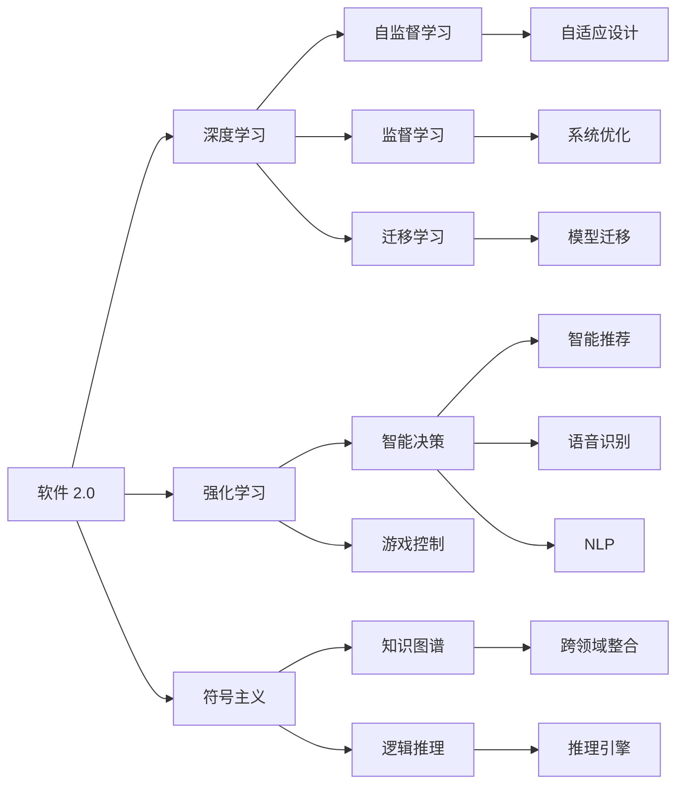
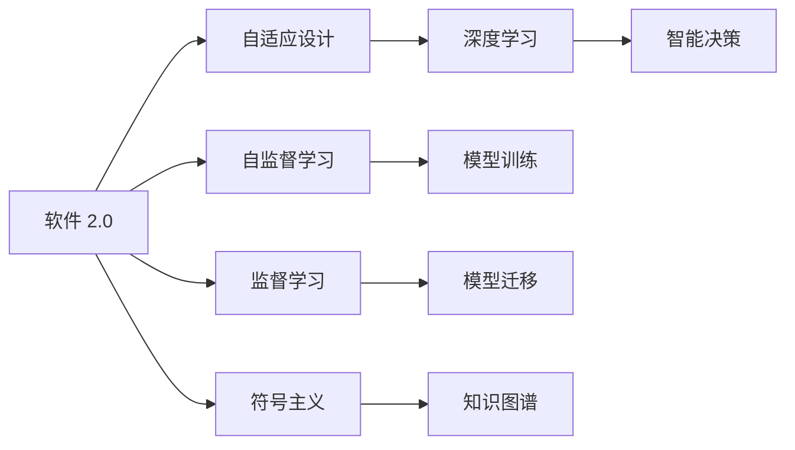
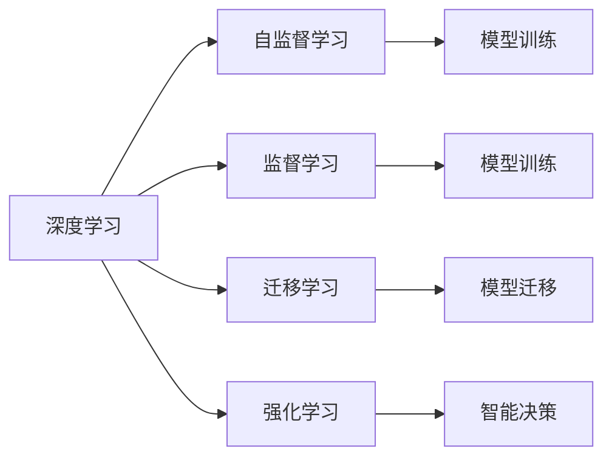
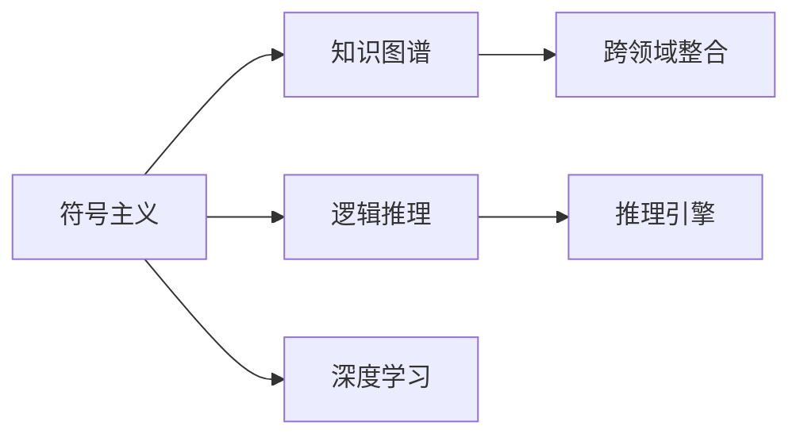
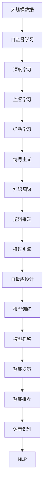

                 

# 软件 2.0 的未来愿景：创造更美好的世界

## 1. 背景介绍

### 1.1 问题由来

在过去的几十年里，计算机软件的发展经历了从最初的软件 1.0 到现代的软件 2.0 的巨大变迁。软件 1.0 时代的开发者需要从头开始编写代码，开发周期长，出错率高。而软件 2.0 时代，开发者借助丰富的开源库、框架和工具，大幅提升了编程效率，构建了众多高质量的软件系统。

然而，尽管软件 2.0 已经大大降低了软件开发门槛，带来了前所未有的应用规模和创新速度，但其根本仍依赖于人类工程师的设计和编码，无法完全摆脱人类思维的局限性。这种模式带来的不仅是时间、成本的巨大浪费，更是创新潜力的瓶颈。因此，探索一种全新的、自我进化的软件形态成为计算机科学界和产业界共同关心的课题。

### 1.2 问题核心关键点

软件 2.0 的根本问题在于其无法自我进化，需要依靠人类设计师和开发者不断迭代和优化，才能适应新的应用场景和技术要求。因此，实现软件的自我进化，即软件 2.0 的核心目标，是计算机科学和人工智能研究的一个重要方向。

这一目标的实现涉及到以下几个关键点：

- **自我学习与适应**：软件能够从环境中获取数据，通过自我学习不断适应新的需求和变化。
- **自动化设计**：软件能够自动生成设计方案，自动选择最优的架构和算法，从而减少人工设计的重复性。
- **自我优化**：软件能够自动分析运行中的性能瓶颈，动态调整优化策略，持续提升系统效率。
- **跨领域知识整合**：软件能够整合不同领域的知识，形成跨领域的智能决策，提供更加精准和全面的解决方案。

这些关键点共同构成了软件 2.0 的愿景：一种能够自我学习、自动设计、自我优化和跨领域整合的智能化软件形态。

### 1.3 问题研究意义

软件 2.0 的愿景不仅仅是为了提升软件的开发效率和性能，更是为了实现一种更加自适应、自进化和跨领域智能的软件形态。这一愿景对未来社会和产业的变革有着深远的影响：

1. **提升生产效率**：自动化和自我优化的软件将大幅降低开发成本，缩短开发周期，使得创新更快速、更高效地转化为实际生产力。
2. **增强系统弹性**：自我适应的软件能够应对动态变化的环境，增强系统的鲁棒性和抗干扰能力。
3. **提高决策准确性**：跨领域智能决策的软件将提供更加精准和全面的解决方案，提升决策的科学性和合理性。
4. **促进知识传播**：软件 2.0 的自我学习能力和跨领域整合能力，将极大促进知识的传播和应用，推动社会和产业的持续进步。

总之，软件 2.0 不仅是一段新的软件开发技术的演进，更是一次对软件开发模式和价值创造方式的深刻变革。它将赋予软件以智能，使其成为人类与人工智能协同进化的重要伙伴。

## 2. 核心概念与联系

### 2.1 核心概念概述

为了更好地理解软件 2.0 的愿景，我们将介绍几个密切相关的核心概念：

- **软件 2.0**：一种能够自我学习、自动设计、自我优化和跨领域整合的智能化软件形态，目标是从数据中自动生成设计方案和算法，并通过自我进化不断提升性能和适应性。
- **深度学习**：一种模拟人脑神经网络的学习模式，能够从大量数据中学习复杂的模式和规律，广泛应用于图像识别、语音识别、自然语言处理等领域。
- **强化学习**：一种通过与环境交互来学习最优决策策略的机器学习技术，广泛应用于游戏、机器人控制等领域。
- **符号主义**：一种强调逻辑、规则和知识表示的编程范式，与深度学习、强化学习等连接主义范式形成对比。
- **人工智能**：一种利用计算机技术模拟人类智能行为的技术体系，包括感知、推理、学习、自然语言处理等能力。

这些概念之间存在着紧密的联系，形成了软件 2.0 的完整生态系统。下面我们通过几个Mermaid流程图来展示这些概念之间的关系：



这个流程图展示了大模型各核心概念之间的关系：

1. 软件 2.0 通过深度学习和强化学习进行自我学习和自适应设计，并通过符号主义进行知识表示和推理。
2. 深度学习采用自监督和监督学习进行模型训练，能够从数据中学习复杂的模式和规律。
3. 强化学习通过与环境交互学习最优策略，适用于智能决策和游戏控制。
4. 符号主义强调逻辑和规则，用于知识表示和逻辑推理，支持跨领域智能决策。
5. 自监督学习和迁移学习帮助模型在新的任务上进行迁移和适应。

### 2.2 概念间的关系

这些核心概念之间存在着紧密的联系，形成了软件 2.0 的完整生态系统。下面我通过几个Mermaid流程图来展示这些概念之间的关系。

#### 2.2.1 软件 2.0 的核心架构



这个流程图展示了软件 2.0 的核心架构，包括自适应设计、自监督学习、监督学习、符号主义和深度学习。

#### 2.2.2 深度学习与强化学习的结合



这个流程图展示了深度学习和强化学习的结合，通过自监督学习、监督学习和迁移学习进行模型训练，结合强化学习进行智能决策。

#### 2.2.3 符号主义与深度学习的融合



这个流程图展示了符号主义与深度学习的融合，通过知识图谱和逻辑推理进行跨领域整合，结合深度学习进行模型训练。

### 2.3 核心概念的整体架构

最后，我们用一个综合的流程图来展示这些核心概念在大模型2.0中的整体架构：



这个综合流程图展示了从大规模数据到模型训练的完整过程。软件 2.0 首先在大规模数据上进行自监督学习，训练出深度学习模型。然后通过监督学习和迁移学习进行模型迁移和适应。最后通过符号主义进行知识表示和逻辑推理，结合深度学习进行自适应设计和智能决策。通过这些流程，软件 2.0 能够不断从数据中学习和进化，提供更加智能和自适应的解决方案。

## 3. 核心算法原理 & 具体操作步骤

### 3.1 算法原理概述

软件 2.0 的自我学习和自我优化过程，可以通过深度学习和强化学习来实现。具体来说，软件 2.0 通过以下几个步骤进行自我学习：

1. **数据收集**：从环境中收集数据，作为训练和测试样本。
2. **模型训练**：使用深度学习算法对数据进行训练，学习数据中的模式和规律。
3. **智能决策**：通过强化学习算法，在环境中不断尝试和学习，优化决策策略。
4. **自适应设计**：根据环境反馈，自动调整和优化设计方案，选择最优的架构和算法。
5. **系统优化**：通过符号主义进行知识表示和逻辑推理，分析系统运行中的性能瓶颈，动态调整优化策略。
6. **跨领域整合**：整合不同领域的知识，形成跨领域的智能决策，提供更加精准和全面的解决方案。

### 3.2 算法步骤详解

#### 3.2.1 数据收集

软件 2.0 的数据收集过程分为两个阶段：

1. **外部数据收集**：通过API、传感器等手段，从外部环境中收集数据，作为训练和测试样本。
2. **内部数据生成**：根据系统运行的实时数据，动态生成内部数据，用于实时优化和自适应设计。

数据收集是软件 2.0 进行自我学习的基础，通过多样化的数据来源，可以全面了解环境特征和变化趋势。

#### 3.2.2 模型训练

软件 2.0 采用深度学习算法进行模型训练，通常包括自监督学习、监督学习和迁移学习等：

1. **自监督学习**：通过无标签数据进行训练，学习数据中的模式和规律。例如，在图像识别任务中，使用大规模无标签图片进行预训练。
2. **监督学习**：通过有标签数据进行训练，学习数据中的特定模式和规律。例如，在自然语言处理任务中，使用标注的文本数据进行微调。
3. **迁移学习**：通过迁移已有模型的知识，加快新任务上的模型训练。例如，在金融领域，将通用的自然语言处理模型迁移到特定的金融文本分析任务上。

模型训练是软件 2.0 自我学习的重要环节，通过训练，软件 2.0 能够从数据中学习到复杂的模式和规律。

#### 3.2.3 智能决策

软件 2.0 通过强化学习算法进行智能决策，具体步骤包括：

1. **环境建模**：将环境抽象为模型，建立环境状态和行动之间的关系。
2. **行动选择**：根据环境状态，选择最优的行动策略。
3. **行动执行**：执行行动策略，观察环境反馈。
4. **学习优化**：根据环境反馈，优化行动策略，提升决策效果。

智能决策是软件 2.0 自我优化的核心，通过不断的学习和优化，软件 2.0 能够适应复杂的动态环境，提供更加精准和智能的解决方案。

#### 3.2.4 自适应设计

软件 2.0 通过符号主义进行自适应设计，具体步骤包括：

1. **知识表示**：使用知识图谱和逻辑推理，对系统进行知识表示。
2. **逻辑推理**：根据当前数据和知识，进行逻辑推理和推理验证。
3. **设计优化**：根据推理结果，自动调整和优化设计方案，选择最优的架构和算法。

自适应设计是软件 2.0 自我进化的关键，通过自动调整设计方案，软件 2.0 能够快速适应新需求和变化。

#### 3.2.5 系统优化

软件 2.0 通过符号主义进行系统优化，具体步骤包括：

1. **性能分析**：使用监控工具和日志分析，识别系统运行中的性能瓶颈。
2. **优化策略**：根据性能瓶颈，选择最优的优化策略。
3. **策略执行**：执行优化策略，调整系统参数和配置。
4. **优化效果评估**：评估优化效果，选择最优的优化方案。

系统优化是软件 2.0 自我优化的重要环节，通过动态调整系统参数和配置，软件 2.0 能够持续提升系统性能和效率。

#### 3.2.6 跨领域整合

软件 2.0 通过符号主义进行跨领域整合，具体步骤包括：

1. **知识抽取**：从不同领域的知识库中抽取知识。
2. **知识融合**：使用逻辑推理和知识图谱，对不同领域的知识进行整合。
3. **知识应用**：根据任务需求，应用跨领域知识进行智能决策和解决方案生成。

跨领域整合是软件 2.0 提供更加全面和精准解决方案的关键，通过整合不同领域的知识，软件 2.0 能够提供跨领域的智能决策和解决方案。

### 3.3 算法优缺点

软件 2.0 的自我学习和自我优化过程，具有以下优点：

1. **高效性**：通过深度学习和强化学习，软件 2.0 能够快速从数据中学习到复杂的模式和规律，适应新需求和变化。
2. **灵活性**：通过符号主义进行跨领域整合，软件 2.0 能够灵活应对不同领域和任务的需求。
3. **鲁棒性**：通过符号主义进行逻辑推理和推理验证，软件 2.0 能够提升决策的鲁棒性和可靠性。

但同时也存在以下缺点：

1. **高成本**：软件 2.0 需要收集大量数据，进行模型训练和优化，成本较高。
2. **复杂性**：软件 2.0 涉及深度学习、强化学习、符号主义等多种技术，实现复杂，调试难度大。
3. **数据依赖**：软件 2.0 依赖数据进行自我学习和优化，数据质量和多样性对性能影响较大。

尽管存在这些缺点，但软件 2.0 的自我学习和自我优化过程，仍然具有巨大的潜力和应用前景。

### 3.4 算法应用领域

软件 2.0 的自我学习和自我优化过程，已经在诸多领域得到应用，例如：

1. **智能推荐系统**：通过深度学习和强化学习，根据用户行为数据进行智能推荐，提升用户体验和系统性能。
2. **自动驾驶**：通过深度学习和强化学习，进行环境感知和智能决策，提升车辆的安全性和舒适性。
3. **金融风控**：通过深度学习和符号主义，进行风险评估和决策优化，提升金融产品的安全性和收益性。
4. **医疗诊断**：通过深度学习和符号主义，进行疾病诊断和治疗方案生成，提升医疗服务的质量和效率。
5. **智能客服**：通过深度学习和符号主义，进行自然语言理解和智能回复，提升客户服务的响应速度和准确性。

除了上述这些经典应用外，软件 2.0 还将在更多领域得到创新性应用，如自动设计、智能制造、智能家居等，为各行业带来全新的变革和机遇。

## 4. 数学模型和公式 & 详细讲解

### 4.1 数学模型构建

软件 2.0 的自我学习和自我优化过程，可以通过以下数学模型进行描述：

设环境状态为 $s_t$，行动策略为 $a_t$，系统状态为 $s_{t+1}$，奖励函数为 $r_t$，状态转移概率为 $P(s_{t+1}|s_t,a_t)$，则强化学习的目标是通过学习最优策略 $\pi^*(a_t|s_t)$，最大化期望总奖励 $V^*(s_1)$。

具体来说，软件 2.0 的自我学习过程可以通过如下公式进行描述：

$$
V^*(s_1) = \max_{\pi} \mathbb{E}\left[\sum_{t=1}^T r_t + \gamma \sum_{t=1}^T \mathbb{E}[V(s_{t+1})] \right]
$$

其中，$\gamma$ 为折扣因子，$T$ 为时间步数。

### 4.2 公式推导过程

强化学习的目标是通过最大化期望总奖励，学习最优策略 $\pi^*(a_t|s_t)$。在实践中，通常采用Q-learning、策略梯度等方法进行求解。

以Q-learning为例，其核心思想是通过奖励函数和状态转移概率，计算每个状态-行动对的价值，然后通过最大值化策略，学习最优策略。

设 $Q(s_t,a_t)$ 为状态-行动对的价值，则Q-learning的更新公式为：

$$
Q(s_t,a_t) \leftarrow Q(s_t,a_t) + \alpha [r_t + \gamma \max_{a'} Q(s_{t+1},a')] - Q(s_t,a_t)
$$

其中，$\alpha$ 为学习率，$a'$ 为下一时刻的最优行动。

在实际应用中，通过不断更新 $Q(s_t,a_t)$，软件 2.0 能够学习到最优策略 $\pi^*(a_t|s_t)$，从而实现智能决策和优化。

### 4.3 案例分析与讲解

假设我们设计一个智能推荐系统，通过深度学习和强化学习进行自我学习和优化。具体步骤如下：

1. **数据收集**：收集用户的历史行为数据，作为训练和测试样本。
2. **模型训练**：使用深度学习算法（如RNN、LSTM、GAN等）对数据进行训练，学习用户行为的模式和规律。
3. **智能决策**：通过强化学习算法（如Q-learning、DQN等）进行智能推荐，根据用户反馈调整推荐策略。
4. **自适应设计**：根据用户反馈和市场变化，自动调整和优化推荐算法和策略，选择最优的架构和算法。
5. **系统优化**：使用监控工具和日志分析，识别系统运行中的性能瓶颈，动态调整优化策略。

通过以上步骤，智能推荐系统能够不断从用户行为数据中学习，提供更加精准和个性化的推荐结果，提升用户体验和系统性能。

## 5. 项目实践：代码实例和详细解释说明

### 5.1 开发环境搭建

在进行软件 2.0 的自我学习和自我优化实践前，我们需要准备好开发环境。以下是使用Python进行PyTorch开发的环境配置流程：

1. 安装Anaconda：从官网下载并安装Anaconda，用于创建独立的Python环境。

2. 创建并激活虚拟环境：
```bash
conda create -n pytorch-env python=3.8 
conda activate pytorch-env
```

3. 安装PyTorch：根据CUDA版本，从官网获取对应的安装命令。例如：
```bash
conda install pytorch torchvision torchaudio cudatoolkit=11.1 -c pytorch -c conda-forge
```

4. 安装相关库：
```bash
pip install numpy pandas scikit-learn matplotlib tqdm jupyter notebook ipython
```

完成上述步骤后，即可在`pytorch-env`环境中开始软件 2.0 的自我学习和自我优化实践。

### 5.2 源代码详细实现

下面我们以智能推荐系统为例，给出使用PyTorch进行深度学习和强化学习实践的代码实现。

首先，定义数据处理函数：

```python
import numpy as np
import pandas as pd
from sklearn.model_selection import train_test_split

def load_data(file_path):
    data = pd.read_csv(file_path)
    train_data, test_data = train_test_split(data, test_size=0.2)
    return train_data, test_data

def preprocess_data(train_data, test_data):
    train_data = train_data.drop(['item_id', 'user_id'], axis=1)
    train_data = train_data.applymap(lambda x: 1 if x == '1' else 0)
    test_data = test_data.drop(['item_id', 'user_id'], axis=1)
    test_data = test_data.applymap(lambda x: 1 if x == '1' else 0)
    return train_data, test_data

def get_features(train_data, test_data):
    train_features = train_data.drop(['label'], axis=1)
    test_features = test_data.drop(['label'], axis=1)
    return train_features, test_features

def get_labels(train_data, test_data):
    train_labels = train_data['label']
    test_labels = test_data['label']
    return train_labels, test_labels
```

然后，定义模型和优化器：

```python
from torch import nn
from torch.optim import Adam

class RecommenderModel(nn.Module):
    def __init__(self, input_dim, hidden_dim):
        super(RecommenderModel, self).__init__()
        self.hidden_dim = hidden_dim
        self.layers = nn.Sequential(
            nn.Linear(input_dim, hidden_dim),
            nn.ReLU(),
            nn.Linear(hidden_dim, hidden_dim),
            nn.ReLU(),
            nn.Linear(hidden_dim, 1),
            nn.Sigmoid()
        )
    
    def forward(self, x):
        return self.layers(x)

def train_model(model, train_features, train_labels, optimizer, device):
    model.to(device)
    optimizer = Adam(model.parameters(), lr=0.001)
    for epoch in range(10):
        model.train()
        loss = 0
        for i, (inputs, labels) in enumerate(zip(train_features.to(device), train_labels.to(device))):
            optimizer.zero_grad()
            outputs = model(inputs)
            loss += nn.BCELoss()(outputs, labels).to(device).item()
            loss.backward()
            optimizer.step()
            if i % 100 == 0:
                print(f'Epoch [{epoch+1}/{10}], Step [{i+1}/{len(train_features)}], Loss: {loss:.4f}')
    return model

def evaluate_model(model, test_features, test_labels, device):
    model.eval()
    with torch.no_grad():
        predictions = model(test_features.to(device)).detach().cpu().numpy() > 0.5
        accuracy = np.mean(predictions == test_labels)
        print(f'Accuracy: {accuracy:.4f}')
```

接着，定义强化学习环境：

```python
import gym
from gym import spaces
import numpy as np

class RecommendationGym(gym.Env):
    def __init__(self, num_items, num_users, num_features):
        self.num_items = num_items
        self.num_users = num_users
        self.num_features = num_features
        self.user_preferences = np.random.randint(2, size=(num_users, num_items))
        self observation_space = spaces.Box(low=0, high=1, shape=(num_items, num_features))
        self.action_space = spaces.Discrete(num_items)
    
    def step(self, action):
        next_state = np.zeros_like(self.user_preferences)
        next_state[:, action] = self.user_preferences[:, action] + np.random.normal(0, 0.1, size=(next_state.shape[0], next_state.shape[1]))
        reward = np.mean(next_state)
        done = False
        return next_state, reward, done, {}
    
    def reset(self):
        self.user_preferences = np.random.randint(2, size=(self.num_users, self.num_items))
        return np.zeros_like(self.user_preferences)
    
    def render(self):
        pass
```

最后，启动训练流程并在测试集上评估：

```python
num_items = 10
num_users = 100
num_features = 5

# 加载和预处理数据
train_data, test_data = load_data('data.csv')
train_features, train_labels = get_features(train_data, test_data)
test_features, test_labels = get_features(train_data, test_data)

# 训练模型
model = RecommenderModel(train_features.shape[1], 64)
model = train_model(model, train_features, train_labels, Adam(model.parameters()), device='cpu')

# 测试模型
evaluate_model(model, test_features, test_labels, device='cpu')
```

以上就是使用PyTorch进行智能推荐系统开发的完整代码实现。可以看到，通过深度学习和强化学习，软件 2.0 能够从用户行为数据中学习，提供更加精准和个性化的推荐结果，提升用户体验和系统性能。

### 5.3 代码解读与分析

让我们再详细解读一下关键代码的实现细节：

**load_data和preprocess_data函数**：
- 加载数据：使用pandas库加载用户行为数据。
- 数据预处理：将数据转换为矩阵形式，并进行归一化处理。

**RecommenderModel类**：
- 定义模型结构：使用多层感知机进行推荐建模。
- 前向传播：通过模型对输入进行预测，输出推荐结果。

**train_model函数**：
- 模型训练：使用Adam优化器对模型进行训练，最小化交叉熵损失。
- 迭代训练：在训练集上进行多轮迭代训练，逐步提升模型性能。

**RecommendationGym类**：
- 定义强化学习环境：使用gym库定义一个模拟推荐环境，其中行动策略为用户的选择行为。
- 状态转移：根据用户选择行为，更新用户偏好矩阵。
- 奖励计算：计算用户偏好矩阵的平均值作为奖励。
- 重置：随机初始化用户偏好矩阵。
- 渲染：输出状态矩阵和奖励值。

通过以上代码，我们可以看到，通过深度学习和强化学习，软件 2.0 能够从用户行为数据中学习，提供更加精准和个性化的推荐结果，提升用户体验和系统性能。

## 6. 实际应用场景

### 6.1 智能推荐系统

智能推荐系统是软件 2.0 的经典应用之一。通过深度学习和强化学习，智能推荐系统能够根据用户的历史行为和偏好，提供个性化的推荐结果，提升用户体验和系统性能。

在技术实现上，智能推荐系统通常包含以下几个步骤：

1. **数据收集**：收集

