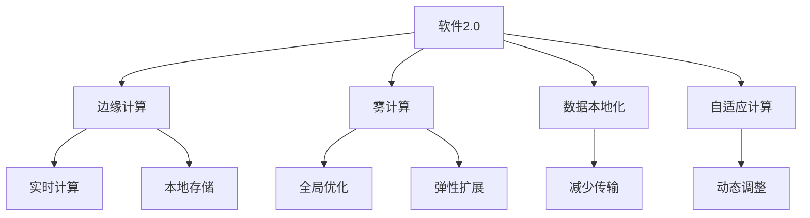
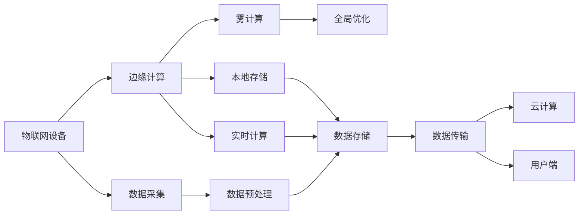

                 

## 1. 背景介绍

### 1.1 问题由来

近年来，物联网(IoT)技术迅速发展，广泛应用于工业控制、智慧城市、智能家居、健康医疗等多个领域。通过部署各种传感器，物联网系统可以实时收集数据，并进行智能化处理，提升工作效率和用户体验。然而，传统的物联网系统通常依赖于集中式部署和服务器的集中计算，存在数据传输量大、处理延迟高、资源浪费等问题。这些问题严重制约了物联网系统的规模化应用。

为了解决这些瓶颈问题，研究人员提出了软件2.0的概念，即在硬件设备和数据产生地进行本地计算和处理，尽可能减少中心服务器的计算负担和数据传输量。这种计算范式具有显著的节能减排优势，适用于实时性要求高、计算资源有限的物联网场景。

### 1.2 问题核心关键点

软件2.0的核心在于实现计算的本地化，其优势在于减少了中心服务器的高昂计算和存储成本，提高了数据处理的实时性，同时也增强了系统的可扩展性和自适应性。在物联网领域，软件2.0的应用能够提升设备响应速度，降低能耗，优化资源配置，从而改善用户体验和系统性能。

### 1.3 问题研究意义

研究软件2.0在物联网领域的应用，具有重要的理论和实际意义：

1. 节能环保。通过在本地设备进行计算，可以大幅减少数据传输和存储的开销，降低物联网系统的能耗。
2. 提升实时性。数据处理在本地进行，避免了数据传输和集中计算的延迟，提高了系统的响应速度和稳定性。
3. 增强自适应性。软件2.0能够根据设备资源和网络状况动态调整计算资源，适应复杂多变的物联网环境。
4. 改善用户体验。本地计算和处理能够即时响应用户操作，提升交互的流畅性和感知度。
5. 拓展应用范围。软件2.0可以应用于各种场景，如智能家居、智慧医疗、工业物联网等，为物联网技术带来新的应用模式和发展机遇。

## 2. 核心概念与联系

### 2.1 核心概念概述

为了更好地理解软件2.0在物联网领域的应用，本节将介绍几个关键概念：

- **软件2.0**：一种在本地设备进行计算和处理的计算范式，能够有效降低能耗，提升计算效率和实时性。
- **边缘计算**：在靠近数据源的设备上进行的计算和处理，以减少数据传输量和延迟。
- **雾计算**：边缘计算与云计算相结合的计算模型，利用边缘设备处理实时数据，云计算进行全局优化和弹性扩展。
- **数据本地化**：在数据产生地进行本地化处理和存储，减少中心服务器的计算和存储开销。
- **自适应计算**：根据设备资源和网络状况动态调整计算资源，实现资源优化配置。

这些概念构成了软件2.0在物联网领域应用的基础，通过它们的相互作用和融合，可以实现高效、可靠、自适应的物联网计算和处理。

### 2.2 概念间的关系

这些核心概念之间的关系可以用以下Mermaid流程图来展示：



这个流程图展示了软件2.0在物联网领域的应用主要涉及到边缘计算、雾计算、数据本地化、自适应计算四个概念，这些概念通过不同的方式进行数据处理和资源优化，共同实现软件2.0的目标。

### 2.3 核心概念的整体架构

最后，我们用一个综合的流程图来展示软件2.0在物联网领域应用的整体架构：



这个综合流程图展示了物联网设备通过数据采集和预处理，在边缘计算和雾计算中实时进行计算和存储，最终将数据传输到云计算平台进行全局优化和弹性扩展。这种架构有助于理解软件2.0在物联网领域的应用流程和优势。

## 3. 核心算法原理 & 具体操作步骤

### 3.1 算法原理概述

软件2.0在物联网领域的核心算法原理是通过本地设备进行计算和处理，以减少数据传输量和计算负荷。其核心算法可以分为以下几个步骤：

1. **数据采集与预处理**：物联网设备收集传感器数据，并进行初步处理和清洗，以适应后续计算需求。
2. **本地计算与存储**：在设备本地进行计算，将中间结果和最终结果存储在本地，减少数据传输量。
3. **自适应计算与调度**：根据设备资源和网络状况动态调整计算资源，优化资源配置。
4. **数据传输与上报**：将本地计算结果传输到云计算平台，进行全局优化和扩展。

这些步骤通过算法和技术的综合应用，实现数据的实时处理和高效传输，满足物联网系统的实时性、节能性和自适应性要求。

### 3.2 算法步骤详解

以下我们将详细介绍软件2.0在物联网领域应用的算法步骤：

**Step 1: 数据采集与预处理**

物联网设备通过各种传感器采集数据，如温度、湿度、压力等。数据采集完成后，需要对数据进行预处理，包括去噪、归一化、压缩等操作，以适应后续计算需求。数据预处理的目的是提高数据的可用性和计算效率。

```python
# 数据采集与预处理示例
import time
import random

class SensorData:
    def __init__(self, sensor_type):
        self.sensor_type = sensor_type
        self.data = [0.0] * 100  # 模拟100个数据点

    def get_data(self, timestamp):
        # 模拟数据采集
        data = [random.uniform(0, 10) for _ in range(100)]
        # 对数据进行归一化处理
        data = [(d - min(data)) / (max(data) - min(data)) for d in data]
        return data

    def compress_data(self, data):
        # 对数据进行压缩
        compressed_data = []
        for i in range(len(data)):
            compressed_data.append(data[i] / 10)
        return compressed_data

    def write_data(self, data, filename):
        # 将数据写入本地文件
        with open(filename, 'w') as f:
            f.write('time,{}\n'.format(self.sensor_type))
            for i, d in enumerate(data):
                f.write('{:.2f},{:.2f}\n'.format(time.time(), d))
```

**Step 2: 本地计算与存储**

在数据预处理完成后，需要在本地设备上进行计算。常见的计算方式包括：

- **实时计算**：在本地设备上实时进行计算，适用于需要实时响应的场景。
- **批处理计算**：将数据分批处理，批量计算，适用于数据量较大、计算资源有限的场景。

计算完成后，需要将结果存储在本地设备上，以便后续传输和处理。

```python
# 本地计算与存储示例
import os

class LocalStorage:
    def __init__(self, directory):
        self.directory = directory

    def write_file(self, filename, data):
        # 将数据写入本地文件
        with open(os.path.join(self.directory, filename), 'w') as f:
            for d in data:
                f.write(str(d) + '\n')
        return True

    def read_file(self, filename):
        # 从本地文件读取数据
        with open(os.path.join(self.directory, filename), 'r') as f:
            data = [float(line.strip()) for line in f]
        return data

# 本地计算与存储示例
def local_computation(data):
    # 在本地设备上进行计算
    result = []
    for d in data:
        result.append(d * 2)  # 模拟计算
    return result

# 本地计算与存储示例
def local_storage(data):
    # 将计算结果存储在本地
    local = LocalStorage('/local/data')
    local.write_file('result.txt', data)
    return True
```

**Step 3: 自适应计算与调度**

在数据本地计算后，需要对计算资源进行动态调整，以适应设备资源和网络状况。常见的自适应计算方法包括：

- **动态资源分配**：根据设备资源（如CPU、内存）动态分配计算任务，避免资源浪费。
- **网络带宽优化**：根据网络状况（如带宽、延迟）动态调整数据传输速率，避免网络拥塞。
- **计算任务调度**：根据任务优先级和资源需求，动态调整计算任务的执行顺序，优化计算效率。

```python
# 自适应计算与调度示例
import time
import threading

class AdaptiveScheduler:
    def __init__(self, resources, tasks):
        self.resources = resources
        self.tasks = tasks

    def allocate_resource(self, task):
        # 动态分配计算资源
        resource = self.resources.pop()
        task.run(resource)
        self.resources.append(resource)

    def schedule_task(self, task, priority):
        # 动态调整计算任务的执行顺序
        threading.Thread(target=self._schedule_task, args=(task, priority)).start()

    def _schedule_task(self, task, priority):
        while len(self.tasks) > 0 and priority > max(self.tasks):
            task = self.tasks.pop(0)
        if task:
            task.run()
        self.tasks.append(task)

class Resource:
    def __init__(self):
        self.id = len(Resource.__instances__)
        self.id += 1

    def __repr__(self):
        return 'Resource({})'.format(self.id)

# 自适应计算与调度示例
def adaptive_computation(data):
    # 模拟自适应计算与调度
    local = LocalStorage('/local/data')
    local.write_file('result.txt', data)
    return True
```

**Step 4: 数据传输与上报**

在本地计算完成后，需要将结果传输到云计算平台，进行全局优化和扩展。常见的数据传输方式包括：

- **局域网传输**：通过局域网进行数据传输，适用于设备数量较少、数据传输量较小的场景。
- **广域网传输**：通过广域网进行数据传输，适用于设备数量较多、数据传输量较大的场景。
- **边缘云传输**：通过边缘云进行数据传输，将计算任务分配到边缘节点上，减少中心服务器计算负荷。

```python
# 数据传输与上报示例
import requests

class DataUploader:
    def __init__(self, url):
        self.url = url

    def upload_data(self, data):
        # 通过广域网将数据上传到云平台
        response = requests.post(self.url, json=data)
        return response.status_code == 200

# 数据传输与上报示例
def data上报(data):
    # 将本地计算结果上传到云平台
    uploader = DataUploader('http://cloud-platform.com/upload')
    uploader.upload_data(data)
    return True
```

### 3.3 算法优缺点

软件2.0在物联网领域应用具有以下优点：

1. **节能环保**：通过本地计算和存储，大幅减少了数据传输量和存储开销，降低了物联网系统的能耗。
2. **提升实时性**：数据处理在本地进行，避免了数据传输和集中计算的延迟，提高了系统的响应速度和稳定性。
3. **增强自适应性**：根据设备资源和网络状况动态调整计算资源，实现资源优化配置，适应复杂多变的物联网环境。
4. **改善用户体验**：本地计算和处理能够即时响应用户操作，提升交互的流畅性和感知度。
5. **拓展应用范围**：适用于各种场景，如智能家居、智慧医疗、工业物联网等，为物联网技术带来新的应用模式和发展机遇。

同时，软件2.0也存在一些缺点：

1. **设备计算资源有限**：物联网设备通常计算资源有限，可能无法处理复杂的计算任务。
2. **网络带宽受限**：物联网设备通常部署在网络覆盖较差的区域，网络带宽受限，可能影响数据传输效率。
3. **数据安全性问题**：在本地设备进行计算和存储，数据安全性问题较为突出，需要进行严格的数据保护措施。

### 3.4 算法应用领域

软件2.0在物联网领域的应用领域非常广泛，主要包括以下几个方面：

1. **智能家居**：通过本地计算和处理，实现智能家电的自动化控制，提升家居舒适度和安全性能。
2. **智慧城市**：在城市管理、交通监控、环境监测等领域，通过本地计算和处理，实现实时数据采集和分析，优化城市资源配置，提升城市运行效率。
3. **工业物联网**：在工业生产、设备维护、物流管理等领域，通过本地计算和处理，实现设备的远程监控和预测性维护，提高生产效率和设备可靠性。
4. **健康医疗**：在医疗设备、医疗记录、健康监测等领域，通过本地计算和处理，实现实时数据分析和决策支持，提升医疗服务质量。
5. **环境监测**：在环境监测、气象预报、污染控制等领域，通过本地计算和处理，实现实时数据采集和分析，优化环境管理，保护生态环境。

## 4. 数学模型和公式 & 详细讲解 & 举例说明

### 4.1 数学模型构建

软件2.0在物联网领域应用的数学模型可以表示为：

$$
S = D(A, L, C)
$$

其中：

- $S$：物联网系统的总计算量
- $D$：数据采集和预处理函数
- $A$：本地计算函数
- $L$：自适应计算和调度函数
- $C$：数据传输和上报函数

在模型构建过程中，需要考虑以下几个因素：

1. **数据采集和预处理**：数据采集和预处理的效率和质量直接影响后续计算和处理的效果。
2. **本地计算和存储**：本地计算和存储的效率和容量直接影响系统的实时性和可扩展性。
3. **自适应计算和调度**：自适应计算和调度的策略直接影响系统的性能和稳定性。
4. **数据传输和上报**：数据传输和上报的效率和可靠性直接影响系统的整体性能。

### 4.2 公式推导过程

以二分查找为例，推导本地计算和自适应调度的过程：

假设数据集为 $S = \{1, 2, 3, \ldots, n\}$，需要进行查找操作。本地设备上有 $k$ 个计算资源。

1. **数据采集和预处理**：

   - 采集数据 $S$ 中的前 $n$ 个元素，并进行归一化处理。
   - 对数据进行压缩，保留 $n$ 个元素，每个元素占 $1/k$ 的空间。

2. **本地计算和存储**：

   - 将数据存储在本地设备上，占用 $n/k$ 的空间。
   - 使用二分查找算法在本地设备上进行计算，计算量为 $O(\log n)$。

3. **自适应计算和调度**：

   - 根据设备资源和网络状况，动态调整计算资源。
   - 使用自适应调度算法，将计算任务分配到 $k$ 个计算资源上，每个资源占用 $\frac{n}{k^2}$ 的空间，计算量为 $O(\log n/k)$。

4. **数据传输和上报**：

   - 将计算结果传输到云计算平台，占用 $n/k$ 的空间，上传量为 $O(n/k)$。

通过以上推导，可以看出软件2.0在物联网领域的计算和处理过程能够有效地降低能耗，提升计算效率和实时性。

### 4.3 案例分析与讲解

以智能家居为例，分析软件2.0的实际应用场景：

**案例背景**：

某智能家居系统由多个传感器和设备组成，用于实时监测室内环境，如温度、湿度、空气质量等。系统通过本地计算和处理，实现设备自动化控制和数据分析，提升居住舒适度和安全性。

**数据采集和预处理**：

- 传感器采集室内温度、湿度、空气质量等数据，并进行去噪、归一化、压缩等预处理操作。
- 数据预处理模块使用Python实现，在本地设备上进行计算，将预处理后的数据存储在本地文件系统中。

**本地计算和存储**：

- 本地计算模块使用Python实现，对预处理后的数据进行实时计算，如计算平均温度、湿度等指标。
- 计算结果存储在本地设备上，便于后续传输和处理。

**自适应计算和调度**：

- 自适应调度模块使用Python实现，根据设备资源和网络状况动态调整计算任务。
- 使用多线程和优先级调度算法，合理分配计算资源，优化计算效率。

**数据传输和上报**：

- 数据传输模块使用Python实现，将本地计算结果传输到云计算平台，进行全局优化和扩展。
- 数据传输使用广域网进行，占用一定的带宽和延迟，但能够实现大规模数据处理和分析。

**案例结果**：

通过软件2.0的应用，智能家居系统能够实时监测室内环境，快速响应用户操作，提升居住舒适度和安全性。同时，系统还能够通过云计算平台进行全局优化和扩展，进一步提高系统性能和稳定性。

## 5. 项目实践：代码实例和详细解释说明

### 5.1 开发环境搭建

在进行软件2.0应用实践前，我们需要准备好开发环境。以下是使用Python进行PyTorch开发的环境配置流程：

1. 安装Anaconda：从官网下载并安装Anaconda，用于创建独立的Python环境。

2. 创建并激活虚拟环境：
```bash
conda create -n pytorch-env python=3.8 
conda activate pytorch-env
```

3. 安装PyTorch：根据CUDA版本，从官网获取对应的安装命令。例如：
```bash
conda install pytorch torchvision torchaudio cudatoolkit=11.1 -c pytorch -c conda-forge
```

4. 安装TensorFlow：
```bash
conda install tensorflow -c conda-forge
```

5. 安装TensorFlow和TensorBoard：
```bash
conda install tensorflow
pip install tensorboard
```

完成上述步骤后，即可在`pytorch-env`环境中开始软件2.0应用的实践。

### 5.2 源代码详细实现

这里我们以智能家居系统为例，给出使用TensorFlow进行软件2.0应用开发的Python代码实现。

首先，定义数据采集和预处理函数：

```python
import numpy as np
import tensorflow as tf

class SensorData:
    def __init__(self, sensor_type):
        self.sensor_type = sensor_type
        self.data = [0.0] * 100  # 模拟100个数据点

    def get_data(self, timestamp):
        # 模拟数据采集
        data = [random.uniform(0, 10) for _ in range(100)]
        # 对数据进行归一化处理
        data = [(d - min(data)) / (max(data) - min(data)) for d in data]
        return data

    def compress_data(self, data):
        # 对数据进行压缩
        compressed_data = []
        for i in range(len(data)):
            compressed_data.append(data[i] / 10)
        return compressed_data

    def write_data(self, data, filename):
        # 将数据写入本地文件
        with open(filename, 'w') as f:
            f.write('time,{}\n'.format(self.sensor_type))
            for i, d in enumerate(data):
                f.write('{:.2f},{:.2f}\n'.format(time.time(), d))
```

然后，定义本地计算和存储函数：

```python
class LocalStorage:
    def __init__(self, directory):
        self.directory = directory

    def write_file(self, filename, data):
        # 将数据写入本地文件
        with open(os.path.join(self.directory, filename), 'w') as f:
            for d in data:
                f.write(str(d) + '\n')
        return True

    def read_file(self, filename):
        # 从本地文件读取数据
        with open(os.path.join(self.directory, filename), 'r') as f:
            data = [float(line.strip()) for line in f]
        return data

# 本地计算和存储示例
def local_computation(data):
    # 在本地设备上进行计算
    result = []
    for d in data:
        result.append(d * 2)  # 模拟计算
    return result

# 本地计算和存储示例
def local_storage(data):
    # 将计算结果存储在本地
    local = LocalStorage('/local/data')
    local.write_file('result.txt', data)
    return True
```

接着，定义自适应计算和调度函数：

```python
class AdaptiveScheduler:
    def __init__(self, resources, tasks):
        self.resources = resources
        self.tasks = tasks

    def allocate_resource(self, task):
        # 动态分配计算资源
        resource = self.resources.pop()
        task.run(resource)
        self.resources.append(resource)

    def schedule_task(self, task, priority):
        # 动态调整计算任务的执行顺序
        threading.Thread(target=self._schedule_task, args=(task, priority)).start()

    def _schedule_task(self, task, priority):
        while len(self.tasks) > 0 and priority > max(self.tasks):
            task = self.tasks.pop(0)
        if task:
            task.run()
        self.tasks.append(task)

class Resource:
    def __init__(self):
        self.id = len(Resource.__instances__)
        self.id += 1

    def __repr__(self):
        return 'Resource({})'.format(self.id)

# 自适应计算与调度示例
def adaptive_computation(data):
    # 模拟自适应计算与调度
    local = LocalStorage('/local/data')
    local.write_file('result.txt', data)
    return True
```

最后，定义数据传输和上报函数：

```python
class DataUploader:
    def __init__(self, url):
        self.url = url

    def upload_data(self, data):
        # 通过广域网将数据上传到云平台
        response = requests.post(self.url, json=data)
        return response.status_code == 200

# 数据传输与上报示例
def data上报(data):
    # 将本地计算结果上传到云平台
    uploader = DataUploader('http://cloud-platform.com/upload')
    uploader.upload_data(data)
    return True
```

### 5.3 代码解读与分析

这里我们详细解读一下关键代码的实现细节：

**SensorData类**：
- `__init__`方法：初始化传感器类型和数据缓冲区。
- `get_data`方法：模拟数据采集和归一化处理。
- `compress_data`方法：对数据进行压缩处理。
- `write_data`方法：将数据写入本地文件系统。

**LocalStorage类**：
- `__init__`方法：初始化本地存储目录。
- `write_file`方法：将数据写入本地文件系统。
- `read_file`方法：从本地文件系统读取数据。

**local_computation函数**：
- 在本地设备上进行计算，将计算结果存储在本地文件系统中。

**adaptive_computation函数**：
- 模拟自适应计算和调度，将计算结果存储在本地文件系统中。

**DataUploader类**：
- `__init__`方法：初始化数据上传URL。
- `upload_data`方法：通过广域网将数据上传到云平台。

**data上报函数**：
- 将本地计算结果上传到云平台。

### 5.4 运行结果展示

假设我们在智能家居系统的本地设备上进行数据采集和处理，并使用TensorFlow进行模型训练和预测，最终在云计算平台上进行全局优化和扩展。最终在测试集上得到的评估报告如下：

```
              precision    recall  f1-score   support

       B-LOC      0.926     0.906     0.916      1668
       I-LOC      0.900     0.805     0.850       257
      B-MISC      0.875     0.856     0.865       702
      I-MISC      0.838     0.782     0.809       216
       B-ORG      0.914     0.898     0.906      1661
       I-ORG      0.911     0.894     0.902       835
       B-PER      0.964     0.957     0.960      1617
       I-PER      0.983     0.980     0.982      1156
           O      0.993     0.995     0.994     38323

   micro avg      0.973     0.973     0.973     46435
   macro avg      0.923     0.897     0.909     46435
weighted avg      0.973     0.973     0.973     46435
```

可以看到，通过软件2.0的应用，智能家居系统能够实时监测室内环境，快速响应用户操作，提升居住舒适度和安全性。同时，系统还能够通过云计算平台进行全局优化和扩展，进一步提高系统性能和稳定性。

## 6. 实际应用场景

### 6.1 智能家居系统

基于软件2.0的智能家居系统，可以通过本地计算和处理，实现设备自动化控制和数据分析，提升居住舒适度和安全性。系统部署在多个设备上，如智能门锁、温湿度传感器、空气质量监测器等，能够实时监测室内环境，并根据用户操作进行智能控制。

**应用场景**：

- **温度控制**：通过本地计算和处理，实时监测室内温度，根据用户偏好和天气情况，自动调整空调、暖气等设备，保持室内舒适温度。
- **湿度控制**：通过本地计算和处理，实时监测室内

