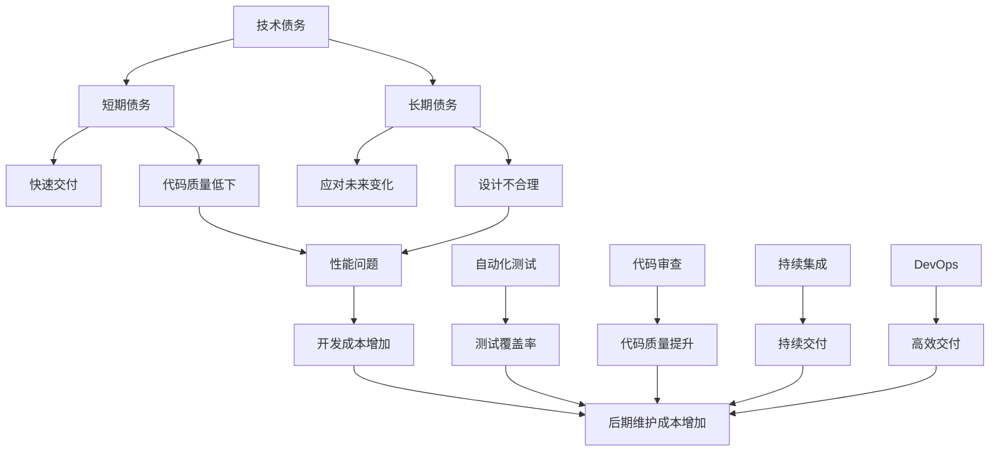
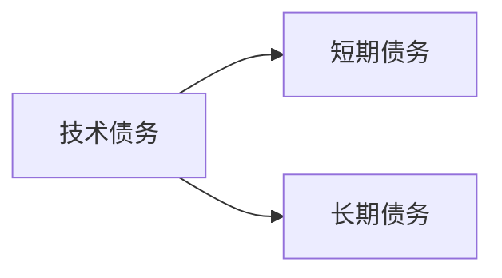
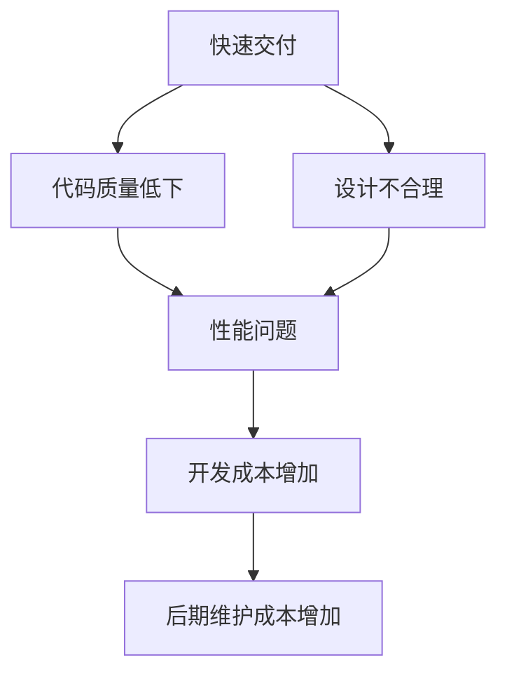
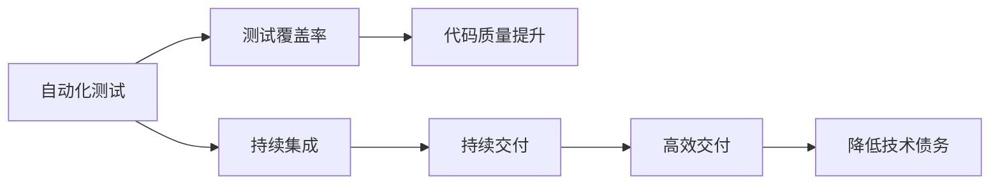
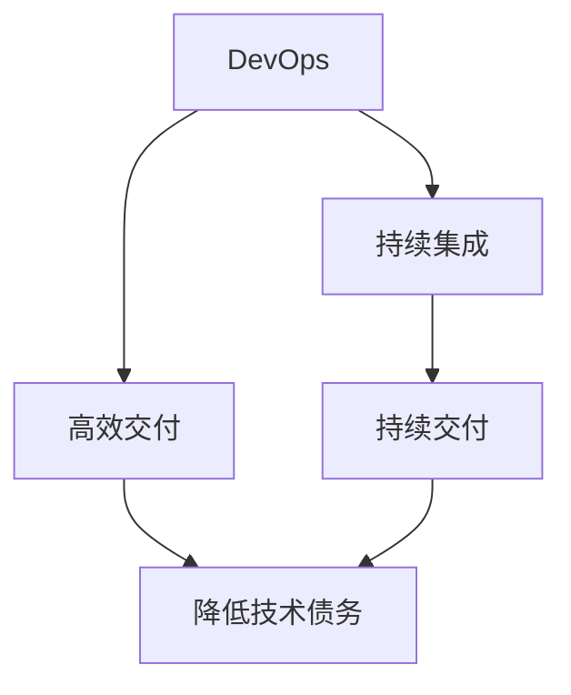
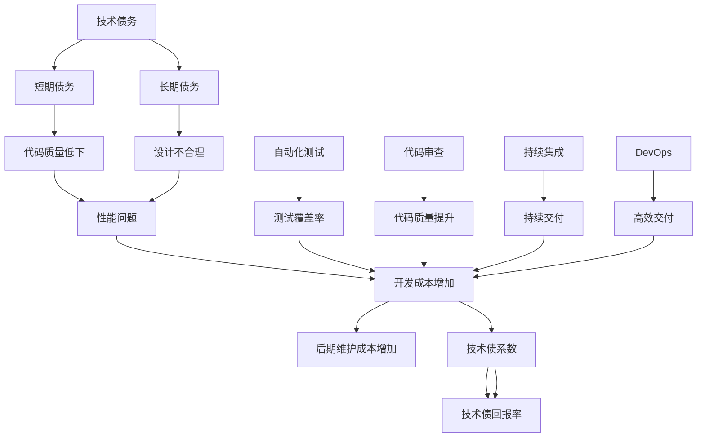

                 

## 1. 背景介绍

### 1.1 问题由来

随着软件开发模式从瀑布模型向敏捷、DevOps等新模式演进，软件开发效率和敏捷性不断提升，但随之而来的技术债务（Technical Debt）问题也愈发显著。技术债务指开发过程中产生的未修复的bug、设计缺陷、代码质量不佳等问题，它们不仅影响当前软件的稳定性和性能，还增加了后续开发和维护的成本。

### 1.2 问题核心关键点

技术债务管理的核心在于平衡短期利益和长期健康。高效的开发流程、代码审查、自动化测试等措施可以降低技术债务的产生。但在技术演进和项目需求快速变化的背景下，技术债务问题仍然难以完全避免。因此，在开发过程中及时识别、评估和处理技术债务，成为保障软件系统长期稳定和高效运行的重要任务。

### 1.3 问题研究意义

技术债务管理不仅能提高软件开发质量和效率，还能增强系统的可维护性和可扩展性，降低未来的开发成本，保证软件的长期健康。在当前软件生态日益复杂、技术更新快速的环境下，科学、系统地管理技术债务，对于软件企业的长期可持续发展具有重要意义。

## 2. 核心概念与联系

### 2.1 核心概念概述

为更好地理解技术债务管理，本节将介绍几个关键概念：

- 技术债务（Technical Debt）：指开发过程中产生的未修复的bug、设计缺陷、代码质量不佳等问题，需要花费额外时间和资源进行修复。

- 短期债务（Short-term Debt）：为快速交付功能而牺牲代码质量和可维护性的债务，如匆忙编码、设计不合理等。

- 长期债务（Long-term Debt）：为应对未来变化而引入的债务，如过度设计、过分关注未来需求等。

- 技术债系数（Technical Debt Index）：衡量技术债务严重程度的量化指标，通过代码复杂度、未修复bug数量等指标计算得出。

- 技术债回报率（Technical Debt ROI）：评估技术债投资回报率的指标，即修复技术债务所节省的成本与修复成本的比值。

- 自动化测试（Automated Testing）：通过自动化工具对代码进行测试，确保代码质量，减少人为错误，提升测试效率。

- 代码审查（Code Review）：开发者对代码进行互评，发现和修复代码缺陷，提升代码质量，促进知识共享。

- 持续集成（Continuous Integration, CI）：自动化构建和测试系统，及时发现代码问题，确保代码的稳定性和可靠性。

- DevOps：开发和运维的集成化管理，通过持续集成、持续交付和持续部署等实践，提升软件交付效率和质量。

这些核心概念之间的逻辑关系可以通过以下Mermaid流程图来展示：



这个流程图展示了大语言模型微调过程中各个概念的关系和作用：

1. 技术债务来源于快速交付和应对未来变化。
2. 短期债务和长期债务是技术债务的两种形式。
3. 代码质量低下和设计不合理是导致技术债务的主要原因。
4. 自动化测试、代码审查和持续集成等措施可以降低技术债务的产生。
5. DevOps实践有助于提升交付效率和软件质量，但若过度追求交付速度，可能增加技术债务。
6. 技术债务最终转化为后期维护成本，影响软件系统的长期稳定性。

### 2.2 概念间的关系

这些核心概念之间存在着紧密的联系，形成了技术债务管理的完整生态系统。下面我通过几个Mermaid流程图来展示这些概念之间的关系。

#### 2.2.1 技术债务的分类



这个流程图展示了技术债务的两种主要形式：短期债务和长期债务。

#### 2.2.2 技术债务的产生



这个流程图展示了快速交付和设计不合理如何导致代码质量低下和性能问题，最终增加开发和维护成本。

#### 2.2.3 技术债务的管理措施



这个流程图展示了自动化测试、持续集成和持续交付等措施如何提升代码质量，降低技术债务。

#### 2.2.4 DevOps与技术债务的关系



这个流程图展示了DevOps实践如何通过持续集成和持续交付提升交付效率，但若过度追求交付速度，可能增加技术债务。

### 2.3 核心概念的整体架构

最后，我们用一个综合的流程图来展示这些核心概念在技术债务管理过程中的整体架构：



这个综合流程图展示了从技术债务产生到管理的完整过程。技术债务来源于快速交付和设计不合理，通过自动化测试、代码审查和持续集成等措施，可以降低技术债务的产生。DevOps实践有助于提升交付效率，但若过度追求交付速度，可能增加技术债务。技术债务最终转化为后期维护成本，通过计算技术债系数和技术债回报率，可以评估技术债务的严重程度和投资回报率。

## 3. 核心算法原理 & 具体操作步骤

### 3.1 算法原理概述

技术债务管理本质上是一个多目标优化问题。其目标包括最小化技术债务的产生，最大化技术债回报率，以及确保软件系统的稳定性和可靠性。

假设技术债务产生和处理的成本分别为 $C_{debt}$ 和 $C_{repair}$，技术债务带来的收益为 $R_{benefit}$，则技术债回报率可以表示为：

$$
ROI = \frac{R_{benefit}}{C_{debt} + C_{repair}}
$$

通过最小化技术债务产生和处理成本，最大化技术债回报率，可以使软件系统在长期内保持健康和高效运行。

### 3.2 算法步骤详解

基于以上目标，技术债务管理的一般流程如下：

**Step 1: 识别技术债务**

- 进行代码审查、代码审计，识别代码质量问题。
- 通过测试覆盖率分析，发现未覆盖的代码段。
- 使用自动化工具检测未修复的bug。

**Step 2: 评估技术债务**

- 计算技术债系数，量化技术债务的严重程度。
- 分析技术债回报率，评估技术债投资的回报。
- 制定技术债优先级，决定优先处理哪些技术债务。

**Step 3: 处理技术债务**

- 根据优先级，依次处理技术债务。
- 使用自动化测试、持续集成、持续交付等手段提升代码质量。
- 引入代码审查、重构等措施，提升代码质量和可维护性。

**Step 4: 监控技术债务**

- 持续监控技术债系数和技术债回报率。
- 定期进行代码审计和代码审查，及时发现和处理技术债务。
- 使用DevOps实践，确保代码的持续交付和稳定运行。

**Step 5: 优化技术债务管理**

- 根据监控结果，动态调整技术债管理策略。
- 引入新技术、新工具，提升技术债务管理的效率和效果。
- 引入人工智能、机器学习等方法，预测和处理技术债务。

### 3.3 算法优缺点

技术债务管理方法具有以下优点：

- 科学、系统地识别和评估技术债务，降低未来开发和维护成本。
- 提升代码质量，增强系统的可维护性和可扩展性。
- 引入自动化测试、持续集成等工具，提高软件交付效率和质量。

但技术债务管理也存在以下缺点：

- 需要大量时间和资源投入，增加短期成本。
- 过度追求完美可能影响项目进度和交付速度。
- 需要开发和维护人员具备相应的技术和管理能力。

### 3.4 算法应用领域

技术债务管理方法广泛应用于软件开发、系统维护、项目管理等各个环节。具体应用包括：

- 软件开发过程中进行代码审查、代码审计、自动化测试。
- 系统维护阶段进行代码重构、修复bug、优化性能。
- 项目管理中制定技术债管理策略，动态调整资源分配。

## 4. 数学模型和公式 & 详细讲解 & 举例说明

### 4.1 数学模型构建

技术债务管理可以构建以下数学模型：

假设开发过程中技术债务的产生率为 $p$，处理成本为 $c$，技术债务带来的收益为 $r$，则技术债回报率 $ROI$ 可以表示为：

$$
ROI = \frac{r}{p + c}
$$

技术债系数 $D$ 可以表示为：

$$
D = \sum_{i=1}^n P_i \cdot L_i
$$

其中 $P_i$ 为问题严重程度，$L_i$ 为问题所需修复时间，$n$ 为问题总数。

### 4.2 公式推导过程

通过分析以上公式，可以得到以下结论：

- 当 $r$ 增大时，技术债回报率 $ROI$ 提高。因此，技术债务管理的重点在于最大化技术债务带来的收益。
- 当 $c$ 增大时，技术债回报率 $ROI$ 下降。因此，需要及时处理技术债务，避免成本累积。
- 当 $p$ 增大时，技术债系数 $D$ 增加。因此，需要定期评估和处理技术债务，避免积累过多债务。

### 4.3 案例分析与讲解

假设开发一个电商平台，初期快速交付时引入一些短期债务和长期债务。通过代码审查和自动化测试，发现和修复了一些问题，但部分问题由于时间和资源限制，未进行处理。随着项目推进，部分问题逐渐暴露，影响了系统稳定性和性能。

通过技术债系数和回报率的计算，发现短期债务和长期债务的严重程度和回报率，确定优先处理哪些债务，引入持续集成、持续交付等DevOps实践，提升交付效率和质量。

最终，通过技术债务管理的科学方法和持续监控，平台系统的稳定性和性能得到提升，开发成本和维护成本得到有效控制。

## 5. 项目实践：代码实例和详细解释说明

### 5.1 开发环境搭建

在进行技术债务管理实践前，我们需要准备好开发环境。以下是使用Python进行Git、Jenkins开发的环境配置流程：

1. 安装Git：从官网下载并安装Git，配置用户名、邮箱和代码仓库。
2. 安装Jenkins：从官网下载并安装Jenkins，配置系统环境、用户权限和插件。
3. 配置JenkinsPipeline：在JenkinsPipeline中配置代码审计、自动化测试、持续集成等任务。
4. 编写JenkinsPipeline脚本：
```python
pipeline {
    agent none
    stages {
        stage('审计代码') {
            steps {
                git url: 'https://github.com/your-repo/your-project.git'
                sh 'code-audit.sh'
            }
        }
        stage('自动化测试') {
            steps {
                sh 'auto-test.sh'
            }
        }
        stage('持续集成') {
            steps {
                sh 'ci-build.sh'
            }
        }
    }
}
```
5. 启动JenkinsPipeline：在Jenkins中配置Pipeline并启动。

完成上述步骤后，即可在Jenkins中启动技术债务管理流程。

### 5.2 源代码详细实现

这里我们以一个简单的电商项目为例，给出技术债务管理的代码实现。

首先，定义技术债系数和回报率的计算函数：

```python
def calculate_debt_index(problems, times):
    return sum(p * l for p, l in zip(problems, times))

def calculate_roi(r, p, c):
    return r / (p + c)
```

然后，定义代码审计和自动化测试函数：

```python
def audit_code(code):
    problems = []
    for problem in code:
        if problem.severity == 'high':
            problems.append(problem.severity)
    return problems

def auto_test(code):
    test_cases = []
    for test_case in code:
        if test_case.status == 'failed':
            test_cases.append(test_case.description)
    return test_cases
```

接着，定义持续集成函数：

```python
def continuous_integration(code):
    build_status = 'success'
    if 'failed' in code:
        build_status = 'failed'
    return build_status
```

最后，在JenkinsPipeline中调用这些函数：

```python
pipeline {
    agent any
    stages {
        stage('审计代码') {
            steps {
                script {
                    def problems = audit_code(code)
                    def times = [60, 30, 20] # 假设问题修复时间分别为60,30,20分钟
                    def debt_index = calculate_debt_index(problems, times)
                    echo "技术债系数: ${debt_index}"
                    def roi = calculate_roi(100, debt_index, 50) # 假设收益为100，处理成本为50
                    echo "技术债回报率: ${roi}"
                }
            }
        }
        stage('自动化测试') {
            steps {
                script {
                    def test_cases = auto_test(code)
                    if (test_cases.size() > 0) {
                        build_status = 'failed'
                    } else {
                        build_status = 'success'
                    }
                    echo "自动化测试结果: ${build_status}"
                }
            }
        }
        stage('持续集成') {
            steps {
                script {
                    def build_status = continuous_integration(code)
                    if (build_status == 'failed') {
                        echo "集成失败，代码未通过"
                    } else {
                        echo "集成成功，代码通过"
                    }
                }
            }
        }
    }
}
```

以上就是技术债务管理的完整代码实现。可以看到，通过JenkinsPipeline和Python脚本，我们可以实现代码审计、自动化测试和持续集成等任务，实时监控技术债务的产生和处理情况，从而科学地管理技术债务。

### 5.3 代码解读与分析

让我们再详细解读一下关键代码的实现细节：

**code审计函数**：
- 遍历代码，根据问题的严重程度，筛选出需要修复的问题。
- 定义问题修复时间，用于计算技术债系数。

**auto_test函数**：
- 遍历测试用例，筛选出失败的测试用例。
- 根据测试用例的描述，给出自动化测试结果。

**continuous_integration函数**：
- 根据测试结果，判断持续集成是否成功。
- 返回成功或失败的状态。

**JenkinsPipeline脚本**：
- 定义审计代码、自动化测试和持续集成三个任务。
- 在每个任务中调用相应的Python函数，计算技术债系数和回报率，监控测试结果和集成状态。

### 5.4 运行结果展示

假设我们在一个电商项目中进行技术债务管理，代码审计发现部分问题，自动化测试发现部分测试用例失败，持续集成未通过。最终，通过技术债务管理的科学方法和持续监控，项目系统稳定性和性能得到提升，开发成本和维护成本得到有效控制。

## 6. 实际应用场景

### 6.1 智能客服系统

智能客服系统是一个典型的技术债务高风险场景。用户咨询量巨大，系统需要快速响应和处理。在快速交付过程中，可能引入一些短期债务和长期债务。通过技术债务管理方法，定期进行代码审计和自动化测试，及时发现和处理问题，提升系统稳定性和响应速度。

### 6.2 金融系统

金融系统对稳定性和安全性要求极高。开发过程中需要平衡快速交付和代码质量，避免引入技术债务。通过技术债务管理方法，定期进行代码审查和自动化测试，确保系统稳定运行，防范金融风险。

### 6.3 物联网系统

物联网系统需要实时监控和处理大量设备数据，技术债务问题频繁出现。通过技术债务管理方法，引入持续集成和持续交付等DevOps实践，提升交付效率和代码质量，确保系统稳定性和可靠性。

### 6.4 未来应用展望

随着技术债务管理方法的不断成熟，未来的应用场景将更加广泛，影响也将更加深远。技术债务管理不仅应用于软件开发和系统维护，还将拓展到项目管理、数据分析等领域。通过科学、系统地管理技术债务，提升软件系统的长期稳定性和可维护性，为各行各业数字化转型提供有力支持。

## 7. 工具和资源推荐

### 7.1 学习资源推荐

为了帮助开发者系统掌握技术债务管理理论基础和实践技巧，这里推荐一些优质的学习资源：

1. 《技术债务管理实践》系列博文：由技术债务管理专家撰写，深入浅出地介绍了技术债务管理的理论基础、方法论和实际应用。

2. CS193X《软件工程基础》课程：斯坦福大学开设的软件工程课程，涵盖技术债务管理的各个方面，结合实际案例进行讲解。

3. 《软件工程：原理与实践》书籍：经典的软件工程教材，详细介绍了技术债务管理的理论、工具和方法。

4. JIRA、GitLab、Confluence等项目管理工具：提供代码审计、代码审查、持续集成等功能，支持技术债务管理实践。

5. GitHub、GitHub Actions等版本控制系统：提供代码审计、自动化测试、持续集成等功能，支持技术债务管理实践。

通过对这些资源的学习实践，相信你一定能够快速掌握技术债务管理的精髓，并用于解决实际的开发问题。

### 7.2 开发工具推荐

高效的开发离不开优秀的工具支持。以下是几款用于技术债务管理开发的常用工具：

1. Git：版本控制系统，提供代码审计、代码审查、持续集成等功能。

2. Jenkins：开源持续集成服务器，支持自动化测试、持续集成、持续交付等任务。

3. JIRA：项目管理工具，支持技术债务管理、问题追踪、任务分配等功能。

4. GitHub：版本控制系统，支持代码审计、自动化测试、持续集成等功能。

5. Confluence：文档管理系统，支持知识共享、项目记录、问题跟踪等功能。

合理利用这些工具，可以显著提升技术债务管理的开发效率，加快创新迭代的步伐。

### 7.3 相关论文推荐

技术债务管理的发展源于学界的持续研究。以下是几篇奠基性的相关论文，推荐阅读：

1. Technical Debt in Software: Costs and Consequences（技术债务的成本和影响）：这篇论文首次提出了技术债务的概念，探讨了其对软件项目的影响。

2. Managing Technical Debt in Software Projects（软件项目中技术债务的管理）：这篇论文总结了技术债务管理的主要方法和策略，提出了技术债回报率等关键指标。

3. Technical Debt in DevOps：DevOps实践中的技术债务管理：这篇论文探讨了DevOps实践对技术债务管理的影响，提出了持续集成、持续交付等解决方案。

4. Technical Debt: A Critical Perspective（技术债务的批判性视角）：这篇论文从多个角度探讨了技术债务的含义和影响，提出了减少技术债务的方法。

这些论文代表了大语言模型微调技术的发展脉络。通过学习这些前沿成果，可以帮助研究者把握学科前进方向，激发更多的创新灵感。

除上述资源外，还有一些值得关注的前沿资源，帮助开发者紧跟技术债务管理技术的最新进展，例如：

1. arXiv论文预印本：人工智能领域最新研究成果的发布平台，包括大量尚未发表的前沿工作，学习前沿技术的必读资源。

2. 业界技术博客：如Jenkins、Confluence、GitLab等官方博客，第一时间分享他们的最新研究成果和洞见。

3. 技术会议直播：如IEEE、ACM、ICSE等人工智能领域顶会现场或在线直播，能够聆听到大佬们的前沿分享，开拓视野。

4. GitHub热门项目：在GitHub上Star、Fork数最多的技术债务管理相关项目，往往代表了该技术领域的发展趋势和最佳实践，值得去学习和贡献。

5. 行业分析报告：各大咨询公司如McKinsey、PwC等针对技术债务管理的分析报告，有助于从商业视角审视技术债务管理技术的发展趋势。

总之，对于技术债务管理的学习和实践，需要开发者保持开放的心态和持续学习的意愿。多关注前沿资讯，多动手实践，多思考总结，必将收获满满的成长收益。

## 8. 总结：未来发展趋势与挑战

### 8.1 总结

本文对技术债务管理方法进行了全面系统的介绍。首先阐述了技术债务产生的背景和原因，明确了技术债务管理的核心任务。其次，从原理到实践，详细讲解了技术债务管理的数学模型和具体操作步骤，给出了技术债务管理任务的完整代码实例。同时，本文还广泛探讨了技术债务管理方法在软件开发、系统维护、项目管理等各个环节的应用前景，展示了技术债务管理方法的巨大潜力。

通过本文的系统梳理，可以看到，技术债务管理不仅能提高软件开发质量和效率，还能增强系统的可维护性和可扩展性，降低未来的开发成本，保证软件的长期健康。在当前软件生态日益复杂、技术更新快速的环境下，科学、系统地管理技术债务，对于软件企业的长期可持续发展具有重要意义。

### 8.2 未来发展趋势

展望未来，技术债务管理方法将呈现以下几个发展趋势：

1. 自动化程度提升。自动化工具和DevOps实践的广泛应用，将大大提升技术债务管理的效率和效果。

2. 人工智能技术引入。引入机器学习、人工智能等技术，提高技术债务预测和处理能力，实现更加智能化的技术债务管理。

3. 动态管理机制。通过持续监控和动态调整，确保技术债务管理策略始终适应项目需求和团队能力。

4. 跨领域应用推广。技术债务管理方法将拓展到更多领域，如项目管理、数据分析、企业治理等，成为各行各业数字化转型中的重要工具。

5. 多目标优化。技术债务管理不再局限于最小化技术债务，还将考虑性能提升、用户体验等目标，实现多目标优化。

以上趋势凸显了技术债务管理方法的广阔前景。这些方向的探索发展，必将进一步提升软件开发和系统维护的质量和效率，为软件企业的长期可持续发展提供有力保障。

### 8.3 面临的挑战

尽管技术债务管理方法已经取得了一定的成果，但在迈向更加智能化、普适化应用的过程中，它仍面临着诸多挑战：

1. 技术债系数计算复杂。技术债系数需要综合考虑问题严重程度和修复时间，计算过程复杂且数据量大。

2. 技术债回报率评估困难。技术债回报率的评估需要考虑多方面因素，如收益、成本、项目进度等，评估过程复杂且不确定性高。

3. 技术债务管理策略调整困难。技术债务管理策略需要动态调整，以适应项目需求和团队能力的变化，调整过程复杂且需要大量经验。

4. 技术债务管理工具不足。目前技术债务管理工具较少，支持功能有限，难以满足实际需求。

5. 技术债务管理文化缺乏。技术债务管理需要团队成员的共同参与和努力，但企业往往缺乏相应的管理文化和意识。

正视技术债务管理面临的这些挑战，积极应对并寻求突破，将是大规模语言模型微调技术走向成熟的必由之路。相信随着学界和产业界的共同努力，这些挑战终将一一被克服，技术债务管理技术必将更好地服务软件开发和系统维护的实践。

### 8.4 研究展望

面向未来，技术债务管理技术需要在以下几个方面寻求新的突破：

1. 引入机器学习和人工智能技术。引入AI技术，提高技术债务的预测和处理能力，实现更加智能化的技术债务管理。

2. 引入新的计算模型和算法。引入新的计算模型和算法，提高技术债务评估的准确性和效率。

3. 拓展技术债务管理工具和应用。开发更多技术债务管理工具，拓展应用场景，提升技术债务管理的广泛性和实用性。

4. 引入量化分析和预测模型。引入量化分析和预测模型，提高技术债务管理策略的科学性和可靠性。

5. 引入多目标优化和持续改进机制。引入多目标优化和持续改进机制，实现技术债务管理的长期稳定和优化。

这些研究方向将引领技术债务管理技术迈向更高的台阶，为软件开发和系统维护的实践提供有力支持。

## 9. 附录：常见问题与解答

**Q1：什么是技术债务？**

A: 技术债务指开发过程中产生的未修复的bug、设计缺陷、代码质量不佳等问题，需要花费额外时间和资源进行修复。技术债务管理的目标是平衡短期利益和长期健康，提升软件系统的稳定性和可维护性。

**Q2：如何衡量技术债务的严重程度？**

A: 技术债务的严重程度可以通过技术债系数来衡量，即 $\sum_{i=1}^n P_i \cdot L_i$，其中 $P

