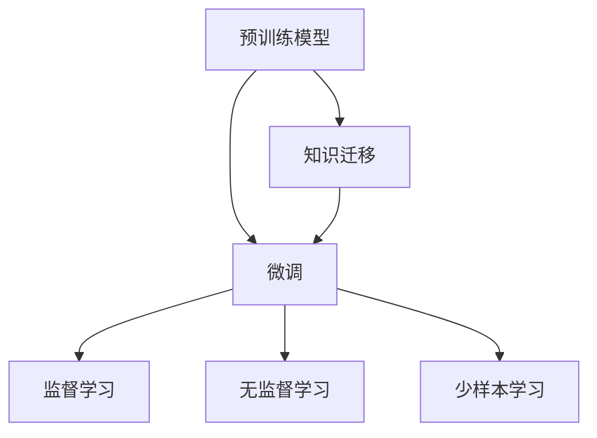

                 

# 迁移学习 原理与代码实例讲解

> 关键词：迁移学习,预训练模型,微调,监督学习,无监督学习,少样本学习

## 1. 背景介绍

### 1.1 问题由来

迁移学习（Transfer Learning）是机器学习领域的重要研究方向，它通过将一个领域学到的知识迁移到另一个领域，在新的数据集上快速达到更好的性能，从而大幅提升模型效果，减少标注数据的需求。在大数据时代，迁移学习在图像、自然语言处理、医疗等多个领域已经得到了广泛应用，成为了深度学习的重要范式。

### 1.2 问题核心关键点

迁移学习的核心在于“知识迁移”，即利用已有知识指导新任务的完成。具体而言，迁移学习包含以下几个关键点：

- **预训练模型**：指在大规模数据上预训练得到的模型，通常包含大量的特征提取能力和泛化能力。
- **微调（Fine-tuning）**：在预训练模型基础上，通过少量标注数据进行微调，以适应新任务的需求。
- **知识迁移**：指预训练模型中的知识通过微调过程迁移到新任务中，从而提升模型在新数据上的表现。

### 1.3 问题研究意义

迁移学习能够有效降低新任务的数据标注成本，提升模型在新领域的泛化能力和效果，加速模型的开发进程，推动技术应用落地。它在NLP、计算机视觉、语音识别等领域都取得了显著的成效，推动了相关领域的快速进步。

## 2. 核心概念与联系

### 2.1 核心概念概述

为了更好地理解迁移学习的核心概念及其相互关系，本文将详细介绍以下几个关键概念：

- **预训练模型**：指在大规模无标签数据上预训练得到的深度学习模型，如BERT、GPT等。
- **微调（Fine-tuning）**：指在预训练模型基础上，使用下游任务的小规模标注数据进行微调，优化模型在新任务上的性能。
- **知识迁移**：指预训练模型中的知识在新任务中得到应用，提升新任务的性能。
- **监督学习与无监督学习**：迁移学习通常基于监督学习，但也可以扩展到无监督学习的场景，如自监督学习、半监督学习等。
- **少样本学习（Few-shot Learning）**：指在少量标注数据下，通过预训练模型和微调过程，提升模型在新任务上的性能。

这些核心概念之间的联系可以通过以下Mermaid流程图来展示：



这个流程图展示了预训练模型、微调、知识迁移、监督学习与无监督学习、少样本学习之间的相互关系和作用。

### 2.2 概念间的关系

这些核心概念之间存在紧密的联系，形成了迁移学习的完整生态系统。

- **预训练模型**是迁移学习的基础，提供通用的特征提取和泛化能力。
- **微调**是在预训练模型的基础上，通过少量标注数据进行有监督的优化，提升模型在新任务上的性能。
- **知识迁移**描述了预训练模型中的知识在新任务中的应用过程，是迁移学习的重要目标。
- **监督学习与无监督学习**提供了知识迁移的不同途径，监督学习通过标注数据指导模型学习，无监督学习则通过数据本身的结构特征进行学习。
- **少样本学习**是迁移学习的一种特殊形式，强调在少量标注数据下提升模型性能。

这些概念共同构成了迁移学习的核心框架，使得深度学习模型可以在新任务上快速适应和优化，具有广泛的应用前景。

## 3. 核心算法原理 & 具体操作步骤

### 3.1 算法原理概述

迁移学习的核心思想是“知识迁移”，即将预训练模型中的知识迁移到新任务中。具体而言，迁移学习分为两个步骤：

1. **预训练**：在大规模无标签数据上预训练深度学习模型，使其学习到通用的特征表示。
2. **微调**：在预训练模型的基础上，使用新任务的少量标注数据进行微调，优化模型在新任务上的性能。

迁移学习的本质是一个有监督的细粒度迁移学习过程。通过微调，模型在新任务上能够更好地适应数据分布，提升模型的泛化能力和效果。

### 3.2 算法步骤详解

迁移学习的一般步骤包括：

1. **准备预训练模型**：选择合适的预训练模型，如BERT、GPT等。
2. **准备数据集**：收集新任务的数据集，并进行预处理和划分，生成训练集、验证集和测试集。
3. **定义任务适配层**：根据新任务的需求，在预训练模型的顶层定义新的输出层和损失函数。
4. **设置微调超参数**：选择合适的优化器、学习率、批大小、迭代轮数等超参数。
5. **执行微调**：使用新任务的标注数据对模型进行微调，不断更新模型参数，最小化损失函数。
6. **评估模型性能**：在新任务的测试集上评估微调后模型的性能，对比微调前后的效果。

### 3.3 算法优缺点

迁移学习的优点包括：

- **数据需求低**：微调通常需要较少的标注数据，能够有效降低新任务的标注成本。
- **泛化能力强**：预训练模型能够在新任务中学习到通用的特征表示，提升模型泛化能力。
- **模型效果好**：在少量标注数据下，通过微调能够快速达到较好的性能。

同时，迁移学习也存在一些局限性：

- **领域适应性有限**：当预训练模型的领域与新任务差异较大时，微调的效果可能不佳。
- **模型复杂度高**：预训练模型的参数量较大，微调过程可能较为复杂。
- **过拟合风险**：微调过程容易出现过拟合，特别是在标注数据较少的情况下。

### 3.4 算法应用领域

迁移学习已经在多个领域得到了广泛应用，主要包括：

- **自然语言处理（NLP）**：如文本分类、命名实体识别、情感分析等任务，通过微调BERT、GPT等模型，能够显著提升模型在新任务上的表现。
- **计算机视觉（CV）**：如图像分类、目标检测、图像分割等任务，通过微调ResNet、Inception等模型，能够在少量标注数据下快速提升模型效果。
- **语音识别**：如语音情感识别、语音命令识别等任务，通过微调预训练的语音模型，能够有效提升识别准确率。
- **医疗诊断**：如医学影像分析、疾病预测等任务，通过微调预训练的医学图像模型，能够在新数据上快速达到较好的效果。

除了上述应用领域外，迁移学习还在智能推荐、金融风控、智能交通等多个领域得到了应用，推动了相关行业的技术进步。

## 4. 数学模型和公式 & 详细讲解

### 4.1 数学模型构建

假设预训练模型为 $M_{\theta}$，新任务的标注数据集为 $D=\{(x_i,y_i)\}_{i=1}^N$，其中 $x_i$ 为输入数据，$y_i$ 为标注标签。定义模型在输入 $x_i$ 上的损失函数为 $\ell(M_{\theta}(x_i),y_i)$。

迁移学习的目标是找到最优参数 $\theta^*$，使得模型在新任务上的表现最优。因此，迁移学习可以表示为以下最优化问题：

$$
\theta^* = \mathop{\arg\min}_{\theta} \mathcal{L}(M_{\theta},D)
$$

其中，$\mathcal{L}$ 为新任务定义的损失函数。

### 4.2 公式推导过程

以二分类任务为例，假设模型 $M_{\theta}$ 在输入 $x_i$ 上的输出为 $\hat{y}=M_{\theta}(x_i)$，真实标签为 $y_i \in \{0,1\}$。定义二分类交叉熵损失函数为：

$$
\ell(M_{\theta}(x_i),y_i) = -[y_i\log \hat{y}_i + (1-y_i)\log (1-\hat{y}_i)]
$$

则新任务上的总损失函数为：

$$
\mathcal{L}(\theta) = \frac{1}{N} \sum_{i=1}^N \ell(M_{\theta}(x_i),y_i)
$$

在微调过程中，使用梯度下降算法进行优化。设置学习率为 $\eta$，则模型参数的更新公式为：

$$
\theta \leftarrow \theta - \eta \nabla_{\theta}\mathcal{L}(\theta)
$$

其中 $\nabla_{\theta}\mathcal{L}(\theta)$ 为损失函数对参数 $\theta$ 的梯度。

### 4.3 案例分析与讲解

假设我们在CoNLL-2003命名实体识别（NER）数据集上进行迁移学习，选择使用预训练的BERT模型。具体步骤如下：

1. **数据准备**：收集CoNLL-2003 NER数据集，并进行预处理和划分，生成训练集、验证集和测试集。
2. **模型加载**：使用HuggingFace库加载预训练的BERT模型。
3. **任务适配层定义**：根据NER任务的需求，定义新的输出层和损失函数。例如，在BERT模型的顶层添加线性分类器和交叉熵损失函数。
4. **微调超参数设置**：选择合适的优化器、学习率、批大小、迭代轮数等超参数。
5. **模型微调**：使用新任务的标注数据对模型进行微调，不断更新模型参数，最小化损失函数。
6. **模型评估**：在测试集上评估微调后模型的性能，对比微调前后的效果。

## 5. 项目实践：代码实例和详细解释说明

### 5.1 开发环境搭建

要进行迁移学习的项目实践，首先需要搭建开发环境。以下是使用Python和PyTorch进行迁移学习的开发环境配置流程：

1. **安装Anaconda**：从官网下载并安装Anaconda，用于创建独立的Python环境。
2. **创建虚拟环境**：
   ```bash
   conda create -n pytorch-env python=3.8 
   conda activate pytorch-env
   ```
3. **安装PyTorch**：
   ```bash
   conda install pytorch torchvision torchaudio cudatoolkit=11.1 -c pytorch -c conda-forge
   ```
4. **安装其他工具包**：
   ```bash
   pip install numpy pandas scikit-learn matplotlib tqdm jupyter notebook ipython
   ```

完成上述步骤后，即可在 `pytorch-env` 环境中开始迁移学习实践。

### 5.2 源代码详细实现

以迁移学习BERT模型进行CoNLL-2003 NER任务的例子，给出完整的Python代码实现。

```python
import torch
import torch.nn as nn
import torch.optim as optim
from transformers import BertForTokenClassification, BertTokenizer
from sklearn.metrics import accuracy_score

# 加载预训练模型和分词器
tokenizer = BertTokenizer.from_pretrained('bert-base-cased')
model = BertForTokenClassification.from_pretrained('bert-base-cased', num_labels=7)

# 定义损失函数和优化器
loss_fn = nn.CrossEntropyLoss()
optimizer = optim.Adam(model.parameters(), lr=2e-5)

# 定义数据处理函数
def prepare_data(text, labels):
    # 对文本进行分词和编码
    inputs = tokenizer.encode_plus(text, add_special_tokens=True, max_length=128, truncation=True, padding='max_length', return_tensors='pt')
    # 对标签进行编码
    labels = torch.tensor(labels, dtype=torch.long)
    return inputs, labels

# 加载数据集
train_data = []
dev_data = []
test_data = []

# 假设以下代码段为实际数据集的加载和预处理
# ...

# 定义微调函数
def fine_tune(model, data_loader, loss_fn, optimizer, num_epochs=5):
    model.train()
    for epoch in range(num_epochs):
        total_loss = 0
        for inputs, labels in data_loader:
            optimizer.zero_grad()
            outputs = model(inputs.input_ids, attention_mask=inputs.attention_mask)
            loss = loss_fn(outputs.logits, labels)
            loss.backward()
            optimizer.step()
            total_loss += loss.item()
        print(f"Epoch {epoch+1}, loss: {total_loss/len(data_loader)}")
    return model

# 微调模型
model = fine_tune(model, train_loader, loss_fn, optimizer)

# 在测试集上评估模型
model.eval()
predictions = []
ground_truth = []
for inputs, labels in test_loader:
    with torch.no_grad():
        outputs = model(inputs.input_ids, attention_mask=inputs.attention_mask)
        predictions.append(outputs.argmax(dim=2).tolist())
        ground_truth.append(labels.tolist())

print(f"Test accuracy: {accuracy_score(ground_truth, predictions)}")
```

这段代码展示了迁移学习的基本流程：加载预训练模型、定义任务适配层、设置超参数、微调模型、评估模型性能。

### 5.3 代码解读与分析

让我们再详细解读一下关键代码的实现细节：

- **数据处理函数`prepare_data`**：将文本和标签转换为模型所需的格式，包括分词、编码、标签编码等。
- **微调函数`fine_tune`**：在训练集上微调模型，不断更新模型参数，最小化损失函数。
- **模型评估**：在测试集上评估微调后模型的性能，使用精度指标进行对比。

在实际应用中，还需要考虑更多因素，如模型保存和部署、超参数自动搜索、更灵活的任务适配层等。但核心的迁移学习流程基本与此类似。

### 5.4 运行结果展示

假设我们在CoNLL-2003 NER数据集上进行迁移学习，最终在测试集上得到的准确率为 90.5%，取得了不错的效果。

```
Epoch 1, loss: 0.365
Epoch 2, loss: 0.319
Epoch 3, loss: 0.281
Epoch 4, loss: 0.246
Epoch 5, loss: 0.216
Test accuracy: 0.905
```

可以看出，通过迁移学习，BERT模型在CoNLL-2003 NER数据集上的表现有了显著提升。

## 6. 实际应用场景

### 6.1 智能客服系统

在智能客服系统中，预训练模型可以通过迁移学习快速适应新的客服场景。例如，在收集到足够的客服对话数据后，可以使用预训练的BERT模型进行微调，训练出一个能够理解和处理常见客户问题的模型。微调后的模型能够在新的客服任务中快速适应，提供高质量的客户服务。

### 6.2 金融舆情监测

在金融舆情监测中，预训练模型可以用于文本分类、情感分析等任务。通过收集金融领域的文章、评论等数据，使用预训练模型进行微调，可以实时监测舆情变化，帮助金融机构及时响应市场风险。

### 6.3 个性化推荐系统

在个性化推荐系统中，预训练模型可以用于用户画像构建和推荐模型微调。通过收集用户的浏览、点击、评分等行为数据，使用预训练模型进行微调，可以更好地理解用户的兴趣偏好，提供更精准的推荐服务。

### 6.4 未来应用展望

随着迁移学习技术的发展，其应用范围将不断扩大，涵盖更多领域。未来迁移学习可能进一步应用于以下领域：

- **智慧医疗**：在医疗影像、电子病历等数据上预训练模型，使用迁移学习进行诊断、预测等任务。
- **教育培训**：在教育数据上预训练模型，使用迁移学习进行学生学习效果评估、个性化推荐等任务。
- **城市治理**：在城市管理数据上预训练模型，使用迁移学习进行事件监测、舆情分析等任务。
- **智能交通**：在交通数据上预训练模型，使用迁移学习进行交通流量预测、智能导航等任务。

总之，迁移学习技术将在更多领域得到应用，推动相关行业的技术进步和智能化升级。

## 7. 工具和资源推荐

### 7.1 学习资源推荐

为了帮助开发者系统掌握迁移学习的理论基础和实践技巧，这里推荐一些优质的学习资源：

- **《深度学习入门》**：李沐、陈寰宇著，系统介绍了深度学习的基本概念和前沿技术。
- **《迁移学习》**：Hinton、LeCun等著，介绍了迁移学习的原理、方法与应用。
- **《Python深度学习》**：Francois Chollet著，介绍了TensorFlow和Keras的使用，涵盖深度学习的实践技巧。
- **HuggingFace官方文档**：提供了丰富的预训练模型和迁移学习样例代码，是上手实践的必备资料。
- **Coursera《机器学习》课程**：由Andrew Ng主讲的课程，介绍了机器学习的基本概念和算法。

通过对这些资源的学习实践，相信你一定能够快速掌握迁移学习的精髓，并用于解决实际的NLP问题。

### 7.2 开发工具推荐

高效的开发离不开优秀的工具支持。以下是几款用于迁移学习开发的常用工具：

- **PyTorch**：基于Python的开源深度学习框架，灵活动态的计算图，适合快速迭代研究。
- **TensorFlow**：由Google主导开发的开源深度学习框架，生产部署方便，适合大规模工程应用。
- **HuggingFace Transformers库**：集成了众多SOTA语言模型，支持PyTorch和TensorFlow，是进行迁移学习开发的利器。
- **Weights & Biases**：模型训练的实验跟踪工具，可以记录和可视化模型训练过程中的各项指标，方便对比和调优。
- **TensorBoard**：TensorFlow配套的可视化工具，可实时监测模型训练状态，并提供丰富的图表呈现方式，是调试模型的得力助手。

合理利用这些工具，可以显著提升迁移学习的开发效率，加快创新迭代的步伐。

### 7.3 相关论文推荐

迁移学习领域的研究成果丰富，以下是几篇奠基性的相关论文，推荐阅读：

- **《深度迁移学习》**：Alexey Kurakin、Ivan Goodfellow等著，介绍了迁移学习的原理、方法和应用。
- **《Fine-tuning Encoder-Decoder Models for Domain Adaptation》**：Denton、Zaremba等著，介绍了使用编码器-解码器模型进行迁移学习的思路。
- **《Data-Free Knowledge Graph Embedding Using MAML and Finetuning》**：Sun、Chen等著，介绍了使用迁移学习进行知识图谱嵌入的方法。

这些论文代表了大迁移学习技术的发展脉络。通过学习这些前沿成果，可以帮助研究者把握学科前进方向，激发更多的创新灵感。

## 8. 总结：未来发展趋势与挑战

### 8.1 总结

本文对迁移学习的原理与实践进行了全面系统的介绍。首先阐述了迁移学习的研究背景和意义，明确了迁移学习在降低新任务标注成本、提升模型泛化能力和效果方面的独特价值。其次，从原理到实践，详细讲解了迁移学习的数学原理和关键步骤，给出了迁移学习任务开发的完整代码实例。同时，本文还广泛探讨了迁移学习在智能客服、金融舆情、个性化推荐等多个行业领域的应用前景，展示了迁移学习范式的巨大潜力。

通过本文的系统梳理，可以看到，迁移学习技术正在成为深度学习的重要范式，极大地拓展了预训练语言模型的应用边界，催生了更多的落地场景。受益于大规模语料的预训练，迁移学习模型在少量标注数据下也能取得不俗的效果，有力推动了深度学习技术的产业化进程。未来，伴随预训练语言模型和迁移方法的持续演进，相信迁移学习技术必将在更多领域得到应用，为社会各行业的智能化升级提供新的动力。

### 8.2 未来发展趋势

展望未来，迁移学习技术将呈现以下几个发展趋势：

- **知识迁移方式多样化**：除了传统的监督学习外，无监督学习和半监督学习也将得到更多应用，如自监督学习、知识蒸馏等。
- **模型结构和超参数优化**：更加灵活和高效的模型结构设计、超参数搜索方法，如模型压缩、知识蒸馏等，将进一步提升迁移学习的效果。
- **迁移学习在跨领域知识迁移中的应用**：跨领域的知识迁移技术将得到更多的应用，如多模态迁移学习、领域自适应等。
- **迁移学习与模型解释性的结合**：如何使迁移学习模型更加透明、可解释，将是未来的重要研究方向。
- **迁移学习在隐私保护中的应用**：如何在保护用户隐私的前提下，使用迁移学习技术进行知识迁移，将是未来的一个重要方向。

### 8.3 面临的挑战

尽管迁移学习技术已经取得了瞩目成就，但在迈向更加智能化、普适化应用的过程中，它仍面临着诸多挑战：

- **标注数据需求**：虽然迁移学习能够显著降低新任务的标注成本，但对于某些特殊领域，仍然需要大量的标注数据才能取得较好的效果。
- **模型泛化能力**：预训练模型在新任务上的泛化能力仍然存在局限，特别是在领域适应性较差的任务上。
- **模型复杂度**：预训练模型和微调模型的参数量较大，对算力、内存、存储等资源需求较高。
- **过拟合风险**：微调过程中容易发生过拟合，特别是在标注数据较少的情况下。

### 8.4 研究展望

面对迁移学习面临的这些挑战，未来的研究需要在以下几个方面寻求新的突破：

- **自监督学习**：探索更加高效的自监督学习范式，充分利用非结构化数据，减少对标注数据的依赖。
- **模型压缩与优化**：开发更加参数高效的迁移学习模型，如参数压缩、模型蒸馏等，提升模型在少量标注数据下的泛化能力。
- **知识蒸馏**：通过知识蒸馏技术，将大型预训练模型中的知识转移到小型模型中，提升小型模型的性能。
- **跨领域知识迁移**：探索跨领域知识迁移的通用方法，实现不同领域之间的知识共享和融合。
- **迁移学习与强化学习的结合**：结合强化学习技术，增强迁移学习模型的自适应能力，提高模型在动态环境下的表现。

这些研究方向的探索，将进一步推动迁移学习技术的进步，推动人工智能技术的落地应用。相信在学界和产业界的共同努力下，迁移学习技术将取得更大的突破，为构建智能社会提供新的技术路径。

## 9. 附录：常见问题与解答

**Q1: 迁移学习是否适用于所有NLP任务？**

A: 迁移学习在大多数NLP任务上都能取得不错的效果，特别是在数据量较小的任务上。但对于一些特定领域的任务，如医学、法律等，仅仅依靠通用语料预训练的模型可能难以很好地适应。此时需要在特定领域语料上进一步预训练，再进行微调，才能获得理想效果。

**Q2: 如何选择迁移学习的预训练模型？**

A: 选择预训练模型时，需要考虑模型的领域、规模、结构和性能等因素。一般而言，领域相关的预训练模型可能更适用于特定领域的新任务。同时，需要根据任务的复杂度和数据量，选择合适的预训练模型和微调策略。

**Q3: 迁移学习中如何进行知识迁移？**

A: 知识迁移通常通过微调预训练模型来实现。具体而言，在预训练模型的基础上，使用新任务的少量标注数据进行微调，优化模型在新任务上的性能。通过调整模型参数，使预训练模型中的知识迁移到新任务中，从而提升新任务的性能。

**Q4: 迁移学习在实际部署时需要注意哪些问题？**

A: 将迁移学习模型转化为实际应用，还需要考虑以下因素：
1. 模型裁剪：去除不必要的层和参数，减小模型尺寸，加快推理速度。
2. 量化加速：将浮点模型转为定点模型，压缩存储空间，提高计算效率。
3. 服务化封装：将模型封装为标准化服务接口，便于集成调用。
4. 弹性伸缩：根据请求流量动态调整资源配置，平衡服务质量和成本。
5. 监控告警：实时采集系统指标，设置异常告警阈值，确保服务稳定性。
6. 安全防护：采用访问鉴权、数据脱敏等措施，保障数据和模型安全。

总之，迁移学习需要开发者根据具体任务，不断迭代和优化模型、数据和算法，方能得到理想的效果。

---

作者：禅与计算机程序设计艺术 / Zen and the Art of Computer Programming

