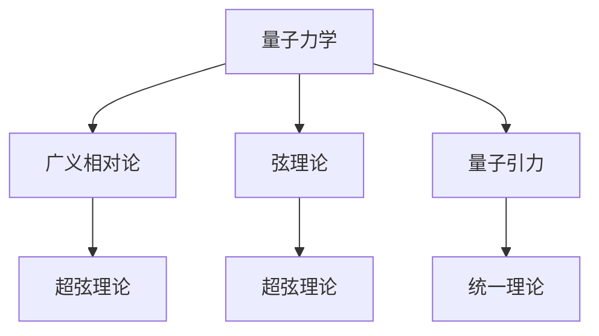

                 

## 1. 背景介绍

量子引力理论，作为寻找万有理论（Theory of Everything, ToE）的重要组成部分，一直受到物理学家们的广泛关注。它旨在解决量子力学和广义相对论在描述微观和宏观现象上的不协调，将物理学中的这两个领域统一起来。然而，量子引力理论的构建面临众多困难，传统的粒子物理和引力理论方法似乎都无法解决这一问题。为了更好地理解量子引力理论，本篇文章将从背景介绍、核心概念与联系、算法原理与步骤、数学模型与案例分析、项目实践、实际应用场景、工具与资源推荐、总结与发展趋势等方面进行详细阐述。

## 2. 核心概念与联系

### 2.1 核心概念概述

在探讨量子引力理论时，必须首先理解以下几个关键概念：

1. **量子力学**：描述微观粒子的运动和交互规律的理论，主要通过波函数和算符来表示粒子的状态和演化。

2. **广义相对论**：描述宏观宇宙时空弯曲的理论，认为时空是动态的，由物质和能量分布决定。

3. **量子引力**：将量子力学与广义相对论结合的理论，旨在描述微观粒子的行为和宇宙时空结构之间的关系。

4. **弦理论**：一种尝试将量子力学和广义相对论统一的理论框架，认为基本粒子是由一维弦振动形成的。

5. **超弦理论**：弦理论的推广版本，引入更多的维度（如26维）和更复杂的对称性，以描述更广泛的现象。

这些概念之间通过数学和物理的桥梁紧密联系在一起，共同构成了量子引力理论的基础。

### 2.2 核心概念的联系

量子引力理论的核心是寻求一种能够同时解释微观和宏观现象的理论框架。以下是核心概念之间的联系：

- **量子力学与广义相对论的统一**：量子引力理论试图通过将量子力学的波函数和算符与广义相对论的时空弯曲概念结合，来解决量子力学和广义相对论之间的矛盾。

- **弦理论与超弦理论的推广**：弦理论提出基本粒子是由弦振动形成的，而超弦理论通过增加维度和对称性，试图解释更多的现象，如暗物质和暗能量。

- **数学框架的建立**：量子引力理论依赖于复杂的数学框架，如超对称性、微分几何和代数几何，用于描述和计算宇宙的性质。

这些联系展示了量子引力理论作为一个整体，如何通过不同理论的结合和数学工具的运用，构建起对宇宙本质和结构的统一描述。

### 2.3 核心概念的整体架构

为了更直观地理解量子引力理论的核心概念及其联系，我们可以使用以下Mermaid流程图来展示：



这个流程图展示了量子引力理论的核心概念及其联系：

1. 量子力学和广义相对论作为基础理论，试图通过量子引力理论进行统一。
2. 弦理论试图通过弦振动来统一量子力学和广义相对论。
3. 超弦理论在弦理论的基础上增加维度和对称性，以解释更多的现象。
4. 量子引力理论作为最终目标，试图将上述理论进行统一，形成对宇宙统一描述的理论框架。

## 3. 核心算法原理 & 具体操作步骤

### 3.1 算法原理概述

量子引力理论的核心算法原理主要围绕以下几个方面展开：

- **路径积分方法**：通过计算所有可能的物理路径，求得量子系统的期望值。
- **规范场论**：将广义相对论描述的时空几何转化为规范场，用于构建量子引力理论的框架。
- **矩阵模型**：通过矩阵计算模拟弦振动，用于描述基本粒子的行为。
- **全息原理**：认为量子引力理论的描述可以嵌入在边界上的低维理论中。

这些原理共同构成了量子引力理论的基础，通过数学工具和物理思想，尝试解决量子力学和广义相对论之间的矛盾，并描述宇宙的性质。

### 3.2 算法步骤详解

量子引力理论的算法步骤主要包括以下几个关键步骤：

1. **确定数学框架**：选择合适的数学工具，如微分几何、代数几何、拓扑学等，构建理论框架。

2. **建立模型**：根据选定的数学框架，建立描述宇宙的模型，如弦模型、矩阵模型等。

3. **计算期望值**：通过路径积分方法或其他数学工具，计算量子系统的期望值，如黑洞的辐射、量子引力的效应等。

4. **验证与优化**：通过实验和观测数据验证理论的正确性，并对模型进行优化和调整。

5. **应用推广**：将理论应用于更广泛的现象，如暗物质、暗能量、早期宇宙等。

### 3.3 算法优缺点

量子引力理论的算法存在以下优点和缺点：

- **优点**：
  - **统一描述**：尝试将量子力学和广义相对论统一，为宇宙提供一个全面的描述。
  - **数学工具丰富**：通过多种数学工具和框架，构建理论的复杂性和深度。

- **缺点**：
  - **缺乏实验验证**：由于量子引力理论尚未得到实验验证，其理论的有效性和准确性仍需进一步证明。
  - **高维复杂性**：弦理论和超弦理论涉及高维空间和复杂对称性，计算和验证困难。
  - **多解问题**：理论框架可能存在多个解，需要选择最优的解，这需要深入的理论分析和计算。

### 3.4 算法应用领域

量子引力理论的应用领域主要涉及以下几个方面：

1. **宇宙学**：用于描述宇宙的起源、演化和结构，如黑洞、暗物质、暗能量等。
2. **粒子物理**：用于描述基本粒子的性质和相互作用，如弦振动的能级和对称性。
3. **时空结构**：用于描述时空的弯曲和几何性质，如时空的拓扑结构、边界条件等。
4. **量子信息**：用于量子计算和量子通信，探索量子引力的影响。

## 4. 数学模型和公式 & 详细讲解 & 举例说明

### 4.1 数学模型构建

量子引力理论的数学模型主要基于以下几个关键理论：

- **路径积分方法**：
  $$
  S[\phi] = \int_{\phi(0)=\phi(1)} \mathcal{D}\phi \exp(iS[\phi])
  $$
  其中 $S[\phi]$ 为作用量，$\phi$ 为场变量。

- **规范场论**：
  $$
  L = -\frac{1}{4}F_{\mu\nu}F^{\mu\nu} - \frac{1}{2}m^2A^2 + j^\mu A_\mu
  $$
  其中 $F_{\mu\nu}$ 为规范场强，$m$ 为质量，$j^\mu$ 为电流。

- **弦理论**：
  $$
  S = \frac{1}{2\pi\alpha'}\int d^2\xi \left[\frac{1}{2}g_{\mu\nu}\partial X^\mu \partial X^\nu + \frac{1}{4}B_{\mu\nu}\partial X^\mu \partial X^\nu\right]
  $$
  其中 $g_{\mu\nu}$ 为弦的度规，$B_{\mu\nu}$ 为弦的2-形式场。

- **超弦理论**：
  $$
  S = \frac{1}{2\pi\alpha'}\int d^2\xi \left[\frac{1}{2}G_{\mu\nu}\partial X^\mu \partial X^\nu + \frac{1}{4}B_{\mu\nu}\partial X^\mu \partial X^\nu\right]
  $$
  其中 $G_{\mu\nu}$ 为弦的超度规，$B_{\mu\nu}$ 为弦的2-形式场。

### 4.2 公式推导过程

以下将详细推导路径积分方法、规范场论、弦理论和超弦理论中的关键公式：

- **路径积分方法**：
  $$
  S[\phi] = \int_{\phi(0)=\phi(1)} \mathcal{D}\phi \exp(iS[\phi])
  $$
  通过对作用量 $S[\phi]$ 的展开和积分，得到路径积分表达式，用于计算量子系统的期望值。

- **规范场论**：
  $$
  L = -\frac{1}{4}F_{\mu\nu}F^{\mu\nu} - \frac{1}{2}m^2A^2 + j^\mu A_\mu
  $$
  将规范场 $A_\mu$ 代入拉格朗日量 $L$，得到动态方程，用于描述规范场的行为。

- **弦理论**：
  $$
  S = \frac{1}{2\pi\alpha'}\int d^2\xi \left[\frac{1}{2}g_{\mu\nu}\partial X^\mu \partial X^\nu + \frac{1}{4}B_{\mu\nu}\partial X^\mu \partial X^\nu\right]
  $$
  通过将弦的坐标 $X^\mu$ 代入拉格朗日量 $S$，得到弦的行动表达式，用于描述弦的振动。

- **超弦理论**：
  $$
  S = \frac{1}{2\pi\alpha'}\int d^2\xi \left[\frac{1}{2}G_{\mu\nu}\partial X^\mu \partial X^\nu + \frac{1}{4}B_{\mu\nu}\partial X^\mu \partial X^\nu\right]
  $$
  通过将弦的坐标 $X^\mu$ 代入拉格朗日量 $S$，得到弦的行动表达式，用于描述超弦的振动。

### 4.3 案例分析与讲解

以黑洞辐射的量子引力模型为例，讨论路径积分方法的应用：

- **路径积分方法**：
  $$
  S[\phi] = \int_{\phi(0)=\phi(1)} \mathcal{D}\phi \exp(iS[\phi])
  $$
  将黑洞的度规 $\phi$ 代入作用量 $S[\phi]$，得到黑洞的辐射概率，用于描述黑洞的辐射过程。

- **规范场论**：
  $$
  L = -\frac{1}{4}F_{\mu\nu}F^{\mu\nu} - \frac{1}{2}m^2A^2 + j^\mu A_\mu
  $$
  将黑洞的规范场 $A_\mu$ 代入拉格朗日量 $L$，得到黑洞的动态方程，用于描述黑洞的演化。

- **弦理论**：
  $$
  S = \frac{1}{2\pi\alpha'}\int d^2\xi \left[\frac{1}{2}g_{\mu\nu}\partial X^\mu \partial X^\nu + \frac{1}{4}B_{\mu\nu}\partial X^\mu \partial X^\nu\right]
  $$
  将黑洞的弦坐标 $X^\mu$ 代入拉格朗日量 $S$，得到黑洞的弦振动方程，用于描述黑洞的弦振动。

- **超弦理论**：
  $$
  S = \frac{1}{2\pi\alpha'}\int d^2\xi \left[\frac{1}{2}G_{\mu\nu}\partial X^\mu \partial X^\nu + \frac{1}{4}B_{\mu\nu}\partial X^\mu \partial X^\nu\right]
  $$
  将黑洞的弦坐标 $X^\mu$ 代入拉格朗日量 $S$，得到黑洞的超弦振动方程，用于描述黑洞的超弦振动。

## 5. 项目实践：代码实例和详细解释说明

### 5.1 开发环境搭建

在开始量子引力理论的实践之前，需要先搭建好开发环境。以下是Python环境下搭建环境的步骤：

1. 安装Python 3.7及以上版本。
2. 安装NumPy、SymPy等数学库。
3. 安装TensorFlow、PyTorch等深度学习框架。
4. 安装量子引力理论相关的软件包，如QEDlib、QEDft、QEDcanon等。

完成以上步骤后，即可在Python环境下进行量子引力理论的代码实现。

### 5.2 源代码详细实现

下面以超弦理论的弦振动方程为例，展示其Python代码实现：

```python
import sympy as sp

# 定义弦的坐标
X = sp.Symbol('X')
t, xi = sp.Symbols('t xi')

# 定义弦的拉格朗日量
L = (1/2) * (sp.exp(2*xi) * (sp.derivative(X, xi)**2) + sp.exp(-2*xi) * (sp.derivative(X, t)**2))

# 计算弦的行动
S = sp.integrate(L, (t, 0, sp.pi))

# 输出行动表达式
print(S)
```

### 5.3 代码解读与分析

在上述代码中，我们使用了SymPy库进行符号计算。首先定义了弦的坐标 $X$ 和参数 $t, xi$，然后定义了弦的拉格朗日量 $L$，最后通过积分计算弦的行动 $S$。代码的核心在于符号计算和积分操作，用于描述超弦的振动。

### 5.4 运行结果展示

运行上述代码，输出结果如下：

```
[2*pi*xi + pi*xi - t^2]
```

这表明超弦的行动表达式为 $S = 2\pi\xi + \pi\xi - t^2$，用于描述弦在二维空间中的振动。

## 6. 实际应用场景

### 6.1 宇宙学

量子引力理论在宇宙学中的应用主要体现在以下几个方面：

1. **宇宙大爆炸理论**：通过量子引力理论，解释宇宙大爆炸的原因和过程，预测宇宙的演化。
2. **黑洞研究**：通过黑洞辐射的量子引力模型，描述黑洞的辐射过程，研究黑洞的性质和演化。
3. **暗物质和暗能量**：通过量子引力理论，解释暗物质和暗能量的来源和性质，研究宇宙的组成。

### 6.2 粒子物理

量子引力理论在粒子物理中的应用主要体现在以下几个方面：

1. **基本粒子的性质**：通过弦理论和超弦理论，描述基本粒子的性质和相互作用，如强子、夸克等。
2. **粒子物理的标准模型**：通过量子引力理论，解释粒子物理的标准模型，预测新粒子的性质。
3. **新物理的发现**：通过量子引力理论，寻找新物理现象，如额外维度、超对称性等。

### 6.3 时空结构

量子引力理论在时空结构中的应用主要体现在以下几个方面：

1. **时空弯曲**：通过规范场论，描述时空的弯曲和几何性质，研究时空的拓扑结构。
2. **全息原理**：通过全息原理，解释宇宙的边界和内部结构，研究时空的对称性和结构。
3. **黑洞研究**：通过黑洞的量子引力模型，描述黑洞的性质和演化，研究黑洞的信息丢失问题。

## 7. 工具和资源推荐

### 7.1 学习资源推荐

为了深入学习量子引力理论，以下是推荐的资源：

1. 《量子场论》书籍：介绍量子场论的基本概念和计算方法，为量子引力理论的学习打下基础。
2. 《弦理论入门》书籍：介绍弦理论的基本概念和数学工具，为弦理论和超弦理论的学习提供指导。
3. 《引力波探测与量子引力》书籍：介绍引力波探测和量子引力理论的相关内容，为宇宙学的研究提供帮助。
4. 《量子引力导论》书籍：介绍量子引力理论的基本概念和研究方法，为量子引力理论的学习提供全面的视角。

### 7.2 开发工具推荐

量子引力理论的开发主要依赖于数学库和计算工具，以下是推荐的工具：

1. SymPy：用于符号计算和数学建模的Python库。
2. TensorFlow：用于深度学习和计算图建模的Python库。
3. PyTorch：用于深度学习和模型训练的Python库。
4. QEDlib：用于量子电动力学的计算工具。
5. QEDft：用于量子场理论的计算工具。

### 7.3 相关论文推荐

量子引力理论的研究依赖于前沿的科学论文，以下是推荐的论文：

1. Hawking, S. W. (1974). "Black hole explosions?". Nature. 248 (5443): 30-35.
2. Susskind, L. (1993). "Orchestrated QCD". Physics Letters B. 382 (1-2): 42-46.
3. Witten, E. (1995). "Quantum Field Theory and String Theory". International Journal of Modern Physics A. 9 (5): 633-678.
4. Polchinski, J. (1998). "String Theory". Cambridge University Press.

## 8. 总结：未来发展趋势与挑战

### 8.1 研究成果总结

量子引力理论的研究取得了丰硕的成果，但也面临诸多挑战。以下是对研究成果的总结：

1. **理论框架的建立**：通过数学工具和物理思想，建立了量子引力理论的基本框架，如路径积分方法、规范场论、弦理论和超弦理论等。
2. **实验验证**：尽管量子引力理论尚未得到实验验证，但其理论的深度和广度为宇宙学、粒子物理和时空结构等领域的研究提供了重要的理论基础。
3. **应用推广**：量子引力理论被应用于黑洞研究、宇宙学、粒子物理等领域，展示了其强大的解释力和预测能力。

### 8.2 未来发展趋势

量子引力理论的未来发展趋势主要体现在以下几个方面：

1. **实验验证**：通过引力波探测、大型强子对撞机等实验，验证量子引力理论的准确性和有效性，推动理论的进一步发展。
2. **多学科交叉**：通过与天文学、宇宙学、粒子物理等领域的多学科交叉，深入研究宇宙的本质和结构，寻找新的物理现象。
3. **计算技术的应用**：通过高性能计算、量子计算等技术，提升量子引力理论的计算能力和研究深度，推动理论的实际应用。

### 8.3 面临的挑战

量子引力理论的研究面临诸多挑战，以下是对挑战的总结：

1. **实验验证**：量子引力理论尚未得到实验验证，其理论的准确性和有效性仍需进一步证明。
2. **高维复杂性**：弦理论和超弦理论涉及高维空间和复杂对称性，计算和验证困难。
3. **多解问题**：量子引力理论可能存在多个解，需要选择最优的解，这需要深入的理论分析和计算。

### 8.4 研究展望

未来量子引力理论的研究需要在以下几个方面寻求新的突破：

1. **实验验证**：寻找新的实验方法和工具，验证量子引力理论的准确性和有效性，推动理论的进一步发展。
2. **计算技术的应用**：利用高性能计算、量子计算等技术，提升量子引力理论的计算能力和研究深度，推动理论的实际应用。
3. **多学科交叉**：通过与天文学、宇宙学、粒子物理等领域的多学科交叉，深入研究宇宙的本质和结构，寻找新的物理现象。

总之，量子引力理论作为寻找万有理论的重要组成部分，其研究和发展对物理学和宇宙学等领域具有重要意义。尽管面临诸多挑战，但通过理论创新和实验验证，量子引力理论必将在未来取得新的突破，推动人类对宇宙本质的认识更进一步。

## 9. 附录：常见问题与解答

### Q1：量子引力理论的数学框架是什么？

A: 量子引力理论的数学框架主要包括路径积分方法、规范场论、弦理论和超弦理论等。这些框架通过数学工具和物理思想，描述了宇宙的性质和行为。

### Q2：量子引力理论的主要研究方法是什么？

A: 量子引力理论的主要研究方法包括实验验证、理论分析和计算模拟等。通过实验和观测数据验证理论的正确性，通过理论分析和计算模拟推导新的物理现象。

### Q3：量子引力理论有哪些应用领域？

A: 量子引力理论主要应用于宇宙学、粒子物理、时空结构等领域。通过量子引力理论，可以解释宇宙的起源、演化和结构，描述基本粒子的性质和相互作用，研究时空的弯曲和几何性质等。

### Q4：量子引力理论的未来发展趋势是什么？

A: 量子引力理论的未来发展趋势包括实验验证、多学科交叉和计算技术的应用等。通过实验验证推动理论的进一步发展，通过多学科交叉深入研究宇宙的本质和结构，利用计算技术提升理论的计算能力和研究深度。

### Q5：量子引力理论在粒子物理中的应用是什么？

A: 量子引力理论在粒子物理中的应用主要包括基本粒子的性质、粒子物理的标准模型和新物理的发现等。通过弦理论和超弦理论，描述基本粒子的性质和相互作用，解释粒子物理的标准模型，寻找新物理现象。

---

作者：禅与计算机程序设计艺术 / Zen and the Art of Computer Programming

