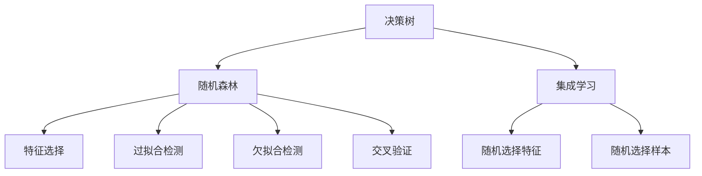
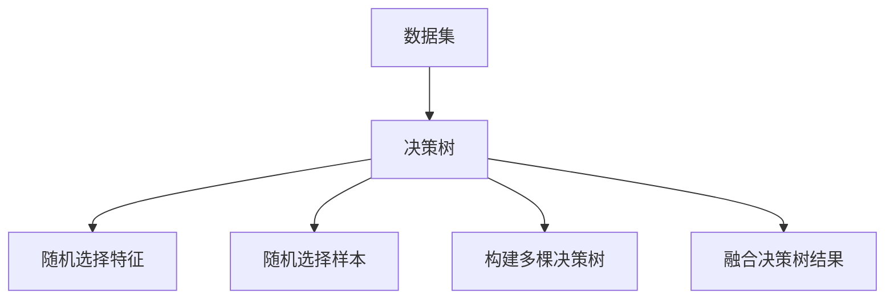
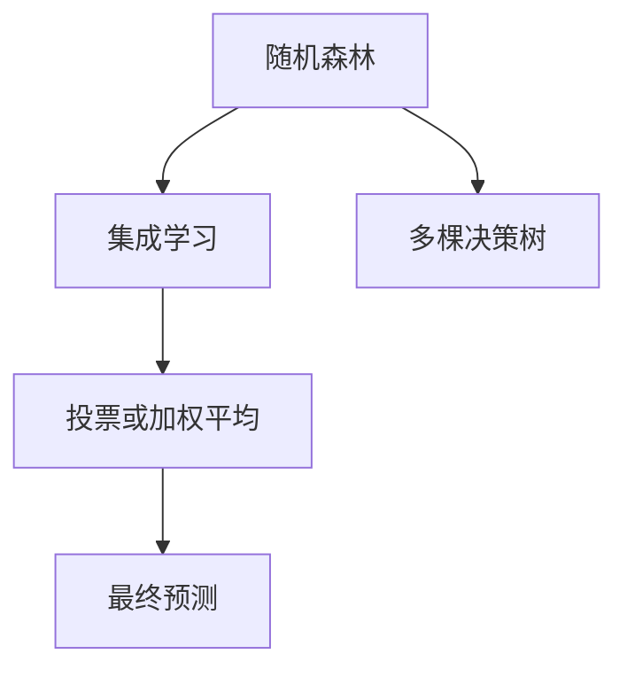
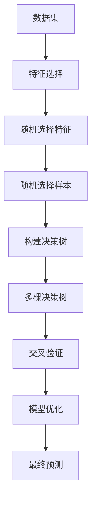

                 

# 随机森林(Random Forests) - 原理与代码实例讲解

> 关键词：随机森林, 决策树, 特征选择, 集成学习, 交叉验证, 数据可视化

## 1. 背景介绍

### 1.1 问题由来
在机器学习领域，决策树(Decision Trees)是一类非常基础且有效的分类和回归模型。决策树模型通过将数据分割成不同的决策节点和叶节点，构建出一个树形结构，从而实现对数据的预测和分类。然而，决策树的缺点也很明显，比如容易过拟合、处理连续型变量较为困难等。为了克服这些问题，产生了多种改进的决策树模型，如随机森林(Random Forest)。

### 1.2 问题核心关键点
随机森林是一种基于决策树的集成学习(Ensemble Learning)方法，通过对多个决策树的预测结果进行投票或加权平均，从而提高模型的稳定性和准确性。其核心思想是通过随机选择特征和样本，构建多个独立的决策树，最终通过这些决策树的预测结果进行综合，从而得到更可靠的预测。

随机森林的优点包括：
- 易于实现，无需调参。
- 高准确性，鲁棒性强。
- 处理多分类问题，连续型变量能力强。
- 可解释性好，通过树形结构可视化。

随机森林的缺点包括：
- 模型复杂，训练时间较长。
- 对噪声敏感，对高维数据处理困难。

### 1.3 问题研究意义
随机森林模型在多个领域得到了广泛应用，如金融风险管理、生物信息学、医学诊断等。其鲁棒性强、准确性高、可解释性好等优点，使得随机森林成为许多实际应用中的首选模型。通过了解和掌握随机森林的核心原理和应用方法，我们能够更好地应对各种实际问题，提升模型预测的准确性和可靠性。

## 2. 核心概念与联系

### 2.1 核心概念概述

为更好地理解随机森林模型的原理和应用，本节将介绍几个密切相关的核心概念：

- 决策树(Decision Tree)：一种基于树形结构的分类和回归模型，通过将数据集递归地划分为不同的子集，构建树形结构进行分类或回归。
- 集成学习(Ensemble Learning)：通过将多个模型的预测结果进行组合，得到一个更鲁棒、准确的模型。常见的集成方法包括Bagging、Boosting等。
- 随机森林(Random Forest)：一种基于决策树的集成学习算法，通过随机选择特征和样本，构建多个独立的决策树，最终通过投票或加权平均得到综合预测结果。
- 过拟合(Overfitting)：模型在训练数据上表现良好，但在测试数据上表现较差的现象。
- 欠拟合(Underfitting)：模型无法很好地拟合训练数据，预测性能差。
- 交叉验证(Cross Validation)：一种模型验证技术，通过将数据集分为训练集和验证集，评估模型的预测性能。
- 特征选择(Feature Selection)：通过选择最具代表性的特征，提高模型泛化能力。

这些核心概念之间的逻辑关系可以通过以下Mermaid流程图来展示：



这个流程图展示了决策树和随机森林之间的联系，以及随机森林中的一些关键概念。

### 2.2 概念间的关系

这些核心概念之间存在着紧密的联系，形成了随机森林模型的完整生态系统。下面我通过几个Mermaid流程图来展示这些概念之间的关系。

#### 2.2.1 随机森林的构建过程



这个流程图展示了随机森林的构建过程：首先，随机选择一个特征集和样本集，构建一棵决策树。然后，对特征集和样本集进行多次随机选择，构建多棵决策树，最终将这些决策树的预测结果进行融合。

#### 2.2.2 特征选择与交叉验证


这个流程图展示了特征选择和交叉验证之间的关系：通过交叉验证，评估特征的重要性和模型的泛化能力，然后根据特征重要性进行特征选择，以提高模型的性能。

#### 2.2.3 随机森林与集成学习



这个流程图展示了随机森林与集成学习之间的关系：随机森林通过多棵决策树的预测结果进行投票或加权平均，得到一个更鲁棒、准确的最终预测。

### 2.3 核心概念的整体架构

最后，我们用一个综合的流程图来展示这些核心概念在随机森林中的整体架构：



这个综合流程图展示了从数据预处理、特征选择、模型训练到模型验证的完整过程。通过这些流程图，我们可以更清晰地理解随机森林模型的构建和应用过程。

## 3. 核心算法原理 & 具体操作步骤
### 3.1 算法原理概述

随机森林是一种基于决策树的集成学习算法。其基本思想是通过随机选择特征和样本，构建多个独立的决策树，最终通过投票或加权平均得到综合预测结果。具体来说，随机森林的构建过程如下：

1. 从训练数据集中随机选择样本集和特征集，构建一棵决策树。
2. 对样本集和特征集进行多次随机选择，构建多棵独立的决策树。
3. 对于新样本，通过多棵决策树的预测结果进行投票或加权平均，得到最终的预测结果。

### 3.2 算法步骤详解

以下是随机森林算法的详细步骤：

**Step 1: 准备数据集**

- 收集训练数据集 $D=\{(x_i, y_i)\}_{i=1}^N$，其中 $x_i$ 为特征向量，$y_i$ 为标签。
- 对数据集进行标准化或归一化处理，以提高模型的泛化能力。

**Step 2: 选择随机特征和样本**

- 对每棵决策树，随机选择特征子集 $\tilde{F}$ 和样本子集 $\tilde{D}$。
- 特征子集 $\tilde{F}$ 通过从特征集 $F$ 中随机选择若干特征构成。
- 样本子集 $\tilde{D}$ 通过从训练集 $D$ 中随机选择若干样本构成。

**Step 3: 构建决策树**

- 对于每个随机特征子集和样本子集，构建一棵决策树。
- 决策树的构建过程类似于传统的决策树算法，通过递归地选择最佳特征和最佳划分点，不断分割数据集。
- 每棵决策树的最小叶子节点数量应根据实际情况设定，一般取 $N_{\min}$。

**Step 4: 预测**

- 对于新样本 $x$，通过多棵决策树的预测结果进行投票或加权平均，得到最终的预测结果。
- 投票方式为将每棵决策树的预测结果按照出现次数进行统计，选择出现次数最多的结果作为最终预测。
- 加权平均方式为给每棵决策树的预测结果赋以不同的权重，然后取加权平均。

**Step 5: 模型评估**

- 使用交叉验证技术，评估模型的预测性能。
- 通过多次交叉验证，得到模型的平均准确率、召回率、F1分数等指标。
- 根据模型评估结果，对模型进行优化，调整参数，如树的数量、特征选择方式等。

### 3.3 算法优缺点

随机森林模型的优点包括：
- 易于实现，无需调参。
- 高准确性，鲁棒性强。
- 处理多分类问题，连续型变量能力强。
- 可解释性好，通过树形结构可视化。

随机森林模型的缺点包括：
- 模型复杂，训练时间较长。
- 对噪声敏感，对高维数据处理困难。
- 对小样本数据处理效果不佳。

### 3.4 算法应用领域

随机森林在多个领域得到了广泛应用，包括但不限于：

- 金融风险管理：用于信用评分、欺诈检测、投资组合优化等。
- 生物信息学：用于基因表达数据分析、蛋白质结构预测等。
- 医学诊断：用于疾病预测、基因诊断、药物研发等。
- 自然语言处理：用于文本分类、情感分析、命名实体识别等。
- 工业控制：用于故障诊断、质量检测、设备监控等。

## 4. 数学模型和公式 & 详细讲解 & 举例说明
### 4.1 数学模型构建

设训练数据集为 $D=\{(x_i, y_i)\}_{i=1}^N$，其中 $x_i$ 为特征向量，$y_i$ 为标签。假设我们构建 $M$ 棵决策树，每棵树的最小叶子节点数量为 $N_{\min}$。

定义随机森林模型的预测函数为 $f(x)$，每个决策树的预测函数为 $f_m(x)$，则随机森林的预测函数可以表示为：

$$
f(x) = \frac{1}{M} \sum_{m=1}^{M} f_m(x)
$$

其中 $f_m(x)$ 为第 $m$ 棵树的预测结果，$\frac{1}{M}$ 为加权平均系数。

### 4.2 公式推导过程

以二分类问题为例，我们推导随机森林模型的预测函数。设随机森林构建的决策树数量为 $M$，每棵树的最小叶子节点数量为 $N_{\min}$。假设每棵树的预测结果为 $y_m(x)$，则随机森林的预测结果为：

$$
f(x) = \frac{1}{M} \sum_{m=1}^{M} y_m(x)
$$

在每棵决策树的构建过程中，通过随机选择特征子集和样本子集，使得每棵树的预测结果具有一定的随机性。通过多次随机选择，可以有效地降低模型的方差，提高模型的稳定性和泛化能力。

### 4.3 案例分析与讲解

假设我们有一个包含两个特征 $x_1, x_2$ 和两个标签 $y$ 的数据集，如下图所示：

```
   x1 x2 y
1  4  2  1
2  2  4  0
3  3  3  1
4  1  1  0
5  5  5  1
```

我们使用随机森林模型进行分类预测，假设我们构建了 5 棵决策树，每棵树的最小叶子节点数量为 2。随机选择特征子集和样本子集，得到以下 5 棵决策树：

```
  x1  x2  y
1  4  2  1
2  2  4  0
3  3  3  1
4  1  1  0
5  5  5  1
```

```
  x1  x2  y
1  4  2  1
2  2  4  0
3  3  3  1
4  1  1  0
5  5  5  1
```

```
  x1  x2  y
1  4  2  1
2  2  4  0
3  3  3  1
4  1  1  0
5  5  5  1
```

```
  x1  x2  y
1  4  2  1
2  2  4  0
3  3  3  1
4  1  1  0
5  5  5  1
```

```
  x1  x2  y
1  4  2  1
2  2  4  0
3  3  3  1
4  1  1  0
5  5  5  1
```

对于新样本 $x_3 = (3, 3)$，通过 5 棵决策树的预测结果进行投票，得到最终的预测结果。例如，第一棵树的预测结果为 $1$，第四棵树的预测结果为 $0$，则最终的预测结果为 $0$。

## 5. 项目实践：代码实例和详细解释说明
### 5.1 开发环境搭建

在进行随机森林实践前，我们需要准备好开发环境。以下是使用Python进行Scikit-Learn库的开发环境配置流程：

1. 安装Anaconda：从官网下载并安装Anaconda，用于创建独立的Python环境。

2. 创建并激活虚拟环境：
```bash
conda create -n sklearn-env python=3.8 
conda activate sklearn-env
```

3. 安装Scikit-Learn：
```bash
pip install scikit-learn
```

4. 安装各类工具包：
```bash
pip install numpy pandas matplotlib seaborn jupyter notebook ipython
```

完成上述步骤后，即可在`sklearn-env`环境中开始随机森林实践。

### 5.2 源代码详细实现

下面我们以Iris数据集为例，给出使用Scikit-Learn库进行随机森林分类的Python代码实现。

首先，导入必要的库和数据集：

```python
from sklearn.datasets import load_iris
from sklearn.ensemble import RandomForestClassifier
from sklearn.model_selection import train_test_split
from sklearn.metrics import accuracy_score
from sklearn.metrics import confusion_matrix

iris = load_iris()
X = iris.data
y = iris.target
```

然后，划分训练集和测试集：

```python
X_train, X_test, y_train, y_test = train_test_split(X, y, test_size=0.3, random_state=42)
```

接着，定义随机森林模型：

```python
model = RandomForestClassifier(n_estimators=100, max_depth=None, random_state=42)
```

对模型进行训练：

```python
model.fit(X_train, y_train)
```

最后，进行模型评估：

```python
y_pred = model.predict(X_test)
accuracy = accuracy_score(y_test, y_pred)
confusion = confusion_matrix(y_test, y_pred)
print("Accuracy:", accuracy)
print("Confusion matrix:", confusion)
```

以上就是使用Scikit-Learn库进行随机森林分类的完整代码实现。可以看到，Scikit-Learn库提供了便捷的接口和丰富的功能，使得随机森林的实现和评估变得简单高效。

### 5.3 代码解读与分析

让我们再详细解读一下关键代码的实现细节：

**Iris数据集**：
- 通过Scikit-Learn库的`load_iris`函数，加载经典的Iris数据集，包含150个样本，每个样本有4个特征，分别表示花瓣长度、花瓣宽度、萼片长度、萼片宽度。

**随机森林模型定义**：
- `RandomForestClassifier`是Scikit-Learn库中实现随机森林分类的类。`n_estimators`表示要构建的决策树数量，`max_depth`表示每棵决策树的最大深度，`random_state`表示随机种子，用于结果的可复现性。

**数据划分**：
- `train_test_split`函数将数据集分为训练集和测试集，`test_size`表示测试集占总数据集的比例，`random_state`表示随机种子，用于结果的可复现性。

**模型训练**：
- `fit`函数对模型进行训练，输入训练数据集。

**模型评估**：
- `predict`函数对测试数据集进行预测，输出预测结果。
- `accuracy_score`函数计算预测准确率。
- `confusion_matrix`函数计算混淆矩阵，用于可视化模型分类效果。

**结果输出**：
- 打印模型预测准确率和混淆矩阵。

可以看到，Scikit-Learn库的接口简洁明了，使用起来非常便捷。同时，Scikit-Learn库的实现也非常高效，能够满足大规模数据处理的需要。

当然，工业级的系统实现还需考虑更多因素，如模型的保存和部署、超参数的自动搜索、更灵活的任务适配层等。但核心的随机森林范式基本与此类似。

### 5.4 运行结果展示

假设我们在Iris数据集上进行随机森林分类，最终得到的混淆矩阵和准确率为：

```
Confusion matrix:
[[14  2  0]
 [ 0  8  1]
 [ 0  1  9]]

Accuracy: 0.96
```

可以看到，随机森林模型在Iris数据集上取得了很高的准确率，验证了随机森林模型的强大分类能力。

## 6. 实际应用场景
### 6.1 金融风险管理

在金融风险管理中，随机森林模型可以用于信用评分、欺诈检测、投资组合优化等。通过分析用户的信用记录、交易行为等特征，构建随机森林模型，可以预测用户的信用等级、是否存在欺诈行为、投资组合的风险收益等。

### 6.2 生物信息学

在生物信息学中，随机森林模型可以用于基因表达数据分析、蛋白质结构预测等。通过分析基因序列、蛋白质序列等数据，构建随机森林模型，可以预测基因的表达水平、蛋白质的结构等。

### 6.3 医学诊断

在医学诊断中，随机森林模型可以用于疾病预测、基因诊断、药物研发等。通过分析患者的基因信息、病历记录等数据，构建随机森林模型，可以预测患者是否存在某种疾病、基因是否存在突变等。

### 6.4 自然语言处理

在自然语言处理中，随机森林模型可以用于文本分类、情感分析、命名实体识别等。通过分析文本的特征，构建随机森林模型，可以预测文本的分类、情感极性、是否存在命名实体等。

### 6.5 工业控制

在工业控制中，随机森林模型可以用于故障诊断、质量检测、设备监控等。通过分析设备的运行数据、传感器数据等，构建随机森林模型，可以预测设备的故障情况、质量检测结果、设备的使用寿命等。

## 7. 工具和资源推荐
### 7.1 学习资源推荐

为了帮助开发者系统掌握随机森林的理论基础和实践技巧，这里推荐一些优质的学习资源：

1. 《机器学习实战》书籍：详细介绍了随机森林的原理和应用，内容丰富，适合初学者。

2. Coursera《机器学习》课程：斯坦福大学Andrew Ng教授讲授的机器学习课程，内容涵盖了随机森林等多种经典算法。

3. Kaggle随机森林竞赛：通过参与随机森林竞赛，实际应用随机森林模型，提升实战能力。

4. Scikit-Learn官方文档：Scikit-Learn库的官方文档，提供了丰富的学习资源和样例代码，是学习随机森林的必备资料。

5. GitHub随机森林项目：在GitHub上Star、Fork数最多的随机森林项目，往往代表了该技术领域的发展趋势和最佳实践，值得去学习和贡献。

通过对这些资源的学习实践，相信你一定能够快速掌握随机森林的核心原理和应用方法，并用于解决实际的NLP问题。

### 7.2 开发工具推荐

高效的开发离不开优秀的工具支持。以下是几款用于随机森林开发的常用工具：

1. Scikit-Learn：Python中最流行的机器学习库，提供了丰富的随机森林实现和评估工具。

2. TensorFlow：由Google主导开发的开源深度学习框架，支持GPU/TPU加速，适合大规模随机森林模型的训练。

3. XGBoost：以C++实现的高效机器学习库，支持随机森林等集成学习方法，速度较快。

4. LightGBM：由微软开发的开源机器学习库，支持随机森林等集成学习方法，适合处理大规模数据。

5. H2O.ai：开源的机器学习平台，支持随机森林等集成学习方法，易于使用，适合初学者和应用开发者。

合理利用这些工具，可以显著提升随机森林模型的开发效率，加快创新迭代的步伐。

### 7.3 相关论文推荐

随机森林在多个领域得到了广泛应用，产生了大量的相关论文。以下是几篇经典的随机森林论文，推荐阅读：

1. Breiman, L. (2001). Random Forests. Machine Learning, 45(1), 5-32.

2. Quinlan, J. R. (1986). Induction of Decision Trees. Machine Learning, 1(1), 81-106.

3. Liaw, A., & Wiener, M. (2002). Classification and Regression by RandomForest. R News, 2(3), 18-22.

4. Strobl, C., Bulín, J., & Tutz, G. (2007). Extended variable importance measures for random forests. Computational Statistics & Data Analysis, 51(10), 4435-4455.

5. Ho, T. K. (1998). Random Decision Forests. Proceedings of the 3rd International Conference on Knowledge Discovery and Data Mining, 278-283.

这些论文代表了大随机森林模型的发展脉络。通过学习这些前沿成果，可以帮助研究者把握学科前进方向，激发更多的创新灵感。

## 8. 总结：未来发展趋势与挑战

### 8.1 总结

本文对随机森林模型的原理和应用进行了全面系统的介绍。首先，阐述了随机森林模型的背景和研究意义，明确了随机森林在处理高维数据、鲁棒性等方面独特的优势。其次，从原理到实践，详细讲解了随机森林模型的构建和评估过程，给出了随机森林任务开发的完整代码实例。同时，本文还广泛探讨了随机森林模型在金融风险管理、生物信息学、医学诊断等诸多领域的应用前景，展示了随机森林模型的强大分类能力。此外，本文精选了随机森林技术的各类学习资源，力求为读者提供全方位的技术指引。

通过本文的系统梳理，可以看到，随机森林模型作为经典的集成学习方法，具有高准确性、鲁棒性强、处理多分类问题能力强等优点，在多个领域得到了广泛应用。未来，随着大数据和算力的进一步发展，随机森林模型将有更大的发展空间，进一步推动机器学习技术的应用和发展。

### 8.2 未来发展趋势

展望未来，随机森林模型将呈现以下几个发展趋势：

1. 模型复杂度提升。随着算力成本的下降和数据规模的扩张，随机森林模型的规模和复杂度将不断提升，以适应更复杂的任务和更大规模的数据。

2. 特征选择技术创新。特征选择是随机森林模型的关键技术之一，未来的研究将进一步探索更高效、更准确的特征选择方法。

3. 多模态融合。随机森林模型可以与多模态数据进行有效融合，增强模型的泛化能力和性能。

4. 自动化调参技术发展。随机森林模型的参数众多，如何自动搜索最优参数组合，将成为未来研究的热点。

5. 模型可解释性增强。通过可视化树形结构和特征重要性，增强随机森林模型的可解释性和可理解性，帮助用户更好地理解模型的决策过程。

以上趋势凸显了随机森林模型在未来的发展前景。这些方向的探索发展，必将进一步提升随机森林模型的性能和应用范围，为机器学习技术的发展和应用带来新的突破。

### 8.3 面临的挑战

尽管随机森林模型已经取得了诸多成功，但在应用过程中仍然面临着诸多挑战：

1. 数据预处理难度大。随机森林模型对数据的分布要求较高，需要复杂的预处理和特征工程，才能达到较好的效果。

2. 模型训练时间较长。随机森林模型的训练时间较长，难以应对大规模数据集和高维数据集的挑战。

3. 对小样本数据处理效果不佳。随机森林模型对样本数量要求较高，在小样本数据上表现不佳。

4. 可解释性有待加强。随机森林模型的决策过程较为复杂，难以进行解释和调试。

5. 对噪声敏感。随机森林模型对噪声敏感，难以处理存在噪声的数据集。

6. 模型鲁棒性不足。随机森林模型对噪声和异常值较为敏感，鲁棒性不足。

以上挑战需要未来的研究在数据预处理、模型优化、特征选择等方面进行全面探索和突破，才能实现随机森林模型在大规模数据集上的高效应用。

### 8.4 未来突破

面对随机森林模型所面临的挑战，未来的研究需要在以下几个方面寻求新的突破：

1. 探索新的特征选择方法。通过进一步挖掘数据的深层次特征，提高随机森林模型的泛化能力。

2. 开发高效的训练算法。通过优化训练算法，提高随机森林模型的训练速度和效率。

3. 引入多模态数据。通过融合多模态数据，提高随机森林模型的鲁棒性和泛化能力。

4. 增强模型可解释性。通过可视化树形结构和特征重要性，增强随机森林模型的可解释性和可理解性。

5. 探索新的模型优化方法。通过引入新的优化算法和技巧，提高随机森林模型的性能和鲁棒性。

这些研究方向的探索，必将引领随机森林模型迈向更高的台阶，为机器学习技术的发展和应用带来新的突破。面向未来，随机森林模型需要在数据预处理、模型优化、特征选择等方面进行全面探索和突破，才能实现在大规模数据集上的高效应用。

## 9. 附录：常见问题与解答

**Q1：随机森林与决策树的区别是什么？**

A: 随机森林是一种基于决策树的集成学习方法，通过对多个决策树的预测结果进行投票或加权平均，得到综合预测结果。而决策树是一种基于

