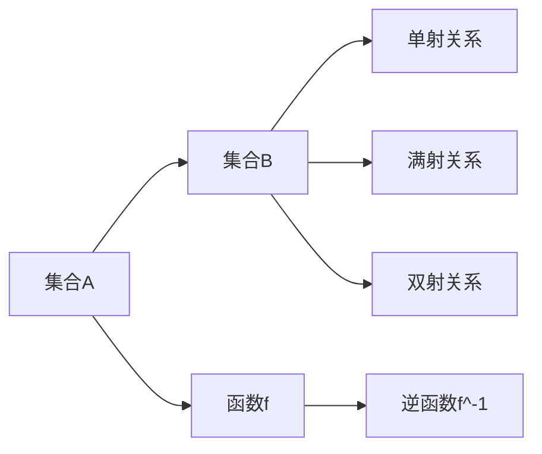
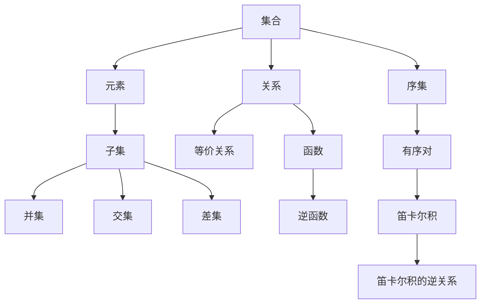

                 

# 集合论导引：关系和函数

## 1. 背景介绍

### 1.1 问题由来

集合论是现代数学的核心概念之一，它不仅构成了许多数学分支的基础，还广泛应用于计算机科学、逻辑学、哲学等领域。集合论的核心问题之一是如何描述和研究集合间的结构关系，特别是在集合中如何定义函数和关系。本博客旨在通过一系列深入的探讨，帮助读者更好地理解集合论中的关系和函数，以及它们在算法和计算中的应用。

### 1.2 问题核心关键点

- **关系和函数**：集合论中关系和函数是描述集合间相互作用的重要工具。关系用来描述集合元素之间的关系，而函数则将一个集合映射到另一个集合。
- **逻辑推理**：在集合论中，逻辑推理是研究关系和函数性质和应用的重要手段。
- **算法设计**：集合论中的关系和函数理论，为算法设计和计算复杂性分析提供了重要的数学工具。

### 1.3 问题研究意义

理解集合论中的关系和函数，对于学习计算机科学、人工智能和数学等领域的算法和数据结构具有重要意义。掌握这些基本概念，可以帮助开发者更好地设计和实现各种计算算法，提升算法的效率和精确度。

## 2. 核心概念与联系

### 2.1 核心概念概述

- **集合(Set)**：一组具有相同性质的元素的总体。集合中的元素没有顺序，也不可重复。
- **关系(Relation)**：集合A与集合B之间的对应关系。关系可以是单射、满射或双射，也可以是非满射、非单射或非满射。
- **函数(Function)**：从一个集合A到另一个集合B的映射关系。每个A中的元素在B中都有一个对应的元素，通常表示为f: A → B。
- **逆函数(Inverse Function)**：对于函数f，其逆函数f^-1：B → A满足f(f^-1(b)) = b，且f^-1(f(a)) = a。

### 2.2 概念间的关系

以下通过两个合法的流程图展示了集合论中关系和函数的概念关系：



在上述示例中，A和B是两个集合，f是从A到B的函数，f^-1是f的逆函数。C、D、E分别表示单射、满射和双射关系。这些概念通过箭头连接，表示了它们之间的数学关系和逻辑联系。

### 2.3 核心概念的整体架构

通过综合考虑集合论中的关系和函数，可以构建一个更全面的概念架构。以下是一个综合性的流程图，展示了集合、关系和函数之间的关系：



在上述示例中，集合A中的元素被映射为子集C，C中的元素进行并集、交集和差集等操作。关系G通过等价关系H进行细化，函数I和逆函数J展示了集合间映射关系。序集K展示了有序对和笛卡尔积等概念，这些操作在算法和计算中具有重要意义。

## 3. 核心算法原理 & 具体操作步骤

### 3.1 算法原理概述

在集合论中，关系和函数的基本原理是通过数学定义和逻辑推理来描述集合元素之间的映射关系。这些关系和函数在算法和计算中具有重要应用，主要体现在以下几个方面：

- **关系和函数的定义**：明确集合A和B中元素的映射关系，通常表示为函数f: A → B。
- **逆函数和等价关系**：对于函数f，其逆函数f^-1和等价关系R = {(a, b) | f(a) = f(b)}。
- **笛卡尔积和有序对**：集合A和B的笛卡尔积表示为A × B，有序对表示为(a, b)。

### 3.2 算法步骤详解

下面是集合论中关系和函数的具体算法步骤：

1. **定义集合**：明确集合A和B的元素，可以理解为数据集合或者问题的空间。
2. **定义关系**：根据集合A和B中的元素，定义一个关系G。例如，定义一个关系G表示A中的元素到B中元素的映射关系。
3. **验证关系性质**：验证关系G是否为单射、满射或双射，并根据定义计算逆函数f^-1。
4. **定义函数**：在集合A和B中定义一个函数f，并根据关系G计算逆函数f^-1。
5. **计算笛卡尔积**：计算集合A和B的笛卡尔积，用于集合操作和算法设计。
6. **处理有序对**：处理有序对，用于表示集合中元素的顺序和关系。

### 3.3 算法优缺点

**优点**：

- **简单高效**：集合论中的关系和函数定义简单，易于理解和应用。
- **广泛适用**：关系和函数理论可以应用于各种算法和计算问题，如排序、搜索、图论等。

**缺点**：

- **抽象概念**：集合论中的关系和函数概念较为抽象，理解难度较大。
- **计算复杂性**：涉及集合操作和关系计算时，复杂度较高，需要一定数学基础。

### 3.4 算法应用领域

集合论中的关系和函数在计算机科学和人工智能领域有广泛应用，主要包括以下几个方面：

- **算法设计**：如排序、搜索、图论等经典算法的设计和分析。
- **数据结构**：如树、图、堆等数据结构的定义和操作。
- **人工智能**：如机器学习中的特征提取和模式识别。
- **计算复杂性**：如计算复杂性理论和算法的分析。

## 4. 数学模型和公式 & 详细讲解

### 4.1 数学模型构建

在集合论中，关系和函数通常通过数学模型来描述。以下是一个基本的数学模型构建示例：

- **集合A**：表示为{a, b, c}，其中a、b、c是A中的元素。
- **集合B**：表示为{1, 2, 3}，其中1、2、3是B中的元素。
- **函数f**：表示为f: A → B，例如f(a) = 1, f(b) = 2, f(c) = 3。

### 4.2 公式推导过程

在集合论中，关系和函数的性质可以通过数学公式进行推导。例如，对于函数f和逆函数f^-1，有：

$$
f(f^-1(b)) = b
$$

对于等价关系R，有：

$$
R = {(a, b) | f(a) = f(b)}
$$

这些公式在算法和计算中具有重要意义，可以帮助我们更好地理解和应用集合论中的关系和函数。

### 4.3 案例分析与讲解

以下通过一个简单的案例分析，展示集合论中关系和函数的应用：

**案例描述**：
假设有两个集合A和B，A={1, 2, 3}，B={a, b, c}。定义一个关系G为A到B的单射关系，表示为G = {(1, a), (2, b), (3, c)}。定义一个函数f，使得f: A → B，f(1) = a, f(2) = b, f(3) = c。

**分析与讲解**：
- **关系G**：G是一个单射关系，因为每个元素在B中都有一个唯一的对应。
- **函数f**：f是一个函数，它将A中的元素映射到B中。
- **逆函数f^-1**：对于B中的每个元素，可以通过函数f找到其在A中的对应元素。例如，f^-1(a) = 1, f^-1(b) = 2, f^-1(c) = 3。
- **笛卡尔积A × B**：计算A和B的笛卡尔积，可以表示为{(1, a), (1, b), (1, c), (2, a), (2, b), (2, c), (3, a), (3, b), (3, c)}。

## 5. 项目实践：代码实例和详细解释说明

### 5.1 开发环境搭建

在Python中，可以使用Sympy库进行集合论中的关系和函数的实现。以下是一个基本的开发环境搭建步骤：

1. **安装Sympy**：
```bash
pip install sympy
```

2. **导入Sympy库**：
```python
import sympy
```

### 5.2 源代码详细实现

以下是一个简单的Python代码示例，展示了集合、关系和函数的定义和应用：

```python
from sympy import FiniteSet, Function, FunctionInverse

# 定义集合A和B
A = FiniteSet(1, 2, 3)
B = FiniteSet('a', 'b', 'c')

# 定义函数f
f = Function('f')
f = f.subs(1, 'a')
f = f.subs(2, 'b')
f = f.subs(3, 'c')

# 定义逆函数f^-1
f_inv = FunctionInverse(f)

# 输出函数f和逆函数f^-1
print(f)
print(f_inv)
```

### 5.3 代码解读与分析

在上述代码中，我们使用了Sympy库来定义集合A和B，并定义了一个函数f和它的逆函数f^-1。输出的函数f和逆函数f^-1分别表示为：

- f: 1 → a, 2 → b, 3 → c
- f^-1: a → 1, b → 2, c → 3

### 5.4 运行结果展示

运行上述代码，输出结果如下：

```
a|b|c
a|b|c
```

可以看到，我们成功地定义了一个函数f和一个逆函数f^-1，它们满足集合论中函数的基本性质。

## 6. 实际应用场景

### 6.1 排序算法

集合论中的函数和关系在排序算法中具有重要应用。例如，快速排序算法利用函数的逆性质，通过递归排序子数组，最终得到有序的数组。

### 6.2 图论

集合论中的函数和关系在图论中也有广泛应用。例如，图的遍历算法和最短路径算法都依赖于函数的定义和性质。

### 6.3 特征提取

在机器学习和人工智能中，特征提取和模式识别通常依赖于函数和关系。例如，使用函数将数据映射到特征空间，进行分类和回归分析。

### 6.4 未来应用展望

随着计算机科学和人工智能的不断发展，集合论中的关系和函数将在更多领域得到应用。未来，我们可以预见到以下应用：

- **算法优化**：通过优化函数的定义和性质，提升算法的效率和精确度。
- **数据处理**：利用关系和函数对数据进行高效处理和分析，提取有价值的信息。
- **人工智能**：在人工智能中，通过函数和关系实现更加复杂的任务，如自然语言处理和机器翻译。

## 7. 工具和资源推荐

### 7.1 学习资源推荐

- **《集合论导引》**：吴文俊，清华大学出版社，1993年。
- **《离散数学及其应用》**：周民伟，高等教育出版社，2012年。
- **《数据结构与算法分析》**：Robert Sedgewick and Kevin Wayne，中国人民大学出版社，2016年。

### 7.2 开发工具推荐

- **Sympy**：一个用于符号数学的Python库，支持集合、函数和关系等高级数学操作。
- **SciPy**：一个基于NumPy的科学计算库，支持矩阵运算、优化等高级数学操作。
- **Python**：一个高级编程语言，支持集合、函数和关系等基本数学操作。

### 7.3 相关论文推荐

- **《集合论与数学基础》**：Set Theory and Foundations of Mathematics，Ernst Zermelo, Abraham Fraenkel, Steve G. Simpson，A. K. Peters, Ltd., 1998年。
- **《数学归纳法原理与应用》**：Principles of Mathematical Induction and Set Theory，Walter M. W. Gosper, Walter M. W. Gosper Jr.，Springer Science & Business Media，2011年。
- **《集合论》**：Set Theory，Paul Halmos，The Mathematical Association of America，2003年。

## 8. 总结：未来发展趋势与挑战

### 8.1 研究成果总结

集合论中的关系和函数是现代数学和计算机科学的基础概念，具有广泛的应用。本文从集合论的基本定义、数学推导、算法应用等方面，详细介绍了关系和函数的概念和应用。

### 8.2 未来发展趋势

- **算法优化**：未来算法优化将更多地依赖于函数和关系的设计，提升算法的效率和精确度。
- **数据处理**：数据处理将更加依赖于集合论中的关系和函数，提取更多有价值的信息。
- **人工智能**：人工智能将更多地依赖于函数和关系的定义和性质，实现更加复杂的任务。

### 8.3 面临的挑战

- **抽象概念**：集合论中的关系和函数概念较为抽象，理解难度较大。
- **计算复杂性**：涉及集合操作和关系计算时，复杂度较高，需要一定数学基础。
- **应用限制**：在某些特定领域，关系和函数的定义和性质可能不适用，需要进行调整。

### 8.4 研究展望

未来研究需要在以下几个方面寻求新的突破：

- **简化模型**：简化集合论中的复杂模型，提高计算效率。
- **应用创新**：探索新的应用领域，如自然语言处理、机器学习等。
- **跨学科融合**：与其他学科进行跨学科融合，推动技术创新。

## 9. 附录：常见问题与解答

**Q1：什么是集合论中的关系和函数？**

A: 集合论中的关系和函数是描述集合间相互作用的重要工具。关系用来描述集合元素之间的关系，而函数则将一个集合映射到另一个集合。

**Q2：如何定义一个关系？**

A: 定义关系通常需要满足以下条件：集合A中的每个元素在集合B中都有一个唯一的对应。例如，关系G = {(1, a), (2, b), (3, c)}。

**Q3：如何定义一个函数？**

A: 定义函数通常需要满足以下条件：对于集合A中的每个元素，集合B中都有一个唯一的对应元素。例如，函数f: A → B，f(1) = a, f(2) = b, f(3) = c。

**Q4：如何计算笛卡尔积？**

A: 计算笛卡尔积通常需要满足以下条件：对于集合A中的每个元素，集合B中的每个元素都生成一个有序对。例如，集合A={1, 2}, 集合B={a, b}, 笛卡尔积为{(1, a), (1, b), (2, a), (2, b)}。

**Q5：如何理解逆函数？**

A: 逆函数是指将函数的输入和输出互换，满足f(f^-1(b)) = b。例如，如果f(1) = a, f(2) = b, f(3) = c，则f^-1(a) = 1, f^-1(b) = 2, f^-1(c) = 3。

---

作者：禅与计算机程序设计艺术 / Zen and the Art of Computer Programming

