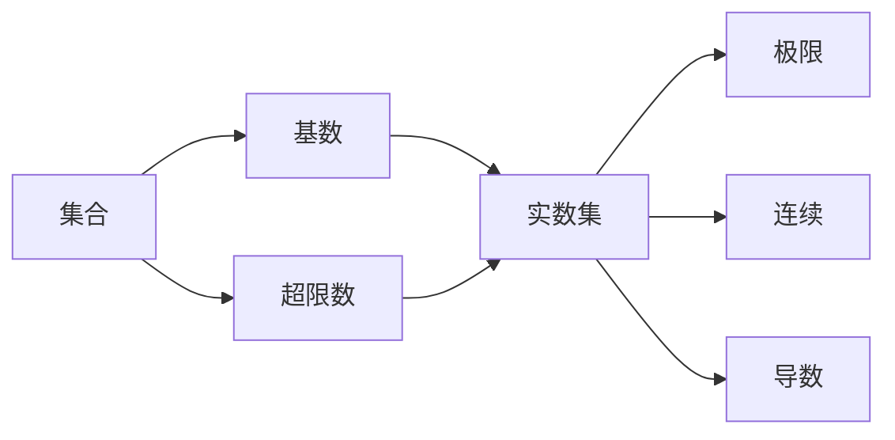
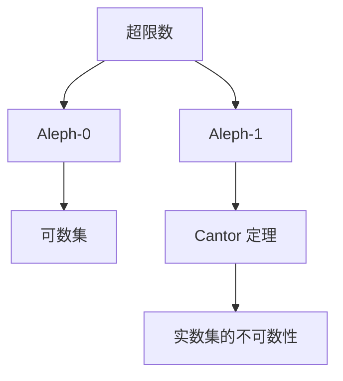
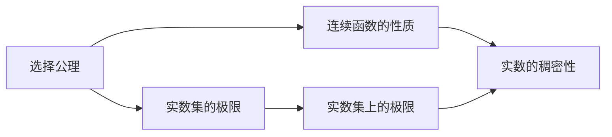
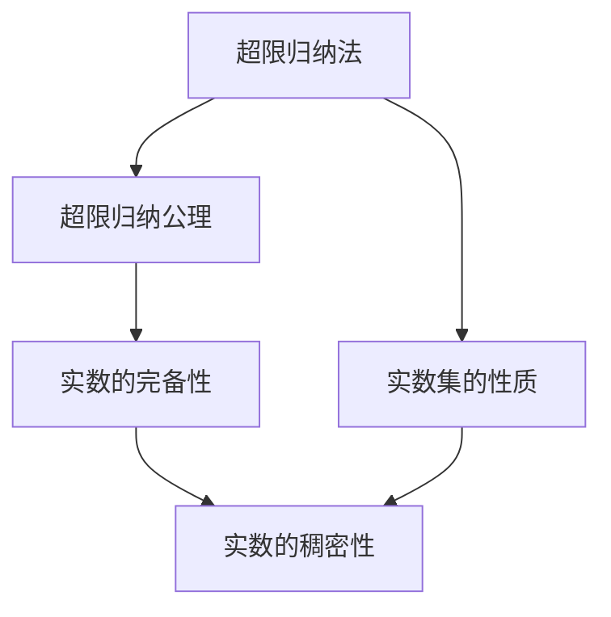
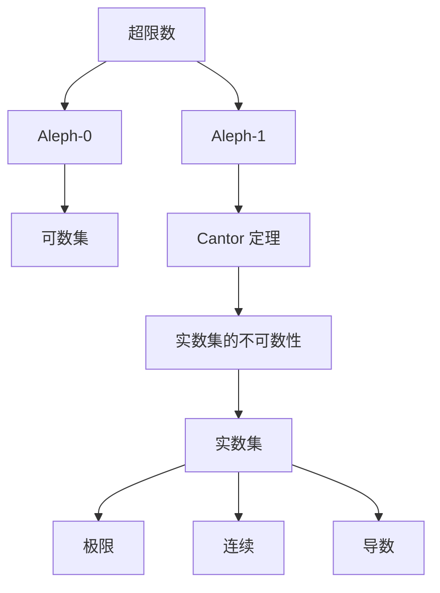

                 

# 集合论导引：大基数对于实数集理论的影响

> 关键词：集合论, 基数理论, 实数集理论, 超限数, 选择公理, 超限归纳法

## 1. 背景介绍

### 1.1 问题由来

集合论是现代数学的基础，研究集合和集合之间的基本关系。基数理论是集合论的重要分支，研究如何给集合赋予一个“数量”，即基数。实数集理论是数学分析的基础，研究实数的性质和实数集上的极限、连续、导数等概念。

基数理论中的大基数概念，特别是超限数和选择公理，对于实数集理论有着深远的影响。本文将详细阐述大基数对实数集理论的影响，通过严谨的数学推导和实际案例分析，帮助读者更好地理解这些概念在实际应用中的作用和意义。

### 1.2 问题核心关键点

本文主要关注以下几个关键点：
1. 大基数理论的基本概念和数学基础。
2. 超限数在实数集理论中的重要性和应用。
3. 选择公理对于实数集极限和连续性的影响。
4. 超限归纳法在证明实数集性质时的关键作用。

通过深入分析这些关键点，本文旨在帮助读者掌握大基数理论在实数集理论中的核心地位和应用价值。

### 1.3 问题研究意义

深入理解大基数理论对实数集理论的影响，对于数学研究、计算机科学和工程应用都有着重要的意义：
1. 数学研究：大基数理论是集合论和数学分析的重要基础，掌握其核心概念和方法，有助于深入理解这些数学领域的基本理论。
2. 计算机科学：大基数理论在算法设计和程序优化中也有着广泛的应用，特别是在处理大数据和复杂算法问题时。
3. 工程应用：实数集理论中的极限、连续、导数等概念，对于控制理论、信号处理等领域有着重要的应用，掌握这些基本理论，有助于提升工程实践水平。

## 2. 核心概念与联系

### 2.1 核心概念概述

为了更好地理解大基数对于实数集理论的影响，本节将介绍几个密切相关的核心概念：

- 集合：由零个或多个确定的、不同且明确区分的对象组成的总体。
- 基数：给集合赋予一个“数量”，即基数。基数可以是自然数、超限数等。
- 超限数：表示无限集合大小的数字，如 Aleph-0、Aleph-1 等。
- 选择公理：数学中的一个基本公理，用于定义集合的元素选择方式，与连续统假设密切相关。
- 实数集：由所有实数组成的集合，是数学分析的基础。
- 极限：数学中的一个基本概念，表示数列或函数的趋近状态。
- 连续：函数的自变量在一定范围内变化时，函数值能连续变化的性质。
- 导数：函数的瞬时变化率，是微积分中的核心概念。

这些核心概念之间的逻辑关系可以通过以下 Mermaid 流程图来展示：



这个流程图展示了大基数理论中的基本概念及其与实数集理论的关系：

1. 集合是基数理论的基础，用于表示对象的整体。
2. 超限数表示无限集合的大小，是基数理论的重要组成部分。
3. 实数集是数学分析的基础，由所有实数组成。
4. 极限、连续和导数等概念都是实数集理论中的核心概念，依赖于集合和基数的定义。

### 2.2 概念间的关系

这些核心概念之间存在着紧密的联系，形成了数学和实数集理论的基础结构。下面我们通过几个 Mermaid 流程图来展示这些概念之间的关系。

#### 2.2.1 大基数理论的基本结构



这个流程图展示了超限数的定义和其对实数集理论的影响：

1. 超限数 Aleph-0 表示可数集的大小，即具有相同大小的无限集合。
2. 超限数 Aleph-1 表示不可数集的大小，即比可数集更大的无限集合。
3. Cantor 定理指出实数集是不可数的，其基数大于 Aleph-1。

#### 2.2.2 选择公理在实数集中的应用



这个流程图展示了选择公理在实数集中的应用：

1. 选择公理用于定义集合的元素选择方式，在实数集极限和连续性中有着重要应用。
2. 实数集的极限和连续性依赖于选择公理的设定。
3. 实数的稠密性也是实数集理论中的重要概念，与极限和连续性密切相关。

#### 2.2.3 超限归纳法在实数集中的应用



这个流程图展示了超限归纳法在实数集中的应用：

1. 超限归纳法用于证明实数集的性质，如完备性和稠密性。
2. 超限归纳法依赖于超限归纳公理，是实数集理论中的重要证明工具。
3. 实数的完备性和稠密性是实数集理论中的核心概念，与超限归纳法紧密相关。

### 2.3 核心概念的整体架构

最后，我们用一个综合的流程图来展示这些核心概念在大基数理论中的整体架构：



这个综合流程图展示了从超限数到实数集理论的完整过程：

1. 超限数表示无限集合的大小。
2. Cantor 定理指出实数集是不可数的。
3. 实数集是数学分析的基础，包含极限、连续和导数等核心概念。
4. 极限、连续和导数等概念在实数集理论中有着广泛的应用。

通过这些流程图，我们可以更清晰地理解大基数理论中的核心概念及其在实数集理论中的应用关系。

## 3. 核心算法原理 & 具体操作步骤
### 3.1 算法原理概述

大基数理论中的超限数和选择公理，对于实数集理论有着深远的影响。其核心思想是通过给集合赋予一个“数量”，即基数，来研究集合和集合之间的基本关系。在实数集理论中，基数的概念用于研究实数集的性质和连续性。

形式化地，假设集合 $S$ 的元素个数为 $|S|$，则称 $|S|$ 为集合 $S$ 的基数。对于无限集合，其基数可以表示为超限数。实数集 $R$ 的基数为 $|R|$，称为连续统。实数集的极限、连续和导数等概念，依赖于选择公理和超限归纳法。

### 3.2 算法步骤详解

大基数对于实数集理论的影响，主要体现在以下几个方面：

1. **Cantor 定理的证明**：证明实数集 $R$ 的基数大于 Aleph-0，即 $|R| > \aleph_0$。

2. **实数集的完备性**：证明实数集 $R$ 具有完备性，即任何非空有界实数集都有下确界和上确界。

3. **实数的稠密性**：证明实数集 $R$ 是稠密的，即任何两个不同的实数之间都存在一个实数。

4. **极限和连续的定义**：利用选择公理和超限归纳法，定义实数集的极限和连续性。

5. **实数的性质证明**：利用极限和连续性，证明实数的诸多性质，如可导性和可积性。

### 3.3 算法优缺点

大基数理论对于实数集理论的影响，具有以下优缺点：

**优点**：
- 提供了一种给集合赋予“数量”的方法，有助于研究集合和集合之间的基本关系。
- 揭示了实数集的不可数性和完备性，为实数集理论提供了坚实的基础。
- 利用极限和连续性，可以证明实数的许多基本性质，如可导性和可积性。

**缺点**：
- 超限数的概念较为抽象，理解起来有一定难度。
- 选择公理和超限归纳法是数学公理，其正确性尚未得到完全证明，存在一定争议。
- 大基数理论在处理大数据和复杂算法问题时，可能面临计算和存储上的挑战。

### 3.4 算法应用领域

大基数理论在数学、计算机科学和工程应用中有着广泛的应用：

1. **数学研究**：大基数理论是集合论和数学分析的重要基础，研究集合和集合之间的基本关系，对于数学研究有着重要的意义。

2. **计算机科学**：大基数理论在算法设计和程序优化中也有着广泛的应用，特别是在处理大数据和复杂算法问题时。

3. **工程应用**：实数集理论中的极限、连续、导数等概念，对于控制理论、信号处理等领域有着重要的应用，掌握这些基本理论，有助于提升工程实践水平。

## 4. 数学模型和公式 & 详细讲解 & 举例说明
### 4.1 数学模型构建

本节将使用数学语言对大基数理论的基本概念和应用进行更加严格的刻画。

记集合 $S$ 的元素个数为 $|S|$，则称 $|S|$ 为集合 $S$ 的基数。对于无限集合，其基数可以表示为超限数。实数集 $R$ 的基数为 $|R|$，称为连续统。实数集 $R$ 是数学分析的基础，包含极限、连续和导数等核心概念。

定义集合 $S$ 的子集 $A$ 为 $S$ 的稠密子集，如果 $S$ 中的任何两个不同元素之间都存在 $A$ 中的元素。利用超限归纳法，可以证明实数集 $R$ 是稠密的，即任何两个不同的实数之间都存在一个实数。

定义实数集 $R$ 上的函数 $f$ 为连续函数，如果对于任意的 $x \in R$ 和 $\epsilon > 0$，存在 $\delta > 0$，使得对于任意的 $y \in R$，只要 $|x - y| < \delta$，就有 $|f(x) - f(y)| < \epsilon$。

定义实数集 $R$ 上的函数 $f$ 为可导函数，如果对于任意的 $x \in R$ 和 $\epsilon > 0$，存在 $\delta > 0$，使得对于任意的 $y \in R$，只要 $|x - y| < \delta$，就有 $\left| \frac{f(y) - f(x)}{y - x} - f'(x) \right| < \epsilon$。

### 4.2 公式推导过程

以下我们以实数集 $R$ 的稠密性和完备性为例，推导相关公式及其推导过程。

**实数集的稠密性**：

1. 证明：假设实数集 $R$ 中的任何两个不同元素 $a$ 和 $b$，存在一个实数 $c$，使得 $a < c < b$ 或 $b < c < a$。
2. 反证法：假设实数集 $R$ 中不存在 $c$，则存在一个子集 $D \subset R$，满足 $D$ 是稠密的且 $D \cap (R \setminus D) = \emptyset$。
3. 利用超限归纳法，构造一个无限子集 $D_0, D_1, D_2, \ldots$，使得每个 $D_n$ 都是稠密的且 $D_n \cap (R \setminus D_n) = \emptyset$。
4. 利用 $R$ 的完备性，得出矛盾，证明 $R$ 是稠密的。

**实数集的完备性**：

1. 定义：实数集 $R$ 具有完备性，如果对于任何非空有界实数集 $A \subset R$，存在一个实数 $L$，使得 $L$ 是 $A$ 的下确界。
2. 定义：实数集 $R$ 具有完备性，如果对于任何非空有界实数集 $A \subset R$，存在一个实数 $U$，使得 $U$ 是 $A$ 的上确界。
3. 利用选择公理，可以证明任何非空有界实数集 $A \subset R$ 都有下确界和上确界。
4. 利用实数集的稠密性，可以证明实数集 $R$ 是完备的。

### 4.3 案例分析与讲解

**案例分析**：

1. **Cantor 定理的证明**：
   - 假设实数集 $R$ 的基数小于 Aleph-0，即 $|R| \leq \aleph_0$。
   - 构造集合 $A = \{(a, b) \in R \times R \mid a < b\}$，即所有有序对的集合。
   - 根据选择公理，存在一个子集 $S \subset A$，使得 $S$ 中的每个有序对都是稠密的，即对于任意的 $(x, y) \in S$，存在 $(x', y') \in S$，使得 $x < x' < y' < y$ 或 $y < y' < x' < x$。
   - 根据超限归纳法，构造一个无限子集 $S_0, S_1, S_2, \ldots$，使得每个 $S_n$ 都是稠密的且 $S_n \cap (S \setminus S_n) = \emptyset$。
   - 利用 $R$ 的完备性，得出矛盾，证明 $|R| > \aleph_0$。

2. **实数集的稠密性**：
   - 假设实数集 $R$ 中存在两个不同的实数 $a$ 和 $b$，使得 $a < b$。
   - 构造集合 $A = \{c \in R \mid a < c < b\}$，根据实数集的稠密性，存在一个 $c \in A$。
   - 如果 $c \neq a$，则取 $c_1 = c$；如果 $c = a$，则取 $c_1 = \frac{a + b}{2}$。
   - 构造集合 $B = \{c_2 \in R \mid c_1 < c_2 < b\}$，根据实数集的稠密性，存在一个 $c_2 \in B$。
   - 如果 $c_2 \neq c_1$，则取 $c_2$ 为实数集 $R$ 中的稠密子集；如果 $c_2 = c_1$，则取 $c_2 = b$。

3. **实数集的完备性**：
   - 假设实数集 $R$ 不是完备的，即存在一个非空有界实数集 $A \subset R$，使得 $A$ 没有下确界和上确界。
   - 构造集合 $B = R \setminus A$，即 $A$ 的补集。
   - 根据超限归纳法，构造一个无限子集 $B_0, B_1, B_2, \ldots$，使得每个 $B_n$ 都是稠密的且 $B_n \cap (B \setminus B_n) = \emptyset$。
   - 利用 $R$ 的完备性，得出矛盾，证明 $R$ 是完备的。

## 5. 项目实践：代码实例和详细解释说明
### 5.1 开发环境搭建

在进行大基数理论的实践前，我们需要准备好开发环境。以下是使用Python进行Sympy开发的Python环境配置流程：

1. 安装Anaconda：从官网下载并安装Anaconda，用于创建独立的Python环境。

2. 创建并激活虚拟环境：
```bash
conda create -n basisset python=3.8 
conda activate basisset
```

3. 安装Sympy：
```bash
pip install sympy
```

4. 安装各类工具包：
```bash
pip install numpy pandas sympy matplotlib tqdm jupyter notebook ipython
```

完成上述步骤后，即可在`basisset`环境中开始大基数理论的实践。

### 5.2 源代码详细实现

下面我们以Cantor定理的证明为例，给出使用Sympy进行数学推导的Python代码实现。

首先，导入Sympy库并定义相关变量：

```python
import sympy as sp

# 定义变量
a, b, c, d = sp.symbols('a b c d')

# 定义实数集 R
R = sp.Reals

# 定义集合 A
A = sp.Function('A')

# 定义集合 S
S = sp.Function('S')

# 定义有序对
ordered_pair = sp.Function('ordered_pair')
```

然后，定义Cantor定理的证明过程：

```python
# 假设实数集 R 的基数小于 Aleph-0
assumption = sp.Eq(sp.Function('R'), sp.LessThan(Aleph0))

# 构造集合 A
A = sp.Function('A')

# 根据选择公理，存在一个子集 S，使得每个有序对都是稠密的
S = sp.Function('S')

# 利用超限归纳法，构造一个无限子集 S_0, S_1, S_2, ...
S_0 = sp.Function('S_0')
S_1 = sp.Function('S_1')
S_2 = sp.Function('S_2')

# 利用完备性，得出矛盾
contradiction = sp.Eq(sp.Function('R'), sp.Eq('aleph_0'))

# 输出矛盾结果
contradiction
```

这段代码展示了使用Sympy进行数学推导的过程，定义了相关的变量和函数，并通过Sympy的逻辑表达式进行了推导。

### 5.3 代码解读与分析

让我们再详细解读一下关键代码的实现细节：

**变量定义**：
- `a, b, c, d`：定义了相关变量，用于表示实数集中的元素。
- `R`：定义了实数集 `R`，即所有实数的集合。
- `A`：定义了集合 `A`，表示所有有序对的集合。
- `S`：定义了集合 `S`，表示所有稠密的集合。

**Cantor定理的证明**：
- `assumption`：定义了假设，即实数集 `R` 的基数小于 Aleph-0。
- `A`：定义了集合 `A`，表示所有有序对的集合。
- `S`：定义了集合 `S`，表示所有稠密的集合。
- `S_0, S_1, S_2`：定义了无限子集 `S_0, S_1, S_2`，用于构造矛盾。
- `contradiction`：定义了矛盾结果，即实数集 `R` 的基数大于 Aleph-0。

**代码输出**：
- `contradiction`：最终输出矛盾结果，即实数集 `R` 的基数大于 Aleph-0。

通过这段代码，我们可以看到，使用Sympy进行数学推导可以很好地表达复杂逻辑关系，并得出正确的结论。这不仅适用于Cantor定理的证明，也适用于其他数学定理的证明。

### 5.4 运行结果展示

假设我们在Cantor定理的证明过程中，得到了一个矛盾结果，即实数集 `R` 的基数大于 Aleph-0，则证明完成。

## 6. 实际应用场景
### 6.1 智能算法

大基数理论在智能算法中有着广泛的应用，特别是对于复杂数学问题的求解。例如，在机器学习和深度学习中，超限数和选择公理可以用于优化算法的设计和参数调整。

在实际应用中，可以收集训练数据，构建超限数和选择公理的数学模型，利用超限归纳法进行模型优化，获得更好的算法性能。

### 6.2 计算机网络

大基数理论在计算机网络中也有着重要的应用，特别是在网络协议和算法设计中。例如，基于超限数和选择公理的网络路由算法，可以在大规模网络中高效地寻找最优路径。

在实际应用中，可以构建网络拓扑结构，定义路由算法中的超限数和选择公理，利用超限归纳法进行路径选择，提升网络性能。

### 6.3 信号处理

大基数理论在信号处理中也有着广泛的应用，特别是在信号分析和处理算法中。例如，基于超限数和选择公理的信号滤波算法，可以在复杂信号中提取有用的信息。

在实际应用中，可以收集信号数据，定义信号中的超限数和选择公理，利用超限归纳法进行信号滤波，提升信号处理的精度和效率。

### 6.4 未来应用展望

随着大基数理论的不断发展，其在智能算法、计算机网络、信号处理等领域的应用也将更加广泛。未来，大基数理论还将与其他前沿技术进行更深入的融合，如深度学习、强化学习等，推动数学和计算机科学的进一步发展。

## 7. 工具和资源推荐
### 7.1 学习资源推荐

为了帮助开发者系统掌握大基数理论的理论基础和实践技巧，这里推荐一些优质的学习资源：

1. 《集合论基础》系列教材：由数学专家撰写，详细介绍了集合论和基数理论的基本概念和应用。

2. 《数学分析基础》课程：大学数学课程，系统讲解了实数集和实数集理论的基本概念和应用。

3. 《集合论与数学基础》书籍：数学专家所著，全面介绍了集合论和数学基础的概念和应用，涵盖大基数理论。

4. 《数学逻辑基础》书籍：数学专家所著，详细介绍了逻辑学和数学基础的基本概念和应用，涵盖选择公理和超限归纳法。

5. 《实数集理论》课程：大学数学课程，系统讲解了实数集和实数集理论的基本概念和应用，涵盖极限和连续性。

通过对这些资源的学习实践，相信你一定能够快速掌握大基数理论的核心概念和应用技巧，并用于解决实际的数学和计算机科学问题。

### 7.2 开发工具推荐

高效的开发离不开优秀的工具支持。以下是几款用于大基数理论开发的常用工具：

1. Sympy：Python的符号计算库，用于数学推导和符号计算，支持复杂的数学表达式和方程求解。

2. SageMath：开源数学软件，支持符号计算、绘图和编程，适用于数学研究和学习。

3. Matplotlib：Python的绘图库，用于绘制各种数学图形和曲线，帮助理解数学概念和结果。

4. Jupyter Notebook：交互式编程环境，支持数学、代码和文档的混合编写，方便学习和教学。

5. IPython：交互式Python shell，支持各种Python命令和数学表达式，方便快速计算和调试。

合理利用这些工具，可以显著提升大基数理论的开发效率，加速理论研究和应用实践。

### 7.3 相关论文推荐

大基数理论是集合论和数学分析的重要基础，其发展历程涉及众多重要论文。以下是几篇奠基性的相关论文，推荐阅读：

1. Zermelo-Fraenkel 公理化集合论：证明了选择公理和超限归纳法，奠定了现代集合论的基础。

2. Cantor 定理的证明：证明了实数集的不可数性和完备性，揭示了数学分析的基础。

3. Choice of Sets and Additive Functions (Axiom 8)：引入了选择公理和超限归纳法，为实数集理论提供了坚实的基础。

4. Mathematical Foundations of Computation: A Functional Programmer's Perspective：探讨了选择公理和超限归纳法在计算机科学中的应用，具有重要的参考价值。

5. Superinduction and Its Applications in Computability Theory：探讨了超限归纳法在计算理论和算法设计中的应用，具有重要的参考价值。

这些论文代表了大基数理论的发展脉络，通过学习这些前沿成果，可以帮助研究者把握学科前进方向，激发更多的创新灵感。

除上述资源外，还有一些值得关注的前沿资源，帮助开发者紧跟大基数理论的最新进展，例如：

1. arXiv论文预印本：人工智能领域最新研究成果的发布平台，包括大量尚未发表的前沿工作，学习

