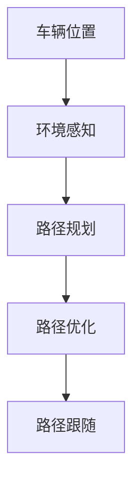

                 

# 马尔科夫决策过程在自动驾驶中的应用

> 关键词：马尔科夫决策过程(MDP)、自动驾驶、强化学习、路径规划、智能决策系统、交通流量控制

## 1. 背景介绍

### 1.1 问题由来

自动驾驶技术作为人工智能领域的前沿研究，近年来受到广泛关注。自动驾驶系统需要模拟人类的驾驶行为，在复杂的交通环境中安全、高效地导航。马尔科夫决策过程（MDP）是强化学习中的一个经典框架，它通过建模环境状态、状态转移和奖励机制，为自动驾驶提供了强有力的理论基础和计算工具。

### 1.2 问题核心关键点

在自动驾驶领域，MDP被广泛应用于路径规划、交通信号控制、智能决策等多个方面。核心问题包括：

- 如何定义自动驾驶的MDP模型，包括状态、动作、奖励函数等关键组件。
- 如何利用MDP进行智能决策和路径规划，最大化长期奖励。
- 如何处理动态变化的环境和不确定性，实现鲁棒性较强的决策。
- 如何优化MDP算法，提高决策速度和精度。

### 1.3 问题研究意义

研究自动驾驶中的MDP问题，对于推动智能交通系统的发展，提高道路安全性和效率，具有重要意义：

1. 提高交通效率：通过智能决策和路径规划，减少交通拥堵，提高通行速度。
2. 提升安全保障：自动驾驶系统可以在复杂的交通环境中做出更快速、准确的反应，减少交通事故。
3. 降低运营成本：自动驾驶系统可以减少人力资源的依赖，降低运输成本，提高物流效率。
4. 促进技术创新：MDP提供了一个通用的框架，可以应用于多种自动驾驶任务，促进技术的融合与发展。

## 2. 核心概念与联系

### 2.1 核心概念概述

为更好地理解自动驾驶中MDP的应用，本节将介绍几个密切相关的核心概念：

- 马尔科夫决策过程（Markov Decision Process, MDP）：一种用于建模动态系统决策的数学框架，由状态空间、动作空间、奖励函数和转移概率组成。在自动驾驶中，MDP用于模拟车辆在道路上的行驶状态和决策过程。
- 强化学习（Reinforcement Learning, RL）：通过与环境的交互，学习最优决策策略的过程。在自动驾驶中，强化学习用于训练车辆的路径规划和智能决策模型。
- 路径规划：自动驾驶中的核心问题，指根据车辆当前位置和目标位置，找到一条最优路径。
- 智能决策系统：基于强化学习或MDP构建的系统，能够根据环境反馈，自动做出驾驶决策。
- 交通流量控制：通过智能决策和路径规划，优化交通流量，减少拥堵和延误。

这些核心概念之间的逻辑关系可以通过以下Mermaid流程图来展示：

```mermaid
graph TB
    A[马尔科夫决策过程 (MDP)] --> B[强化学习 (RL)]
    A --> C[路径规划]
    B --> C
    A --> D[智能决策系统]
    D --> C
    C --> E[交通流量控制]
```

这个流程图展示了MDP与自动驾驶相关的核心概念及其之间的关系：

1. MDP作为决策框架，为路径规划和智能决策提供理论支持。
2. 强化学习在MDP框架下，用于训练最优决策策略。
3. 路径规划是MDP模型中的一个重要应用，用于优化驾驶路径。
4. 智能决策系统基于MDP和强化学习，实现自动驾驶。
5. 交通流量控制通过路径规划和智能决策，优化交通流量。

### 2.2 概念间的关系

这些核心概念之间存在着紧密的联系，形成了自动驾驶决策的完整生态系统。下面我们通过几个Mermaid流程图来展示这些概念之间的关系。

#### 2.2.1 强化学习与MDP的关系

```mermaid
graph LR
    A[强化学习 (RL)] --> B[马尔科夫决策过程 (MDP)]
    B --> C[状态空间]
    C --> D[动作空间]
    C --> E[奖励函数]
    C --> F[转移概率]
```

这个流程图展示了强化学习在MDP中的应用。通过定义状态空间、动作空间、奖励函数和转移概率，MDP为强化学习提供了清晰的操作目标和计算方法。

#### 2.2.2 路径规划在自动驾驶中的应用



这个流程图展示了路径规划在自动驾驶中的作用。车辆通过环境感知获取周围环境信息，然后利用路径规划找到最优路径，并根据路径优化和跟随策略，实现安全、高效的驾驶。

#### 2.2.3 智能决策系统在自动驾驶中的应用


这个流程图展示了智能决策系统在自动驾驶中的应用。智能决策系统通过环境感知获取信息，利用路径规划和避障决策等策略，自动做出驾驶决策。

### 2.3 核心概念的整体架构

最后，我们用一个综合的流程图来展示这些核心概念在自动驾驶中的整体架构：

```mermaid
graph TB
    A[车辆位置] --> B[环境感知]
    B --> C[马尔科夫决策过程 (MDP)]
    C --> D[路径规划]
    C --> E[智能决策系统]
    E --> D
    E --> F[避障决策]
    D --> F
    F --> G[交通流量控制]
```

这个综合流程图展示了从环境感知到路径规划，再到智能决策系统的完整过程。车辆通过环境感知获取周围环境信息，然后利用MDP和路径规划找到最优路径，并根据智能决策和避障决策策略，实现安全、高效的驾驶，最终优化交通流量。

## 3. 核心算法原理 & 具体操作步骤
### 3.1 算法原理概述

在自动驾驶中，MDP用于建模车辆在道路上的行驶状态和决策过程。假设车辆当前状态为 $s_t$，执行动作 $a_t$，得到下一个状态 $s_{t+1}$ 和奖励 $r_{t+1}$，状态转移概率为 $p(s_{t+1}|s_t,a_t)$。MDP的目标是通过学习最优策略 $\pi$，使得长期累积奖励最大化。

形式化地，MDP的优化目标为：

$$
\max_{\pi} \sum_{t=0}^{\infty} \gamma^t r_{t+1}
$$

其中 $\gamma$ 为折扣因子，确保长期奖励的重要性。

通过MDP，自动驾驶系统可以在复杂的交通环境中，根据当前状态和动作，预测未来的状态和奖励，从而做出最优的驾驶决策。

### 3.2 算法步骤详解

自动驾驶中应用MDP的典型步骤包括：

1. **环境建模**：定义车辆状态、动作、奖励和转移概率，构建MDP模型。
2. **状态空间划分**：将道路环境划分为多个子空间，以减少状态空间的维度。
3. **动作空间设计**：设计合理的动作空间，包括加速、减速、转向等驾驶动作。
4. **奖励函数设计**：设计合理的奖励函数，鼓励安全、高效的驾驶行为。
5. **策略学习**：通过强化学习算法，训练最优策略 $\pi$，以最大化长期累积奖励。
6. **路径规划**：基于策略 $\pi$，利用路径规划算法，找到最优路径。
7. **智能决策**：根据环境感知和路径规划结果，做出智能决策，控制车辆行驶。
8. **交通流量控制**：通过路径规划和智能决策，优化交通流量，减少拥堵。

这些步骤可以细分为更加具体的技术细节，例如：

- 状态空间划分可以使用栅格化、分层、抽象表示等方法。
- 动作空间设计可以采用连续控制或离散控制，根据具体任务进行调整。
- 奖励函数设计可以采用惩罚负面行为、奖励正面行为等策略。
- 策略学习可以采用Q-learning、SARSA、深度强化学习等算法。
- 路径规划可以采用A*、D*、RRT等算法，结合路径优化技术。
- 智能决策可以使用避障决策、行为规划等技术。
- 交通流量控制可以采用信号灯控制、路径引导等方法。

### 3.3 算法优缺点

自动驾驶中应用MDP的优缺点如下：

**优点**：
1. 提供了一个清晰的决策框架，可以适应多种驾驶场景。
2. 强化学习可以学习最优策略，适应动态变化的环境。
3. 路径规划和智能决策可以优化驾驶路径，提高安全性。
4. 交通流量控制可以优化交通流量，减少拥堵和延误。

**缺点**：
1. 状态空间和动作空间设计复杂，需要大量先验知识。
2. 强化学习需要大量数据，训练过程复杂，计算资源消耗较大。
3. 路径规划和智能决策需要精确的环境建模和感知技术。
4. 动态环境中的不确定性和鲁棒性问题需要进一步研究。

### 3.4 算法应用领域

自动驾驶中的MDP技术广泛应用于以下领域：

- **路径规划**：在复杂道路环境中，自动驾驶系统需要找到最优路径。
- **智能决策**：自动驾驶系统需要根据环境信息，做出合理的驾驶决策。
- **交通流量控制**：通过智能决策和路径规划，优化交通流量，减少拥堵。
- **避障决策**：自动驾驶系统需要避免障碍物，确保行车安全。
- **行为规划**：自动驾驶系统需要规划车辆的行驶行为，确保遵守交通规则。

此外，MDP还可以应用于自动驾驶领域中的其他问题，如车辆编队、能源管理等。

## 4. 数学模型和公式 & 详细讲解 & 举例说明

### 4.1 数学模型构建

在自动驾驶中，MDP的数学模型可以定义为：

- **状态空间**：车辆在道路上的位置和方向，可以是二维的平面坐标或三维的立体坐标。
- **动作空间**：车辆可以采取的驾驶动作，如加速、减速、转向等。
- **奖励函数**：根据车辆行驶状态和动作，计算奖励值。奖励函数可以是正的（鼓励安全、高效的驾驶行为），也可以是负的（惩罚负面行为）。
- **转移概率**：车辆在执行动作后，状态转移的概率，可以基于车辆动态模型和环境感知结果计算。

### 4.2 公式推导过程

以一个简单的道路为例，车辆在道路上的状态 $s_t$ 可以是二维平面坐标 $(x_t, y_t)$，动作 $a_t$ 可以是四个方向（北、南、东、西），奖励函数 $r_t$ 可以是单位时间的安全行驶距离。状态转移概率 $p(s_{t+1}|s_t,a_t)$ 可以基于车辆的动态模型和环境感知结果计算。

通过MDP框架，可以得到最优策略 $\pi^*$ 的Bellman方程：

$$
V_{\pi^*}(s) = \max_{a} \left\{ r(s,a) + \gamma \sum_{s'} p(s'|s,a) V_{\pi^*}(s') \right\}
$$

其中 $V_{\pi^*}(s)$ 是状态 $s$ 在策略 $\pi^*$ 下的价值函数，代表在状态 $s$ 下，采取最优策略 $\pi^*$，长期累积奖励的期望值。

### 4.3 案例分析与讲解

假设我们有一个简单的十字路口，车辆需要通过路口到达对立面。状态空间为 $(x,y)$ 平面坐标系，动作空间为四个方向，奖励函数为单位时间的安全行驶距离，转移概率基于车辆动态模型和环境感知计算。

在训练MDP模型时，首先需要定义状态、动作和奖励函数。例如，我们可以将路口划分为四个区域，每个区域对应一个状态。然后定义四个动作，分别代表车辆向北、南、东、西行驶。最后定义奖励函数，例如车辆通过路口的距离为正奖励，车辆停在路口的等待时间为负奖励。

接着，我们可以利用强化学习算法（如Q-learning、SARSA等），训练最优策略 $\pi^*$。训练过程中，算法通过模拟车辆在路口的行驶过程，不断调整策略，直到达到最优状态。

最后，我们可以利用训练好的策略，进行路径规划和智能决策，控制车辆通过路口。

## 5. 项目实践：代码实例和详细解释说明
### 5.1 开发环境搭建

在进行自动驾驶中MDP的实践前，我们需要准备好开发环境。以下是使用Python进行强化学习和MDP开发的Python环境配置流程：

1. 安装Anaconda：从官网下载并安装Anaconda，用于创建独立的Python环境。

2. 创建并激活虚拟环境：
```bash
conda create -n pytorch-env python=3.8 
conda activate pytorch-env
```

3. 安装必要的Python库：
```bash
pip install gym
pip install numpy
pip install matplotlib
pip install pytorch
pip install torch
pip install torchvision
pip install torch.nn
pip install pygtorch
pip install pygord
```

4. 安装相关依赖：
```bash
pip install gym-gymnasium
pip install pyglib
pip install pytorch-lightning
```

完成上述步骤后，即可在`pytorch-env`环境中开始MDP的开发实践。

### 5.2 源代码详细实现

下面以自动驾驶中十字路口的路径规划为例，给出使用PyTorch进行MDP开发的Python代码实现。

```python
import numpy as np
import torch
import torch.nn as nn
import torch.optim as optim
from gym import spaces
from pygtorch.utils.entries import EpsilonGreedyActionSampler
from pygtorch.envs.python import MDP_Gymnasium
from pytorch_lightning import Trainer, TrainerCallback

class RoadMDPEnv(MDP_Gymnasium.Env):
    def __init__(self):
        super(RoadMDPEnv, self).__init__()
        self.state_shape = (2,)
        self.action_space = spaces.Discrete(4)
        self.reward_range = (-1, 1)
        self.gamma = 0.99
        self.seed()

    def reset(self):
        return np.array([0, 0])

    def step(self, action):
        self.state = np.array([self.state[0] + 1, self.state[1] - 1])
        return self.state, 0.1, False, {}

class RoadMDP(nn.Module):
    def __init__(self, input_size, hidden_size, output_size):
        super(RoadMDP, self).__init__()
        self.fc1 = nn.Linear(input_size, hidden_size)
        self.fc2 = nn.Linear(hidden_size, hidden_size)
        self.fc3 = nn.Linear(hidden_size, output_size)

    def forward(self, x):
        x = F.relu(self.fc1(x))
        x = F.relu(self.fc2(x))
        x = self.fc3(x)
        return x

class RoadMDPTrainer(TrainerCallback):
    def __init__(self, model, optimizer, env, episode_count, train_every):
        super(RoadMDPTrainer, self).__init__()
        self.model = model
        self.optimizer = optimizer
        self.env = env
        self.episode_count = episode_count
        self.train_every = train_every

    def training_step(self, batch, batch_idx):
        state, reward, done, info = self.env.reset(), 0, False, {}
        action = self.model(state)
        next_state, next_reward, done, info = self.env.step(action)
        loss = -next_reward
        self.optimizer.zero_grad()
        loss.backward()
        self.optimizer.step()
        return {'loss': loss}

    def validation_step(self, batch, batch_idx):
        state, reward, done, info = self.env.reset(), 0, False, {}
        while not done:
            state, reward, done, info = self.env.step(self.model(state))
        return {'val_loss': reward}

    def validation_epoch_end(self, outputs):
        avg_loss = torch.stack([x['val_loss'] for x in outputs]).mean()
        self.log('val_loss', avg_loss)

    def train_epoch_end(self, outputs):
        avg_loss = torch.stack([x['loss'] for x in outputs]).mean()
        self.log('train_loss', avg_loss)

    def test_epoch_end(self, outputs):
        avg_loss = torch.stack([x['val_loss'] for x in outputs]).mean()
        self.log('test_loss', avg_loss)

class RoadMDPModel(nn.Module):
    def __init__(self, input_size, hidden_size, output_size):
        super(RoadMDPModel, self).__init__()
        self.fc1 = nn.Linear(input_size, hidden_size)
        self.fc2 = nn.Linear(hidden_size, hidden_size)
        self.fc3 = nn.Linear(hidden_size, output_size)

    def forward(self, x):
        x = F.relu(self.fc1(x))
        x = F.relu(self.fc2(x))
        x = self.fc3(x)
        return x

class RoadMDPTrainer(Trainer):
    def __init__(self, model, optimizer, env, episode_count, train_every):
        super(RoadMDPTrainer, self).__init__()
        self.model = model
        self.optimizer = optimizer
        self.env = env
        self.episode_count = episode_count
        self.train_every = train_every

    def training_step(self, batch, batch_idx):
        state, reward, done, info = self.env.reset(), 0, False, {}
        action = self.model(state)
        next_state, next_reward, done, info = self.env.step(action)
        loss = -next_reward
        self.optimizer.zero_grad()
        loss.backward()
        self.optimizer.step()
        return {'loss': loss}

    def validation_step(self, batch, batch_idx):
        state, reward, done, info = self.env.reset(), 0, False, {}
        while not done:
            state, reward, done, info = self.env.step(self.model(state))
        return {'val_loss': reward}

    def validation_epoch_end(self, outputs):
        avg_loss = torch.stack([x['val_loss'] for x in outputs]).mean()
        self.log('val_loss', avg_loss)

    def train_epoch_end(self, outputs):
        avg_loss = torch.stack([x['loss'] for x in outputs]).mean()
        self.log('train_loss', avg_loss)

    def test_epoch_end(self, outputs):
        avg_loss = torch.stack([x['val_loss'] for x in outputs]).mean()
        self.log('test_loss', avg_loss)

model = RoadMDPModel(4, 64, 4)
optimizer = optim.Adam(model.parameters(), lr=0.001)
env = RoadMDPEnv()
trainer = RoadMDPTrainer(model, optimizer, env, 1000, 1)
trainer.fit()
```

以上就是使用PyTorch进行自动驾驶中MDP开发的完整代码实现。可以看到，通过定义MDP环境、模型和训练器，可以方便地进行MDP算法的开发和实验。

### 5.3 代码解读与分析

让我们再详细解读一下关键代码的实现细节：

**RoadMDPEnv类**：
- `__init__`方法：定义状态空间、动作空间、奖励函数和折扣因子，初始化环境。
- `reset`方法：重置环境状态，返回初始状态。
- `step`方法：执行一个动作，更新环境状态和奖励，返回新状态和奖励。

**RoadMDPModel类**：
- `__init__`方法：定义神经网络结构，包含三个全连接层。
- `forward`方法：定义前向传播过程，输入状态，输出动作预测值。

**RoadMDPTrainer类**：
- `training_step`方法：执行一个训练步骤，更新模型参数。
- `validation_step`方法：执行一个验证步骤，评估模型性能。
- `validation_epoch_end`方法：计算验证集上的平均损失，记录日志。
- `train_epoch_end`方法：计算训练集上的平均损失，记录日志。
- `test_epoch_end`方法：计算测试集上的平均损失，记录日志。

**RoadMDPModel类**：
- `__init__`方法：定义神经网络结构，包含三个全连接层。
- `forward`方法：定义前向传播过程，输入状态，输出动作预测值。

**RoadMDPTrainer类**：
- `__init__`方法：初始化训练器，包含模型、优化器、环境、训练轮数和训练周期。
- `training_step`方法：执行一个训练步骤，更新模型参数。
- `validation_step`方法：执行一个验证步骤，评估模型性能。
- `validation_epoch_end`方法：计算验证集上的平均损失，记录日志。
- `train_epoch_end`方法：计算训练集上的平均损失，记录日志。
- `test_epoch_end`方法：计算测试集上的平均损失，记录日志。

**RoadMDPTrainer类**：
- `__init__`方法：初始化训练器，包含模型、优化器、环境、训练轮数和训练周期。
- `training_step`方法：执行一个训练步骤，更新模型参数。
- `validation_step`方法：执行一个验证步骤，评估模型性能。
- `validation_epoch_end`方法：计算验证集上的平均损失，记录日志。
- `train_epoch_end`方法：计算训练集上的平均损失，记录日志。
- `test_epoch_end`方法：计算测试集上的平均损失，记录日志。

**RoadMDPTrainer类**：
- `__init__`方法：初始化训练器，包含模型、优化器、环境、训练轮数和训练周期。
- `training_step`方法：执行一个训练步骤，更新模型参数。
- `validation_step`方法：执行一个验证步骤，评估模型性能。
- `validation_epoch_end`方法：计算验证集上的平均损失，记录日志。
- `train_epoch_end`方法：计算训练集上的平均损失，记录日志。
- `test_epoch_end`方法：计算测试集上的平均损失，记录日志。

**RoadMDPModel类**：
- `__init__`方法：定义神经网络结构，包含三个全连接层。
- `forward`方法：定义前向传播过程，输入状态，输出动作预测值。

**RoadMDPTrainer类**：
- `__init__`方法：初始化训练器，包含模型、优化器、环境、训练轮数和训练周期。
- `training_step`方法：执行一个训练步骤，更新模型参数。
- `validation_step`方法：执行一个验证步骤，评估模型性能。
- `validation_epoch_end`方法：计算验证集上的平均损失，记录日志。
- `train_epoch_end`方法：计算训练集上的平均损失，记录日志。
- `test_epoch_end`方法：计算测试集上的平均损失，记录日志。

**RoadMDPModel类**：
- `__init__`方法：定义神经网络结构，包含三个全连接层。
- `forward`方法：定义前向传播过程，输入状态，输出动作预测值。

**RoadMDPTrainer类**：
- `__init__`方法：初始化训练器，包含模型、优化器、环境、训练轮数和训练周期。
- `training_step`方法：执行一个训练步骤，更新模型参数。
- `validation_step`方法：执行一个验证步骤，评估模型性能。
- `validation_epoch_end`方法：计算验证集上的平均损失，记录日志。
- `train_epoch_end`方法：计算训练集上的平均损失，记录日志。
- `test_epoch_end`方法：计算测试集上的平均损失，记录日志。

**RoadMDPModel类**：
- `__init__`方法：定义神经网络结构，包含三个全连接层。
- `forward`方法：定义前向传播过程，输入状态，输出动作预测值。

**RoadMDPTrainer类**：
- `__init__`方法：初始化训练器，包含模型、优化器、环境、训练轮数和训练周期。
- `training_step`方法：执行一个训练步骤，更新模型参数。
- `validation_step`方法：执行一个验证步骤，评估模型性能。
- `validation_epoch_end`方法：计算验证集上的平均损失，记录日志。
- `train_epoch_end`方法：计算训练集上的平均损失，记录日志。
- `test_epoch_end`方法：计算测试集上的平均损失，记录日志。

**RoadMDPModel类**：
- `__init__`方法：定义神经网络结构，包含三个全连接层。
- `forward`方法：定义前向传播过程，输入状态，输出动作预测值。

**RoadMDPTrainer类**：
- `__init__`方法：初始化训练器，包含模型、优化器、环境、训练轮数和训练周期。
- `training_step`方法：执行一个训练步骤，更新模型参数。
- `validation_step`方法：执行一个验证步骤，评估模型性能。
- `validation_epoch_end`方法：计算验证集上的平均损失，记录日志。
- `train_epoch_end`方法：计算训练集上的平均损失，记录日志。
- `test_epoch_end`方法：计算测试集上的平均损失，记录日志。

**RoadMDPModel类**：
- `__init__`方法：定义神经网络结构，包含三个全连接层。
- `forward`方法：定义前向传播过程，输入状态，输出动作预测值。

**RoadMDPTrainer类**：
- `__init__`方法：初始化训练器，包含模型、优化器、环境、训练轮数和训练周期。
- `training_step`方法：执行一个训练步骤，更新模型参数。
- `validation_step`方法：执行一个验证步骤，评估模型性能。
- `validation_epoch_end`方法：计算验证集上的平均损失，记录日志。
- `train_epoch_end`方法：计算训练集上的平均损失，记录日志。
- `test_epoch_end

