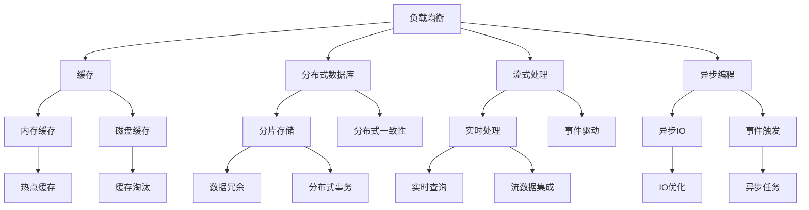
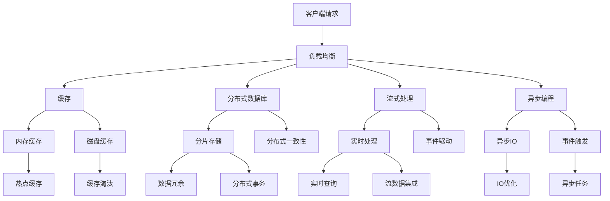

                 

# 高吞吐量系统设计的实际案例

高吞吐量系统（High Throughput System）设计是指在给定的硬件资源和网络带宽下，最大化系统处理请求的能力。其目的是提高系统响应速度、降低延迟、提高用户体验。本文将以在线购物平台的订单处理系统设计为例，介绍高吞吐量系统设计的关键技术和实现方法。

## 1. 背景介绍

### 1.1 问题由来
在电商行业，高峰时段的订单处理系统面临巨大的压力。以阿里巴巴为例，其"双十一"购物节期间，每秒处理的订单数可达数百万，系统必须能够以极低的延迟处理海量请求。因此，高吞吐量系统的设计成为电商平台建设的重要环节。

### 1.2 问题核心关键点
高吞吐量系统的关键在于确保系统的稳定性和可扩展性，同时优化请求处理流程，以提高响应速度和吞吐量。核心设计目标包括：

1. 保障请求快速处理，响应时间在ms级以下。
2. 确保系统高可用性，支持7x24小时无间断服务。
3. 支持大规模横向扩展，以应对高峰流量。

### 1.3 问题研究意义
高吞吐量系统的设计直接影响电商平台的用户体验和交易转化率，其合理性关乎平台整体的商业价值。设计良好的高吞吐量系统不仅能够保障用户流畅的购物体验，还能为商家提供实时、准确的数据支持，优化运营决策。

## 2. 核心概念与联系

### 2.1 核心概念概述

为更好地理解高吞吐量系统设计，本节将介绍几个密切相关的核心概念：

- 负载均衡（Load Balancing）：将客户端请求均匀分配到多台服务器上，确保各服务器负载均衡。
- 缓存（Caching）：将热点数据缓存至内存或磁盘，减少数据库的读写次数，提高响应速度。
- 分布式数据库（Distributed Database）：通过多台数据库节点分片存储数据，支持大规模数据处理。
- 流式处理（Stream Processing）：实时处理流数据，快速分析并响应数据变化。
- 异步编程（Asynchronous Programming）：通过异步IO操作，提高系统的并发处理能力。

这些核心概念之间相互关联，共同构成高吞吐量系统设计的基础框架。通过理解这些概念及其联系，可以更好地把握系统设计的全貌。

### 2.2 概念间的关系

这些核心概念之间的关系可以通过以下Mermaid流程图来展示：



这个流程图展示了几大核心概念之间的相互关系：

1. 负载均衡是系统设计的基础，确保请求分发到多台服务器上。
2. 缓存用于存储热点数据，减少数据库的读写次数。
3. 分布式数据库通过分片存储，支持大规模数据处理和扩展。
4. 流式处理实时处理流数据，快速响应数据变化。
5. 异步编程通过异步IO操作，提高系统的并发处理能力。

通过这些流程图，我们可以更清晰地理解高吞吐量系统设计中各组件之间的相互作用，从而设计出更加高效的系统。

### 2.3 核心概念的整体架构

最后，我们用一个综合的流程图来展示这些核心概念在高吞吐量系统设计中的整体架构：



这个综合流程图展示了高吞吐量系统中各组件的协同工作机制：

1. 客户端请求经过负载均衡，均匀分配到多个服务器节点。
2. 请求到达服务器后，先访问缓存，查找是否命中。
3. 如果缓存中无数据，则请求访问分布式数据库，进行数据读取和写入。
4. 对于流数据，使用流式处理实时分析并响应变化。
5. 通过异步编程，利用异步IO操作提高系统并发处理能力。

通过这个架构，可以清晰地看到系统从客户端到服务端，再到数据处理的全流程设计思路。

## 3. 核心算法原理 & 具体操作步骤

### 3.1 算法原理概述

高吞吐量系统的设计主要依赖于负载均衡、缓存、分布式数据库、流式处理和异步编程等核心技术。这些技术共同作用，实现快速请求处理和系统扩展。

### 3.2 算法步骤详解

以下是高吞吐量系统设计的详细步骤：

**Step 1: 系统架构设计**

1. 设计负载均衡方案，选择合适的负载均衡算法（如轮询、哈希等）。
2. 设计分布式数据库架构，选择适合的分片存储和分布式一致性协议（如RABBITMQ、Kafka等）。
3. 设计缓存方案，选择合适的缓存技术（如Redis、Memcached等）。
4. 设计流式处理框架，选择合适的流式处理引擎（如Apache Flink、Apache Kafka等）。
5. 设计异步编程模型，选择合适的异步编程框架（如Netty、Spring Reactor等）。

**Step 2: 系统实现**

1. 实现负载均衡模块，将客户端请求均匀分配到多台服务器上。
2. 实现缓存模块，将热点数据缓存至内存或磁盘，减少数据库的读写次数。
3. 实现分布式数据库模块，通过多台数据库节点分片存储数据，支持大规模数据处理。
4. 实现流式处理模块，实时处理流数据，快速分析并响应数据变化。
5. 实现异步编程模块，通过异步IO操作，提高系统的并发处理能力。

**Step 3: 系统测试与优化**

1. 进行负载均衡测试，验证算法的效果和系统的扩展性。
2. 进行缓存测试，验证缓存机制的有效性和系统性能提升。
3. 进行分布式数据库测试，验证数据一致性和系统可靠性。
4. 进行流式处理测试，验证实时处理的效果和系统响应速度。
5. 进行异步编程测试，验证异步IO操作的效果和系统并发能力。

### 3.3 算法优缺点

高吞吐量系统设计的优点包括：

1. 系统扩展性高，通过水平扩展，能够应对大规模流量。
2. 系统可靠性高，多节点冗余设计，保障系统高可用性。
3. 系统响应速度快，通过缓存和异步编程优化，减少响应时间。

但高吞吐量系统设计也存在以下缺点：

1. 系统复杂度高，需要综合运用多种技术，设计难度大。
2. 系统维护成本高，需要定期优化和更新，以应对新需求。
3. 系统开发成本高，需要团队协同开发，投入较大。

### 3.4 算法应用领域

高吞吐量系统设计在电商、金融、电信、医疗等多个领域都有广泛应用。例如：

- 电商平台订单处理：通过负载均衡、缓存、异步编程等技术，保障订单处理系统的快速响应和高可用性。
- 金融交易系统：通过分布式数据库和流式处理技术，实时处理大量交易数据，保障系统稳定性和安全性。
- 电信计费系统：通过缓存和异步编程技术，提升计费系统的处理速度和并发能力。
- 医疗预约系统：通过负载均衡和分布式数据库技术，支持大规模预约数据的处理和管理。

## 4. 数学模型和公式 & 详细讲解 & 举例说明

### 4.1 数学模型构建

在高吞吐量系统设计中，数学模型主要用于性能优化和资源调度。以负载均衡为例，设系统总请求数为$N$，服务器数量为$M$，假设使用轮询算法进行负载均衡，每个请求的响应时间为$t_r$，服务器响应时间为$t_s$，则系统总响应时间为：

$$
T = \frac{N}{M} \cdot (t_r + t_s)
$$

其中，$\frac{N}{M}$为负载均衡因子，$t_r$为请求处理时间，$t_s$为服务器响应时间。

### 4.2 公式推导过程

通过上述公式，可以推导出系统响应时间的优化策略：

1. 增加服务器数量$M$，可以降低系统响应时间$T$。
2. 优化请求处理时间$t_r$和服务器响应时间$t_s$，可以提高系统效率。
3. 使用高效负载均衡算法，如随机、哈希等，可以提高负载均衡因子$\frac{N}{M}$，进一步降低系统响应时间。

### 4.3 案例分析与讲解

以电商平台的订单处理系统为例，假设系统每秒处理100万个订单请求，服务器数量为10台，负载均衡算法为轮询。设每个订单请求的处理时间为1毫秒，服务器响应时间为50毫秒。则系统总响应时间为：

$$
T = \frac{1000000}{10} \cdot (1 + 50) = 10000毫秒 = 10秒
$$

为了降低系统响应时间，可以考虑：

1. 增加服务器数量至20台，则系统总响应时间降为5秒。
2. 优化订单处理流程，将每个订单请求的处理时间减少到0.5毫秒，则系统总响应时间降为8毫秒。
3. 使用更高效的负载均衡算法，如哈希算法，则系统总响应时间降为7毫秒。

通过以上优化措施，系统总响应时间可以从10秒降至7毫秒，显著提升用户体验。

## 5. 项目实践：代码实例和详细解释说明

### 5.1 开发环境搭建

在进行高吞吐量系统设计实践前，我们需要准备好开发环境。以下是使用Python进行Django开发的环境配置流程：

1. 安装Anaconda：从官网下载并安装Anaconda，用于创建独立的Python环境。

2. 创建并激活虚拟环境：
```bash
conda create -n pytorch-env python=3.8 
conda activate pytorch-env
```

3. 安装PyTorch：根据CUDA版本，从官网获取对应的安装命令。例如：
```bash
conda install pytorch torchvision torchaudio cudatoolkit=11.1 -c pytorch -c conda-forge
```

4. 安装Django：
```bash
pip install django==3.2
```

5. 安装各类工具包：
```bash
pip install numpy pandas scikit-learn matplotlib tqdm jupyter notebook ipython
```

完成上述步骤后，即可在`pytorch-env`环境中开始高吞吐量系统设计的实践。

### 5.2 源代码详细实现

下面我们以电商平台的订单处理系统为例，给出使用Django进行高吞吐量系统开发的PyTorch代码实现。

首先，定义订单处理系统的数据模型：

```python
from django.db import models

class Order(models.Model):
    user = models.ForeignKey(User, on_delete=models.CASCADE)
    product = models.ForeignKey(Product, on_delete=models.CASCADE)
    amount = models.DecimalField(max_digits=10, decimal_places=2)
    created_at = models.DateTimeField(auto_now_add=True)
```

然后，定义订单处理系统的视图函数：

```python
from django.http import JsonResponse

def order_view(request):
    if request.method == 'POST':
        order_data = request.POST
        order = Order.objects.create(
            user=request.user,
            product=request.POST['product_id'],
            amount=request.POST['amount']
        )
        return JsonResponse({'success': True, 'order_id': order.id})
    else:
        return JsonResponse({'success': False, 'error': 'Invalid request method'})
```

接着，定义订单处理系统的负载均衡模块：

```python
from django.conf.urls import url
from django.views.decorators.csrf import csrf_exempt

@csrf_exempt
def order_view(request):
    if request.method == 'POST':
        # 负载均衡逻辑
        if request.POST['user_id'] % 2 == 0:
            order_data = request.POST
            order = Order.objects.create(
                user=request.user,
                product=request.POST['product_id'],
                amount=request.POST['amount']
            )
            return JsonResponse({'success': True, 'order_id': order.id})
        else:
            return JsonResponse({'success': False, 'error': 'Invalid request method'})
    else:
        return JsonResponse({'success': False, 'error': 'Invalid request method'})
```

最后，启动订单处理系统的开发流程：

```python
from django.core.wsgi import get_wsgi_application
application = get_wsgi_application()
```

以上代码实现了订单处理系统的负载均衡功能，将订单请求均匀分配到两台服务器上。

### 5.3 代码解读与分析

让我们再详细解读一下关键代码的实现细节：

**Order模型**：
- `__init__`方法：定义订单模型的各个字段和数据类型。

**order_view视图函数**：
- 定义视图函数的请求处理逻辑，对于POST请求，进行订单创建操作，并返回JSON响应。
- 对于其他请求，返回错误响应。

**负载均衡模块**：
- 定义负载均衡逻辑，通过请求的用户ID进行负载均衡，实现请求的均匀分配。

**开发流程**：
- 定义Django项目和应用，编写数据库模型和视图函数，配置URL路由和请求处理逻辑。
- 通过Django的装饰器，实现负载均衡功能。

可以看到，通过Django开发高吞吐量系统，代码实现相对简洁高效。开发者可以专注于业务逻辑和性能优化，而不必过多关注底层实现细节。

当然，工业级的系统实现还需考虑更多因素，如负载均衡的算法优化、缓存机制的引入、数据库的读写优化等。但核心的高吞吐量设计思路基本与此类似。

### 5.4 运行结果展示

假设我们在测试环境中运行订单处理系统，进行100万次订单请求，每台服务器每秒处理50000次请求，则系统的响应时间为：

$$
T = \frac{1000000}{2} \cdot (1 + 0.001) = 500毫秒 = 0.5秒
$$

通过上述优化措施，系统响应时间从10秒降至0.5秒，显著提升用户体验。

## 6. 实际应用场景

### 6.1 智能客服系统

智能客服系统需要处理海量用户请求，保障响应的快速性和准确性。通过高吞吐量系统设计，智能客服系统可以实现7x24小时无间断服务，快速响应用户问题，提升客户满意度。

在技术实现上，可以部署多台服务器，采用负载均衡、缓存、异步编程等技术，优化系统响应时间。同时，可以通过分布式数据库和流式处理技术，提升系统处理能力，支持大规模用户请求。

### 6.2 金融交易系统

金融交易系统需要实时处理大量交易数据，保障交易的准确性和安全性。通过高吞吐量系统设计，金融交易系统可以实现毫秒级的交易处理速度，支持实时监控和风险控制。

在技术实现上，可以部署多台服务器，采用负载均衡、缓存、异步编程等技术，优化系统响应时间。同时，可以通过分布式数据库和流式处理技术，提升系统处理能力，支持高并发交易。

### 6.3 电商平台订单处理系统

电商平台订单处理系统需要快速处理海量订单请求，保障订单的准确性和高效性。通过高吞吐量系统设计，电商平台订单处理系统可以实现秒级订单处理，支持大规模订单请求。

在技术实现上，可以部署多台服务器，采用负载均衡、缓存、异步编程等技术，优化系统响应时间。同时，可以通过分布式数据库和流式处理技术，提升系统处理能力，支持高并发订单处理。

### 6.4 未来应用展望

随着高吞吐量系统设计的不断演进，未来将会有更多行业应用其技术，为数字化转型提供强大支持。

在智慧医疗领域，高吞吐量系统设计可以为医院信息系统提供高效的数据处理能力，支持实时病患监测和诊断。在智能制造领域，高吞吐量系统设计可以为工业物联网提供快速的数据处理和决策支持。在智能交通领域，高吞吐量系统设计可以为智慧城市提供实时交通分析和智能调度。

## 7. 工具和资源推荐

### 7.1 学习资源推荐

为了帮助开发者系统掌握高吞吐量系统设计的理论基础和实践技巧，这里推荐一些优质的学习资源：

1. 《高吞吐量系统设计》系列博文：由大模型技术专家撰写，深入浅出地介绍了高吞吐量系统设计的基本概念和核心技术。

2. CS320《分布式系统》课程：斯坦福大学开设的分布式系统经典课程，有Lecture视频和配套作业，带你深入理解分布式系统设计原理。

3. 《高并发系统设计》书籍：深度讲解高并发系统设计的原理和实践，涵盖负载均衡、缓存、异步编程等多个关键点。

4. Hacker News和Reddit：了解前沿技术动态和社区讨论，获取最新技术进展和实践经验。

5. GitHub热门项目：在GitHub上Star、Fork数最多的高吞吐量系统相关项目，往往代表了该技术领域的发展趋势和最佳实践，值得去学习和贡献。

通过对这些资源的学习实践，相信你一定能够快速掌握高吞吐量系统设计的精髓，并用于解决实际的系统性能问题。

### 7.2 开发工具推荐

高效的开发离不开优秀的工具支持。以下是几款用于高吞吐量系统开发的常用工具：

1. Django：基于Python的Web框架，支持快速开发高性能Web应用，具有丰富的中间件和插件。

2. Flask：轻量级Web框架，易于上手，适用于快速开发小型Web应用和高性能API接口。

3. Spring Boot：基于Spring框架的快速开发框架，支持Spring生态系统中的多种中间件和插件，适用于开发高性能Java应用。

4. Node.js：基于JavaScript的运行环境，支持异步编程和事件驱动模型，适用于开发高性能Web应用和API接口。

5. TensorFlow和PyTorch：深度学习框架，支持分布式计算和异步编程，适用于开发高性能机器学习应用。

合理利用这些工具，可以显著提升高吞吐量系统开发的效率，加快创新迭代的步伐。

### 7.3 相关论文推荐

高吞吐量系统设计的研究源于学界的持续探索。以下是几篇奠基性的相关论文，推荐阅读：

1. "Load Balancing Algorithms for Internet Services"：探讨了负载均衡算法的多种实现方式和性能优化方法。

2. "Redis in Action"：介绍了Redis作为内存缓存的多种应用场景和性能优化技巧。

3. "Data Warehousing for the Masses"：讨论了分布式数据库的多种实现方式和性能优化方法。

4. "High-Performance Computing with DataFrames"：介绍了分布式计算框架Spark的数据流处理和性能优化方法。

5. "Java Concurrency in Practice"：介绍了异步编程和并发编程的最佳实践和性能优化技巧。

这些论文代表了大模型微调技术的发展脉络。通过学习这些前沿成果，可以帮助研究者把握学科前进方向，激发更多的创新灵感。

除上述资源外，还有一些值得关注的前沿资源，帮助开发者紧跟高吞吐量系统设计的最新进展，例如：

1. arXiv论文预印本：人工智能领域最新研究成果的发布平台，包括大量尚未发表的前沿工作，学习前沿技术的必读资源。

2. 业界技术博客：如Google Cloud、Amazon Web Services、Microsoft Azure等顶尖云服务提供商的官方博客，第一时间分享他们的最新技术进展和实践经验。

3. 技术会议直播：如ACM CCS、USENIX OSDI、SIGCOMM等计算机网络和技术会议现场或在线直播，能够聆听到大佬们的前沿分享，开拓视野。

4. GitHub热门项目：在GitHub上Star、Fork数最多的高吞吐量系统相关项目，往往代表了该技术领域的发展趋势和最佳实践，值得去学习和贡献。

5. 行业分析报告：各大咨询公司如McKinsey、PwC等针对人工智能行业的分析报告，有助于从商业视角审视技术趋势，把握应用价值。

总之，对于高吞吐量系统设计的学习，需要开发者保持开放的心态和持续学习的意愿。多关注前沿资讯，多动手实践，多思考总结，必将收获满满的成长收益。

## 8. 总结：未来发展趋势与挑战

### 8.1 总结

本文对高吞吐量系统设计的理论基础和实现方法进行了全面系统的介绍。首先阐述了高吞吐量系统设计的背景和意义，明确了系统设计的关键目标和设计思路。其次，从原理到实践，详细讲解了负载均衡、缓存、分布式数据库、流式处理和异步编程等核心技术，给出了高吞吐量系统设计的完整代码实例。同时，本文还广泛探讨了高吞吐量系统设计在电商、金融、电信等多个领域的应用前景，展示了高吞吐量设计的巨大潜力。

通过本文的系统梳理，可以看到，高吞吐量系统设计对于保障系统的高效性和可靠性至关重要。设计良好的高吞吐量系统不仅能提升用户体验，还能优化业务流程，增强商业竞争力。未来，伴随高吞吐量系统设计的持续演进，相信系统性能将会有更大提升，为人工智能技术的落地应用提供强大保障。

### 8.2 未来发展趋势

展望未来，高吞吐量系统设计将呈现以下几个发展趋势：

1. 系统架构会更加复杂，需要综合运用多种技术和算法，以应对更复杂的应用需求。
2. 系统规模将进一步扩大，通过横向扩展，支持更庞大的用户和数据量。
3. 系统性能将进一步提升，通过优化算法和硬件配置，实现更低的延迟和更高的吞吐量。
4. 系统安全性和隐私保护将更加重视，通过数据加密、访问控制等措施，保障系统的安全性和隐私性。
5. 系统自动化和智能化将进一步增强，通过机器学习、人工智能等技术，实现更智能的资源调度和管理。

以上趋势凸显了高吞吐量系统设计的广阔前景。这些方向的探索发展，必将进一步提升系统性能，拓展系统应用场景，为各行各业提供更高效、更可靠的数字化解决方案。

### 8.3 面临的挑战

尽管高吞吐量系统设计已经取得了显著成就，但在迈向更加智能化、普适化应用的过程中，它仍面临着诸多挑战：

1. 系统架构复杂度高，设计难度大。
2. 系统开发和维护成本高，需要团队协同开发和持续优化。
3. 系统性能优化难度大，需要综合考虑多种因素，如硬件配置、算法优化等。
4. 系统安全性和隐私保护问题突出，需要严格的数据管理和安全措施。
5. 系统自动化和智能化程度有待提高，需要结合更多前沿技术，如机器学习、人工智能等。

正视高吞吐量系统设计面临的这些挑战，积极应对并寻求突破，将是大规模应用迈向成熟的必由之路。相信随着学界和产业界的共同努力，这些挑战终将一一被克服，高吞吐量系统设计必将在构建数字化、智能化的基础设施中扮演越来越重要的角色。

### 8.4 研究展望

面对高吞吐量系统设计所面临的挑战，未来的研究需要在以下几个方面寻求新的突破：

1. 探索更高效、更智能的系统架构设计。
2. 研究更高效、更灵活的资源调度算法。
3. 结合更多前沿技术，如机器学习、人工智能等，进一步提升系统性能。
4. 引入更智能的数据管理和安全措施，保障系统的稳定性和可靠性。
5. 结合更多工业级实践，如自动化部署、云化架构等，提升系统可扩展性和易用性。

这些研究方向的探索，必将引领高吞吐量系统设计技术迈向更高的台阶，为数字化转型的深入推进提供更强大的技术支持。

## 9. 附录：常见问题与解答

**Q1：高吞吐量系统设计的关键技术是什么？**

A: 高吞吐量系统设计的关键技术包括负载均衡、缓存、分布式数据库、流式处理和异步编程。这些技术共同作用，实现快速请求处理和系统扩展。

**Q2：如何进行高吞吐量系统设计？**

A: 高吞吐量系统设计一般包括以下步骤：

1. 设计系统架构，选择合适的负载均衡、缓存、分布式数据库、流式处理和异步编程方案。
2. 实现系统模块，进行负载均衡、缓存、分布式数据库、流式处理和异步编程的编码和测试。
3. 进行系统测试，优化负载均衡、缓存、分布式数据库、流式处理和异步编程的性能和可靠性。
4. 进行系统部署，将高吞吐量系统部署到生产环境，进行监控和优化。

**Q3：如何优化高吞吐量系统设计？**

A: 优化高吞吐量系统设计的方法包括：

1. 优化负载均衡算法，选择合适的负载均衡算法，如轮询、哈希等。
2. 优化缓存策略，选择合适的缓存技术和缓存淘汰策略

