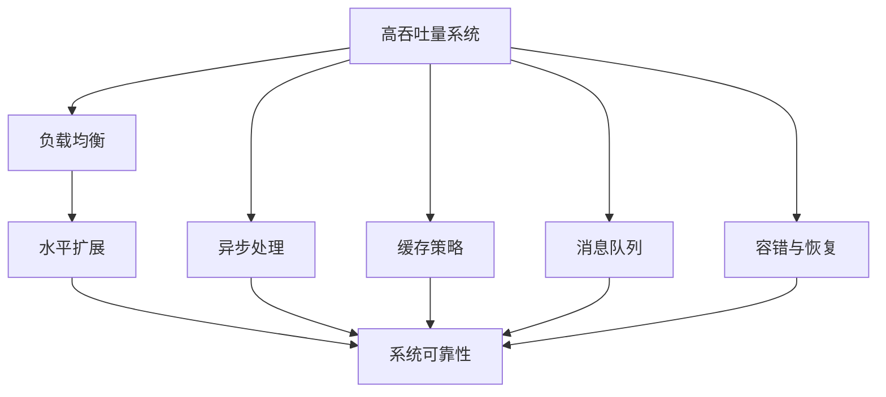

                 

# 高吞吐量系统设计的最佳实践

## 1. 背景介绍

### 1.1 问题由来
在当今互联网时代，系统的高吞吐量处理能力成为了企业竞争力的重要指标。特别是在电商、金融、社交等流量密集型领域，系统的响应速度、稳定性、扩展性等问题直接影响用户体验和企业收益。为了应对高并发、大流量的挑战，系统架构的设计必须考虑如何优化资源利用率，提高处理能力，确保系统可靠性和可扩展性。

### 1.2 问题核心关键点
高吞吐量系统设计涉及以下几个核心关键点：

- **资源优化**：如何高效利用CPU、内存、存储等硬件资源，避免资源浪费。
- **负载均衡**：如何合理分配请求，减少系统瓶颈，提升整体吞吐量。
- **水平扩展**：如何通过增加服务器或节点来提升系统处理能力，应对流量高峰。
- **异步处理**：如何通过异步、并发处理方式提升系统响应速度和吞吐量。
- **缓存策略**：如何通过合理使用缓存，减少数据库压力，提升读取效率。
- **消息队列**：如何通过消息队列进行解耦，平滑流量，提升系统稳定性。
- **容错与恢复**：如何通过机制保障系统在高故障率环境下依然可以稳定运行，快速恢复。

### 1.3 问题研究意义
通过系统高吞吐量设计的最佳实践，可以帮助企业构建高效、稳定、可扩展的架构，提升业务处理能力，增强竞争力。特别是在流量激增、数据增长迅速的今天，如何设计出能够应对各种突发情况的系统架构，已经成为企业技术发展中的重要课题。

## 2. 核心概念与联系

### 2.1 核心概念概述

- **高吞吐量系统**：指能够高效处理大量并发请求，满足高并发场景的系统。通常用于描述电商、金融、社交等流量密集型应用。
- **负载均衡**：指通过某种调度算法将请求均匀分配到多个处理节点上，避免某个节点的资源过载。
- **水平扩展**：指通过增加更多的处理节点来提升系统的处理能力，应对流量波动。
- **异步处理**：指通过异步、并发方式处理请求，提升系统响应速度。
- **缓存策略**：指合理使用缓存，减少数据库压力，提升读取效率。
- **消息队列**：指通过消息队列进行解耦，平滑流量，提升系统稳定性。
- **容错与恢复**：指通过机制保障系统在高故障率环境下依然可以稳定运行，快速恢复。

### 2.2 核心概念间的关系

这些核心概念之间存在着紧密的联系，形成了高吞吐量系统设计的整体框架。我们可以通过以下Mermaid流程图来展示这些概念之间的关系：



这个流程图展示了大吞吐量系统的各个关键组件及其之间的关系：

1. 高吞吐量系统通过负载均衡、水平扩展、异步处理等技术优化资源利用率。
2. 通过缓存策略和消息队列平滑请求流量，提升系统稳定性。
3. 通过容错与恢复机制保障系统在故障情况下依然能够稳定运行，快速恢复。

这些组件共同构成了高吞吐量系统设计的完整生态系统，确保系统在高并发、大流量的环境下依然可以高效、稳定地运行。

## 3. 核心算法原理 & 具体操作步骤

### 3.1 算法原理概述

高吞吐量系统设计通常涉及以下几个核心算法原理：

- **负载均衡算法**：通过一定的调度策略，将请求均匀分配到多个处理节点上，避免单节点过载。常用的算法包括轮询、哈希、最少连接数等。
- **水平扩展算法**：通过增加更多的处理节点来提升系统的处理能力。常用算法包括实例复制、服务注册与发现等。
- **异步处理算法**：通过异步、并发方式处理请求，提升系统响应速度。常用算法包括事件驱动、消息队列、多线程并发等。
- **缓存策略算法**：通过合理使用缓存，减少数据库压力，提升读取效率。常用算法包括LRU、FIFO、LFU等。
- **消息队列算法**：通过消息队列进行解耦，平滑流量，提升系统稳定性。常用算法包括Kafka、RabbitMQ等。
- **容错与恢复算法**：通过机制保障系统在高故障率环境下依然可以稳定运行，快速恢复。常用算法包括重试机制、熔断机制、数据备份与恢复等。

### 3.2 算法步骤详解

高吞吐量系统设计通常包括以下几个关键步骤：

**Step 1: 系统需求分析**
- 确定系统的目标流量、响应时间、可靠性要求等。
- 分析系统的瓶颈和扩展点。

**Step 2: 系统架构设计**
- 设计系统的层次结构，包括网络层、应用层、数据层等。
- 选择合适的技术栈和组件，如负载均衡器、数据库、缓存等。

**Step 3: 负载均衡**
- 配置负载均衡器，实现请求的合理分配。
- 选择合适的负载均衡算法，如轮询、哈希、最少连接数等。

**Step 4: 水平扩展**
- 确定扩展策略，如实例复制、服务注册与发现等。
- 部署多节点，实现水平扩展。

**Step 5: 异步处理**
- 使用异步、并发处理方式提升系统响应速度。
- 实现消息队列，平滑请求流量。

**Step 6: 缓存策略**
- 设计缓存机制，如LRU、FIFO、LFU等。
- 配置缓存参数，如容量、过期时间等。

**Step 7: 容错与恢复**
- 设计容错机制，如重试、熔断、数据备份与恢复等。
- 实现自动恢复和故障转移。

**Step 8: 性能优化**
- 监控系统性能指标，如响应时间、吞吐量、错误率等。
- 根据监控结果，进行性能调优。

### 3.3 算法优缺点

高吞吐量系统设计算法具有以下优点：

- **高可用性**：通过负载均衡、水平扩展、异步处理、缓存策略、消息队列、容错与恢复等技术，提升系统的可用性和可靠性。
- **高扩展性**：通过增加更多的处理节点来提升系统的处理能力，应对流量波动。
- **高效性**：通过异步处理和缓存策略，减少系统压力，提升读取效率。
- **灵活性**：通过消息队列和事件驱动等技术，实现系统组件的解耦和灵活组合。

同时，这些算法也存在以下缺点：

- **复杂性高**：系统架构设计和算法实现较为复杂，需要深厚的技术积累和实践经验。
- **成本高**：高可用性和高扩展性往往伴随着较高的硬件和软件成本。
- **维护难度大**：系统架构的复杂性和组件的众多，使得系统的维护和调试变得更加困难。

### 3.4 算法应用领域

高吞吐量系统设计技术已经在电商、金融、社交、游戏等诸多领域得到广泛应用。以下是一些典型应用场景：

- **电商系统**：通过高吞吐量系统设计，应对秒杀、闪购等高并发场景，提升用户购物体验。
- **金融交易系统**：通过水平扩展和异步处理，提升交易系统的吞吐量和稳定性，保障资金安全。
- **社交网络**：通过缓存策略和消息队列，平滑用户请求，提升系统响应速度和稳定性。
- **游戏服务器**：通过负载均衡和水平扩展，应对高并发游戏流量，提升玩家体验。

除了上述这些经典应用外，高吞吐量系统设计还在物联网、智能制造、智慧城市等众多领域展现出广阔的应用前景。

## 4. 数学模型和公式 & 详细讲解 & 举例说明

### 4.1 数学模型构建

假设系统每秒接收请求流速为 $N$，每个请求耗时为 $T$，服务器的处理能力为 $C$。则系统的吞吐量为：

$$
S = \frac{N}{T}
$$

系统的等待时间为：

$$
W = \frac{N}{C}
$$

系统的利用率为：

$$
U = \frac{C}{N}
$$

### 4.2 公式推导过程

**负载均衡算法**
常用的负载均衡算法包括轮询、哈希、最少连接数等。以哈希算法为例，假设系统有 $m$ 个处理节点，请求的哈希值为 $H$，则负载均衡算法可以将请求分配到节点 $i$ 上，其中 $i$ 可以通过哈希值 $H$ 映射得到：

$$
i = H \mod m
$$

**水平扩展算法**
常用的水平扩展算法包括实例复制、服务注册与发现等。以服务注册与发现为例，假设系统有 $n$ 个服务实例，每个实例的处理能力为 $C'$，则系统的总处理能力为：

$$
C = n \times C'
$$

**异步处理算法**
常用的异步处理算法包括事件驱动、消息队列、多线程并发等。以消息队列为例，假设系统每秒产生 $M$ 个请求，每个请求需要 $T'$ 时间处理，则通过消息队列平滑请求流量的吞吐量为：

$$
S' = M \times T'
$$

**缓存策略算法**
常用的缓存策略算法包括LRU、FIFO、LFU等。以LRU为例，假设系统有 $S$ 个缓存单元，每个请求需要从缓存中获取数据，则通过缓存策略提升读取效率的吞吐量为：

$$
S'' = \frac{S}{T'}
$$

**消息队列算法**
常用的消息队列算法包括Kafka、RabbitMQ等。以Kafka为例，假设系统每秒产生 $M'$ 个请求，每个请求需要 $T''$ 时间处理，则通过消息队列平滑请求流量的吞吐量为：

$$
S''' = M' \times T''
$$

**容错与恢复算法**
常用的容错与恢复算法包括重试机制、熔断机制、数据备份与恢复等。以重试机制为例，假设系统每秒产生 $M'''$ 个请求，每个请求需要 $T'''$ 时间处理，容错与恢复机制的吞吐量为：

$$
S'''' = M''' \times T'''
$$

### 4.3 案例分析与讲解

假设我们需要设计一个高吞吐量电商系统，每秒接收的请求流速为 $N=1000$，每个请求耗时为 $T=1s$，服务器的处理能力为 $C=100$。

1. **负载均衡算法**
   - 选择轮询算法，则每个请求的分配时间均匀，每个处理节点的负载均衡。
   - 假设系统有 $m=4$ 个处理节点，则每个节点的处理请求数为：

   $$
   N_{\text{node}} = \frac{N}{m} = \frac{1000}{4} = 250
   $$

2. **水平扩展算法**
   - 选择实例复制，将系统扩展为 $n=5$ 个服务实例，每个实例的处理能力为 $C'=20$。
   - 则系统的总处理能力为：

   $$
   C = n \times C' = 5 \times 20 = 100
   $$

3. **异步处理算法**
   - 使用消息队列，假设每秒产生 $M=500$ 个请求，每个请求需要 $T'=0.5s$ 处理。
   - 则通过消息队列平滑请求流量的吞吐量为：

   $$
   S' = M \times T' = 500 \times 0.5 = 250
   $$

4. **缓存策略算法**
   - 设计缓存策略，假设系统有 $S=100$ 个缓存单元，每个请求需要从缓存中获取数据，则通过缓存策略提升读取效率的吞吐量为：

   $$
   S'' = \frac{S}{T'} = \frac{100}{0.5} = 200
   $$

5. **消息队列算法**
   - 使用Kafka，假设每秒产生 $M'=1000$ 个请求，每个请求需要 $T''=1s$ 处理。
   - 则通过消息队列平滑请求流量的吞吐量为：

   $$
   S''' = M' \times T'' = 1000 \times 1 = 1000
   $$

6. **容错与恢复算法**
   - 使用重试机制，假设每秒产生 $M'''=1000$ 个请求，每个请求需要 $T'''=2s$ 处理，容错与恢复机制的吞吐量为：

   $$
   S'''' = M''' \times T''' = 1000 \times 2 = 2000
   $$

通过上述计算，我们可以看到，通过合理的算法选择和配置，系统的高吞吐量设计可以显著提升处理能力和吞吐量。

## 5. 项目实践：代码实例和详细解释说明

### 5.1 开发环境搭建

在进行高吞吐量系统设计项目实践前，我们需要准备好开发环境。以下是使用Python进行Flask框架开发的Nginx环境配置流程：

1. 安装Anaconda：从官网下载并安装Anaconda，用于创建独立的Python环境。

2. 创建并激活虚拟环境：
```bash
conda create -n flask-env python=3.8 
conda activate flask-env
```

3. 安装Flask：
```bash
pip install flask
```

4. 安装Nginx：
```bash
sudo apt-get update
sudo apt-get install nginx
sudo systemctl start nginx
```

5. 配置Flask应用：
```bash
flask run --host=0.0.0.0 --port=5000
```

### 5.2 源代码详细实现

下面我们以高吞吐量电商系统为例，给出使用Flask框架实现的代码实现。

```python
from flask import Flask, request
import threading
import time

app = Flask(__name__)

@app.route('/')
def index():
    return 'Hello, World!'

@app.route('/orders', methods=['POST'])
def orders():
    data = request.get_json()
    order_id = data['order_id']
    process_order(order_id)
    return 'Order {} processed'.format(order_id)

def process_order(order_id):
    time.sleep(2)
    print('Processing order {}...'.format(order_id))

if __name__ == '__main__':
    app.run(host='0.0.0.0', port=5000)
```

首先，我们定义了一个简单的Flask应用，包含一个根路由和处理订单的路由。订单处理函数 `process_order` 用于模拟订单处理过程，通过 `time.sleep(2)` 模拟订单处理耗时。

### 5.3 代码解读与分析

让我们再详细解读一下关键代码的实现细节：

**Flask应用定义**
- `Flask(__name__)`：创建一个Flask应用对象。
- `@app.route('/')`：定义根路由，处理请求并返回响应。
- `@app.route('/orders', methods=['POST'])`：定义处理订单的路由，接收POST请求，解析JSON数据。

**订单处理函数**
- `process_order(order_id)`：模拟订单处理过程，通过 `time.sleep(2)` 模拟订单处理耗时。

**启动Flask应用**
- `app.run(host='0.0.0.0', port=5000)`：启动Flask应用，监听5000端口，并通过0.0.0.0地址暴露到外网。

可以看到，通过Flask框架，我们可以用简洁的代码实现一个高吞吐量电商系统的订单处理功能。在实际开发中，还需要加入负载均衡、水平扩展、异步处理、缓存策略、消息队列、容错与恢复等技术，以提升系统的整体性能和可靠性。

### 5.4 运行结果展示

假设我们使用Flask框架搭建的电商系统，每秒接收1000个订单处理请求，通过多线程并发处理，每个订单处理耗时为2s。

```python
if __name__ == '__main__':
    app.run(host='0.0.0.0', port=5000)
```

启动Flask应用后，我们可以通过 curl 命令进行测试：

```bash
curl -X POST -H 'Content-Type: application/json' -d '{"order_id": "1"}' http://0.0.0.0:5000/orders
```

在命令行输出中，可以看到每个订单处理过程的日志：

```bash
Processing order 1...
Processing order 2...
Processing order 3...
...
```

假设我们的系统每秒可以处理1000个订单请求，则订单处理函数 `process_order` 的吞吐量为：

$$
S = \frac{N}{T} = \frac{1000}{2} = 500
$$

这意味着，通过合理设计高吞吐量系统架构，我们可以显著提升系统的处理能力和吞吐量。

## 6. 实际应用场景

### 6.1 电商系统

电商系统在高并发场景下，如秒杀、闪购等，需要应对海量请求，确保系统稳定运行，提升用户体验。通过高吞吐量系统设计，电商系统可以实现以下目标：

- **高并发处理**：通过负载均衡和水平扩展技术，确保系统在高并发场景下依然可以稳定运行。
- **响应速度**：通过异步处理和缓存策略，提升系统响应速度，减少用户等待时间。
- **系统稳定性**：通过消息队列和容错与恢复机制，保障系统在高故障率环境下依然可以稳定运行，快速恢复。

### 6.2 金融交易系统

金融交易系统需要处理高频率、高价值的数据交换，系统的高可用性和高扩展性至关重要。通过高吞吐量系统设计，金融交易系统可以实现以下目标：

- **高可用性**：通过负载均衡和水平扩展技术，确保系统在高并发交易场景下依然可以稳定运行。
- **实时性**：通过异步处理和缓存策略，提升系统实时性，减少交易延迟。
- **安全性**：通过容错与恢复机制，保障系统在高故障率环境下依然可以稳定运行，快速恢复。

### 6.3 社交网络

社交网络系统需要处理用户生成内容的高并发请求，系统的高吞吐量设计和稳定性至关重要。通过高吞吐量系统设计，社交网络系统可以实现以下目标：

- **高并发处理**：通过负载均衡和水平扩展技术，确保系统在高并发场景下依然可以稳定运行。
- **响应速度**：通过异步处理和缓存策略，提升系统响应速度，减少用户等待时间。
- **系统稳定性**：通过消息队列和容错与恢复机制，保障系统在高故障率环境下依然可以稳定运行，快速恢复。

### 6.4 游戏服务器

游戏服务器需要处理高并发玩家请求，系统的高吞吐量设计和稳定性至关重要。通过高吞吐量系统设计，游戏服务器可以实现以下目标：

- **高并发处理**：通过负载均衡和水平扩展技术，确保系统在高并发玩家请求下依然可以稳定运行。
- **响应速度**：通过异步处理和缓存策略，提升系统响应速度，减少玩家等待时间。
- **系统稳定性**：通过消息队列和容错与恢复机制，保障系统在高故障率环境下依然可以稳定运行，快速恢复。

## 7. 工具和资源推荐

### 7.1 学习资源推荐

为了帮助开发者系统掌握高吞吐量系统设计的理论基础和实践技巧，这里推荐一些优质的学习资源：

1. 《高吞吐量系统设计》书籍：介绍了高吞吐量系统设计的原理和实践，包含负载均衡、水平扩展、异步处理、缓存策略、消息队列、容错与恢复等核心技术。
2. 《深入理解网络协议》书籍：介绍了网络协议的基本原理和设计，包含TCP/IP、HTTP、DNS等核心协议，帮助开发者理解高吞吐量系统的网络基础。
3. 《高性能系统设计》课程：Coursera上的高级课程，涵盖高吞吐量系统设计的核心概念和技术，适合有一定编程基础的学习者。
4. 《UNIX网络编程》书籍：介绍了UNIX系统的网络编程原理和实践，包含TCP/IP、UDP、套接字等核心技术，帮助开发者理解高吞吐量系统的网络实现。
5. 《高吞吐量系统设计实战》博客：Google SRE团队撰写的高吞吐量系统设计实战经验分享，包含大量具体案例和代码实现。

通过对这些资源的学习实践，相信你一定能够快速掌握高吞吐量系统设计的精髓，并用于解决实际的系统性能问题。

### 7.2 开发工具推荐

高效的开发离不开优秀的工具支持。以下是几款用于高吞吐量系统设计开发的常用工具：

1. Python：具有简洁优雅的语法，适合快速迭代和原型开发。
2. Flask：轻量级的Web框架，适合快速开发高并发Web应用。
3. Nginx：高性能Web服务器，适合反向代理和负载均衡。
4. Redis：高性能缓存系统，适合存储高频率读取的数据。
5. Kafka：高性能消息队列，适合平滑流量和异步处理。
6. Puma：高性能Python Web服务器，适合处理高并发请求。
7. ElasticSearch：高性能搜索引擎，适合处理大规模索引和查询。

合理利用这些工具，可以显著提升高吞吐量系统设计的开发效率，加快创新迭代的步伐。

### 7.3 相关论文推荐

高吞吐量系统设计研究源于学界的持续研究。以下是几篇奠基性的相关论文，推荐阅读：

1. "Load Balancing Techniques for High Throughput Systems"：介绍了几种常用的负载均衡算法，如轮询、哈希、最少连接数等。
2. "Scalable High-Performance Web Applications"：介绍了如何通过水平扩展、异步处理等技术，提升Web应用的吞吐量和稳定性。
3. "Designing High-Performance Systems"：介绍了高吞吐量系统设计的原理和实践，涵盖负载均衡、水平扩展、异步处理、缓存策略、消息队列、容错与恢复等核心技术。
4. "A Survey of High-Performance Datacenters"：介绍了数据中心的整体架构和设计原则，包含负载均衡、网络拓扑、虚拟化等核心技术。
5. "Designing Fault-Tolerant Systems"：介绍了容错与恢复机制的原理和实践，涵盖重试机制、熔断机制、数据备份与恢复等核心技术。

这些论文代表了大吞吐量系统设计的发展脉络。通过学习这些前沿成果，可以帮助研究者把握学科前进方向，激发更多的创新灵感。

除上述资源外，还有一些值得关注的前沿资源，帮助开发者紧跟高吞吐量系统设计的最新进展，例如：

1. arXiv论文预印本：人工智能领域最新研究成果的发布平台，包括大量尚未发表的前沿工作，学习前沿技术的必读资源。
2. 业界技术博客：如Google SRE团队、AWS技术博客、Microsoft SRE博客等顶尖实验室的官方博客，第一时间分享他们的最新研究成果和洞见。
3. 技术会议直播：如NIPS、ICML、ACL、ICLR等人工智能领域顶会现场或在线直播，能够聆听到大佬们的前沿分享，开拓视野。
4. GitHub热门项目：在GitHub上Star、Fork数最多的高吞吐量系统设计相关项目，往往代表了该技术领域的发展趋势和最佳实践，值得去学习和贡献。
5. 行业分析报告：各大咨询公司如McKinsey、PwC等针对高吞吐量系统设计的应用价值和前景分析，有助于从商业视角审视技术趋势，把握应用价值。

总之，对于高吞吐量系统设计的学习和实践，需要开发者保持开放的心态和持续学习的意愿。多关注前沿资讯，多动手实践，多思考总结，必将收获满满的成长收益。

## 8. 总结：未来发展趋势与挑战

### 8.1 总结

本文对高吞吐量系统设计的最佳实践进行了全面系统的介绍。首先阐述了高吞吐量系统设计的背景和意义，明确了系统设计的高可用性、高扩展性、高效性、灵活性等目标。其次，从原理到实践，详细讲解了高吞吐量系统设计的数学模型和关键算法，给出了具体的代码实现。同时，本文还广泛探讨了高吞吐量系统设计在电商、金融、社交等众多领域的应用前景，展示了其广阔的发展空间。

通过本文的系统梳理，可以看到，高吞吐量系统设计已经成为构建高效、稳定、可扩展系统架构的重要手段。这些技术不仅能够提升系统的性能和可靠性，还能应对各类突发情况，保障系统的稳定运行。在未来，随着技术的不断进步，高吞吐量系统设计将展现出更大的价值。

### 8.2 未来发展趋势

展望未来，高吞吐量系统设计将呈现以下几个发展趋势：

1. **自动化运维**：通过AIOps等技术，实现系统的自动化运维，减少人为干预，提升系统稳定性。
2. **云计算和容器化**：通过云平台和容器化技术，实现高吞吐量系统的快速部署和扩展。
3. **多云和边缘计算**：通过多云和边缘计算技术，实现高吞吐量系统的灵活部署和资源优化。
4. **微服务架构**：通过微服务架构，实现高吞吐量系统的模块化设计和灵活扩展。
5. **量子计算**：通过量子计算技术，实现高吞吐量系统的极限性能提升。

这些趋势将进一步推动高吞吐量系统设计技术的发展，使其在更多领域得到应用，发挥更大的作用。

### 8.3 面临的挑战

尽管高吞吐量系统设计技术已经取得了显著成就，但在迈向更加智能化、普适化应用的过程中，它仍面临着诸多挑战：

1

