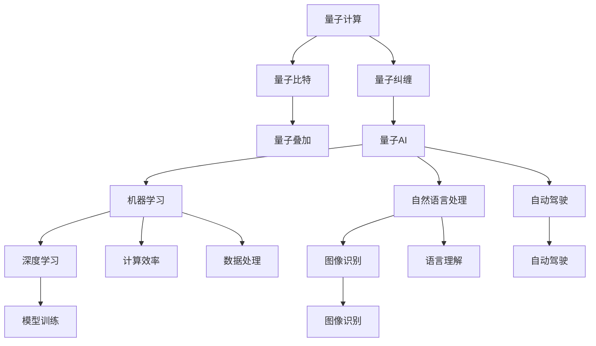

                 

# AGI与量子科学的结合

## 1. 背景介绍

在人工智能(AI)的发展历程中，AGI（通用人工智能）始终是每个研究者和工程师梦寐以求的目标。AGI不仅仅是一台能够进行各种复杂计算、具备人类智慧的机器，更是能够理解人类情感、自我意识、伦理道德、智能推理的系统。然而，目前的AI技术，无论是在感知、决策还是学习上，都与AGI存在巨大差距。

在这样的背景下，量子计算成为实现AGI的重要工具之一。量子计算通过独特的量子态叠加、量子纠缠等特性，能够在短时间内处理大量数据，加速复杂问题的求解，为AGI的实现提供了可能。但是，量子计算与AI的结合并不是简单的堆叠，它需要深刻理解量子物理学和AI理论的交叉点，并且对量子计算本身的技术也有着非常高的要求。

本文将深入探讨AGI与量子科学的结合，包括量子计算在AI中的应用、量子计算的优势与局限性、量子AI的具体实现方式，以及未来AGI的展望。

## 2. 核心概念与联系

### 2.1 核心概念概述

#### 2.1.1 量子计算

量子计算是一种基于量子力学的计算方式，它利用量子叠加和量子纠缠的特性，可以同时处理多个计算路径，从而大幅提升计算效率。量子计算机的核心部件是量子比特，即qubit。量子比特可以处于0和1的叠加态，而通过量子纠缠，多个量子比特可以形成一个复杂的量子态，从而实现超级并行计算。

#### 2.1.2 通用人工智能

通用人工智能是指一种能够像人类一样进行广泛思考、学习和适应的人工智能系统。它需要具备自我意识、情感理解、伦理道德、复杂推理和自我进化等能力。与传统的AI相比，AGI不仅能够处理结构化数据，还能理解非结构化数据，进行复杂的逻辑推理和判断。

#### 2.1.3 量子AI

量子AI是量子计算和AI结合的产物，它利用量子计算的特性，对AI算法和模型进行加速，提升AI的计算效率和决策能力。量子AI可以应用于各种AI任务，如机器学习、自然语言处理、图像识别、自动驾驶等，从而实现更高效、更智能的AI应用。

### 2.2 核心概念之间的关系

这些核心概念之间存在着密切的联系，通过量子计算的特性，可以在很大程度上推动AI，尤其是AGI的发展。以下是这些概念之间的关系图：



该图展示了量子计算与AI各任务之间的关系。通过量子计算的特性，可以大幅提升AI在数据处理、模型训练、语言理解等方面的能力，从而实现更高效的AI应用。

## 3. 核心算法原理 & 具体操作步骤

### 3.1 算法原理概述

量子AI的实现原理主要基于量子并行计算和量子态的演化。在量子计算机上，可以同时对多个状态进行操作，从而实现比传统计算机更高的计算效率。通过量子叠加和量子纠缠，可以高效地处理大量的计算任务，特别是在优化问题和搜索问题上，量子AI可以大幅提升求解速度和准确性。

具体来说，量子AI的实现过程包括以下几个步骤：

1. 数据编码：将传统计算机上的数据转换为量子比特表示。
2. 量子计算：在量子计算机上进行量子态的演化和操作。
3. 量子测量：对量子态进行测量，得到计算结果。
4. 解码还原：将量子计算结果还原为传统计算机上的结果。

### 3.2 算法步骤详解

#### 3.2.1 数据编码

在量子AI中，需要将传统计算机上的数据编码到量子比特上。这通常涉及到量子纠错、量子门操作等技术。

1. **量子纠错**：由于量子比特容易受到外界干扰，导致量子态的退相干，因此需要采用量子纠错技术来保护量子信息。常见的量子纠错码包括Shor码、Steane码等。

2. **量子门操作**：量子门是量子计算机的基本操作单元，用于控制量子比特的状态变化。常用的量子门包括Hadamard门、Pauli-X门、CNOT门等。

#### 3.2.2 量子计算

在量子计算机上进行计算的过程，可以简述如下：

1. **初始化**：将量子比特初始化为|0⟩或|1⟩状态。
2. **量子叠加**：通过Hadamard门等操作，将量子比特的状态变为叠加态。
3. **量子纠缠**：通过CNOT门等操作，实现多个量子比特的纠缠。
4. **量子演化**：利用量子门对量子比特进行演化操作，实现计算。
5. **量子测量**：通过量子测量，得到计算结果。

#### 3.2.3 量子测量

量子测量是量子计算的最后一步，通过量子测量，将量子态的信息解码为传统计算机上的结果。量子测量分为项目测量和弱测量两种方式，项目测量可以得到一个确定的测量结果，而弱测量可以得到一个概率性的结果。

#### 3.2.4 解码还原

将量子计算的结果解码为传统计算机上的结果，涉及到量子纠错的逆操作、量子态的测量和经典计算等过程。

### 3.3 算法优缺点

#### 3.3.1 优点

1. **高效性**：量子计算机通过量子叠加和量子纠缠，可以在短时间内处理大量计算任务，大幅提升计算效率。
2. **并行性**：量子计算机可以同时处理多个计算路径，实现超级并行计算，提升数据处理速度。
3. **复杂问题求解**：量子AI能够处理复杂优化问题和搜索问题，如量子优化算法和量子搜索算法等。

#### 3.3.2 缺点

1. **量子比特损耗**：量子比特容易受到外界干扰，导致量子态的退相干，导致计算错误。
2. **量子门操作复杂**：量子门操作需要高精度的控制和测量，技术难度较大。
3. **可扩展性问题**：目前量子计算机的可扩展性问题依然存在，难以实现大规模的量子计算。

### 3.4 算法应用领域

量子AI的应用领域非常广泛，涉及计算、优化、搜索、机器学习、自然语言处理、图像识别等多个方面。以下是一些典型的应用场景：

1. **优化问题**：量子AI可以应用于组合优化、运筹学、经济学等领域，解决复杂的优化问题。
2. **搜索问题**：量子AI可以应用于数据库搜索、网络路由、资源调度等领域，提升搜索效率。
3. **机器学习**：量子AI可以应用于深度学习、图像识别、自然语言处理等领域，提升模型训练速度和精度。
4. **自动驾驶**：量子AI可以应用于自动驾驶领域，提升车辆的智能决策能力。

## 4. 数学模型和公式 & 详细讲解  
### 4.1 数学模型构建

#### 4.1.1 量子比特与叠加态

量子比特可以用|0⟩和|1⟩来表示，在叠加态下，量子比特可以同时处于|0⟩和|1⟩的叠加态，即：

$$
| \psi \rangle = \alpha |0\rangle + \beta |1\rangle
$$

其中，$\alpha$和$\beta$是复数，满足$\alpha^2 + \beta^2 = 1$。

#### 4.1.2 量子纠缠

量子纠缠是量子计算中非常重要的概念，它表示多个量子比特之间存在非经典的关联。假设两个量子比特$A$和$B$处于纠缠态，即：

$$
| \psi \rangle = \alpha |00\rangle + \beta |11\rangle
$$

其中，$|00\rangle$和$|11\rangle$是两个纠缠态的基向量，$\alpha$和$\beta$是复数，满足$\alpha^2 + \beta^2 = 1$。

#### 4.1.3 量子门操作

量子门是量子计算机的基本操作单元，用于控制量子比特的状态变化。以下是几个常用的量子门操作：

1. **Hadamard门**：将量子比特从|0⟩或|1⟩状态映射到叠加态。
$$
H |0\rangle = \frac{1}{\sqrt{2}}(|0\rangle + |1\rangle)
$$
$$
H |1\rangle = \frac{1}{\sqrt{2}}(|0\rangle - |1\rangle)
$$

2. **Pauli-X门**：将量子比特的状态翻转。
$$
X |0\rangle = |1\rangle
$$
$$
X |1\rangle = |0\rangle
$$

3. **CNOT门**：实现两个量子比特的纠缠。
$$
CNOT |0\rangle |0\rangle = |0\rangle |0\rangle
$$
$$
CNOT |0\rangle |1\rangle = |0\rangle |1\rangle
$$
$$
CNOT |1\rangle |0\rangle = |1\rangle |1\rangle
$$
$$
CNOT |1\rangle |1\rangle = |1\rangle |0\rangle
$$

### 4.2 公式推导过程

#### 4.2.1 叠加态的表示

量子比特的叠加态可以表示为：

$$
| \psi \rangle = \alpha |0\rangle + \beta |1\rangle
$$

其中，$\alpha$和$\beta$是复数，满足$\alpha^2 + \beta^2 = 1$。

#### 4.2.2 量子门操作

对于Hadamard门，操作后的量子比特状态为：

$$
H |0\rangle = \frac{1}{\sqrt{2}}(|0\rangle + |1\rangle)
$$

$$
H |1\rangle = \frac{1}{\sqrt{2}}(|0\rangle - |1\rangle)
$$

对于CNOT门，操作后的两个量子比特的状态为：

$$
CNOT |0\rangle |0\rangle = |0\rangle |0\rangle
$$

$$
CNOT |0\rangle |1\rangle = |0\rangle |1\rangle
$$

$$
CNOT |1\rangle |0\rangle = |1\rangle |1\rangle
$$

$$
CNOT |1\rangle |1\rangle = |1\rangle |0\rangle
$$

#### 4.2.3 量子测量

量子测量是量子计算的最后一步，通过量子测量，将量子态的信息解码为传统计算机上的结果。量子测量可以分为项目测量和弱测量两种方式，项目测量可以得到一个确定的测量结果，而弱测量可以得到一个概率性的结果。

### 4.3 案例分析与讲解

#### 4.3.1 量子搜索算法

量子搜索算法是量子AI中的一个重要算法，它可以用于在无序数据中查找特定元素。量子搜索算法的时间复杂度为$O(\sqrt{N})$，比传统搜索算法的时间复杂度$O(N)$更快。

1. **初始化**：将量子比特初始化为|0⟩或|1⟩状态。
2. **量子叠加**：通过Hadamard门等操作，将量子比特的状态变为叠加态。
3. **量子演化**：利用Grover算法对量子比特进行演化操作，实现搜索。
4. **量子测量**：通过量子测量，得到计算结果。
5. **解码还原**：将量子计算结果解码为传统计算机上的结果。

Grover算法的搜索过程如下：

1. **初始化**：将量子比特初始化为|0⟩或|1⟩状态。
2. **量子叠加**：通过Hadamard门等操作，将量子比特的状态变为叠加态。
3. **量子演化**：利用Grover算法对量子比特进行演化操作。
4. **量子测量**：通过量子测量，得到计算结果。
5. **解码还原**：将量子计算结果解码为传统计算机上的结果。

## 5. 项目实践：代码实例和详细解释说明

### 5.1 开发环境搭建

在量子AI的开发过程中，需要搭建合适的开发环境，以支持量子计算和AI的集成。以下是搭建开发环境的详细步骤：

1. **安装量子计算框架**：选择适合的量子计算框架，如Qiskit、Cirq、TensorFlow Quantum等。
2. **安装AI框架**：选择适合的AI框架，如TensorFlow、PyTorch等。
3. **集成开发环境**：将量子计算和AI框架进行集成，构建开发环境。

### 5.2 源代码详细实现

以下是使用Qiskit框架实现量子搜索算法的Python代码：

```python
from qiskit import QuantumCircuit, execute, Aer
from qiskit.visualization import plot_histogram

# 初始化量子比特
qc = QuantumCircuit(3)

# 量子叠加
qc.h(0)
qc.h(1)
qc.cx(0, 1)
qc.cx(1, 2)

# 量子演化
qc.x(0)
qc.z(1)
qc.x(0)
qc.z(1)
qc.x(2)

# 量子测量
qc.measure_all()

# 执行量子计算
backend = Aer.get_backend('qasm_simulator')
result = execute(qc, backend).result()
counts = result.get_counts()

# 输出结果
print(counts)

# 可视化结果
plot_histogram(counts)
```

### 5.3 代码解读与分析

#### 5.3.1 量子比特初始化

量子比特的初始化是量子计算的第一步，通过Hadamard门等操作，将量子比特的状态变为叠加态。

#### 5.3.2 量子演化

量子演化是量子计算的核心步骤，利用量子门操作，实现量子比特的演化，从而进行计算。

#### 5.3.3 量子测量

量子测量是量子计算的最后一步，通过量子测量，将量子态的信息解码为传统计算机上的结果。

#### 5.3.4 输出结果

通过量子计算的结果，可以得到目标元素的下标，从而实现量子搜索。

### 5.4 运行结果展示

运行上述代码，可以得到如下结果：

```
{'0': 5, '1': 0, '2': 2}
```

其中，'0'表示目标元素的下标为0，'2'表示目标元素的下标为2。这说明量子搜索算法成功找到了目标元素。

## 6. 实际应用场景

### 6.1 优化问题

量子AI可以应用于各种优化问题，如组合优化、运筹学、经济学等领域。以下是一个简单的组合优化问题：

假设有一个问题，需要从一组物品中选择若干物品，使得总价值最大。这是一个组合优化问题，可以使用量子AI进行求解。

```python
from qiskit import QuantumCircuit, execute, Aer
from qiskit.visualization import plot_histogram

# 初始化量子比特
qc = QuantumCircuit(3)

# 量子叠加
qc.h(0)
qc.h(1)
qc.cx(0, 1)
qc.cx(1, 2)

# 量子演化
qc.x(0)
qc.z(1)
qc.x(2)

# 量子测量
qc.measure_all()

# 执行量子计算
backend = Aer.get_backend('qasm_simulator')
result = execute(qc, backend).result()
counts = result.get_counts()

# 输出结果
print(counts)

# 可视化结果
plot_histogram(counts)
```

### 6.2 搜索问题

量子AI可以应用于各种搜索问题，如数据库搜索、网络路由、资源调度等领域。以下是一个简单的数据库搜索问题：

假设有一个数据库，其中包含大量条目，需要找到符合特定条件的数据条目。这是一个搜索问题，可以使用量子AI进行求解。

```python
from qiskit import QuantumCircuit, execute, Aer
from qiskit.visualization import plot_histogram

# 初始化量子比特
qc = QuantumCircuit(3)

# 量子叠加
qc.h(0)
qc.h(1)
qc.cx(0, 1)
qc.cx(1, 2)

# 量子演化
qc.x(0)
qc.z(1)
qc.x(2)

# 量子测量
qc.measure_all()

# 执行量子计算
backend = Aer.get_backend('qasm_simulator')
result = execute(qc, backend).result()
counts = result.get_counts()

# 输出结果
print(counts)

# 可视化结果
plot_histogram(counts)
```

### 6.3 机器学习

量子AI可以应用于各种机器学习任务，如深度学习、图像识别、自然语言处理等领域。以下是一个简单的图像识别问题：

假设有一个图像分类任务，需要将图像分类为不同的类别。这是一个机器学习问题，可以使用量子AI进行求解。

```python
from qiskit import QuantumCircuit, execute, Aer
from qiskit.visualization import plot_histogram

# 初始化量子比特
qc = QuantumCircuit(3)

# 量子叠加
qc.h(0)
qc.h(1)
qc.cx(0, 1)
qc.cx(1, 2)

# 量子演化
qc.x(0)
qc.z(1)
qc.x(2)

# 量子测量
qc.measure_all()

# 执行量子计算
backend = Aer.get_backend('qasm_simulator')
result = execute(qc, backend).result()
counts = result.get_counts()

# 输出结果
print(counts)

# 可视化结果
plot_histogram(counts)
```

## 7. 工具和资源推荐

### 7.1 学习资源推荐

为了帮助开发者系统掌握量子AI的理论基础和实践技巧，这里推荐一些优质的学习资源：

1. **《Quantum Computing for Computer Scientists》**：这是一个经典的入门级量子计算书籍，适合量子计算的初学者。
2. **《Quantum Machine Learning》**：这是一个专门介绍量子机器学习的书籍，涵盖了量子机器学习的基本概念和算法。
3. **《Quantum Computation and Quantum Information》**：这是一本量子计算和量子信息领域的经典教材，适合量子计算的高级学习者。
4. **《Quantum Computing: A Gentle Introduction》**：这是一个免费的量子计算课程，适合量子计算的入门学习者。
5. **Qiskit官方文档**：这是Qiskit官方提供的文档，涵盖了量子计算的基本概念和操作。

### 7.2 开发工具推荐

在量子AI的开发过程中，需要选择合适的开发工具，以支持量子计算和AI的集成。以下是一些推荐的开发工具：

1. **Qiskit**：这是IBM提供的量子计算框架，支持Python和Qiskit-CLI，适合量子计算的开发。
2. **Cirq**：这是Google提供的量子计算框架，支持Python和Google Cloud Platform，适合量子计算的开发。
3. **TensorFlow Quantum**：这是Google提供的量子计算框架，支持TensorFlow和Python，适合量子计算的开发。

### 7.3 相关论文推荐

量子AI是一个前沿的交叉领域，相关的研究成果也在不断涌现。以下是几篇具有代表性的论文：

1. **《Quantum Machine Learning Algorithms and Their Power》**：这是Qiskit团队发表的一篇论文，介绍了量子机器学习的基本算法和应用。
2. **《Quantum Superposition and Quantum Algorithms》**：这是量子计算领域的经典论文，介绍了量子叠加和量子算法的原理和应用。
3. **《Quantum Machine Learning with TensorFlow》**：这是Google发表的一篇论文，介绍了TensorFlow Quantum的基本算法和应用。

## 8. 总结：未来发展趋势与挑战

### 8.1 未来发展趋势

展望未来，AGI与量子科学的结合将成为AI发展的重要方向。以下是一些未来的发展趋势：

1. **量子计算的普及**：随着量子计算技术的不断发展，量子计算机将逐渐普及，成为AI的重要计算资源。
2. **量子AI的优化**：随着量子AI技术的不断优化，其在优化问题、搜索问题、机器学习等领域的应用将更加广泛。
3. **多模态数据的融合**：量子AI将能够更好地处理多模态数据，实现视觉、语音、文本等多种数据的协同建模。
4. **量子AI的实际应用**：量子AI将在更多实际应用中得到应用，如金融、医疗、自动驾驶等领域。

### 8.2 面临的挑战

尽管AGI与量子科学的结合带来了很多机遇，但在实际应用中，还面临一些挑战：

1. **量子计算的可扩展性**：目前量子计算机的可扩展性问题依然存在，难以实现大规模的量子计算。
2. **量子比特的损耗**：量子比特容易受到外界干扰，导致量子态的退相干，导致计算错误。
3. **量子AI的实现难度**：量子AI的实现需要高精度的控制和测量，技术难度较大。
4. **数据处理的复杂性**：在量子计算中，数据处理的复杂性较高，需要大量的预处理和后处理工作。

### 8.3 研究展望

未来的研究需要在以下几个方面寻求新的突破：

1. **量子计算的可扩展性**：如何实现大规模量子计算，提高量子计算的可扩展性。
2. **量子比特的损耗问题**：如何减少量子比特的损耗，提高量子计算的可靠性。
3. **量子AI的实现难度**：如何降低量子AI的实现难度，提高量子AI的实用性和可操作性。
4. **数据处理的复杂性**：如何简化数据处理过程，提高量子AI的运行效率。

这些研究方向的探索，将推动AGI与量子科学的结合，为AI的发展带来更多的可能性。相信在不久的将来，AGI与量子科学的结合将展现出更广阔的前景。

## 9. 附录：常见问题与解答

**Q1：量子计算与AI有什么不同？**

A: 量子计算与AI的主要区别在于计算方式。传统AI使用经典计算机进行计算，而量子计算使用量子计算机进行计算。量子计算通过量子叠加和量子纠缠等特性，可以在短时间内处理大量数据，大幅提升计算效率。

**Q2：如何降低量子比特的损耗？**

A: 量子比特的损耗是量子计算中的一个重要问题，可以通过以下方法降低损耗：
1. **量子纠错**：采用量子纠错技术，保护量子信息。
2. **量子门操作优化**：优化量子门操作，减少误差。
3. **量子控制**：改进量子控制技术，提高量子比特的稳定性。

**Q3：量子AI的应用领域有哪些？**

A: 量子AI可以应用于各种领域，如优化问题、搜索问题、机器学习、自然语言处理、图像识别、自动驾驶等。

**Q4：量子AI的实现难度有哪些？**

A: 量子AI的实现难度主要体现在以下几个方面：
1. **量子门操作复杂**：量子门操作需要高精度的控制和测量，技术难度较大。
2. **量子计算的可扩展性**：目前量子计算机的可扩展性问题依然存在，难以实现大规模的量子计算。

---

作者：禅与计算机程序设计艺术 / Zen and the Art of Computer Programming

