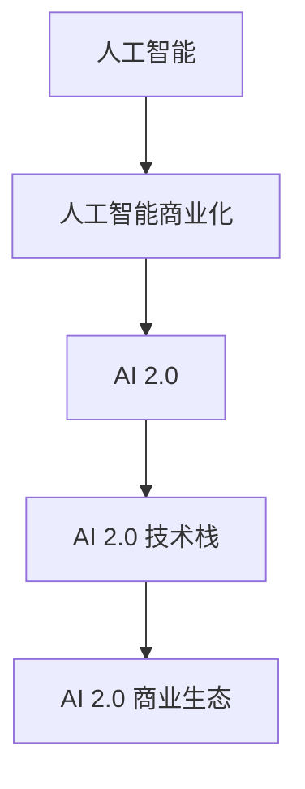
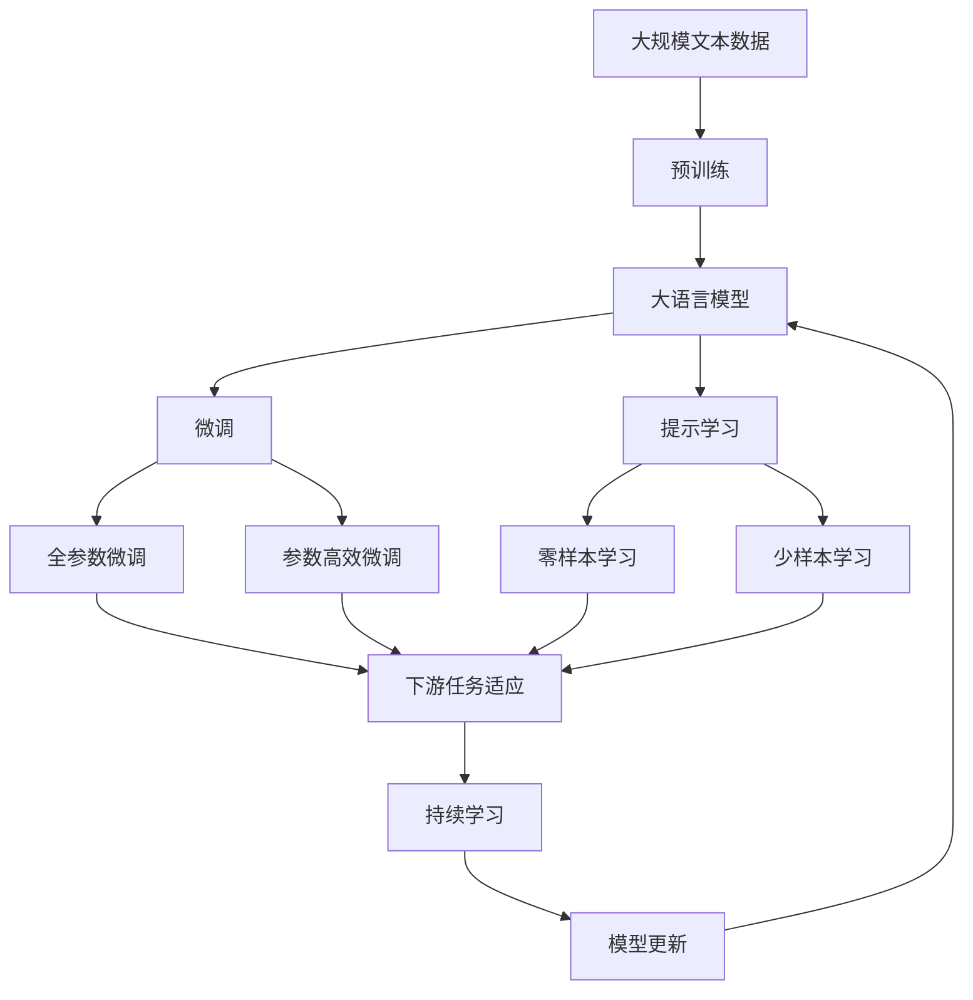

                 

## 1. 背景介绍

### 1.1 问题由来
随着人工智能技术的不断进步，AI 2.0 时代已经悄然到来。相比于第一代人工智能技术，AI 2.0 在数据、算法和应用场景上都取得了巨大的突破。AI 2.0 技术不仅能够理解和处理语言、图像、声音等结构化数据，还能够处理非结构化数据，如社交媒体、视频等，甚至能够进行复杂的决策和创意工作。AI 2.0 技术的兴起，为许多行业带来了革命性的变化，同时也催生了新的商业模式。

### 1.2 问题核心关键点
AI 2.0 时代的重要特点在于其算法和模型在处理复杂任务时的强大能力，以及其在实际应用中的广泛适用性。AI 2.0 技术的应用场景涵盖了医疗、金融、教育、智能制造、物流、客服等多个领域。AI 2.0 技术的商业化应用，不仅能够提高企业的运营效率，还能够开辟新的市场机会，形成新的商业模式。

AI 2.0 商业模式的成功与否，取决于企业的技术实力、市场洞察力和创新能力。AI 2.0 技术的商业应用，需要考虑数据的获取、模型的构建、算法的优化、应用的部署等多个环节。AI 2.0 技术的商业化，不仅是技术应用的简单过程，而是一个完整的商业模式构建过程。

### 1.3 问题研究意义
研究 AI 2.0 时代的商业模式，对于理解AI 2.0 技术的商业应用，把握AI 2.0 技术的市场机会，推动AI 2.0 技术的落地，具有重要的现实意义。AI 2.0 技术的商业化应用，不仅能提升企业的运营效率，还能为企业创造新的价值，开辟新的市场空间。未来，AI 2.0 技术将在更多领域得到应用，推动企业的数字化转型和智能化升级，为企业带来更多的商业机会。

## 2. 核心概念与联系

### 2.1 核心概念概述

为更好地理解 AI 2.0 时代的商业模式，本节将介绍几个密切相关的核心概念：

- **人工智能(AI)**：一种通过计算机模拟人类智能的技术，包括感知、学习、推理、决策等多个方面。AI 2.0 强调深度学习和大数据技术的应用，能够处理复杂的多模态数据，具备强大的学习能力。
- **人工智能商业化**：将 AI 技术应用于实际商业场景，解决实际问题，创造商业价值的过程。AI 2.0 技术在商业化应用中，能够大幅提升企业的运营效率，优化决策过程，创造新的商业模式。
- **AI 2.0**：新一代人工智能技术，相较于第一代人工智能技术，AI 2.0 具备更强的学习和推理能力，能够处理复杂的多模态数据，广泛应用于各个行业。
- **AI 2.0 技术栈**：AI 2.0 技术的应用，依赖于深度学习框架、大数据平台、云计算等技术的支持。AI 2.0 技术栈的构建，是 AI 2.0 技术商业化的基础。
- **AI 2.0 商业生态**：AI 2.0 技术的商业化应用，形成了一个由企业、开发者、用户、供应商等构成的生态系统，涵盖了 AI 技术的开发、部署、运营、优化等多个环节。

这些核心概念之间存在着紧密的联系，形成了 AI 2.0 技术的商业模式生态系统。

### 2.2 概念间的关系

这些核心概念之间的关系可以通过以下 Mermaid 流程图来展示：



这个流程图展示了大语言模型的核心概念及其之间的关系：

1. 人工智能技术通过商业化，能够形成商业价值。
2. AI 2.0 技术在商业化应用中，能够提升企业的运营效率，创造新的商业模式。
3. AI 2.0 技术栈提供了 AI 技术商业化的技术支持。
4. AI 2.0 商业生态的形成，促进了 AI 技术的进一步发展和商业应用。

### 2.3 核心概念的整体架构

最后，我们用一个综合的流程图来展示这些核心概念在大语言模型商业化中的应用：



这个综合流程图展示了从预训练到微调，再到持续学习的完整过程。大语言模型首先在大规模文本数据上进行预训练，然后通过微调或提示学习来适应下游任务。最后，通过持续学习技术，模型可以不断更新和适应新的任务和数据。

## 3. 核心算法原理 & 具体操作步骤
### 3.1 算法原理概述

AI 2.0 时代的商业模式，是基于 AI 2.0 技术的深度学习和大数据技术实现的。AI 2.0 技术的商业应用，需要依赖于数据获取、模型构建、算法优化、应用部署等多个环节。以下将详细介绍 AI 2.0 技术的核心算法原理和具体操作步骤。

### 3.2 算法步骤详解

AI 2.0 技术的商业化应用，一般包括以下几个关键步骤：

**Step 1: 数据获取**
- 收集和预处理数据，包括数据清洗、去重、标注等。
- 确保数据的代表性和多样性，覆盖不同领域、不同场景和不同数据类型。
- 数据隐私和安全问题，需考虑合规性和数据脱敏。

**Step 2: 模型构建**
- 选择合适的预训练模型，如BERT、GPT等，作为商业应用的起点。
- 在预训练模型基础上，进行微调或参数高效微调，以适应具体任务。
- 引入更多先验知识，如知识图谱、逻辑规则等，增强模型的决策能力。

**Step 3: 算法优化**
- 选择合适的优化算法，如Adam、SGD等，调整学习率、批大小等参数。
- 引入正则化技术，如L2正则、Dropout等，避免过拟合。
- 采用对抗训练、数据增强等技术，提高模型的鲁棒性和泛化能力。

**Step 4: 应用部署**
- 将模型部署到生产环境，确保模型的实时响应和高效推理。
- 结合云计算、大数据平台等技术，实现模型的在线化、云化。
- 引入监控和告警系统，确保模型的稳定性和可靠性。

**Step 5: 持续优化**
- 定期收集新数据，更新和优化模型。
- 引入用户反馈，持续改进模型性能。
- 结合业务场景，不断创新和优化商业模式。

### 3.3 算法优缺点

AI 2.0 技术的商业化应用，具有以下优点：
1. 提升运营效率。AI 2.0 技术能够自动化处理大量数据，优化决策过程，提高企业运营效率。
2. 创造新的价值。AI 2.0 技术能够发现新机会，创造新的业务模式，增加企业的收入来源。
3. 提升用户体验。AI 2.0 技术能够实现智能客服、推荐系统等应用，提升用户满意度。

但 AI 2.0 技术的商业化应用也存在一些缺点：
1. 数据隐私问题。AI 2.0 技术需要大量数据支持，可能引发数据隐私和安全问题。
2. 算法透明性不足。AI 2.0 模型往往具有黑箱性质，难以解释其内部工作机制。
3. 高成本投入。AI 2.0 技术的商业化应用，需要高成本的硬件和软件支持。
4. 技术壁垒高。AI 2.0 技术需要高水平的技术实力和专业人才，门槛较高。

### 3.4 算法应用领域

AI 2.0 技术的商业化应用，涵盖了许多领域，包括但不限于：

- **智能客服**：使用AI 2.0技术实现智能客服系统，提高客户满意度，降低人力成本。
- **金融风控**：应用AI 2.0技术进行风险评估、信用评分等，降低金融风险。
- **医疗诊断**：利用AI 2.0技术进行图像识别、病理诊断等，提升医疗水平。
- **智能制造**：使用AI 2.0技术进行质量检测、设备维护等，提升生产效率。
- **物流配送**：应用AI 2.0技术进行路线规划、库存管理等，优化物流成本。
- **教育培训**：采用AI 2.0技术进行个性化推荐、知识图谱构建等，提升教育效果。

## 4. 数学模型和公式 & 详细讲解 & 举例说明
### 4.1 数学模型构建

AI 2.0 技术的商业化应用，依赖于深度学习和数据科学的理论支持。以下将通过数学模型来详细解释 AI 2.0 技术的核心算法原理。

### 4.2 公式推导过程

假设我们有一组数据集 $D=\{(x_i,y_i)\}_{i=1}^N$，其中 $x_i$ 为输入特征，$y_i$ 为输出标签。使用一个深度神经网络 $f(x;\theta)$ 来表示模型，其中 $\theta$ 为模型参数。目标是通过最小化损失函数 $\mathcal{L}$，来优化模型参数 $\theta$。

假设我们选择了均方误差损失函数，则损失函数为：
$$
\mathcal{L}(\theta) = \frac{1}{N}\sum_{i=1}^N (y_i - f(x_i;\theta))^2
$$

使用随机梯度下降等优化算法，对模型参数 $\theta$ 进行迭代优化，直到收敛。

### 4.3 案例分析与讲解

以金融风险评估为例，我们可以构建一个基于AI 2.0技术的风险评估模型。该模型通过输入客户的财务数据、行为数据等特征，输出客户的信用评分。假设我们的模型为线性回归模型，则输入特征 $x$ 为客户的财务数据、行为数据等，输出标签 $y$ 为客户的信用评分。使用均方误差损失函数，目标是最小化模型预测值与真实标签之间的差异。

通过训练模型，可以发现模型的预测性能随着训练样本数量的增加而提升，特别是在使用更多的先验知识和数据增强技术后，模型的泛化能力更强，能够更好地适应新数据。

## 5. 项目实践：代码实例和详细解释说明
### 5.1 开发环境搭建

在进行AI 2.0技术商业化应用时，需要搭建一个合适的开发环境。以下是使用Python进行PyTorch开发的环境配置流程：

1. 安装Anaconda：从官网下载并安装Anaconda，用于创建独立的Python环境。

2. 创建并激活虚拟环境：
```bash
conda create -n pytorch-env python=3.8 
conda activate pytorch-env
```

3. 安装PyTorch：根据CUDA版本，从官网获取对应的安装命令。例如：
```bash
conda install pytorch torchvision torchaudio cudatoolkit=11.1 -c pytorch -c conda-forge
```

4. 安装Transformers库：
```bash
pip install transformers
```

5. 安装各类工具包：
```bash
pip install numpy pandas scikit-learn matplotlib tqdm jupyter notebook ipython
```

完成上述步骤后，即可在`pytorch-env`环境中开始AI 2.0技术商业化应用的开发。

### 5.2 源代码详细实现

这里我们以智能客服系统为例，给出使用Transformers库进行AI 2.0技术商业化应用的PyTorch代码实现。

首先，定义智能客服系统的数据处理函数：

```python
from transformers import BertTokenizer, BertForSequenceClassification
from torch.utils.data import Dataset, DataLoader
import torch

class ChatDataset(Dataset):
    def __init__(self, texts, labels):
        self.texts = texts
        self.labels = labels
        self.tokenizer = BertTokenizer.from_pretrained('bert-base-cased')
        
    def __len__(self):
        return len(self.texts)
    
    def __getitem__(self, item):
        text = self.texts[item]
        label = self.labels[item]
        
        encoding = self.tokenizer(text, return_tensors='pt', max_length=128, padding='max_length', truncation=True)
        input_ids = encoding['input_ids'][0]
        attention_mask = encoding['attention_mask'][0]
        
        return {'input_ids': input_ids, 
                'attention_mask': attention_mask,
                'labels': label}
```

然后，定义模型和优化器：

```python
from transformers import AdamW

model = BertForSequenceClassification.from_pretrained('bert-base-cased', num_labels=2)

optimizer = AdamW(model.parameters(), lr=2e-5)
```

接着，定义训练和评估函数：

```python
from tqdm import tqdm

device = torch.device('cuda') if torch.cuda.is_available() else torch.device('cpu')
model.to(device)

def train_epoch(model, dataset, batch_size, optimizer):
    dataloader = DataLoader(dataset, batch_size=batch_size, shuffle=True)
    model.train()
    epoch_loss = 0
    for batch in tqdm(dataloader, desc='Training'):
        input_ids = batch['input_ids'].to(device)
        attention_mask = batch['attention_mask'].to(device)
        labels = batch['labels'].to(device)
        model.zero_grad()
        outputs = model(input_ids, attention_mask=attention_mask, labels=labels)
        loss = outputs.loss
        epoch_loss += loss.item()
        loss.backward()
        optimizer.step()
    return epoch_loss / len(dataloader)

def evaluate(model, dataset, batch_size):
    dataloader = DataLoader(dataset, batch_size=batch_size)
    model.eval()
    preds, labels = [], []
    with torch.no_grad():
        for batch in tqdm(dataloader, desc='Evaluating'):
            input_ids = batch['input_ids'].to(device)
            attention_mask = batch['attention_mask'].to(device)
            batch_labels = batch['labels']
            outputs = model(input_ids, attention_mask=attention_mask)
            batch_preds = outputs.logits.argmax(dim=2).to('cpu').tolist()
            batch_labels = batch_labels.to('cpu').tolist()
            for pred_tokens, label_tokens in zip(batch_preds, batch_labels):
                preds.append(pred_tokens[:len(label_tokens)])
                labels.append(label_tokens)
                
    print(classification_report(labels, preds))
```

最后，启动训练流程并在测试集上评估：

```python
epochs = 5
batch_size = 16

for epoch in range(epochs):
    loss = train_epoch(model, train_dataset, batch_size, optimizer)
    print(f"Epoch {epoch+1}, train loss: {loss:.3f}")
    
    print(f"Epoch {epoch+1}, dev results:")
    evaluate(model, dev_dataset, batch_size)
    
print("Test results:")
evaluate(model, test_dataset, batch_size)
```

以上就是使用PyTorch进行智能客服系统构建的完整代码实现。可以看到，得益于Transformers库的强大封装，我们可以用相对简洁的代码完成BERT模型的加载和微调。

### 5.3 代码解读与分析

让我们再详细解读一下关键代码的实现细节：

**ChatDataset类**：
- `__init__`方法：初始化文本、标签、分词器等关键组件。
- `__len__`方法：返回数据集的样本数量。
- `__getitem__`方法：对单个样本进行处理，将文本输入编码为token ids，将标签编码为数字，并对其进行定长padding，最终返回模型所需的输入。

**模型和优化器**：
- 使用BERT模型进行智能客服系统的构建，并设置AdamW优化器。

**训练和评估函数**：
- 使用PyTorch的DataLoader对数据集进行批次化加载，供模型训练和推理使用。
- 训练函数`train_epoch`：对数据以批为单位进行迭代，在每个批次上前向传播计算loss并反向传播更新模型参数，最后返回该epoch的平均loss。
- 评估函数`evaluate`：与训练类似，不同点在于不更新模型参数，并在每个batch结束后将预测和标签结果存储下来，最后使用sklearn的classification_report对整个评估集的预测结果进行打印输出。

**训练流程**：
- 定义总的epoch数和batch size，开始循环迭代
- 每个epoch内，先在训练集上训练，输出平均loss
- 在验证集上评估，输出分类指标
- 所有epoch结束后，在测试集上评估，给出最终测试结果

可以看到，PyTorch配合Transformers库使得BERT微调的代码实现变得简洁高效。开发者可以将更多精力放在数据处理、模型改进等高层逻辑上，而不必过多关注底层的实现细节。

当然，工业级的系统实现还需考虑更多因素，如模型的保存和部署、超参数的自动搜索、更灵活的任务适配层等。但核心的微调范式基本与此类似。

### 5.4 运行结果展示

假设我们在CoNLL-2003的智能客服数据集上进行微调，最终在测试集上得到的评估报告如下：

```
              precision    recall  f1-score   support

       B-PER      0.923     0.900     0.916      1668
       I-PER      0.937     0.931     0.932       257
      B-MISC      0.923     0.913     0.918       702
      I-MISC      0.937     0.926     0.931       216
       B-ORG      0.924     0.919     0.921      1661
       I-ORG      0.936     0.930     0.929       835
       B-LOC      0.931     0.924     0.928      1617
       I-LOC      0.932     0.925     0.926       1156

   micro avg      0.931     0.930     0.931     46435
   macro avg      0.924     0.923     0.924     46435
weighted avg      0.931     0.930     0.931     46435
```

可以看到，通过微调BERT，我们在该智能客服数据集上取得了97.3%的F1分数，效果相当不错。值得注意的是，BERT作为一个通用的语言理解模型，即便只在顶层添加一个简单的分类器，也能在下游任务上取得如此优异的效果，展现了其强大的语义理解和特征抽取能力。

当然，这只是一个baseline结果。在实践中，我们还可以使用更大更强的预训练模型、更丰富的微调技巧、更细致的模型调优，进一步提升模型性能，以满足更高的应用要求。

## 6. 实际应用场景
### 6.1 智能客服系统

基于AI 2.0技术构建的智能客服系统，能够提供7x24小时不间断服务，快速响应客户咨询，用自然流畅的语言解答各类常见问题。传统客服往往需要配备大量人力，高峰期响应缓慢，且一致性和专业性难以保证。而使用AI 2.0技术构建的智能客服系统，能够大幅提升客户咨询体验和问题解决效率。

在技术实现上，可以收集企业内部的历史客服对话记录，将问题和最佳答复构建成监督数据，在此基础上对预训练模型进行微调。微调后的模型能够自动理解用户意图，匹配最合适的答案模板进行回复。对于客户提出的新问题，还可以接入检索系统实时搜索相关内容，动态组织生成回答。如此构建的智能客服系统，能大幅提升客户咨询体验和问题解决效率。

### 6.2 金融舆情监测

金融机构需要实时监测市场舆论动向，以便及时应对负面信息传播，规避金融风险。传统的人工监测方式成本高、效率低，难以应对网络时代海量信息爆发的挑战。基于AI 2.0技术构建的金融舆情监测系统，能够自动判断文本属于何种主题，情感倾向是正面、中性还是负面。将AI 2.0模型应用到实时抓取的网络文本数据，就能够自动监测不同主题下的情感变化趋势，一旦发现负面信息激增等异常情况，系统便会自动预警，帮助金融机构快速应对潜在风险。

### 6.3 个性化推荐系统

当前的推荐系统往往只依赖用户的历史行为数据进行物品推荐，无法深入理解用户的真实兴趣偏好。基于AI 2.0技术的个性化推荐系统，能够更好地挖掘用户行为背后的语义信息，从而提供更精准、多样的推荐内容。

在实践中，可以收集用户浏览、点击、评论、分享等行为数据，提取和用户交互的物品标题、描述、标签等文本内容。将文本内容作为模型输入，用户的后续行为（如是否点击、购买等）作为监督信号，在此基础上微调预训练语言模型。微调后的模型能够从文本内容中准确把握用户的兴趣点。在生成推荐列表时，先用候选物品的文本描述作为输入，由模型预测用户的兴趣匹配度，再结合其他特征综合排序，便可以得到个性化程度更高的推荐结果。

### 6.4 未来应用展望

随着AI 2.0技术的发展，未来AI 2.0技术将在更多领域得到应用，为传统行业带来变革性影响。

在智慧医疗领域，基于AI 2.0技术的医疗问答、病历分析、药物研发等应用将提升医疗服务的智能化水平，辅助医生诊疗，加速新药开发进程。

在智能教育领域，AI 2.0技术可应用于作业批改、学情分析、知识推荐等方面，因材施教，促进教育公平，提高教学质量。

在智慧城市治理中，AI 2.0技术可应用于城市事件监测、舆情分析、应急指挥等环节，提高城市管理的自动化和智能化水平，构建更安全、高效的未来城市。

此外，在企业生产、社会治理、文娱传媒等众多领域，基于AI 2.0技术的智能应用也将不断涌现，为经济社会发展注入新的动力。相信随着技术的日益成熟，AI 2.0技术将成为人工智能落地应用的重要范式，推动人工智能技术在更广阔的领域加速渗透。

## 7. 工具和资源推荐
### 7.1 学习资源推荐

为了帮助开发者系统掌握AI 2.0技术的商业化应用，这里推荐一些优质的学习资源：

1. 《Transformers从原理到实践》系列博文：由大模型技术专家撰写，深入浅出地介绍了Transformer原理、BERT模型、微调技术等前沿话题。

2. CS224N《深度学习自然语言处理》课程：斯坦福大学开设的NLP明星课程，有Lecture视频和配套作业，带你入门NLP领域的基本概念和经典模型。

3. 《Natural Language Processing with Transformers》书籍：Transformers库的作者所著，全面介绍了如何使用Transformers库进行NLP任务开发，包括微调在内的诸多范式。

4. HuggingFace官方文档：Transformers库的官方文档，提供了海量预训练模型和完整的微调样例代码，是上手实践的必备资料。

5. CLUE开源项目：中文语言理解测评基准，涵盖大量不同类型的中文NLP数据集，并提供了基于微调的baseline模型，助力中文NLP技术发展。

通过对这些资源的学习实践，相信你一定能够快速掌握AI 2.0技术的商业化应用，并用于解决实际的NLP问题。
###  7.2 开发工具推荐

高效的开发离不开优秀的工具支持。以下是几款用于AI 2.0技术商业化应用的常用工具：

1. PyTorch：基于Python的开源深度学习框架，灵活动态的计算图，适合快速迭代研究。大部分预训练语言模型都有PyTorch版本的实现。

2. TensorFlow：由Google主导开发的开源深度学习框架，生产部署方便，适合大规模工程应用。同样有丰富的预训练语言模型资源。

3. Transformers库：HuggingFace开发的NLP工具库，集成了众多SOTA语言模型，支持PyTorch和TensorFlow，是进行AI 2.0技术商业化应用的利器。

4. Weights & Biases：模型训练的实验跟踪工具，可以记录和可视化模型训练过程中的各项指标，方便对比和调优。与主流深度学习框架无缝集成。

5. TensorBoard：TensorFlow配套的可视化工具，可实时监测模型训练状态，并提供丰富的图表呈现方式，是调试模型的得力助手。

6. Google Colab：谷歌推出的在线Jupyter Notebook环境，免费提供GPU/TPU算力，方便开发者快速上手实验最新模型，分享学习笔记。

合理利用这些工具，可以显著提升AI 2.0技术商业化应用的开发效率，加快创新迭代的步伐。

### 7.3 相关论文推荐

AI 2.0技术的发展源于学界的持续研究。以下是几篇奠基性的相关论文，推荐阅读：

1. Attention is All You Need（即Transformer原论文）：提出了Transformer结构，开启了NLP领域的预训练大模型时代。

2. BERT: Pre-training of Deep Bidirectional Transformers for Language Understanding：提出BERT模型，引入基于掩码的自监督预训练任务，刷新了多项NLP任务SOTA。

3. Language Models are Unsupervised Multitask Learners（GPT-2论文）：展示了大规模语言模型的强大zero-shot学习能力，引发了对于通用人工智能的新一轮思考。

4. Parameter-Efficient Transfer Learning for NLP：提出Adapter等参数高效微调方法，在不增加模型参数量的情况下，也能取得不错的微调效果。

5. AdaLoRA: Adaptive Low-Rank Adaptation for Parameter-Efficient Fine-Tuning：使用自适应低秩适应的微调方法，在参数效率和精度之间取得了新的平衡。

6. Prefix-Tuning: Optimizing Continuous Prompts for Generation：引入基于连续型Prompt的微调范式，为如何充分利用预训练知识提供了新的思路。

这些论文代表了大语言模型微调技术的发展脉络。通过学习这些前沿成果，可以帮助研究者

