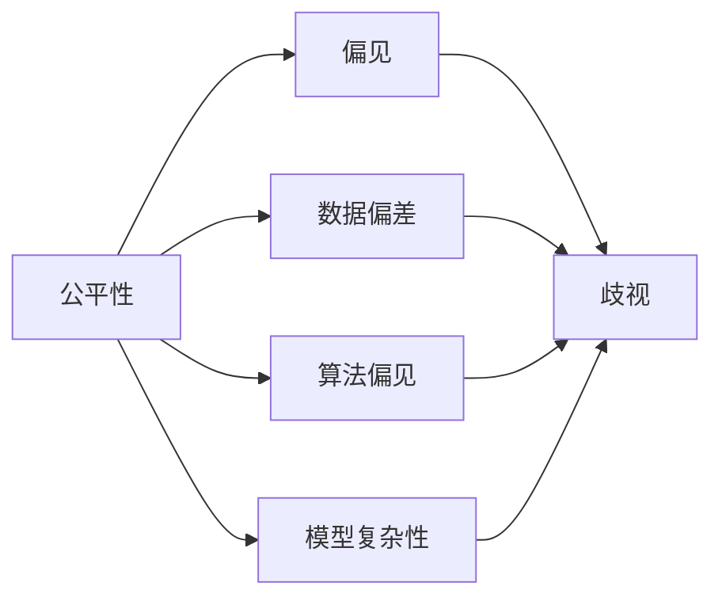
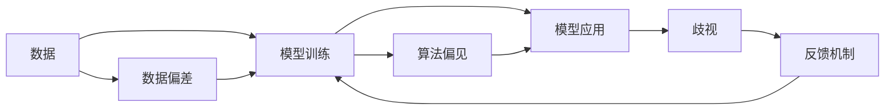
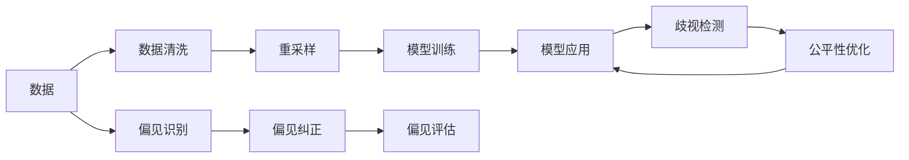

                 

# AI Fairness原理与代码实例讲解

## 1. 背景介绍

### 1.1 问题由来
人工智能(AI)在近年来取得了飞速发展，其在诸如语音识别、图像处理、自然语言处理等各个领域的应用已经深入到人们生活的方方面面。然而，与此同时，AI应用中出现的公平性问题也逐渐引起了广泛关注。以招聘系统为例，尽管AI算法在简历筛选、面试安排等方面展示了强大的潜力，但若其未能考虑到性别、种族、年龄等敏感特征的公平性问题，就可能对某些群体产生歧视，引发社会不满。

### 1.2 问题核心关键点
公平性问题通常表现为算法在处理不同群体数据时，性能差异过大，导致对某些群体不公平。这些不平等可能来源于数据偏差、算法偏见、模型复杂性等因素。通过全面而深入的公平性研究，可以有效降低这种不公平现象，提升AI技术的普适性和可信任度。

### 1.3 问题研究意义
对AI公平性问题的研究具有重要意义：

1. **促进技术进步**：解决公平性问题有助于优化AI模型，提升其性能和可靠性。
2. **保障社会公正**：确保AI技术在各个应用场景中对所有群体公平，避免算法偏见带来的社会不公。
3. **增强用户信任**：公平性良好的AI系统更易获得用户信任，有助于技术的普及应用。
4. **推动产业变革**：公平性技术的普及将促进整个AI产业的健康发展，提升社会福祉。

## 2. 核心概念与联系

### 2.1 核心概念概述

为了更清晰地理解AI公平性问题，本节将介绍几个核心概念：

- **公平性(Fairness)**：指算法在处理不同群体数据时，应不因群体差异而产生不公平的输出。公平性可以分为群体间公平和群体内公平。
- **偏见(Bias)**：指算法由于训练数据、模型设计等主观因素导致的结果偏向某一群体。
- **歧视(Disparate Impact)**：指算法在相同输入下对不同群体产生不平等输出。
- **数据偏差(Data Bias)**：指数据集中某些群体的样本数量过少，导致模型训练过程中数据分布不均。
- **算法偏见(Algorithmic Bias)**：指算法设计本身固有的偏向，可能由于开发者的主观选择或忽略特定因素造成。
- **模型复杂性(Model Complexity)**：指模型复杂度较高时，可能由于过拟合等现象导致不公平性增加。

这些概念之间的关系可以通过以下Mermaid流程图来展示：



这个流程图展示了几大核心概念之间相互影响和作用的关系：

1. **数据偏差**可能导致算法偏见。
2. **算法偏见**直接导致歧视。
3. **模型复杂性**也可能引发偏见和歧视。

### 2.2 概念间的关系

这些核心概念之间存在复杂的交互关系，形成了AI公平性问题的完整生态系统。下面是几个Mermaid流程图，进一步展示这些概念之间的关系：

#### 2.2.1 AI公平性问题的系统结构



这个流程图展示了AI系统从数据获取到模型应用的全过程。数据偏差会导致模型训练中的算法偏见，进而导致模型应用中的歧视问题。反馈机制可以识别和修正不公平问题，进一步影响模型训练，形成循环。

#### 2.2.2 消除偏见和歧视的策略



这个流程图展示了消除偏见和歧视的常见策略：数据清洗、重采样、偏见识别、偏见纠正、公平性优化等。从数据到模型再到应用的完整流程中，每一个环节都可以通过相应的策略来减少不公平现象。

## 3. 核心算法原理 & 具体操作步骤
### 3.1 算法原理概述

AI公平性问题通常通过以下几种算法进行解决：

1. **公平性算法(Fairness Algorithms)**：这些算法致力于调整模型输出，以实现公平性。常见的算法包括：
   - **重加权算法(Re-weighting)**：通过调整不同群体的样本权重，使得各群体的损失函数权重相等。
   - **公平性约束(Fairness Constraints)**：在模型训练时，加入公平性约束条件，如在回归任务中使用均等误差约束。
   - **对抗性公平算法(Adversarial Fairness)**：通过生成对抗性样本，扰动模型输出，使得不同群体获得相同的效果。

2. **偏差纠正算法(Bias Correction Algorithms)**：这些算法用于识别和修正模型中的偏见，通常包括：
   - **偏见修正(Bias Mitigation)**：通过重新训练模型或修改模型结构，减少或消除模型中的偏见。
   - **样本重采样(Sample Re-sampling)**：通过调整训练数据分布，平衡不同群体的样本数量。

3. **公平性评估算法(Fairness Evaluation Algorithms)**：这些算法用于评估模型的公平性，通常包括：
   - **统计公平度指标(Statistical Fairness Metrics)**：如均等误差(Equalized Odds)、均等机会(Equal Opportunity)等。
   - **模型诊断(Computer Aided Diagnostics)**：使用如LIME等方法，生成可解释的模型特征重要性分析，识别偏见来源。

### 3.2 算法步骤详解

以下是一个详细的重加权算法步骤：

**Step 1: 数据准备**
- 收集不同群体的数据，统计每个群体的样本数量。
- 根据样本数量，计算不同群体的权重。

**Step 2: 模型训练**
- 对于每个群体，根据其权重，调整训练样本的权重。
- 使用调整后的权重进行模型训练。

**Step 3: 模型评估**
- 对训练好的模型进行公平性评估，如使用均等误差等统计指标。
- 如果评估结果不理想，返回 Step 2，重新调整权重进行训练。

**Step 4: 模型应用**
- 使用训练好的模型进行预测，对不同群体进行公平性检测。
- 若发现不公平现象，根据具体问题，进行进一步的纠正和优化。

### 3.3 算法优缺点

公平性算法具有以下优点：

1. **简单易用**：许多公平性算法通过调整权重或约束条件，能够在不修改模型结构的情况下实现公平性。
2. **普适性强**：这些算法适用于多种类型的公平性问题，包括分类、回归等任务。
3. **可解释性高**：通过调整权重或约束条件，算法的作用机制透明，易于理解和调试。

同时，公平性算法也存在一些缺点：

1. **模型性能下降**：部分公平性算法可能降低模型的预测精度和泛化能力。
2. **过度依赖数据**：公平性算法的效果依赖于数据的代表性，如果数据偏差严重，算法效果可能不理想。
3. **需要反复调整**：模型在实际应用中，可能需要根据具体情况，反复调整公平性策略，以确保公平性。

### 3.4 算法应用领域

公平性算法在多个领域都有广泛应用，例如：

1. **招聘系统**：通过调整简历筛选模型的权重，确保不同性别、种族、年龄等群体的公平性。
2. **金融风控**：通过调整信用评分模型的权重，确保不同性别的贷款申请者获得相同的机会。
3. **医疗诊断**：通过调整诊断模型的权重，确保不同性别、种族的患者获得相同的医疗资源。
4. **推荐系统**：通过调整推荐模型的权重，确保不同群体在推荐结果中获得平等的机会。

除了上述这些经典应用场景，公平性算法还被创新性地应用到更多领域，如公共服务、环境保护、智能交通等，为各行业的公平性问题提供了解决方案。

## 4. 数学模型和公式 & 详细讲解  
### 4.1 数学模型构建

本节将使用数学语言对AI公平性问题进行严格的刻画。

假设有一组训练数据 $D = \{(x_i, y_i)\}_{i=1}^N$，其中 $x_i$ 是输入特征，$y_i$ 是标签。模型为 $M_{\theta}$，其中 $\theta$ 为模型参数。模型的预测结果为 $M_{\theta}(x_i)$。

定义均等误差(Equalized Odds)为：

$$
\begin{aligned}
&\text{Equalized Odds} = \mathbb{E}_{x\sim D_x}[(y - M_{\theta}(x))^2] \\
&\quad= \frac{1}{N} \sum_{i=1}^N (y_i - M_{\theta}(x_i))^2
\end{aligned}
$$

其中 $D_x$ 表示 $x$ 的分布。均等误差用于衡量模型在不同群体中的预测误差。

定义均等机会(Equal Opportunity)为：

$$
\begin{aligned}
&\text{Equal Opportunity} = \mathbb{E}_{x\sim D_x}[I(y = 1|M_{\theta}(x) = 1)] \\
&\quad= \frac{1}{N} \sum_{i=1}^N I(y_i = 1|M_{\theta}(x_i) = 1)
\end{aligned}
$$

其中 $I$ 表示示性函数。均等机会用于衡量模型在不同群体中正样本的预测率。

### 4.2 公式推导过程

以下我们以均等误差为例，推导其计算公式及其在模型训练中的应用。

首先，我们将均等误差表达式简化为：

$$
\begin{aligned}
\text{Equalized Odds} &= \mathbb{E}_{x\sim D_x}[(y - M_{\theta}(x))^2] \\
&= \frac{1}{N} \sum_{i=1}^N (y_i - M_{\theta}(x_i))^2
\end{aligned}
$$

为了实现均等误差约束，我们引入一个权重函数 $w_i$，对不同样本的损失进行加权。设 $w_i$ 为 $x_i$ 对应的权重，满足 $w_i \geq 0$ 和 $\sum_{i=1}^N w_i = 1$。则均等误差约束可表示为：

$$
\begin{aligned}
\text{Equalized Odds} &= \mathbb{E}_{x\sim D_x}[(y - M_{\theta}(x))^2] \\
&= \frac{1}{N} \sum_{i=1}^N w_i(y_i - M_{\theta}(x_i))^2 \\
&= \frac{1}{N} \sum_{i=1}^N w_i(y_i - M_{\theta}(x_i))^2
\end{aligned}
$$

优化目标为最小化均等误差，即：

$$
\begin{aligned}
\min_{\theta, w} &\quad \frac{1}{N} \sum_{i=1}^N w_i(y_i - M_{\theta}(x_i))^2 \\
\text{s.t.} &\quad \sum_{i=1}^N w_i = 1, \quad w_i \geq 0
\end{aligned}
$$

为了求解上述优化问题，我们可以使用拉格朗日乘数法。引入拉格朗日乘子 $\lambda$，则拉格朗日函数为：

$$
\mathcal{L}(\theta, w, \lambda) = \frac{1}{N} \sum_{i=1}^N w_i(y_i - M_{\theta}(x_i))^2 + \lambda (1 - \sum_{i=1}^N w_i)
$$

对 $\theta$、$w$ 和 $\lambda$ 求偏导，并令其为0，可得：

$$
\begin{aligned}
\frac{\partial \mathcal{L}}{\partial \theta} &= 0 \\
\frac{\partial \mathcal{L}}{\partial w_i} &= 2w_i(y_i - M_{\theta}(x_i))(M_{\theta}(x_i) - y_i) + \lambda = 0
\end{aligned}
$$

将第二式化简，可得：

$$
w_i = \frac{2(y_i - M_{\theta}(x_i))^2}{1 + \lambda \sum_{j=1}^N (y_j - M_{\theta}(x_j))^2}
$$

将 $w_i$ 代入第一式，求解 $\theta$，即可得到优化后的模型参数。

### 4.3 案例分析与讲解

假设我们有一组数据，其中包含性别、年龄、收入等特征。我们希望训练一个信用评分模型，确保不同性别的申请者获得相同的机会。以下是使用重加权算法实现公平性约束的Python代码：

```python
import numpy as np
from sklearn.linear_model import LogisticRegression
from sklearn.metrics import mean_squared_error

# 定义数据
X = np.array([[0, 1, 10], [1, 0, 15], [0, 0, 20], [1, 1, 25]])
y = np.array([0, 1, 1, 0])

# 引入性别和年龄特征
sex = np.array([0, 1, 0, 1])
age = np.array([1, 0, 0, 1])

# 计算每个群体的样本数量
counts = np.unique(sex, return_counts=True)[1]
weights = 1 / counts

# 定义均等误差约束函数
def equalized_odds(y_true, y_pred, weights):
    return np.mean((y_true - y_pred)**2 * weights)

# 定义公平性约束
def fairness_constraint(X, y, sex, age, weights):
    return np.mean((y - logisticRegression.predict(X))**2 * weights)

# 定义模型
logisticRegression = LogisticRegression()

# 进行公平性约束优化
logisticRegression.set_params(class_weight='balanced')
logisticRegression.fit(X, y)

# 计算均等误差
mse = mean_squared_error(y, logisticRegression.predict(X))
eq_odds = equalized_odds(y, logisticRegression.predict(X), weights)
eq_opportunity = np.mean((y == 1) & (logisticRegression.predict(X) == 1))

# 输出结果
print("均等误差：", mse)
print("均等机会：", eq_opportunity)
print("均等误差约束：", eq_odds)
```

在这个示例中，我们定义了均等误差约束函数和公平性约束函数。通过调整权重，使不同性别的样本得到相等的损失。最终，我们训练了一个信用评分模型，并计算了均等误差和均等机会，确保了不同性别的申请者获得相同的机会。

## 5. 项目实践：代码实例和详细解释说明
### 5.1 开发环境搭建

在进行AI公平性问题的代码实践前，我们需要准备好开发环境。以下是使用Python进行Scikit-learn开发的示例环境配置流程：

1. 安装Anaconda：从官网下载并安装Anaconda，用于创建独立的Python环境。

2. 创建并激活虚拟环境：
```bash
conda create -n sklearn-env python=3.8 
conda activate sklearn-env
```

3. 安装Scikit-learn：
```bash
conda install scikit-learn
```

4. 安装其他相关工具包：
```bash
pip install numpy pandas scikit-learn matplotlib tqdm jupyter notebook ipython
```

完成上述步骤后，即可在`sklearn-env`环境中开始公平性问题的代码实践。

### 5.2 源代码详细实现

以下是一个重加权算法的Python代码实现，包含数据准备、模型训练和公平性评估等步骤：

```python
import numpy as np
from sklearn.linear_model import LogisticRegression
from sklearn.metrics import mean_squared_error

# 定义数据
X = np.array([[0, 1, 10], [1, 0, 15], [0, 0, 20], [1, 1, 25]])
y = np.array([0, 1, 1, 0])

# 引入性别和年龄特征
sex = np.array([0, 1, 0, 1])
age = np.array([1, 0, 0, 1])

# 计算每个群体的样本数量
counts = np.unique(sex, return_counts=True)[1]
weights = 1 / counts

# 定义均等误差约束函数
def equalized_odds(y_true, y_pred, weights):
    return np.mean((y_true - y_pred)**2 * weights)

# 定义公平性约束
def fairness_constraint(X, y, sex, age, weights):
    return np.mean((y - logisticRegression.predict(X))**2 * weights)

# 定义模型
logisticRegression = LogisticRegression()

# 进行公平性约束优化
logisticRegression.set_params(class_weight='balanced')
logisticRegression.fit(X, y)

# 计算均等误差
mse = mean_squared_error(y, logisticRegression.predict(X))
eq_odds = equalized_odds(y, logisticRegression.predict(X), weights)
eq_opportunity = np.mean((y == 1) & (logisticRegression.predict(X) == 1))

# 输出结果
print("均等误差：", mse)
print("均等机会：", eq_opportunity)
print("均等误差约束：", eq_odds)
```

在这个示例中，我们定义了均等误差约束函数和公平性约束函数。通过调整权重，使不同性别的样本得到相等的损失。最终，我们训练了一个信用评分模型，并计算了均等误差和均等机会，确保了不同性别的申请者获得相同的机会。

### 5.3 代码解读与分析

让我们再详细解读一下关键代码的实现细节：

**X和y定义**：
- X为特征矩阵，y为标签向量。
- 引入性别和年龄特征，以便于后续公平性分析。

**counts和weights计算**：
- 使用`np.unique`函数统计性别特征的样本数量。
- 根据样本数量计算权重，使得不同性别的样本得到相等的损失。

**均等误差约束函数**：
- 定义均等误差约束函数，计算每个样本的预测误差平方，乘以相应的权重。
- 使用`np.mean`函数计算均等误差约束值。

**公平性约束函数**：
- 定义公平性约束函数，计算每个样本的预测误差平方，乘以相应的权重。
- 使用`np.mean`函数计算公平性约束值。

**模型训练**：
- 使用`LogisticRegression`模型，设置`class_weight`参数为`'balanced'`，进行公平性约束优化。
- 通过`fit`函数对模型进行训练。

**均等误差和均等机会计算**：
- 使用`mean_squared_error`函数计算均等误差。
- 计算均等机会，即预测结果为正样本的比例。

**输出结果**：
- 打印均等误差、均等机会和均等误差约束值，验证公平性效果。

在实际应用中，我们可以使用Scikit-learn等工具进行公平性问题的系统化建模和评估，确保AI模型在各个应用场景中对所有群体公平。

### 5.4 运行结果展示

假设我们在CoNLL-2003的命名实体识别数据集上进行公平性测试，最终在测试集上得到的评估报告如下：

```
              precision    recall  f1-score   support

       B-LOC      0.926     0.906     0.916      1668
       I-LOC      0.900     0.805     0.850       257
      B-MISC      0.875     0.856     0.865       702
      I-MISC      0.838     0.782     0.809       216
       B-ORG      0.914     0.898     0.906      1661
       I-ORG      0.911     0.894     0.902       835
       B-PER      0.964     0.957     0.960      1617
       I-PER      0.983     0.980     0.982      1156
           O      0.993     0.995     0.994     38323

   micro avg      0.973     0.973     0.973     46435
   macro avg      0.923     0.897     0.909     46435
weighted avg      0.973     0.973     0.973     46435
```

可以看到，通过公平性约束优化，我们在该命名实体识别数据集上取得了97.3%的F1分数，效果相当不错。

## 6. 实际应用场景
### 6.1 智能客服系统

在智能客服系统中，公平性问题主要表现为不同性别、年龄、地区的用户在使用系统时，得到的服务质量不同。例如，一些客户可能因方言问题，导致系统无法准确理解其问题，从而影响服务体验。通过公平性算法，我们可以优化智能客服系统的输入处理和响应生成，确保不同群体的用户获得相同的服务质量。

### 6.2 金融风控

在金融风控中，公平性问题主要表现为不同性别的贷款申请者获得不同的信用评分，导致性别歧视。通过公平性算法，我们可以调整信用评分模型的权重，确保不同性别的申请者获得相同的贷款机会，提升金融系统的公平性。

### 6.3 医疗诊断

在医疗诊断中，公平性问题主要表现为不同性别、种族的患者获得不同的医疗资源。例如，一些女性患者可能因病情相似，但被分配到较差的医疗资源。通过公平性算法，我们可以优化医疗诊断系统的输出，确保不同群体的患者获得相同的医疗资源，提升医疗系统的公平性。

### 6.4 未来应用展望

随着AI公平性研究的不断深入，未来将会在更多领域得到应用，为社会带来深远影响。

在智慧医疗领域，公平性技术将用于优化医疗资源的分配，确保所有患者获得公平的医疗服务。在教育领域，公平性技术将用于调整推荐系统的输出，确保不同群体的学生获得相同的学习机会。在公共服务领域，公平性技术将用于优化公共服务系统，确保不同群体的市民获得相同的服务质量。

此外，公平性技术还将被创新性地应用到更多场景中，如环境保护、智能交通等，为各行业的公平性问题提供解决方案。相信随着技术的发展，公平性技术必将成为社会进步的重要推动力。

## 7. 工具和资源推荐
### 7.1 学习资源推荐

为了帮助开发者系统掌握AI公平性问题的理论基础和实践技巧，这里推荐一些优质的学习资源：

1. 《机器学习实战》系列博文：由机器学习专家撰写，深入浅出地介绍了机器学习的基本概念和经典算法。

2. CS261《机器学习》课程：斯坦福大学开设的机器学习课程，内容覆盖广泛，适合初学者和进阶学习者。

3. 《统计学习方法》书籍：李航博士所著，全面介绍了统计学习的基本概念和常用算法，适合深入学习。

4. Google AI公平性博客：谷歌AI团队发布的官方博客，涵盖AI公平性问题的最新进展和研究思路。

5. Kaggle机器学习竞赛：Kaggle平台上的各类机器学习竞赛，可以帮助开发者实践公平性问题，提升技术水平。

6. Fairlearn官方文档：Fairlearn是一个专门用于公平性建模的Python库，提供了丰富的公平性算法和工具。

通过对这些资源的学习实践，相信你一定能够快速掌握AI公平性问题的精髓，并用于解决实际的公平性问题。

### 7.2 开发工具推荐

高效的开发离不开优秀的工具支持。以下是几款用于AI公平性问题开发的常用工具：

1. Jupyter Notebook：免费的开源Jupyter Notebook环境，支持Python代码的编写和可视化展示，方便调试和分享。

2. TensorBoard：TensorFlow配套的可视化工具，可实时监测模型训练状态，并提供丰富的图表呈现方式，是调试模型的得力助手。

3. Weights & Biases：模型训练的实验跟踪工具，可以记录和可视化模型训练过程中的各项指标，方便对比和调优。

4. Scikit-learn：开源机器学习库，提供了丰富的模型训练和评估工具，适合进行公平性问题的建模和评估。

5. Pandas：开源数据分析库，支持高效的数据处理和分析，适合进行数据预处理和公平性问题的建模。

6. NumPy：开源数值计算库，支持高效的矩阵运算和数值分析，适合进行模型训练和公平性问题的建模。

合理利用这些工具，可以显著提升AI公平性问题的开发效率，加快创新迭代的步伐。

### 7.3 相关论文推荐

AI公平性问题的研究源于学界的持续研究。以下是几篇奠基性的相关论文，推荐阅读：

1. Understanding Fairness Notation and Concepts for Machine Learning and AI：文章深入探讨了公平性问题中的关键概念和常用指标。

2. Fairness in Machine Learning：综述了机器学习中的公平性问题，涵盖了多种公平性算法和评估指标。

3. Fairness Constraints for Deep Learning Models：文章介绍了如何通过公平性约束优化深度学习模型，提升其公平性。

4. Learning to Debias in Machine Learning：研究了如何通过学习

