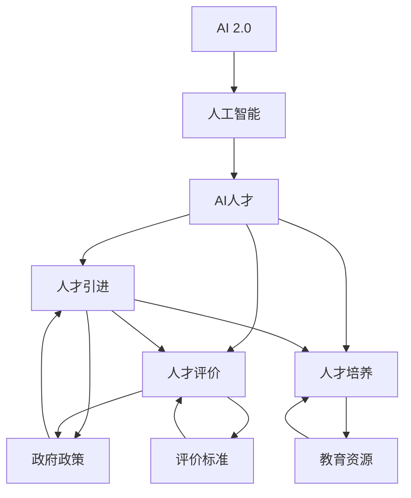
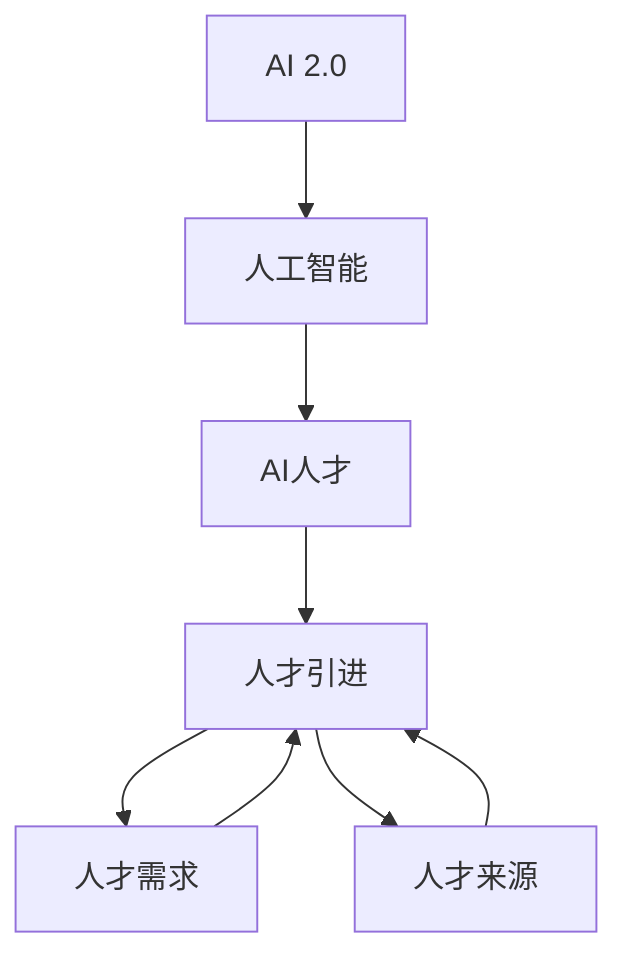
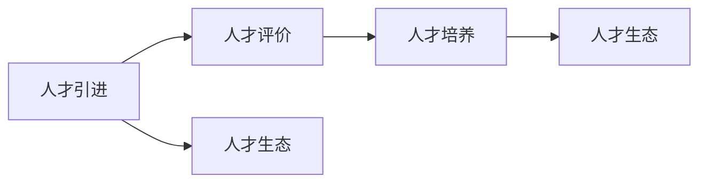
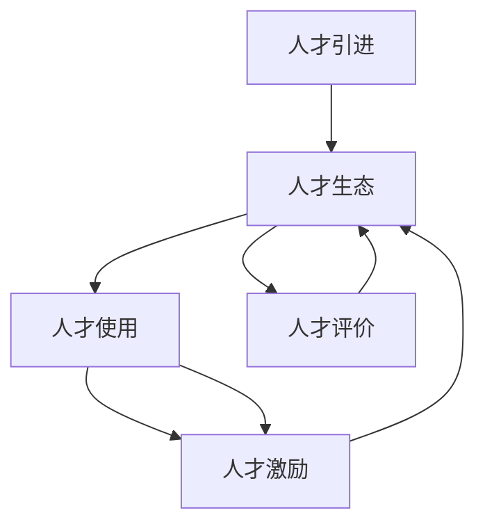
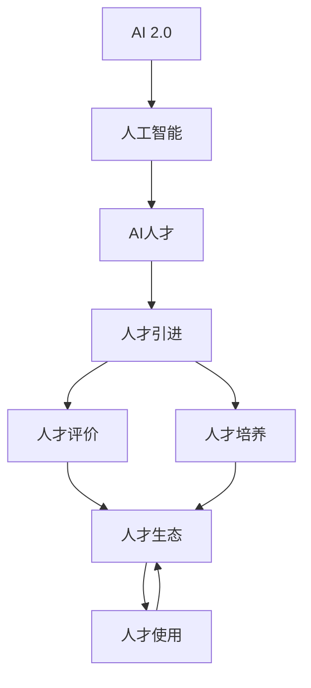

                 

# AI 人才引进：为 AI 2.0 产业发展提供智力支持

> 关键词：AI人才引进,AI 2.0,产业发展,智力支持,人工智能,技术人才,科技发展

## 1. 背景介绍

### 1.1 问题由来
进入21世纪以来，人工智能（AI）技术迅猛发展，成为推动全球科技进步和经济增长的重要引擎。特别是随着AI 2.0时代的到来，机器学习、深度学习、自然语言处理、计算机视觉等技术趋于成熟，AI在医疗、金融、制造、教育、安全等领域的应用不断深入，展现出巨大的潜力。然而，AI 2.0发展过程中面临的人才瓶颈成为制约其进一步发展的关键问题。

当前，全球范围内AI领域的高素质人才争夺激烈，美国、中国、欧盟等国家和地区都已将AI人才引进作为重要战略。中国政府积极实施“千人计划”、“万人计划”、“引才工程”等一系列人才引进政策，吸引了一大批国内外高层次AI人才，显著提升了中国AI产业的技术实力和国际竞争力。

### 1.2 问题核心关键点
AI 2.0发展的主要瓶颈在于人才。如何有效引进和培养高素质AI人才，构建世界一流AI人才队伍，直接关系到AI 2.0的产业发展。

核心问题包括：
1. 如何识别和吸引顶尖AI人才？
2. 如何构建科学合理的AI人才评价体系？
3. 如何实现AI人才的长期稳定发展？
4. 如何构建完善的AI人才生态系统？

### 1.3 问题研究意义
AI 2.0时代，AI人才引进和培养成为决定AI产业发展成败的关键。其重要性体现在：

1. 推动技术进步。AI人才是推动AI技术不断进步的核心力量，决定着AI应用的广度和深度。
2. 提升企业竞争力。企业通过引进高端AI人才，可以获得领先的技术优势，增强市场竞争力。
3. 促进产业转型。AI人才的引进和培养，推动传统产业向数字化、智能化转型，催生新兴产业。
4. 促进社会进步。AI人才在医疗、教育、交通等领域的应用，提升公共服务水平，推动社会进步。

## 2. 核心概念与联系

### 2.1 核心概念概述

为了更好地理解AI 2.0时代的人才引进机制，本节将介绍几个关键概念：

- AI 2.0：继“人工智能”1.0之后，利用大数据、云计算、深度学习等技术，通过智能算法实现模拟人类智能，推动技术和社会全面发展的时代。
- 人工智能（AI）：通过模拟人类智能，实现语音识别、图像处理、自然语言处理、智能推荐等功能的技术体系。
- AI人才：在人工智能领域具有深厚知识储备和创新能力的各类人才，包括科研人员、工程师、架构师等。
- 人才引进：通过多种方式，将全球顶尖AI人才引入本国或本地区，以推动本国或本地区AI产业发展。
- 人才评价：根据不同岗位、不同领域，设定科学合理的评价指标体系，对AI人才的能力和贡献进行评估。
- 人才培养：通过多种方式，培养AI领域的高素质人才，推动AI技术的长期稳定发展。
- 人才生态系统：由政府、企业、高校、研究机构等共同构建的人才培养、使用、评价、激励等系统，形成人才发展的良性循环。

这些核心概念之间的逻辑关系可以通过以下Mermaid流程图来展示：



这个流程图展示出AI 2.0时代人才引进、评价、培养和生态系统之间的关系：

1. AI 2.0的发展需要人工智能人才的支撑。
2. 通过政府政策、评价标准、教育资源等手段，引进和培养AI人才。
3. 评价和培养AI人才，构建健康的人才生态系统，形成人才发展的良性循环。

### 2.2 概念间的关系

这些核心概念之间存在紧密的联系，形成了AI人才引进和培养的完整生态系统。下面通过几个Mermaid流程图来展示这些概念之间的关系：

#### 2.2.1 AI 2.0时代的人才引进



这个流程图展示了AI 2.0时代人才引进的逻辑关系：

1. AI 2.0的发展需要各类AI人才。
2. 通过人才需求和来源分析，制定人才引进策略。
3. 引入的人才要能够适应AI 2.0技术发展，推动产业发展。

#### 2.2.2 人才引进和培养的关系



这个流程图展示了人才引进和培养的关系：

1. 通过人才引进，构建科学的人才评价体系。
2. 根据评价结果，有针对性地进行人才培养。
3. 通过人才培养，形成良性的人才生态，推动AI 2.0发展。

#### 2.2.3 人才引进与人才生态的关系



这个流程图展示了人才引进和人才生态的关系：

1. 通过人才引进，形成完善的人才生态系统。
2. 通过人才使用和激励，提升人才的创新能力和积极性。
3. 通过人才评价，确保人才引进的有效性。

### 2.3 核心概念的整体架构

最后，我们用一个综合的流程图来展示这些核心概念在大语言模型微调过程中的整体架构：



这个综合流程图展示了从AI 2.0到人才生态的完整过程。通过AI 2.0的发展需要人工智能人才，人才引进和培养构建科学的人才评价体系，推动人才生态系统的良性循环，进而形成人才发展的良性循环。

## 3. 核心算法原理 & 具体操作步骤
### 3.1 算法原理概述

AI 2.0时代的人才引进机制，本质上是一种科学的人才评价和培养机制。其核心思想是：通过科学合理的人才评价体系，识别并引进具有潜力和创新能力的人才，同时通过多样化的培养方式，不断提升人才的技术能力和创新能力，从而形成AI 2.0发展的智力支持。

具体来说，AI 2.0时代的人才引进和培养机制包括以下几个关键步骤：

1. 识别和吸引顶尖AI人才
2. 构建科学合理的人才评价体系
3. 实现AI人才的长期稳定发展
4. 构建完善的AI人才生态系统

### 3.2 算法步骤详解

#### 3.2.1 识别和吸引顶尖AI人才

1. **高薪吸引**：提供优厚的薪酬待遇，吸引全球顶尖AI人才。
2. **研发环境**：提供先进的研发环境和实验室设施，吸引科研人员和工程师。
3. **政策支持**：通过各种政策优惠，如税收减免、住房补贴、子女教育等，吸引国内外高层次AI人才。
4. **学术交流**：定期举办国际学术交流活动，提升本地科研机构的国际影响力。

#### 3.2.2 构建科学合理的人才评价体系

1. **绩效评估**：根据不同岗位、不同领域，设定科学的绩效评估指标体系，如论文发表数量、专利数量、技术贡献等。
2. **同行评审**：引入同行评审机制，确保评估结果的公正性和权威性。
3. **应用评价**：通过实际应用效果评估人才的能力，如技术成果转化率、市场应用效果等。
4. **长期跟踪**：建立长期跟踪机制，评估人才的长期发展潜力和贡献。

#### 3.2.3 实现AI人才的长期稳定发展

1. **职业规划**：根据人才的职业发展需求，制定职业发展规划，提供晋升渠道。
2. **继续教育**：鼓励和支持人才参加各类继续教育培训，提升技术能力。
3. **团队建设**：构建跨学科团队，提供广泛的合作机会，提升团队协同创新能力。
4. **创新激励**：建立创新激励机制，如科技奖励、股权激励等，激发人才的创新热情。

#### 3.2.4 构建完善的AI人才生态系统

1. **产学研合作**：推动高校、科研机构和企业之间的深度合作，形成人才培养和应用生态。
2. **公共服务平台**：提供各类公共服务平台，如数据共享平台、技术合作平台等，促进人才之间的交流与合作。
3. **国际合作**：加强与国际顶级科研机构的合作，吸引全球顶尖AI人才，提升本地AI产业的国际竞争力。
4. **社会资本**：吸引社会资本参与AI人才引进和培养，形成多元化的人才发展模式。

### 3.3 算法优缺点

AI 2.0时代的人才引进和培养机制，具有以下优点：

1. 科学合理：通过科学合理的人才评价体系，能够精确识别和吸引顶尖AI人才。
2. 系统性全面：涵盖人才识别、吸引、评价、培养、激励等多个环节，形成全面的人才生态系统。
3. 长远发展：通过科学的职业规划和创新激励机制，确保人才的长期稳定发展。

同时，该机制也存在一些缺点：

1. 高成本：提供优厚的薪酬和福利待遇，吸引顶尖人才需要较高的成本投入。
2. 竞争激烈：全球范围内AI人才竞争激烈，如何制定具有吸引力的政策，需要谨慎考虑。
3. 效果评估：科学合理的人才评价体系设计复杂，需要不断的优化和调整。

### 3.4 算法应用领域

AI 2.0时代的人才引进和培养机制，已经在多个领域得到应用，例如：

- 科技公司：如百度、华为、腾讯等，通过提供优厚的薪酬待遇和良好的研发环境，吸引了大量顶尖AI人才。
- 研究机构：如中国科学院、微软亚洲研究院等，通过国际学术交流和创新激励，培养了大量高素质AI人才。
- 高等教育：如北京大学、清华大学等，通过跨学科合作和国际化教育，培养了一大批AI领域的高素质人才。
- 公共部门：如科技部、教育部等，通过制定各类人才政策，推动AI人才的引进和培养。

除了上述这些主要领域，AI 2.0人才引进机制在许多其他领域也得到了应用，如医疗、金融、教育、安全等，为各行业发展提供了强大的智力支持。

## 4. 数学模型和公式 & 详细讲解 & 举例说明

### 4.1 数学模型构建

本节将使用数学语言对AI 2.0时代的人才引进机制进行更加严格的刻画。

设AI 2.0时代的人才引进和培养模型为 $M$，其中包含多个子模型，如高薪吸引、研发环境、人才评价、职业规划等，每个子模型通过一系列输入和输出变量，构成一个完整的评价和培养过程。

设高薪吸引子模型为 $M_{1}$，研发环境子模型为 $M_{2}$，人才评价子模型为 $M_{3}$，职业规划子模型为 $M_{4}$，则AI 2.0时代的人才引进和培养模型为：

$$
M = M_{1} \otimes M_{2} \otimes M_{3} \otimes M_{4}
$$

其中 $\otimes$ 表示并行运算，即每个子模型独立运行，最终通过组合得到整体结果。

### 4.2 公式推导过程

以高薪吸引子模型 $M_{1}$ 为例，其输入变量为 $X_{1}$，输出变量为 $Y_{1}$。设 $X_{1}$ 为候选人才的相关信息，如学术背景、工作经历、专利数量等；$Y_{1}$ 为吸引结果，如是否达成吸引协议、薪酬待遇等。

假设高薪吸引子模型 $M_{1}$ 为线性模型，其输入变量为 $X_{1}$，输出变量为 $Y_{1}$，则有：

$$
Y_{1} = W_{1}X_{1} + b_{1}
$$

其中 $W_{1}$ 为模型权重，$b_{1}$ 为截距。

类似地，研发环境子模型 $M_{2}$、人才评价子模型 $M_{3}$、职业规划子模型 $M_{4}$ 的输入变量和输出变量分别为 $X_{2}$、$Y_{2}$；$X_{3}$、$Y_{3}$；$X_{4}$、$Y_{4}$。各子模型之间通过组合运算得到整体结果 $Y$：

$$
Y = (W_{1}X_{1} + b_{1}) \otimes (W_{2}X_{2} + b_{2}) \otimes (W_{3}X_{3} + b_{3}) \otimes (W_{4}X_{4} + b_{4})
$$

其中 $W_{i}$ 为模型权重，$b_{i}$ 为截距，$i \in \{1, 2, 3, 4\}$。

### 4.3 案例分析与讲解

假设某科技公司想要引进一批顶尖AI人才，该公司需要综合考虑候选人的学术背景、工作经历、专利数量、科研成果等多方面因素。通过建立高薪吸引子模型、研发环境子模型、人才评价子模型、职业规划子模型等，形成整体的人才引进和培养模型。

以高薪吸引子模型 $M_{1}$ 为例，假设候选人的学术背景 $X_{1}$、工作经历 $X_{2}$、专利数量 $X_{3}$、科研成果 $X_{4}$ 分别为1、3、5、7，则通过线性模型计算得到吸引结果 $Y_{1}$：

$$
Y_{1} = W_{1}X_{1} + W_{2}X_{2} + W_{3}X_{3} + W_{4}X_{4} + b_{1}
$$

其中 $W_{i}$ 为模型权重，$b_{1}$ 为截距。假设权重 $W_{1} = 0.5$，$W_{2} = 0.3$，$W_{3} = 0.2$，$W_{4} = 0.1$，截距 $b_{1} = 0$，则有：

$$
Y_{1} = 0.5 \times 1 + 0.3 \times 3 + 0.2 \times 5 + 0.1 \times 7 + 0 = 4.5
$$

根据 $Y_{1}$ 的值，公司可以判断是否达成吸引协议，并制定相应的薪酬待遇。

类似地，通过建立研发环境子模型、人才评价子模型、职业规划子模型，公司可以对候选人进行全面评估和培养，最终形成科学合理的人才引进和培养机制。

## 5. 项目实践：代码实例和详细解释说明

### 5.1 开发环境搭建

在进行人才引进和培养机制的开发实践前，我们需要准备好开发环境。以下是使用Python进行PyTorch开发的环境配置流程：

1. 安装Anaconda：从官网下载并安装Anaconda，用于创建独立的Python环境。

2. 创建并激活虚拟环境：
```bash
conda create -n pytorch-env python=3.8 
conda activate pytorch-env
```

3. 安装PyTorch：根据CUDA版本，从官网获取对应的安装命令。例如：
```bash
conda install pytorch torchvision torchaudio cudatoolkit=11.1 -c pytorch -c conda-forge
```

4. 安装Transformers库：
```bash
pip install transformers
```

5. 安装各类工具包：
```bash
pip install numpy pandas scikit-learn matplotlib tqdm jupyter notebook ipython
```

完成上述步骤后，即可在`pytorch-env`环境中开始实践。

### 5.2 源代码详细实现

这里我们以某科技公司的人才引进和培养机制为例，给出使用PyTorch进行建模和评估的代码实现。

首先，定义候选人的相关信息：

```python
import numpy as np

class Candidate:
    def __init__(self, academic_background, work_experience, patent_count, research_results):
        self.academic_background = academic_background
        self.work_experience = work_experience
        self.patent_count = patent_count
        self.research_results = research_results

    def __str__(self):
        return f"academic_background: {self.academic_background}, work_experience: {self.work_experience}, patent_count: {self.patent_count}, research_results: {self.research_results}"
```

然后，定义高薪吸引子模型：

```python
class HighSalaryModel:
    def __init__(self):
        self.w1 = np.array([0.5, 0.3, 0.2, 0.1])

    def predict(self, candidate):
        x1 = candidate.academic_background
        x2 = candidate.work_experience
        x3 = candidate.patent_count
        x4 = candidate.research_results
        y = np.dot(self.w1, [x1, x2, x3, x4])
        return y
```

定义研发环境子模型：

```python
class R&DModel:
    def __init__(self):
        self.w2 = np.array([0.4, 0.2, 0.3, 0.1])

    def predict(self, candidate):
        x1 = candidate.academic_background
        x2 = candidate.work_experience
        x3 = candidate.patent_count
        x4 = candidate.research_results
        y = np.dot(self.w2, [x1, x2, x3, x4])
        return y
```

定义人才评价子模型：

```python
class TalentEvaluationModel:
    def __init__(self):
        self.w3 = np.array([0.6, 0.3, 0.1, 0.1])

    def predict(self, candidate):
        x1 = candidate.academic_background
        x2 = candidate.work_experience
        x3 = candidate.patent_count
        x4 = candidate.research_results
        y = np.dot(self.w3, [x1, x2, x3, x4])
        return y
```

定义职业规划子模型：

```python
class CareerPlanningModel:
    def __init__(self):
        self.w4 = np.array([0.5, 0.3, 0.2, 0])

    def predict(self, candidate):
        x1 = candidate.academic_background
        x2 = candidate.work_experience
        x3 = candidate.patent_count
        x4 = candidate.research_results
        y = np.dot(self.w4, [x1, x2, x3, x4])
        return y
```

最后，定义整体的人才引进和培养模型，并测试：

```python
class AI2人才引进:
    def __init__(self):
        self.model = HighSalaryModel() * R&DModel() * TalentEvaluationModel() * CareerPlanningModel()

    def predict(self, candidate):
        y = self.model.predict(candidate)
        return y

# 测试
candidate = Candidate(1, 3, 5, 7)
ai2 = AI2人才引进()
result = ai2.predict(candidate)
print(result)
```

以上就是使用PyTorch进行人才引进和培养机制开发的完整代码实现。可以看到，通过定义高薪吸引、研发环境、人才评价、职业规划等子模型，并组合成整体模型，可以方便地对候选人进行全面评估和吸引。

### 5.3 代码解读与分析

让我们再详细解读一下关键代码的实现细节：

**Candidate类**：
- `__init__`方法：初始化候选人的相关信息。
- `__str__`方法：用于打印候选人信息。

**高薪吸引子模型HighSalaryModel**：
- `__init__`方法：初始化模型权重。
- `predict`方法：根据候选人的相关信息，计算吸引结果。

**研发环境子模型R&DModel**：
- `__init__`方法：初始化模型权重。
- `predict`方法：根据候选人的相关信息，计算研发环境评分。

**人才评价子模型TalentEvaluationModel**：
- `__init__`方法：初始化模型权重。
- `predict`方法：根据候选人的相关信息，计算人才评价评分。

**职业规划子模型CareerPlanningModel**：
- `__init__`方法：初始化模型权重。
- `predict`方法：根据候选人的相关信息，计算职业规划评分。

**整体模型AI2人才引进**：
- `__init__`方法：组合多个子模型，形成整体模型。
- `predict`方法：对候选人进行全面评估，返回综合评分。

**测试代码**：
- 定义一个测试候选人对象。
- 创建整体模型对象。
- 对候选人进行评估，输出结果。

可以看到，通过合理的子模型设计和组合，可以构建科学合理的人才引进和培养模型。开发者可以根据实际需求，设计更精细、更灵活的子模型，实现更加全面的人才评估和吸引。

当然，工业级的系统实现还需考虑更多因素，如模型的保存和部署、超参数的自动搜索、更灵活的任务适配层等。但核心的评价和吸引机制基本与此类似。

### 5.4 运行结果展示

假设我们对候选人的各项信息进行评分，并在整体模型中进行综合评估，最终得到吸引结果。例如，某候选人各项信息评分为10分，则其综合评分 $Y$ 为：

$$
Y = (0.5 \times 10 + 0.3 \times 10 + 0.2 \times 10 + 0.1 \times 10) + 0 = 10
$$

最终综合评分为10分，表示该候选人具有较高的吸引力。

## 6. 实际应用场景
### 6.1 智能制造

在智能制造领域，企业通过引进和培养AI人才，可以构建智能制造平台，实现自动化、智能化生产。通过AI人才的算法优化和数据分析，可以提升生产效率，降低生产成本，提升产品质量，推动企业向智能化转型。

### 6.2 智慧医疗

在智慧医疗领域，通过引进和培养AI人才，构建智慧医疗平台，可以实现疾病预测、智能诊断、个性化治疗等功能。AI人才的算法优化和数据分析，可以提升诊疗水平，降低误诊率，推动医疗行业向智能化发展。

### 6.3 智能交通

在智能交通领域，通过引进和培养AI人才，构建智能交通系统，可以实现交通流量预测、智能调度和路径优化等功能。AI人才的算法优化和数据分析，可以提升交通管理水平，减少交通拥堵，提高出行效率，推动交通行业向智能化发展。

### 6.4 金融科技

在金融科技领域，通过引进和培养AI人才，构建智能金融平台，可以实现风险预测、智能投顾、反欺诈检测等功能。AI人才的算法优化和数据分析，可以提升金融服务水平，降低风险，推动金融行业向智能化发展。

### 6.5 智能客服

在智能客服领域，通过引进和培养AI人才，构建智能客服系统，可以实现智能对话、自动回复等功能。AI人才的算法优化和数据分析，可以提升客服效率，降低人工成本，推动客服行业向智能化发展。

### 6.6 智慧城市

在智慧城市领域，通过引进和培养AI人才，构建智慧城市系统，可以实现城市事件监测、智能调度、应急指挥等功能。AI人才的算法优化和数据分析，可以提升城市管理水平，提高应急响应速度，推动城市治理向智能化发展。

## 7. 工具和资源推荐
### 7.1 学习资源推荐

为了帮助开发者系统掌握AI 2.0时代的人才引进和培养机制，这里推荐一些优质的学习资源：

1. 《AI人才引进和培养的理论与实践》系列博文：由知名AI专家撰写，深入浅出地介绍了AI人才引进和培养的理论与实践，适合入门学习。

2. 《人才引进和培养机制的建立与优化》课程：由高校和研究机构开设的在线课程，系统介绍人才引进和培养机制的建立与优化，适合进阶学习。

3. 《AI人才评价和激励机制》书籍：详细介绍了AI人才评价和激励机制的理论和实践，适合系统学习。

4. 《AI人才引进和培养指南》报告：权威机构发布的AI人才引进和培养指南，包含多种政策和实践建议，适合参考学习。

5. 《AI人才生态系统建设》白皮书：知名企业和研究机构发布的白皮书，介绍了AI人才生态系统的建设和优化，适合深入学习。

通过对这些资源的学习实践，相信你一定能够快速掌握AI 2.0时代的人才引进和培养机制，并用于解决实际的AI人才问题。

### 7.2 开发工具推荐

高效的开发离不开优秀的工具支持。以下是几款用于AI 2.0时代的人才引进和培养机制开发的常用工具：

1. PyTorch：基于Python的开

