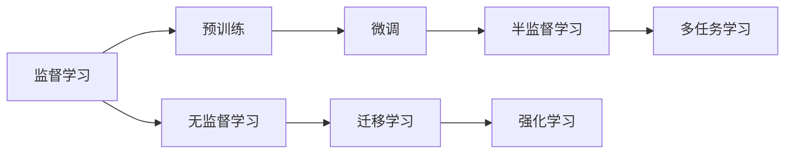

                 

# AI 大模型创业：如何利用人才优势？

在当今的AI领域，大模型已经成为各大公司竞争的关键资源。无论是巨头如Google、Microsoft、Amazon，还是初创企业，都争相构建具有强大语义理解能力的AI大模型，力求在NLP、CV、Recommendation System等领域获得优势。人才，是构建这些大模型的核心要素。那么，如何在AI大模型创业中充分利用人才优势，成为竞争的胜者呢？本文将从以下几个方面详细阐述。

## 1. 背景介绍

### 1.1 大模型概念

大模型（Large Models）是指拥有海量参数（数十亿甚至百亿级别）的深度神经网络模型，其核心特点是对大规模数据集进行自我学习，具备强大的泛化能力。大模型的出现，得益于计算能力的进步和大量无标签数据的积累。以BERT、GPT系列、DALL·E、CLIP为代表的AI大模型，已经在自然语言处理（NLP）、计算机视觉（CV）、推荐系统（Recommendation System）等领域取得了突破性进展。

### 1.2 人才的重要性

AI大模型的构建和训练，不仅仅是算力和数据的较量，更是对人才的巨大需求。一个高效的AI模型需要多领域的专家协同工作，从数据处理、模型设计到算法优化、硬件部署等各个环节，都需要高度专业化和团队协作。以下是AI大模型创业中，人才优势的具体表现：

- **技术人才**：包括算法工程师、数据科学家、软件工程师等，负责模型构建、优化、训练等核心技术工作。
- **业务专家**：如市场营销、销售、运营等人员，负责将AI模型转化为可行的业务应用。
- **跨领域专家**：如医生、律师、教师等，负责提供行业知识，协助优化模型以适应特定领域的实际需求。

## 2. 核心概念与联系

### 2.1 核心概念

- **监督学习**：在已有标注数据集上训练模型，使其输出符合标注结果。
- **无监督学习**：在无标签数据上训练模型，使其发现数据的内在结构。
- **迁移学习**：将在一个任务上学习到的知识，迁移到另一个任务上。
- **半监督学习**：结合少量标注数据和大量无标签数据进行训练，提高模型效果。
- **强化学习**：通过与环境的交互，不断调整模型策略，使模型获得最大回报。
- **多任务学习**：同时训练多个相关任务，共享部分模型参数，提高模型效率。

### 2.2 概念联系

这些核心概念在AI大模型创业中相互关联，共同构成了大模型构建和训练的整个体系。以BERT为例，其构建流程如下：

1. **数据准备**：收集大规模无标签文本数据，作为监督学习的训练集。
2. **预训练**：使用自监督学习任务（如掩码语言模型、下一句预测）训练BERT模型，学习通用的语言表示。
3. **微调**：将预训练模型在特定任务（如问答、分类、翻译）上进行微调，使其适应下游任务。
4. **迁移学习**：在多个任务上同时训练BERT，共享参数，提高模型效率。

### 2.3 核心概念图示



此图示展示了核心概念之间的联系和流动，有助于读者理解AI大模型的构建过程。

## 3. 核心算法原理 & 具体操作步骤

### 3.1 算法原理概述

AI大模型的构建流程主要包括数据准备、模型预训练、任务微调和评估四个步骤。

1. **数据准备**：收集大规模无标签数据，用于模型预训练。
2. **模型预训练**：在预训练数据上，使用自监督学习任务训练大模型，学习通用的语言表示。
3. **任务微调**：在特定任务上，使用少量标注数据微调模型，适应下游任务。
4. **评估**：在测试集上评估模型性能，优化模型参数。

### 3.2 算法步骤详解

以下是AI大模型构建的具体步骤：

#### Step 1：数据准备

1. **数据收集**：从公开数据集、合作企业、公共资源等渠道收集大规模无标签数据。
2. **数据清洗**：清洗数据，去除噪音和重复内容，确保数据质量。
3. **数据划分**：将数据划分为训练集、验证集和测试集。

#### Step 2：模型预训练

1. **模型选择**：选择合适的模型架构（如BERT、GPT等），初始化模型参数。
2. **数据输入**：将数据输入模型，计算模型输出。
3. **损失函数**：定义模型输出与数据标注之间的损失函数。
4. **反向传播**：计算梯度，更新模型参数。
5. **循环迭代**：重复上述过程，直到模型收敛。

#### Step 3：任务微调

1. **任务适配**：根据特定任务设计合适的输出层和损失函数。
2. **数据输入**：将任务数据输入模型，计算模型输出。
3. **损失函数**：定义任务输出与数据标注之间的损失函数。
4. **反向传播**：计算梯度，更新模型参数。
5. **循环迭代**：重复上述过程，直到模型收敛。

#### Step 4：评估与优化

1. **评估**：在测试集上评估模型性能，计算指标（如准确率、F1分数等）。
2. **优化**：根据评估结果，调整模型参数，优化模型性能。
3. **再训练**：重复评估和优化过程，直至模型达到理想效果。

### 3.3 算法优缺点

#### 优点

1. **泛化能力强**：大模型通过大量数据训练，具备强大的泛化能力。
2. **高效提升性能**：利用大规模数据和算力，模型性能可以快速提升。
3. **灵活性高**：通过微调和迁移学习，模型可以适应各种特定任务。

#### 缺点

1. **资源消耗大**：大模型需要大量计算资源和存储空间。
2. **训练时间长**：模型训练周期长，对时间成本要求高。
3. **易过拟合**：模型参数过多，容易发生过拟合。
4. **难以解释**：模型决策过程复杂，难以解释。

### 3.4 算法应用领域

AI大模型在多个领域均有广泛应用，以下是几个典型应用案例：

1. **NLP**：如情感分析、机器翻译、自动摘要等。
2. **CV**：如图像识别、人脸识别、图像生成等。
3. **Recommendation System**：如推荐商品、新闻、视频等。
4. **金融科技**：如量化交易、风险评估等。
5. **医疗健康**：如医学影像分析、疾病预测等。
6. **教育科技**：如智能辅导、自动批改等。

## 4. 数学模型和公式 & 详细讲解

### 4.1 数学模型构建

假设有一个包含 $n$ 个样本的训练集 $\mathcal{D}=\{(x_i, y_i)\}_{i=1}^n$，其中 $x_i$ 为输入数据，$y_i$ 为标注结果。模型的参数为 $\theta$，定义模型的损失函数为 $\mathcal{L}(\theta)$。模型的目标是最小化损失函数，即求解：

$$
\theta^* = \mathop{\arg\min}_{\theta} \mathcal{L}(\theta)
$$

### 4.2 公式推导过程

以一个简单的二分类任务为例，定义模型 $h(x)$，其输出为 $h(x) \in [0, 1]$，表示样本属于正类的概率。定义交叉熵损失函数为：

$$
\mathcal{L}(\theta) = -\frac{1}{n} \sum_{i=1}^n (y_i \log h(x_i) + (1-y_i) \log (1-h(x_i)))
$$

在求导计算中，有：

$$
\frac{\partial \mathcal{L}(\theta)}{\partial \theta} = -\frac{1}{n} \sum_{i=1}^n \frac{y_i}{h(x_i)} - \frac{1-y_i}{1-h(x_i)} \frac{\partial h(x_i)}{\partial \theta}
$$

其中，$\frac{\partial h(x_i)}{\partial \theta}$ 可以通过反向传播算法高效计算。

### 4.3 案例分析与讲解

以BERT模型为例，其构建步骤如下：

1. **数据准备**：收集大规模无标签文本数据，预处理后作为监督学习的训练集。
2. **模型选择**：选择Transformer结构作为模型架构，初始化模型参数。
3. **预训练**：在预训练数据上，使用掩码语言模型（Masked Language Model）和下一句预测（Next Sentence Prediction）任务训练BERT模型，学习通用的语言表示。
4. **微调**：在特定任务上，使用少量标注数据微调BERT模型，适应下游任务。
5. **评估**：在测试集上评估模型性能，优化模型参数。

## 5. 项目实践：代码实例和详细解释说明

### 5.1 开发环境搭建

1. **安装Python和相关库**：确保Python 3.8以上版本，并安装TensorFlow、PyTorch、Keras等深度学习框架。
2. **准备数据集**：从公共数据集如IMDB、Yelp Review等下载文本数据，并进行预处理。
3. **环境配置**：使用Docker或虚拟环境，确保所有依赖库和版本一致。

### 5.2 源代码详细实现

以下是使用TensorFlow实现BERT微调的示例代码：

```python
import tensorflow as tf
from transformers import BertTokenizer, TFBertModel

# 加载模型和分词器
tokenizer = BertTokenizer.from_pretrained('bert-base-uncased')
model = TFBertModel.from_pretrained('bert-base-uncased')

# 定义输入输出层
inputs = tf.keras.layers.Input(shape=(max_length,))
outputs = model(inputs, return_sequences=True, output_attentions=False)[0]
outputs = tf.keras.layers.Dense(2, activation='softmax')(outputs[:, 0, :])

# 定义模型
model = tf.keras.models.Model(inputs, outputs)

# 编译模型
model.compile(optimizer='adam', loss='categorical_crossentropy', metrics=['accuracy'])

# 训练模型
model.fit(x_train, y_train, epochs=10, batch_size=32, validation_data=(x_val, y_val))
```

### 5.3 代码解读与分析

以上代码展示了BERT模型的微调过程，包括以下关键步骤：

1. **模型加载**：使用BertTokenizer加载分词器，使用TFBertModel加载BERT模型。
2. **输入输出层定义**：定义模型的输入层和输出层，使用softmax函数作为分类输出。
3. **模型定义**：使用Keras Model API定义整个模型，连接输入和输出层。
4. **模型编译**：设置优化器、损失函数和评估指标，进行模型编译。
5. **模型训练**：使用fit方法进行模型训练，指定训练轮数、批大小和验证集。

### 5.4 运行结果展示

训练结束后，可以使用以下代码评估模型性能：

```python
loss, accuracy = model.evaluate(x_test, y_test)
print(f'Test Loss: {loss:.4f}')
print(f'Test Accuracy: {accuracy:.4f}')
```

## 6. 实际应用场景

### 6.1 NLP领域

AI大模型在NLP领域的应用最为广泛。例如，使用BERT模型进行情感分析，可以将用户评论分类为正面、负面和中性。通过微调，模型在情感分析任务上可以达到极高的准确率。

### 6.2 CV领域

CV领域中，AI大模型可以用于图像识别和分类。例如，使用ResNet和DenseNet等深度网络，在ImageNet数据集上预训练，然后在特定数据集上进行微调，可以达到很高的识别精度。

### 6.3 Recommendation System

在推荐系统中，AI大模型可以用于推荐商品的相似度计算和排序。通过微调，模型可以学习用户行为和商品属性之间的关联，提供更精准的推荐结果。

### 6.4 金融科技

在金融科技领域，AI大模型可以用于量化交易和风险评估。通过微调，模型可以学习金融市场的历史数据和规则，提供更好的交易策略和风险预测。

### 6.5 医疗健康

在医疗健康领域，AI大模型可以用于医学影像分析和疾病预测。通过微调，模型可以学习医疗影像中的特征，提供更精准的诊断结果。

## 7. 工具和资源推荐

### 7.1 学习资源推荐

1. **《Deep Learning》书籍**：Ian Goodfellow等著，深度学习经典教材，涵盖机器学习、深度学习的基础理论和实践技巧。
2. **CS231n《Convolutional Neural Networks for Visual Recognition》课程**：斯坦福大学开设的计算机视觉课程，通过大量实例和项目，展示计算机视觉的深度学习技术。
3. **NLP项目实战指南**：由大模型专家撰写，涵盖NLP领域的经典模型和最新技术。
4. **Kaggle**：机器学习数据集和竞赛平台，提供海量数据集和经典竞赛项目，助力学习者提高实战能力。

### 7.2 开发工具推荐

1. **TensorFlow**：Google开源的深度学习框架，功能强大，支持GPU加速。
2. **PyTorch**：Facebook开源的深度学习框架，易于上手，支持动态图。
3. **Keras**：高级深度学习API，易于使用，支持多种深度学习框架。
4. **Jupyter Notebook**：Python代码的交互式环境，支持多种编程语言和库。
5. **Docker**：容器化技术，方便跨环境部署和管理。

### 7.3 相关论文推荐

1. **《Attention is All You Need》**：Transformer论文，提出Transformer结构，开创深度学习的新纪元。
2. **《BERT: Pre-training of Deep Bidirectional Transformers for Language Understanding》**：BERT论文，提出BERT模型，在多个NLP任务上取得突破。
3. **《BERT: Pre-training of Deep Bidirectional Transformers for Language Understanding》**：BERT论文，提出BERT模型，在多个NLP任务上取得突破。
4. **《Transfer Learning for Recommendation with Big Data: Challenge and Solution》**：推荐系统领域的经典论文，探讨利用大模型进行推荐系统构建的方法。

## 8. 总结：未来发展趋势与挑战

### 8.1 研究成果总结

本文详细介绍了AI大模型的构建和微调方法，通过具体案例展示了其应用场景。以下是对AI大模型研究成果的总结：

1. **数据质量**：高质量的数据是AI大模型构建的基础。数据清洗、标注和处理是数据准备的关键步骤。
2. **模型架构**：选择合适的模型架构，可以显著提高模型性能。Transformer、ResNet等架构在NLP和CV领域表现优异。
3. **训练优化**：优化训练过程，可以减少训练时间和提高模型性能。包括选择合适的优化器、学习率、批量大小等。
4. **模型微调**：微调是AI大模型在特定任务上快速适应的关键步骤。选择合适的微调方法和任务适配层是微调成功的关键。
5. **模型评估**：评估模型性能，进行模型优化，可以提高模型效果。

### 8.2 未来发展趋势

AI大模型未来有以下发展趋势：

1. **模型规模持续增大**：随着计算能力的提升和数据量的增加，AI大模型的参数量将继续增大。
2. **模型泛化能力增强**：大模型的泛化能力将进一步提升，可以适应更多领域的实际需求。
3. **模型部署效率提高**：优化模型部署和推理过程，提高模型在生产环境中的运行效率。
4. **模型解释性增强**：开发更好的模型解释工具，增强模型的可解释性。
5. **跨领域应用拓展**：AI大模型将更广泛地应用于各个领域，如金融、医疗、教育等。

### 8.3 面临的挑战

AI大模型面临以下挑战：

1. **数据隐私保护**：大规模数据的使用涉及隐私问题，需要采取有效措施保护用户隐私。
2. **计算资源需求大**：AI大模型需要大量的计算资源，对硬件和网络环境要求高。
3. **模型鲁棒性不足**：AI大模型容易受到噪音和干扰的影响，鲁棒性有待提高。
4. **模型泛化性不足**：AI大模型在特定数据集上的泛化性能可能不足，需要进行更广泛的预训练和微调。

### 8.4 研究展望

针对以上挑战，未来的研究可以从以下几个方面进行：

1. **隐私保护技术**：开发更高效的隐私保护技术，确保数据使用过程中的隐私安全。
2. **分布式计算**：利用分布式计算技术，提升AI大模型的训练和推理效率。
3. **模型鲁棒性增强**：开发更鲁棒的模型架构和训练方法，提高AI大模型的抗干扰能力。
4. **跨领域模型构建**：将AI大模型与其他技术（如知识图谱、逻辑规则）结合，构建跨领域模型。

综上所述，AI大模型在未来具有广阔的应用前景，但也需要克服众多挑战。通过充分利用人才优势，解决这些挑战，才能将AI大模型推向更高的水平，服务于更多领域的实际需求。

## 9. 附录：常见问题与解答

### Q1：AI大模型的数据质量要求有多高？

A: AI大模型的数据质量要求非常高。数据需要经过严格清洗、标注和处理，去除噪音和重复内容，确保数据的准确性和代表性。

### Q2：AI大模型的训练时间是否很长？

A: 是的，AI大模型的训练时间往往很长。大规模数据集和高参数量使得训练时间成倍增长，需要合理规划和优化。

### Q3：AI大模型是否容易过拟合？

A: 是的，AI大模型由于参数量巨大，容易发生过拟合。需要通过正则化、Dropout等技术进行控制。

### Q4：AI大模型的解释性是否足够强？

A: 目前的AI大模型解释性较弱，难以解释其内部决策过程。通过可解释AI（XAI）技术，可以提高模型的可解释性。

### Q5：AI大模型是否适合跨领域应用？

A: AI大模型可以应用于多个领域，但需要针对具体应用场景进行优化和微调。

---

作者：禅与计算机程序设计艺术 / Zen and the Art of Computer Programming

