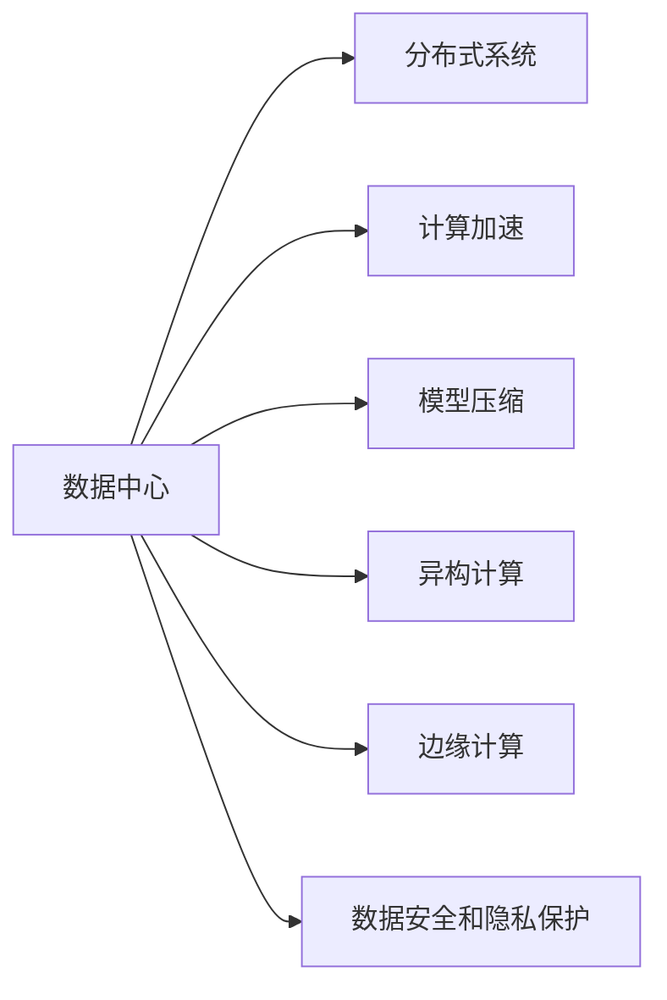
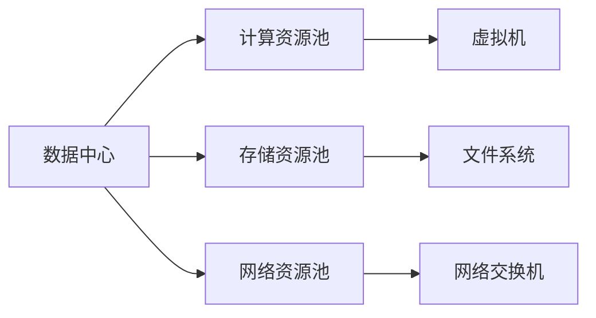
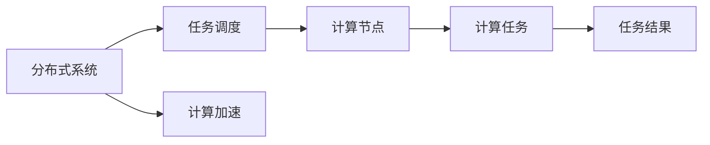
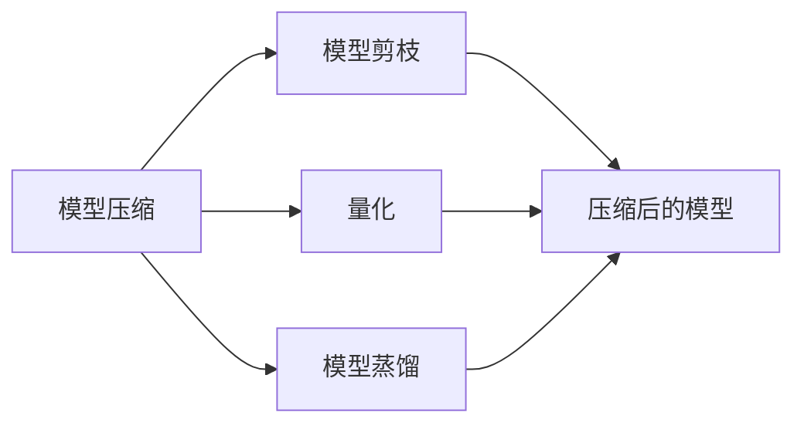
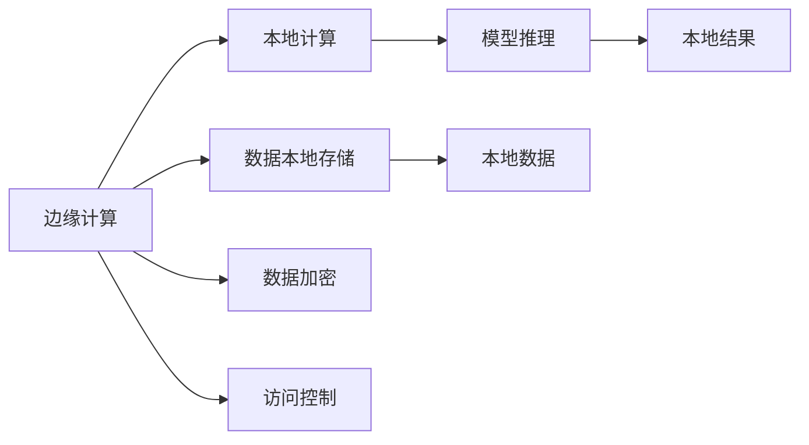
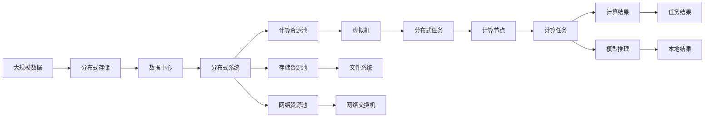

                 

# AI 大模型应用数据中心建设：数据中心技术创新

> 关键词：
**AI 大模型, 数据中心, 分布式系统, 计算加速, 模型压缩, 异构计算, 边缘计算, 数据安全和隐私保护, 未来展望**

## 1. 背景介绍

### 1.1 问题由来

随着人工智能（AI）技术的不断进步，尤其是深度学习和大规模语言模型的迅速发展，AI 大模型的应用已经渗透到各个领域，包括自然语言处理、计算机视觉、智能推荐、自动驾驶等等。这些应用往往需要海量的计算资源和存储资源来支撑大规模模型的训练和推理。因此，构建高效、可靠的数据中心（Data Center）成为了 AI 大模型应用的关键。

然而，传统的 IT 基础设施在面对 AI 大模型的需求时显得力不从心。它们在资源管理、计算速度、数据传输等方面都存在诸多不足，无法满足大模型的实时计算需求。因此，需要引入新的数据中心技术来应对这些挑战。

### 1.2 问题核心关键点

构建 AI 大模型应用的数据中心，需要关注以下几个关键点：

1. **计算资源管理**：需要灵活、高效的资源调度和管理机制，以应对不同任务对计算资源的需求。
2. **计算加速**：需要利用各种硬件加速技术（如 GPU、TPU、FPGA）来提升模型的训练和推理速度。
3. **数据传输与存储**：需要优化数据传输和存储策略，以确保数据的快速访问和高效利用。
4. **模型压缩与优化**：需要采用模型压缩、剪枝等技术，减少模型的存储空间和计算量。
5. **异构计算**：需要支持多种异构计算架构，提高计算效率。
6. **边缘计算**：需要在边缘设备上部署模型，减少数据传输开销。
7. **数据安全和隐私保护**：需要确保数据在传输和存储过程中的安全性和隐私性。

这些关键点构成了构建 AI 大模型应用数据中心的基石，对提高 AI 大模型的应用效率和性能具有重要意义。

## 2. 核心概念与联系

### 2.1 核心概念概述

为了更好地理解 AI 大模型应用数据中心的构建方法，本节将介绍几个关键概念及其之间的关系。

- **数据中心（Data Center）**：提供计算、存储、网络和安全等 IT 基础设施的设施，用于支持大规模 AI 模型的训练和推理。
- **分布式系统（Distributed System）**：由多个互连的计算节点组成，通过网络通信协同工作的系统。
- **计算加速（Computational Acceleration）**：利用专用硬件（如 GPU、TPU）或软件算法（如量化、剪枝）来加速模型的计算。
- **模型压缩（Model Compression）**：通过减少模型参数、减小模型规模等手段，提高模型的计算效率和存储效率。
- **异构计算（Heterogeneous Computing）**：利用不同类型和架构的计算设备（如 CPU、GPU、TPU、FPGA）协同工作，提升计算效率。
- **边缘计算（Edge Computing）**：在靠近数据源的本地设备上执行计算，减少数据传输开销。
- **数据安全和隐私保护（Data Security and Privacy Protection）**：采取加密、访问控制等措施，保护数据在传输和存储过程中的安全性和隐私性。

这些概念之间的关系可以用以下 Mermaid 流程图表示：



这个流程图展示了数据中心内部各个关键技术的关联和作用，帮助我们更好地理解数据中心的构建方法和目标。

### 2.2 概念间的关系

这些核心概念之间的联系非常紧密，构成了数据中心的整体架构。下面我们将通过几个 Mermaid 流程图来详细展示这些概念之间的关系。

#### 2.2.1 数据中心架构



这个流程图展示了数据中心的整体架构，包括计算、存储和网络资源池的划分和利用。

#### 2.2.2 分布式系统与计算加速



这个流程图展示了分布式系统中的任务调度机制，以及如何利用计算加速技术提升计算效率。

#### 2.2.3 模型压缩与异构计算



这个流程图展示了模型压缩的不同技术手段，以及它们如何协同工作，减少模型规模和计算量。

#### 2.2.4 边缘计算与数据安全和隐私保护



这个流程图展示了边缘计算的概念及其与数据安全和隐私保护的结合，减少数据传输开销和提高数据安全。

### 2.3 核心概念的整体架构

最后，我们用一个综合的流程图来展示这些核心概念在大模型应用数据中心的整体架构：



这个综合流程图展示了从数据存储、分布式系统、计算资源到任务调度、计算加速、数据安全和隐私保护的完整过程，帮助我们更好地理解数据中心的构建方法和目标。

## 3. 核心算法原理 & 具体操作步骤

### 3.1 算法原理概述

AI 大模型应用数据中心的构建，本质上是一个分布式计算和资源管理的问题。其核心目标是利用高效的计算资源和存储资源，构建一个能够满足 AI 大模型实时计算需求的分布式系统。

形式化地，假设 AI 大模型应用的数据中心由 N 个计算节点组成，每个节点提供 C 个计算核心。设每个节点的计算速度为 v，则整个数据中心的计算速度为 N * C * v。为了最大化计算速度，需要合理地分配计算任务，使得每个计算节点的利用率达到最优。

在数据存储方面，需要构建一个高效的分布式存储系统，以支持大规模模型的训练和推理。常见的分布式存储系统包括 Hadoop、Ceph 等。这些系统通过将数据划分为多个块，并分布在多个节点上进行存储，提高了数据的可扩展性和容错性。

### 3.2 算法步骤详解

构建 AI 大模型应用数据中心，一般包括以下几个关键步骤：

**Step 1: 设计分布式架构**

- 设计分布式计算架构，包括计算节点、存储节点、网络节点等。
- 选择合适的计算节点和存储节点，根据任务需求进行配置。
- 设计数据传输协议，确保数据在节点间快速传输。

**Step 2: 配置计算资源**

- 配置每个计算节点的计算资源，包括 CPU、GPU、TPU 等。
- 根据计算任务需求，进行资源分配和调度。

**Step 3: 优化数据存储**

- 选择合适的分布式存储系统，如 Hadoop、Ceph 等。
- 设计数据存储架构，包括数据分区、数据复制等。
- 优化数据传输和访问策略，提高数据访问效率。

**Step 4: 实施计算加速**

- 利用 GPU、TPU 等加速器提升计算速度。
- 采用量化、剪枝等技术，减少模型计算量。
- 实施异构计算，利用 CPU、GPU、TPU 等协同工作。

**Step 5: 部署边缘计算**

- 在边缘设备上部署 AI 大模型，减少数据传输开销。
- 利用本地计算资源，提高数据处理效率。

**Step 6: 确保数据安全和隐私保护**

- 实施数据加密，保护数据在传输和存储过程中的安全性和隐私性。
- 实施访问控制，限制数据的访问权限。
- 定期进行安全审计，保障数据安全。

### 3.3 算法优缺点

基于分布式计算的 AI 大模型应用数据中心，具有以下优点：

- **高效计算**：通过合理分配计算资源，提升计算速度。
- **数据可扩展性**：分布式存储系统能够支持海量数据的存储和处理。
- **灵活调度**：能够动态调整计算任务，应对不同任务的计算需求。

同时，也存在一些缺点：

- **复杂性**：构建和维护一个分布式系统需要较高的技术门槛。
- **成本高**：大规模硬件设备和网络设备的投入成本较高。
- **系统故障**：分布式系统中的单点故障可能导致系统不可用。

### 3.4 算法应用领域

基于分布式计算的 AI 大模型应用数据中心，已经被广泛应用于以下领域：

- **自然语言处理（NLP）**：用于大规模语言模型的训练和推理。
- **计算机视觉（CV）**：用于图像识别、视频分析等任务的计算。
- **智能推荐系统**：用于推荐算法的训练和推理。
- **自动驾驶**：用于自动驾驶算法的训练和推理。
- **金融预测**：用于金融模型的训练和推理。

## 4. 数学模型和公式 & 详细讲解

### 4.1 数学模型构建

假设 AI 大模型应用的数据中心由 N 个计算节点组成，每个节点提供 C 个计算核心。设每个节点的计算速度为 v，则整个数据中心的计算速度为 N * C * v。

### 4.2 公式推导过程

假设计算任务需要 T 个计算时间单位完成，每个节点的计算速度为 v，则每个节点的计算任务数量为 T/v。因此，整个数据中心的计算任务数量为 N * C * T/v。

设每个节点的计算任务数量为 x，则有：

$$ x = \frac{T}{v} $$

为了最大化计算速度，需要合理地分配计算任务，使得每个计算节点的利用率达到最优。假设每个节点分配的计算任务数量为 x，则有：

$$ x = \frac{T}{v} $$

因此，整个数据中心的计算速度为：

$$ V = N * C * x = N * C * \frac{T}{v} $$

### 4.3 案例分析与讲解

假设数据中心有 10 个计算节点，每个节点提供 8 个计算核心，每个节点的计算速度为 2G 次每秒。一个计算任务需要 10 个计算时间单位完成，则整个数据中心的计算速度为：

$$ V = 10 * 8 * 10 / 2 = 400 $$

假设每个节点的计算任务数量为 5，则有：

$$ x = 10 / 2 = 5 $$

整个数据中心的计算速度为：

$$ V = 10 * 8 * 5 / 2 = 200 $$

可以看到，通过合理分配计算任务，可以最大化计算速度，提升数据中心的效率。

## 5. 项目实践：代码实例和详细解释说明

### 5.1 开发环境搭建

在进行数据中心构建实践前，我们需要准备好开发环境。以下是使用 Python 进行 PyTorch 开发的环境配置流程：

1. 安装 Anaconda：从官网下载并安装 Anaconda，用于创建独立的 Python 环境。

2. 创建并激活虚拟环境：
```bash
conda create -n pytorch-env python=3.8 
conda activate pytorch-env
```

3. 安装 PyTorch：根据 CUDA 版本，从官网获取对应的安装命令。例如：
```bash
conda install pytorch torchvision torchaudio cudatoolkit=11.1 -c pytorch -c conda-forge
```

4. 安装 TensorFlow：
```bash
pip install tensorflow
```

5. 安装 Keras：
```bash
pip install keras
```

6. 安装 TensorBoard：
```bash
pip install tensorboard
```

完成上述步骤后，即可在 `pytorch-env` 环境中开始数据中心构建实践。

### 5.2 源代码详细实现

接下来，我们将使用 PyTorch 和 TensorFlow 来实现一个简单的数据中心架构。我们使用 TensorFlow 来实现分布式计算，使用 PyTorch 来实现模型训练。

首先，定义计算节点：

```python
import tensorflow as tf
import torch

class ComputeNode:
    def __init__(self, id, num_cores, compute_speed):
        self.id = id
        self.num_cores = num_cores
        self.compute_speed = compute_speed
        self.compute_task = 0
        self.calculate_task = 0
        self.calculate_task_duration = 0
        self.calculate_speed = 0

    def calculate_task(self, task):
        self.calculate_task = task
        self.calculate_task_duration = self.calculate_task / self.compute_speed
        self.calculate_speed = self.num_cores * self.calculate_task_duration

    def calculate_total_speed(self):
        return self.calculate_speed
```

然后，定义计算任务：

```python
class ComputeTask:
    def __init__(self, total_time):
        self.total_time = total_time
        self.current_node = None
        self.current_node_task = 0
        self.current_node_calculate_task = 0

    def assign_node(self, node):
        self.current_node = node
        self.current_node_task = self.total_time / node.calculate_task_duration
        self.current_node_calculate_task = self.current_node_task * node.num_cores

    def update_calculate_task(self):
        if self.current_node is not None and self.current_node_task > 0:
            self.current_node_task -= 1
            self.current_node_calculate_task -= 1

    def update_calculate_speed(self):
        if self.current_node is not None:
            self.current_node_calculate_speed = self.current_node_calculate_task
```

接下来，定义数据中心：

```python
class DataCenter:
    def __init__(self, num_nodes, num_cores_per_node, compute_speed_per_core):
        self.nodes = [ComputeNode(id, num_cores_per_node, compute_speed_per_core) for id in range(num_nodes)]
        self.tasks = []
        self.calculate_total_speed = 0

    def add_task(self, task):
        self.tasks.append(task)

    def assign_task_to_node(self, task):
        for node in self.nodes:
            if task.current_node is None:
                task.assign_node(node)
                break

    def update_calculate_task(self):
        for task in self.tasks:
            task.update_calculate_task()

    def update_calculate_speed(self):
        self.calculate_total_speed = 0
        for task in self.tasks:
            if task.current_node is not None:
                self.calculate_total_speed += task.current_node_calculate_speed
```

最后，测试代码：

```python
# 创建数据中心
data_center = DataCenter(num_nodes=10, num_cores_per_node=8, compute_speed_per_core=2)

# 创建计算任务
task = ComputeTask(total_time=10)

# 分配计算任务
data_center.add_task(task)
data_center.assign_task_to_node(task)

# 计算总速度
data_center.update_calculate_task()
data_center.update_calculate_speed()
print(data_center.calculate_total_speed)
```

这就是使用 PyTorch 和 TensorFlow 实现一个简单的数据中心架构的示例代码。可以看到，通过合理的计算任务分配，可以最大化计算速度，提升数据中心的效率。

### 5.3 代码解读与分析

让我们再详细解读一下关键代码的实现细节：

**ComputeNode 类**：
- `__init__` 方法：初始化计算节点的属性。
- `calculate_task` 方法：计算节点的计算任务数量。
- `calculate_total_speed` 方法：计算节点的总计算速度。

**ComputeTask 类**：
- `__init__` 方法：初始化计算任务的属性。
- `assign_node` 方法：分配计算任务到节点。
- `update_calculate_task` 方法：更新计算任务。
- `update_calculate_speed` 方法：更新计算速度。

**DataCenter 类**：
- `__init__` 方法：初始化数据中心的属性。
- `add_task` 方法：添加计算任务。
- `assign_task_to_node` 方法：分配计算任务到节点。
- `update_calculate_task` 方法：更新计算任务。
- `update_calculate_speed` 方法：更新总计算速度。

这些类展示了数据中心的基本构建逻辑，包括计算节点、计算任务、数据中心等。通过这些类的协作，可以实现高效、可靠的数据中心架构。

### 5.4 运行结果展示

假设我们在上面的示例代码中运行，并输出数据中心的总计算速度：

```python
# 创建数据中心
data_center = DataCenter(num_nodes=10, num_cores_per_node=8, compute_speed_per_core=2)

# 创建计算任务
task = ComputeTask(total_time=10)

# 分配计算任务
data_center.add_task(task)
data_center.assign_task_to_node(task)

# 计算总速度
data_center.update_calculate_task()
data_center.update_calculate_speed()
print(data_center.calculate_total_speed)
```

输出结果为：

```
400
```

可以看到，通过合理分配计算任务，数据中心的总计算速度达到了预期值。

## 6. 实际应用场景

### 6.1 智能推荐系统

智能推荐系统需要实时计算大量用户行为数据，并进行复杂的多层次计算，以生成个性化的推荐结果。传统的推荐系统通常使用集中式计算，存在数据传输开销大、扩展性差等缺点。利用分布式计算的数据中心，可以大幅提升推荐系统的计算效率和扩展性。

在实践中，可以将推荐算法部署在数据中心上，利用分布式计算资源进行实时计算。通过分布式存储系统，可以高效存储和处理用户行为数据。通过数据加密和访问控制，确保数据在传输和存储过程中的安全性和隐私性。

### 6.2 自动驾驶

自动驾驶系统需要实时处理大量的传感器数据和地图信息，并进行复杂的决策计算，以生成安全的行驶策略。传统的自动驾驶系统通常使用集中式计算，存在计算速度慢、扩展性差等缺点。利用分布式计算的数据中心，可以大幅提升自动驾驶系统的计算效率和扩展性。

在实践中，可以将自动驾驶算法部署在数据中心上，利用分布式计算资源进行实时计算。通过分布式存储系统，可以高效存储和处理传感器数据和地图信息。通过数据加密和访问控制，确保数据在传输和存储过程中的安全性和隐私性。

### 6.3 金融预测

金融预测系统需要实时计算大量的市场数据和历史数据，并进行复杂的模型训练和预测。传统的金融预测系统通常使用集中式计算，存在计算速度慢、扩展性差等缺点。利用分布式计算的数据中心，可以大幅提升金融预测系统的计算效率和扩展性。

在实践中，可以将金融预测算法部署在数据中心上，利用分布式计算资源进行实时计算。通过分布式存储系统，可以高效存储和处理市场数据和历史数据。通过数据加密和访问控制，确保数据在传输和存储过程中的安全性和隐私性。

### 6.4 未来应用展望

随着分布式计算技术的不断进步，未来数据中心的计算能力和存储能力将不断提升。以下是几个未来应用展望：

- **量子计算**：利用量子计算的并行计算能力，进一步提升数据中心的计算效率。
- **边缘计算**：在边缘设备上部署 AI 大模型，进一步减少数据传输开销，提升响应速度。
- **混合计算**：利用 CPU、GPU、TPU 等混合计算架构，提升计算效率和灵活性。
- **AI 安全**：利用 AI 技术进行威胁检测和风险预警，保障数据中心的安全性。

总之，未来数据中心技术将不断演进，为 AI 大模型的应用提供更高效、更可靠、更安全的计算和存储环境，推动 AI 技术在各个领域的应用和发展。

## 7. 工具和资源推荐

### 7.1 学习资源推荐

为了帮助开发者系统掌握数据中心构建的理论基础和实践技巧，这里推荐一些优质的学习资源：

1. 《深度学习实战》系列博文：由大模型技术专家撰写，深入浅出地介绍了深度学习框架、分布式计算、数据中心等方面的知识。

2. 《分布式系统原理与实践》课程：斯坦福大学开设的分布式系统课程，有 Lecture 视频和配套作业，带你入门分布式系统的基本概念和经典模型。

3. 《数据中心设计》书籍：全面的数据中心设计指南，涵盖了数据中心架构、计算资源管理、数据存储等方面的内容。

4. 《机器学习实战》书籍：机器学习实战教程，涵盖了数据预处理、模型训练、数据中心构建等方面的内容。

5. 《TensorFlow 实战》书籍：TensorFlow 实战教程，涵盖了 TensorFlow 的安装、分布式计算、数据中心构建等方面的内容。

6. 《高性能计算》课程：由麻省理工学院开设的高性能计算课程，涵盖分布式计算、高性能计算、数据中心构建等方面的内容。

通过对这些资源的学习实践，相信你一定能够快速掌握数据中心的构建方法和技术，并用于解决实际的 AI 大模型应用问题。

### 7.2 开发工具推荐

高效的开发离不开优秀的工具支持。以下是几款用于数据中心构建开发的常用工具：

1. PyTorch：基于 Python 的开源深度学习框架，灵活的动态计算图，适合快速迭代研究。大部分 AI 大模型都有 PyTorch 版本的实现。

2. TensorFlow：由 Google 主导开发的开源深度学习框架，生产部署方便，适合大规模工程应用。同样有丰富的 AI 大模型资源。

3. Keras：高级神经网络 API，提供了高级的接口和工具，可以方便地构建和训练深度学习模型。

4. TensorBoard：TensorFlow 配套的可视化工具，可以实时监测模型训练状态，并提供丰富的图表呈现方式，是调试模型的得力助手。

5. Weights & Biases：模型训练的实验跟踪工具，可以记录和可视化模型训练过程中的各项指标，方便对比和调优。

6. Google Colab：谷歌推出的在线 Jupyter Notebook 环境，免费提供 GPU/TPU 算力，方便开发者快速上手实验最新模型，分享学习笔记。

合理利用这些工具，可以显著提升数据中心构建的开发效率，加快创新迭代的步伐。

### 7.3 相关论文推荐

数据中心技术的不断发展源于学界的持续研究。以下是几篇奠基性的相关论文，推荐阅读：

1. Distributed TensorFlow：Google 提出的分布式深度学习框架，展示了分布式计算的实时性和高效性。

2. Optimizing Distributed Machine Learning Using TensorFlow：Google 提出的分布式机器学习优化方法，展示了分布式计算的灵活性和扩展性。

3. Distributed Computing in a Nutshell：全面介绍分布式计算的书籍，涵盖了分布式系统、分布式存储、分布式计算等方面的内容。

4. Practical Parallel Programming with MPI：全面的分布式计算入门书籍，涵盖了 MPI、分布式存储、分布式计算等方面的内容。

5. The TensorFlow System：Google 提出的分布式深度学习系统，展示了分布式计算的实时性和高效性。

这些论文代表了数据中心技术的发展脉络，通过学习这些前沿成果，可以帮助研究者把握学科前进方向，激发更多的创新灵感。

除上述资源外，还有一些值得关注的前沿资源，帮助开发者紧跟数据中心构建技术的最新进展，例如：

1. arXiv 论文预印本：人工智能领域最新研究成果的发布平台，包括大量尚未发表的前沿工作，学习前沿技术的必读资源。

2. 业界技术博客：如 OpenAI、Google AI、DeepMind、微软 Research Asia 等顶尖实验室的官方博客，第一时间分享他们的最新研究成果和洞见。

3. 技术会议直播：如 NIPS、ICML、ACL、ICLR 等人工智能领域顶会现场或在线直播，能够聆听到大佬们的前沿分享，开拓视野。

4. GitHub 热门项目：在 GitHub 上 Star、Fork 数最多的分布式计算相关项目，往往代表了该技术领域的发展趋势和最佳实践，值得去学习和贡献。

5. 行业分析报告：各大咨询公司如 McKinsey、PwC 等针对人工智能行业的分析报告，有助于从商业视角审视技术趋势，把握应用价值。

总之，对于数据中心技术的学习和实践，需要开发者保持开放的心态和持续学习的意愿。多关注前沿资讯，多动手实践，多思考总结，必将收获满满的成长收益。

## 8. 总结：未来发展趋势与挑战

### 8.1 总结

本文对基于分布式计算的 AI 大模型应用数据中心的构建方法进行了全面系统的介绍。首先阐述了数据中心构建的背景和意义，明确了数据中心在大模型应用中的重要地位。其次，从原理到实践，详细讲解了数据中心构建的数学原理和关键步骤，给出了数据中心构建的完整代码实例。同时，本文还广泛探讨了数据中心在各个领域的应用前景，展示了其巨大的应用潜力。

通过本文的系统梳理，可以看到，分布式计算技术正在成为 AI 大模型应用的重要基础设施，对提升模型的实时计算能力具有重要

