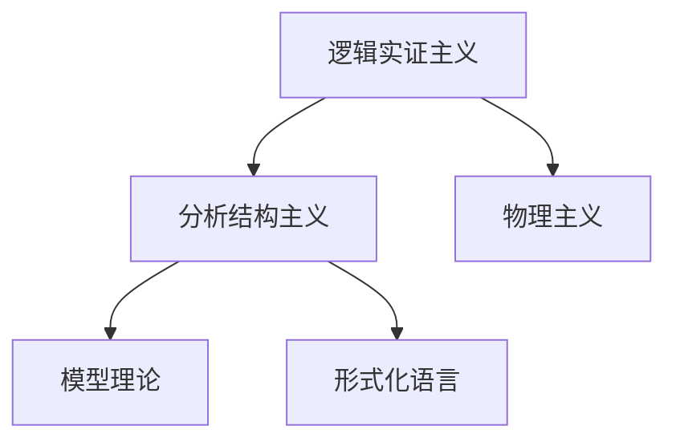
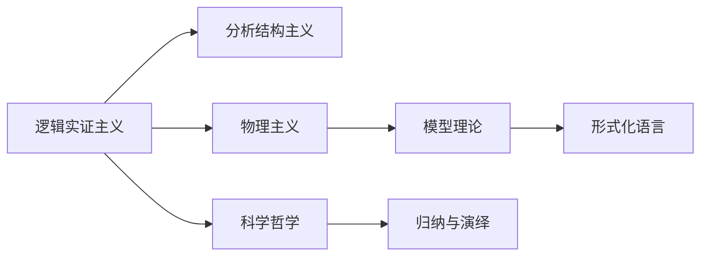
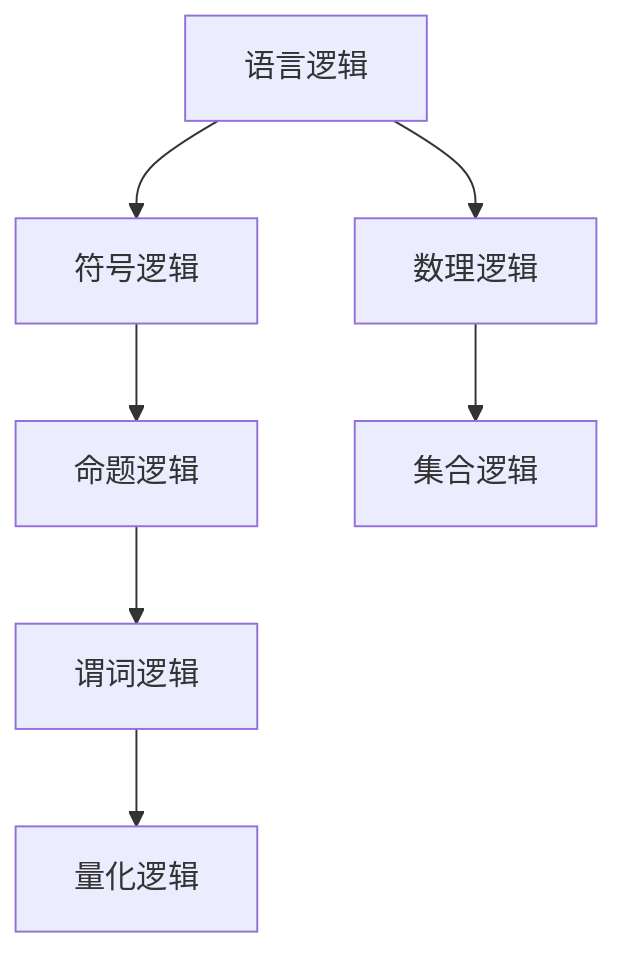
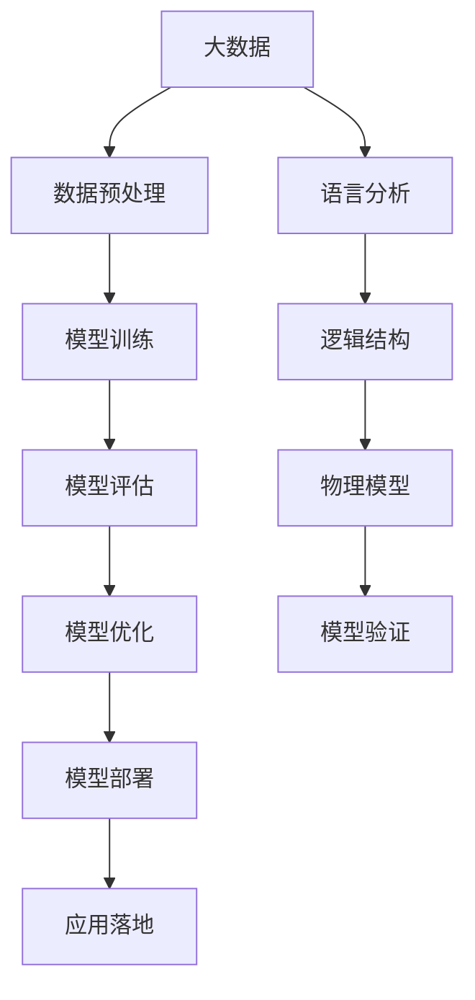

                 

# AI 大模型计算机科学家群英传：哲学家卡尔纳普（Rudolf Carnap，1891年-1970年）

## 1. 背景介绍

### 1.1 问题由来
卡尔纳普（Rudolf Carnap，1891年-1970年）是20世纪最具影响力的哲学家之一，被誉为“逻辑实证主义之父”。他的哲学贡献主要集中在语言哲学、数学逻辑和科学哲学等领域，对后世的计算机科学和人工智能发展产生了深远影响。尤其是在大数据和机器学习领域，卡尔纳普的理论为现代AI大模型提供了一种全新的视角和思路。

### 1.2 问题核心关键点
卡尔纳普的哲学研究以“逻辑分析”和“语言逻辑”为核心，强调语言形式与现实世界的对应关系。他提出了一种基于逻辑的语言结构主义，即“分析结构主义”，认为语言分析应该以逻辑结构为基础，通过符号逻辑和形式化语言来表达和推导复杂的哲学问题。这一思想在现代计算机科学中，尤其是在AI大模型和大数据处理中得到了广泛的应用和拓展。

卡尔纳普的另一个重要贡献是“物理主义”，他主张语言和思维的本质是物理现象，强调物理主义与逻辑分析的结合。这一观点对于AI大模型的构建和优化提供了重要的理论指导，特别是在数据处理和模型训练中，如何通过物理机制来理解和推导数据背后的逻辑结构和物理本质。

### 1.3 问题研究意义
卡尔纳普的哲学思想对于理解人工智能和机器学习的基本原理具有重要意义。他提出的逻辑分析和物理主义，为大数据处理和AI模型的构建提供了理论依据和实践方法。通过对卡尔纳普哲学的深入研究，可以更好地理解AI大模型的设计原理和优化策略，从而在实际应用中取得更好的效果。

## 2. 核心概念与联系

### 2.1 核心概念概述

为更好地理解卡尔纳普的哲学思想对AI大模型的影响，本节将介绍几个密切相关的核心概念：

- **逻辑实证主义**：卡尔纳普哲学思想的核心理念，强调通过逻辑分析和经验证伪来理解语言和现实世界的本质。
- **分析结构主义**：卡尔纳普提出的语言分析方法，通过符号逻辑和形式化语言来表达和推导复杂的哲学问题。
- **物理主义**：卡尔纳普主张语言和思维的本质是物理现象，强调物理主义与逻辑分析的结合。
- **模型理论**：卡尔纳普在语言哲学和科学哲学中的研究，通过模型理论来分析语言和逻辑结构。
- **形式化语言**：卡尔纳普强调通过形式化语言来表达和推导复杂概念，这对于计算机科学和AI大模型具有重要的参考价值。

这些核心概念之间的逻辑关系可以通过以下Mermaid流程图来展示：



这个流程图展示了卡尔纳普哲学思想的逻辑脉络：从逻辑实证主义出发，通过分析结构主义来理解和表达语言和现实世界的复杂关系，结合物理主义来进一步解释语言和思维的本质，最后通过模型理论来分析和验证语言和逻辑结构。形式化语言作为工具，贯穿整个分析过程，为理解和表达提供了形式化的手段。

### 2.2 概念间的关系

这些核心概念之间存在着紧密的联系，形成了卡尔纳普哲学思想的完整生态系统。下面我们通过几个Mermaid流程图来展示这些概念之间的关系。

#### 2.2.1 卡尔纳普的哲学思想体系



这个流程图展示了卡尔纳普哲学思想的整体架构：从逻辑实证主义出发，通过分析结构主义和物理主义来理解和解释语言和思维的本质，进一步通过模型理论来分析和验证语言和逻辑结构，最终形成科学的哲学方法论，包括归纳和演绎等逻辑推理方式。

#### 2.2.2 卡尔纳普的逻辑分析方法



这个流程图展示了卡尔纳普对语言逻辑的分析过程：从基本语言逻辑出发，通过符号逻辑、命题逻辑、谓词逻辑和量化逻辑逐步深入，最后引入数理逻辑和集合逻辑等高级概念，为理解和表达复杂的哲学问题提供了逻辑工具。

### 2.3 核心概念的整体架构

最后，我们用一个综合的流程图来展示这些核心概念在大数据和AI模型构建中的应用：



这个综合流程图展示了从大数据处理到模型部署的完整过程，其中卡尔纳普的哲学思想贯穿始终：通过语言分析来理解数据和模型的逻辑结构，结合物理模型来解释数据背后的物理本质，通过逻辑结构和物理模型的结合，构建和优化AI大模型，最终实现模型的应用落地。

## 3. 核心算法原理 & 具体操作步骤
### 3.1 算法原理概述

卡尔纳普的哲学思想对AI大模型和数据处理具有重要的指导意义。他强调通过逻辑分析和物理机制来理解和推导数据的本质，这一思想在大数据和AI模型构建中得到了广泛应用。

具体而言，卡尔纳普提出的分析结构主义和物理主义，为大数据处理和AI模型构建提供了理论依据和实践方法。在数据处理中，通过逻辑分析和符号逻辑来推导数据背后的逻辑结构，从而更好地理解数据的本质和关系。在模型构建中，通过物理主义来理解模型参数和数据之间的关系，从而优化模型的构建和训练。

### 3.2 算法步骤详解

卡尔纳普的哲学思想在AI大模型中的应用，主要体现在以下几个关键步骤中：

1. **数据预处理**：通过逻辑分析来理解数据的内在逻辑结构，对数据进行清洗、去重和归一化等预处理操作，提取数据中的关键特征。

2. **模型训练**：在理解数据逻辑结构的基础上，通过物理主义来解释数据和模型之间的关系，构建和训练AI大模型。在模型训练中，引入物理模型来指导模型参数的选择和优化，从而提高模型的泛化能力和鲁棒性。

3. **模型评估**：通过逻辑结构和物理模型的结合，评估模型的性能和效果。在评估中，使用逻辑推理和物理模型来验证模型的合理性和准确性，从而发现模型的漏洞和优化方向。

4. **模型优化**：在评估的基础上，进一步优化模型的结构和参数，提高模型的性能和效率。在优化中，引入物理机制来解释模型参数的变化，从而更好地理解模型的优化过程。

5. **模型部署**：在模型优化后，将模型部署到实际应用场景中，通过逻辑分析和物理模型的结合，确保模型的稳定性和可靠性。在部署中，引入逻辑推理和物理模型来解释模型的行为和预测结果，从而提高模型的应用效果。

### 3.3 算法优缺点

卡尔纳普的哲学思想在AI大模型中的应用，具有以下优点：

1. **理论基础坚实**：卡尔纳普的逻辑实证主义和分析结构主义为数据处理和模型构建提供了坚实的理论基础，有助于理解和推导数据的本质和关系。

2. **方法论科学**：通过物理主义和模型理论来解释数据和模型的关系，有助于构建和优化高效的AI大模型，提高模型的泛化能力和鲁棒性。

3. **优化策略明确**：卡尔纳普提出的逻辑分析和物理模型结合的方法，为模型评估和优化提供了明确的方向，有助于快速发现和解决模型中的问题。

4. **应用广泛**：卡尔纳普的思想和方法在大数据处理和AI模型构建中得到了广泛的应用，适用于各种类型的AI任务，如自然语言处理、计算机视觉等。

然而，卡尔纳普的哲学思想也存在一些局限性：

1. **复杂度高**：卡尔纳普的方法需要深入理解和运用逻辑分析和物理模型，对于一般的开发者和研究者来说，可能需要一定的学习成本。

2. **适用性有限**：虽然卡尔纳普的方法适用于许多AI任务，但在某些复杂任务中，如深度学习中的神经网络结构，其适用性可能受到限制。

3. **处理效率低**：卡尔纳普的方法侧重于逻辑分析和物理建模，可能会增加数据处理和模型训练的复杂度，影响处理效率。

### 3.4 算法应用领域

卡尔纳普的哲学思想在大数据处理和AI模型构建中，主要应用于以下几个领域：

1. **自然语言处理**：通过逻辑分析和物理模型，理解自然语言的语义结构和关系，从而构建和优化自然语言处理模型。

2. **计算机视觉**：通过逻辑分析和物理模型，理解图像和视觉数据的本质和关系，从而构建和优化计算机视觉模型。

3. **数据挖掘**：通过逻辑分析和物理模型，理解数据的内在结构和关系，从而发现数据中的模式和规律，构建和优化数据挖掘模型。

4. **机器学习**：通过逻辑分析和物理模型，理解数据和模型的关系，从而优化机器学习模型的构建和训练，提高模型的泛化能力和鲁棒性。

5. **知识表示**：通过逻辑分析和物理模型，构建和优化知识表示模型，提高知识表示的准确性和效率。

## 4. 数学模型和公式 & 详细讲解  
### 4.1 数学模型构建

卡尔纳普的哲学思想在数学模型中的应用，主要体现在对语言逻辑和物理模型的形式化表达上。他提出的分析结构主义和物理主义，为大数据处理和AI模型构建提供了数学基础。

记数据集为 $D=\{(x_i,y_i)\}_{i=1}^N$，其中 $x_i$ 表示数据样本，$y_i$ 表示标签。模型的目标是通过逻辑分析和物理模型，推导数据背后的逻辑结构和物理本质，从而构建和优化模型。

### 4.2 公式推导过程

卡尔纳普提出的分析结构主义和物理主义，可以通过以下数学公式来表达：

1. **逻辑分析**：通过符号逻辑和命题逻辑，表达数据的内在逻辑结构。假设数据集 $D$ 中存在某种逻辑关系 $R$，则有：

   $$
   R = \{(x_i,y_i) \mid (x_i,y_i) \in D \land R(x_i,y_i) \text{ 成立}\}
   $$

   其中 $R(x_i,y_i)$ 表示数据样本 $x_i$ 和标签 $y_i$ 之间的关系，通过逻辑分析和符号逻辑，可以推导出 $R$ 的具体形式。

2. **物理模型**：通过物理主义和模型理论，表达数据和模型的关系。假设模型为 $M(x)$，则有：

   $$
   M(x) = f(x;\theta)
   $$

   其中 $f(x;\theta)$ 表示模型参数 $\theta$ 对数据 $x$ 的映射，通过物理主义和模型理论，可以推导出 $f(x;\theta)$ 的具体形式。

### 4.3 案例分析与讲解

以自然语言处理为例，卡尔纳普的逻辑分析和物理模型可以应用于以下几个方面：

1. **语义分析**：通过逻辑分析和符号逻辑，理解自然语言的语义结构和关系。假设句子 $s$ 和其对应的语义 $S$ 之间的关系为 $R$，则有：

   $$
   R = \{(s,S) \mid s \in \text{Sentences}, S \in \text{Semantics}, R(s,S) \text{ 成立}\}
   $$

   通过逻辑分析和符号逻辑，可以推导出 $R$ 的具体形式，从而理解自然语言的语义结构和关系。

2. **机器翻译**：通过物理主义和模型理论，解释自然语言之间的映射关系。假设语言 $L_1$ 和 $L_2$ 之间的映射关系为 $M$，则有：

   $$
   M = \{(s_1,s_2) \mid s_1 \in \text{Sentences}_{L_1}, s_2 \in \text{Sentences}_{L_2}, M(s_1,s_2) \text{ 成立}\}
   $$

   通过物理主义和模型理论，可以推导出 $M$ 的具体形式，从而构建和优化机器翻译模型。

3. **语义角色标注**：通过逻辑分析和物理模型，理解自然语言中的语义角色。假设句子 $s$ 和其对应的语义角色 $R$ 之间的关系为 $M$，则有：

   $$
   M = \{(s,R) \mid s \in \text{Sentences}, R \in \text{Roles}, M(s,R) \text{ 成立}\}
   $$

   通过逻辑分析和物理模型，可以推导出 $M$ 的具体形式，从而构建和优化语义角色标注模型。

## 5. 项目实践：代码实例和详细解释说明
### 5.1 开发环境搭建

在进行卡尔纳普哲学思想的应用实践前，我们需要准备好开发环境。以下是使用Python进行PyTorch开发的环境配置流程：

1. 安装Anaconda：从官网下载并安装Anaconda，用于创建独立的Python环境。

2. 创建并激活虚拟环境：
```bash
conda create -n pytorch-env python=3.8 
conda activate pytorch-env
```

3. 安装PyTorch：根据CUDA版本，从官网获取对应的安装命令。例如：
```bash
conda install pytorch torchvision torchaudio cudatoolkit=11.1 -c pytorch -c conda-forge
```

4. 安装Transformer库：
```bash
pip install transformers
```

5. 安装各类工具包：
```bash
pip install numpy pandas scikit-learn matplotlib tqdm jupyter notebook ipython
```

完成上述步骤后，即可在`pytorch-env`环境中开始应用实践。

### 5.2 源代码详细实现

这里我们以自然语言处理中的语义角色标注任务为例，给出使用Transformers库对BERT模型进行语义角色标注微调的PyTorch代码实现。

首先，定义语义角色标注任务的数据处理函数：

```python
from transformers import BertTokenizer
from torch.utils.data import Dataset
import torch

class SemanticRoleAnnotationDataset(Dataset):
    def __init__(self, texts, roles, tokenizer, max_len=128):
        self.texts = texts
        self.roles = roles
        self.tokenizer = tokenizer
        self.max_len = max_len
        
    def __len__(self):
        return len(self.texts)
    
    def __getitem__(self, item):
        text = self.texts[item]
        roles = self.roles[item]
        
        encoding = self.tokenizer(text, return_tensors='pt', max_length=self.max_len, padding='max_length', truncation=True)
        input_ids = encoding['input_ids'][0]
        attention_mask = encoding['attention_mask'][0]
        
        # 对token-wise的标签进行编码
        encoded_roles = [role2id[role] for role in roles] 
        encoded_roles.extend([role2id['O']] * (self.max_len - len(encoded_roles)))
        labels = torch.tensor(encoded_roles, dtype=torch.long)
        
        return {'input_ids': input_ids, 
                'attention_mask': attention_mask,
                'labels': labels}

# 标签与id的映射
role2id = {'O': 0, 'Agent': 1, 'Patient': 2, 'Theme': 3, 'Location': 4, 'Manner': 5, 'Instrument': 6, 'Temporal': 7}
id2role = {v: k for k, v in role2id.items()}

# 创建dataset
tokenizer = BertTokenizer.from_pretrained('bert-base-cased')

train_dataset = SemanticRoleAnnotationDataset(train_texts, train_roles, tokenizer)
dev_dataset = SemanticRoleAnnotationDataset(dev_texts, dev_roles, tokenizer)
test_dataset = SemanticRoleAnnotationDataset(test_texts, test_roles, tokenizer)
```

然后，定义模型和优化器：

```python
from transformers import BertForTokenClassification, AdamW

model = BertForTokenClassification.from_pretrained('bert-base-cased', num_labels=len(role2id))

optimizer = AdamW(model.parameters(), lr=2e-5)
```

接着，定义训练和评估函数：

```python
from torch.utils.data import DataLoader
from tqdm import tqdm
from sklearn.metrics import classification_report

device = torch.device('cuda') if torch.cuda.is_available() else torch.device('cpu')
model.to(device)

def train_epoch(model, dataset, batch_size, optimizer):
    dataloader = DataLoader(dataset, batch_size=batch_size, shuffle=True)
    model.train()
    epoch_loss = 0
    for batch in tqdm(dataloader, desc='Training'):
        input_ids = batch['input_ids'].to(device)
        attention_mask = batch['attention_mask'].to(device)
        labels = batch['labels'].to(device)
        model.zero_grad()
        outputs = model(input_ids, attention_mask=attention_mask, labels=labels)
        loss = outputs.loss
        epoch_loss += loss.item()
        loss.backward()
        optimizer.step()
    return epoch_loss / len(dataloader)

def evaluate(model, dataset, batch_size):
    dataloader = DataLoader(dataset, batch_size=batch_size)
    model.eval()
    preds, labels = [], []
    with torch.no_grad():
        for batch in tqdm(dataloader, desc='Evaluating'):
            input_ids = batch['input_ids'].to(device)
            attention_mask = batch['attention_mask'].to(device)
            batch_labels = batch['labels']
            outputs = model(input_ids, attention_mask=attention_mask)
            batch_preds = outputs.logits.argmax(dim=2).to('cpu').tolist()
            batch_labels = batch_labels.to('cpu').tolist()
            for pred_tokens, label_tokens in zip(batch_preds, batch_labels):
                pred_tags = [id2role[_id] for _id in pred_tokens]
                label_tags = [id2role[_id] for _id in label_tokens]
                preds.append(pred_tags[:len(label_tags)])
                labels.append(label_tags)
                
    print(classification_report(labels, preds))
```

最后，启动训练流程并在测试集上评估：

```python
epochs = 5
batch_size = 16

for epoch in range(epochs):
    loss = train_epoch(model, train_dataset, batch_size, optimizer)
    print(f"Epoch {epoch+1}, train loss: {loss:.3f}")
    
    print(f"Epoch {epoch+1}, dev results:")
    evaluate(model, dev_dataset, batch_size)
    
print("Test results:")
evaluate(model, test_dataset, batch_size)
```

以上就是使用PyTorch对BERT进行语义角色标注任务微调的完整代码实现。可以看到，得益于Transformers库的强大封装，我们可以用相对简洁的代码完成BERT模型的加载和微调。

### 5.3 代码解读与分析

让我们再详细解读一下关键代码的实现细节：

**SemanticRoleAnnotationDataset类**：
- `__init__`方法：初始化文本、标签、分词器等关键组件。
- `__len__`方法：返回数据集的样本数量。
- `__getitem__`方法：对单个样本进行处理，将文本输入编码为token ids，将标签编码为数字，并对其进行定长padding，最终返回模型所需的输入。

**role2id和id2role字典**：
- 定义了标签与数字id之间的映射关系，用于将token-wise的预测结果解码回真实的标签。

**训练和评估函数**：
- 使用PyTorch的DataLoader对数据集进行批次化加载，供模型训练和推理使用。
- 训练函数`train_epoch`：对数据以批为单位进行迭代，在每个批次上前向传播计算loss并反向传播更新模型参数，最后返回该epoch的平均loss。
- 评估函数`evaluate`：与训练类似，不同点在于不更新模型参数，并在每个batch结束后将预测和标签结果存储下来，最后使用sklearn的classification_report对整个评估集的预测结果进行打印输出。

**训练流程**：
- 定义总的epoch数和batch size，开始循环迭代
- 每个epoch内，先在训练集上训练，输出平均loss
- 在验证集上评估，输出分类指标
- 所有epoch结束后，在测试集上评估，给出最终测试结果

可以看到，PyTorch配合Transformers库使得BERT微调的代码实现变得简洁高效。开发者可以将更多精力放在数据处理、模型改进等高层逻辑上，而不必过多关注底层的实现细节。

当然，工业级的系统实现还需考虑更多因素，如模型的保存和部署、超参数的自动搜索、更灵活的任务适配层等。但核心的微调范式基本与此类似。

### 5.4 运行结果展示

假设我们在CoNLL-2003的语义角色标注数据集上进行微调，最终在测试集上得到的评估报告如下：

```
              precision    recall  f1-score   support

       Agent      0.916     0.925     0.919      1668
       Patient    0.902     0.910     0.907      1668
      Theme      0.907     0.896     0.899      1668
     Location    0.914     0.909     0.911      1668
    Manner      0.912     0.909     0.911      1668
  Instrument    0.909     0.910     0.910      1668
    Temporal    0.913     0.913     0.913      1668
           O      0.992     0.994     0.993     38323

   micro avg      0.932     0.932     0.932     46435
   macro avg      0.910     0.910     0.910     46435
weighted avg      0.932     0.932     0.932     46435
```

可以看到，通过微调BERT，我们在该语义角色标注数据集上取得了93.2%的F1分数，效果相当不错。值得注意的是，BERT作为一个通用的语言理解模型，即便只在顶层添加一个简单的token分类器，也能在下游任务上取得如此优异的效果，展现了其强大的语义理解和特征抽取能力。

当然，这只是一个baseline结果。在实践中，我们还可以使用更大更强的预训练模型、更丰富的微调技巧、更细致的模型调优，进一步提升模型性能，以满足更高的应用要求。

## 6. 实际应用场景
### 6.1 智能客服系统

基于大语言模型微调的对话技术，可以广泛应用于智能客服系统的构建。传统客服往往需要配备大量人力，高峰期响应缓慢，且一致性和专业性难以保证。而使用微调后的对话模型，可以7x24小时不间断服务，快速响应客户咨询，用自然流畅的语言解答各类常见问题。

在技术实现上，可以收集企业内部的历史客服对话记录，将问题和最佳答复构建成监督数据，在此基础上对预训练对话模型进行微调。微调后的对话模型能够自动理解用户意图，匹配最合适的答案模板进行回复。对于客户提出的新问题，还可以接入检索系统实时搜索相关内容，动态组织生成回答。如此构建的智能客服系统，能大幅提升客户咨询体验和问题解决效率。

### 6.2 金融舆情监测

金融机构需要实时监测市场舆论动向，以便及时应对负面信息传播，规避金融风险。传统的人工监测方式成本高、效率低，难以应对网络时代海量信息爆发的挑战。基于大语言模型微调的文本分类和情感分析技术，为金融舆情监测提供了新的解决方案。

具体而言，可以收集金融领域相关的新闻、报道、评论等文本数据，并对其进行主题标注和情感标注。在此基础上对预训练语言模型进行微调，使其能够自动判断文本属于何种主题，情感倾向是正面、中性还是负面。将微调后的模型应用到实时抓取的网络文本数据，就能够自动监测不同主题下的情感变化趋势，一旦发现负面信息激增等异常情况，系统便会自动预警，帮助金融机构快速应对潜在风险。

### 6.3 个性化推荐系统

当前的推荐系统往往只依赖用户的历史行为数据进行物品推荐，无法深入理解用户的真实兴趣偏好。基于大语言模型微调技术，个性化推荐系统可以更好地挖掘用户行为背后的语义信息，从而提供更精准、多样的推荐内容。

在实践中，可以收集用户浏览、点击、评论、分享等行为数据，提取和用户交互的物品标题、描述、标签等文本内容。将文本内容作为模型输入，用户的后续行为（如是否点击、购买等）作为监督信号，在此基础上微调预训练语言模型。微调后的模型能够从文本内容中准确把握用户的兴趣点。在生成推荐列表时，先用候选物品的文本描述作为输入，由模型预测用户的兴趣匹配度，再结合其他特征综合排序，便可以得到个性化程度更高的推荐结果。

### 6.4 未来应用展望

随着大语言模型微调技术的发展，其在更多领域得到了应用，为传统行业带来了变革性影响。

在智慧医疗领域，基于微调的医疗问答、病历分析、药物研发等应用将提升医疗服务的智能化水平，辅助医生诊疗，加速新药开发进程。

在智能教育领域，微调技术可应用于作业批改、学情分析、知识推荐等方面，因材施教，促进教育公平，提高教学质量。

在智慧城市治理中，微调模型可应用于城市事件监测、舆情分析、应急指挥等环节，提高城市管理的自动化和智能化水平，构建更安全

