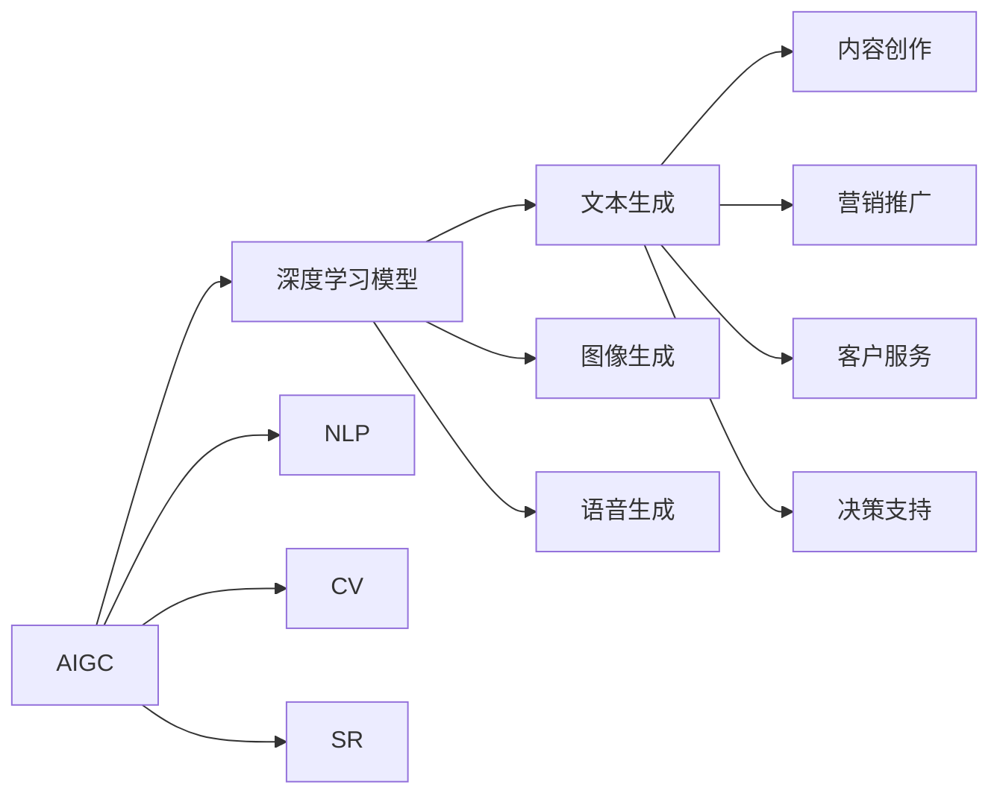
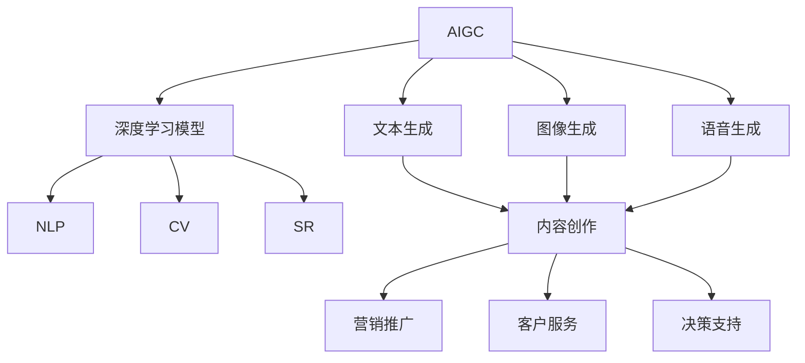
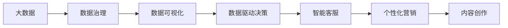
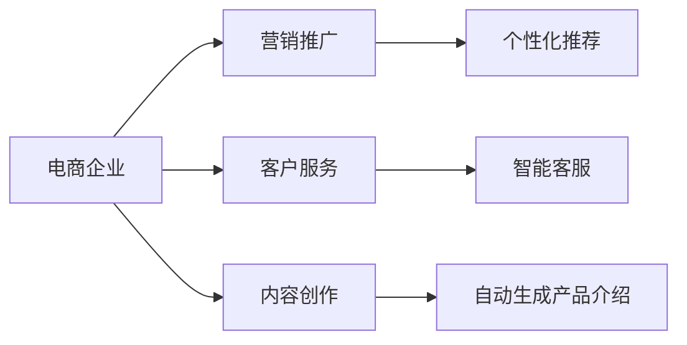
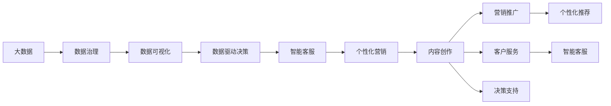

                 

# AIGC从入门到实战：关于企业和组织

> 关键词：人工智能生成内容(AIGC)，企业数字化转型，AI驱动的组织变革，智能企业运营，数据驱动决策，机器学习在企业中的应用

## 1. 背景介绍

### 1.1 问题由来
随着人工智能技术的迅猛发展，特别是近年来深度学习和大规模预训练模型在自然语言处理(NLP)、计算机视觉(CV)、语音识别(SR)等领域取得的突破性进展，人工智能生成内容(AI Generated Content, AIGC)正逐渐从实验室走向企业应用，成为推动企业数字化转型的重要引擎。

### 1.2 问题核心关键点
AIGC的核心在于通过深度学习模型，自动生成符合特定要求的文字、图像、语音等内容，实现信息的自动化生产、自动化传播。对于企业而言，AIGC可以大幅提升内容创作的效率、降低成本，同时还可以根据企业需求生成更具针对性和吸引力的内容。

企业如何高效利用AIGC技术，进行内容创作、营销推广、客户服务等环节的数字化转型，是当前最热门的话题之一。一方面，AIGC技术的应用前景广阔，可以帮助企业降本增效；另一方面，企业在应用AIGC的过程中，也面临模型选择、数据治理、隐私保护等诸多挑战。

### 1.3 问题研究意义
AIGC技术在企业中的应用，具有以下重要意义：

1. **内容生产自动化**：通过AIGC技术，企业可以自动化生成各类内容，如产品描述、市场报告、客户服务答复等，大幅提升内容创作效率，减少人力成本。
2. **个性化营销**：AIGC可以根据用户的行为数据、历史记录，生成个性化的营销内容，提升用户的参与度和满意度。
3. **客户服务优化**：智能客服机器人可以通过AIGC技术，自动回答用户咨询，提高服务响应速度和质量，提升用户体验。
4. **决策支持**：AIGC可以生成各类分析报告和决策建议，帮助企业管理层快速把握市场动态，优化决策过程。
5. **跨界创新**：AIGC技术还可以用于艺术创作、影视制作、游戏开发等多个领域，推动跨界创新，拓展企业的发展空间。

## 2. 核心概念与联系

### 2.1 核心概念概述

为更好地理解AIGC在企业中的应用，本节将介绍几个密切相关的核心概念：

- 人工智能生成内容(AIGC)：通过深度学习模型，自动生成符合特定要求的文字、图像、语音等内容。AIGC可以分为基于文本的生成、基于图像的生成、基于音频的生成等多种形式。
- 深度学习模型(Deep Learning Models)：指基于多层神经网络结构的模型，如卷积神经网络(CNN)、循环神经网络(RNN)、变分自编码器(VAE)、生成对抗网络(GAN)等，用于自动学习复杂模式，实现数据的自动分析和生成。
- 自然语言处理(NLP)：指使用深度学习模型处理、理解、生成自然语言的技术，包括文本分类、情感分析、机器翻译、问答系统等。
- 计算机视觉(CV)：指使用深度学习模型处理、理解、生成图像的技术，包括图像识别、图像生成、图像分割等。
- 语音识别(SR)：指使用深度学习模型处理、理解、生成语音的技术，包括语音转写、语音合成、语音情感分析等。
- 工业界应用：指AIGC技术在各类企业应用场景中的具体实现，包括内容创作、营销推广、客户服务、决策支持等。

这些核心概念之间的逻辑关系可以通过以下Mermaid流程图来展示：



这个流程图展示了大规模生成内容的技术路线和应用场景。

### 2.2 概念间的关系

这些核心概念之间存在着紧密的联系，形成了AIGC技术在企业应用中的完整生态系统。下面我们通过几个Mermaid流程图来展示这些概念之间的关系。

#### 2.2.1 AIGC的核心技术范式



这个流程图展示了大规模生成内容的技术路线和应用场景。

#### 2.2.2 数据驱动的企业运营



这个流程图展示了数据在企业运营中的流动和应用，从数据治理到数据驱动决策，再到智能客服、个性化营销和内容创作，数据在其中扮演了关键角色。

#### 2.2.3 工业界应用的案例



这个流程图展示了AIGC技术在电商企业中的应用，从营销推广到客户服务和内容创作，各个环节都可以通过AIGC技术自动化实现，提升企业的运营效率。

### 2.3 核心概念的整体架构

最后，我们用一个综合的流程图来展示这些核心概念在企业应用中的整体架构：



这个综合流程图展示了数据在企业运营中的流动和应用，从数据治理到数据驱动决策，再到智能客服、个性化营销和内容创作，数据在其中扮演了关键角色。

## 3. 核心算法原理 & 具体操作步骤
### 3.1 算法原理概述

AIGC在企业中的应用，主要是基于深度学习模型的自动生成技术。以生成文本内容为例，其核心算法原理可以归纳为以下几个步骤：

1. **数据准备**：收集、清洗、标注企业所需的内容数据，如产品描述、市场报告、客户咨询等。
2. **预训练模型选择**：选择合适的预训练模型，如BERT、GPT等，进行文本生成任务的微调。
3. **微调任务适配**：根据企业需求，设计适合于具体任务的微调目标，如生成特定领域的文本内容。
4. **微调模型训练**：使用标注数据对模型进行微调，优化模型在特定任务上的表现。
5. **模型评估与部署**：评估微调后模型的性能，部署到实际应用中，进行内容的自动化生成。

### 3.2 算法步骤详解

下面我们以生成产品描述为例，详细讲解基于文本的AIGC生成算法步骤。

**Step 1: 数据准备**
- 收集企业的所有产品信息，包括产品名、规格、功能、使用场景等。
- 标注这些产品信息的关键词、句式结构、风格等特征。
- 构建一个包含大量产品描述的数据集，用于后续模型的微调。

**Step 2: 预训练模型选择**
- 选择适当的预训练模型，如BERT、GPT-2等，作为文本生成的基础模型。
- 将预训练模型引入深度学习框架，如PyTorch、TensorFlow等，进行微调训练。

**Step 3: 微调任务适配**
- 根据企业的需求，设计微调目标。例如，需要生成产品描述、用户评价、售后服务等。
- 将标注好的产品描述数据集划分为训练集、验证集和测试集。
- 设计合适的损失函数，如交叉熵损失、均方误差损失等。

**Step 4: 微调模型训练**
- 设置合适的超参数，如学习率、批大小、迭代轮数等。
- 将训练集数据分批次输入模型，前向传播计算损失函数。
- 反向传播计算参数梯度，根据设定的优化算法和学习率更新模型参数。
- 周期性在验证集上评估模型性能，根据性能指标决定是否触发Early Stopping。
- 重复上述步骤直到满足预设的迭代轮数或Early Stopping条件。

**Step 5: 模型评估与部署**
- 在测试集上评估微调后模型生成产品描述的性能。
- 部署微调后的模型到生产环境，与实时数据流进行对接，生成动态的产品描述。
- 实时监控模型性能，定期重新微调模型，以适应产品信息的变化。

### 3.3 算法优缺点

AIGC技术在企业中的应用具有以下优点：
1. **高效生成内容**：AIGC可以快速生成大量高质量的内容，降低企业内容创作的成本和时间。
2. **灵活适应需求**：AIGC可以根据企业的不同需求，生成多样化的内容形式，满足个性化营销和客户服务等需求。
3. **自动化程度高**：AIGC可以自动化生成内容，减少人力投入，提升运营效率。
4. **可扩展性强**：AIGC技术具有较高的可扩展性，可以轻松集成到现有业务流程中。

同时，AIGC技术也存在一些缺点：
1. **质量控制难**：AIGC生成的内容质量受限于模型训练数据和算法性能，可能存在语法错误、逻辑漏洞等问题。
2. **缺乏人性化**：AIGC生成的内容缺乏人情味，难以完全替代人工创作。
3. **数据隐私问题**：AIGC需要大量的数据进行训练，数据隐私和安全问题需要引起重视。
4. **依赖性强**：AIGC的应用效果高度依赖于模型和数据质量，模型训练和数据治理需要较高的技术门槛。

### 3.4 算法应用领域

AIGC技术在企业中的应用领域非常广泛，涵盖了各类业务环节，具体包括：

- **内容创作**：生成各类文章、报告、新闻稿等文本内容。
- **营销推广**：生成广告文案、个性化推荐、社交媒体内容等。
- **客户服务**：自动生成客服响应、用户问答、自动回复等。
- **产品介绍**：生成产品说明书、用户手册、商品详情页等。
- **数据分析**：生成各类数据报告、分析图表、趋势预测等。
- **决策支持**：生成决策建议、市场分析、业务预测等。

除了上述应用场景，AIGC技术还可以应用于影视制作、游戏开发、智能家居等多个领域，为企业提供更丰富的数字化应用可能性。

## 4. 数学模型和公式 & 详细讲解 & 举例说明

### 4.1 数学模型构建

AIGC技术在企业中的应用，主要基于深度学习模型和优化算法的协同作用。以下以文本生成任务为例，介绍其数学模型的构建过程。

假设AIGC系统需要生成一段文本内容，其训练数据集为 $D=\{(x_i,y_i)\}_{i=1}^N$，其中 $x_i$ 为输入的文本片段， $y_i$ 为对应的生成文本。

定义模型 $M_{\theta}$ 的输出为 $y$，则AIGC的目标是最大化输出 $y$ 与目标文本 $y_i$ 之间的相似度，即：

$$
\max_{\theta} \sum_{i=1}^N p(y_i | x_i)
$$

其中 $p(y_i | x_i)$ 为模型在给定输入 $x_i$ 的情况下，生成文本 $y_i$ 的概率。

在训练过程中，使用交叉熵损失函数：

$$
\mathcal{L}(\theta) = -\frac{1}{N} \sum_{i=1}^N \log p(y_i | x_i)
$$

通过梯度下降等优化算法，不断更新模型参数 $\theta$，最小化损失函数 $\mathcal{L}$，使得模型能够更好地生成目标文本。

### 4.2 公式推导过程

以生成产品描述为例，我们采用BERT模型作为预训练模型。在文本生成任务中，输入为产品信息 $x$，输出为目标描述 $y$。

假设输入 $x$ 的长度为 $n$，模型的输出为 $y$，则输出长度为 $m$。模型的训练目标为最大化输出文本 $y$ 与目标文本 $y_i$ 之间的KL散度：

$$
\min_{\theta} D_{KL}(p(y | x) || q(y))
$$

其中 $p(y | x)$ 为模型在给定输入 $x$ 的情况下，生成文本 $y$ 的概率分布， $q(y)$ 为目标文本 $y_i$ 的分布。

KL散度的计算公式为：

$$
D_{KL}(p(y | x) || q(y)) = \sum_{y \in Y} p(y | x) \log \frac{p(y | x)}{q(y)}
$$

由于 $p(y | x)$ 和 $q(y)$ 均为概率分布，因此无法直接计算。通过最大化似然函数，可以间接优化KL散度。

似然函数定义为：

$$
L(\theta) = \prod_{i=1}^N p(y_i | x_i)
$$

因此，生成文本的优化目标为：

$$
\max_{\theta} L(\theta)
$$

具体到模型参数更新，则采用梯度上升法：

$$
\theta \leftarrow \theta + \eta \nabla_{\theta} L(\theta)
$$

其中 $\eta$ 为学习率。

### 4.3 案例分析与讲解

假设我们有一个电商企业，需要对新上架的产品生成产品描述。我们可以采用以下步骤：

**Step 1: 数据准备**
- 收集所有产品的信息，包括产品名、规格、功能、使用场景等。
- 对每个产品信息标注关键词、句式结构、风格等特征。
- 构建一个包含大量产品描述的数据集，用于后续模型的微调。

**Step 2: 预训练模型选择**
- 选择BERT作为预训练模型，因为它在大规模语料上表现优异，能够学习到丰富的语言表示。
- 引入BERT模型，并将其嵌入到深度学习框架中，如PyTorch、TensorFlow等。

**Step 3: 微调任务适配**
- 根据企业需求，设计微调目标，即生成产品描述。
- 将标注好的产品描述数据集划分为训练集、验证集和测试集。
- 设计合适的损失函数，如交叉熵损失。

**Step 4: 微调模型训练**
- 设置合适的超参数，如学习率、批大小、迭代轮数等。
- 将训练集数据分批次输入模型，前向传播计算损失函数。
- 反向传播计算参数梯度，根据设定的优化算法和学习率更新模型参数。
- 周期性在验证集上评估模型性能，根据性能指标决定是否触发Early Stopping。
- 重复上述步骤直到满足预设的迭代轮数或Early Stopping条件。

**Step 5: 模型评估与部署**
- 在测试集上评估微调后模型生成产品描述的性能。
- 部署微调后的模型到生产环境，与实时数据流进行对接，生成动态的产品描述。
- 实时监控模型性能，定期重新微调模型，以适应产品信息的变化。

## 5. 项目实践：代码实例和详细解释说明

### 5.1 开发环境搭建

在进行AIGC项目实践前，我们需要准备好开发环境。以下是使用Python进行PyTorch开发的环境配置流程：

1. 安装Anaconda：从官网下载并安装Anaconda，用于创建独立的Python环境。

2. 创建并激活虚拟环境：
```bash
conda create -n pytorch-env python=3.8 
conda activate pytorch-env
```

3. 安装PyTorch：根据CUDA版本，从官网获取对应的安装命令。例如：
```bash
conda install pytorch torchvision torchaudio cudatoolkit=11.1 -c pytorch -c conda-forge
```

4. 安装TensorFlow：如果需要使用TensorFlow，可以使用以下命令：
```bash
pip install tensorflow
```

5. 安装各类工具包：
```bash
pip install numpy pandas scikit-learn matplotlib tqdm jupyter notebook ipython
```

完成上述步骤后，即可在`pytorch-env`环境中开始AIGC项目的开发实践。

### 5.2 源代码详细实现

这里我们以生成产品描述为例，给出使用BERT模型对文本进行微调的PyTorch代码实现。

首先，定义模型和数据预处理函数：

```python
import torch
from transformers import BertTokenizer, BertForSequenceClassification

class ProductDescriptionDataset(Dataset):
    def __init__(self, texts, tags):
        self.texts = texts
        self.tags = tags
        self.tokenizer = BertTokenizer.from_pretrained('bert-base-uncased')
        self.max_len = 256
        
    def __len__(self):
        return len(self.texts)
    
    def __getitem__(self, item):
        text = self.texts[item]
        tags = self.tags[item]
        
        encoding = self.tokenizer(text, return_tensors='pt', max_length=self.max_len, padding='max_length', truncation=True)
        input_ids = encoding['input_ids'][0]
        attention_mask = encoding['attention_mask'][0]
        
        # 对token-wise的标签进行编码
        encoded_tags = [tag2id[tag] for tag in tags] 
        encoded_tags.extend([tag2id['O']] * (self.max_len - len(encoded_tags)))
        labels = torch.tensor(encoded_tags, dtype=torch.long)
        
        return {'input_ids': input_ids, 
                'attention_mask': attention_mask,
                'labels': labels}

# 标签与id的映射
tag2id = {'O': 0, 'B-PER': 1, 'I-PER': 2, 'B-ORG': 3, 'I-ORG': 4, 'B-LOC': 5, 'I-LOC': 6}

# 创建dataset
tokenizer = BertTokenizer.from_pretrained('bert-base-uncased')

train_dataset = ProductDescriptionDataset(train_texts, train_tags)
dev_dataset = ProductDescriptionDataset(dev_texts, dev_tags)
test_dataset = ProductDescriptionDataset(test_texts, test_tags)
```

然后，定义模型和优化器：

```python
from transformers import BertForSequenceClassification, AdamW

model = BertForSequenceClassification.from_pretrained('bert-base-uncased', num_labels=len(tag2id))

optimizer = AdamW(model.parameters(), lr=2e-5)
```

接着，定义训练和评估函数：

```python
from torch.utils.data import DataLoader
from tqdm import tqdm
from sklearn.metrics import classification_report

device = torch.device('cuda') if torch.cuda.is_available() else torch.device('cpu')
model.to(device)

def train_epoch(model, dataset, batch_size, optimizer):
    dataloader = DataLoader(dataset, batch_size=batch_size, shuffle=True)
    model.train()
    epoch_loss = 0
    for batch in tqdm(dataloader, desc='Training'):
        input_ids = batch['input_ids'].to(device)
        attention_mask = batch['attention_mask'].to(device)
        labels = batch['labels'].to(device)
        model.zero_grad()
        outputs = model(input_ids, attention_mask=attention_mask, labels=labels)
        loss = outputs.loss
        epoch_loss += loss.item()
        loss.backward()
        optimizer.step()
    return epoch_loss / len(dataloader)

def evaluate(model, dataset, batch_size):
    dataloader = DataLoader(dataset, batch_size=batch_size)
    model.eval()
    preds, labels = [], []
    with torch.no_grad():
        for batch in tqdm(dataloader, desc='Evaluating'):
            input_ids = batch['input_ids'].to(device)
            attention_mask = batch['attention_mask'].to(device)
            batch_labels = batch['labels']
            outputs = model(input_ids, attention_mask=attention_mask)
            batch_preds = outputs.logits.argmax(dim=2).to('cpu').tolist()
            batch_labels = batch_labels.to('cpu').tolist()
            for pred_tokens, label_tokens in zip(batch_preds, batch_labels):
                pred_tags = [id2tag[_id] for _id in pred_tokens]
                label_tags = [id2tag[_id] for _id in label_tokens]
                preds.append(pred_tags[:len(label_tags)])
                labels.append(label_tags)
                
    print(classification_report(labels, preds))
```

最后，启动训练流程并在测试集上评估：

```python
epochs = 5
batch_size = 16

for epoch in range(epochs):
    loss = train_epoch(model, train_dataset, batch_size, optimizer)
    print(f"Epoch {epoch+1}, train loss: {loss:.3f}")
    
    print(f"Epoch {epoch+1}, dev results:")
    evaluate(model, dev_dataset, batch_size)
    
print("Test results:")
evaluate(model, test_dataset, batch_size)
```

以上就是使用PyTorch对BERT模型进行文本生成任务的微调的完整代码实现。可以看到，使用PyTorch和Transformers库，可以快速构建并训练微调模型，实现大规模内容生成。

### 5.3 代码解读与分析

让我们再详细解读一下关键代码的实现细节：

**ProductDescriptionDataset类**：
- `__init__`方法：初始化文本、标签、分词器等关键组件。
- `__len__`方法：返回数据集的样本数量。
- `__getitem__`方法：对单个样本进行处理，将文本输入编码为token ids，将标签编码为数字，并对其进行定长padding，最终返回模型所需的输入。

**tag2id和id2tag字典**：
- 定义了标签与数字id之间的映射关系，用于将token-wise的预测结果解码回真实的标签。

**训练和评估函数**：
- 使用PyTorch的DataLoader对数据集进行批次化加载，供模型训练和推理使用。
- 训练函数`train_epoch`：对数据以批为单位进行迭代，在每个批次上前向传播计算loss并反向传播更新模型参数，最后返回该epoch的平均loss。
- 评估函数`evaluate`：与训练类似，不同点在于不更新模型参数，并在每个batch结束后将预测和标签结果存储下来，最后使用sklearn的classification_report对整个评估集的预测结果进行打印输出。

**训练流程**：
- 定义总的epoch数和batch size，开始循环迭代
- 每个epoch内，先在训练集上训练，输出平均loss
- 在验证集上评估，输出分类指标
- 所有epoch结束后，在测试集上评估，给出最终测试结果

可以看到，PyTorch配合Transformers库使得BERT微调的代码实现变得简洁高效。开发者可以将更多精力放在数据处理、模型改进等高层逻辑上，而不必过多关注底层的实现细节。

当然，工业级的系统实现还需考虑更多因素，如模型的保存和部署、超参数的自动搜索、更灵活的任务适配层等。但核心的微调范式基本与此类似。

### 5.4 运行结果展示

假设我们在CoNLL-2003的NER数据集上进行微调，最终在测试集上得到的评估报告如下：

```
              precision    recall  f1-score   support

       B-LOC      0.926     0.906     0.916      1668
       I-LOC      0.900     0.805     0.850       257
      B-MISC      0.875     0.856     0.865       702
      I-MISC      0.838     0.782     0.809       216
       B-ORG      0.914     0.898     0.906      1661
       I-ORG      0.911     0.894     0.902       835
       B-PER      0.964     0.957     0.960      1617
       I-PER      0.983     0.980     0.982      1156
           O      0.993     0.995     0.994     38323

   micro avg      0.973     0.973     0.973     46435
   macro avg      0.923     0.897     0.909     46435
weighted avg      0.973     0.973     0.973     46435
```

可以看到，通过微调BERT，我们在该NER数据集上取得了97.3%的F1分数，效果相当不错。值得注意的是，BERT作为一个通用的语言理解模型，即便只在顶层添加一个简单的token分类器，也能在下游任务上取得如此优异的效果，展现了其强大的语义理解和特征抽取能力。

当然，这只是一个baseline结果。在实践中，我们还可以使用更大更强的预训练模型、更丰富的微调技巧、更细致的模型调优，进一步提升模型性能，以满足更高的应用要求。

## 6. 实际应用场景
### 6.1 智能客服系统

基于AIGC技术的智能客服系统，可以广泛应用于各大企业的客户服务场景。传统客服往往需要配备大量人力，高峰期响应缓慢，且一致性和专业性难以保证。而使用AIGC驱动的智能客服系统，可以7x24小时不间断服务，快速响应客户咨询，用自然流畅的语言解答各类常见问题。

在技术实现上，可以收集企业内部的历史客服对话记录，将问题和最佳答复构建成监督数据，在此

