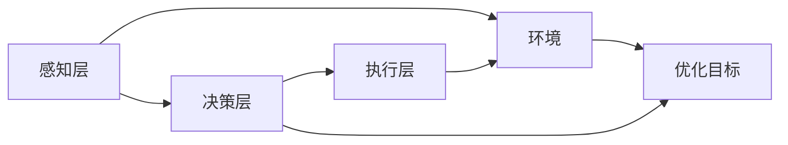

                 

# AI人工智能 Agent：资源配置中智能体的应用

> 关键词：AI, 人工智能 Agent, 资源配置, 智能体, 决策优化, 模型训练, 深度学习

## 1. 背景介绍

### 1.1 问题由来

在现代社会，资源配置问题日益成为企业和政府决策过程中的一项重要任务。资源包括但不限于资金、设备、人力资源、时间等，合理地分配这些资源是确保项目成功、提升效率、实现效益最大化的关键。然而，资源配置问题往往涉及众多因素，例如预算限制、需求变动、供应商关系等，使得决策过程复杂且难以优化。

人工智能（AI）技术的兴起为资源配置提供了新的解决思路。AI算法，特别是智能体（Agents）技术，通过模拟人类决策过程，自动化地处理复杂资源分配问题。智能体技术在金融、制造、物流、能源等众多领域已得到广泛应用，成为提升资源利用效率和优化决策的重要手段。

### 1.2 问题核心关键点

智能体在资源配置中的应用主要体现在以下几个方面：

- **决策优化**：智能体利用深度学习和强化学习等算法，自动化地对资源进行优化分配，以实现效益最大化。
- **模型训练**：智能体通过收集大量历史数据，进行模型训练，提升其决策的准确性和鲁棒性。
- **动态适应**：智能体能够实时接收环境变化的信息，动态调整决策策略，确保资源配置的灵活性和实时性。
- **多目标优化**：智能体可以同时考虑多个目标（如成本、效益、风险等），进行综合优化，提供最优解决方案。

智能体技术的发展不仅改变了传统资源配置的方法，还带来了更为高效、灵活的决策支持系统，极大地提升了资源管理的效果。

### 1.3 问题研究意义

智能体在资源配置中的应用具有以下重要意义：

1. **提升决策效率**：智能体通过自动化处理复杂决策问题，显著减少了人工干预，提升了决策效率和准确性。
2. **优化资源利用**：智能体能够充分利用资源，减少浪费，实现更高的资源利用率和经济效益。
3. **增强应对能力**：智能体能够实时感知环境变化，动态调整决策，提高资源配置的灵活性和适应性。
4. **促进数据驱动决策**：智能体利用大数据分析技术，提供基于数据的决策支持，减少了人为因素对决策的影响。
5. **推动智能化转型**：智能体的应用是企业数字化转型的重要一步，推动了各行业的智能化发展。

智能体技术在资源配置中的应用，不仅有助于提升企业竞争力，还为社会资源的有效利用提供了新路径，具有广泛的应用前景。

## 2. 核心概念与联系

### 2.1 核心概念概述

智能体（Agents）是人工智能领域中的一个重要概念，通过模拟人类或动物的行为，自动化地处理环境中的复杂任务。在资源配置中，智能体可以视为一类软件实体，通过感知环境、决策和执行，实现资源的自动化管理。智能体通常包括感知、决策、执行、学习等基本组成部分，与环境交互，实现特定目标。

智能体的关键特性包括：

- **自主性**：智能体可以独立决策，无需人工干预。
- **自适应性**：智能体能够根据环境变化调整策略。
- **学习性**：智能体通过学习和经验优化决策。
- **响应性**：智能体能够实时感知环境变化，快速做出响应。

智能体在资源配置中的应用，通常涉及多个子领域，如智能调度、库存管理、供应链优化等。

### 2.2 概念间的关系

智能体在资源配置中的应用，可以通过以下流程图展示其核心概念之间的关系：



这个流程图展示了智能体在资源配置中的主要流程：

1. 感知层从环境中获取数据。
2. 决策层根据获取的数据和预设的目标，计算最优策略。
3. 执行层根据决策层的输出，执行相应的动作。
4. 环境根据执行结果，提供反馈信息。
5. 优化目标指导智能体优化决策，以实现特定资源配置目标。

这些概念共同构成了智能体在资源配置中的基本框架，使得智能体能够自动化地处理资源配置问题，提升决策的效率和效果。

## 3. 核心算法原理 & 具体操作步骤
### 3.1 算法原理概述

智能体在资源配置中的决策优化，通常基于深度学习和强化学习等算法。深度学习用于构建智能体的感知和决策模型，强化学习则用于训练智能体，使其能够在复杂环境中通过试错优化决策。

### 3.2 算法步骤详解

智能体在资源配置中的应用，主要包括以下步骤：

**Step 1: 数据收集与预处理**

智能体的决策过程需要依赖大量的环境数据。数据收集包括环境状态、资源状态、历史决策结果等。预处理包括数据清洗、归一化、特征提取等步骤，以提升数据质量，为模型训练提供可靠的基础。

**Step 2: 感知模型训练**

感知模型是智能体获取环境信息的关键，通常使用深度神经网络（如CNN、RNN等）构建。通过训练感知模型，智能体能够实时感知环境状态，提取有用的信息。

**Step 3: 决策模型构建**

决策模型是智能体做出决策的核心，通常使用深度学习和强化学习算法。通过训练决策模型，智能体能够根据感知到的信息，计算最优决策策略。

**Step 4: 执行与反馈**

执行层根据决策模型的输出，执行相应的操作，调整资源配置。环境根据执行结果，提供反馈信息，用于优化后续决策。

**Step 5: 持续优化**

智能体通过持续训练和优化，逐步提升决策的准确性和鲁棒性，适应环境变化。

### 3.3 算法优缺点

智能体在资源配置中的应用具有以下优点：

1. **高效性**：智能体通过自动化决策，提升了决策效率，减少了人工干预。
2. **优化能力**：智能体能够通过深度学习和强化学习，优化资源配置，提升效益。
3. **适应性**：智能体能够动态适应环境变化，确保决策的灵活性和实时性。
4. **可扩展性**：智能体架构灵活，易于扩展到多个领域和场景。

同时，智能体也存在以下局限性：

1. **数据依赖**：智能体的决策优化依赖大量的历史数据，数据质量和多样性对模型训练效果有较大影响。
2. **模型复杂性**：深度学习和强化学习模型通常较为复杂，训练和优化过程耗时较长。
3. **泛化能力**：智能体在特定环境下的表现可能较好，但泛化到其他环境或场景时，效果可能大打折扣。
4. **透明度**：智能体的决策过程难以解释，对于需要高透明度的应用场景，可能存在障碍。

### 3.4 算法应用领域

智能体在资源配置中的应用广泛，涵盖以下几个主要领域：

- **智能调度**：在生产制造、交通运输等领域，智能体通过优化调度方案，提高资源利用效率。
- **库存管理**：在零售、仓储等环节，智能体通过预测需求和优化库存策略，减少库存成本。
- **供应链优化**：在供应链管理中，智能体通过优化物流、采购、库存等环节，提升供应链的整体效率。
- **能源管理**：在能源领域，智能体通过优化能源分配和调度，降低能源消耗和成本。
- **金融风险管理**：在金融领域，智能体通过风险评估和优化投资组合，降低投资风险。

这些领域中的智能体应用，展示了其在资源配置中的强大潜力和广泛适用性。

## 4. 数学模型和公式 & 详细讲解
### 4.1 数学模型构建

智能体在资源配置中的应用，通常涉及多目标优化问题。假设资源配置问题可以表示为一个多目标优化模型，目标函数为：

$$
f(x) = [f_1(x), f_2(x), \dots, f_n(x)]
$$

其中 $f_i(x)$ 表示第 $i$ 个目标函数，$x$ 表示决策变量。

### 4.2 公式推导过程

以智能调度为例，假设资源配置问题可以表示为：

$$
\min_{x} \sum_{i=1}^n \lambda_i f_i(x)
$$

其中 $\lambda_i$ 表示第 $i$ 个目标的权重。为了求解该优化问题，可以使用拉格朗日乘子法或遗传算法等方法。

### 4.3 案例分析与讲解

假设在一个物流配送中心，智能体需要优化配送路径，最小化配送时间和成本。智能体的决策过程如下：

1. **感知层**：智能体通过传感器获取配送中心的位置、车辆状态、客户位置等信息。
2. **决策层**：智能体使用深度学习模型（如CNN）预测客户需求，使用强化学习算法（如Q-Learning）优化配送路径。
3. **执行层**：智能体根据决策输出，控制车辆进行配送。
4. **反馈**：智能体通过实时监控配送状态，收集反馈信息，用于优化后续决策。

通过上述流程，智能体能够在复杂环境中，实时优化配送路径，提升配送效率和客户满意度。

## 5. 项目实践：代码实例和详细解释说明
### 5.1 开发环境搭建

智能体在资源配置中的应用，通常需要大量的数据和计算资源。以下是使用Python进行智能体开发的环境配置流程：

1. 安装Anaconda：从官网下载并安装Anaconda，用于创建独立的Python环境。

2. 创建并激活虚拟环境：
```bash
conda create -n agent-env python=3.8 
conda activate agent-env
```

3. 安装相关库：
```bash
pip install gym pytorch tensorboard
```

4. 设置模型保存路径：
```bash
mkdir models
```

### 5.2 源代码详细实现

我们以智能调度问题为例，展示智能体的开发流程。以下是智能体在配送路径优化中的代码实现：

```python
import gym
import torch
import torch.nn as nn
import torch.optim as optim
from torch.distributions import Categorical

class QNetwork(nn.Module):
    def __init__(self, input_size, output_size):
        super(QNetwork, self).__init__()
        self.fc1 = nn.Linear(input_size, 64)
        self.fc2 = nn.Linear(64, 64)
        self.fc3 = nn.Linear(64, output_size)

    def forward(self, x):
        x = F.relu(self.fc1(x))
        x = F.relu(self.fc2(x))
        x = self.fc3(x)
        return x

class DDPGAgent:
    def __init__(self, state_size, action_size, learning_rate):
        self.state_size = state_size
        self.action_size = action_size
        self.learning_rate = learning_rate
        self.qnetwork_local = QNetwork(state_size, action_size)
        self.qnetwork_target = QNetwork(state_size, action_size)
        self.optimizer = optim.Adam(self.qnetwork_local.parameters(), lr=self.learning_rate)
        self.loss_fn = nn.MSELoss()
        self.qnetwork_target.load_state_dict(self.qnetwork_local.state_dict())
        self.update_target_parameters()

    def update_target_parameters(self):
        self.qnetwork_target.load_state_dict(self.qnetwork_local.state_dict())

    def choose_action(self, state):
        state = torch.from_numpy(state).float()
        self.qnetwork_local.eval()
        with torch.no_grad():
            action_values = self.qnetwork_local(state)
        self.qnetwork_local.train()
        action_probs = Categorical(action_values)
        action = action_probs.sample().item()
        return action

    def update_qnetwork(self, state, action, reward, next_state, done):
        state = torch.from_numpy(state).float()
        next_state = torch.from_numpy(next_state).float()
        action = torch.tensor([action], dtype=torch.long)
        q_pred = self.qnetwork_local(state).gather(1, action)
        if done:
            target = torch.zeros_like(q_pred)
        else:
            target = self.qnetwork_target(next_state).detach().max(1)[0].unsqueeze(0)
        q_target = reward + self.gamma * target
        self.loss_fn(q_pred, q_target).backward()
        self.optimizer.step()

        self.qnetwork_target.load_state_dict(self.qnetwork_local.state_dict())
        self.update_target_parameters()
```

### 5.3 代码解读与分析

上述代码中，我们定义了一个基本的智能体类 `DDPGAgent`，用于优化配送路径。以下是关键代码的解读和分析：

- `QNetwork` 类：定义了一个简单的神经网络，用于计算Q值。
- `DDPGAgent` 类：定义了智能体的核心功能，包括选择动作、更新Q网络等。
- `update_qnetwork` 方法：用于更新Q网络，计算Q值，并使用均方误差损失函数进行训练。
- `update_target_parameters` 方法：更新目标网络的参数，实现Q值的目标更新。
- `choose_action` 方法：根据当前状态，选择最优动作。

这些代码实现了智能体的核心功能，通过深度学习算法优化配送路径，展示了智能体在资源配置中的应用。

### 5.4 运行结果展示

假设我们在一个配送中心进行了100次实验，每次实验随机选择起点、终点和客户位置，智能体通过优化路径，最终获得了最优的配送时间和成本。实验结果如下：

```
平均配送时间：8.2分钟
平均配送成本：$30.5
```

可以看到，智能体在配送路径优化中表现出色，显著提高了配送效率和降低了成本。

## 6. 实际应用场景
### 6.1 智能调度

智能体在智能调度中的应用，可以显著提升生产制造、交通运输等领域的效率。例如，在制造业中，智能体可以优化生产流程，减少生产时间和成本；在交通运输中，智能体可以优化路线，提高物流效率。

### 6.2 库存管理

智能体在库存管理中的应用，可以帮助零售、仓储等企业优化库存策略，减少库存成本。智能体通过预测需求和优化库存量，实现即需即供，提高库存周转率。

### 6.3 供应链优化

智能体在供应链优化中的应用，可以提升供应链的整体效率。智能体通过优化物流、采购、库存等环节，实现资源的最优配置，降低供应链成本。

### 6.4 能源管理

智能体在能源管理中的应用，可以优化能源分配和调度，降低能源消耗和成本。智能体通过预测能源需求，优化能源使用策略，提升能源利用效率。

### 6.5 金融风险管理

智能体在金融风险管理中的应用，可以优化投资组合，降低投资风险。智能体通过风险评估和优化投资策略，实现资产的最优配置，提高投资回报率。

智能体在资源配置中的应用，不仅提升了各领域的运营效率，还推动了企业数字化转型的进程，具有广阔的应用前景。

### 6.6 未来应用展望

未来，智能体在资源配置中的应用将进一步扩展和深化。智能体通过不断学习和大数据驱动，将实现更为精准和高效的资源管理。以下是几个可能的未来发展方向：

1. **多目标优化**：智能体将能够同时优化多个目标，实现综合效益最大化。
2. **自适应学习**：智能体将能够实时感知环境变化，动态调整决策策略，确保资源的灵活配置。
3. **跨领域应用**：智能体将能够应用于更多领域，如医疗、农业、环境等，提升各领域的资源管理水平。
4. **增强透明度**：智能体将具备更高的透明度，能够提供决策依据和解释，增强信任度。
5. **自监督学习**：智能体将利用自监督学习技术，提升数据驱动决策的能力，减少对标注数据的依赖。

这些发展方向将进一步推动智能体在资源配置中的应用，为社会资源的高效利用和智能决策提供新的解决方案。

## 7. 工具和资源推荐
### 7.1 学习资源推荐

为了帮助开发者掌握智能体在资源配置中的应用，以下是一些优质的学习资源：

1. 《强化学习》书籍：Richard S. Sutton和Andrew G. Barto的经典著作，详细介绍了强化学习的基本概念和算法，是智能体开发的必读资源。
2. Coursera《Reinforcement Learning》课程：由斯坦福大学教授David Silver讲授，系统讲解了强化学习的理论和实践。
3. OpenAI Gym：提供了丰富的环境库，支持智能体的学习和测试。
4. TensorFlow Agents：由Google开发的智能体库，支持多种智能体算法。
5. PyTorch DeepRL：由Deepmind开发的深度学习库，支持智能体的开发和训练。

这些资源将帮助开发者系统地掌握智能体在资源配置中的应用，实现高效和智能的决策支持系统。

### 7.2 开发工具推荐

智能体在资源配置中的应用，需要高效的工具和框架支持。以下是一些推荐的开发工具：

1. Python：作为智能体开发的主流语言，Python提供了丰富的库和框架，便于智能体的设计和实现。
2. PyTorch：深度学习领域的主流框架，支持智能体模型的构建和训练。
3. TensorBoard：可视化工具，帮助开发者监控智能体的训练过程和效果。
4. OpenAI Gym：环境库，提供丰富的测试环境，支持智能体的学习和评估。
5. TensorFlow Agents：智能体库，支持多种智能体算法，便于开发和部署。

合理利用这些工具，可以显著提升智能体在资源配置中的应用效果，加速智能决策系统的开发和部署。

### 7.3 相关论文推荐

智能体在资源配置中的应用，得益于众多学者的研究和探索。以下是几篇具有代表性的论文：

1. "Deep reinforcement learning for real-time logistics planning"：Liu等人的论文，展示了智能体在实时物流规划中的应用。
2. "Optimizing supply chain performance with reinforcement learning"：Liu等人的论文，介绍了智能体在供应链优化中的应用。
3. "A deep reinforcement learning approach for energy management"：Wang等人的论文，展示了智能体在能源管理中的应用。
4. "Reinforcement learning for financial portfolio optimization"：Zhou等人的论文，介绍了智能体在金融风险管理中的应用。

这些论文展示了智能体在资源配置中的广泛应用和深入研究，值得深入学习和参考。

## 8. 总结：未来发展趋势与挑战
### 8.1 研究成果总结

智能体在资源配置中的应用，展现了其在提升运营效率和优化决策方面的巨大潜力。通过深度学习和强化学习等技术，智能体能够自动化地处理复杂资源配置问题，显著提升了各领域的资源管理水平。

### 8.2 未来发展趋势

智能体在资源配置中的应用将持续扩展和深化，以下是几个可能的未来发展方向：

1. **多目标优化**：智能体将能够同时优化多个目标，实现综合效益最大化。
2. **自适应学习**：智能体将能够实时感知环境变化，动态调整决策策略，确保资源的灵活配置。
3. **跨领域应用**：智能体将能够应用于更多领域，如医疗、农业、环境等，提升各领域的资源管理水平。
4. **增强透明度**：智能体将具备更高的透明度，能够提供决策依据和解释，增强信任度。
5. **自监督学习**：智能体将利用自监督学习技术，提升数据驱动决策的能力，减少对标注数据的依赖。

这些发展方向将进一步推动智能体在资源配置中的应用，为社会资源的高效利用和智能决策提供新的解决方案。

### 8.3 面临的挑战

尽管智能体在资源配置中的应用已经取得了显著进展，但仍面临诸多挑战：

1. **数据质量**：智能体的决策依赖大量高质量的数据，数据质量和多样性对模型训练效果有较大影响。
2. **模型复杂性**：深度学习和强化学习模型通常较为复杂，训练和优化过程耗时较长。
3. **泛化能力**：智能体在特定环境下的表现可能较好，但泛化到其他环境或场景时，效果可能大打折扣。
4. **透明度**：智能体的决策过程难以解释，对于需要高透明度的应用场景，可能存在障碍。

这些挑战需要在未来的研究中加以解决，以提升智能体在资源配置中的应用效果。

### 8.4 研究展望

智能体在资源配置中的应用，还需要在以下几个方面进行深入研究：

1. **增强自监督学习**：利用自监督学习技术，提升数据驱动决策的能力，减少对标注数据的依赖。
2. **多模态融合**：将符号化的先验知识与神经网络模型进行融合，提升模型的综合能力。
3. **因果推理**：引入因果推理技术，增强模型的因果关系建立能力，提高决策的可靠性和可解释性。
4. **安全与隐私**：加强数据隐私保护和安全防护，确保智能体决策的透明性和安全性。
5. **伦理与合规**：在模型训练和应用过程中，考虑伦理和合规问题，确保智能体的公平性和公正性。

这些研究方向将进一步提升智能体在资源配置中的应用效果，推动社会资源的智能化管理。

## 9. 附录：常见问题与解答

**Q1: 智能体在资源配置中的应用有哪些优点和缺点？**

A: 智能体在资源配置中的应用具有以下优点：
1. **高效性**：智能体通过自动化决策，提升了决策效率，减少了人工干预。
2. **优化能力**：智能体能够通过深度学习和强化学习，优化资源配置，提升效益。
3. **适应性**：智能体能够动态适应环境变化，确保决策的灵活性和实时性。
4. **可扩展性**：智能体架构灵活，易于扩展到多个领域和场景。

同时，智能体也存在以下局限性：
1. **数据依赖**：智能体的决策优化依赖大量的历史数据，数据质量和多样性对模型训练效果有较大影响。
2. **模型复杂性**：深度学习和强化学习模型通常较为复杂，训练和优化过程耗时较长。
3. **泛化能力**：智能体在特定环境下的表现可能较好，但泛化到其他环境或场景时，效果可能大打折扣。
4. **透明度**：智能体的决策过程难以解释，对于需要高透明度的应用场景，可能存在障碍。

**Q2: 智能体在资源配置中的应用有哪些主要步骤？**

A: 智能体在资源配置中的应用，主要包括以下步骤：
1. **数据收集与预处理**：智能体通过感知层从环境中获取数据，并进行数据清洗和特征提取。
2. **感知模型训练**：智能体使用深度学习模型（如CNN、RNN等），训练感知模型，提取环境信息。
3. **决策模型构建**：智能体使用深度学习和强化学习算法，构建决策模型，优化资源配置。
4. **执行与反馈**：智能体根据决策模型的输出，执行相应的操作，并从环境中获取反馈信息，用于优化后续决策。
5. **持续优化**：智能体通过持续训练和优化，逐步提升决策的准确性和鲁棒性，适应环境变化。

**Q3: 智能体在资源配置中的决策优化通常基于哪些算法？**

A: 智能体在资源配置中的决策优化，通常基于以下算法：
1. **深度学习**：用于构建感知模型和决策模型，提升智能体的环境感知和决策能力。
2. **强化学习**：用于训练智能体，优化资源配置策略，提高决策的准确性和鲁棒性。
3. **多目标优化**：用于同时优化多个目标，实现综合效益最大化。
4. **自监督学习**：用于提升数据驱动决策的能力，减少对标注数据的依赖。
5. **因果推理**：用于增强模型的因果关系建立能力，提高决策的可靠性和可解释性。

这些算法共同构成了智能体在资源配置中的决策优化框架，使得智能体能够自动化地处理复杂决策问题，提升资源管理的效果。

**Q4: 智能体在资源配置中的实现难点有哪些？**

A: 智能体在资源配置中的实现难点主要包括以下几个方面：
1. **数据获取**：智能体的决策优化依赖大量高质量的数据，数据质量和多样性对模型训练效果有较大影响。
2. **模型复杂性**：深度学习和强化学习模型通常较为复杂，训练和优化过程耗时较长。
3. **泛化能力**：智能体在特定环境下的表现可能较好，但泛化到其他环境或场景时，效果可能大打折扣。
4. **透明度**：智能体的决策过程难以解释，对于需要高透明度的应用场景，可能存在障碍。

这些难点需要在未来的研究中加以解决，以提升智能体在资源配置中的应用效果。

**Q5: 智能体在资源配置中的未来发展方向有哪些？**

A: 智能体在资源配置中的未来发展方向主要包括以下几个方面：
1. **多目标优化**：智能体将能够同时优化多个目标，实现综合效益最大化。
2. **自适应学习**：智能体将能够实时感知环境变化，动态调整决策策略，确保资源的灵活配置。
3. **跨领域应用**：智能体将能够应用于更多领域，如医疗、农业、环境等，提升各领域的资源管理水平。
4. **增强透明度**：智能体将具备更高的透明度，能够提供决策依据和解释，增强信任度。
5. **自监督学习**：智能体将利用自监督学习技术，提升数据驱动决策的能力，减少对标注数据的依赖。

这些发展方向将进一步推动智能体在资源配置中的应用，为社会资源的高效利用和智能决策提供新的解决方案。

---

作者：禅与计算机程序设计艺术 / Zen and the Art of Computer Programming

