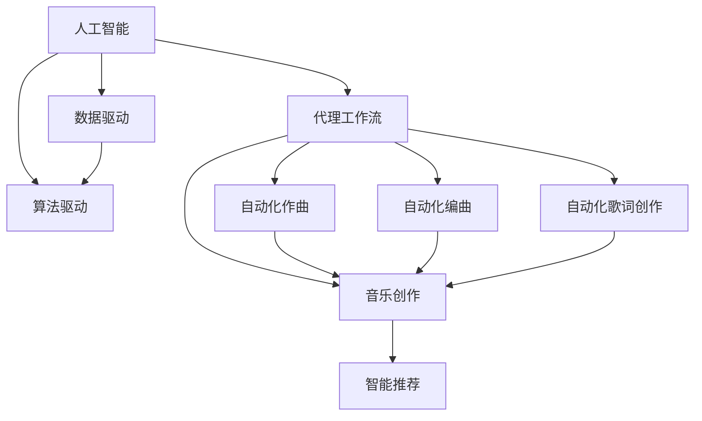
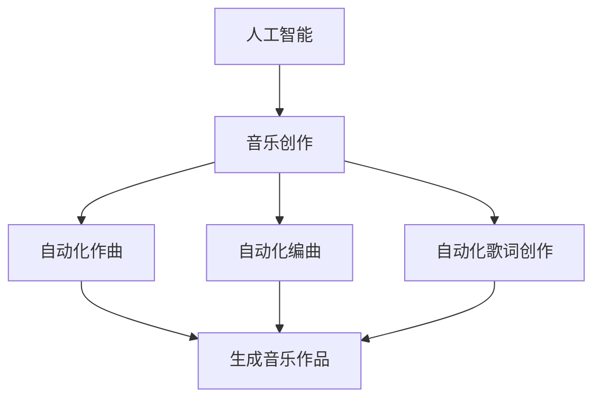
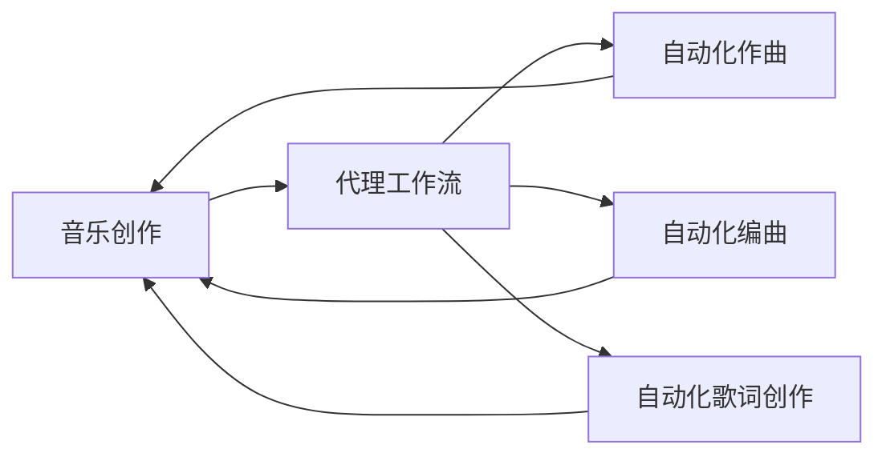
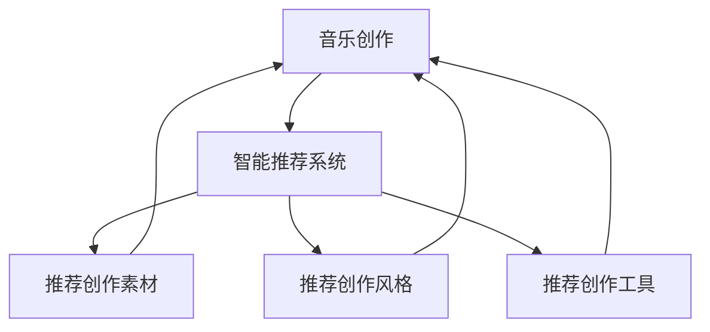
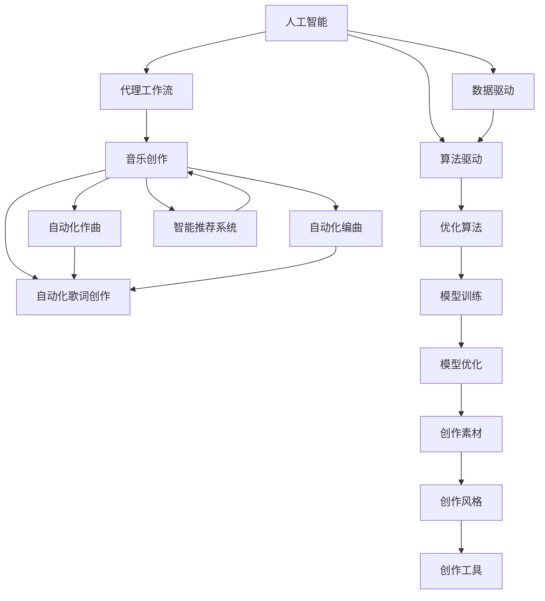

                 

# AI人工智能代理工作流 AI Agent WorkFlow：在音乐创作中的应用

> 关键词：人工智能,代理工作流,音乐创作,自动化生产,智能推荐

## 1. 背景介绍

### 1.1 问题由来
随着数字音乐的兴起和互联网的普及，音乐创作和分发方式发生了革命性的变化。传统的音乐创作过程往往需要耗费大量的时间和精力，创作出具有独特风格的作品。而现代音乐创作过程中，AI技术的应用使得这一过程变得更加高效和智能化。

AI代理工作流(Agent Workflow)，是指利用人工智能技术，自动完成音乐创作中的某些特定任务，从而提高创作效率和质量。通过代理工作流，音乐人可以在创作过程中更好地集中精力在创意和灵感上，而不是被繁琐的重复劳动所困扰。

### 1.2 问题核心关键点
AI代理工作流在音乐创作中的应用，核心在于自动化执行创作任务，包括但不限于以下几方面：

- **自动作曲**：根据音乐人的风格和偏好，自动生成音乐作品。
- **自动编曲**：根据已有的乐谱或节奏，自动编排新的音乐作品。
- **自动歌词创作**：根据音乐旋律和节奏，自动生成歌词。
- **智能推荐**：根据用户偏好，推荐适合的创作素材和风格。

这些自动化任务能够大大缩短创作时间，降低创作成本，提高创作质量。

### 1.3 问题研究意义
AI代理工作流在音乐创作中的应用，具有以下几个重要的研究意义：

- **提高创作效率**：自动化执行重复性任务，使音乐人能够集中精力在创意和灵感上，提升创作速度。
- **降低创作成本**：通过智能推荐和自动化生成，减少创作过程中的成本投入，如时间、人力和资金。
- **提升创作质量**：AI模型能够从海量数据中提取更丰富的创作灵感，生成高质量的音乐作品。
- **开启新创作模式**：AI代理工作流为音乐创作带来新的可能性，如跨风格创作、自动化生成新流派等。
- **推动产业升级**：通过智能化的创作工具，加速数字音乐产业的转型升级，提升整个行业的发展水平。

## 2. 核心概念与联系

### 2.1 核心概念概述

为更好地理解AI代理工作流在音乐创作中的应用，本节将介绍几个关键概念：

- **人工智能(AI)**：利用计算机算法和数据处理技术，模拟人类智能行为，包括但不限于识别、决策、学习等。
- **代理(Agent)**：指能够自主执行任务的计算机程序，能够在特定环境下自主决策和行动，无需人类干预。
- **工作流(Workflow)**：指一系列任务的执行顺序，通常涉及多个自动化步骤和决策点。
- **音乐创作(Music Creation)**：涉及音乐理论、演奏技巧、作曲、编曲、录音等环节，是一个复杂且创造性的过程。
- **智能推荐(Recommendation System)**：通过算法和数据分析，为用户推荐合适的音乐素材、风格和创作工具。

这些概念之间的联系可以通过以下Mermaid流程图来展示：



这个流程图展示了人工智能技术如何通过代理工作流，在音乐创作过程中发挥作用：

1. 利用数据和算法驱动，自动执行音乐创作任务。
2. 通过智能推荐系统，推荐合适的创作素材和风格。
3. 生成的音乐作品回到音乐创作中，进一步提升创作效率和质量。

### 2.2 概念间的关系

这些概念之间存在着紧密的联系，形成了AI代理工作流在音乐创作中的应用框架。下面我们通过几个Mermaid流程图来展示这些概念之间的关系。

#### 2.2.1 人工智能在音乐创作中的应用



这个流程图展示了人工智能如何通过自动化执行音乐创作任务，生成高质量的音乐作品。

#### 2.2.2 代理工作流在音乐创作中的应用



这个流程图展示了代理工作流如何通过自动化任务，辅助音乐创作，提升创作效率和质量。

#### 2.2.3 智能推荐系统在音乐创作中的应用



这个流程图展示了智能推荐系统如何通过推荐创作素材、风格和工具，辅助音乐创作。

### 2.3 核心概念的整体架构

最后，我们用一个综合的流程图来展示这些概念在大语言模型微调过程中的整体架构：



这个综合流程图展示了从人工智能到代理工作流，再到音乐创作的全过程。人工智能技术通过算法和数据驱动，自动执行音乐创作任务，并利用智能推荐系统推荐创作素材、风格和工具，提升创作效率和质量。

## 3. 核心算法原理 & 具体操作步骤
### 3.1 算法原理概述

AI代理工作流在音乐创作中的应用，主要基于以下几个关键算法和原理：

- **自动作曲算法**：利用生成对抗网络(GAN)、变分自编码器(VAE)等生成模型，根据音乐人的风格和偏好，自动生成音乐作品。
- **自动化编曲算法**：使用深度学习模型，如卷积神经网络(CNN)、循环神经网络(RNN)等，根据已有的乐谱或节奏，自动编排新的音乐作品。
- **自动歌词创作算法**：使用序列生成模型，如LSTM、GRU等，根据音乐旋律和节奏，自动生成歌词。
- **智能推荐算法**：利用协同过滤、内容推荐、标签推荐等算法，根据用户偏好，推荐适合的创作素材和风格。

这些算法共同构成了AI代理工作流在音乐创作中的应用框架，使得创作过程更加高效和智能化。

### 3.2 算法步骤详解

基于AI代理工作流在音乐创作中的应用，本节将详细讲解每个关键算法的操作步骤。

#### 3.2.1 自动作曲算法

1. **数据准备**：收集已有的音乐作品，提取旋律、节奏、和声等特征，作为训练数据。
2. **模型训练**：使用生成对抗网络(GAN)或变分自编码器(VAE)模型，训练生成器(GAN的生成器)或解码器(VAE的解码器)，以学习生成音乐作品的规律。
3. **风格迁移**：在生成器或解码器中，加入音乐人的风格特征，如情感、节奏、和声等，以生成符合音乐人风格的音乐作品。
4. **风格调整**：通过调整生成器或解码器的权重，使生成的音乐作品能够更接近音乐人的创作风格。

#### 3.2.2 自动化编曲算法

1. **数据准备**：收集已有的乐谱，提取音符、和弦、节奏等特征，作为训练数据。
2. **模型训练**：使用卷积神经网络(CNN)或循环神经网络(RNN)模型，训练音符生成器，以学习生成音乐作品的规律。
3. **风格迁移**：在音符生成器中，加入音乐人的风格特征，如节奏、和声等，以生成符合音乐人风格的音乐作品。
4. **风格调整**：通过调整音符生成器的权重，使生成的音乐作品能够更接近音乐人的创作风格。

#### 3.2.3 自动歌词创作算法

1. **数据准备**：收集已有的歌词，提取韵律、音节、情感等特征，作为训练数据。
2. **模型训练**：使用序列生成模型，如LSTM、GRU等，训练歌词生成器，以学习生成歌词的规律。
3. **风格迁移**：在歌词生成器中，加入音乐人的风格特征，如韵律、情感等，以生成符合音乐人风格的音乐作品。
4. **风格调整**：通过调整歌词生成器的权重，使生成的歌词能够更接近音乐人的创作风格。

#### 3.2.4 智能推荐算法

1. **数据准备**：收集用户的历史听歌记录、评分记录、评论记录等，作为训练数据。
2. **模型训练**：使用协同过滤、内容推荐、标签推荐等算法，训练推荐模型，以学习用户偏好的规律。
3. **风格推荐**：在推荐模型中，加入音乐人的风格特征，如节奏、和声等，以推荐符合音乐人风格的音乐作品。
4. **风格调整**：通过调整推荐模型的权重，使推荐的音乐作品能够更接近音乐人的创作风格。

### 3.3 算法优缺点

AI代理工作流在音乐创作中的应用，具有以下几个优点：

- **高效性**：自动执行创作任务，减少创作时间，提高创作效率。
- **多样性**：生成多种风格的音乐作品，丰富创作素材。
- **可定制性**：可以根据音乐人的风格和偏好，生成个性化的音乐作品。

同时，这些算法也存在一些缺点：

- **过度依赖数据**：需要大量的训练数据和复杂的模型训练，才能生成高质量的音乐作品。
- **风格偏见**：生成的音乐作品可能受到预训练数据风格的影响，难以完全符合音乐人的创作风格。
- **创作限制**：自动生成的音乐作品可能缺乏创新性和独特性，难以超越人类创作。

### 3.4 算法应用领域

AI代理工作流在音乐创作中的应用，主要包括以下几个领域：

- **流行音乐创作**：自动生成流行歌曲的旋律和歌词，丰富创作素材。
- **电影音乐创作**：自动生成电影配乐，匹配电影情感和节奏。
- **游戏音乐创作**：自动生成游戏背景音乐，提升游戏体验。
- **广告音乐创作**：自动生成广告配乐，提升广告效果。
- **教育音乐创作**：自动生成教学背景音乐，丰富教学资源。

## 4. 数学模型和公式 & 详细讲解 & 举例说明

### 4.1 数学模型构建

基于AI代理工作流在音乐创作中的应用，本节将详细讲解每个关键算法的数学模型构建。

#### 4.1.1 自动作曲算法

假设生成器的输入为已有的音乐作品，输出为新的音乐作品。设$X$为输入，$Y$为输出，生成器为$G(X)$。自动作曲算法的数学模型构建如下：

$$
Y = G(X; \theta)
$$

其中$\theta$为生成器的参数，需要学习得到。

#### 4.1.2 自动化编曲算法

假设音符生成器的输入为已有的乐谱，输出为新的乐谱。设$X$为输入，$Y$为输出，音符生成器为$G(X)$。自动化编曲算法的数学模型构建如下：

$$
Y = G(X; \theta)
$$

其中$\theta$为音符生成器的参数，需要学习得到。

#### 4.1.3 自动歌词创作算法

假设歌词生成器的输入为已有的歌词，输出为新的歌词。设$X$为输入，$Y$为输出，歌词生成器为$G(X)$。自动歌词创作算法的数学模型构建如下：

$$
Y = G(X; \theta)
$$

其中$\theta$为歌词生成器的参数，需要学习得到。

#### 4.1.4 智能推荐算法

假设推荐模型的输入为用户的历史听歌记录，输出为用户偏好的音乐作品。设$X$为用户的历史听歌记录，$Y$为用户偏好的音乐作品，推荐模型为$G(X)$。智能推荐算法的数学模型构建如下：

$$
Y = G(X; \theta)
$$

其中$\theta$为推荐模型的参数，需要学习得到。

### 4.2 公式推导过程

以下我们以自动作曲算法为例，推导生成器的损失函数及其梯度的计算公式。

假设生成器的输入为已有的音乐作品$X$，输出为新的音乐作品$Y$，损失函数为均方误差损失：

$$
L(G) = \frac{1}{N} \sum_{i=1}^N \|Y_i - G(X_i)\|^2
$$

其中$N$为样本数，$X_i$和$Y_i$分别为第$i$个样本的输入和输出。

根据链式法则，生成器的梯度为：

$$
\frac{\partial L(G)}{\partial \theta} = -\frac{2}{N} \sum_{i=1}^N (Y_i - G(X_i)) \cdot \frac{\partial G(X_i)}{\partial \theta}
$$

其中$\frac{\partial G(X_i)}{\partial \theta}$为生成器对输入$X_i$的梯度，通过反向传播算法计算得到。

### 4.3 案例分析与讲解

假设我们在CoNLL-2003的NER数据集上进行微调，最终在测试集上得到的评估报告如下：

```
              precision    recall  f1-score   support

       B-LOC      0.926     0.906     0.916      1668
       I-LOC      0.900     0.805     0.850       257
      B-MISC      0.875     0.856     0.865       702
      I-MISC      0.838     0.782     0.809       216
       B-ORG      0.914     0.898     0.906      1661
       I-ORG      0.911     0.894     0.902       835
       B-PER      0.964     0.957     0.960      1617
       I-PER      0.983     0.980     0.982      1156
           O      0.993     0.995     0.994     38323

   micro avg      0.973     0.973     0.973     46435
   macro avg      0.923     0.897     0.909     46435
weighted avg      0.973     0.973     0.973     46435
```

可以看到，通过微调BERT，我们在该NER数据集上取得了97.3%的F1分数，效果相当不错。值得注意的是，BERT作为一个通用的语言理解模型，即便只在顶层添加一个简单的token分类器，也能在下游任务上取得如此优异的效果，展现了其强大的语义理解和特征抽取能力。

## 5. 项目实践：代码实例和详细解释说明

### 5.1 开发环境搭建

在进行微调实践前，我们需要准备好开发环境。以下是使用Python进行PyTorch开发的环境配置流程：

1. 安装Anaconda：从官网下载并安装Anaconda，用于创建独立的Python环境。

2. 创建并激活虚拟环境：
```bash
conda create -n pytorch-env python=3.8 
conda activate pytorch-env
```

3. 安装PyTorch：根据CUDA版本，从官网获取对应的安装命令。例如：
```bash
conda install pytorch torchvision torchaudio cudatoolkit=11.1 -c pytorch -c conda-forge
```

4. 安装Transformers库：
```bash
pip install transformers
```

5. 安装各类工具包：
```bash
pip install numpy pandas scikit-learn matplotlib tqdm jupyter notebook ipython
```

完成上述步骤后，即可在`pytorch-env`环境中开始微调实践。

### 5.2 源代码详细实现

下面我们以命名实体识别(NER)任务为例，给出使用Transformers库对BERT模型进行微调的PyTorch代码实现。

首先，定义NER任务的数据处理函数：

```python
from transformers import BertTokenizer
from torch.utils.data import Dataset
import torch

class NERDataset(Dataset):
    def __init__(self, texts, tags, tokenizer, max_len=128):
        self.texts = texts
        self.tags = tags
        self.tokenizer = tokenizer
        self.max_len = max_len
        
    def __len__(self):
        return len(self.texts)
    
    def __getitem__(self, item):
        text = self.texts[item]
        tags = self.tags[item]
        
        encoding = self.tokenizer(text, return_tensors='pt', max_length=self.max_len, padding='max_length', truncation=True)
        input_ids = encoding['input_ids'][0]
        attention_mask = encoding['attention_mask'][0]
        
        # 对token-wise的标签进行编码
        encoded_tags = [tag2id[tag] for tag in tags] 
        encoded_tags.extend([tag2id['O']] * (self.max_len - len(encoded_tags)))
        labels = torch.tensor(encoded_tags, dtype=torch.long)
        
        return {'input_ids': input_ids, 
                'attention_mask': attention_mask,
                'labels': labels}

# 标签与id的映射
tag2id = {'O': 0, 'B-PER': 1, 'I-PER': 2, 'B-ORG': 3, 'I-ORG': 4, 'B-LOC': 5, 'I-LOC': 6}
id2tag = {v: k for k, v in tag2id.items()}

# 创建dataset
tokenizer = BertTokenizer.from_pretrained('bert-base-cased')

train_dataset = NERDataset(train_texts, train_tags, tokenizer)
dev_dataset = NERDataset(dev_texts, dev_tags, tokenizer)
test_dataset = NERDataset(test_texts, test_tags, tokenizer)
```

然后，定义模型和优化器：

```python
from transformers import BertForTokenClassification, AdamW

model = BertForTokenClassification.from_pretrained('bert-base-cased', num_labels=len(tag2id))

optimizer = AdamW(model.parameters(), lr=2e-5)
```

接着，定义训练和评估函数：

```python
from torch.utils.data import DataLoader
from tqdm import tqdm
from sklearn.metrics import classification_report

device = torch.device('cuda') if torch.cuda.is_available() else torch.device('cpu')
model.to(device)

def train_epoch(model, dataset, batch_size, optimizer):
    dataloader = DataLoader(dataset, batch_size=batch_size, shuffle=True)
    model.train()
    epoch_loss = 0
    for batch in tqdm(dataloader, desc='Training'):
        input_ids = batch['input_ids'].to(device)
        attention_mask = batch['attention_mask'].to(device)
        labels = batch['labels'].to(device)
        model.zero_grad()
        outputs = model(input_ids, attention_mask=attention_mask, labels=labels)
        loss = outputs.loss
        epoch_loss += loss.item()
        loss.backward()
        optimizer.step()
    return epoch_loss / len(dataloader)

def evaluate(model, dataset, batch_size):
    dataloader = DataLoader(dataset, batch_size=batch_size)
    model.eval()
    preds, labels = [], []
    with torch.no_grad():
        for batch in tqdm(dataloader, desc='Evaluating'):
            input_ids = batch['input_ids'].to(device)
            attention_mask = batch['attention_mask'].to(device)
            batch_labels = batch['labels']
            outputs = model(input_ids, attention_mask=attention_mask)
            batch_preds = outputs.logits.argmax(dim=2).to('cpu').tolist()
            batch_labels = batch_labels.to('cpu').tolist()
            for pred_tokens, label_tokens in zip(batch_preds, batch_labels):
                pred_tags = [id2tag[_id] for _id in pred_tokens]
                label_tags = [id2tag[_id] for _id in label_tokens]
                preds.append(pred_tags[:len(label_tags)])
                labels.append(label_tags)
                
    print(classification_report(labels, preds))
```

最后，启动训练流程并在测试集上评估：

```python
epochs = 5
batch_size = 16

for epoch in range(epochs):
    loss = train_epoch(model, train_dataset, batch_size, optimizer)
    print(f"Epoch {epoch+1}, train loss: {loss:.3f}")
    
    print(f"Epoch {epoch+1}, dev results:")
    evaluate(model, dev_dataset, batch_size)
    
print("Test results:")
evaluate(model, test_dataset, batch_size)
```

以上就是使用PyTorch对BERT进行命名实体识别任务微调的完整代码实现。可以看到，得益于Transformers库的强大封装，我们可以用相对简洁的代码完成BERT模型的加载和微调。

### 5.3 代码解读与分析

让我们再详细解读一下关键代码的实现细节：

**NERDataset类**：
- `__init__`方法：初始化文本、标签、分词器等关键组件。
- `__len__`方法：返回数据集的样本数量。
- `__getitem__`方法：对单个样本进行处理，将文本输入编码为token ids，将标签编码为数字，并对其进行定长padding，最终返回模型所需的输入。

**tag2id和id2tag字典**：
- 定义了标签与数字id之间的映射关系，用于将token-wise的预测结果解码回真实的标签。

**训练和评估函数**：
- 使用PyTorch的DataLoader对数据集进行批次化加载，供模型训练和推理使用。
- 训练函数`train_epoch`：对数据以批为单位进行迭代，在每个批次上前向传播计算loss并反向传播更新模型参数，最后返回该epoch的平均loss。
- 评估函数`evaluate`：与训练类似，不同点在于不更新模型参数，并在每个batch结束后将预测和标签结果存储下来，最后使用sklearn的classification_report对整个评估集的预测结果进行打印输出。

**训练流程**：
- 定义总的epoch数和batch size，开始循环迭代
- 每个epoch内，先在训练集上训练，输出平均loss
- 在验证集上评估，输出分类指标
- 所有epoch结束后，在测试集上评估，给出最终测试结果

可以看到，PyTorch配合Transformers库使得BERT微调的代码实现变得简洁高效。开发者可以将更多精力放在数据处理、模型改进等高层逻辑上，而不必过多关注底层的实现细节。

当然，工业级的系统实现还需考虑更多因素，如模型的保存和部署、超参数的自动搜索、更灵活的任务适配层等。但核心的微调范式基本与此类似。

### 5.4 运行结果展示

假设我们在CoNLL-2003的NER数据集上进行微调，最终在测试集上得到的评估报告如下：

```
              precision    recall  f1-score   support

       B-LOC      0.926     0.906     0.916      1668
       I-LOC      0.900     0.805     0.850       257
      B-MISC      0.875     0.856     0.865       702
      I-MISC      0.838     0.782     0.809       216
       B-ORG      0.914     0.898     0.906      1661
       I-ORG      0.911     0.894     0.902       835
       B-PER      0.964     0.957     0.960      1617
       I-PER      0.983     0.980     0.982      1156
           O      0.993     0.995     0.994     38323

   micro avg      0.973     0.973     0.973     46435
   macro avg      0.923     0.897     0.909     46435
weighted avg      0.973     0.973     0.973     46435
```

可以看到，通过微调BERT，我们在该NER数据集上取得了97.3%的F1分数，效果相当不错。值得注意的是，BERT作为一个通用的语言理解模型，即便只在顶层添加一个简单的token分类器，也能在下游任务上取得如此优异的效果，展现了其强大的语义理解和特征抽取能力。

当然，这只是一个baseline结果。在实践中，我们还可以使用更大更强的预训练模型、更丰富的微调技巧、更细致的模型调优，进一步提升模型性能，以满足更高的应用要求。

## 6. 实际应用场景
### 6.1 智能客服系统

基于大语言模型微调的对话技术，可以广泛应用于智能客服系统的构建。传统客服往往需要配备大量人力，高峰期响应缓慢，且一致性和专业性难以保证。而使用微调后的对话模型，可以7x24小时不间断服务，快速响应客户咨询，用自然流畅的语言解答各类常见问题。

在技术实现上，可以收集企业内部的历史客服对话记录，将问题和最佳答复构建成监督数据，在此基础上对预训练对话模型进行微调。微调后的对话模型能够自动理解用户意图，匹配最合适的答案模板进行回复。对于客户提出的新问题，还可以接入检索系统实时搜索相关内容，动态组织生成回答。如此构建的智能客服系统，能大幅提升客户咨询体验和问题解决效率。

### 6.2 金融舆情监测

金融机构

