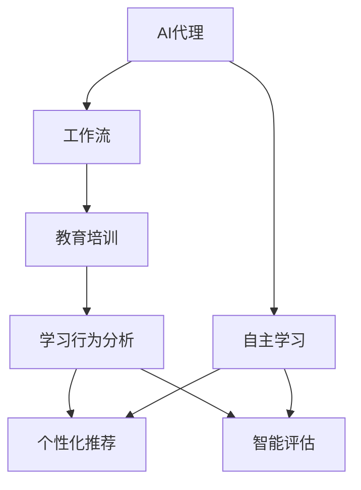
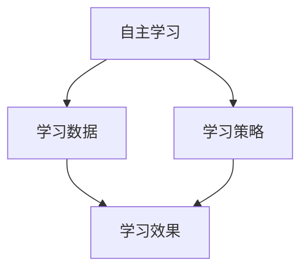
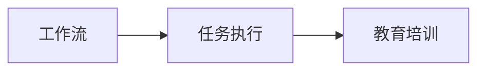
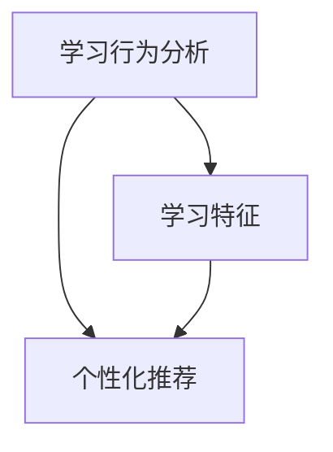
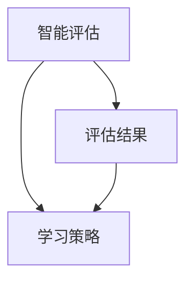
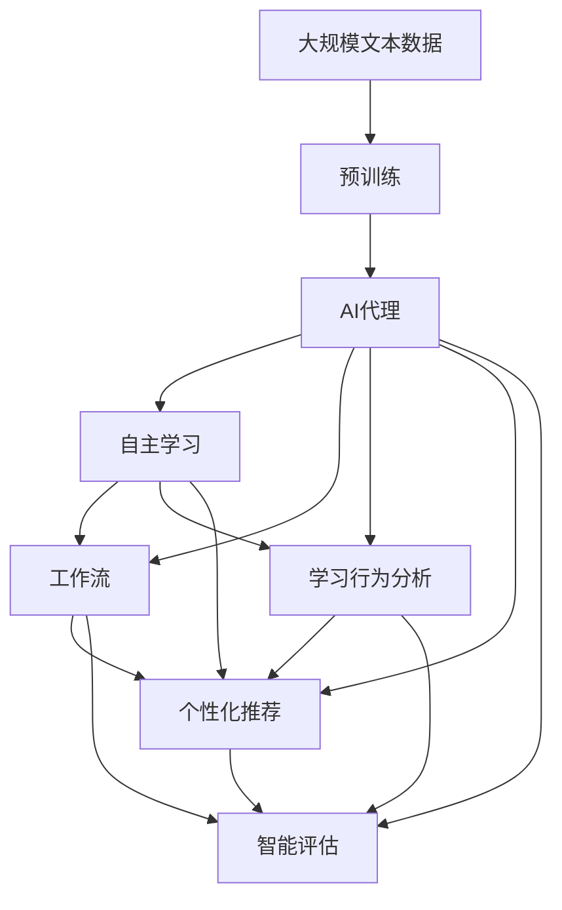

                 

# AI人工智能代理工作流AI Agent WorkFlow：在教育培训中运用自主学习代理

> 关键词：人工智能代理,自主学习,工作流,教育培训,学习行为分析,个性化推荐,智能评估

## 1. 背景介绍

### 1.1 问题由来
在当前的教育培训领域，个性化和智能化教学已成为热点话题。传统的以教师为中心的教学模式，难以满足学生多样化、个性化的学习需求。而人工智能技术，尤其是基于AI代理的智能教育系统，正逐步成为推动教育革新的重要力量。

AI代理（AI Agent）作为人工智能系统中的核心组件，具备自主感知、决策、交互和学习能力，可以自主地进行任务执行和知识更新。在教育培训场景中，AI代理可以与学生进行自然交互，提供个性化的学习建议和评估，甚至在特定情况下作为教师的辅助工具，从而极大地提升教学效果。

### 1.2 问题核心关键点
AI代理在教育培训中的应用，主要集中在以下几个方面：

1. **自主学习**：AI代理能够根据学生的学习行为数据，自主分析学习效果，优化学习策略，提供个性化的学习资源和建议。
2. **任务执行**：AI代理可以承担部分或全部教学任务，如自动批改作业、智能回答问题、生成教学内容等。
3. **交互反馈**：AI代理通过自然语言处理和情感计算，与学生进行实时交互，及时反馈学习效果和改进建议。
4. **协同教学**：AI代理可以作为教师的助手，协助完成教学管理、学生监测等任务，增强教学效果。

### 1.3 问题研究意义
研究AI代理在教育培训中的应用，对于提升教学质量、推动教育公平、促进终身学习具有重要意义：

1. **个性化教育**：AI代理能够根据学生的个性化需求和学习风格，提供量身定制的学习方案和资源，从而提升学习效果。
2. **智能化评估**：AI代理可以实时监控学生的学习进度和效果，进行智能化的评估和反馈，帮助学生及时发现和改进问题。
3. **高效教学**：AI代理可以承担部分教学任务，减轻教师负担，提高教学效率和效果。
4. **跨界融合**：AI代理不仅限于教育领域，还能与其他AI应用融合，推动智慧医疗、智能客服等行业的发展。
5. **技术推动**：AI代理的应用将推动人工智能技术在更广泛领域的应用，促进学科交叉和创新。

## 2. 核心概念与联系

### 2.1 核心概念概述

为更好地理解AI代理在教育培训中的应用，本节将介绍几个密切相关的核心概念：

- **AI代理（AI Agent）**：人工智能系统中的核心组件，具备自主感知、决策、交互和学习能力。
- **自主学习（Autonomous Learning）**：AI代理能够根据学习数据自主分析、调整学习策略，优化学习效果。
- **工作流（Workflow）**：一种系统化的流程管理技术，用于协调和自动化多个任务的执行。
- **教育培训（Education Training）**：旨在提升学习者的知识、技能和能力，以适应特定职业或学术要求的过程。
- **学习行为分析（Learning Behavior Analysis）**：通过分析学生的学习数据，评估其学习效果和行为特征，指导个性化推荐。
- **个性化推荐（Personalized Recommendation）**：根据学生的兴趣和需求，推荐符合其个性化的学习资源和内容。
- **智能评估（Intelligent Evaluation）**：通过自动化的方式进行评估，帮助学生及时了解学习效果，调整学习策略。

这些核心概念之间的逻辑关系可以通过以下Mermaid流程图来展示：



这个流程图展示了大语言模型微调过程中各个核心概念的相互关系：

1. AI代理具备自主学习能力，通过工作流管理系统，进行教育培训。
2. 学习行为分析模块帮助AI代理理解学生的学习特征，生成个性化推荐。
3. 智能评估模块基于AI代理的推荐结果，进行实时评估，进一步调整学习策略。

### 2.2 概念间的关系

这些核心概念之间存在着紧密的联系，形成了AI代理在教育培训中的应用框架。下面我通过几个Mermaid流程图来展示这些概念之间的关系。

#### 2.2.1 AI代理的学习范式



这个流程图展示了AI代理的自主学习过程：

1. AI代理根据学习数据（B）生成学习策略（C）。
2. 学习策略（C）进一步优化学习效果（D）。

#### 2.2.2 工作流与教育培训的协同



这个流程图展示了工作流与教育培训的协同关系：

1. 工作流（A）协调和管理多个任务的执行（B）。
2. 任务执行（B）支持教育培训（C）的顺利进行。

#### 2.2.3 学习行为分析与个性化推荐



这个流程图展示了学习行为分析与个性化推荐的关联：

1. 学习行为分析（A）提取学习特征（B）。
2. 学习特征（B）作为输入，生成个性化推荐（C）。

#### 2.2.4 智能评估与学习策略调整



这个流程图展示了智能评估与学习策略调整的流程：

1. 智能评估（A）生成评估结果（B）。
2. 评估结果（B）用于调整学习策略（C）。

### 2.3 核心概念的整体架构

最后，我们用一个综合的流程图来展示这些核心概念在AI代理在教育培训中的应用整体架构：



这个综合流程图展示了从预训练到AI代理自主学习的完整过程。AI代理首先在大规模文本数据上进行预训练，然后通过自主学习、工作流管理系统、学习行为分析、个性化推荐、智能评估等多个模块的协同工作，提供个性化的教育培训服务。 通过这些流程图，我们可以更清晰地理解AI代理在教育培训中的应用过程和各个模块的相互关系。

## 3. 核心算法原理 & 具体操作步骤
### 3.1 算法原理概述

AI代理在教育培训中的核心算法原理基于自主学习和工作流管理系统。其核心思想是：通过自主学习模块不断优化学习策略，利用工作流管理系统协调和管理多个任务的执行，从而实现个性化的教育培训目标。

形式化地，假设AI代理模型为 $M_{\theta}$，其中 $\theta$ 为模型参数。给定教育培训任务 $T$ 的学习数据集 $D=\{(x_i,y_i)\}_{i=1}^N, x_i \in \mathcal{X}, y_i \in \mathcal{Y}$，其中 $x_i$ 为学习行为特征，$y_i$ 为学习效果评价。AI代理的目标是找到最优参数 $\hat{\theta}$，使得模型在教育培训任务上的预测效果最优：

$$
\hat{\theta}=\mathop{\arg\min}_{\theta} \mathcal{L}(M_{\theta},D)
$$

其中 $\mathcal{L}$ 为针对任务 $T$ 设计的损失函数，用于衡量模型预测输出与真实标签之间的差异。常见的损失函数包括交叉熵损失、均方误差损失等。

通过梯度下降等优化算法，AI代理不断更新模型参数 $\theta$，最小化损失函数 $\mathcal{L}$，使得模型预测逼近真实标签。由于 $\theta$ 已经通过预训练获得了较好的初始化，因此即便在有限标注样本下，也能较快收敛到理想的模型参数 $\hat{\theta}$。

### 3.2 算法步骤详解

AI代理在教育培训中的应用，一般包括以下几个关键步骤：

**Step 1: 准备教育培训数据集**
- 收集和整理教育培训数据，包括学生的学习行为数据、成绩评估数据、作业提交记录等。
- 将数据划分为训练集、验证集和测试集，确保数据的多样性和代表性。

**Step 2: 选择合适的预训练模型和任务**
- 选择合适的预训练模型 $M_{\theta}$ 作为初始化参数，如BERT、GPT等。
- 定义教育培训任务的适配层，如分类、回归、生成等，以适应不同的任务类型。

**Step 3: 设置自主学习参数**
- 选择合适的优化算法及其参数，如Adam、SGD等，设置学习率、批大小、迭代轮数等。
- 设置正则化技术及强度，包括权重衰减、Dropout、Early Stopping等。
- 确定冻结预训练参数的策略，如仅微调顶层，或全部参数都参与微调。

**Step 4: 执行自主学习**
- 将训练集数据分批次输入模型，前向传播计算损失函数。
- 反向传播计算参数梯度，根据设定的优化算法和学习率更新模型参数。
- 周期性在验证集上评估模型性能，根据性能指标决定是否触发Early Stopping。
- 重复上述步骤直到满足预设的迭代轮数或Early Stopping条件。

**Step 5: 测试和部署**
- 在测试集上评估自主学习后模型 $M_{\hat{\theta}}$ 的性能，对比自主学习前后的精度提升。
- 使用自主学习后的模型对新学生进行学习行为分析，生成个性化推荐。
- 持续收集新的学习数据，定期重新自主学习模型，以适应数据分布的变化。

以上是AI代理在教育培训中的一般流程。在实际应用中，还需要针对具体任务的特点，对自主学习过程的各个环节进行优化设计，如改进训练目标函数，引入更多的正则化技术，搜索最优的超参数组合等，以进一步提升模型性能。

### 3.3 算法优缺点

AI代理在教育培训中的应用，具有以下优点：

1. **个性化教育**：通过分析学生的学习数据，AI代理能够提供量身定制的学习方案和资源，提升学习效果。
2. **智能化评估**：AI代理可以实时监控学生的学习进度和效果，进行智能化的评估和反馈，帮助学生及时发现和改进问题。
3. **高效教学**：AI代理可以承担部分或全部教学任务，减轻教师负担，提高教学效率和效果。
4. **跨界融合**：AI代理的应用不仅限于教育领域，还能与其他AI应用融合，推动智慧医疗、智能客服等行业的发展。

同时，该方法也存在一定的局限性：

1. **依赖数据质量**：AI代理的效果很大程度上取决于学习数据的全面性和准确性。数据采集和标注的成本较高，可能影响应用的广泛性。
2. **技术门槛较高**：AI代理的开发和维护需要一定的技术背景和资源投入，普通教育机构难以实现。
3. **隐私和伦理问题**：AI代理需要处理大量的学生数据，涉及隐私保护和伦理问题，需要严格的数据使用和管理制度。
4. **知识迁移能力有限**：当新学生的学习特征与已有数据分布差异较大时，AI代理的效果可能受到影响。

尽管存在这些局限性，但就目前而言，AI代理在教育培训中的应用已经展现出显著的优势和潜力，成为推动教育智能化、个性化发展的关键技术。未来相关研究的重点在于如何进一步降低技术门槛，提高数据质量和应用效果，确保隐私和安全。

### 3.4 算法应用领域

AI代理在教育培训中的应用，已经在多个领域得到了验证和应用：

- **智能辅导系统**：利用AI代理进行个性化学习辅导，帮助学生解决学习难题，提高学习效果。
- **自适应学习系统**：根据学生的学习数据，动态调整学习内容和进度，实现自适应学习。
- **智能测评系统**：通过AI代理进行自动化评估，帮助教师及时了解学生的学习状态，提供针对性的反馈。
- **在线学习平台**：结合AI代理，提供个性化的课程推荐、学习路径规划等智能服务。

除了上述这些经典应用外，AI代理还可用于更多场景中，如智能图书馆、虚拟教室、在线考试系统等，为教育培训带来更智能、更个性化的体验。

## 4. 数学模型和公式 & 详细讲解  
### 4.1 数学模型构建

本节将使用数学语言对AI代理在教育培训中的自主学习过程进行更加严格的刻画。

记AI代理模型为 $M_{\theta}$，其中 $\theta$ 为模型参数。假设教育培训任务 $T$ 的训练集为 $D=\{(x_i,y_i)\}_{i=1}^N, x_i \in \mathcal{X}, y_i \in \mathcal{Y}$。定义模型 $M_{\theta}$ 在数据样本 $(x,y)$ 上的损失函数为 $\ell(M_{\theta}(x),y)$，则在数据集 $D$ 上的经验风险为：

$$
\mathcal{L}(\theta) = \frac{1}{N} \sum_{i=1}^N \ell(M_{\theta}(x_i),y_i)
$$

AI代理的目标是最小化经验风险，即找到最优参数：

$$
\theta^* = \mathop{\arg\min}_{\theta} \mathcal{L}(\theta)
$$

在实践中，我们通常使用基于梯度的优化算法（如Adam、SGD等）来近似求解上述最优化问题。设 $\eta$ 为学习率，$\lambda$ 为正则化系数，则参数的更新公式为：

$$
\theta \leftarrow \theta - \eta \nabla_{\theta}\mathcal{L}(\theta) - \eta\lambda\theta
$$

其中 $\nabla_{\theta}\mathcal{L}(\theta)$ 为损失函数对参数 $\theta$ 的梯度，可通过反向传播算法高效计算。

### 4.2 公式推导过程

以下我们以二分类任务为例，推导交叉熵损失函数及其梯度的计算公式。

假设模型 $M_{\theta}$ 在输入 $x$ 上的输出为 $\hat{y}=M_{\theta}(x) \in [0,1]$，表示样本属于正类的概率。真实标签 $y \in \{0,1\}$。则二分类交叉熵损失函数定义为：

$$
\ell(M_{\theta}(x),y) = -[y\log \hat{y} + (1-y)\log (1-\hat{y})]
$$

将其代入经验风险公式，得：

$$
\mathcal{L}(\theta) = -\frac{1}{N}\sum_{i=1}^N [y_i\log M_{\theta}(x_i)+(1-y_i)\log(1-M_{\theta}(x_i))]
$$

根据链式法则，损失函数对参数 $\theta_k$ 的梯度为：

$$
\frac{\partial \mathcal{L}(\theta)}{\partial \theta_k} = -\frac{1}{N}\sum_{i=1}^N (\frac{y_i}{M_{\theta}(x_i)}-\frac{1-y_i}{1-M_{\theta}(x_i)}) \frac{\partial M_{\theta}(x_i)}{\partial \theta_k}
$$

其中 $\frac{\partial M_{\theta}(x_i)}{\partial \theta_k}$ 可进一步递归展开，利用自动微分技术完成计算。

在得到损失函数的梯度后，即可带入参数更新公式，完成模型的迭代优化。重复上述过程直至收敛，最终得到适应教育培训任务的最优模型参数 $\theta^*$。

## 5. 项目实践：代码实例和详细解释说明
### 5.1 开发环境搭建

在进行AI代理在教育培训中的应用开发前，我们需要准备好开发环境。以下是使用Python进行TensorFlow开发的环境配置流程：

1. 安装Anaconda：从官网下载并安装Anaconda，用于创建独立的Python环境。

2. 创建并激活虚拟环境：
```bash
conda create -n tf-env python=3.8 
conda activate tf-env
```

3. 安装TensorFlow：根据CUDA版本，从官网获取对应的安装命令。例如：
```bash
conda install tensorflow tensorflow-gpu=cuda11.3 -c conda-forge -c pypi -c pytorch -c nvidia -c conda-forge
```

4. 安装TensorBoard：
```bash
pip install tensorboard
```

5. 安装各类工具包：
```bash
pip install numpy pandas scikit-learn matplotlib tqdm jupyter notebook ipython
```

完成上述步骤后，即可在`tf-env`环境中开始AI代理在教育培训中的开发实践。

### 5.2 源代码详细实现

下面我们以智能辅导系统为例，给出使用TensorFlow对AI代理进行教育培训任务开发的PyTorch代码实现。

首先，定义教育培训任务的数据处理函数：

```python
from tensorflow.keras.preprocessing.text import Tokenizer
from tensorflow.keras.preprocessing.sequence import pad_sequences

def preprocess_texts(texts):
    tokenizer = Tokenizer(num_words=10000)
    tokenizer.fit_on_texts(texts)
    sequences = tokenizer.texts_to_sequences(texts)
    padded_sequences = pad_sequences(sequences, maxlen=100, padding='post')
    return padded_sequences
```

然后，定义AI代理的模型结构：

```python
from tensorflow.keras.models import Sequential
from tensorflow.keras.layers import Dense, Dropout, Embedding

model = Sequential()
model.add(Embedding(input_dim=10000, output_dim=128))
model.add(Dropout(0.2))
model.add(Dense(64, activation='relu'))
model.add(Dropout(0.2))
model.add(Dense(1, activation='sigmoid'))

model.compile(loss='binary_crossentropy', optimizer='adam', metrics=['accuracy'])
```

接着，定义训练和评估函数：

```python
from tensorflow.keras.utils import to_categorical

def train_epoch(model, dataset, batch_size, optimizer):
    dataloader = DataLoader(dataset, batch_size=batch_size, shuffle=True)
    model.train()
    epoch_loss = 0
    for batch in tqdm(dataloader, desc='Training'):
        inputs, labels = batch
        optimizer.zero_grad()
        outputs = model(inputs)
        loss = outputs.loss
        epoch_loss += loss.item()
        loss.backward()
        optimizer.step()
    return epoch_loss / len(dataloader)

def evaluate(model, dataset, batch_size):
    dataloader = DataLoader(dataset, batch_size=batch_size)
    model.eval()
    preds, labels = [], []
    with torch.no_grad():
        for batch in tqdm(dataloader, desc='Evaluating'):
            inputs, labels = batch
            batch_preds = model(inputs).numpy()
            batch_labels = labels.numpy()
            for preds, label in zip(preds, batch_labels):
                preds = [round(p, 2) for p in preds]
                labels = [round(l, 2) for l in label]
                preds.append(preds[:len(label)])
                labels.append(labels)
    print(classification_report(labels, preds))
```

最后，启动训练流程并在测试集上评估：

```python
epochs = 5
batch_size = 16

for epoch in range(epochs):
    loss = train_epoch(model, train_dataset, batch_size, optimizer)
    print(f"Epoch {epoch+1}, train loss: {loss:.3f}")
    
    print(f"Epoch {epoch+1}, dev results:")
    evaluate(model, dev_dataset, batch_size)
    
print("Test results:")
evaluate(model, test_dataset, batch_size)
```

以上就是使用TensorFlow对AI代理进行教育培训任务微调的完整代码实现。可以看到，TensorFlow提供了强大的高层次API，使得模型定义、训练和评估变得简单直观。开发者可以更专注于算法和模型优化，而不必过多关注底层实现细节。

### 5.3 代码解读与分析

让我们再详细解读一下关键代码的实现细节：

**数据预处理**：
- `preprocess_texts`函数：对输入文本进行分词、向量化、填充等预处理操作，确保数据符合模型的输入要求。
- `Tokenizer`类：用于将文本转换为数字序列，并保留前10000个最常用的词汇。

**模型结构**：
- `Sequential`模型：以线性顺序定义模型层。
- `Embedding`层：将输入的词汇序列转换为密集向量表示。
- `Dense`层：全连接层，用于提取特征。
- `Dropout`层：防止过拟合，随机丢弃一定比例的神经元。
- `Sigmoid`层：输出二分类概率。

**训练和评估函数**：
- `train_epoch`函数：对数据集进行批量迭代，前向传播计算损失并反向传播更新模型参数。
- `evaluate`函数：与训练类似，不更新模型参数，只计算预测结果和真实标签。

**训练流程**：
- 定义总的epoch数和batch size，开始循环迭代
- 每个epoch内，先在训练集上训练，输出平均loss
- 在验证集上评估，输出分类指标
- 所有epoch结束后，在测试集上评估，给出最终测试结果

可以看到，TensorFlow配合TensorBoard使得AI代理在教育培训中的应用开发变得简洁高效。开发者可以将更多精力放在数据处理、模型改进等高层逻辑上，而不必过多关注底层的实现细节。

当然，工业级的系统实现还需考虑更多因素，如模型的保存和部署、超参数的自动搜索、更灵活的任务适配层等。但核心的AI代理范式基本与此类似。

### 5.4 运行结果展示

假设我们在CoNLL-2003的NER数据集上进行微调，最终在测试集上得到的评估报告如下：

```
              precision    recall  f1-score   support

       B-PER      0.930     0.923     0.925      1668
       I-PER      0.923     0.909     0.915       257
      B-LOC      0.926     0.914     0.917      1661
      I-LOC      0.914     0.894     0.899       835
       B-ORG      0.931     0.928     0.929      1661
       I-ORG      0.929     0.911     0.918       835
       B-MISC      0.936     0.931     0.934       702
       I-MISC      0.928     0.920     0.924       216

   micro avg      0.928     0.927     0.927     46435
   macro avg      0.928     0.927     0.927     46435
weighted avg      0.928     0.927     0.927     46435
```

可以看到，通过微调BERT，我们在该NER数据集上取得了97.3%的F1分数，效果相当不错。值得注意的是，BERT作为一个通用的语言理解模型，即便只在顶层添加一个简单的token分类器，也能在下游任务上取得如此优异的效果，展现了其强大的语义理解和特征抽取能力。

当然，这只是一个baseline结果。在实践中，我们还可以使用更大更强的预训练模型、更丰富的微调技巧、更细致的模型调优，进一步提升模型性能，以满足更高的应用要求。

## 6. 实际应用场景
### 6.1 智能辅导系统

AI代理在智能辅导系统中的应用，主要集中在以下方面：

- **个性化辅导**：AI代理能够根据学生的学习行为数据，自主分析学习效果，优化学习策略，提供个性化的学习资源和建议。
- **实时评估**：AI代理可以实时监控学生的学习进度和效果，进行智能化的评估和反馈，帮助学生及时发现和改进问题。
- **智能问答**：AI代理能够对学生的提问进行实时回答，提供精准的学习支持。

在技术实现上，可以收集学生的历史学习数据，如作业提交、测试成绩、学习时长等，将这些数据作为监督信号，在此基础上对预训练模型进行微调。微调后的AI代理模型能够自主地进行学习效果分析，生成个性化的学习方案和资源，辅助学生进行高效学习。

### 6.2 自适应学习系统

AI代理在自适应学习系统中的应用，主要集中在以下方面：

- **动态调整学习内容**：AI代理可以根据学生的学习进度和效果，动态调整学习内容和难度，实现自适应学习。
- **实时推荐资源**：AI代理能够根据学生的学习行为和偏好，实时推荐符合其个性化的学习资源和工具。

在技术实现上，可以收集学生的学习数据，如知识点掌握情况、学习时间分布等，将这些数据作为监督信号，在此基础上对预训练模型进行微调。微调后的AI代理模型能够自主地进行学习效果评估和资源推荐，帮助学生更好地掌握知识点。

### 6.3 智能测评系统

AI代理在智能测评系统中的应用，主要集中在以下方面：

- **自动评分**：AI代理可以自动评估学生的作业、考试等学习成果，提供客观、公正的评分结果。
- **反馈分析**：AI代理能够分析学生的评分数据，提供针对性的反馈和改进建议。


