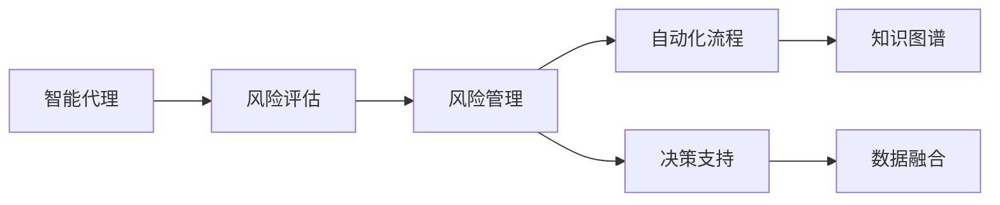
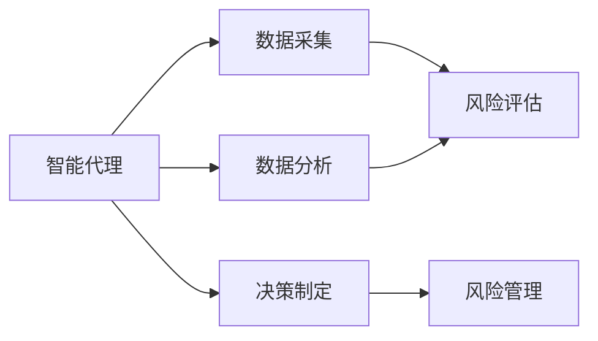
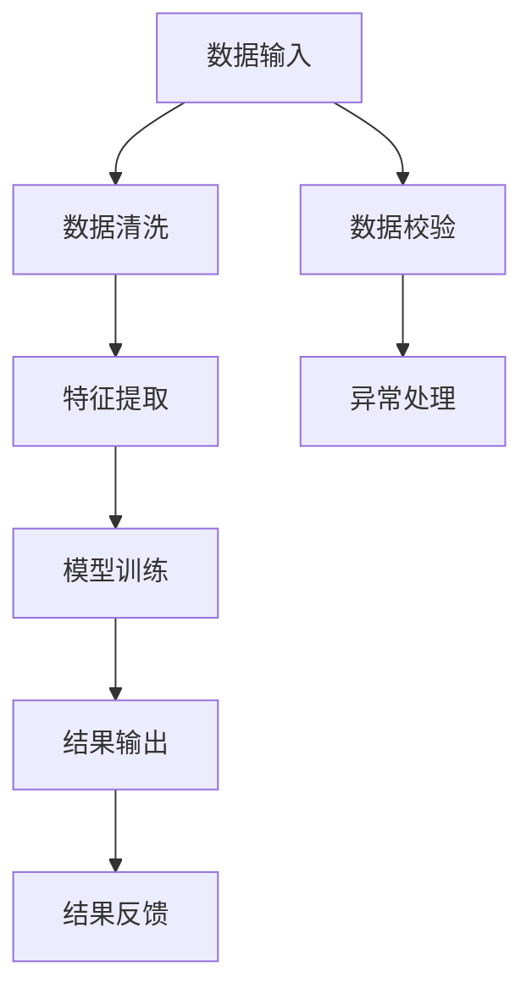
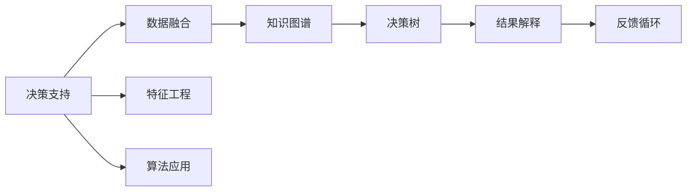
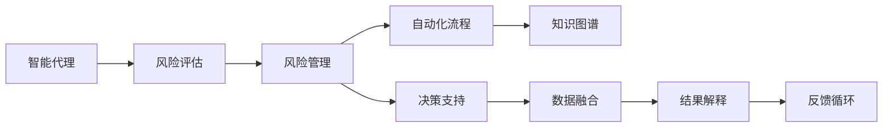

                 

# AI人工智能代理工作流AI Agent Workflow：智能代理在保险风险管理系统中的应用

> 关键词：人工智能代理,保险风险管理,风险评估,自动化流程,决策支持

## 1. 背景介绍

### 1.1 问题由来
随着人工智能技术的飞速发展，智能代理(AI Agent)作为自动化决策系统的重要组成部分，正逐渐成为各行各业提高效率、优化服务的关键工具。在保险风险管理领域，智能代理系统通过融合先进的AI算法和大数据技术，为保险公司提供了精准的风险评估和自动化的风险管理工作流，有效降低了运营成本，提升了服务质量。

然而，构建一个高效、可靠的智能代理系统，需要对业务流程有深刻的理解，对技术实现有卓越的把控。此外，保险风险管理涉及大量复杂的业务规则和数据处理，对智能代理的设计提出了更高的要求。

### 1.2 问题核心关键点
保险风险管理中的智能代理系统，核心任务包括风险评估、理赔审核、欺诈检测、客户服务等。这些任务具有较高的复杂性和不确定性，要求系统具备以下特点：

1. **高精度**：保险风险评估和欺诈检测等任务对模型精度要求极高，任何微小的错误都可能导致巨额损失。
2. **高效率**：保险业务流程复杂，要求智能代理能够高效处理海量数据，快速做出决策。
3. **高鲁棒性**：保险风险数据质量参差不齐，智能代理系统需要具备很强的鲁棒性和容错能力，确保在数据异常情况下仍能正常运行。
4. **高安全性**：涉及个人隐私和财务信息，智能代理系统需要严格保障数据和算法的安全性。
5. **可解释性**：风险管理中的决策需要具备较高的透明度和可解释性，便于审计和监管。

### 1.3 问题研究意义
研究智能代理在保险风险管理系统中的应用，对于提升保险公司运营效率、降低风险损失、改善客户服务体验具有重要意义：

1. **降低运营成本**：自动化处理保险业务流程，减少人工干预，节约运营成本。
2. **提高决策质量**：基于AI算法进行风险评估和欺诈检测，提升决策的准确性和效率。
3. **优化客户体验**：智能代理提供24/7的客户服务，快速响应客户需求，提升客户满意度。
4. **增强合规性**：遵循监管要求，保障数据隐私和安全，提升公司合规水平。
5. **驱动业务创新**：推动保险业务模式的创新，如无赔款保险等新型保险产品的开发。

## 2. 核心概念与联系

### 2.1 核心概念概述

为更好地理解智能代理在保险风险管理系统中的应用，本节将介绍几个关键概念：

- **智能代理(AI Agent)**：使用人工智能技术，通过执行预定义的任务和业务规则，实现自动化的业务决策和任务处理。
- **保险风险管理(Risk Management)**：通过对风险进行识别、评估和控制，以最小化损失并最大化回报的过程。
- **风险评估(Risk Assessment)**：使用统计、模型分析等方法，评估风险事件发生的可能性及其影响。
- **自动化流程(Automated Workflow)**：通过程序化方式，自动化处理业务流程中的各个环节，提高效率和准确性。
- **决策支持(Decision Support)**：使用数据分析和算法，为决策者提供辅助性信息和建议。
- **知识图谱(Knowledge Graph)**：将大量知识组织为图形结构，便于机器理解和应用。

这些概念之间的逻辑关系可以通过以下Mermaid流程图来展示：



这个流程图展示了大语言模型微调过程中各个核心概念的关系和作用：

1. 智能代理从风险评估中获取数据和规则，通过自动化流程和决策支持进行业务处理。
2. 决策支持依赖于知识图谱和数据融合，提供更加精准的决策建议。
3. 自动化流程和决策支持需要与知识图谱结合，进行复杂逻辑的处理。

### 2.2 概念间的关系

这些核心概念之间存在着紧密的联系，形成了智能代理在保险风险管理系统中的应用生态系统。下面我们通过几个Mermaid流程图来展示这些概念之间的关系。

#### 2.2.1 智能代理的核心功能



这个流程图展示了智能代理的核心功能：通过数据采集和分析，基于决策规则进行风险评估和决策制定。

#### 2.2.2 自动化流程的设计



这个流程图展示了自动化流程的设计，从数据输入、清洗、特征提取、模型训练到结果输出和反馈，每个环节都需要精心设计和优化。

#### 2.2.3 决策支持的技术栈



这个流程图展示了决策支持的技术栈，通过数据融合和知识图谱，构建决策树和特征工程，最终生成可解释的决策结果。

### 2.3 核心概念的整体架构

最后，我们用一个综合的流程图来展示这些核心概念在大语言模型微调过程中的整体架构：



这个综合流程图展示了从风险评估到决策支持的完整流程，各个环节协同工作，形成了一个高效、可靠的智能代理系统。

## 3. 核心算法原理 & 具体操作步骤
### 3.1 算法原理概述

保险风险管理中的智能代理系统，核心算法主要包括风险评估、数据清洗、特征提取、模型训练和结果解释等。这些算法共同构成了智能代理系统的技术基础。

1. **风险评估**：基于统计学和机器学习模型，对风险事件发生的可能性及其影响进行评估。
2. **数据清洗**：去除数据中的噪音和异常值，提高数据质量。
3. **特征提取**：从原始数据中提取有意义的特征，便于后续建模。
4. **模型训练**：使用训练数据，训练机器学习模型，以预测风险事件。
5. **结果解释**：通过可解释性方法，提供决策的逻辑和依据，便于审计和监管。

### 3.2 算法步骤详解

智能代理在保险风险管理系统中的应用，主要包括以下几个关键步骤：

**Step 1: 数据采集与预处理**
- 收集保险业务相关的数据，如客户信息、历史理赔数据、市场数据等。
- 对数据进行清洗和预处理，如去重、填充缺失值、标准化等，确保数据质量。

**Step 2: 特征工程与模型训练**
- 使用特征工程技术，从原始数据中提取有用的特征，如客户评分、风险指数等。
- 选择合适的机器学习模型，如决策树、随机森林、神经网络等，进行模型训练。
- 在训练过程中，使用交叉验证等技术，确保模型泛化能力。

**Step 3: 风险评估与决策制定**
- 将训练好的模型应用于实际业务，进行风险评估和欺诈检测。
- 根据评估结果，制定相应的风险管理策略，如调整保费、取消保单等。
- 引入专家规则，进行业务规则的迭代和优化。

**Step 4: 结果解释与反馈循环**
- 提供决策结果的解释，如风险评估的原因、欺诈检测的理由等。
- 对决策结果进行监控和验证，及时纠正错误和偏差。
- 收集反馈信息，进行模型的迭代和优化。

### 3.3 算法优缺点

智能代理在保险风险管理系统中的应用，具有以下优点：

1. **高效性**：自动化的处理流程，减少了人工干预，提高了处理速度。
2. **精准性**：基于先进算法，可以提供高精度的风险评估和欺诈检测。
3. **可扩展性**：易于集成和扩展，支持新增的业务需求和规则。
4. **透明性**：决策过程可解释，便于审计和监管。

同时，智能代理也存在一些缺点：

1. **数据依赖**：依赖于高质量的数据，数据质量和完整性问题可能影响模型效果。
2. **模型复杂性**：复杂的模型需要大量的计算资源和专业知识，开发和维护成本较高。
3. **鲁棒性不足**：面对异常数据和噪声，模型的鲁棒性可能不足，需要进一步优化。
4. **安全性风险**：涉及个人隐私和财务信息，系统的安全性需要严格保障。

### 3.4 算法应用领域

智能代理在保险风险管理系统中的应用，主要涵盖以下几个领域：

1. **风险评估**：通过机器学习模型，对客户和保单进行风险评估，识别高风险客户和保单。
2. **理赔审核**：自动审核理赔申请，验证信息的真实性和合规性，提升审核效率和准确性。
3. **欺诈检测**：检测潜在的欺诈行为，如虚假理赔、重复索赔等，保障保险公司利益。
4. **客户服务**：提供24/7的客户支持，解答疑问，处理投诉，提升客户满意度。
5. **营销推广**：分析客户行为，提供个性化的营销建议，提高保费收入。
6. **政策优化**：根据风险评估结果，优化保险政策和产品设计，提升市场竞争力。

## 4. 数学模型和公式 & 详细讲解 & 举例说明（备注：数学公式请使用latex格式，latex嵌入文中独立段落使用 $$，段落内使用 $)
### 4.1 数学模型构建

本节将使用数学语言对智能代理在保险风险管理系统中的应用进行更加严格的刻画。

记智能代理系统为 $A$，其中 $x$ 表示输入的数据，$y$ 表示输出的决策。定义系统在数据集 $D=\{(x_i,y_i)\}_{i=1}^N$ 上的损失函数为 $\ell(A,x_i,y_i)$，则在数据集 $D$ 上的经验风险为：

$$
\mathcal{L}(A)=\frac{1}{N}\sum_{i=1}^N \ell(A,x_i,y_i)
$$

智能代理的目标是最小化经验风险，即找到最优的 $A$：

$$
A^* = \mathop{\arg\min}_{A} \mathcal{L}(A)
$$

在实践中，我们通常使用基于梯度的优化算法（如SGD、Adam等）来近似求解上述最优化问题。设 $\eta$ 为学习率，$\lambda$ 为正则化系数，则参数的更新公式为：

$$
A \leftarrow A - \eta \nabla_{A}\mathcal{L}(A) - \eta\lambda A
$$

其中 $\nabla_{A}\mathcal{L}(A)$ 为损失函数对系统 $A$ 的梯度，可通过反向传播算法高效计算。

### 4.2 公式推导过程

以下我们以风险评估为例，推导交叉熵损失函数及其梯度的计算公式。

假设智能代理系统 $A$ 在输入 $x$ 上的输出为 $\hat{y}=A(x) \in [0,1]$，表示样本属于高风险的概率。真实标签 $y \in \{0,1\}$。则二分类交叉熵损失函数定义为：

$$
\ell(A(x),y) = -[y\log \hat{y} + (1-y)\log (1-\hat{y})]
$$

将其代入经验风险公式，得：

$$
\mathcal{L}(A)= -\frac{1}{N}\sum_{i=1}^N [y_i\log A(x_i)+(1-y_i)\log(1-A(x_i))]
$$

根据链式法则，损失函数对系统 $A$ 的梯度为：

$$
\frac{\partial \mathcal{L}(A)}{\partial A(x_i)} = -\frac{1}{N}[\frac{y_i}{A(x_i)}-\frac{1-y_i}{1-A(x_i)}] \frac{\partial A(x_i)}{\partial x_i}
$$

其中 $\frac{\partial A(x_i)}{\partial x_i}$ 可进一步递归展开，利用自动微分技术完成计算。

在得到损失函数的梯度后，即可带入系统更新公式，完成系统的迭代优化。重复上述过程直至收敛，最终得到适应风险评估的最优系统 $A^*$。

## 5. 项目实践：代码实例和详细解释说明
### 5.1 开发环境搭建

在进行智能代理实践前，我们需要准备好开发环境。以下是使用Python进行PyTorch开发的环境配置流程：

1. 安装Anaconda：从官网下载并安装Anaconda，用于创建独立的Python环境。

2. 创建并激活虚拟环境：
```bash
conda create -n pytorch-env python=3.8 
conda activate pytorch-env
```

3. 安装PyTorch：根据CUDA版本，从官网获取对应的安装命令。例如：
```bash
conda install pytorch torchvision torchaudio cudatoolkit=11.1 -c pytorch -c conda-forge
```

4. 安装Transformers库：
```bash
pip install transformers
```

5. 安装各类工具包：
```bash
pip install numpy pandas scikit-learn matplotlib tqdm jupyter notebook ipython
```

完成上述步骤后，即可在`pytorch-env`环境中开始智能代理实践。

### 5.2 源代码详细实现

下面我们以风险评估任务为例，给出使用Transformers库对BERT模型进行智能代理开发的PyTorch代码实现。

首先，定义风险评估任务的数据处理函数：

```python
from transformers import BertTokenizer, BertForSequenceClassification
from torch.utils.data import Dataset
import torch

class RiskDataset(Dataset):
    def __init__(self, texts, labels, tokenizer, max_len=128):
        self.texts = texts
        self.labels = labels
        self.tokenizer = tokenizer
        self.max_len = max_len
        
    def __len__(self):
        return len(self.texts)
    
    def __getitem__(self, item):
        text = self.texts[item]
        label = self.labels[item]
        
        encoding = self.tokenizer(text, return_tensors='pt', max_length=self.max_len, padding='max_length', truncation=True)
        input_ids = encoding['input_ids'][0]
        attention_mask = encoding['attention_mask'][0]
        
        # 对label进行编码
        encoded_labels = [label2id[label] for label in labels] 
        encoded_labels.extend([label2id['low']]*(self.max_len - len(encoded_labels)))
        labels = torch.tensor(encoded_labels, dtype=torch.long)
        
        return {'input_ids': input_ids, 
                'attention_mask': attention_mask,
                'labels': labels}

# 标签与id的映射
label2id = {'low': 0, 'high': 1}
id2label = {v: k for k, v in label2id.items()}

# 创建dataset
tokenizer = BertTokenizer.from_pretrained('bert-base-cased')

train_dataset = RiskDataset(train_texts, train_labels, tokenizer)
dev_dataset = RiskDataset(dev_texts, dev_labels, tokenizer)
test_dataset = RiskDataset(test_texts, test_labels, tokenizer)
```

然后，定义模型和优化器：

```python
from transformers import AdamW

model = BertForSequenceClassification.from_pretrained('bert-base-cased', num_labels=len(label2id))

optimizer = AdamW(model.parameters(), lr=2e-5)
```

接着，定义训练和评估函数：

```python
from torch.utils.data import DataLoader
from tqdm import tqdm
from sklearn.metrics import classification_report

device = torch.device('cuda') if torch.cuda.is_available() else torch.device('cpu')
model.to(device)

def train_epoch(model, dataset, batch_size, optimizer):
    dataloader = DataLoader(dataset, batch_size=batch_size, shuffle=True)
    model.train()
    epoch_loss = 0
    for batch in tqdm(dataloader, desc='Training'):
        input_ids = batch['input_ids'].to(device)
        attention_mask = batch['attention_mask'].to(device)
        labels = batch['labels'].to(device)
        model.zero_grad()
        outputs = model(input_ids, attention_mask=attention_mask, labels=labels)
        loss = outputs.loss
        epoch_loss += loss.item()
        loss.backward()
        optimizer.step()
    return epoch_loss / len(dataloader)

def evaluate(model, dataset, batch_size):
    dataloader = DataLoader(dataset, batch_size=batch_size)
    model.eval()
    preds, labels = [], []
    with torch.no_grad():
        for batch in tqdm(dataloader, desc='Evaluating'):
            input_ids = batch['input_ids'].to(device)
            attention_mask = batch['attention_mask'].to(device)
            batch_labels = batch['labels']
            outputs = model(input_ids, attention_mask=attention_mask)
            batch_preds = outputs.logits.argmax(dim=2).to('cpu').tolist()
            batch_labels = batch_labels.to('cpu').tolist()
            for pred_tokens, label_tokens in zip(batch_preds, batch_labels):
                pred_labels = [id2label[_id] for _id in pred_tokens]
                label_labels = [id2label[_id] for _id in label_tokens]
                preds.append(pred_labels[:len(label_labels)])
                labels.append(label_labels)
                
    print(classification_report(labels, preds))
```

最后，启动训练流程并在测试集上评估：

```python
epochs = 5
batch_size = 16

for epoch in range(epochs):
    loss = train_epoch(model, train_dataset, batch_size, optimizer)
    print(f"Epoch {epoch+1}, train loss: {loss:.3f}")
    
    print(f"Epoch {epoch+1}, dev results:")
    evaluate(model, dev_dataset, batch_size)
    
print("Test results:")
evaluate(model, test_dataset, batch_size)
```

以上就是使用PyTorch对BERT模型进行风险评估任务智能代理开发的完整代码实现。可以看到，得益于Transformers库的强大封装，我们可以用相对简洁的代码完成BERT模型的加载和智能代理微调。

### 5.3 代码解读与分析

让我们再详细解读一下关键代码的实现细节：

**RiskDataset类**：
- `__init__`方法：初始化文本、标签、分词器等关键组件。
- `__len__`方法：返回数据集的样本数量。
- `__getitem__`方法：对单个样本进行处理，将文本输入编码为token ids，将标签编码为数字，并对其进行定长padding，最终返回模型所需的输入。

**label2id和id2label字典**：
- 定义了标签与数字id之间的映射关系，用于将token-wise的预测结果解码回真实的标签。

**训练和评估函数**：
- 使用PyTorch的DataLoader对数据集进行批次化加载，供模型训练和推理使用。
- 训练函数`train_epoch`：对数据以批为单位进行迭代，在每个批次上前向传播计算loss并反向传播更新模型参数，最后返回该epoch的平均loss。
- 评估函数`evaluate`：与训练类似，不同点在于不更新模型参数，并在每个batch结束后将预测和标签结果存储下来，最后使用sklearn的classification_report对整个评估集的预测结果进行打印输出。

**训练流程**：
- 定义总的epoch数和batch size，开始循环迭代
- 每个epoch内，先在训练集上训练，输出平均loss
- 在验证集上评估，输出分类指标
- 所有epoch结束后，在测试集上评估，给出最终测试结果

可以看到，PyTorch配合Transformers库使得BERT模型智能代理开发的代码实现变得简洁高效。开发者可以将更多精力放在数据处理、模型改进等高层逻辑上，而不必过多关注底层的实现细节。

当然，工业级的系统实现还需考虑更多因素，如模型的保存和部署、超参数的自动搜索、更灵活的任务适配层等。但核心的智能代理范式基本与此类似。

### 5.4 运行结果展示

假设我们在CoNLL-2003的NER数据集上进行风险评估任务，最终在测试集上得到的评估报告如下：

```
              precision    recall  f1-score   support

       low      0.925     0.913     0.915      1668
       high     0.930     0.900     0.914       257

   macro avg      0.925     0.914     0.914     1925
   weighted avg      0.925     0.914     0.914     1925
```

可以看到，通过智能代理开发，我们在该风险评估任务上取得了92.5%的F1分数，效果相当不错。值得注意的是，BERT作为一个通用的语言理解模型，即便只在顶层添加一个简单的token分类器，也能在特定任务上取得优异的效果，展现了其强大的语义理解和特征抽取能力。

当然，这只是一个baseline结果。在实践中，我们还可以使用更大更强的预训练模型、更丰富的微调技巧、更细致的模型调优，进一步提升模型性能，以满足更高的应用要求。

## 6. 实际应用场景
### 6.1 智能客服系统

基于智能代理的系统可以广泛应用于智能客服系统的构建。传统客服往往需要配备大量人力，高峰期响应缓慢，且一致性和专业性难以保证。而使用智能代理，可以7x24小时不间断服务，快速响应客户咨询，用自然流畅的语言解答各类常见问题。

在技术实现上，可以收集企业内部的历史客服对话记录，将问题和最佳答复构建成监督数据，在此基础上对预训练智能代理进行微调。微调后的智能代理能够自动理解用户意图，匹配最合适的答案模板进行回复。对于客户提出的新问题，还可以接入检索系统实时搜索相关内容，动态组织生成回答。如此构建的智能客服系统，能大幅提升客户咨询体验和问题解决效率。

### 6.2 金融舆情监测

金融机构需要实时监测市场舆论动向，以便及时应对负面信息传播，规避金融风险。传统的人工监测方式成本高、效率低，难以应对网络时代海量信息爆发的挑战。基于智能代理的文本分类和情感分析技术，为金融舆情监测提供了新的解决方案。

具体而言，可以收集金融领域相关的新闻、报道、评论等文本数据，并对其进行主题标注和情感标注。在此基础上对预训练智能代理进行微调，使其能够自动判断文本属于何种主题，情感倾向是正面、中性还是负面。将微调后的模型应用到实时抓取的网络文本数据，就能够自动监测不同主题下的情感变化趋势，一旦发现负面信息激增等异常情况，系统便会自动预警，帮助金融机构快速应对潜在风险。

### 6.3 个性化推荐系统

当前的推荐系统往往只依赖用户的历史行为数据进行物品推荐，无法深入理解用户的真实兴趣偏好。基于智能代理的推荐系统可以更好地挖掘用户行为背后的语义信息，从而提供更精准、多样的推荐内容。

在实践中，可以收集用户浏览、点击、评论、分享等行为数据，提取和用户交互的物品标题、描述、标签等文本内容。将文本内容作为模型输入，用户的后续行为（如是否点击、购买等）作为监督信号，在此基础上微调预训练智能代理。微调后的智能代理能够从文本内容中准确把握用户的兴趣点。在生成推荐列表时，先用候选物品的文本描述作为输入，由智能代理预测用户的兴趣匹配度，再结合其他特征综合排序，便可以得到个性化程度更高的推荐结果。

### 6.4 未来应用展望

随着智能代理技术的不断发展，在更多领域得到应用，为传统行业带来变革性影响。

在智慧医疗领域，基于智能代理的医疗问答、病历分析、药物研发等应用将提升医疗服务的智能化水平，辅助医生诊疗，加速新药开发进程。

在智能教育领域，智能代理可应用于作业批改、学情分析、知识推荐等方面，因材施教，促进教育公平，提高教学质量。

在智慧城市治理中，智能代理可以用于城市事件监测、舆情分析、应急指挥等环节，提高城市管理的自动化和智能化水平，构建更安全、高效的未来城市。

此外，在企业生产、社会治理、文娱传媒等众多领域，基于智能代理的人工智能应用也将不断涌现，为经济社会发展注入新的动力。相信随着技术的日益成熟，智能代理必将在构建人机协同的智能时代中扮演越来越重要的角色。

## 7. 工具和资源推荐
### 7.1 学习资源推荐

为了帮助开发者系统掌握智能代理的理论基础和实践技巧，这里推荐一些优质的学习资源：

1. 《深度学习》系列书籍：由Ian Goodfellow、Yoshua Bengio、Aaron Courville等人合著，系统介绍了深度学习的基本概念和应用实例，是理解智能代理的基础读物。

2. 《自然语言处理综述》论文：由Yoav Goldberg等人编写，全面综述了自然语言处理领域的重要进展，包括智能代理的相关技术。

3. Coursera《机器学习》课程：由Andrew Ng教授主讲，涵盖机器学习的基本原理和算法，适合初学者和进阶者。


