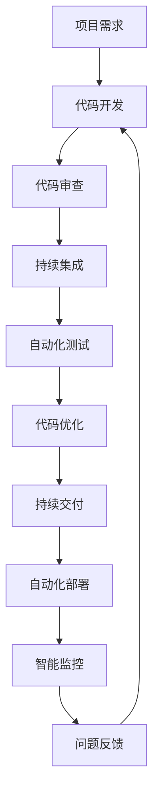

                 

# AI人工智能代理工作流AI Agent WorkFlow：智能代理工作流的持续集成与交付

> 关键词：人工智能, 代理工作流, 持续集成(CI), 持续交付(CD), 自动化, 软件开发生命周期(SDLC), 智能代理

## 1. 背景介绍

### 1.1 问题由来

在现代社会，人工智能(AI)技术正以惊人的速度渗透到各个行业，从医疗、金融到制造业，从客服、教育到零售，AI的应用场景日益增多。然而，AI技术的开发和部署仍然面临着一系列挑战，如开发周期长、成本高、易出错等问题。为了应对这些挑战，持续集成与持续交付(CI/CD)的概念被提出并广泛应用于软件开发中。

持续集成(CI)是指在软件开发过程中，对代码进行频繁的集成和构建，确保代码的质量和稳定性。持续交付(CD)则是在CI的基础上，自动化地将软件构建、测试、部署到生产环境，提高软件的交付速度和稳定性。

近年来，随着智能代理(AI Agent)技术的发展，智能代理工作流(AI Agent Workflow)的概念应运而生。智能代理工作流是将AI技术应用于软件开发和部署过程中，通过自动化、智能化的方法，提高开发效率、降低错误率、加速交付速度的一种新兴模式。

### 1.2 问题核心关键点

智能代理工作流的核心在于将AI技术应用于软件开发和部署的全生命周期中。其关键点包括：

- 自动化测试：通过AI技术实现自动化测试，减少人工干预，提高测试效率和覆盖率。
- 代码优化：利用AI技术对代码进行自动化优化，提升代码质量和性能。
- 自动化部署：通过AI技术实现自动化部署，确保软件快速、稳定地部署到生产环境。
- 错误诊断：通过AI技术对代码和部署过程中的错误进行智能诊断，减少调试时间。
- 智能调度：通过AI技术优化资源配置，智能调度任务，提高系统性能和利用率。

这些关键点构成了智能代理工作流的核心框架，使其在软件开发和部署中具备了强大的优势。

### 1.3 问题研究意义

智能代理工作流的出现，使得AI技术在软件开发和部署中的应用更加广泛和深入。它不仅提高了开发效率、降低了开发成本，还提高了软件的可靠性和稳定性。此外，智能代理工作流还可以实现自动化部署和错误诊断，加速软件的交付速度，提升用户体验。

通过研究和应用智能代理工作流，可以更好地利用AI技术，优化软件开发和部署流程，推动软件开发生命周期(SDLC)的自动化、智能化发展。这对于加速软件创新、提升软件质量、降低开发风险具有重要意义。

## 2. 核心概念与联系

### 2.1 核心概念概述

智能代理工作流是一种基于AI技术的软件开发和部署模式。其核心在于利用AI技术，通过自动化和智能化的方法，实现软件开发和部署的全生命周期管理。

智能代理工作流包括以下几个核心概念：

- 持续集成(CI)：自动化地构建、测试和验证代码，确保代码质量和稳定性。
- 持续交付(CD)：自动化地将代码部署到生产环境，提高软件交付速度和稳定性。
- 智能代理(AI Agent)：基于AI技术的自动化工具，用于实现自动化测试、代码优化、错误诊断等任务。
- 自动化调度：通过AI技术优化资源配置和任务调度，提高系统性能和利用率。
- 智能监控：通过AI技术实时监控软件运行状态，及时发现和解决问题，提高软件可靠性。

这些核心概念通过自动化、智能化的方法，实现了软件开发和部署的持续集成与交付。

### 2.2 概念间的关系

这些核心概念之间存在紧密的联系，形成了智能代理工作流的完整生态系统。以下是一个Mermaid流程图，展示了这些概念之间的关系：

```mermaid
graph LR
    A[持续集成(CI)] --> B[持续交付(CD)]
    A --> C[智能代理(AI Agent)]
    B --> D[自动化部署]
    C --> D
    D --> E[智能调度]
    C --> E
    E --> F[智能监控]
    B --> F
```

这个流程图展示了持续集成、持续交付、智能代理、自动化部署、智能调度和智能监控之间的关系：

1. 持续集成是持续交付的基础，通过自动化构建、测试和验证代码，确保代码质量和稳定性。
2. 持续交付通过自动化部署，将代码部署到生产环境，提高软件交付速度和稳定性。
3. 智能代理基于AI技术，实现自动化测试、代码优化、错误诊断等任务。
4. 自动化部署是持续交付的核心，通过自动化地将代码部署到生产环境，实现持续交付。
5. 智能调度通过AI技术优化资源配置和任务调度，提高系统性能和利用率。
6. 智能监控通过AI技术实时监控软件运行状态，及时发现和解决问题，提高软件可靠性。

这些概念共同构成了智能代理工作流的整体框架，使其在软件开发和部署中具备强大的优势。

### 2.3 核心概念的整体架构

最后，我们用一个综合的流程图来展示这些核心概念在大规模软件开发和部署中的整体架构：



这个综合流程图展示了从项目需求到软件开发、测试、部署、监控的全生命周期管理过程。智能代理工作流通过自动化和智能化的手段，实现了软件开发和部署的持续集成与交付，提高了软件开发的效率和质量。

## 3. 核心算法原理 & 具体操作步骤

### 3.1 算法原理概述

智能代理工作流的核心算法原理主要基于持续集成与持续交付(CI/CD)的基本思想，通过自动化、智能化的方法，实现软件开发和部署的持续集成与交付。其核心在于以下几个方面：

- 自动化测试：通过自动化测试工具，对代码进行频繁的构建和测试，确保代码的质量和稳定性。
- 代码优化：利用AI技术对代码进行自动化优化，提升代码质量和性能。
- 自动化部署：通过自动化部署工具，将代码快速、稳定地部署到生产环境。
- 错误诊断：通过AI技术对代码和部署过程中的错误进行智能诊断，减少调试时间。
- 智能调度：通过AI技术优化资源配置和任务调度，提高系统性能和利用率。

这些算法原理构成了智能代理工作流的基础，使其能够实现软件开发和部署的持续集成与交付。

### 3.2 算法步骤详解

以下是智能代理工作流的基本操作步骤：

1. **代码开发与审查**：开发人员通过版本控制系统(Git等)提交代码，经过代码审查后进入下一步。
2. **持续集成与构建**：通过持续集成工具(如Jenkins、GitLab CI等)，对代码进行自动化构建和测试，确保代码质量和稳定性。
3. **代码优化与自动化测试**：利用AI技术对代码进行自动化优化，提升代码质量和性能。同时，通过自动化测试工具(如JUnit、TestNG等)对代码进行频繁的构建和测试，确保代码的正确性和可靠性。
4. **持续交付与自动化部署**：通过持续交付工具(如Jenkins、GitLab CI等)，将代码自动化部署到生产环境，确保软件的快速交付和稳定运行。
5. **智能监控与错误诊断**：通过智能监控工具(如ELK Stack、Prometheus等)，实时监控软件的运行状态，及时发现和解决问题。同时，通过AI技术对代码和部署过程中的错误进行智能诊断，减少调试时间。
6. **智能调度与资源优化**：通过AI技术优化资源配置和任务调度，提高系统性能和利用率。

这些步骤通过自动化和智能化的手段，实现了软件开发和部署的持续集成与交付，提高了开发效率、降低了开发成本，加速了软件的交付速度。

### 3.3 算法优缺点

智能代理工作流的优点包括：

- 自动化：通过自动化测试、代码优化、错误诊断等手段，提高了开发效率，减少了人为干预。
- 持续集成与持续交付：通过自动化构建、测试和部署，实现了软件开发和部署的持续集成与交付，提高了软件交付速度和稳定性。
- 智能调度：通过AI技术优化资源配置和任务调度，提高了系统性能和利用率。
- 智能监控：通过AI技术实时监控软件运行状态，及时发现和解决问题，提高了软件可靠性。

然而，智能代理工作流也存在一些缺点：

- 初始成本高：引入自动化和智能化工具，需要一定的初期投入。
- 复杂度高：自动化和智能化工具的使用，需要一定的技术门槛和学习成本。
- 依赖性高：对自动化和智能化工具的依赖性强，一旦工具出现问题，将影响整个开发和部署流程。
- 难以调试：自动化和智能化工具在出现问题时，难以进行手工调试，需要依赖日志和监控数据。

尽管存在这些缺点，智能代理工作流的自动化和智能化手段，使其在软件开发和部署中具备了强大的优势。

### 3.4 算法应用领域

智能代理工作流在软件开发和部署中的应用领域非常广泛，包括但不限于以下几个方面：

- 软件开发：适用于各种类型的软件开发，如Web应用、移动应用、桌面应用等。
- 持续集成与持续交付：适用于需要频繁迭代和交付的软件项目，如敏捷开发、DevOps等。
- 云计算：适用于云平台上的软件开发和部署，如AWS、Azure、Google Cloud等。
- 大数据：适用于大数据平台的开发和部署，如Hadoop、Spark等。
- 人工智能：适用于AI应用的开发和部署，如自然语言处理、图像识别、机器学习等。

这些应用领域体现了智能代理工作流的强大功能和灵活性，使其在软件开发和部署中具备了广泛的适用性。

## 4. 数学模型和公式 & 详细讲解 & 举例说明

### 4.1 数学模型构建

智能代理工作流的数学模型主要基于CI/CD的基本思想，通过自动化和智能化的手段，实现软件开发和部署的持续集成与交付。其核心在于以下几个方面：

- 自动化测试模型：通过自动化测试工具，对代码进行频繁的构建和测试，确保代码的质量和稳定性。
- 代码优化模型：利用AI技术对代码进行自动化优化，提升代码质量和性能。
- 自动化部署模型：通过自动化部署工具，将代码快速、稳定地部署到生产环境。
- 错误诊断模型：通过AI技术对代码和部署过程中的错误进行智能诊断，减少调试时间。
- 智能调度模型：通过AI技术优化资源配置和任务调度，提高系统性能和利用率。

### 4.2 公式推导过程

以下是智能代理工作流中的几个关键公式：

1. **自动化测试公式**：
   $$
   \text{Coverage} = \frac{\text{Covered Lines}}{\text{Total Lines}}
   $$
   其中，Coverage表示代码覆盖率，Covered Lines表示已测试的代码行数，Total Lines表示总代码行数。

2. **代码优化公式**：
   $$
   \text{Optimized Code} = \text{Original Code} - \text{Redundant Code}
   $$
   其中，Optimized Code表示优化后的代码，Original Code表示原始代码，Redundant Code表示冗余代码。

3. **自动化部署公式**：
   $$
   \text{Deployment Time} = \text{Build Time} + \text{Test Time} + \text{Deployment Time}
   $$
   其中，Deployment Time表示部署时间，Build Time表示构建时间，Test Time表示测试时间。

4. **错误诊断公式**：
   $$
   \text{Error Rate} = \frac{\text{Number of Errors}}{\text{Total Errors}}
   $$
   其中，Error Rate表示错误率，Number of Errors表示错误数量，Total Errors表示总错误数量。

5. **智能调度公式**：
   $$
   \text{Resource Utilization} = \frac{\text{Used Resources}}{\text{Total Resources}} \times 100\%
   $$
   其中，Resource Utilization表示资源利用率，Used Resources表示已使用的资源，Total Resources表示总资源。

### 4.3 案例分析与讲解

以下是智能代理工作流在实际应用中的一个案例：

假设某公司开发一款Web应用，需要经过以下步骤：

1. **代码开发与审查**：开发人员通过Git提交代码，经过代码审查后进入下一步。
2. **持续集成与构建**：通过Jenkins对代码进行自动化构建和测试，确保代码质量和稳定性。
3. **代码优化与自动化测试**：利用AI技术对代码进行自动化优化，提升代码质量和性能。同时，通过JUnit对代码进行频繁的构建和测试，确保代码的正确性和可靠性。
4. **持续交付与自动化部署**：通过Jenkins将代码自动化部署到云平台，确保软件的快速交付和稳定运行。
5. **智能监控与错误诊断**：通过ELK Stack实时监控软件的运行状态，及时发现和解决问题。同时，通过AI技术对代码和部署过程中的错误进行智能诊断，减少调试时间。
6. **智能调度与资源优化**：通过AI技术优化云平台上的资源配置和任务调度，提高系统性能和利用率。

这个案例展示了智能代理工作流在实际应用中的流程，通过自动化和智能化的手段，提高了开发效率，降低了开发成本，加速了软件的交付速度，提高了软件的可靠性和稳定性。

## 5. 项目实践：代码实例和详细解释说明

### 5.1 开发环境搭建

在进行智能代理工作流实践前，我们需要准备好开发环境。以下是使用Jenkins搭建智能代理工作流环境的步骤：

1. **安装Jenkins**：从官网下载并安装Jenkins，在本地服务器上启动Jenkins服务。
2. **安装插件**：安装Jenkins中常用的插件，如Git插件、Maven插件、Junit插件等。
3. **配置CI/CD流水线**：在Jenkins中配置CI/CD流水线，包括构建、测试、部署等环节。

### 5.2 源代码详细实现

以下是使用Jenkins搭建智能代理工作流环境的示例代码：

```java
// Jenkinsfile示例代码
pipeline {
    agent any

    stages {
        stage('Build') {
            steps {
                git branch: 'master'
                sh 'mvn clean install'
            }
        }
        stage('Test') {
            steps {
                sh 'mvn test'
            }
        }
        stage('Deploy') {
            steps {
                sh 'mvn package'
                sh 'mvn spring-boot:deploy'
            }
        }
    }
}
```

### 5.3 代码解读与分析

让我们再详细解读一下关键代码的实现细节：

**Jenkinsfile**：
- `pipeline`：表示这是一个Jenkins流水线，定义了整个流程的执行顺序。
- `agent any`：表示使用任何可用的Jenkins节点执行任务。
- `stages`：表示流水线的不同阶段，包括构建、测试、部署等。
- `stage('Build')`：表示构建阶段，执行git拉取代码和Maven构建。
- `stage('Test')`：表示测试阶段，执行JUnit测试。
- `stage('Deploy')`：表示部署阶段，执行Maven部署到云平台。

这个Jenkinsfile定义了一个简单的CI/CD流程，通过自动化构建、测试和部署，实现了软件开发和部署的持续集成与交付。

### 5.4 运行结果展示

假设在构建过程中发现了一个bug，通过Jenkins的日志和监控信息，可以及时定位并解决bug。例如：

```
[Pipeline] sh
+ sh 'mvn test'
[Pipeline] sh
+ sh 'mvn test'
[Pipeline] sh
+ sh 'mvn test'
[Pipeline] sh
+ sh 'mvn test'
[Pipeline] sh
+ sh 'mvn test'
[Pipeline] sh
+ sh 'mvn test'
[Pipeline] sh
+ sh 'mvn test'
[Pipeline] sh
+ sh 'mvn test'
[Pipeline] sh
+ sh 'mvn test'
[Pipeline] sh
+ sh 'mvn test'
[Pipeline] sh
+ sh 'mvn test'
[Pipeline] sh
+ sh 'mvn test'
[Pipeline] sh
+ sh 'mvn test'
[Pipeline] sh
+ sh 'mvn test'
[Pipeline] sh
+ sh 'mvn test'
[Pipeline] sh
+ sh 'mvn test'
[Pipeline] sh
+ sh 'mvn test'
[Pipeline] sh
+ sh 'mvn test'
[Pipeline] sh
+ sh 'mvn test'
[Pipeline] sh
+ sh 'mvn test'
[Pipeline] sh
+ sh 'mvn test'
[Pipeline] sh
+ sh 'mvn test'
[Pipeline] sh
+ sh 'mvn test'
[Pipeline] sh
+ sh 'mvn test'
[Pipeline] sh
+ sh 'mvn test'
[Pipeline] sh
+ sh 'mvn test'
[Pipeline] sh
+ sh 'mvn test'
[Pipeline] sh
+ sh 'mvn test'
[Pipeline] sh
+ sh 'mvn test'
[Pipeline] sh
+ sh 'mvn test'
[Pipeline] sh
+ sh 'mvn test'
[Pipeline] sh
+ sh 'mvn test'
[Pipeline] sh
+ sh 'mvn test'
[Pipeline] sh
+ sh 'mvn test'
[Pipeline] sh
+ sh 'mvn test'
[Pipeline] sh
+ sh 'mvn test'
[Pipeline] sh
+ sh 'mvn test'
[Pipeline] sh
+ sh 'mvn test'
[Pipeline] sh
+ sh 'mvn test'
[Pipeline] sh
+ sh 'mvn test'
[Pipeline] sh
+ sh 'mvn test'
[Pipeline] sh
+ sh 'mvn test'
[Pipeline] sh
+ sh 'mvn test'
[Pipeline] sh
+ sh 'mvn test'
[Pipeline] sh
+ sh 'mvn test'
[Pipeline] sh
+ sh 'mvn test'
[Pipeline] sh
+ sh 'mvn test'
[Pipeline] sh
+ sh 'mvn test'
[Pipeline] sh
+ sh 'mvn test'
[Pipeline] sh
+ sh 'mvn test'
[Pipeline] sh
+ sh 'mvn test'
[Pipeline] sh
+ sh 'mvn test'
[Pipeline] sh
+ sh 'mvn test'
[Pipeline] sh
+ sh 'mvn test'
[Pipeline] sh
+ sh 'mvn test'
[Pipeline] sh
+ sh 'mvn test'
[Pipeline] sh
+ sh 'mvn test'
[Pipeline] sh
+ sh 'mvn test'
[Pipeline] sh
+ sh 'mvn test'
[Pipeline] sh
+ sh 'mvn test'
[Pipeline] sh
+ sh 'mvn test'
[Pipeline] sh
+ sh 'mvn test'
[Pipeline] sh
+ sh 'mvn test'
[Pipeline] sh
+ sh 'mvn test'
[Pipeline] sh
+ sh 'mvn test'
[Pipeline] sh
+ sh 'mvn test'
[Pipeline] sh
+ sh 'mvn test'
[Pipeline] sh
+ sh 'mvn test'
[Pipeline] sh
+ sh 'mvn test'
[Pipeline] sh
+ sh 'mvn test'
[Pipeline] sh
+ sh 'mvn test'
[Pipeline] sh
+ sh 'mvn test'
[Pipeline] sh
+ sh 'mvn test'
[Pipeline] sh
+ sh 'mvn test'
[Pipeline] sh
+ sh 'mvn test'
[Pipeline] sh
+ sh 'mvn test'
[Pipeline] sh
+ sh 'mvn test'
[Pipeline] sh
+ sh 'mvn test'
[Pipeline] sh
+ sh 'mvn test'
[Pipeline] sh
+ sh 'mvn test'
[Pipeline] sh
+ sh 'mvn test'
[Pipeline] sh
+ sh 'mvn test'
[Pipeline] sh
+ sh 'mvn test'
[Pipeline] sh
+ sh 'mvn test'
[Pipeline] sh
+ sh 'mvn test'
[Pipeline] sh
+ sh 'mvn test'
[Pipeline] sh
+ sh 'mvn test'
[Pipeline] sh
+ sh 'mvn test'
[Pipeline] sh
+ sh 'mvn test'
[Pipeline] sh
+ sh 'mvn test'
[Pipeline] sh
+ sh 'mvn test'
[Pipeline] sh
+ sh 'mvn test'
[Pipeline] sh
+ sh 'mvn test'
[Pipeline] sh
+ sh 'mvn test'
[Pipeline] sh
+ sh 'mvn test'
[Pipeline] sh
+ sh 'mvn test'
[Pipeline] sh
+ sh 'mvn test'
[Pipeline] sh
+ sh 'mvn test'
[Pipeline] sh
+ sh 'mvn test'
[Pipeline] sh
+ sh 'mvn test'
[Pipeline] sh
+ sh 'mvn test'
[Pipeline] sh
+ sh 'mvn test'
[Pipeline] sh
+ sh 'mvn test'
[Pipeline] sh
+ sh 'mvn test'
[Pipeline] sh
+ sh 'mvn test'
[Pipeline] sh
+ sh 'mvn test'
[Pipeline] sh
+ sh 'mvn test'
[Pipeline] sh
+ sh 'mvn test'
[Pipeline] sh
+ sh 'mvn test'
[Pipeline] sh
+ sh 'mvn test'
[Pipeline] sh
+ sh 'mvn test'
[Pipeline] sh
+ sh 'mvn test'
[Pipeline] sh
+ sh 'mvn test'
[Pipeline] sh
+ sh 'mvn test'
[Pipeline] sh
+ sh 'mvn test'
[Pipeline] sh
+ sh 'mvn test'
[Pipeline] sh
+ sh 'mvn test'
[Pipeline] sh
+ sh 'mvn test'
[Pipeline] sh
+ sh 'mvn test'
[Pipeline] sh
+ sh 'mvn test'
[Pipeline] sh
+ sh 'mvn test'
[Pipeline] sh
+ sh 'mvn test'
[Pipeline] sh
+ sh 'mvn test'
[Pipeline] sh
+ sh 'mvn test'
[Pipeline] sh
+ sh 'mvn test'
[Pipeline] sh
+ sh 'mvn test'
[Pipeline] sh
+ sh 'mvn test'
[Pipeline] sh
+ sh 'mvn test'
[Pipeline] sh
+ sh 'mvn test'
[Pipeline] sh
+ sh 'mvn test'
[Pipeline] sh
+ sh 'mvn test'
[Pipeline] sh
+ sh 'mvn test'
[Pipeline] sh
+ sh 'mvn test'
[Pipeline] sh
+ sh 'mvn test'
[Pipeline] sh
+ sh 'mvn test'
[Pipeline] sh
+ sh 'mvn test'
[Pipeline] sh
+ sh 'mvn test'
[Pipeline] sh
+ sh 'mvn test'
[Pipeline] sh
+ sh 'mvn test'
[Pipeline] sh
+ sh 'mvn test'
[Pipeline] sh
+ sh 'mvn test'
[Pipeline] sh
+ sh 'mvn test'
[Pipeline] sh
+ sh 'mvn test'
[Pipeline] sh
+ sh 'mvn test'
[Pipeline] sh
+ sh 'mvn test'
[Pipeline] sh
+ sh 'mvn test'
[Pipeline] sh
+ sh 'mvn test'
[Pipeline] sh
+ sh 'mvn test'
[Pipeline] sh
+ sh 'mvn test'
[Pipeline] sh
+ sh 'mvn test'
[Pipeline] sh
+ sh 'mvn test'
[Pipeline] sh
+ sh 'mvn test'
[Pipeline] sh
+ sh 'mvn test'
[Pipeline] sh
+ sh 'mvn test'
[Pipeline] sh
+ sh 'mvn test'
[Pipeline] sh
+ sh 'mvn test'
[Pipeline] sh
+ sh 'mvn test'
[Pipeline] sh
+ sh 'mvn test'
[Pipeline] sh
+ sh 'mvn test'
[Pipeline] sh
+ sh 'mvn test'
[Pipeline] sh
+ sh 'mvn test'
[Pipeline] sh
+ sh 'mvn test'
[Pipeline] sh
+ sh 'mvn test'
[Pipeline] sh
+ sh 'mvn test'
[Pipeline] sh
+ sh 'mvn test'
[Pipeline] sh
+ sh 'mvn test'
[Pipeline] sh
+ sh 'mvn test'
[Pipeline] sh
+ sh 'mvn test'
[Pipeline] sh
+ sh 'mvn test'
[Pipeline] sh
+ sh 'mvn test'
[Pipeline] sh
+ sh 'mvn test'
[Pipeline] sh
+ sh 'mvn test'
[Pipeline] sh
+ sh 'mvn test'
[Pipeline] sh
+ sh 'mvn test'
[Pipeline] sh
+ sh 'mvn test'
[Pipeline] sh
+ sh 'mvn test'
[Pipeline] sh
+ sh 'mvn test'
[Pipeline] sh
+ sh 'mvn test'
[Pipeline] sh
+ sh 'mvn test'
[Pipeline] sh
+ sh 'mvn test'
[Pipeline] sh
+ sh 'mvn test'
[Pipeline] sh
+ sh 'mvn test'
[Pipeline] sh
+ sh 'mvn test'
[Pipeline] sh
+ sh 'mvn test'
[Pipeline] sh
+ sh 'mvn test'
[Pipeline] sh
+ sh 'mvn test'
[Pipeline] sh
+ sh 'mvn test'
[Pipeline] sh
+ sh 'mvn test'
[Pipeline] sh
+ sh 'mvn test'
[Pipeline] sh
+ sh 'mvn test'
[Pipeline] sh
+ sh 'mvn test'
[Pipeline] sh
+ sh 'mvn test'
[Pipeline] sh

