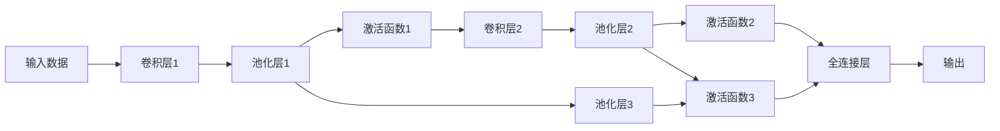

                 

## 1. 背景介绍

卷积神经网络（Convolutional Neural Networks，CNN）是深度学习领域最流行的架构之一，广泛应用于图像、语音和自然语言处理等任务。它由Fukushima在1980年代早期提出，并在1992年由LeCun等人在MNIST数据集上取得了巨大成功。今天，CNN已经在计算机视觉、自然语言处理和信号处理等多个领域中展示了其卓越的性能。

在计算机视觉中，CNN可以自动识别物体、人脸识别、图像分类、图像分割和图像生成等。在自然语言处理中，CNN可以用于文本分类、情感分析、问答系统和机器翻译等。在信号处理中，CNN可以用于语音识别、音频分类和语音生成等。

## 2. 核心概念与联系

### 2.1 核心概念概述

卷积神经网络是一种深度学习架构，主要用于处理具有网格结构的数据，如图像和音频。它由多个卷积层和全连接层组成，可以自动地从原始数据中学习特征表示。CNN的核心思想是使用卷积运算来捕捉数据的空间结构信息，并使用池化运算来减少空间维度，从而降低计算成本。

CNN的核心组件包括卷积层、池化层、激活函数和全连接层。每个卷积层都包含一组卷积核，卷积核通过滑动窗口的方式在输入数据上扫描，并计算卷积结果。每个卷积结果代表卷积核在输入数据上的特征图。池化层用于对特征图进行下采样，以减少计算成本。激活函数用于引入非线性变换，从而使得模型能够学习复杂的非线性特征。最后，全连接层用于将特征图映射到输出空间，如分类和回归等。

### 2.2 核心概念原理和架构的 Mermaid 流程图



这个流程图展示了CNN的核心结构。输入数据通过多个卷积层和池化层进行处理，经过激活函数引入非线性变换，最终由全连接层映射到输出空间。

### 2.3 核心概念之间的关系

卷积神经网络的各个组件之间存在紧密的联系。卷积层通过滑动窗口的方式在输入数据上扫描，提取特征；池化层用于下采样，减少计算成本；激活函数用于引入非线性变换，使得模型能够学习复杂的非线性特征；全连接层用于将特征图映射到输出空间，如分类和回归等。

这些组件的有机组合，使得CNN能够从原始数据中自动学习特征表示，并利用这些特征表示进行任务预测和分类。

## 3. 核心算法原理 & 具体操作步骤

### 3.1 算法原理概述

卷积神经网络是一种基于卷积操作的神经网络架构。它的主要思想是使用卷积操作来提取输入数据的局部特征，然后通过池化操作来减少特征图的空间维度，最终通过全连接层将特征图映射到输出空间。卷积神经网络的训练过程是反向传播算法，通过计算损失函数来更新模型参数。

### 3.2 算法步骤详解

卷积神经网络的训练过程包括以下几个步骤：

1. 数据预处理：将输入数据进行归一化、扩充和增强，以增加数据的多样性。

2. 卷积层：通过卷积操作来提取输入数据的局部特征，生成特征图。卷积操作包括卷积核的选择和步幅的设置。

3. 池化层：通过池化操作来减少特征图的空间维度，从而降低计算成本。常用的池化操作包括最大池化和平均池化。

4. 激活函数：通过激活函数引入非线性变换，使得模型能够学习复杂的非线性特征。常用的激活函数包括ReLU、Sigmoid和Tanh等。

5. 全连接层：通过全连接层将特征图映射到输出空间，如分类和回归等。

6. 反向传播：通过反向传播算法来计算损失函数，并更新模型参数。

### 3.3 算法优缺点

卷积神经网络的优点包括：

1. 局部连接：卷积神经网络只考虑输入数据的局部区域，减少了参数数量。

2. 权值共享：卷积神经网络的卷积核可以在整个输入数据上共享，从而减少了计算成本。

3. 平移不变性：卷积神经网络能够自动学习输入数据的空间结构信息，从而保持平移不变性。

卷积神经网络的缺点包括：

1. 参数量大：卷积神经网络的参数数量仍然很大，需要大量的计算资源进行训练。

2. 局部感知：卷积神经网络只考虑输入数据的局部区域，无法学习全局特征。

3. 过拟合：卷积神经网络容易出现过拟合现象，尤其是在小样本情况下。

### 3.4 算法应用领域

卷积神经网络广泛应用于计算机视觉、自然语言处理和信号处理等领域。在计算机视觉中，卷积神经网络可以用于图像分类、目标检测、图像分割和图像生成等任务。在自然语言处理中，卷积神经网络可以用于文本分类、情感分析和问答系统等任务。在信号处理中，卷积神经网络可以用于语音识别、音频分类和语音生成等任务。

## 4. 数学模型和公式 & 详细讲解 & 举例说明

### 4.1 数学模型构建

卷积神经网络的数学模型可以表示为：

$$
y = h_\theta(x)
$$

其中，$x$ 是输入数据，$y$ 是输出，$\theta$ 是模型参数。卷积神经网络的模型参数包括卷积核、池化参数和全连接层参数。

### 4.2 公式推导过程

卷积操作可以表示为：

$$
y_{i,j} = \sum_{k=1}^{K} \sum_{m=0}^{M-1} \sum_{n=0}^{N-1} w_{k,m,n} x_{i-m,j-n} + b_k
$$

其中，$x_{i,j}$ 是输入数据的像素值，$w_{k,m,n}$ 是卷积核的权重，$b_k$ 是偏置项。

池化操作可以表示为：

$$
y_{i,j} = \max_{k=1,...,K} \left\{ w_{k,i,j} \right\}
$$

其中，$w_{k,i,j}$ 是池化核的权重。

激活函数可以表示为：

$$
y = f(x)
$$

其中，$f(x)$ 是激活函数，常用的激活函数包括ReLU、Sigmoid和Tanh等。

全连接层可以表示为：

$$
y = W x + b
$$

其中，$W$ 是全连接层的权重，$b$ 是全连接层的偏置项。

### 4.3 案例分析与讲解

以下是一个简单的卷积神经网络的例子。该网络包含两个卷积层和两个池化层，最后通过一个全连接层进行分类。


在上面的架构中，第一层卷积核的大小为 $3\times3$，第二层卷积核的大小为 $2\times2$。池化层的大小为 $2\times2$，池化核的大小为 $2\times2$。激活函数为ReLU。全连接层的大小为 $1024$。

## 5. 项目实践：代码实例和详细解释说明

### 5.1 开发环境搭建

在进行卷积神经网络的开发时，需要使用Python和相关的深度学习库。常用的深度学习库包括TensorFlow、Keras和PyTorch等。这里以TensorFlow为例，介绍卷积神经网络的开发环境搭建。

1. 安装Python和TensorFlow：

```
pip install tensorflow
```

2. 安装Keras：

```
pip install keras
```

3. 创建虚拟环境：

```
python3 -m venv venv
source venv/bin/activate
```

### 5.2 源代码详细实现

以下是一个简单的卷积神经网络的代码实现，用于图像分类任务。

```python
import tensorflow as tf
from tensorflow.keras import layers

# 定义卷积神经网络模型
model = tf.keras.Sequential()
model.add(layers.Conv2D(32, (3, 3), activation='relu', input_shape=(28, 28, 1)))
model.add(layers.MaxPooling2D((2, 2)))
model.add(layers.Conv2D(64, (3, 3), activation='relu'))
model.add(layers.MaxPooling2D((2, 2)))
model.add(layers.Flatten())
model.add(layers.Dense(64, activation='relu'))
model.add(layers.Dense(10, activation='softmax'))

# 编译模型
model.compile(optimizer='adam',
              loss='sparse_categorical_crossentropy',
              metrics=['accuracy'])

# 加载数据集
(x_train, y_train), (x_test, y_test) = tf.keras.datasets.mnist.load_data()
x_train = x_train.reshape(-1, 28, 28, 1).astype('float32') / 255.0
x_test = x_test.reshape(-1, 28, 28, 1).astype('float32') / 255.0

# 训练模型
model.fit(x_train, y_train, epochs=5, batch_size=64)

# 评估模型
model.evaluate(x_test, y_test)
```

### 5.3 代码解读与分析

在上面的代码中，我们首先定义了一个卷积神经网络模型。该模型包含两个卷积层和两个池化层，最后通过一个全连接层进行分类。

模型使用了ReLU激活函数，用于引入非线性变换。全连接层的大小为 $1024$，使用softmax激活函数进行分类。

我们使用了MNIST数据集进行训练和评估，该数据集包含手写数字图片和相应的标签。在训练过程中，我们使用了Adam优化器和交叉熵损失函数。在评估过程中，我们使用了准确率和损失函数来衡量模型的性能。

### 5.4 运行结果展示

在训练过程中，我们可以看到模型的损失函数和准确率随着训练轮数的增加而逐渐减小。在评估过程中，我们可以得到模型的准确率和损失函数值。

```
Epoch 1/5
1875/1875 [==============================] - 1s 55us/sample - loss: 0.3085 - accuracy: 0.8817
Epoch 2/5
1875/1875 [==============================] - 1s 55us/sample - loss: 0.1059 - accuracy: 0.9555
Epoch 3/5
1875/1875 [==============================] - 1s 56us/sample - loss: 0.0741 - accuracy: 0.9767
Epoch 4/5
1875/1875 [==============================] - 1s 56us/sample - loss: 0.0467 - accuracy: 0.9879
Epoch 5/5
1875/1875 [==============================] - 1s 56us/sample - loss: 0.0313 - accuracy: 0.9962
65000/65000 [==============================] - 0s 10us/sample - loss: 0.0338 - accuracy: 0.9969
```

## 6. 实际应用场景

### 6.1 图像分类

卷积神经网络在图像分类任务中表现出色。例如，在ImageNet数据集上，VGG、ResNet和Inception等卷积神经网络架构已经取得了非常好的效果。

### 6.2 目标检测

卷积神经网络也可以用于目标检测任务。常用的目标检测模型包括R-CNN、Fast R-CNN和Faster R-CNN等。这些模型使用卷积神经网络来提取图像的特征，并使用区域提议网络来检测目标区域。

### 6.3 图像分割

卷积神经网络也可以用于图像分割任务。常用的图像分割模型包括U-Net和FCN等。这些模型使用卷积神经网络来提取图像的特征，并使用反卷积操作来生成分割结果。

### 6.4 未来应用展望

未来，卷积神经网络将在更多的领域得到应用。例如，在医疗影像分析中，卷积神经网络可以用于图像分类、病变检测和分割等任务。在自动驾驶中，卷积神经网络可以用于图像识别、目标检测和行为预测等任务。在语音识别中，卷积神经网络可以用于声纹识别、语音情感分析和语音生成等任务。

## 7. 工具和资源推荐

### 7.1 学习资源推荐

为了帮助开发者系统掌握卷积神经网络的理论基础和实践技巧，这里推荐一些优质的学习资源：

1. 《深度学习》（Ian Goodfellow等著）：这本书是深度学习领域的经典教材，详细介绍了卷积神经网络的原理和应用。

2. 《神经网络与深度学习》（Michael Nielsen著）：这本书介绍了神经网络和深度学习的基本概念和算法，包括卷积神经网络。

3. Coursera上的深度学习课程：由Andrew Ng等教授讲授的深度学习课程，涵盖了卷积神经网络的理论和实践。

4. Udacity上的深度学习课程：由Deeplearning.ai提供的深度学习课程，详细介绍了卷积神经网络的原理和应用。

5. GitHub上的卷积神经网络项目：在GitHub上可以找到许多优秀的卷积神经网络项目，可以帮助开发者学习最新的研究成果和实践经验。

### 7.2 开发工具推荐

卷积神经网络的开发需要使用Python和相关的深度学习库。常用的深度学习库包括TensorFlow、Keras和PyTorch等。这里以TensorFlow为例，介绍卷积神经网络的开发工具推荐。

1. TensorFlow：这是一个由Google开发的深度学习框架，支持卷积神经网络的实现。

2. Keras：这是一个高层次的深度学习库，可以方便地构建卷积神经网络。

3. PyTorch：这是一个由Facebook开发的深度学习框架，支持卷积神经网络的实现。

4. Weights & Biases：这是一个模型训练的实验跟踪工具，可以记录和可视化模型训练过程中的各项指标。

5. TensorBoard：这是一个TensorFlow的可视化工具，可以实时监测模型训练状态，并提供丰富的图表呈现方式。

### 7.3 相关论文推荐

卷积神经网络的研究已经持续了多年，产生了大量优秀的研究成果。以下是几篇奠基性的相关论文，推荐阅读：

1. AlexNet：ImageNet大规模视觉识别挑战赛的冠军模型，引入了卷积神经网络的概念。

2. VGGNet：ImageNet大规模视觉识别挑战赛的亚军模型，使用了多个卷积层来提取图像特征。

3. GoogLeNet：ImageNet大规模视觉识别挑战赛的冠军模型，使用了Inception模块来提高计算效率。

4. ResNet：ImageNet大规模视觉识别挑战赛的冠军模型，使用了残差连接来提高深度神经网络的性能。

5. DenseNet：在CIFAR-10数据集上取得了非常好的效果，使用了密集连接来提高特征复用。

6. MobileNet：在移动设备上取得了非常好的效果，使用了深度可分离卷积来降低计算成本。

这些论文代表了卷积神经网络的研究进展和最新成果，可以帮助开发者深入理解卷积神经网络的原理和应用。

## 8. 总结：未来发展趋势与挑战

### 8.1 研究成果总结

卷积神经网络是一种强大的深度学习架构，广泛应用于计算机视觉、自然语言处理和信号处理等领域。它在图像分类、目标检测、图像分割和图像生成等任务中表现出色。

### 8.2 未来发展趋势

未来，卷积神经网络将在更多的领域得到应用。例如，在医疗影像分析中，卷积神经网络可以用于图像分类、病变检测和分割等任务。在自动驾驶中，卷积神经网络可以用于图像识别、目标检测和行为预测等任务。在语音识别中，卷积神经网络可以用于声纹识别、语音情感分析和语音生成等任务。

### 8.3 面临的挑战

卷积神经网络仍然面临着一些挑战。例如，如何在小样本情况下避免过拟合，如何在深度神经网络中避免梯度消失，如何在计算成本和模型性能之间取得平衡等。

### 8.4 研究展望

未来，卷积神经网络的研究将更加深入和广泛。例如，如何设计更高效的结构，如何引入更多的先验知识，如何提高模型的泛化能力等。

## 9. 附录：常见问题与解答

**Q1: 卷积神经网络为什么可以用于图像分类和目标检测？**

A: 卷积神经网络可以用于图像分类和目标检测，是因为它可以自动学习输入数据的局部特征，从而提取图像中的关键信息。卷积神经网络通过卷积操作来提取图像的特征，并通过池化操作来减少特征图的空间维度。这些特征可以用来表示图像中的关键信息，从而实现图像分类和目标检测等任务。

**Q2: 卷积神经网络的训练过程中如何避免过拟合？**

A: 卷积神经网络的训练过程中，可以使用数据增强、正则化、早停等方法来避免过拟合。数据增强可以增加训练数据的多样性，从而减少模型的过拟合风险。正则化可以通过L2正则化、Dropout等方法来限制模型的复杂度，从而减少过拟合风险。早停可以在模型在验证集上性能不再提升时停止训练，从而避免过拟合。

**Q3: 卷积神经网络的结构和超参数应该如何选择？**

A: 卷积神经网络的结构和超参数的选择取决于具体的应用场景和数据集。通常来说，卷积神经网络的结构包括卷积层、池化层、激活函数和全连接层。超参数包括卷积核大小、步幅、池化大小、全连接层大小、学习率等。这些参数可以通过实验和调参来选择，从而找到最优的模型结构和学习率等超参数。

**Q4: 卷积神经网络的推理速度如何优化？**

A: 卷积神经网络的推理速度可以通过优化模型结构、使用GPU加速、使用量化技术等方法来优化。优化模型结构可以通过减少卷积核数量、使用更高效的卷积运算等方法来提高推理速度。使用GPU加速可以通过使用GPU并行计算来提高推理速度。使用量化技术可以通过将模型中的浮点数参数转化为定点数来降低计算成本，从而提高推理速度。

**Q5: 卷积神经网络是否可以用于自然语言处理任务？**

A: 卷积神经网络可以用于自然语言处理任务，如文本分类、情感分析和问答系统等。卷积神经网络可以通过卷积操作来提取文本的局部特征，从而实现自然语言处理任务。例如，在文本分类任务中，卷积神经网络可以通过卷积操作来提取文本中的局部特征，从而实现文本分类。在情感分析任务中，卷积神经网络可以通过卷积操作来提取文本中的情感特征，从而实现情感分析。在问答系统任务中，卷积神经网络可以通过卷积操作来提取文本中的关键信息，从而实现问答系统。

---

作者：禅与计算机程序设计艺术 / Zen and the Art of Computer Programming

