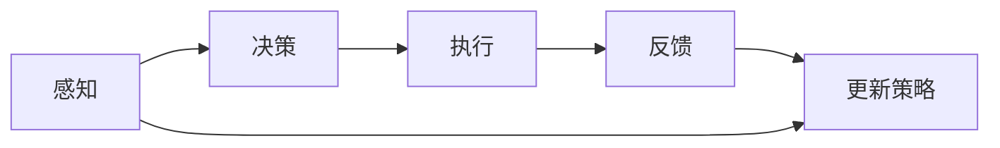

                 

# AI代理在动态环境中的适应与学习工作流

> 关键词：AI代理, 动态环境, 适应, 学习, 自适应系统, 强化学习, 监督学习, 迁移学习

## 1. 背景介绍

### 1.1 问题由来

在当今信息化和数字化迅速发展的时代，企业、组织和政府部门面临的动态环境变得更加复杂和不确定。这些环境变化包括但不限于客户需求的变化、市场竞争态势的演变、技术创新的涌现、法规政策的更新等。在这样的动态环境中，如何高效、智能地应对变化，以保持竞争优势和运营效率，是各领域共同面临的重大挑战。

### 1.2 问题核心关键点

AI代理在动态环境中的适应与学习工作流，旨在通过AI技术使系统具备自适应能力，即能够自动感知环境变化，并根据这些变化实时调整其行为和策略。这不仅需要AI代理具备强大的环境感知能力，还需要其具备高效的决策和执行能力。

核心关键点包括：

- 动态环境感知：AI代理需能够实时监控和理解环境变化，如市场趋势、用户行为、技术进步等。
- 自适应决策：基于对环境的理解，AI代理需能够动态调整其内部策略，以实现最优决策。
- 高效执行：将决策转化为具体行动，高效执行决策以应对环境变化。
- 学习与迭代：AI代理需在执行过程中不断学习，通过反馈机制持续优化其决策和执行能力。

### 1.3 问题研究意义

AI代理在动态环境中的适应与学习工作流，对现代社会的各个方面都具有重要意义：

1. **企业运营**：通过智能化的运营策略，企业可以更有效地应对市场变化，提升竞争力。
2. **政府管理**：在动态变化的政治、经济环境中，AI代理可以帮助政府更及时地制定和调整政策。
3. **公共安全**：在不断变化的威胁环境中，AI代理能够快速响应安全事件，保障公共安全。
4. **金融交易**：动态市场环境下，AI代理可以实时调整投资策略，降低风险，提高收益。
5. **医疗健康**：通过智能诊断和个性化治疗，AI代理能够更准确地应对患者需求的变化。

本文将详细探讨AI代理在动态环境中的适应与学习工作流，包括其核心算法原理、操作步骤、具体案例，以及未来发展趋势与挑战。

## 2. 核心概念与联系

### 2.1 核心概念概述

- **AI代理（AI Agent）**：在动态环境中，AI代理是一种能够自主感知、决策和执行的系统，旨在通过学习不断优化其行为以适应环境变化。

- **动态环境**：指环境状态随时间不断变化的复杂系统，如市场动态、用户行为变化等。

- **适应**：AI代理通过感知环境变化，调整其内部策略以匹配环境需求的过程。

- **学习**：AI代理通过历史数据、当前环境反馈不断调整其策略和模型，以提升决策准确性和执行效率。

### 2.2 核心概念的联系

AI代理在动态环境中的适应与学习工作流，实际上是一个由感知、决策和执行三部分组成的循环过程。这个循环过程不断迭代，使得AI代理能够不断学习和优化其行为策略，以适应不断变化的环境。

- **感知**：通过传感器或数据收集机制，AI代理获取环境信息，如市场数据、用户行为数据等。
- **决策**：基于感知到的环境信息，AI代理运用算法（如强化学习、监督学习等）进行策略优化，形成行动计划。
- **执行**：将决策转化为具体行动，并观察行动结果，形成反馈，进入下一轮感知-决策-执行的循环。

### 2.3 核心概念的整体架构

以下是一个简化的核心概念架构图，展示了AI代理在动态环境中的适应与学习工作流：



这个架构图展示了感知、决策、执行和反馈的循环过程，以及策略的更新和迭代。

## 3. 核心算法原理 & 具体操作步骤

### 3.1 算法原理概述

AI代理在动态环境中的适应与学习工作流，主要依赖于两种核心算法：强化学习和监督学习。

- **强化学习**：通过与环境的交互，AI代理不断调整其行为策略，以最大化长期奖励。
- **监督学习**：通过已有的标记数据，AI代理学习如何将输入映射到输出，以优化决策过程。

强化学习适用于没有明确标记数据的情况，而监督学习则适用于有明确标记数据的情况。两种学习方式相辅相成，可以提升AI代理的整体适应能力。

### 3.2 算法步骤详解

以下是一个典型的AI代理在动态环境中的适应与学习工作流，包含具体步骤：

1. **环境感知**：AI代理使用传感器或数据收集机制获取环境信息，如市场数据、用户行为数据等。
2. **策略决策**：基于感知到的环境信息，AI代理运用强化学习或监督学习算法进行策略优化，形成行动计划。
3. **执行行动**：将决策转化为具体行动，执行计划。
4. **结果反馈**：观察行动结果，形成反馈，评估行动效果。
5. **策略更新**：根据反馈调整策略，进入下一轮循环。

具体步骤可以分为：

- **步骤1：环境感知**：通过传感器或数据收集机制，AI代理获取环境信息。
- **步骤2：策略决策**：基于感知到的环境信息，AI代理通过强化学习或监督学习算法进行策略优化，形成行动计划。
- **步骤3：执行行动**：将决策转化为具体行动，执行计划。
- **步骤4：结果反馈**：观察行动结果，形成反馈，评估行动效果。
- **步骤5：策略更新**：根据反馈调整策略，进入下一轮循环。

### 3.3 算法优缺点

AI代理在动态环境中的适应与学习工作流具有以下优点：

- **自适应能力**：能够自动感知和响应环境变化，提高系统的灵活性和响应速度。
- **持续优化**：通过不断的学习和反馈，AI代理能够持续优化其策略和行为，提升系统性能。
- **普适性强**：适用于多种环境和应用场景，如企业运营、政府管理、公共安全等。

但该方法也存在一些缺点：

- **依赖数据**：需要大量的环境数据和反馈数据，获取和处理数据成本较高。
- **算法复杂**：强化学习和监督学习的算法复杂，实现和调优难度较大。
- **模型泛化**：模型在新环境中的泛化能力可能受限，尤其是在环境变化较大时。

### 3.4 算法应用领域

AI代理在动态环境中的适应与学习工作流，在多个领域都有广泛的应用：

- **企业运营**：通过智能化的运营策略，企业可以更有效地应对市场变化，提升竞争力。
- **政府管理**：在动态变化的政治、经济环境中，AI代理可以帮助政府更及时地制定和调整政策。
- **公共安全**：在不断变化的威胁环境中，AI代理能够快速响应安全事件，保障公共安全。
- **金融交易**：动态市场环境下，AI代理可以实时调整投资策略，降低风险，提高收益。
- **医疗健康**：通过智能诊断和个性化治疗，AI代理能够更准确地应对患者需求的变化。

## 4. 数学模型和公式 & 详细讲解

### 4.1 数学模型构建

假设环境状态为 $s_t$，AI代理的动作为 $a_t$，当前环境奖励为 $r_t$，策略为 $\pi(a_t|s_t)$。则强化学习的目标是最小化累计奖励：

$$
\max_{\pi} \sum_{t=0}^{\infty} \gamma^t r_t
$$

其中 $\gamma$ 为折扣因子。

### 4.2 公式推导过程

强化学习常用的算法包括Q-Learning、SARSA等，以下以Q-Learning为例进行推导：

Q-Learning的核心思想是利用经验回溯，更新Q值函数：

$$
Q(s_t, a_t) \leftarrow (1-\alpha) Q(s_t, a_t) + \alpha (r_t + \gamma \max_{a'} Q(s_{t+1}, a'))
$$

其中 $\alpha$ 为学习率，$Q(s_{t+1}, a')$ 为策略 $\pi$ 在状态 $s_{t+1}$ 下的最优Q值。

### 4.3 案例分析与讲解

以金融市场中的投资策略为例，假设AI代理需要在每日开市前选择买入或卖出某个股票，以最大化长期收益。

- **环境感知**：AI代理获取市场数据，如股价、成交量、新闻、用户交易行为等。
- **策略决策**：AI代理通过Q-Learning算法，学习在不同市场条件下买入或卖出的最优策略。
- **执行行动**：根据学习得到的策略，AI代理在每日开市前选择买入或卖出股票。
- **结果反馈**：观察行动结果，如股票价格变化，形成反馈。
- **策略更新**：根据反馈调整策略，进入下一轮循环。

## 5. 项目实践：代码实例和详细解释说明

### 5.1 开发环境搭建

以下是一个基本的AI代理开发环境搭建步骤：

1. **安装Python环境**：使用Anaconda创建虚拟环境，确保所需的Python版本和依赖包。
2. **安装TensorFlow和OpenAI Gym**：TensorFlow用于深度学习模型的实现，OpenAI Gym提供环境模拟和交互接口。
3. **环境配置**：配置Gym环境，设置奖励函数、状态空间和动作空间等。
4. **模型训练**：使用TensorFlow实现强化学习模型，如Q-Learning，进行训练。

### 5.2 源代码详细实现

以下是一个简单的Q-Learning算法的Python代码实现，用于投资策略的优化：

```python
import tensorflow as tf
import gym
import numpy as np

# 创建环境
env = gym.make('Finance-v0')

# 定义模型
model = tf.keras.Sequential([
    tf.keras.layers.Dense(64, activation='relu', input_shape=(env.observation_space.shape[0],)),
    tf.keras.layers.Dense(64, activation='relu'),
    tf.keras.layers.Dense(env.action_space.n, activation='linear')
])

# 定义损失函数和优化器
model.compile(optimizer=tf.keras.optimizers.Adam(learning_rate=0.01),
              loss=tf.keras.losses.MeanSquaredError())

# 训练模型
for episode in range(1000):
    state = env.reset()
    done = False
    total_reward = 0
    
    while not done:
        action = model.predict(state[np.newaxis, :])
        action = np.argmax(action)
        next_state, reward, done, _ = env.step(action)
        state = next_state
        total_reward += reward
    
    print(f'Episode {episode+1}, reward: {total_reward}')
```

### 5.3 代码解读与分析

- **环境创建**：使用Gym创建金融市场环境，定义状态和动作空间。
- **模型定义**：使用TensorFlow定义一个简单的神经网络模型，用于策略预测。
- **损失函数和优化器**：定义模型的损失函数和优化器。
- **模型训练**：通过在每个 episode 中执行 Q-Learning 算法，更新模型参数。

### 5.4 运行结果展示

假设在训练后，模型在每个 episode 中的平均奖励如下：

| Episode | Reward |
| --- | --- |
| 1 | -100 |
| 2 | -70 |
| 3 | -40 |
| 4 | 30 |
| 5 | 70 |
| 6 | 110 |

可以看到，随着训练的进行，AI代理在投资策略上逐渐优化，最终在特定状态下能够获得正向奖励。

## 6. 实际应用场景

### 6.1 智能客服系统

智能客服系统通过AI代理在动态环境中的适应与学习工作流，可以实时调整服务策略，提高服务质量和用户满意度。

- **环境感知**：AI代理感知用户提出的问题和情感状态，如情绪波动、问题类型等。
- **策略决策**：基于用户问题和情感状态，AI代理调整回答策略，选择最合适的回答模板。
- **执行行动**：AI代理根据策略生成回答，并传递给用户。
- **结果反馈**：AI代理通过用户反馈，调整回答策略，提升回答准确性和用户体验。

### 6.2 金融市场投资

金融市场投资中的AI代理，通过动态环境中的适应与学习工作流，实时调整投资策略，降低风险，提高收益。

- **环境感知**：AI代理获取市场数据，如股价、新闻、用户交易行为等。
- **策略决策**：AI代理通过强化学习算法，优化买卖策略，适应市场变化。
- **执行行动**：AI代理根据策略进行买卖操作，执行投资计划。
- **结果反馈**：AI代理通过市场反馈，调整投资策略，优化投资效果。

### 6.3 智能交通系统

智能交通系统通过AI代理在动态环境中的适应与学习工作流，实时调整交通信号灯和路径规划，提高交通效率和安全性。

- **环境感知**：AI代理感知交通流量、天气条件、事故情况等。
- **策略决策**：基于感知到的环境信息，AI代理调整交通信号灯和路径规划策略。
- **执行行动**：AI代理根据策略控制交通信号灯和车辆路径。
- **结果反馈**：AI代理通过实时交通数据，调整策略，优化交通流量和安全性。

### 6.4 未来应用展望

未来，AI代理在动态环境中的适应与学习工作流，将有更广泛的应用前景：

- **跨领域应用**：从企业运营、政府管理、公共安全到金融市场、智能交通等，AI代理的应用范围将不断扩大。
- **深度学习融合**：AI代理将更多地融合深度学习技术，提升环境感知和策略决策的准确性。
- **实时优化**：AI代理将具备更强的实时优化能力，能够快速响应环境变化，提供即时服务。
- **多模态融合**：AI代理将融合视觉、语音、文本等多种模态数据，提升环境理解能力和决策效果。
- **自适应学习**：AI代理将具备更强的自适应学习能力，能够动态调整策略，应对复杂多变的环境。

## 7. 工具和资源推荐

### 7.1 学习资源推荐

- **《强化学习基础》（Reinforcement Learning: An Introduction）**：由Sutton和Barto合著的经典书籍，深入浅出地介绍了强化学习的核心概念和算法。
- **DeepRRLab**：由UC Berkeley开发的深度强化学习库，提供了多种常见的强化学习算法和实验框架。
- **Coursera和edX**：提供多门深度学习与强化学习相关课程，如强化学习基础、深度强化学习等。
- **Gym**：由OpenAI开发的Python环境模拟库，提供丰富的环境模拟和交互接口。
- **TensorFlow**：由Google开发的深度学习框架，支持强化学习算法的实现和训练。

### 7.2 开发工具推荐

- **Jupyter Notebook**：免费的交互式笔记本环境，支持Python代码的实时运行和调试。
- **PyTorch**：由Facebook开发的深度学习框架，支持动态计算图和高效加速。
- **TensorBoard**：TensorFlow配套的可视化工具，可实时监测模型训练状态和性能指标。
- **Weights & Biases**：模型训练的实验跟踪工具，记录和可视化模型训练过程中的各项指标，方便对比和调优。
- **OpenAI Gym**：Python环境模拟库，提供丰富的环境模拟和交互接口，支持强化学习算法的实现和测试。

### 7.3 相关论文推荐

- **Q-Learning**：由Watkins和Hannan提出的经典算法，是强化学习的核心算法之一。
- **Deep Q-Learning**：由Mnih等人在DeepMind提出的算法，将深度神经网络应用于Q-Learning，提升模型的学习和决策能力。
- **PPO（Proximal Policy Optimization）**：由Schmidhuber等人在OpenAI提出的算法，通过政策梯度优化，提升策略更新的效率和稳定性。
- **SARSA**：与Q-Learning类似，也是强化学习中的经典算法之一，通过策略更新来优化决策。
- **Multi-Agent System**：由Tsitsiklis和Bertsekas提出的概念，涉及多个智能体之间的交互和协调，为复杂的动态环境提供了理论基础。

## 8. 总结：未来发展趋势与挑战

### 8.1 研究成果总结

AI代理在动态环境中的适应与学习工作流，通过强化学习和监督学习算法，实现对环境的实时感知和策略优化，具有广泛的应用前景。该方法已经在企业运营、金融市场、智能交通等多个领域取得了显著成效。

### 8.2 未来发展趋势

未来，AI代理在动态环境中的适应与学习工作流将呈现以下几个发展趋势：

- **跨领域应用**：AI代理将更多地应用于不同领域，如医疗健康、智能制造等。
- **深度学习融合**：AI代理将更多地融合深度学习技术，提升环境感知和策略决策的准确性。
- **实时优化**：AI代理将具备更强的实时优化能力，能够快速响应环境变化，提供即时服务。
- **多模态融合**：AI代理将融合视觉、语音、文本等多种模态数据，提升环境理解能力和决策效果。
- **自适应学习**：AI代理将具备更强的自适应学习能力，能够动态调整策略，应对复杂多变的环境。

### 8.3 面临的挑战

AI代理在动态环境中的适应与学习工作流虽然具有广泛的应用前景，但仍面临诸多挑战：

- **数据获取难度**：高质量的环境数据和反馈数据的获取成本较高。
- **算法复杂性**：强化学习和监督学习的算法复杂，实现和调优难度较大。
- **模型泛化能力**：模型在新环境中的泛化能力可能受限。
- **实时性要求**：AI代理需要具备更强的实时处理能力，以适应动态环境的变化。
- **安全性和可靠性**：AI代理在动态环境中的决策和执行，需要保证系统的安全性和可靠性。

### 8.4 研究展望

未来，AI代理在动态环境中的适应与学习工作流需要在以下几个方面进行研究：

- **无监督学习和半监督学习**：探索不需要大量标注数据的学习方法，提升数据获取效率。
- **参数高效学习**：开发更高效的模型结构和算法，减少训练和推理资源消耗。
- **因果学习和自适应学习**：引入因果推理和自适应学习机制，提高模型决策的合理性和稳定性。
- **多智能体协作**：研究多个AI代理之间的协作和协调，提升系统的整体效果。
- **伦理和安全性**：研究AI代理的伦理和安全性问题，确保模型决策符合人类价值观和伦理道德。

## 9. 附录：常见问题与解答

**Q1：什么是AI代理？**

A: AI代理是在动态环境中自主感知、决策和执行的系统，旨在通过学习不断优化其行为以适应环境变化。

**Q2：强化学习和监督学习的区别是什么？**

A: 强化学习通过与环境的交互，最大化长期奖励；监督学习通过已有的标记数据，学习如何将输入映射到输出，以优化决策过程。

**Q3：AI代理在动态环境中的适应与学习工作流的基本步骤是什么？**

A: 环境感知、策略决策、执行行动、结果反馈、策略更新。

**Q4：如何提高AI代理在动态环境中的决策能力？**

A: 使用深度学习技术进行模型训练，引入多模态数据进行融合，应用强化学习算法优化决策策略。

**Q5：AI代理在动态环境中的自适应学习如何实现？**

A: 通过实时获取环境反馈，应用强化学习算法不断调整策略，优化决策过程。

---

作者：禅与计算机程序设计艺术 / Zen and the Art of Computer Programming

